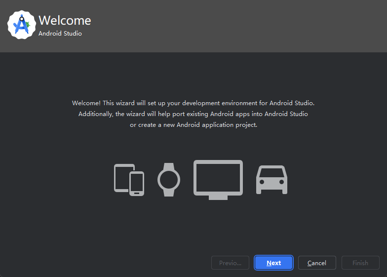
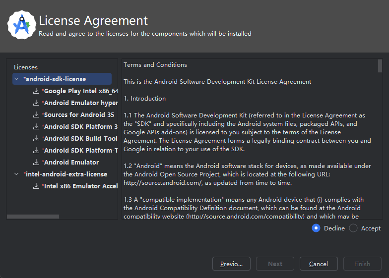
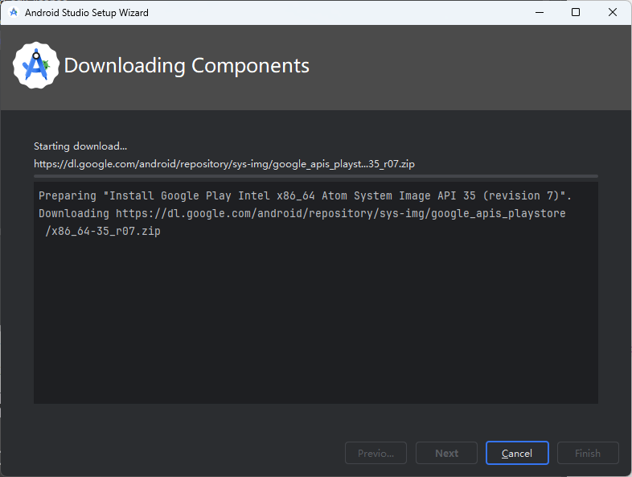

# 关于Android应用开发的研究笔记

## 配置应用开发环境

Android Studio是Android系统官方指定的IDE，它不仅包含了用于构建Android应用的软件开发工具包（Software Development Kit，简称SDK），还提供了用于调试该应用的虚拟机环境。是开发Android应用的首选工具。下面，让我们来介绍一下Android Studio的安装方法，其具体步骤如下。

1. 通过在搜索引擎中搜索“Android Studio”关键字来找到该IDE的官方下载页面（如图1所示），并在该页面中根据自己所在的操作系统选择下载相应的安装包，在这里，我们选择的是基于Windows系统的版本。

    

    **图1**：Android Studio的官方下载页面

2. 待下载完成之后，读者需要通过启动该安装包来进入到用于安装Android Studio的图形化向导中，该向导的界面如图2所示。

    

    **图2**：Android Studio的安装向导

3. 在上述安装向导中，读者对于大部分安装配置都只需直接用鼠标左键单击「Next」按钮即可，只有在最后设置软件的安装路径时（如图3所示），如果读者使用的是Windows系统，应注意尽量不要将其设置在系统分区（即C盘）中，因为该软件不仅本身体积巨大，而且还会随着后期所安装的各种组件不断膨胀，这有可能会导致Windows系统因其所在分区的空间不足而崩溃。在这里，我们选择将Android Studio安装到D盘。

    

    **图3**：Android Studio的安装路径

4. 在用鼠标左键单击上述界面中的「Next」按钮之后，该安装向导就会自动完成接下来的所有操作，它在整个安装过程完成后，就会自行启动Android SDK的配置向导程序，该向导的界面如图4所示。

    

    **图4**：Android SDK的配置向导

5. Android Studio在第一次启动时会继续引导用户安装Android的SDK。读者只需要用鼠标左键单击上述界面中的「Next」按钮就会进入到用于选择配置类型的界面中，如图5所示。

    

    **图5**：Android SDK的配置类型选择

6. 在上述界面中，笔者个人会倾向于选择「Custom」选项，以便能自行选择要安装的SDK组件。在用鼠标左键单击「Next」按钮之后，读者就会进入到如图6所示的组件安装界面中。

    

    **图6**：Android SDK的组件安装

7. 在上述界面中，读者需要在“android-sdk-license”和“Intel-android-extra-license”这两份组件的许可协议中选择「Accept」选项，并用鼠标左键单击「Finish」按钮即可开始相关组件的下载和安装操作，其安装进度界面如图7所示。

    

    **图7**：Android SDK的安装进度

8. 待上述安装过程顺利完成之后，如果读者重新启动Android Studio，该IDE成功进入到了如图8所示的项目管理界面中，就证明Android Studio已经成功安装完成了。在这里，为了更方便在书中展示Android Studio的界面，我们将其界面设置成了浅色的主题。

    

    **图8**：Android Studio的项目管理界面

