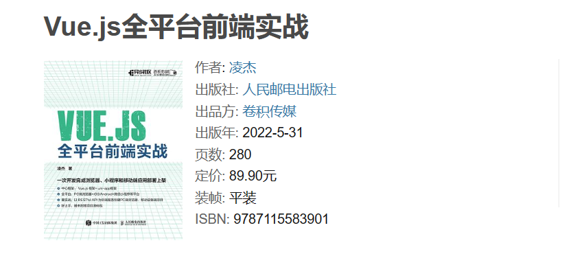

# 移动端应用开发的学习路线图

笔者曾经在[[Web 应用开发的学习路线图|关于 Web 项目开发的研究笔记]]中详细向大家介绍过浏览器-服务器（即Browser/Server，简称B/S）分布式架构，并以此为基础进一步学习了基于 B/S 架构来开发互联网应用的一系列前/后端解决方案。然而，对于现代企业级的互联网应用来说，仅仅有在 PC 端开发基于网络浏览器的前端解决方案是远远不够的，因为如今的人们更多时候是通过智能手机、平板电脑等移动设备来使用互联网应用的，所以，如何将应用的前端解决方案扩展至覆盖面更为广泛的客户机-服务器（Client/Server，简称C/S）架构，就成为了软件工程师们要面临的一个重要课题。在这篇笔记中，我们将先为读者介绍在移动设备上开发互联网应用的前端所要解决的问题以及相应的解决方案，然后以推荐书籍的形式规划相关的学习路线图，以供参考。

## 问题与解决方案

正如之前所说，以智能手机、平板电脑为代表的移动设备如今已经成为了人们使用互联网应用的主要途径。毕竟，与基于 B/S 架构和 Web 技术的前端实现相比，基于 C/S 架构的前端实现通常是一些直接运行在客户机上（包括移动设备和 PC）的应用软件，这种转变给基于移动设备的前端应用（以下简称移动端应用）带来了以下便利：

1. **更及时的信息收发**：与依赖于网页浏览器的Web前端相比，移动端应用能更好地利用操作系统提供的资源调度机制，从而更轻松地实现随时随地的信息收发，这种便利性让用户都能够更快速、更及时地发布或查阅自己所重视的信息。
2. **更面向用户的功能**：基于传统 Web 技术的浏览器端应用由于受到某些先天性的限制（例如HTTP协议的无状态连接特性，JavaScript脚本的单线程执行特性等），在性能或功能上会受到某种程度的限制，而直接运行在客户端上的应用软件则可以更为充分地使用设备上的计算资源，采用更丰富的网络连接方式，因而能更好地应对各种使用场景，提供更好的执行性能与更丰富的功能。
3. **更直接的访问入口**：在 PC 端浏览器上使用互联网应用时通常需要用户自己输入相应的 URL 或者依靠搜索引擎来访问，而安装在客户机上的移动端应用则往往只需要用户直接打开软件即可。

所以，为了更好地服务用户，如今几乎所有具备一定实力的企业和组织都会致力于开发能运行在移动设备上的前端应用，这就对当今的前端工程师们提出了新的挑战。与基于 PC 端网页浏览器的 Web 前端开发相比，前端工程师在开发移动端应用时所要面对的不同之处主要来自于用户界面设计与前后端通信这两个方面。下面，笔者就从这两个方面着手来简单介绍一下开发移动端应用要解决的问题：

- **屏幕适配问题**：在为移动端应用设计用户界面时，前端工程师首先要解决的是屏幕适配问题。在如今市场上，Apple、Google、华为等主流移动设备制造商在屏幕设计上可谓是五花八门、乱无章法，且不说不同设备制造商之间在屏幕的尺寸、纵横比、分辨率等参数各不相同，就连同一设备制造商在每一年推出同品牌系列的产品时的屏幕设计也都会存在些许差异[^1]。因此，前端工程师们必须要考虑如何让用户界面以某种自动感知的方式来适应各种移动设备的屏幕。
- **触控响应问题**：众所周知，在如今的移动端应用中，用户的操作绝大多数都是以触控操作方式来完成的，所以如何让用户界面以符合预期的方式来响应触控操作也成为了前端工程师在开发移动端应用时要面对的一个主要问题，这需要他们切实地了解如何让应用程序的用户界面像监听传统的鼠标和键盘事件一样监听触控屏幕上发生的单指或多指触控操作，并为其编写响应函数。
- **网络通信问题**：除了与用户界面设计相关的问题之外，前端工程师们在开发移动端应用时要面对的另一大挑战就是网络通信问题，因为移动端应用在与其后端服务器进行数据交换时往往需要基于某种网络协议来进行，这需要前端工程师充分了解自己所要使用的网络协议，并基于这些协议来设计前后端通信的解决方案。例如，如果我们想让移动端应用与Web前端共享同一个后端服务，那就得使用 HTTP 协议来进行通信，而 HTTP 协议本身是无状态的，这就意味着在移动端应用中，前端工程师们必须要考虑如何让应用程序在网络通信过程中保持其状态信息，并确保在网络通信过程中不会出现数据丢失或数据损坏的情况。

[^1]: 更详尽的数据请参考：`https://uiiiuiii.com/screen/`。

## 学习路线图规划

在了解了移动端开发要解决的主要问题之后，读者就可以根据这些问题来寻求开发移动端应用的解决方案了。到目前为止上，前端工程师们可以选择的解决方案主要有以下三种：

1. 使用 iOS/Android/HarmonyOS 等专用移动端操作系统提供的解决方案来开发移动端应用，这需要前端工程师们学习并使用这些专用操作系统平台指定的编程语言、开发框架以及集成开发环境。例如：
    - 如果读者想开发的是基于 iOS 系统的移动端应用，那么他就需要学习并使用 Objective-C 或 Swift 语言以及 Xcode 集成开发环境。为此，笔者会在这里会推荐他阅读以下书籍：
      - 《[iOS 编程](https://book.douban.com/subject/33431782/)》：这本书目前已经迭代到第 6 版，它基于 Objective-C 语言详细介绍了 iOS 开发中常用的各种技术。通过这本书的学习，读者将会了解如何使用 Xcode 集成开发环境来开发 iOS 应用，以及如何使用 Core Data 框架来管理 iOS 应用的数据。
      - 《[Swift 与 Cocoa 框架开发](https://book.douban.com/subject/26410821/)：这本书致力于介绍如何使用 Swift 语言开发出吸引人的 iOS 和 macOS 应用。通过这本书，读者将会学习到如何在各种真实的环境中使用 Swift，还有 EventKit 和 Core Animation 等 Cocoa 功能，并在此过程中理解 Swift 为什么是一门比 Objective-C 更适合开发 iOS 和 macOS 应用的编程语言。
      > 关联笔记：[[关于 iOS 项目开发的学习笔记]]

    - 如果读者想开发的是基于 Android 系统的移动端应用，那么他就需要学习并使用 Java 或 Kotlin 语言以及 Android Studio 集成开发环境。为此，那么笔者会在这里会推荐他阅读以下书籍：
      - 《[第一行代码：Android](https://book.douban.com/subject/26915433/)》：这本书被广大Android 开发者誉为“Android 学习第一书”。全书系统全面、循序渐进地介绍了Android软件开发的必备知识、经验和技巧。目前迭代到了第 3 版，它基于 Android 10.0 对所有知识点都在最新的 Android 系统上进行重新适配，并使用了全新的 Android Studio 开发工具代替之前的 Eclipse，并添加了对Material Design、运行时权限、Gradle、RecyclerView、百分比布局、OkHttp、Lambda 表达式等全新知识点的详细讲解。
      - 《[Kotlin 实战](https://book.douban.com/subject/35154598/)》：如果读者不想使用 Java 语言来开发Android 应用，那么这本书将会是你学习 Kotlin 这门编程语言的最佳选择之一。
      > 关联笔记：[[关于 Android 项目开发的学习笔记]]

    - 如果读者想开发的是基于 HarmonyOS 系统的移动端应用，那么他就需要学习并使用 ArkTS 语言以及 DevEco Studio 集成开发环境。
      > 关联笔记：[[关于 HarmonyOS 项目开发的学习笔记]]

2. 使用支付宝、微信、字节跳动等小程序平台提供的解决方案来开发移动端应用，这需要前端工程师们学习并使用这些小程序平台指定的编程语言、标记语言以及开发工具。例如：

    - 如果读者想开发的是基于支付宝小程序平台提供的解决方案来开发移动端应用，那么他就需要学习并使用 JavaScript 编程语言、AXML 界面标记语言、ACSS 样式标记语言以及支付宝开发者工具。
    - 如果读者想开发的是基于微信小程序平台提供的解决方案来开发移动端应用，那么他就需要学习并使用 JavaScript 编程语言、WXML界面标记语言、WXSS样式标记语言以及微信小程序开发工具。
    - 如果读者想开发的是基于字节跳动小程序平台提供的解决方案来开发移动端应用，那么他就需要学习并使用 JavaScript 编程语言、TTML 界面标记语言、TCSS 样式标记语言以及字节跳动小程序开发工具。
  
    在这里，那么最好的学习资料应该是它们各自提供的官方文档，当然了，如果读者更喜欢通过读书的方式来学习，也可以选择阅读以下书籍：

   - 《[微信小程序开发入门与实践](https://book.douban.com/subject/27661869/)》
   - 《[支付宝小程序开发实战](https://book.douban.com/subject/30379614/)》

    > 关联笔记：[[关于微信小程序开发的学习笔记]]

3. 使用基于 HTML5+CSS3+JavaScript 技术开发的第三方通用框架来开发移动端应用，这需要前端工程师们学习并使用笔者之前在[[Web 应用开发的学习路线图|关于 Web 项目开发的研究笔记]]中介绍过的 HTML5、CSS3、JavaScript 语言以及 uni-app、Taro 等通用框架。关于针对这些框架的学习，笔者会在这里会建议读者先阅读一下与 Vue.js、React.js 等框架相关的书籍（因为它们通常是通用性移动端开发框架的基础），然后再借助这些框架提供的官方文档来学习这种移动端应用的开发方式。

    > 关联笔记：
    >
    > - [[关于 uni-app 框架学习笔记]]
    > - [[关于 React Native 框架的学习笔记]]
    > - [[关于 Taro 框架的学习笔记]]

   另外，笔者个人在 2022 年曾出版过一本名为[《Vue.js 全平台前端实战》](https://book.douban.com/subject/35886403/)的小书，其中的第二部分也详细介绍了如何使用基于 Vue.js 开发的uni-app 框架来开发移动端应用，如有兴趣也可试读之。

当然了，这就也意味着人们在开发移动端应用时必须要做一个选择：就是选择基于 Web 技术来开发跨平台的前端实现，还是重点选择几个主流的移动端平台专门为其编写独立的前端实现。无论最终做出怎样的选择，我们都要在应用程序的目标市场与开发成本之间做一些取舍。例如，如果我们想使用基于 Web 技术的通用框架，那么在享受一次开发、多端部署所带来的便利之余，也必须要面对此类移动端应用发挥不出其相对于 Web 前端应用的优势所带来的遗憾。同样的，如果我们想基于特定的平台来开发移动端应用，那么在享受其相对于通用框架而言的性能优势的同时，也必须要为此付出额外的学习与开发成本。

----
#持续更新中
