# Zettelkasten 方法简介

> **文献说明：**
>
> - 文献出处：[Introduction to the Zettelkasten Method](https://zettelkasten.de/introduction/)；
> - 参考翻译：[知乎用户 ConanXin 翻译的文章](https://zhuanlan.zhihu.com/p/299377905)；
> - 笔记工作：调整文章结构、改善翻译质量；
>   

## 为什么要读这篇文献？

==Zettelkasten（中文译为：卡片笔记写作法）不仅仅是完成一些工作或项目的工具，同时还是一种关于如何处理生活中知识的整体方法（holistic method），是人们在知识工作领域努力的放大器（amplifier）==。它非常有效，许多人说他们用得很开心，有些人甚至将其与《魔兽世界》等令人上瘾的游戏相提并论。当然了，这种体验只能是投入持续努力的结果，毕竟 Zettelkasten 方法是需要进行一些练习的。在练习之初，我们甚至还会觉得自己做的没什么用，但只要持之以恒地练习，这一方法就会给我们带来惊喜，并产生知识的瑰宝。

这篇介绍性的文献将会引导你迈出卓越的第一步，并沿着这条路走下去，Zettelkasten 将为你提供智力成长的工具。

如果要向一个不熟悉 Zettelkasten 概念的人解释这种方法论，我会这样描述:

> Zettelkasten 是一个用于辅助思考（thinking）和写作的个人工具，它有超文本的特征，使思想（thought）连接成网成为了可能。与其他笔记方法不同的是，这种方法创建的是一个思想的网，而不是任意大小和形式的笔记，并且强调联系（connection），而不是收集（collection）。

我们今天所知道的 Zettelkasten，是在 Zettelkasten 方法的教父[[尼克拉斯·卢曼|尼克拉斯·卢曼（Niklas Luhmann）]]那里真正发扬光大的，==Zettelkasten 方法是目前最强大的思考和笔记工具==。

## 卢曼的 Zettelkasten

尼克拉斯·卢曼是一位高产的社会科学家，他出版了 50 本书和 600 多篇文章，他不是靠自己做到的。他有一个相当好的同伴。

他的遗产里还有 150 多份未完成的手稿，其中至少有一篇有 1000 多页，他的生产力甚至超过了他已经出版作品。

尼克拉斯·卢曼（Niklas Luhmann）自己表示，他的生产力源于使用 Zettelkasten，这引起了研究 Zettelkasten 方法的人们的共鸣。==尼克拉斯·卢曼（Niklas Luhmann）的 Zettelkasten 是一个带有特殊线性（twist）的纸卡片笔记集（collection of notes on paper slips）：这是一个超文本，他可以用合理的（reasonable）时间和精力浏览包含所有纸条的抽屉柜==。“合理”的意思是对卢曼来说是合理的，他痴迷于自己的社会理论，是一个工作狂。超文本需要是可浏览的（surfable）。在维基百科上，你只需要点击一个链接就可以进入维基百科超文本中的下一篇文章。如果超文本是基于纸张的，则需要更多的工作才能跟随链接。另一个问题是，你需要一个起点。因此，卢曼创造了他的 Zettelkasten，使他的笔记集可浏览的（surfable）。他需要一个切入点和一种机制，以一种高效的方式从一个笔记浏览到另一个笔记。

我们很幸运，因为我们可以使用强大的数字工具，处理实体的 Zettelkasten 比数字 Zettelkasten 更加困难和耗费人力。我们不必成为工作狂，也能从 Zettelkasten 方法中获益。

## 为什么我们对卢曼的 Zettelkasten 如此感兴趣？

- 首先，我们希望自己==像卢曼一样的高效==。卢曼将自己的生产力归功于 Zettelkasten 的说法鼓舞了人们，这是人们对该方法论产生兴趣的主要原因之一。
- 第二，卢曼的 ==Zettelkasten 对记笔记和知识管理的方法做了很大的改进，它有助于我们提升效率，用更少的时间产生更多的成果==。如果我们掌握了这一方法论，就可以通过记笔记的方式获得以下几个方面的提升：
  1. ==改善个人思考（thoughts）中的关联性（connectivity）==：Zettelkasten 的超文本性质使我们能够将想法（ideas）联系起来。这些联系有助于我们产生新的见解（insights）。毕竟，见解不是在真空中产生的，它们是建立新的（意想不到的）联系的结果。
  2. ==更有效率（productive）==：Zettelkasten 方法通过提供明确的指导来简化我们的工作流程。这反过来减少了摩擦。进入一个流程阶段是很常见的，这进一步提高了生产力。我甚至每周分配两天的时间，把 Zettelkasten 工作作为我的首要任务，让 Zettelkasten 流程发生。
  3. ==不再浪费努力==：即使你的笔记没有用在当下正在进行的项目上，你也为未来的项目准备了知识。至少，你提高了对该主题信息的处理深度。
  4. ==解决更复杂的问题==：Zettelkasten 方法可以让你集中精力处理问题的一小部分，然后后退一步，用全局的眼光去看问题。
  5. ==避免普通的笔记方法造成的臃肿和混乱==：而 Zettelkasten 则会根据你所要解决的问题的大小自动进行调整。这是卢曼在他的手册中写“内部成长”（internal growth）时谈到的。
  6. ==使写作更容易、更连贯、更流畅、更有说服力==：写作者在思考中面临的一个主要问题是人脑的聚焦能力有限，无法长期遵循一条思路进行写作，想想冥想就知道了，甚至连呼吸这样一件简单的事情都很难集中几分钟注意力。想象一下，为了写一篇论文，花几周甚至几个月的时间去思考一个问题是多么困难。Zettelkasten 会让你的思想保持活力，帮助你坚持下去。

我们必须做笔记才能有效地解决问题。用卢曼的话（Learning How to Read, Niklas Luhmann）说:

> 我们该拿我们写下的东西怎么办？当然，一开始，我们主要生产垃圾。但我们所受的教育是期望从我们的活动中得到一些有用的东西，如果没有任何有用的结果，我们很快就会失去信心。因此，我们应该反思我们如何安排我们的笔记，以便以后的查阅。

卢曼自己做笔记的结果是他的 Zettelkasten。让我们深入了解一下，看看他是如何做到这一点的，以提取一些一般原则。

## 每个笔记（Note）的固定地址

如果你想引用单个笔记，它需要有一个固定且唯一的地址，你可以通过该地址来识别该笔记。这使查找成为可能。在我们的数字时代，除非是软件开发人员，否则很少会想到这个问题。我们习惯于在网络上进行搜索，在极短的时间内，我们的搜索就会向我们呈现结果。然而，当你处理一堆纸质笔记的时候，你需要让它变得可能并且可以忍受。卢曼的方法是一个巧妙的编号系统（numbering system）。

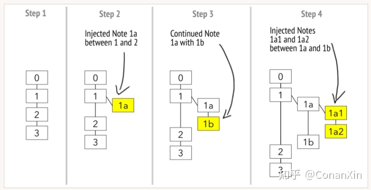

第一个笔记被指定为编号 1。如果你添加了与第一个笔记无关的第二个笔记，它就会被分配到编号 2。但是如果你想继续第一个笔记，或者在它的内容中注入一些东西，对它进行评论，或者类似的话，你可以分支（branch off）。新的笔记将被指定为编号 1a。如果你继续这个新的笔记，你会继续用1b。如果你再想对笔记 1a 进行评论，可以创建一个地址为 1a1 的笔记。所以，简而言之，每当你继续一个思路的时候，你就会递增地址中的最后一个位置，无论是数字还是字母表中的一个字符。而当你想扩展、穿插或评论一个笔记时，你可以获取它的地址并添加一个新字符。要做到这一点，你需要交替使用数字和字符。 卢曼的编号系统对于重新创造他的方法有两个影响:

1. 它使有机生长（organic growth）成为可能。卢曼没有使用超文本（hypertext）这个术语，但如果他生活在今天，他可能会使用。这种有机增长也正是 wiki 及其 wiki 链接特性的工作方式。你有一个文本，但想扩展一个点。你可以从当前页面分支，从而基本上将另一个文本注入到当前页面，但同时隐藏其内容。
2. 这使得链接成为可能。对链接的强调更明显地暗示了他的 Zettelkasten 的超文本性质。非线性链接（non-linear link）结构是超文本的主要特征。在他关于如何创建 Zettelkasten 的手册中，他写道：只要你能链接到一个新的笔记，你把它放在哪里并不重要。

他的编号系统使得基于纸张的超文本成为可能。对卢曼来说，这种工作量是可以承受的。

在这个阶段，我们有了一个可浏览的超文本。但是我们没有类似搜索引擎的东西来进入超文本。“从哪里开始？”这是卢曼需要回答的问题。他用他的登记簿（register）作为起点，他的切入点。

卢曼的登记簿（register）可能被误认为是标签系统（tag system）。然而，各个笔记并没有被贴上标签，他也没有建立一个标签系统来组织他的 Zettelkasten。

在他的登记簿中，每项条目的 ID 很少，有时只有一个，每项旁边都有一个。他的登记簿纯粹是一个入口列表（a list of entry points），而不是一个标签列表（tag list）。例如，术语系统（term system）只有一个条目（entry）。卢曼在发展一种系统理论时，这个术语在整个领域都发挥了巨大的作用。登记簿只是最大和最重要的一组笔记的可能入口的列表。在找到超文本的入口后，他依靠链接系统（linking system）开始浏览。

每个笔记的固定地址就是Zettelkasten世界的alpha和omega。一切都因为它而成为可能。

如果你想复制卢曼的Zettelkasten的功能，你必须创建一个超文本，并通过某个主题最核心的页面限制你的进入，从这里你可以继续通过链接进入。

## Zettelkasten是个人思考和写作的工具

与其他方法相比，卢曼决定不使他的 Zettelkasten 做得很僵硬，而是选择了一种有机的方法。他自己的手册名为“与卡片盒交流”（Communicating with Slip Boxes），而不是“作为写作和思考工具的卡片盒”（A slip box as a writing and thinking tool），这是有原因的。我们的参考点是Zettelkasten方法是一种有机的、非线性的、甚至是活的笔记方法。

让我们从 Zettelkasten 最重要的特点开始：

1. 它是超文本的。
2. 它遵循原子性原则（Principle of Atomicity）。
3. 它是个人化的。

首先，它是某种超文本，不是单一的文本，也不仅仅是文本的集合，而是相互参照、相互解释、相互扩展和使用彼此信息的文本。常规的笔记系统和 Zettelkasten 之间的区别在于强调形成关系（forming relationships）。Zettelkasten 将连接而不是收集作为优先考虑的因素。文本和超文本的区别在于，前者是线性的（linear），后者是有机的（organic）。

要成为一个超文本，Zettelkasten 需要多个文本或笔记，你可以通过超链接连接起来。我们把一个单独的笔记称为Zettel。Zettel 是德语 "纸条 "（paper slip）的意思。它们是 Zettelkasten 的最小构件。

每个Zettel都需要一个唯一的地址，我们可以通过这个地址来引用它，在Zettel之间建立连接。然后可以有超文本，笔记系统可以被称为Zettelkasten。

第二，一个Zettelkasten需要坚持原子性原则（Principle of Atomicity）。也就是说，每个Zettel只包含一个知识单元（unit of knowledge），而且只有一个。这些单位就是原子性原则所指的原子。为了弄清楚原子是什么，当我们问自己，我们希望用我们的笔记原子（note atoms）创造的分子是什么样子的时候，就会有所帮助。有自己地址的（知识）单元是什么？答案是:一个思想（thought）。让我们探索一些不以思想（thought）为原子的例子。

例如，书籍有地址和交叉引用。它们有章、节、页。所有的书都有唯一的编号，可以被引用。然而，你不能引用一个思想（thought）、一个想法（idea）或任何内容。章、节、页更像坐标。一个思想（thought）可能会遍布整本书！你不能只引用一个点就直接引用它。书不是思想的网（a web of thought）。

维基百科也不是思想的网，因为你只能链接到其中的文章和章节，但不能链接到文本内的单个思想。没有一个地址与任何思想相匹配。维基百科不是要做这样的事情。相反，维基百科是一部百科全书，每篇文章都包含一个主题的信息。维基百科不是一个思考工具（thinking tool），而是一个信息检索工具。

相比之下，引用原子笔记是毫不含糊的：当你引用它时，你会知道 "思想 "（thought）是什么。不应该有任何猜测的余地。这就是原子性规则的含义：确保内容层和笔记之间的边界是一致的，并且是明确的。然后，也只有这样，才能成为对一个地址的引用，就像引用一个思想一样。

Zettelkasten是思想的工具，因此它需要把单个思想作为它的基本单位。为了连接各个思想，要给每个思想一个引用的地址。用我们“Zettlers ”的话来说：每一个思想都要有一个Zettel。

第三，每个人有一个Zettelkasten，每个Zettelkasten一个人。思考和与他人交流是不同的过程。你要让你的Zettelkasten成为个人思考的工具。

这并不意味着创建一个共享的、特定于项目的超文本就没有用处。但这并不是我们所说的Zettelkasten。

让我们回到我们简短的定义:

> Zettelkasten是一个用于思考和写作的个人工具。它有超文本的特征，使思想的网成为可能。与其他系统不同的是，你创建了一个思想的网，而不是任意大小和形式的笔记，并且强调联系（connection），而不是收集（collection）。

有了这个，我们就有了一个可行的定义。你是如何让你的思考和写作Zettelkasten化的？

## 剖析一个Zettel（The Anatomy of a Zettel）

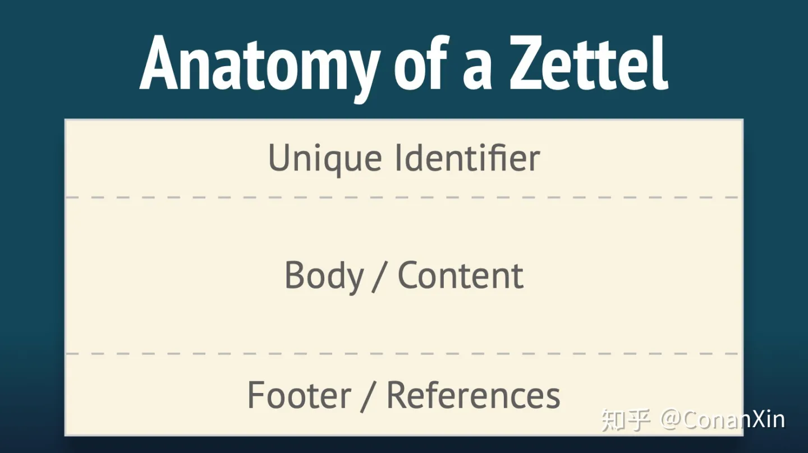

一个单独的笔记，一个Zettel，是什么样的呢？每个Zettel有三个组成部分：

1. 唯一识别符（unique identifier）。这给了你的Zettel一个明确的地址。
2. Zettel的正文（body）。这是你写下你想要获取的东西的地方：知识的片段。
3. 参考文献（References）。在每个Zettel的底部，你要么引用你所获取的知识的来源，要么如果你获取的是自己的想法，就把它留空。

其实就是这么简单。如果你怀疑自己是否做对了，请回到这些简单的基础上来。要启用超文本，至少需要一个地址，这是唯一的标识符，当然还有笔记中的一些内容。

### 唯一识别符（unique identifier）

唯一标识符(ID)是创建 Zettelkasten 的必备条件。只有拥有了唯一的标识符，你才能单独地访问 Zettel。只有有了这种条件，你才能创建一张思想的网，帮助你在知识工作中努力。

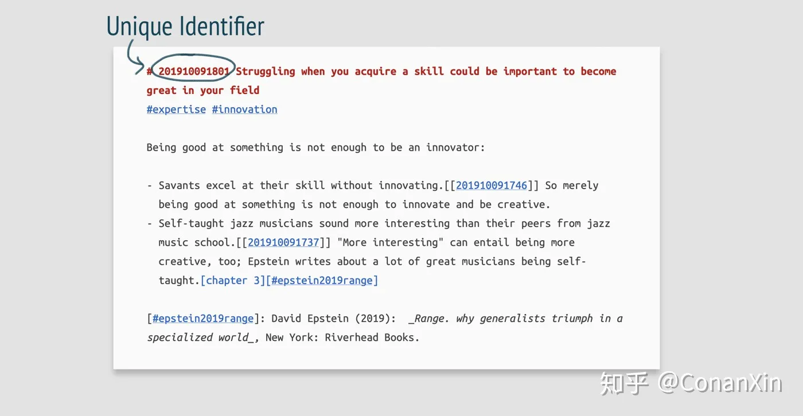

识别笔记的方法有几种，最常见的是:

1. 当然有 Luhmann-ID。你创建了某种任意的层次结构，其中每个 Zettel 都有一个可能的位置。使用纸质的 Zettelkasten，我建议使用这种技术，因为它有助于处理其组织。其他类型的 ID 在纸质上不会有那么好的效果。
2. 你可以选择一个基于时间的 ID（Time-based ID）。与纸质的 Zettelkasten 不同，数字 Zettelkasten 没有真实的地方（real place）放笔记。要创建超文本，你需要一个地址（address），而不是一个地方（place）。时间戳是一种非常简单的方法，可以创建一个唯一的数字字符串供你引用。基于时间的 ID 样本应为：`202006110955。2020年，6月11日，上午9点55分`。
3. 你可以使用任何任意的唯一字符串。你可以只使用一个递增的数字，执行一个程序，生成一个随机但唯一的字符串，或者其他任何你想要的。可以让 ID 很短。但是会牺牲一些简单性，而且无法手动生成一个ID。同时，这也牺牲了 Zettel 创建时的可读性。因此，我们不推荐这种方法。
4. 你也可以使用 Zettel 的标题作为它的 ID。只要它是唯一的，它就可以作为一个 ID。因此，如果要保持链接的完整性，除非更改对它的任何引用，否则不能更改标题。有一些软件可以为你解决这个问题，但我们不建议这样做。我们更喜欢独立于软件的方法，保持我们与软件的独立性。

### Zettel的正文（body）

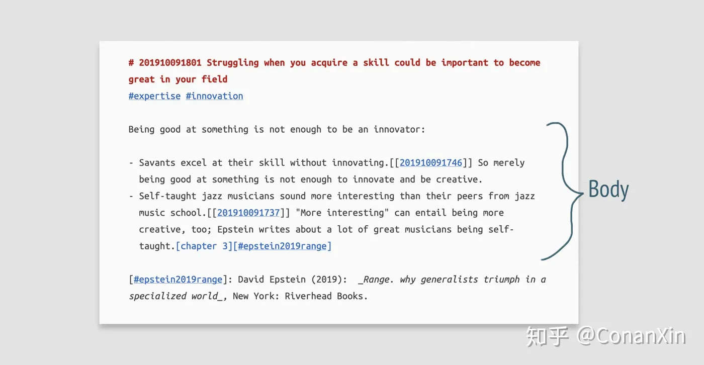

Zettel 的正文包含了你想要获取的知识。它可以是一个论点，一个概念，或任何类似的东西。

Zettel 的正文最重要的方面是你用自己的语言来写它（you write it in your own words）。逐字逐句的引用没有错。但是让 Zettelkasten 为你工作的核心规则之一就是使用你自己的语言，而不是仅仅复制和粘贴你认为有用或有见地的东西。这迫使你至少创建一个不同的版本，你自己的版本。这是增加对材料理解的步骤之一，它提高你对正在处理的信息的回忆。如果你的 Zettelkasten 的内容是你自己的，而不只是一堆别人的想法，那么它将真正是你自己的。

Zettel 的长度与你想要创建的超文本类型直接相关。你想创建一个摘录（excerpts）的网吗？那么一个Zettel应该只包含一个摘录。你想创建一个思想的网吗？那么一个Zettel应该包含一个思想。Zettel 是有自己地址的基本实体（base entity）。因此，Zettel 的长度，也就是你想要创造分子的原子的长度，是由你想达到的目标决定的。你的思考（thinking）以思想单位运作。一个 Zettelkasten 可以捕捉你的思想及其关系，因为你是这样设计的。因此，我们建议将每个 Zettel 限制为一个思想。那么你的 Zettelkasten 将帮助你思考，而不仅仅是协助你创造摘录。

在 Zettelkasten 论坛上，@Nick 问我有多挑剔，我输入的信息的性质是什么。嗯，这要看你在思考什么。我建议你坚持知识（knowledge）而不是信息（information）。

知识和信息的区别，实际上很简单。信息大多数时候可以用一句话概括。很多时候，它是 "死 "的。信息就是这样。

一条信息的例子可以是:

> 此时(2020-05-20 09:14)，我，萨莎（Sascha），写了一篇文章的初稿，标题为“Zettelkasten--简介”。

你用这个做什么？作为 Zettelkasten 方法的历史学家，你可以对其进行处理，以获得关于 Zettelkasten 方法的介绍性文章的时间轴，从而追踪这个话题在互联网上展开的情况。然后你会为你的历史研究创造一个经验基础的信息。但仅仅是陈述，它是相当无用的。对我们大多数人来说，它只是死信息，而不是知识。

一般说来，你应该总是从你处理的信息中有所收获。你应该通过添加上下文和相关性来将信息转化为知识。即使你不直接使用所创造的知识，只要你用相关性丰富了信息，你就走上了正确的道路。你不必担心 Zettelkasten 论坛用户@grayen在从互联网上的文章中做笔记时想知道的问题：

> 我有时很难决定是否值得写一篇详细的Zettel，什么样的文章值得写一个Zettel，但我不想为了写而写，而且大多数时候我不确定它是否只是短暂的东西，或者它是否真的值得长期保留，而不仅仅是为了处理一个特定的想法/疑问。我不想把我的Zettelkasten变成一种忙碌的工作，也就是一种拖延。

如果有疑问，那就在你的期限内写下笔记。如果你知道每一个知识是否与你的最终产品相关，就没有理由做笔记，因为你已经在脑海里有了最终产品。你所添加的每一点知识都有潜在的用处，这是你在产生它的时候可能看不到的。

在实践中，你需要在广泛地做笔记和专注于你当前的项目之间做出妥协。你不能随便记下你感兴趣的东西，并期望能有所收获。所以，把你当前的项目作为主线来指导你的工作，同时允许在这条线路上有一点偏差。偏离的程度取决于你的截止日期。

这个习惯的好处是你可以保持更流畅的写作。在另一个项目的技术工作中，我写的好点子和文章数不胜数。保持你的心流状态，从长远来看，会产生更多有用的想法和文字。这种做法的局限性在于你需要在短期内完成多少任务。

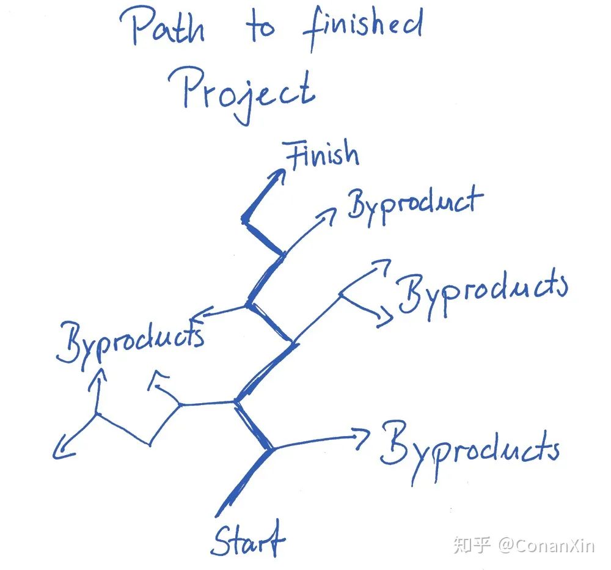

这些副产品不是浪费。从长远来看，它们会成为你未来项目的宝贵知识。此外，它们与你的Zettelkasten的其他部分形成联系，在使用Zettelkasten时将丰富你的个人学习经验。

我有一个长期的图书项目。这是一本非常全面的营养学书籍，是健康生活系列的一部分。其中一章专门讨论如何将营养纳入其他责任领域：压力、训练、日常生活组织等。我放任自流，结果就是从这一章写了整整一本书。

### 参考文献（Reference）

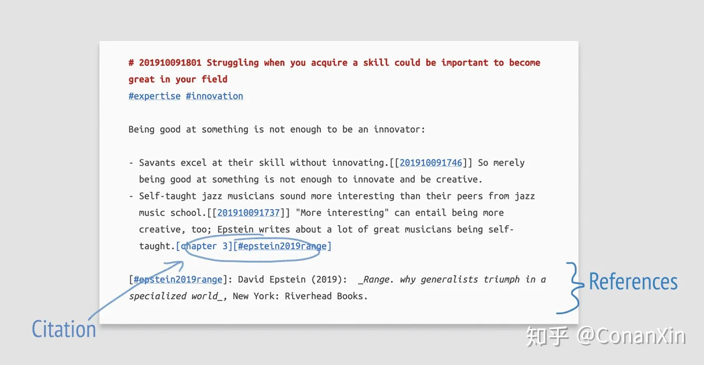

最后是 MultiMarkdown 语法中 citekeys 的定义。在这里，它在正文的最后一行被引用了一次。Zettel 底部的引用部分说明了信息的来源。页脚是外部资源(如书籍或网络文章)的合适位置。

要管理参考文献，请使用像 BibDesk 这样的参考资料管理软件。它将包含书目数据，并为您提供 citekeys。 Citekeys 类似于 IDs。它们是标识符，你可以通过它们指向你正在使用的参考文献(一个常见的citekey格式是[`#lastnameYEAR`])。

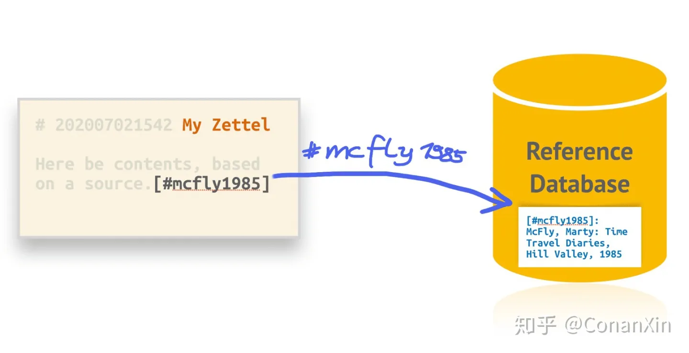

然而，有时你会把其他Zettel作为你的灵感来源。在这种情况下，你的思想是基于你过去已经处理过的事情。你可以通过ID链接到Zettel来引用它，将新旧连接起来。

如果你根本没有参考文献。在这种情况下，你不需要在这个参考文献部分做任何事情。如果在一个Zettel中没有给出参考文献，那么默认是你自己的想法。

### 拼接在一起

看这张图，所有的元素都指出来了。

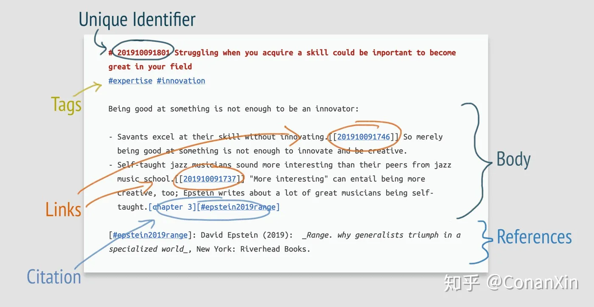

到目前为止，我们只看了单个的Zettel。现在，让我们来看看Zettels之间的关系。

### 连接Zettel

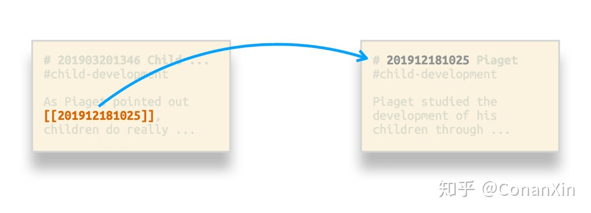

与普通的笔记系统相比，Zettelkasten真正的魔力来自于对连接（connection）的高度重视。每个新Zettel都需要与另一个Zettel建立某种关系。卢曼进一步强调了连接每一个新Zettel的重要性:

> 如果有几种可能，我们可以按照自己的意愿解决问题，只需通过链接(或引用)记录连接（connection）。通常我们工作的上下文暗示了与其他笔记的多重联系。[……]在这种情况下，重要的是放射状地捕捉连接（capture the connections radially）[……]，但同时也要马上记录被链接到的纸条（slips）中的[反向链接]（backlinks）。在这个工作程序中，我们注意到的内容通常也会丰富起来。(摘自“与卡片盒交流”[Communicating with Slip Boxes])

连接的主要好处是它们对你和你的大脑的影响：当你把知识碎片与其他知识联系起来时， 你就会在知识碎片之间建立关系。知识关系能显著提高记忆力，形成的关系还能训练你的大脑看清模式。

比方说，你读了一篇关于蚁穴的文章，然后想："等一下。这看起来像我拥有的工厂的组织结构！" 你画了许多你看到的工厂和蚁丘之间的相似之处。你为什么会看到这些联系？你看到它们是因为有一种典型的模式可以同时描述蚁穴和工厂。有些可能包含比你所知道的更多的东西：对未知事物的假设。在蚁穴中会不会有特别有效的路径，你也可以同样调整你的工厂布局，让它更有效地运作？

当你连接的时候，你会学习，理解，从而在两个方面扩展你自己：(a)你的知识将增加，(b)你将成为一个更好的观察者。通过成为一个更好的观察者，你将能够从观察中获得更多的见解（insights）。更多的通用模式（universal patterns）会出现，对你来说也会变得更加明显。这样工作的一个基本方面是，它允许你进入现实的一般模式。

为了充分利用这种连接，一定要明确说明你为什么要建立这个连接。这是链接上下文。一个链接上下文的例子如下所示:

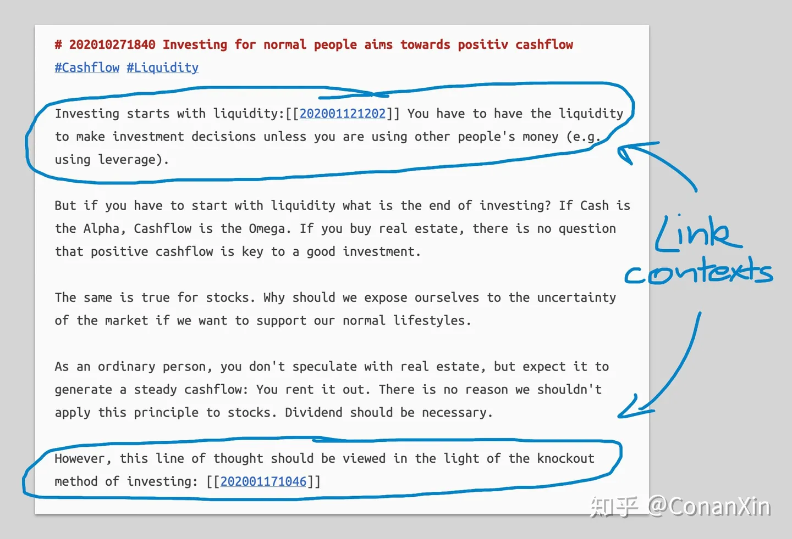

第一段为链接添加了上下文。该链接引用了一个笔记，解释了为什么如果你开始投资，流动性（liquidity）需要放在首位。链接上下文是链接本身之后的解释。我向未来的自己解释，如果他会跟随这个链接，会发生什么。

这种连接是Zettelkasten的主要知识创造机制之一：链接的意义，链接的原因，是明确的。明确说明为什么，就是创造知识。

如果你只是添加链接而不做任何解释，你就不会创造知识。你未来的自己也不知道他为什么要跟随着链接走。人们现在可能会认为，这些链接的放置是有充分理由的。然而，如果你创建了一个思想的网，你不能确信跟随一个链接会把你引向有意义的东西，那么浏览你自己的思想会给你一种失望的感觉。你未来的自己会判断过去的自己（你！）是不可靠的。

总之，在没有明确的意图，没有捕捉到的意义或相关性声明的情况下收集连接，这不是知识生产，作为一种习惯，它甚至会产生反作用：你使肤浅的工作成为一种习惯，并因此降低了你作为一个创造性知识工作者的技能。

## 结构笔记（Structure Note）

一个Zettelkasten不仅应该是你从底层的Zettels和它们的连接中创建的思想的网。某种层次结构是非常有用的。卢曼自己也需要解决这个问题。

我们可以看看他是如何使用他的登记簿的。并非每个关键词都列出了每个相关的Zettel。只有最中心的Zettels，才是一个主题的切入点。

此外，卢曼还有中枢笔记（hub notes）。这些Zettels列出了许多其他地方，可以查看一个主题的延续。卢曼的Zettelkasten对搜索到所有相关部分提出了严峻的挑战，尤其是与数字Zettelkasten相比。

层级结构的主要好处是增加了知识创造的潜力。将知识结构化是一种非常有成效的方法，可以让你获得更多的信息。让我们来探索一下“结构笔记”（The Structure Note），因为它是为zettelkasten添加结构的方法之一。

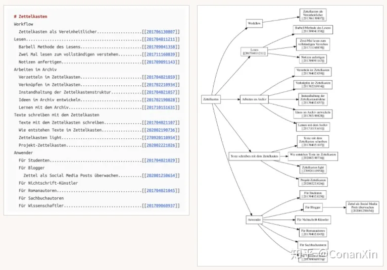

结构笔记（Structure Note）是一个元笔记（Meta-Note）:它是关于其他Zettels及其关系的一个Zettel。卢曼的中枢笔记（hub notes）是浏览笔记网的快速通道。结构笔记（Structure Note）也是如此。例如，我有一个关于Zettelkasten方法的结构笔记（Structure Note）。它类似于一个目录，专门把我所有关于这个主题的Zettel做成了目录。每当我写一个关于Zettelkasten方法的新Zettel时，我都会确保在这个结构笔记（Structure Note）上，或者在Zettelkasten方法的主结构笔记（Structure Note）所引用的结构笔记（Structure Note）上，放置一个指向它的链接。

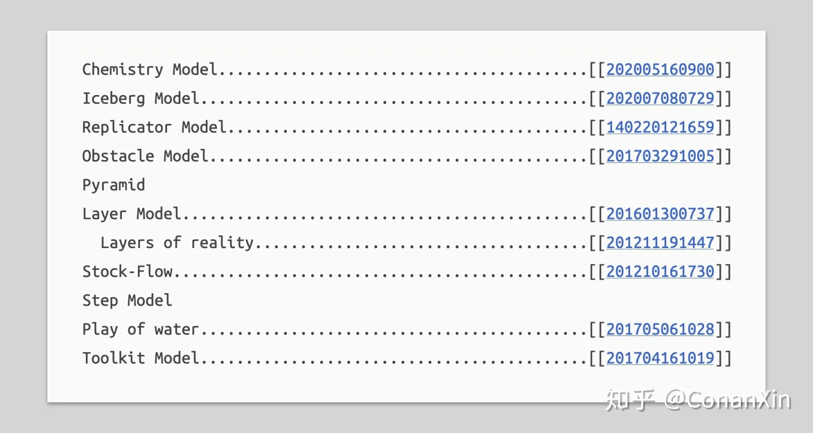

我的另一个结构笔记（Structure Note）是关于一般模型（general models）的。每个Zettel都记录了一个关于各种心智模型（mental models）的独立模式。举两个例子来说明:

1. 障碍模型（obstacle model）。人们普遍认为，从一种状态过渡到另一种状态，需要增加能量输出。一个例子是饥饿现象。在自然界中，你需要增加能量输出(狩猎或采集)，从饥饿状态过渡到饱食状态。
2. 化学模型（chemistry model）。它的完形是一个由原子组成的分子。原子是被认为不能被分割成更小块的部分。分子是元素的组成。Zettelkasten方法就是这种应用的一个模型。

化学模型（chemistry model）既是一般模型的结构笔记（Structure Note）的一部分，也是Zettelkasten方法本身的结构笔记（Structure Note）的一部分。这些在zettels中的重合就形成了一个半格结构（semilattice structure）:

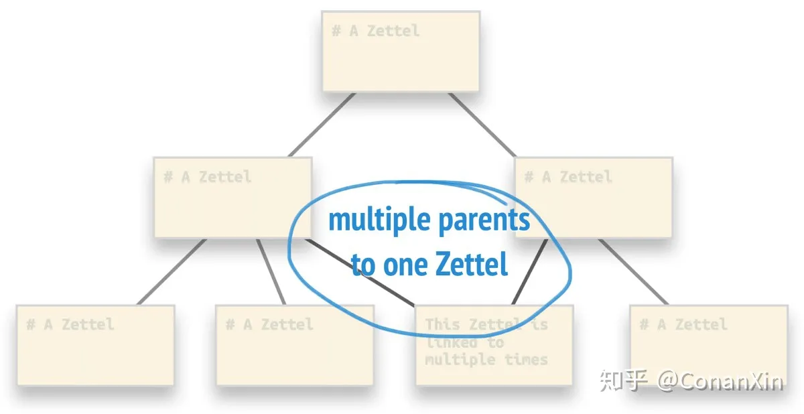

事实上，即使是半格也不能反映出Zettelkasten的真实情况。正确的模式应该是一种差异化结构（heterarchy）。但这已经超出了本文介绍的范围。

结构笔记（Structure Note）并不限于像上面的嵌套列表那样的层次结构（hierarchical structures）。结构笔记也可以有顺序结构（sequential structures）。想象一下下面的论证思路：a -> b -> c，因此a -> c。一个结构笔记（Structure Note）可以捕获这个序列，并将序列的每一步链接到一个Zettel，Zettel对其进行了扩展。

总结一下。创建关于其他Zettels之间的关系的Zettels，被称为结构笔记（Structure Note）。创建结构笔记（Structure Note）的练习将进一步训练你处理一般知识模式的能力。将结果捕捉到你的Zettelkasten中，以便日后使用。

## 如何实现Zettelkasten？

### 选择软件

如果你选择软件来处理你的 Zettelkasten，软件应该有一些功能。以下是你应该寻找的功能的基本清单:

1. 该软件需要使超文本成为可能。有两种方法可以实现这一点。你要么使用软件提供的任何链接功能——这对不太懂技术的人来说往往更方便——要么坚持通过全文搜索模仿直接链接（direct links）。基于搜索的方法随着时间的推移和跨应用程序变得更强大，但可能更难习惯。请看我们的演示，TextMate将如何处理链接。请记住，我没有以任何方式修改TextMate来适应Zettelkasten的处理。
2. Zettel之间的导航将取决于两件事：全文搜索和能够跟随链接。全文搜索相当于在卢曼的Zettelkasten中通过登记簿（register）寻找入口点(显然更强大)。链接只是你所知道的链接。无需进一步解释。全文搜索是数字Zettelkasten拥有的一个有利选项，但模拟Zettelkasten没有，这导致了它的大量使用。
3. 一种沙盒（sandbox）。卢曼的Zettelkasten中隐含的一部分是他的办公桌。他可以随便拿出几个Zettel，按照自己喜欢的方式排列在桌子上。在数字版本中，你不能这么容易做到这一点。在The Archive中，我使用结构笔记（Structure Notes）作为我的桌面。这种排列更有层次性，不像实体纸条那么自由。但它能完成工作。

### 纸质版的Zettelkasten

如果你选择让你的Zettelkasten以纸质为基础，只需按照卢曼在“与卡片盒交流”（Communicating with Slip Boxes）一文中所阐述的方法去做。

我以这种方式开始了我的Zettelkasten之旅，并试验了几个月。转换到数字解决方案是相当痛苦的。除非你有非常清晰的笔迹，并且可以在笔记上使用光学字符识别（OCR），或者由助手为你誊写，否则没有自动化的方法。

### The Archive

The Archive的主要概念之一是软件不可知论的理念（software-agnostic philosophy）和对简单纯文本方法的坚持。

1. 软件不可知论（Software-agnosticism）是这样一种原则，即你做出与软件试图达到的目的相反的东西。有一些直接的方法可以把你框住，例如，用一种封闭的文件格式存储笔记，这是其他软件无法破解的。但也有一些隐性的方法让你很难改变软件，例如，使导出过程变得困难，或者训练用户依赖其他地方没有的功能。我们试图避免这种情况，我们决定让搜索功能负责执行很多功能。甚至Zettel链接也归结为搜索。全文搜索在计算机上无处不在，因此你可以用世界上几乎所有的纯文本编辑器重现你的工作流程。
2. 纯文本方法是使用纯文本文件作为主要存储的范例。纯文本是最通用和持久的文件格式。

总之，The Archive管理一个纯文本文件的文件夹。你可以通过Omnibar执行搜索来访问你的文件。

在The Archive 中，一个单独的 Zettel 应该是这样的：

[The Archive中的简短格式化Zettel](./img/卡片笔记写作法-15.webp)

1. Zettel的ID既在文件名中，也在文件内容中。主要原因是为了建立冗余。这种做法的一个用例是从任何地方访问你的Zettelkasten：以前，我使用Dropbox从其他电脑访问我的笔记。Dropbox只允许基于文件名的搜索。因此，我需要在标题中加入ID，以便可以通过Dropbox的搜索功能手动跟随链接。
2. 这个ID是基于时间的。它永远不会改变，所以你可以随意更改标题，而不会破坏任何链接。
3. 如果你跟随一个链接，你会对双括号内的ID进行搜索。因此，你可以用任何可以执行搜索的软件来跟随链接。在The Archive中，将ID放在双括号中进行链接。
4. 标签是#。如果你点击突出显示的#，The Archive将对该标签进行搜索。标签只不过是字符串，通过你可以搜索的共享短语对笔记进行分组。
5. The Archive使用Markdown来标记文本。它非常易读，同时也被广泛地采用在工具中，整合纯文本与发布方法。许多文本编辑器都支持Markdown，你也可以使用其他工具来生成漂亮的PDF文件。如果你想写一篇文章或做一个小的演示，降价就很方便。
6. 引用和书籍参考通过扩展的MultiMarkdown语法添加。它与BibTeX连接得很好，BibTex是一种广泛支持的格式，可以将书目数据保存在纯文本文件中。我们对Mac的建议是开源工具BibDesk和Windows JabRef来管理书目数据，并通过它产生的citekeys将其连接到Zettelkasten。

这里所有的截图都是我们在档案馆的Zettelkastens的例子。

### DokuWiki

DokuWiki是我最喜欢的管理Zettelkasten的软件解决方案之一。如果您使用DokuWiki，你可以考虑不要让每个Zettel都有自己的wiki页面。DokuWiki用户界面的设计更适合长页面。这违反了原子性原则（principle of atomicity）。然而，如果你直接链接到小节（subsections），并且每个小节都包含一个想法，这就会很好。每一页都可以分为几个部分（sections）和几个小节（subsections），每个部分都有自己的地址，这样就可以将各个部分视为单独的Zettel。

DokuWiki允许你使用基于标题的IDs，并在你更改标题名称(即IDs)时保持链接正常。我仍然建议另外使用基于时间的IDs。它们只是出现在每个网站或小节的地址，但不会妨碍其他方面。好处是，你将能够更容易地将DokuWiki导出到另一个软件(尤其是文本编辑器)解决方案。想想Zettelkasten本身的代码中基于时间的ID部分，它可以被各种软件读取。如果代码完整，你可以使用大量的应用程序。如果你决定反对代码的某些部分(约定)，转换将会困难得多。

在DokuWiki中，结构笔记（Structure Notes）就是普通的Wiki页面。它们处理结构就像我上面描述的纯文本文件一样。

## 从现在开始

如果你遵循 Zettelkasten 方法，你能期待什么？从你的努力中期待更多的结果。坚持不懈地去做。你可能会在某个时候陷入困境，当你想不出如何使用所选择的工具实现功能X或Y，并让事情运转起来。当你一次又一次地经历这些动作，当你提醒自己 Zettelkasten 的基本原则时，这些问题最终会自行解决：你需要标识符作为地址，你需要链接来创建超文本，然后通过实践变得自信。向前走，才能在生活中有所成就。所以，开始做吧。这是必须的。拥有一个 Zettelkasten 不会让任何事情变得更容易，但它会让一切成为可能。
