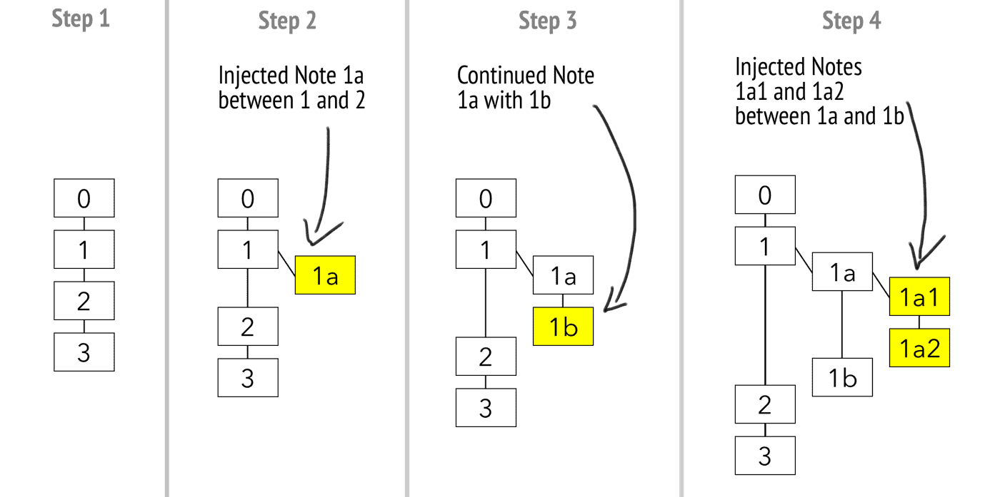

# 【翻译】关于卡片盒笔记法的介绍

---
**文献说明：**

- 英文文献：[Introduction to the Zettelkasten Method](https://zettelkasten.de/introduction/)；
- 官方翻译：[卡片盒笔记法介绍](https://zettelkasten.de/introduction/zh/)；
- 二次加工：调整文章结构、改善翻译质量、标注文章要点；

---
**术语列表：**

- **卡片盒笔记系统**：英文/德语：Zettelkasten，这是一种将笔记相互连接形成一个网状结构的超文本笔记系统。
- **卡片盒笔记法**：英文：Zettelkasten Method，建立卢曼笔记系统用到的一些具体方法。
- **笔记卡片**：英文/德语：Zettel，原指一张用来记录笔记的小纸片，现指使用卢曼笔记法记录的一条单独的笔记。
- **想法**：英文：Thought，卢曼笔记法要求每条笔记只记录一个 thought，thought 在中文中含义非常丰富，可以是一个术语、概念、理论、看法、点子，突然的灵感等等，这些在本文中统称为“想法”。
- **闪念笔记**：英文：Fleet Note，用于记录在脑海中一闪而过的想法和灵感的笔记。
- **文献笔记**：英文：Literature Note，用于记录在阅读过程中所理解的文献资料的笔记。
- **永久笔记**：英文：Permanent Note，用于记录某些永久性想法与观点的笔记。
- **思想之网**：英文：Web of Thought，由各种想法互相连接形成的网络，卢曼笔记系统就是一张思想之网。
- **链接**：英文：Link，名词，指代每条笔记卡片的 ID。
- **关联**：英文：Connect，动词，指在一条笔记与另一条笔记之间建立链接的动作/操作。

---

你之所以会阅读这篇介绍，可能是因为在工作中遇到了迫切需要解决的问题，例如你正被硕士论文压得喘不过气来，或者想要提升你的博客水平、甚至是想写一本书，或者想在科研上更进一步等。但本文真正想强调的是：==卡片盒笔记法不仅是一款可辅助我们完成写作或科研类项目的工具，更是我们在日常生活中进行知识管理的方法==。

卡片盒笔记法可以放大我们在知识型工作中的努力成果，它非常有效，且乐趣十足，有人甚至认为它在成瘾性上可以媲美魔兽世界，让人欲罢不能。当然了，==就像游泳这项运动一样，如果我们不下水，恐怕永远都无法享受到游泳的乐趣。甚至，如果只是抱着浮板在水中扑腾，那么游泳的体验可能还会非常糟糕。然而，只要我们掌握了游泳的技巧，并尝试运用这些技巧在水中滑行，那就一定能感受到游泳的魅力==。卡片盒笔记法也同样需要练习。起初可能会觉得自己怎么做都不对，但只要你稍加练习并保持耐心，就肯定会对卡片盒笔记法回馈给你的知识珍宝感到惊讶。本篇指南是引导我们迈出通向_卓越(卡片盒笔记系统世界)_ 的第一步，遵循本文的方法，卡片盒笔记系统将会提供给我们一个在知识的海洋中奋勇前进的有力工具。

对于那些不熟悉卡片盒笔记系统，我们大概会这样介绍它：

> 卡片盒笔记系统是一款==专属于个人的，用于思考和写作的工具，它的超文本特性能让我们的所思所想互相连接形成网络==。与其他笔记系统不同的是，你基于该系统创造的是一张由自己的想法、看法、灵感、或者具体的知识组成的思想之网，而不是一个个零散而孤立的笔记。==它强调笔记之间的相互关联，而非只是把所有笔记简单地堆在一起==。

## 卢曼的卡片盒笔记系统

我们今天所知的卡片盒笔记法是目前最强大的思考和笔记工具，它最初是由尼克拉斯-卢曼创造并发扬光大的。这里提到的[[尼克拉斯·卢曼]]是一位高产的社会学家，==他出版了 50 本专著和 600 篇论文。他的生产力不是已发表的作品能够体现的，他的遗产中还有 150 份未完成的手稿，其中一份稿件的长度甚至超过 1000 页==。当然，这些成就不是他一个人的取得的，他还有一位得力的伙伴——卡片盒笔记系统。

==卢曼曾说，他的生产力源自于他与卡片盒笔记系统的合作，践行卡片盒笔记法的人对此一定很有共鸣==。卢曼的==卡片盒笔记系统是一系列用于记笔记的纸质小卡片，但这些卡片被做了一点点改变，它们被赋予了**超文本**的特性==（[关于超文本的维基百科](https://zh.wikipedia.org/wiki/%E8%B6%85%E6%96%87%E6%9C%AC)）。利用超文本的笔记，卢曼能够以合理的时间和精力来浏览抽屉柜中的所有存放笔记卡片。但是，“合理”二字仅对卢曼而言，他痴迷于社会学理论，是一个精力十足的工作狂。

超文本的内在属性要求它可以通过链接从一段文字跳转到链接所指向的另一段文字。例如在维基百科上的某个页面下，你只需点击页面中的一个链接，就可以进入新的页面。然而，==如果超文本不是网页而是纸质的卡片，我们就需要付出更多的精力来跟随一个链接进入新的卡片。另外，我们还需要一个入口，这个入口类似于维基百科的搜索框==。面对着这些问题，卢曼创造了他的卡片盒笔记系统，并设计了进入卡片盒笔记系统的入口和一整套方法论，这让它他能够以一种高效的方式从一条笔记冲浪到另一条笔记。但即便如此，使用纸质的卡片盒笔记系统也是比较困难和耗费精力的（想象一下你要从几万张卡片里找到自己需要的卡片）。我们比卢曼幸运，可以使用强大的数字工具。因此，我们不需要是卢曼一样的工作狂，也能从卡片盒笔记法中获益。

### 我们为什么对卢曼的卡片盒笔记系统如此感兴趣？

首先，请幻想一下，如果能像卢曼一样高产意味着什么（50 本专著、600 篇论文和 150 份未完成的手稿）？==卢曼的卡片盒笔记系统激励着人们，_似乎_掌握了这个方法也能提高自己的生产力，这也是为什么人们对他独特的创作方式越来越感兴趣的原因==。

其次，卢曼的==卡片盒笔记系统的确能够对常规的笔记法和知识型工作(knowledge work)的方法有相当大的改进==。它可以提高你的效率，让你用更少的时间产出更多的成果。它主要从以下几方面改进常规的笔记法：

1. **让我们的想法互相之间更好地建立联系**。==卡片盒笔记系统的超文本性质是我们能够将所思所想，包括但不限于概念、术语、灵感、对事情的看法、对模型的认识以及模型参数等等建立联系==。而常规笔记法，比如将笔记写在笔记本上，我们很难将记录在第一页的想法与记录在倒数第五页的想法建立可以直接跳转的明确的联系。而==想法之间的相互联系有助于产生创新的见解(insight)，创新不是无源之水无本之木，创新是各种想法互相联系时产生的意想不到的结果==。
2. **提高我们的工作效率**。==卡片盒笔记法通过提供明确的指导来简化我们的工作流程，明确的流程反过来又会减少使用该方法的难度==。在使用卡片盒笔记系统来管理笔记的过程中，我们会感觉到效率的提高。我甚至每周都会有两天时间将卡片盒笔记系统作为我的首要任务，让自己沉浸于写卡片盒笔记的 _心流(flow)_之中。
3. **不再浪费我们的付出**。==即便你的笔记无法用于当下正在做的事情，你也会未来的项目储备知识==，至少会提高你对该主题相关信息的处理深度。因为你可以很轻松的根据笔记之间的联系找到过去记的笔记。
4. **让我们解决更复杂的问题**。处理复杂的问题时，你很难一次性将它全部解决。==卡片盒笔记法可以让你集中精力处理问题的一小部分，然后再退一步，用全景的眼光去看这个问题==。
5. **我们的笔记不会混乱**。常规的笔记法，时间长了会变成臃肿不堪乱成一团，而==卡片盒笔记系统则会根据你所要解决的问题的自动调整自己的规模==。这是卢曼提到的[内生长(internal growth)](https://zettelkasten.de/communications-with-zettelkastens/)，我更愿意将其翻译为**有机生长**(organic growth，寓意像生命体一样自然生长)。
6. **让写作更容易，更顺畅，更有条理和说服力**。==写作和思考的一个主要问题是，我们很难长时间保持写作的思绪(line of thought)不断==。冥想时尚且很难将注意力集中于呼吸这样简单的事情，更不用说为了写一篇论文而在几周甚至几个月里都思考同一个问题。而==卡片盒笔记法以帮你牢牢抓住你对问题的各种想法，并让这些想法保持活力不会丢失==。

为了有效的解决解决问题，我们必须记笔记。用卢曼的话说：

> 思考一下，我们要用写下的东西来做什么？当然，==开始时我们做的笔记大部分都是垃圾==。但是，我们所受的教育期望我们从所做的事情中得到一些有用的东西，==如果没有任何有用的结果，我们很快就会失去信心==。我们应该反思，==是否对笔记进行了管理，以及如何有效的管理这些笔记，以便未来可以查阅==。

### 给每条笔记分配一个固定地址

==如果你想引用某条笔记，那么这条笔记要有一个固定且唯一的地址，你可以通过这个地址找到这条笔记（为了方便理解，你可以将笔记的地址类比为网页的网址)==。在数字时代，如果不是软件开发人员，我们很少思考这个问题。我们习惯于在网络上用关键字进行搜索，搜索引擎会在很短地时间内给我们返回大量结果。然而，当你处理一堆纸质笔记时，你需要一种方法来让你阅读其中任意一条笔记，而且还不能花费太多的时间和精力。为此，卢曼设计了一套巧妙的**编号系统**来达到这个目的。

卢曼的笔记编号系统

第一条笔记的地址为数字`1`。如果你想添加一个与第一条笔记无关的笔记，那么将新笔记的地址设为数字`2`。如果你想写一条与笔记`1`有关的新笔记，那么你应该以笔记`1`为起点产生一条分支，此时新笔记的地址被设为`1a`。如果还有一条与笔记1相关而与笔记`1a`关系不大的笔记，那么这条新笔记的地址应该被设为`1b`。如果你想对笔记`1a`进行补充或评论，那么你应该创建一个地址为`1a1`的笔记。所以，简而言之，当你继续一个思路时，新笔记地址的应该在旧笔记的的地址最后一位上递增，比如从`1a`递增到`1b`；当你想扩充或评论一条笔记时，那么你应该在该笔记的地址后添加一个新的字符，比如从`1a`到`1a1`。要实现这样的编号系统，你需要交替使用数字的字母。

> 作者注：卢曼的编号系统实际上还包括一个斜线/，但是出于教学目的，我们先不考虑它。

卢曼的编号系统带来了两个结果：

1. **让有机生长(organic growth)成为可能**。卢曼没有使用超文本这个词，当然，如果他活在今天，可能会用这个术语。这种有机生长正是维基百科的工作方式。==如果你想在一段已有的文本基础上拓展，你就从当前页面分出一个新的页面，然后将新页面的内容以超链接的形式注入当前页面==。
2. **让连接笔记成为可能**。卡片盒笔记系统超文本的非线性特征让笔记之间的连接变得非常简单。卢曼曾在他如何创建卡片盒笔记系统的手册中写道：==你把新笔记放在哪里不重要，只要你能连接到==。

他的编号系统让基于纸张的超文本成为可能，对于卢曼来说，使用这套系统付出的时间和精力是可以接受的(别忘了卢曼是个工作狂)。

现在，卢曼有了一个可以冲浪的超文本。但是，==他还需要一个类似于搜索引擎的东西，来进入由超文本组成的笔记网络==。“从哪里开始？”是卢曼接下来需要回答的问题，==他把笔记索引表(register)作为开始的地方，即入口==。

==卢曼的笔记索引表常被误认为是标签系统(tag system)，但卢曼的笔记都没有标签，他也没用标签系统来组织卡片盒笔记系统==。

卢曼 卡片盒笔记系统中的第一个笔记索引表

==他的索引表是一个纯粹的入口列表(list of entry point)，而非标签列表==。在索引表中，每一个条目(item）后面的 ID 编号都很少，有时候甚至[只有一个](https://niklas-luhmann-archiv.de/bestand/zettelkasten/zettel/ZK_2_SW1_032_V)。比如“**系统**”这个条目就只有一个入口。但是当你发现卢曼居然以这个条目为入口，发展出了一种“系统理论”，你一定会非常吃惊。登记表只是一系列入口的组成的列表，通往那些最大最重要的笔记集合的入口列表。在找到入口后，他就可以依靠前面提到的链接系统，在笔记中冲浪了。

如果你想完全复制卢曼卡片盒笔记系统的功能，你必须创建一个超文本，然后通过很少量的入口进入某个主题最核心的笔记，从这些笔记开始，你就可以跟随笔记的链接继续前进了。

## 卡片盒笔记系统是专属于个人的思考与写作工具

与其他方法相比，卢曼选用了一种更有生命力的方式(organic approach)，来避免卡片盒笔记系统变得僵硬。他曾撰写的卡片盒笔记系统手册的标题是“[与卡片盒交流(Communicating with Slip Box)](https://zettelkasten.de/communications-with-zettelkastens/)”，这与我们把卡片盒笔记系统看作写作和思考的工具本质上是相同的：卡片盒笔记系统是一种有机的，非线性的，甚至像生命体一样活生生的笔记方法。

我们先说说卡片盒笔记系统最重要的特点：

1. 它是如同网页一般的超文本；
2. 它坚持笔记原子化的原则(Atomicity)；
3. 它是专属于个人的思考工具；

**首先**，==卡片盒中的笔记不是孤立的文本，也不是大量文本的集合(collection)，它是某种超文本，是可以相互参考、相互解释、相互拓展、相互利用信息的文本==。常规的笔记系统与卡片盒笔记系统的区别在于，==卡片盒笔记系统非常强调形成笔记间的关系，它优先考虑连接(connect)，而非收集(collect)==。而要想成为超文本系统，卡片盒笔记系统就需要多个文本或者说是笔记通过超链接(hyperlinks)互相连接。==我们把一个单独的笔记叫做 “Zettel"，"Zettel” 在德语中是纸条的意思，它是卡片盒笔记系统中最基本的组成部分==。==每一条笔记都需要一个唯一固定的地址，我们可以通过这个地址来引用它，以及在笔记卡片之间建立连接==。这样一个超文本的笔记系统就可以称得上是卡片盒笔记系统了。

**其次**，==卡片盒笔记系统需要遵守原子化的原则(每条笔记包含且只包含一条知识(one unit of knowledge)==。为了弄清楚原子是什么，我们可以问一问自己，在==用原子化的笔记创造分子级的知识论述==时的写作是什么样子的时候，大概就能体会到什么是原子了。

> 译者注：  
> - 我个人的观点是，==**原子化的笔记就是一条想法(One thought)**，而卡片盒笔记系统就是由想法组成的想法之网(web of thought)==。 - thought 这个词翻译成想法是不得已而为之，因为 thought 含义实在太广，从个人经验来看，thought 可能是一个术语(term)、一个实例(example)、一个主意、一个观点等等，我只有将其翻译成想法可能才更贴切。

我们也可以先来看一下没有以单条想法为原子的例子。我们常见的书本，它的最小信息单元是页(page)，页又组成了节(section)和章(chapter)。我们可以通过页码(address)找到任何的章、节和页，但是你很难通过页码引用(refer to)书中的某条想法。因为这条想法可能分布于书中的任何地方，没有专门的页码指向它。

维基百科也不是思想之网，因为在一个页面内，你通过超链接只能链接到其他页面里的整篇文章或者页面内的章节，无法链接到该页面中的单个的想法。因为，文章和章节有地址(网址)，想法是没有被分配地址。维基百科是一部百科全书，每篇文章都包含某个主题的信息。它是一个信息检索工具，而非思维工具(thinking tool)。

相比之下，==在卡片盒笔记系统中，直接引用某条想法是可行的，你只需引用某个原子化笔记的地址即可引用某条想法，因为一条原子化的笔记中有且只有一条想法==。

卡片盒笔记系统是一个思维工具，因此它需要把单个想法作为基本单位。为了连接想法，要给每个想法分配一个地址以供引用。==用 Zettler 的话说就是：一条笔记，一个想法==。

**最后**，==卡片盒笔记系统不是标准化的工业品，它是一个非常个性化的，专属于你个人的工具==。独自思考和与他人交流是不同的过程，你的卡片盒笔记系统应该是你个人的思考工具。不过，这不意味着创建一个共享的，基于特定项目的超文本系统没有意义，但这不是本文定义的卡片盒笔记系统。让我们重新回顾一下卡片盒笔记系统的定义：

> 卡片盒笔记系统是一款专属于每个个体的，用于思考和写作的工具。它具有超文本(hypertext)的特点，让你的所思所想互相连接形成网络。与其他系统不同的是，你创造的是一张由你的想法、看法、灵感、或者遇到的具体的知识组成的思想之网(web of thoughts)，而不是孤立的笔记。它强调笔记之间的连接关系，而非把所有笔记堆在一起。

结合之前的内容，你应该对卡片盒笔记系统的定义有了进一步的认识。那么究竟该如何创建笔记卡片，才能让它们形成专属于你个人的思考和写作工具呢？

## 单个笔记卡片的构成

基本上，每条笔记卡片应该由三部分组成：

1. ==**唯一标识符**==：它为你的笔记提供一个明确的地址；
2. **笔记的正文**：这是你记录的==笔记内容，一般为一段简短的原子化的信息==；
3. ==**参考文献**==：如果你的内容来源于外部，你可以在每条笔记的底部写上信息来源，如果你记录的是你自己的想法，则留空。

其实就是这么简单，如果你不清楚有没有做对，只需要回头看看这个基础知识。要形成超文本系统，最起码需要给每条笔记一个地址，也就是一个唯一的标识符，当然还有你记录的笔记内容。

### 唯一标识符

==唯一标识符(ID)是创建卡片盒笔记系统的必备条件，只有拥有了唯一标识符，才可以定位到单张笔记卡片==。只有拥有这种能力，才可以创建一张能在知识型工作中协助你的思想之网。

通常，给笔记添加唯一标识符的方法有以下几种：

1. **卢曼式的 ID**。前面提到，卢曼给每张笔记卡片一个由数字和字母组成的标识符，这种标识符利用层级结构的形式给笔记卡片编号。如果你准备使用纸质的 Zettelkasten，我建议你使用这种方法，因为它能更好的组织你的笔记。下面讲的其他类型的标识符，很难在纸质版的卡片盒系统中取得好效果。需要注意，卢曼的标识系统只是借用了层级结构的形式来形成超文本，实际上并不会以层级结构来组织笔记内容。随着笔记系统增长，层级标识符就会变得没那么重要。不过，你还是需要将笔记卡片放在容易找到的地方，因为查找临近的笔记要比查找放在另一个盒子里的笔记更方便。
2. **基于时间的 ID**。与基于纸张的卡片盒笔记系统不同的是，电子版的卡片盒笔记系统中的笔记卡片不会存放在实体的地方，比如一个抽屉里。这种情况下，要创建超文本系统，你只需要一个地址。时间戳(time-stamp)是创建唯一标识符最简单的方法。比如基于时间的 ID 可以是：202012011838(你创建某条笔记时的时间：2020年12月1日，18点，38分)。
3. **其他任意的唯一字符串**。你可以用程序生成一个随机但是唯一的字符串，或者其他任何你想要的字符串。如果让我用这种方法，而不用基于时间的ID，原因可能是我想缩短 ID 的位数。比如，如果你将时间戳编码为十六进制的数，那么20205191402可以缩短为2F08729AEA。这种对时间戳直接翻译的方法使 ID 缩短了两位，你可能还能想到其他的办法。但是，这类办法可能会带来一些不必要的复杂性，也无法告诉你某条笔记的创建时间，因此我不建议使用这种方法。
4. 你也可以使用 Zettel 的**标题作为它的 ID**。只要标题是唯一的，标题就可以起到 ID 的作用。因此，为了保证标题的唯一性，标题一旦确定，就不能更改，除非你改变曾引用过该笔记的其他所有笔记。有些软件可以帮你处理这个问题，但我不推荐这样做。我更倾向于采用独立于特定软件的方式。

### 笔记卡片的主体内容

笔记卡片的主体包含任何你想记录的知识，它可以是一个论点，一个概念，一个例子，或者任何类似的东西。==**需要注意的是，你要用自己的话来写这部分内容**。你可以完全摘抄一段别人的观点，但是要让卡片盒笔记系统为你工作，其中一个核心规则就是用你自己的话，而不是复制粘贴一些你认为有用或者有见地的东西==。这样会迫使你创造创造一个属于你自己版本的知识，有助加深你对学习材料的理解，加强你对所写内容的记忆。只有当笔记的内容是你自己的，你的卡片盒笔记系统才将真正属于你。

> 译者注： 同样一段材料，深层次的分析会比浅层次的分析产生更复杂、更持久、更强烈的记忆痕迹。——[Levels of Processing model - Wikipedia](https://en.wikipedia.org/wiki/Levels_of_Processing_model)

笔记内容的长度与你想创建的超文本系统直接相关。你想创建一个书摘(excerpt)网络？一条笔记应该包含一段书摘。你想创建一个由各种想法(thought)组成的思想之网？那么一个笔记卡片应该刚好包含一个想法。笔记卡片是有自己地址的基础实体(base entity)。因此，笔记卡片的长度，是由你想要达到的目标决定的。由于人的思维是以单个想法为单位工作的，而你==设计卡片盒笔记系统的目的是捕获你的想法及其想法间的联系。因此，我们建议每条笔记的内容限制为单个想法==。只有这样，你的卡片盒笔记系统能协助你思考，而不是仅仅协助你创作书摘。

在我们的论坛上，Nick 问我会选择什么样的内容输入到卡片盒笔记系统。-==虽然你可以在笔记里写任何东西，但是我建议**输入知识而非信息**(Knowledge instead of information)==。

实际上，很容易区分知识和信息。信息大多数时候可以用一句话概括，而且大多数时候信息是“死”的。

比如，下面这条是信息：

> 我，Sascha，在 2020-05-20 09:14 时完成了文章的初稿，文章标题是”Zettelkasten - An introduction".

这段文字对你有什么用呢？如果你是研究卡片盒笔记法的历史学家，你可以把它作为一篇介绍卡片盒笔记法展历史的特定事件，并追踪这个话题在互联网上的传播和发展，会为你的工作建立一个实证的信息基础。但是对于大多数人来说，这段话是无用的，因为它仅仅陈述了一个事实，是没有生命力的信息，不是知识。

因此，作为一条经验法则，你应该对信息进行处理并从中有所收获。你应该在笔记中添加一定的上下文内容，并与其他笔记建立连接，以便让信息转化为知识。即便你没有直接使用你创造的知识，只要你用笔记之间的连接丰富了你正在处理的信息，你就走在了正确的道路上。你不需要像 [@grayen](https://forum.zettelkasten.de/discussion/comment/5925/#Comment_5925)一样担心：

> 我有时会想研究一下是什么让网页中的内容值得我记笔记，我不知道是否该把它写进我的笔记卡片里，我不想为了记笔记而记笔记。我不知道这些东西对我来说是短时间内有用，还是长期有用。我有时不想仅仅为了处理我的某个想法或解决某个疑问就写一张笔记卡片 。我不想把我的 卡片盒笔记系统变成一份繁忙的工作，繁忙必定带来拖延。

如果你不清楚是否该写一条笔记，那你应该在截止日期内写这条笔记。如果你早已知道某条知识是否与你最终的产品相关，那就没有理由做笔记，因为你脑海里已经有了最终产品的形态。记住，你往==卡片盒笔记系统中添加的知识在未来都可能是有用的，只不过在你添加它们的时候你看不到罢了==。

在实践中，你需要在广泛地做笔记和专注于你当前的项目之间做出妥协。你无法只是随便记下感兴趣的东西，并期望有所收获。==你应该把你手头上正在进行的项目作为主线来指导你的工作，同时允许自己稍微偏离一点这条主线，偏离程度取决于你当前项目的截止日期==。这种方式的好处是，你能更长久地保持写作的状态。我已经记不清在进行某个项目时为另外一个项目写了多少好的想法和文字了。通过保持你的写作状态，从长远看会产生更多有用的想法。

完成项目的过程会产生各种各样的副产品

这些副产品不是无用的，它们将成为你未来项目的宝贵知识。同时，它们与你的 卡片盒笔记系统的其他部分建立了联系，并将丰富你的学习经验。

实例：我有一个长期的写书计划。写一本非常全面的有关营养学的书籍。其中有一章专门讨论营养学与其他相关领域的融合：压力、训练和日常生活的组织等。我一定程度的放任自己的写作，结果就是我将这一章扩展成了一整本书。

### 其他例子

- 如果你正在写毕业论文，时间紧迫，那么你应该尽量少的偏离主线，并专注于论文相关的材料
- 如果你是位退休的机械工程师，在一个自由而美好的周末，打算用卡片盒笔记系统来写一本小说，那么你想怎么偏离就怎么偏离，恣意地享受人生吧。
- 如果你是一名护士，想出版一本关于如何处理系统的小书。不要为了专注于工作而压力太大，你已经为别人付出很多，你应该享受写作的过程，满足你的好奇心，即使这拖慢你的进度。
- 如果你有雄心勃勃的A型人格，那么你可以尽可能地偏离主线。你的个性会确保你任何时候能很快地回到跟你项目相关的材料上来。

应该集中精力还是允许一些偏离，这与卡片盒笔记系统的方法论无关，更多地取决于你个人的情况。

### 参考文献

在笔记卡片的底部是 MultiMarkdown 语法中的 citekeys 的，这条参考文献在主体内容的最后一行被引用了一次。

==参考文献一般位于在笔记卡片的底部，用来说明信息的来源。一般为片盒笔记系统外部的参考文献，比如书籍、论文或者网络上的文章==。

你可以使用文献管理软件来管理这些参考文献，比如 BibDesk。它将包含书目数据，并提供 citekeys。Citekeys 类似于 ID，你可以通过它们指向你引用用的参考文献（（citekey的一种常见格式是[#lastnameYEAR]）

==有时候，其他的笔记卡片可能是你灵感的来源==。在这种情况下，你曾经记的笔记或者处理过的信息成为了你当下思考的基础。你引用笔记卡片时，==通过 ID 连接到其他笔记卡片，将新旧笔记联系起来==。

如果你没有引用任何参考文献，也许意味着你在知识的森林里漫步，突然洞察了世界的本质。这种情况下，你无需在参考文献部分做任何事情，因为这是你的原创想法。

### 一个完整的卡片笔记

下面这张图标注了前面提到的所有元素。

一个完整的笔记卡片

目前为止，我们只创建了单个的 Zettel。现在，我们来看看 Zettel 之间的联系。

## 连接笔记卡片

左侧的 笔记卡片通过 ID 与右侧的 笔记卡片连接

与普通的笔记系统相比，卡片盒笔记系统真正的魔力来自于对关联性的高度重视。每一个新的笔记卡片都需要与其他的笔记卡片建立某种关系。卢曼曾这样强调连接进每一个新 Zettel 的重要性：

> 如果解决某个问题的方式有好几种，我们只需通过一个链接将这些可能性联系起来。通常，笔记中的一条笔记中有多个链接与好几个其他笔记相连。在这种情况下，我们不但**要建立正向的链接**，还应该在被链接的笔记中建立反向链接(backlinks)。在这个过程中，我们会发现所写的**笔记内容也会越来越丰富**。—— [Communicating with Slip Boxes by Niklas Luhmann](https://zettelkasten.de/communications-with-zettelkastens/)

在笔记间建立连接的最主要的好处是对你大脑的影响。当你把很多知识碎片连接起来时，你会在知识之间建立联系。这不但有助于记忆知识，还能训练大脑看到知识的模式。

比方说，你读一篇关于蚁穴的文章时，突然想到：“蚁穴内的结构很像我们的工厂！”也就是说，你发现了工厂和蚁穴之间的联系。你为什么能看到这些联系呢？因为可以用同一种典型的模式描述蚁穴和工厂。在这些联系中可能包含一些你之前不知道的东西。你可能会想，蚁穴中会不会有一些特别有效的路径，能被用在工厂的布局中，以便让工厂更高效的运转？

当你连接笔记时，你会学习和领会新东西，并通过两个方面来拓展自己的认知：(a)你的知识会增加，(b) 你会成为一个更好的观察者(observer)。通过成为更好的观察者，你能从观察中获得多感悟(insights)。你会意识到，现实生活中许多看似无关的事物都遵从相同的模式，并且发现这些模式的难度对你来说会越来越低。

==为了能最大限度地发挥连接的作用，你一定要明确说明为什么要建立连接，即建立连接的原因==。一般情况下，原因通过链接的上下文来体现，比如：

两个链接的上下文

在第一段文字中，这条笔记卡片连接到了的一个链接地址为 `202001121202` 的笔记，这条笔记的内容解释了为什么投资应该优先考虑流动性。但是，第一段文字本身也给这个链接添加了一些上下文，用来解释重视流动性的原因。这段上下文是用来告诉以后再看这条笔记的自己：如果你沿着这个链接去浏览笔记，你能得到什么。

以这种方式建立的连接是卡片盒笔记系统创造知识的机制之一：明确地说明连接的原因。

==如果你只添加链接而不做任何解释，那么你将[无法创造知识](https://zettelkasten.de/posts/understanding-hierarchy-translating-folgezettel/)。未来的的你可能根本不知道为什么要沿着链接去浏览笔记==。试想一下，你创造了一张由各种想法组成的思想之网，但是你却无法确定沿着某个链接是否可以把你引向有意义的东西，那么在笔记间冲浪时肯定会给你一种失望的感觉。未来的你甚至会吐槽过去的自己不靠谱。

总之，建立连接却不指明原因的习惯是无法生产知识的。而且这种习惯会让你的工作变得随意和浅薄，降低你作为知识型工作者的生产力。

## 结构化笔记(Structure Note)

==一个卡片盒笔记系统不应该只有通过笔记卡片和它们的联系由下而上建立的网状笔记，一些层次结构(hierarchical structure)也是非常有用的==，卢曼自己也引入了类似的结构。

我们可以看看卢曼是如何使用笔记索引表的(register)。在索引表上，并不是每个关键词后面都会列出所有与其相关的笔记卡片的 ID。只有最中心最重要的笔记可以成为某个主题的入口。

除了索引表，卢曼还有另外一种非常重要的笔记：枢纽笔记(hub notes)。枢纽笔记中列出了许多其他同属于某个主题的其他笔记。搜索相关联的笔记是卢曼式的 Zettelkasten(基于纸张的 Zettelkasten)面临的挑战，尤其是与电子卡片盒笔记系统相比。

**层次结构的主要好处是增加创造知识的潜力，因为将知识结构化可以让你获得更多信息，是创造知识的有效手段**。让我们一起探讨一下这种为卡片盒笔记系统添加层级结构的结构化笔记。

一个结构化的笔记，具有目录结构以及相对应的思维导图形式

**结构化笔记是元笔记(Meta-Note)：它是一个关于其他笔记及其联系的笔记**。卢曼的枢纽笔记作为快速通道，可在笔记网络中导航。结构化笔记的作用也是如此。比如，上图是一个关于卡片盒笔记法的结构化笔记。它类似于一个目录(table of contents)，专门列出了所有有关这个主题的笔记。每当我写一个关于卡片盒笔记法的新笔记时，我都会将它的 ID 添加到这个结构化笔记上。

有关通用模型的结构化笔记

上图是我的另一个结构化笔记。这条笔记连接的每条笔记卡片都是心理模型(mental models)中的一种独立模型。举两个例子来说明：

1. Obstacle Model：从一种状态转变为另一种状态需要增加能量输出的观点。比如饥饿时，你需要增加能量输出(狩猎或采集)，才能从饥饿状态变为饱食状态。又比如，你需要保持专注，增加精神能量的的输出才能完成一些之前未完成的任务。
2. Chemistry Mode：认为分子由原子组成，并假设原子不可被分隔的观点。卡片盒笔记法应用了该模型，认为每条笔记应该是原子化的。另外，[Portal](https://www.facebook.com/notes/ido-portal/optimal-teaching-chunking-vs-the-chemistry-model-by-ido-portal/255608244481163)关于掌握技能的教学方法也应用了该模型。

记录 Chemistry Mode 的笔记被放置在通用模型的结构化笔记中的同时，也被放置在关于 卡片盒笔记法 方法的结构化笔记中。这种重叠交错的笔记(overlaps in Zettels)最终形成了一个**半格结构**(Semilattice structure):

与严格的树型结构不同，半格结构可以有从一个分支到另一个分支的交叉连接

实际上，即使是半格结构也无法完全反映 卡片盒笔记系统的真实情况。准确描绘 卡片盒笔记系统涉及到异构模型([Heterarchy](https://en.wikipedia.org/wiki/Heterarchy))这个概念，但这已经超出本篇文章的范围了。

另外，结构化笔记不限于上面提到的那种嵌套的层次结构(hierarchical structure)，也可以是非嵌套的顺序结构(sequential structure)。试想一下这种论证过程：因为 a→b→c，所以 a→c。结构化笔记也可以是这种结构，在这个论证过程的每一步都连接到一个相关的笔记卡片。比如：

_(a) 刺激皮肤感知低温的感受器是 (b) 让人体适应寒冷的主要方法。 `202005201056` 而洗冷水澡可以充分刺激皮肤表面的低温感受器 `202005201057`。因此，© 洗冷水澡是锻炼人体适应寒冷可行方法。`[[202005201058]]`_

通过 `ID` 连接到其他相关笔记卡片，给这个论证过程提供可靠的证据。而论证的逻辑结构就是这条结构化笔记的结构。

总结：关于其他笔记之间关系的笔记称为结构化笔记(Structure Note)。创建结构化笔记能够训练你发现通用知识模式的能力，能够从 卡片盒笔记系统发现结构化的有用信息供你未来使用。

## 如何实践卡片盒笔记法

### 基于软件的卡片盒笔记系统

如果你选择使用软件来建立属于自己的卡片盒笔记系统，那么这个软件应该具备以下功能：

1. **能够创建超文本**。对于不太懂技术的人，你可以使用软件提供的链接功能，直接跳转到被当前笔记连接的笔记，但是你也可以通过全文搜索来模拟直接跳转。随着时间推移和跨应用使用，你会发现基于搜索的方法更可靠更强大，但是也比较笨拙。[你可以看看我用 TextMate 如何处理链接的](https://www.youtube.com/watch?v=d-x8MpM4yDE)。请记住，我没有为了实践卡片盒笔记系统而修改 TextMate 的任何功能。
2. 笔记之间的导航依靠两点：**全文搜索和跟随链接**。全文搜索相当于在卢曼的卡片盒笔记系统中的利用索引表寻找入口（全文搜索显然更强大）。链接就是你了解的那个链接，前面已经解释了很多了。全文搜索是电子版的 卡片盒笔记系统的优势，基于纸张的 卡片盒笔记系统无法实现这个功能。
3. **沙盒功能**([sandbox](https://zh.wikipedia.org/wiki/%E6%B2%99%E7%9B%92_(%E9%9B%BB%E8%85%A6%E5%AE%89%E5%85%A8)))。卢曼的 卡片盒笔记系统的一个隐含部分是他的办公桌。他可以随便拿出一些笔记卡片，按照自己喜好把他们摆放在桌面上。电子版的卡片盒笔记系统不容易做到这一点。在 The Archive(一款软件)中，我用结构化笔记模拟桌面。结构化笔记的排列方式能够体现笔记之间的层级，虽然不像桌面那么自由，但是也足够我使用了。

### 基于纸张的卡片盒笔记系统

如果你使用基于实体纸张来建立属于自己的卡片盒笔记系统，那么只需按照卢曼的[与卡片盒交流](https://luhmann.surge.sh/communicating-with-slip-boxes)一文中阐述的方法去做。

我以这种方式开始了我的卡片盒笔记系统之旅，并实践了几个月。后来我转向了电子版的卡片盒笔记系统。转移笔记的过程非常痛苦，除非你笔记上的字迹非常工整清晰，并且可以使用 OCR 方法识别，否则没有什么自动化的方法。

### The Archive

The Archive 这款软件的主要理念是坚持==软件不可知论(software-agnostic)==和以纯文本(plain text)的形式记录笔记。

==软件不可知论希望用户完全掌握自己的数据。例如，有的软件将笔记存储在一种封闭的文件格式中，其他软件无法读取。有的软件会提高你换用其他软件的门槛，比如让数据的导出过程变得很困难，或者训练用户依赖一些其他软件没有的功能。我们试图避免这种情况，因此我们决定让搜索负责执行实践 卡片盒笔记系统需要的功能==。在 The Archive 中，从一条笔记跳转到另一条被链接的笔记的功能也是通过搜索实现的。全文搜索在计算机上无处不在，因此你可以用世界上几乎所有的纯文本编辑器重现你的卡片盒笔记系统工作流程。

纯文本是最通用也最耐用的文件格式， The Archive 使用纯文本作为主要的存储格式。

总之，The Archive 管理着一个纯文本文件构成的文件见，你可以在地址栏进行搜索来访问你的文件。

在 The Archive 中，笔记是这样的：

简短的，具有一定格式的笔记卡片

1. Zettel 的 ID既在文件名中，也在文件内容中。这样做是为了添加一些冗余信息，以便以后在其他软件上访问你的 Zettelkasten。比如，我常在其他电脑上使用 Dropbox 访问我的笔记，而 Dropbox 只允许使用文件名搜索文件。所以，我在文件名中加入 ID，以便能够通过 Dropbox 的搜索功能手动地跟随笔记间的链接；
2. ID 是基于时间的。它永远不会改变，所以你可以在不破坏任何链接的情况下随意更改标题；
3. 如果你想跟随一个链接，你可以搜索双方括号内的 ID。因此，你可以使用任何具有搜索功能的软件来跟随笔记里的链接。在 The Archive 中，将 ID 放在双方括号里就可以创造一条超链接；
4. 标签以＃开头。如果你点击标签，The Archive 将搜索它。标签的作用是对笔记分组；
5. The Archive 使用 Markdown 来标记文本。Markdown 可读性很强，同时广泛应用于其他软件。许多文本编辑器都支持 Markdown，你可以用它们生成漂亮的 PDF 文件，也可以用来写文章或者做 Presentation；
6. 基于扩展的 MultiMarkdown 语法做引文和书目的参考文献。它能与 BibTeX 完美配合，可以将书目数据保存在纯文本文件中。我们推荐在 Mac 下使用开源工具 BibDesk 和 Windows 下 使用 JabRef 来管理引文数据，并通过生成的 citekeys 将其连接到 Zettelkasten

本文所有截图都来自 [The Archive](https://zettelkasten.de/the-archive)。

## 现在开始吧

如果你遵循卡片盒笔记系统的方法，你能得到什么？期待越多，从努力中收获的也越多。你可能在不知道如何实现某个功能的时候卡住，但是希望你能坚持不懈。你只需要明白，卡片盒笔记系统最基本的原则是：使用 ID 作为地址链接，建立超文本。在实践中你将获得自信，一切问题都终将解决。向前走，才能在生活中有所成就。所以，从现在开始吧，卡片盒笔记系统不会让一切变得更容易，但它让一切成为可能。

你可以试用我们的 [The Archive (macOS)](https://zettelkasten.de/the-archive/)，我们为你提供了[用作演示的笔记](https://github.com/Zettelkasten-Method/The-Archive-Demo-Notes)。

你可以先从[这个页面](https://zettelkasten.de/posts/overview/)了解有关 卡片盒笔记系统Method 的基础知识

如果你要建立自己的卡片盒笔记系统，你可以在我们的[论坛](https://forum.zettelkasten.de/)中分享你的经验，也可以在这个[页面](https://forum.zettelkasten.de/discussion/1443/introduction-to-the-zettelkasten-method/)参与讨论。

## 参考资料

1. [Communicating with Zettelkastens by Niklas Luhmann](https://zettelkasten.de/communications-with-zettelkastens/)
2. [Understanding Hierarchy by Translating Folgezettel and Structure Zettel](https://zettelkasten.de/posts/understanding-hierarchy-translating-folgezettel/)
3. [Ido Portal](https://www.facebook.com/notes/ido-portal/optimal-teaching-chunking-vs-the-chemistry-model-by-ido-portal/255608244481163)
4. [Heterarchy - Wikipedia](https://en.wikipedia.org/wiki/Heterarchy)
5. [沙盒 (电脑安全) - 维基百科，自由的百科全书](https://zh.wikipedia.org/wiki/%E6%B2%99%E7%9B%92_(%E9%9B%BB%E8%85%A6%E5%AE%89%E5%85%A8))
6. [Getting Started • Zettelkasten Method](https://zettelkasten.de/posts/overview/)
7. [GitHub - Zettelkasten-Method/The-Archive-Demo-Notes: A mini Zettelkasten about the Zettelkasten Method and using The Archive](https://github.com/Zettelkasten-Method/The-Archive-Demo-Notes)
8. [The Archive (macOS) • Zettelkasten Method](https://zettelkasten.de/the-archive/)
9. [Zettelkasten Forum](https://forum.zettelkasten.de/)
10. [Getting Started • Zettelkasten Method](https://zettelkasten.de/posts/overview/)

## 关联笔记

[[关于卡片盒笔记法的研究]]
