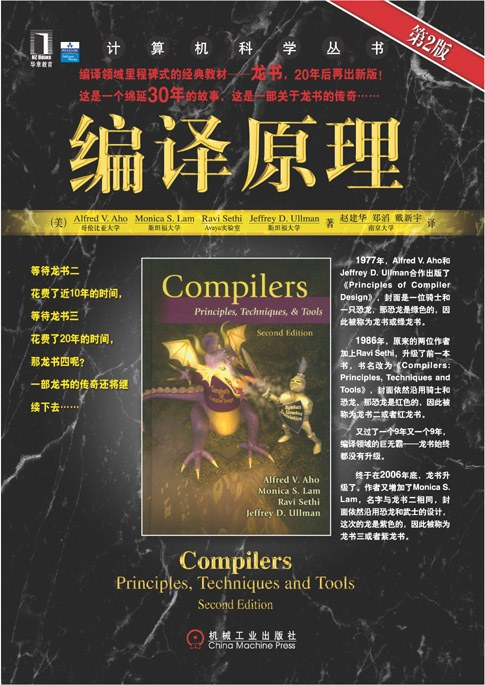

# 计算机语言的学习路线图

在这个系列的笔记中，我将记录下自己在研究计算机语言的过程中所积累的一些心得体会，笔记的内容将会包括我对编程语言、标记语言的了解，以及我学习各种语言的具体过程。希望这些笔记能够帮助到那些对编程语言感兴趣的朋友们。下面是这一系列学习的路线图规划以及相关的笔记索引。

## 关于编程语言

在理想情况下，我们当然会更希望能像许多科幻电影中那样，可以直接使用人类语言来向计算机传递操作指令。目前，计算机科学家们在这个方向上也的确取得了显着的进步，并开发出了一系列看似能理解人类语言的产品，例如Siri（苹果）、小艺（华为）等语音助手，以及ChatGPT（OpenAI）、文心一言（百度）这类更新一代的通用内容生成工具。然而，即使不考虑这些产品背后的数学真相，就算AI有一天真的能理解人类的语言，考虑到人类语言中天然存在的模糊性与不精确性，它本身也并不适合用于描述复杂的算法。例如，在“I saw the man in the park with the telescope”这一英文句子中，拿着望远镜的人是我，还是那个男人？在公园里的究竟是谁？人类之所以在大多数时候能够实现相互理解，是因为他们拥有着大量共同的知识和经验。但即便如此，人们之间的误解也依然时有发生。

为了解决上述问题，计算机科学家们专门设计了一系列能精确描述计算指令的符号系统，这些符号系统就是我们今天所知的*编程语言（Programming Languages）*。换而言之，编程语言就是一套计算机指令的编写规则，其中的每个组成单元都被定义了明确的含义（即语义）以及编写格式（即语法），正因为如此，我们所编写的程序通常被称为*计算机代码（Computer Code）*，而编写代码的过程则被称为*编码（Coding）*。举例来说，如果我们想让计算机将`1`和`2`这两个整数分别存储到`a`和`b`两个变量中，然后对它们执行加法运算，其操作指令在编程语言中的表述可能如下所示：

```assembly
section .data
a dd 1          ; 定义变量 a，并赋值为 1
b dd 2          ; 定义变量 b，并赋值为 2
c dd 0          ; 定义变量 c，并初始化为 0

section .text
global _start

_start:
    mov eax, [a]    ; 将变量 a 的值加载到寄存器 eax 中
    add eax, [b]    ; 将寄存器 eax 中的值与变量 b 的值相加，结果保存在 eax 中
    mov [c], eax    ; 将寄存器 eax 中的结果存储到变量 c 中

    ; 退出程序（在Linux环境下）
    mov eax, 1      ; 系统调用号 (sys_exit)
    xor ebx, ebx    ; 返回代码 0
    int 0x80        ; 调用内核
```

是不是觉得将两个整数相加的操作指令比想象的要复杂？很遗憾，由于编程语言的最终设计目标是方便人类的使用和理解，故而它们并不属于可被CPU直接执行的*机器语言（machine language）*，后者恐怕还得要用二进制的形式来表示。换而言之，上述指令在计算机中的真面目实际上是一个由`0`和`1`组成的数字序列，如果将两者对照起来看，可能会像下面这样：

```plaintext
MOV eax, [a]:   1011 00 000 0000 0000 0100 0000 0000 0000
ADD eax, [b]:   0000 00 000 0000 0000 0100 0000 0000 0100
MOV [c], eax:   1011 00 000 0000 0000 0100 0000 0000 1000
```

当然，我们在这里所展示的二进制代码只是一种示意性的表述，实际情况还得要取决于计算机具体采用的CPU架构。因此，尽管编程语言可以让我们的编程过程更容易一些，代码的可读性也更好一些，但这也意味着它需要先被“翻译”成机器语言，才能交由计算机硬件去执行。

### 语言的设计类型

目前，尽管市面上现有的编程语言早已琳琅满目、语言的版本迭代也日新月异。但是，无论这些语言在各自的设计上存在着多少不同之处，它们最终都需要被“翻译”成机器语言。根据具体采用的翻译方式，我们可以将编程语言大致分为以下三种基本设计类型：

- **汇编型语言（Assembly Languages）**：这是一种直接面向计算机硬件的编程语言，由于它将具体的CPU指令改编成了一系列更适合人类编写的助记符，所以在将基于汇编语言的程序交由计算机执行之前，通常需要先用一种被称作*汇编器（assembler）*的程序将其代码“翻译”回二进制形式的CPU指令。在这里，汇编语言的助记符与CPU指令之间是一一对应的关系，因而，不同的CPU架构使用的指令集通常是不同的，目前市面上较为常见的汇编型语言包括x86汇编、ARM汇编等。总而言之，汇编语言被认为是编程语言中最接近机器语言的一种，通常被称为*低级编程语言*。

    > [!NODE] 参考书目
    > 

- **编译型语言（Compiled Languages）**：这是一种经过抽象化定义的高级编程语言，目前市面上较为常见的编译型语言包括C、C++、Go、Rust等。这些语言被“翻译”的过程被称之为*编译（compiled）*。用于执行编译任务的*编译器（Compiler）*是一个由词法分析器、语法分析器、语义分析器、中间代码生成器、代码优化器以及目标代码生成器等组成的复杂程序，它的功能是分析并理解源代码中的指令，并将其翻译成与目标计算机硬件架构相匹配的机器语言。在其执行任务过程中，被编译的程序被称为*源代码（source code）*，而编译器所输出的就是可被计算机直接执行的*机器代码*。

    > [!NODE] 参考书目
    > 

- **解释型语言（Interpreted Languages）**：这也是一种抽象层次较高的高级编程语言，目前市面上较为常见的解释型语言包括JavaScript、Python、Ruby等。这些语言被“翻译”的过程被称之为*解释（interpreted）*。用于执行解释任务的*解释器（Interpreter）*本质上是一个虚拟程序，它的功能是虚拟一台能直接理解指定高级语言的计算机。换而言之，解释器不会将目标程序的源代码翻译成用机器语言表述的等效程序，它会在“运行程序”的过程中直接逐条分析并执行该源代码中的指令。

    > [!NODE] 参考书目
    > 

其中，编译型语言的翻译过程是一次性的，目标程序一旦完成了对源代码的编译，其结果就会以二进制可执行文件袋形式存储在计算机中，后续无论被运行多少次，都不再需要编译器或源代码的参与了。但是，如果目标程序采用的是解释型语言，那么它在计算机上的每次运行都需要有解释器和源代码的参与。也正因为如此，编译型语言通常能赋予程序更快的运行速度，因为它的翻译是一次完成的，而解释型语言则可以赋予人们更灵活的交互式编程体验，因为它的翻译是在程序每次运行过程中逐条进行的。

另外，我们从这里也可以看到高级编程语言相对于汇编语言的另一个优点：*可移植性（portability）*。一台计算机的机器语言通常是由其CPU的设计者创建的，因此每种类型的计算机都有属于的机器语言。这样一来，我们在笔记本中针对Intel i7处理器编写的程序，通常是无法直接运行在一台装有ARMv8处理器的智能手机上的。而在另一方面，只要拥有了合适的编译器或解释器（它们只不过是另一程序），使用高级语言编写的程序则是可以运行在各种不同类型的计算机上的。例如，我们完全可以在自己的笔记本和平板电脑上运行一模一样的Python程序，因为尽管这两台计算机中装载是不同的CPU，但他们都装配了可用于执行该程序的Python解释器。

### 学习笔记索引

关于具体编程语言的学习，我们需要根据自己所要开发的项目，或者要研究的课题来选择，下面是本人到目前为止以及整理完的、或正在整理的编程语言学习笔记，以及这些笔记在本项目中要发挥的主要作用：

- [[C 语言的学习路线图|C 语言学习笔记]]：这门语言是我进入编程领域的第一门语言，也是本人在大学本科阶段最重要的一项学习成果。这组笔记在本项目中的主要作用是学习和研究计算机算法与数据结构。
- [[C 语言的学习路线图|JavaScript 学习笔记]]：这门语言是我开发Web应用/移动端应用时的主要工具，也是本人日常工作中使用最频繁的语言。这组笔记在本项目中的主要作用是研究与C/S架构相关的分布式开发技术。
- [[Python 的学习路线图|Python 学习笔记]]：这门语言是我个人最喜欢的编程语言，也是本人在日常生活/学习中最拿手的编程工具。这组笔记在本项目中的主要作用是学习/研究与计算机系统管理、办公自动化、数据分析、人工智能等相关的技术。
- [[Rust 的学习路线图|Rust 学习笔记]]：这是我目前正在学习的编程语言，这组笔记在本项目中的主要作用是研究与操作系统开发相关的技术。

## 关于标记语言

<!-- 以下内容尚待整理 -->

标记语言（Markup Language）是一种将文本（Text）以及文本相关的其他信息结合起来，展现出关于该网页结构和数据的计算机文字编码。与文本相关的其他信息（包括例如文本的结构和连结等）与原来的文本结合在一起，但是使用标记（markup）进行标志。当今广泛使用的置标语言是超文本置标语言（HyperText Markup Language，HTML）和可扩展置标语言（eXtensible Markup Language，XML）。置标语言广泛应用于网页和网络应用程序。标记最早用于出版业，是作者、编辑以及出版商之间用于描述出版作品的排版格式所使用的。

### 语言分类

标志语言通常可以分为三类：表示性的、过程性的以及描述性的。

- 表示性的标志语言：表示性的标志语言（Presentational markup）是在编码过程中，标记文档的结构信息。例如，在文本文件中，文件的标题可能需要用特定的格式表示（居中，放大等），这样我们就需要标记文件的标题。字处理以及桌面出版产品有时候能够自动推断出这类的结构信息，但是绝大多数的，像Wiki这样的纯文本编辑器还不能解决这个问题。

- 过程性标志：过程性标志语言（Procedural markup）一般都专门于文字的表达，但通常对于文本编辑者可见，并且能够被软件依其出现顺序依次解读。为了格式化一个标题，在标题文本之前，会紧接着插入一系列的格式标志符，以指示计算机转换到居中的显示模式，同时加大及加粗字体。在标题文本之后，会紧接缀上格式中止标志；对于更高级的系统宏命令或者堆栈模式会让这一过程的实现方式更加丰富。大多数情况下，过程性标志能力包含有一个Turing-complete编程语言。过程性标志语言的范例有：nroff, troff, TeX, Lout以及PostScript。过程性标志语言被广泛应用在专业出版领域，专业的出版商会根据要求使用不同的指标语言以达到出版要求。

- 描述性标志：描述性标志（Descriptive Markup）也称通用标志，所描述的是文件的内容或结构，而不是文件的显示外观或样式，制定SGML的基本思想就是把文档的内容与样式分开，XML、SGML都是典型的通用标志语言。

历史
“标志（markup）”这个词来源自传统出版业的“标记”一个手稿，也就是在原稿的边缘加注一些符号来指示打印上的要求。长久以来，这个工作都是由专门的人（"markup men"）以及校对人来进行，对原稿标志出使用什么样的字体，字型以及字号，然后再将原稿交给其它人进行手工的排版工作。

GenCode
[icon]	
此章节尚无任何内容，需要扩充。
TeX
TeX是一个由美国电脑教授高德纳（Donald E. Knuth）编写的功能强大的排版软件。它在学术界十分流行，特别是数学、物理学和计算机科学界。TeX被普遍认为是一个很好的排版工具，特别是在处理复杂的数学公式时。利用诸如是LaTeX等终端软件，TeX就能够排版出精美的文本。

SGML
SGML是一种专门的标记语言，被用作编写《牛津英语词典》的电子版本。由于SGML的复杂，导致难以普及。

HTML
主条目：HTML
超文件标志语言（英文：HyperText Markup Language，简称为HTML）是为网页创建和其它可在网页浏览器中看到的信息设计的一种标志语言。

XML
主条目：XML
可扩展标志语言（eXtensible Markup Language，简称XML），又称可扩展标记语言，是一种标志语言。标志指计算机所能理解的信息符号，通过此种标记，计算机之间可以处理包含各种信息的文章等。

XHTML
主条目：XHTML
可延伸超文本标志语言（eXtensible HyperText Markup Language，XHTML），是一种标志语言，表现方式与超文本标志语言（HTML）类似，不过语法上更加严格。
