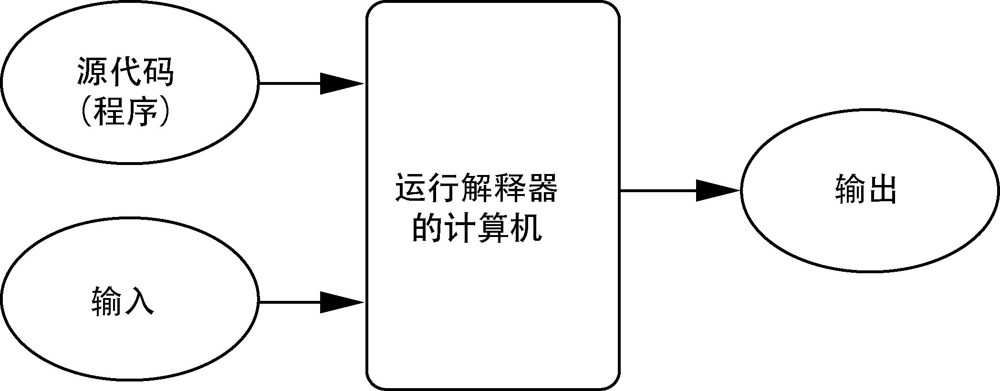

# 计算机语言的研究路线图

在这个系列的笔记中，我将记录下自己在研究计算机语言的过程中所积累的一些心得体会，笔记的内容将会包括我对标记语言、编程语言的了解，以及我学习各种语言的具体过程。希望这些笔记能够帮助到那些对编程语言感兴趣的朋友们。下面是这一系列研究的路线图规划以及相关的笔记索引。

## 关于标记语言

## 关于编程语言

在理想情况下，我们当然会更希望能像许多科幻电影中那样，可以直接使用人类语言来向计算机传递操作指令。目前，计算机科学家们在这个方向上也的确取得了显着的进步，并开发出了一系列看似能理解人类语言的产品，例如Siri（苹果）、小艺（华为）等语音助手，以及ChatGPT（OpenAI）、文心一言（百度）这类更新一代的通用内容生成工具。然而，即使不考虑这些产品背后的数学真相，就算AI有一天真的能理解人类的语言，考虑到人类语言中天然存在的模糊性与不精确性，它本身也并不适合用于描述复杂的算法。例如，在“I saw the man in the park with the telescope”这一英文句子中，拿着望远镜的人是我，还是那个男人？在公园里的究竟是谁？人类之所以在大多数时候能够实现相互理解，是因为他们拥有着大量共同的知识和经验。但即便如此，人们之间的误解也依然时有发生。

为了解决上述问题，计算机科学家们专门设计了一系列能精确描述计算指令的符号系统，这些符号系统就是我们今天所知的*编程语言（Programming Languages）*。换而言之，编程语言就是一套计算机指令的编写规则，其中的每个组成单元都被定义了明确的含义（即语义）以及编写格式（即语法），正因为如此，我们所编写的程序通常被称为*计算机代码（Computer Code）*，而编写代码的过程则被称为*编码（Coding）*。

目前已被开发出来的编程语言不仅在数量上成千上万，它们本身也会随着时间迭代出多个版本，这些版本之间有时还会存在很大的差异。但是，无论这些语言在各自细节上存在着多少不同之处，但它们都有着定义明确、无歧义的语法和语义。当然，我们在这里所指的通常都是高级编程语言，这些语言的设计目的是方便人类的使用和理解，故而通常并不属于可被CPU直接执行的*机器语言（machine language）*。举例来说，如果我们希望向计算机传递一组能将两个整数相加的操作指令，使用人类语言可能会将其表述如下：

> 将内存中位置为`2001`的数加载到CPU中
> 将内存中位置为`2002`的数加载到CPU中
> 在CPU中将这两个数相加
> 将结果存放到位置为`2003`的地方

是不是觉得将两个整数相加的操作指令比您想象的要复杂一些？很遗憾，实际情况恐怕还会比这里复杂得多，因为在机器语言中，以上指令和数字还得要用二进制的方式来表示，也就是说，它们实际上应该是一组0和1的序列。相对的，如果到了抽象的高级编程语言中，将两个数相加的操作指令就只需自然地表述为`c = a + b`即可。

当然，尽管使用高级编程语言编写程序会让其代码显得更简单易懂一些，但这也意味着我们需要先将它“翻译”成机器语言，才能交由算机硬件去执行。目前，可将高级编程语言“翻译”成机器语言的方法主要有*编译（compiled）*和*解释（interpreted）*这两种。其中，用于执行编译任务的*编译器（Compiler）*是一个较为复杂的程序，其执行任务的过程如下图所示。在该过程中，高级程序被称为*源代码（source code）*，而其得到的*机器代码*就是可被计算机直接执行的程序，上图中的虚线表示就是机器代码的执行过程，这一过程也称为“运行程序”。

而用于执行解释任务的*解释器（Interpreter）*则本质上是一个虚拟程序，它的功能是虚拟一台能直接理解指定高级语言的计算机。换而言之，解释器不会将目标程序的源代码翻译成用机器语言表述的等效程序，它会直接逐条分析并执行该源代码中的指令，其过程如下图所示。

以上两者的主要区别在于：源代码的编译属于一次性的翻译，目标程序一旦完成了编译，它后续在计算机上无论被运行多少次，都不再需要编译器或源代码的参与了。但是，如果目标程序采用的是解释执行，那么它在计算机上的每次运行都需要有解释器和源代码的参与。也正因为如此，编译型语言通常能赋予程序更快的运行速度，因为它的翻译是一次完成的，而解释型语言则可以赋予人们更灵活的交互式编程体验，因为它的翻译是在程序每次运行过程中逐条进行的。

另外，我们从这里也可以看到高级语言相对于机器语言的另一个优点：*可移植性（portability）*。一台计算机的机器语言通常是由其CPU的设计者创建的，因此每种类型的计算机都有属于的机器语言。这样一来，我们在笔记本中针对Intel i7处理器编写的程序，通常是无法直接运行在一台装有ARMv8处理器的智能手机上的。而在另一方面，只要拥有了合适的编译器或解释器（它们只不过是另一程序），使用高级语言编写的程序则是可以运行在各种不同类型的计算机上的。例如，我们完全可以在自己的笔记本和平板电脑上运行一模一样的Python程序，因为尽管这两台计算机中装载是不同的CPU，但他们都装配了可用于执行该程序的Python解释器。

## 学习笔记索引

- [[JavaScript 语言的学习路线图|JavaScript 学习笔记]]
- [[Python 语言的学习路线图|Python 学习笔记]]
- [[Rust 语言的学习路线图|Rust 学习笔记]]
