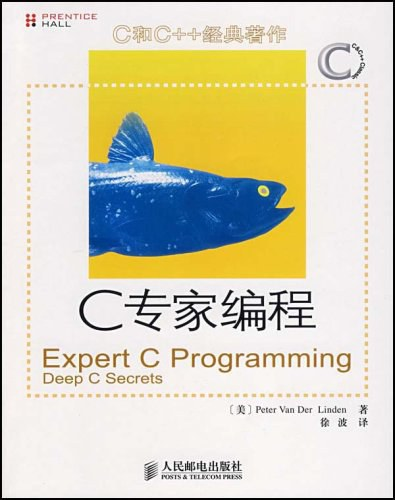

# C 语言的学习路线图

C 语言是我进入编程领域的第一门语言，也是本人在大学本科阶段最重要的一项学习成果。这组笔记在本项目中的主要作用是学习和研究计算机算法与数据结构。下面，是我个人对学习这门语言的入门建议，推荐书单，以及相关学习笔记的索引。

## 入门教材：《C 程序设计语言》

说实话，我已经不记得自己是第几次重读《C 程序设计语言》（The C Programming Language，以下简称K&R）这本书了，但每次读都还是会不禁感叹，技术类书籍竟然也可以写得如此优雅而精炼，俨然像是绘制了一副精雕细琢的工笔画。从任何角度来说，能从此书进入浪漫而严谨的编程世界都不能不说是一种荣幸，因此这本书一直我向初学者们推荐的首选入门书籍。

但凡写过计算机专业文献的人都知道，写这类文章最困难的地方就在于如何在细节严谨性与教学引导性之间找到合适的平衡点。如果没有教学引导性，你就很容易写出一部字典来，对于初学者来说，如果缺乏轻重缓急和一个循序渐进的过程，很可能就会不得其门而入。而如果缺乏足够的、可以立刻上机测试的代码实例细节，就会让他们觉得兴趣黯然，导致学习过程形同嚼蜡。这就需要作者有丰富的教学经验以及带队经验。有了前者，我们就能熟悉教学心理，知道先教什么，后教什么，之间如何承前启后，将人一步一步引入到这么技术的运用中来。而有了实际带队经验我们就会知道新手在具体实践中会遇到那些情况，并且能准确的预料到学生在运行什么代码时会遇到什么问题，而在这种情况下往往是一点就通，不用长篇大论，事倍功半。

然而，只懂如何做一个老师是不够的，计算机语言毕竟是一门科学语言，严谨的细节感是必不可少的。这就要求作者自己得是相关领域中的专家，至少得对这门学科的标准，设计原则了如指掌。唯有这样才能言之有物，而不是靠类似`++i+i++`这样的东西来哗众取宠，而又在细节上似是而非的东西来滥竽充数，却对真正需要浓墨重彩的结构体，标准库部分语焉不详，敷衍了事。

同时做到以上两个方面并不容易，但这本书不但做到了，而且做得堪称典范。作为 C 语言和 UNIX 操作系统的缔造者，本书的两位作者 K&R 对于 C 语言的标准及其运用自然有着无可争辩的权威。而他们从打印“Hello World!”开始的教学方式几乎成为了所有编程教学的样板。而即便如此，至今也没有几本书能像他们这样，做到如此的有趣、精炼、严谨（这本书的主体部分还不足两百页，想想那些比C简单得多的语言，它们的教材可动不动就是五百页以上的大部头呢），令人百看不厌。

## 进阶教材：《C 专家编程》

## 学习笔记索引

本系列笔记将分基本语法、使用指针、标准库、宏机制四个议题来记录我个人在学习 C 语言过程中的心得体会，下面是这些笔记的索引，以及相关的内容说明。

- [[C 语言学习笔记：基本语法]]：这篇笔记中主要介绍了 C 语言的基本语法，包括变量、数据类型、运算符、控制语句、数组、结构体、函数等基本语法单元，以及具体使用这些语法的示例。
- [[C 语言学习笔记：使用指针]]：这篇笔记将专门介绍 C 语言中指针的基本概念与使用方法，包括指针与数组、结构体、函数等其他语法单元的互操作等内容。
- [[C 语言学习笔记：标准库]]：这篇笔记中主要介绍了 C 语言的标准库函数，包括字符串处理、输入输出、内存管理等常用函数。
- [[C 语言学习笔记：宏机制]]：这篇笔记中主要介绍了 C 语言中的宏机制，包括宏的基本概念、宏的展开规则、宏的优缺点等。
