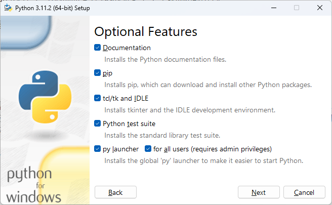

# Python 学习笔记：基础篇

承接之前在[《[[Python 的学习路线图]]》](https://www.cnblogs.com/owlman/p/17546847.html)一文中的规划，接下来，我将会提供一份针对学习 Python 语言基础的笔记（该笔记将会被保存在[我的个人笔记库项目](https://github.com/owlman/study_note)中），目的是帮助读者学习以下技能：

- 安装并配置好 Python 语言的运行时环境与相关的编程工具；
- 熟练掌握 Python 语言的基本语法及其标准库的使用方法；
- 熟练掌握 pip 包管理器的配置方法并使用它安装第三方扩展；

## 编程环境的配置

正所谓工欲善其事，必先利器，虽然 Python 属于跨平台的编程语言，但这种跨平台的特性是依靠一种被称之为*运行时环境（Runtime Environment）*的中间件来实现的。而由于后者本身是平台相关的，所以在正式开始学习 Python 这门编程语言之前，我们的首要任务就是要根据自己所在的平台来安装该语言的运行时环境，并配置好将用于审阅和编辑源代码的编程与调试工具。

### 安装运行时环境

正如之前所说，要想发挥好 Python 这类编程语言的跨平台特性，首先要做的就是要安装并配置好语言的运行时环境。接下来，就让我们分包管理器和图形和向导两种方式来介绍一下安装 Python 运行时环境的具体方法。

- 如果我们选择使用 APT/YUM 这一类软件包管理器来安装 Python 的运行时环境，那么通常是不需要根据自己所在设备的 CPU 架构与操作系统平台来选择要安装的软件包的。但这种方式通常都是以 Shell 命令的方式来使用的，这就意味着我们必须要了解各种操作系统使用的包管理器，以及这项包管理器在安装该运行时环境时所需要执行的 shell 命令。下面是各种常见的包管理器安装 Python 运行时环境的命令。

    ```bash
    # 在 Ubuntu、Deepin 等以 Debian 项目为基础的 Linux 发行版中，
    # 我们使用的是 APT 包管理器，我们可以根据自己的需要选择 Python 2.x 或 3.x。
    # 在本书中，我们选择 Python 3.x，其安装命令如下：
    sudo apt install python3 python-is-python3
  
    # 在 CentOS，Fedora 等以 Redhat 项目为基础的 Linux 发行版中，
    # 我们使用的是 YUM 包管理器，该包管理器中的 Python 3.x 版本是比较老的，
    # 这里安装的是 Python 3.6，其安装命令如下：
    sudo yum install python36 python36-setuptools
    sudo easy_install pip  # 关于 pip，我们稍后会详细介绍

    # 在以 Arch Linux 项目为基础的 Linux 发行版中，
    # 我们使用的是 Pacman 包管理器，它安装 Python 3.x 的命令如下：
    sudo pacman -S python3   

    # 在 macOS 操作系统中，通常自带了 Python 2.x 的运行环境，
    # 但我们也可以使用 Homebrew 包管理器来安装 Python 3.x，安装命令如下：
    brew install python3

    # 在 Windows 7 以上的 Microsoft Windows 操作系统中，
    # 我们也可以使用 Scoop 包管理器来安装软件，它安装 Python 3.x 的命令如下：
    scoop install python
    ```

- 如果我们选择在 macOS 或 Windows 这样的图形化操作系统中，以图形和向导的方式来安装 Python 运行时环境，那么就需先找到并下载与自己所在设备的 CPU 架构与操作系统相匹配的二进制安装包（在 Windows 中通常是一个扩展名为`.exe`的文件，在 macOS 中则是扩展名为`.img`的文件），然后启动它的图形化向导来完成相关的安装操作。例如在 Windows 系统中，Python 3.x 运行时环境的安装步骤主要如下。
  
    1. 访问 Python 官方网站的下载页面，并根据自身所在设备的 CPU 架构及其所运行的 Windows 版本来下载相应的二进制安装包（例如，我们在这里选择的是名为`python-3.11.2-amd64.exe`的安装包），其官方下载页面如下。

        

    2. 待上述二进制安装包被成功下载到本地计算机上之后，以系统管理员的身份打开该安装包，以便启动其图形化安装向导，如下图所示。

        

       在上述界面中，我们需要先勾选“Add Python.exe to PATH”选项，然后再单击“Customize installation”选项。这个选项用于将 Python 加入到系统的 PATH 环境变量中，这样会让我们日后直接在系统的终端环境中使用 Python 运行时环境，否则我们在后面的操作中可能就需要在该环境变量中手动添加路径。

    3. 在图形化向导的第二个页面中，我们需要选择要安装的 Python 组件，其中的选项“Documentation”表示安装 Python 的帮助文档；选项“pip”表示安装 Python 的第三方包管理工具；选项“tcl/tk and IDLE”表示安装 Python 的集成开发环境；选项“Python test suite”表示安装 Python 的标准测试套件，后两个选项则表示允许版本更新。在这里，我们会建议读者勾选该页面上列出的所有选项，然后单击“Next”按钮继续下一步的安装设置。

       

    4. 在图形化向导的第三个页面中，我们需要设置 Python 的安装路径。通常情况下，读者只需要保持该页面上所有的默认选项即可，当然，也可以选择单击“Browse”按钮，设置好自己想要安装路径。

       

    5. 在设置好安装路径之后，我们就可以单击“Install”按钮正式开始执行 Python 运行时环境的安装操作，读者只需等待下图中的进度条显示完成即可。

        

    6. 待上述安装过程完成之后，我们就会看到如下图所示界面，安装过程已经顺利完成，读者可以通过单击“Close”按钮来退出这个图形化安装向导。

       

最后，如果我们想验证 Python 运行时环境是否已经安装成功，就只需要在自己所在的操作系统中打开 Shell 终端环境，例如 Windows 环境下的 Powershell 或 CMD，或者类 UNIX 系统环境下的 BASH、FISH 等终端模拟程序，并在其中执行`python --version`命令，如果看到如下图所示的版本信息，就证明我们已经成功安装了 Python 运行时环境。


### 配置编程工具

从理论的角度上来说，要想编写一个基于 Python 语言及其运行时环境的应用程序，通常只需要使用任意一款纯文本编辑器就可以了。但在具体的项目实践中，为了在工作过程中获得代码的语法高亮与智能补全等功能以提高编码体验，并能方便地使用各种强大的程序调试工具和版本控制工具，我们通常还是会选择使用一款专用的代码编辑器或集成开发环境来完成项目开发。在这里，我个人会倾向于推荐读者使用 Visual Studio Code 编辑器（以下简称 VS Code 编辑器）来构建所有的项目。读者可以参考下面这篇笔记来学习这款编辑器的安装方法，以及如何将其打造成一款用于编写 Python 应用程序的集成开发环境。

> 关联笔记：[[VS Code 编辑器的基本配置]]

除此之外，Atom 与 Sublime Text 这两款编辑器也与 VS Code 编辑器有着类似的插件生态系统和使用方式，如果读者喜欢的话，也可以使用它们来打造属于自己的项目开发工具，方法是大同小异的。而除了上述专用的代码编辑器之外，如果读者更习惯使用传统的集成开发环境（IDE），JetBrains 公司旗下的 PyCharm 无疑会是一个不错的选择，它在 Windows、macOS 以及各种 Linux 发行版上均可做到所有的功能都是开箱即用，无需进行多余的配置，这对初学者是相对比较友好的。PyCharm 的安装方法非常简单，我们在浏览器中打开它的官方下载页面之后，就会看到如下图所示的内容：


同样地，大家在这里需要根据自己所在的操作系统来下载相应的安装包，待下载完成之后就可以打开安装包来启动它的图形化安装向导了。在安装的开始阶段，安装向导会要求用户设置一些选项，例如选择程序的安装目录，是否添加相应的环境变量、关联的文件类型等，我们在大多数时候都只需采用默认选项，并一路用鼠标单击「Next」按钮就可以完成安装了。当然了，令人比较遗憾的是，PyCharm 的专业版本并非是一款免费的软件，而免费的社区版在功能上则多多少少会受到一些限制。如果考虑到程序员们在实际生产环境中各种可能的需要及其带来的相关开销等因素，我个人还是会倾向于建议大家尽可能地选择开源软件，这篇笔记接下来也将会以 VS Code 编辑器为主要编程工具来展开后续的各种实例演示。

### HelloWorld 程序

现在，为了验证我们已经成功配置好了使用 Python 语言的编程工具，接下来就需要尝试着使用这些工具来编写一个 Python 版本的 Hello World 程序，看看它能否在我们所在的计算机设备上成功运行起来。编写该程序的具体步骤如下。

1. 在自己的计算机设备上设置一个用于存放演示代码的目录（在这里即`examples`目录），并在该目录下创建一个名为`HelloPython`的目录。

2. 使用 VS Code 编辑器打开刚刚创建的`HelloPython`目录，并在该目录下创建一个名为的`main.py`文件，以作为本示例的程序入口文件，然后在其中编写如下代码：

    ```python
    #! /usr/bin/env python
    '''
        Created on 2020-3-1

        @author: lingjie
        @name : HelloPython
    '''

    def main():
        print("Hello World!")

    if (__name__ == "__main__"):
        main()
    ```

3. 在保存上述文件之后，打开 VS Code 编辑器中集成的终端环境并进入到`HelloPython`目录下，然后执行`python main.py`命令运行这个 Hello World 程序。如果该程序在终端中输出了如下图所示的信息，就说明我们已经成功配置好了使用 Python 语言的编程工具。

    

## 基本语法学习

完自《The C Programming Language》这本程序设计领域的经典教程问世以来，在命令行终端环境中输出“Hello World”字样都已经成为了我们学习一门新的编程语言，或者测试该语言编程工具的第一个演示程序。这样做不仅可以先让读者对要学习的编程语言及其执行程序的方式有一个整体的印象，同时也为接下来的基本语法学习提供了一个切入点。所以，现在就让我们闲话少说，正式开始了解一下这个 Python 版的 Hello World 程序吧！在该程序中，读者首先看到的应该是 7 行注释信息，所以对于接下来的 Python 的学习之旅，我们就先从最简单的注释语法开始。

### 为代码编写注释

通常情况下，我们编写注释的目的是让阅读代码的人能更好地理解程序员的设计意图，这对于代码的后期测试和维护工作有着非常重要的意义。在 Python 中，注释主要有以下两种形式：

- **以`#`符号开头的单行注释**：这种形式的注释可以在代码的任意地方以`#`符号开头编写注释信息，直至其所在行结束为止，例如：

    ```python
    # Python 支持加法运算
    x = 7
    y = 8
    z = x + y # 请问 z = ？
    ```

- **用三个单引号包括起来的多行注释**：这种形式的注释可以在代码的任意地方以`'''`符号为开头编写注释信息，然后以再以另一个`'''`符号结束。由于这种形式的注释内容可以包含换行符，因此通常用于编写多行注释，例如：

    ```python
    '''
    示范 Python 中的加法运算
    涉及变量：x、y、z
    '''

    x = 7
    y = 8
    z = x + y
    print("z = ", z)
    ```

正如我们之前所说，注释存在的目的是说明相关代码的设计意图，以此来提高代码的可读性，方便日后的测试与维护工作。例如在上面这段示例代码中，我们用注释说明了它用于示范在 Python 中执行加法运算，并使用了`x`、`y`、`z`三个变量，当然了，编写这种画蛇添足式的注释事实上并不值得鼓励。因为，我们必须考虑到 Python 本身就是一门用于表达信息的语言，它的作用除了让机器按照它的意图正确执行之外，也应该让使用这门语言的人类看得懂它的意图。注释的作用只能是辅助说明，可不是充当 Python 自身的翻译。换而言之，我们应该尽量用代码本身来表达它所要表达的意图，而不是处处都借助注释。

除了说明代码的意图之外，注释还有一个额外的作用：即在调试过程中，临时暂停某一条代码的执行。举个例子，如果我在执行下面这几行脚本代码的时候发现自己的命令行终端不能显示中文，为了确定这不是代码本身的问题，我可能会选择像下面这样，临时注释掉中文的输出，然后增加一条英文的输出。在很多时候，这种利用注释语法来临时切换要执行的代码，也是一种很常用的代码调试技巧。

```python
name = "lingjie";
# print("你好！", name);
print("Hello ", name);
```

### 函数及其作用域

下面，让我们继续之前 Hello World 程序的讲解。读者在看完该程序的注释说明之后，紧接着看到的是一个`def`语句定义的函数。在 Python 中，函数的定义语法如下。

```python
def [函数名称]:
    [函数主体]
```

具体到 Hello World 程序中，我们就是定义了一个`[函数名称]`为`main`的函数，其`[函数主体]`只有一条用于打印信息的`print()`方法的调用语句。与 C/C++/Java 这类语言相比，Python 最大的特色之一是它不使用大括号，而是使用文本缩进格式来表示不同的作用域。因此，我们可以看到`[函数主体]`所在的作用域会相对于`def`语句存在着一个缩进。需要注意的是，虽然在语法规则上，定义作用域的缩进所使用的空格数是可变的，但同一级作用域使用的缩进格式必须保持相同的空格数，否则就会出现错误。

而在同一个作用域内，我们通常都有一个独立的变量命名空间可以使用，读者可以在其中定义多个局部变量，并编写多行语句来执行与这些变量相关的操作，完全不必担心自己使用的变量名与某个全局变量冲突。另外在 Python 中，通常一个逻辑行代表着一条独立的语句。如果某一条语句因过长而影响了代码的可读性，代码编辑器可能会对其进行自动换行，但它在 Python 运行时环境看来依然属于同一逻辑行。例如，我们可以对之前的 Hello World 程序做一些修改，让它输出的内容丰富一些。

```python
#! /usr/bin/env python
'''
    Created on 2020-3-1

    @author: lingjie
    @name : HelloPython
'''

def main():
    message = "This is an object-oriented,open-source programming language often used for rapid application development.Python's simple syntax amphasizes readability,reducing the cost of program mantenance, while its large library of functions and calls encourages reuse and extensibility."

    print("Hello Python! \n", message)

if (__name__ == "__main__"):
    main()
```

上述代码的执行结果如下图所示，读者可以看到，我们在`main`函数的作用域中新增了一个名为`message`的变量，给它赋值了一个比较长的字符串，虽然编辑器将其自动换行成了三行内容，但它们在逻辑上依然被视为同一行内容来输出的。


### 变量与数据类型

众所周知，变量这个概念最早源自于数学中的代数运算，为了方便演算过程的书写，我们通常会用一些简单的字母来指代演算过程中不断变化的已知量或未知量，毕竟在公式中写`x`、`y`、`z`这样的字母总是要比写 $10^{55}$ 作用的数字或者 $\sum_{i=0}^{n}$ 这样的表达式简单方便多了。而到了计算机程序中，变量的概念得到了进一步扩展，除了是某个数据值的指代外，它还关联着计算机中用于存储该数据的一块内存空间，换而言之，变量现在还是程序用来存储某个数据的容器。当然了，这些容器既然能被称为“变”量，也就说明它们所存储的数据是会随着程序的执行而变化的。由于变量是程序所要操作的基本对象，所以在编写程序时，定义变量往往是我们首先要做的工作。接下来，就让我们详细介绍一下变量在 Python 编程中的使用方法吧！

#### 变量的定义

正如我们之前在定义`message`变量时所做的那样，在 Python 代码中定义变量是无须先声明的，我们在执行赋值操作的同时就已经完成了变量的定义。接下来，让我们来具体讨论一下变量的命名问题。和绝大多数编程语言一样，Python 中的变量名可以由字母、数字、下划线及美元符号`$`以任何顺序排列组合而成，并且只能以字母、下划线和`$`符号开头，像下面这些变量名都是不被允许的：

```python
2day = 10
'Week =11
\Month = 12
/Year = 14
```

除此之外，我们所使用的变量名还需要注意避开 Python 语言自身要使用的保留字，我们可以利用语言标准库中一个名为`keyword`的模块来获取当前已被 Python 占用的所有保留字，具体如下图所示。


当然了，出于代码可读性方面的考虑，我们在选择变量名的时候还应该尽量使用有意义的单词或单词组合，不能太过随意。在这里，笔者个人更倾向于建议读者应在变量的命名上遵守某种一致的命名规范。譬如匈牙利命名法，这套命名规范建议我们将变量的数据类型也写到变量名中，例如在`strname="lingjie"`这个变量定义中，我们用`str`这个前缀表明了这是个字符串类型的变量。再譬如驼峰命名法，遵守这种命名规范的变量名通常由一个以上的单词组成，除了首个单词的字母不是大写，其余所有单词的首字母均为大写，例如`myName`、`myBook`、`someValue`、`getObject`等。

#### 基本数据类型

现在，让我们再来重点关注一下变量的数据类型。在计算机中，如果程序想要对某一块内存空间中数据进行存储和操作，首先要明确的是该空间内数据的存储方式和操作方式。譬如，变量中存储的是数据本身还是数据在内存中的位置？这将决定着这些数据的复制方式。再譬如，变量中的数据可以执行什么操作？是算术运算还是逻辑判断，亦或是文本处理？这就需要我们对这些内存空间中的数据，即变量的值进行归类，譬如用来做算术运算的数据归为一类，用于文本处理的数据则归为另一类，在编程术语上，这些归类被人们约定俗成地称之为“类型（type）”。简而言之，就是变量中的值所属的类型决定了该变量的存储形式及其可以执行的操作。下面，我们具体介绍一下在 Python 中可以使用的数据类型，先从该语言支持的 6 大基本数据类型开始，具体如下。

- **`number`类型**：即数字类型，Python 3.x 主要支持 4 种数字类型的数据，它们分别是：`int`（即整数类型）、`float`（即浮点类型）、`bool`（即布尔类型）、`complex`（即复数类型）。这些数据类型主要用于执行各种数学运算，包括加法、减法、除法、整除、取余、乘法和乘方等，下面是一些操作示例。

    ```python
    print((3+2))       # 加法运算，输出结果是 5
    print((10.4-3))   # 减法运算，输出结果是7.4
    print(15/4)        # 除法运算，输出结果是 3.75
    print(15#4)       # 整除运算，输出结果是 3
    print(15%4)      # 取余运算，输出结果是 3
    print(2*3)         # 乘法运算，输出结果是 6
    print(2**3)        # 乘方运算，输出结果是 8
    ```

    *值得一提的是*，Python 在 3.x 版本之后采用了非固定大小的`int`类型，这让它可以自动适应任意大小的整数值（唯一的限制是计算机的可用内存量）。在处理较小的整数时，Python 会使用计算机底层的`int`类型来表示它们。当需要处理较大的整数时，Python 就会自动转换为占用位数更多的表示形式。当然，为了能对较大的整数值执行运算，Python 必须要将这些运算拆解成若干个能直接交给计算机硬件处理的小型运算单元，其拆解过程与我们用笔算的方式来进行长除法运算非常类似。尽管这种运算方式的效率并不高（因为这需要执行更多步骤），但是它们允许 Python 将`int`类型扩展至任意大小。

- **`string`类型**：即字符串类型。在 Python 语言中，字符串就是在单引号、双引号和三引号之间的文字，这些文字中中所有的空格和制表符都照原样保留。在三种字符串的表示方式中，单引号与双引号的作用在大多数时候是一样的，只有当字符串本身的内容中包含单引号时，它就只能用双引号或三引号来表示。而三引号则通常用于表示包含多行文字的字符串，同样的，我们也可以在三引号中自由使用单引号和双引号。在编程活动中，字符串类型的数据主要用于执行各种文本处理操作，包括文本的输入、输出、存储、拼接和截取等，下面是一些操作示例。

    ```python
    name = "lingjie"   # 存储一般的字符串数据
    I_am = "I'm "        # 存储带单引号的字符串数据
    # 储存包含多行内容的字符串数据
    other = '''
    age:  42
    job: writer
    '''
    message = I_am + name + other # 拼接字符串数据并存储
    
    print(message) # 输出变量 message 中存储的字符串数据
    print(message[0:11]) # 截取变量中的某一段字符串并输出
    print(r"Newlines are indicated by \n") # 忽略字符串中的转义字符并输出
    ```

    另外，如果读者想要让 Python 运行时环境忽略字符串数据中所有的转义字符，也可以在表示字符串的单引号或双引号之前加一个前缀`r`。例如在上面的最后一行代码中，如果我们希望的是原样输出下面字符串中的换行符`\n`，而不是让它发挥换行效果。

- **`list`类型**：即列表类型。在 Python 语言中，列表类型的对象可以是其他任意对象的有序集合，这些对象会被表示成由一对中括号表示的一系列可按某种顺序排列的元素，这些元素之间用逗号隔开。列表中的元素可以是 Python 中可以使用的任意数据类型，既可以是这里正在介绍的 6 大基本数据类型，也可以之后我们通过自定义或者引入第三方库获得的扩展数据类型。在基于 Python 的编程中，列表类型的数据主要用于执行面向有序集合的数据操作，包括数据成批量地增、删、改、查以及遍历等，下面是一些操作示例。

    ```python
    list_1 = [ # 将三个对象存储为一个列表类型的数据
        10,      # 第一个列表元素为数字类型的数据
        "string data", # 第二个列表元素为字符串类型的数据
        [1, 2, 3] # 第一个列表元素为列表类型的数据
    ]
    print(list_1) # 输出整个列表中的数据
    print(list_1[1]) # 用列表索引的方式输出指定的元素
    # 注意，列表元素的索引值是从 0 开始的，所以这里输出的是第二个元素
    list_1[0] = 100 # 修改制定的元素
    list_1.remove([1,2,3]) # 找到并删除列表中的第三个元素
    print(list_1) # 重新输出整个列表中的数据
    list_1.append([7, 8, 9])  # 在列表末尾重新添加元素
    print(list_1) # 重新输出整个列表中的数据
    ```

- **`tuple`类型**：即元组类型。在 Python 语言中，元组类型的对象可以被视为一个只读的列表类型数据。元组中的元素也可以是任意类型的数据对象，这些对象会被放置在一对小括号中，并用逗号隔开。由于元组中的元素是不可修改的，所以该数据类型通常用于执行一次性的批量数据存储以及各种查找、遍历等只读操作，下面是一些操作示例。

    ```python
    tuple_1 = ("abcd", 706, "lyy", 898, 5.2) # 一次性地存储一些数据
    print(tuple_1)          #  输出整个元组中的数据
    print(tuple_1[0])      # 用索引的方式输出指定的元素 
    print(tuple_1[1:3])   # 用索引区间的方式输出元组的某个子序列
    ```

- **`sets`类型**：即集合类型。在 Python 语言中，集合类型的对象可以被视为一个元素不能重复的列表类型数据。集合中的元素被放置在一对大括号中，并用逗号隔开（如果要创建的是空集合，就需要调用`set()`函数来完成）。由于集合中的元素是不能重复的，所以该数据类型通常用于在执行数据存储时需要删除冗余数据的操作，下面是一些操作示例。

    ```python
    set_1 = {18,19,18,20,21,20} # 如果我们存储的数组存在重复
    print(set_1)          # 读者就会看到相同的元素只会被保留一个
    ```

- **`dictionary`类型**：即字典类型。在 Python 语言中，字典类型的对象可以被视为一个元素为键值对的列表类型数据。字典中的每个元素都必须是一个键值对。它们将会被放置在一对大括号中，并用逗号隔开。该数据类型通常用于执行一些键值查找相关的操作，下面是一些操作示例。

    ```python
    map_1 = { # 将两个键值对元素存储为一个字典类型的数据
        "name" : "lingjie", # name 是键，lingjie 是值
        "age" : "25"           # age 是键，25 是值
    }
    print(map_1) # 输出字典中的数据
    map_1["sex"] = "boy" # 添加一个键为 sex，值为 boy 的元素 
    print(map_1) # 重新输出字典中的数据

    # 字典删除数据时，可以使用 del 函数
    del map_1["age"] # 删除键为 age 的元素
    print(map_1) # 重新输出字典中的数据
    ```

#### 自定义类型

除了上述基本数据类型之外，Python 还支持我们通过自定义类型（包括引入第三方库）的方式来使用更复杂的数据类型，以便赋予该语言更强大的表达能力。和绝大多数支持面向对象的编程语言一样，这一扩展可用数据类型的能力是通 过一种叫做“class（类）”的语法机制来完成的，接下来，我们就继续介绍在 Python 语言中自定义类型的语法，该语法的基本格式如下。

```python
class [类型名称]([父类名称]):
    [类型的属性和方法]
```

下面，我们来具体解释一些上述语法格式。读者首先会看到的是`class`关键字，Python 中所有自定义类型的动作都需要从这个关键字开始。然后，我们需要指定一个`[类型名称]`，自定义类型的命名规则与变量是完全一致的，只不过在习惯上，我们通常会选择首字母大写的名称。再接着是需要在一对小括号中指定当前类型继承自哪一个`[父类名称]`，在 Python 3.x 中，所有自定义的类型都会默认继承自`object`类，所以如果没有特别指定的父类，这里其实是可以省略的。最后，我们就可以开始定义`[类型的属性和方法]`了。

在面向对象的概念中，类型的属性通常指的是可以存储在该类及其实例对象中的子数据，例如，如果我们想自定义一个表示“书”这个概念的自定义类型，它的书名、作者、出版社等子数据都属于“书”这个类型的属性。具体到了 Python 语言中，自定义类型的属性包括实例属性与类属性两种，它们之间的主要区别如下。

- 在数据的归属问题上：实例属性中的数据由该类型的每个实例各自拥有，相互独立；而类属性中的数据有且只有一份，由该类型的所有实例共有的属性。也就是说，类属性可以直接通过`[类型名称]`来访问的数据，而实例属性则是需要先将类型实例化成具体的对象，然后通过该对象才能访问的数据。

- 属性的定义方式上：实例属性需要在一个名为`__init__()`特殊方法中定义，该方法会在类型被实例化时被自动调用，并对该属性执行初始化操作，实例属性的定义就属于该初始化操作的一部分。而类属性的定义只需在上述语法格式中`[类型的属性和方法]`所在的缩进区域执行变量添加操作即可，没有特定的位置。

值得一提的是，虽然`__init__()`方法在使用方式上与面向对象概念中的狗仔函数非常类似，但它是实例化要执行的初始化方法，而不是构造方法，Python 中真正的构造函数是另一个名为`__new__()`的特殊方法。只不过在大多数情况下，我们是不需要重新定义构造方法的，定义好初始化方法就足够了。另外，如果我们需要在销毁一个自定义类型的实例时需要执行某些指定的操作，就需要通过定义另一个名为`__del__()`的特殊方法来实现。

除了上述特殊方法之外，我们还可以使用`def`关键字，在上述语法格式中`[类型的属性和方法]`所在的缩进区域为自己定义的类型添加其他方法，在面向对象的概念中，类型的方法通常指的是该类型可以执行的操作。例如，如果我们想自定义一个表示“书”这个概念的自定义类型，修改书名、作者信息、出版信息等就是它所应该支持的操作。下面，我们来具体示范一下在 Python 语言中自定义类型的过程。

```python
class Book:
    help = '''
    这是一个类属性，用于提供当前类帮助信息。
    
    创建实例的方法：
        mybook = Book({
            "name" : "Python 快速入门",
            "author" : "lingjie",
            "pub" : "人民邮电出版社" 
        })
    修改书名的方法：
        mybook.updataName("Python 3 快速入门")
    销毁实例的方法：
        del mybook
    '''

    '''
      定义 Book 类的初始化方法，该方法需要定义以下两个参数：
        self：这是初始化方法必须要有的参数，
                用于指涉将被初始化的实例；
        bookdata：这是字典类型的数据对象，
                用于提供初始化时所要提供的数据；
    '''
    def __init__(self, bookdata):
        # 定义三个实例属性：
        self.name = bookdata["name"]
        self.author = bookdata["author"]
        self.pub = bookdata["pub"]
    
    '''
      定义 Book 类中用于修改书名的方法，它需要定义以下两个参数：
        self：用于指涉当前被称作的实例；
        newName：用于指定新书名的字符串对象；
    '''
    def updataName(self, newName) :
        self.name = newName

    '''
      定义 Book 类中用于销毁实例的方法，它需要定义以下参数：
        self：用于指涉当前被称作的实例；
    '''
    def __del__(self):
        print("delete ", self.name)        
```

在完成自定义类型的动作之后，我们就可以对该类型进行实例化并仔细相关操作了，具体操作方法就像我们在其`help`类属性中说明的那样。

```python
# 通过类属性来查看 Book 类提供的帮助信息：
print(Book.help)
# 创建实例：
mybook = Book({
    "name" : "Python 快速入门",
    "author" : "lingjie",
    "pub" : "人民邮电出版社" 
})
# 修改书名：
mybook.updataName("Python 3 快速入门")
# 销毁实例：
del mybook
```

### 程序流程控制

众所周知，计算机程序本质上就是一组用某一门编程语言编写而成的指令序列，人类用这门语言表达自己的意图，而计算机则利用这门语言的解释器或编译器理解人类的意图，并将该意图转换成机器指令并执行它。所以，我们程序员的任务就是要学会用编程语言来表述自己的意图。在 Python 中，表述意图的基本指令单元通常被称为“语句”。我们在上一节中学习的变量及其执行的操作就相当于人类语言中的“名词”和“动词”，而现在就是要学习如何按照自己的意图将这些“名词”和“动词”组织成控制程序流程的“语句”了。

无论我们使用的是人类语言还是计算机编程语言，编写语句的第一步是要明确自己要表达的内容。该内容可以是执行某个动作，也可以是呈现某个状态。当然，在没有习惯用 Python 语言表达自己意图之前，不妨先用自己熟悉的人类语言将要表达的内容写出来。举个例子，如果想将 100 元人民币的币值换算成美元，通常我们会这样表达:

- 先获取人民币的币值：100。
- 再取得人民币对美元的汇率：0.1404。
- 将人民币的币值乘以汇率，即为美元币值。

下面，我们用 Python 语言来翻译一下上面三个短句：

```python
CNY = 100;
exRate = 0.1404;
USD = CNY * exRate;
```

上述代码中出现了三条 Python 语句。由于这些语句都由一个或两个表达式组成，所以它们所表达的意图是由其中的表达式类型来决定的，而表达式类型则取决于表达式中起最终作用的操作符。例如在这个例子中，前两条语句中只有一个赋值操作符，所以无疑都属于赋值表达式；而第三条语句则由一个乘法运算符和一个赋值操作符共同组成，似乎应该是一个由算术表达式和赋值表达式组合而成的复合表达式，但在习惯上我们是用“起最终作用”的操作符来为表达式归类的，所以它依然属于赋值表达式。

以此类推，我们今后还会遇到算术表达式、关系表达式、逻辑表达式、函数调用表达式或对象操作表达式等执行各类不同操作的表达式，它们都可以直接组成语句。对于这种只包含表达式的语句，我们通常称之为表达式语句。当然了，在实际编程工作中，我们更多时候使用的是由表达式和其他语法元素共同组合而成的，这些语句往往被用于表述比表达式更复杂的流程控制意图，我们将其统称为流程控制语句。按照具体的作用，我们可以将流程控制语句细分为条件语句和循环语句两种类型。下面，让我们分别来介绍一下它们。

#### 条件语句

到目前为止，我们所看到的所有程序都是按照语句出现的顺序一路执行到底的，基本没有任何应变能力。如果我们希望自己编写的程序能具备一定的“随机应变”能力，就得让它执行条件判断。在编程语言中，我们用来表述条件判断的语句叫做条件语句。条件语句在编程设计概念中属于流程控制语句中的一种，它的主要作用是根据某一由程序员预先指定的条件来决定是执行还是跳过某部分的语句（这些语句通常被称之为条件分支）。

在 Python 中，条件语句主要指的是以`if`关键字开头的条件判断语句，这种语句也是编程设计中最常见、最基本的一种流程控制语句，它根据条件分支的多少，可以分为以下三种形式。

- 单分支形式： 这种形式的if语句只用于指定在某条件成立时需要执行的条件分支，具体语法如下：

    ```python
    if ([条件表达式]) :
        [分支语句]
    ```

- 双分支形式： 这种形式的if语句会同时指定在某条件成立或不成立时需要执行的条件分支，具体语法如下：

    ```python
    if ([条件表达式]) :
        [分支语句]
    else :
        [分支语句]
    ```

- 多分支形式： 这种形式的if语句会根据多个条件来决定程序需要执行的条件分支，具体语法如下：

    ```python
    if ([条件表达式]):
        [分支语句]
    elif ([条件表达式]) :
        [分支语句]
    elif ([条件表达式]) :
        [分支语句]
    ...
    else :
        [分支语句]
    ```

在这里，`[条件表达式]`主要会是一些返回布尔类型的表达式，譬如关系表达式、逻辑表达式等。而`[分支语句]`的部分则既可以是简单的表达式语句，也可以是一个采用同一缩进格式的语句块。下面，我们通过一个具体的例子来演示一下`if`语句的用法。大家都知道，货币的币值通常不会为负数，基于这一点，我们可以对之前币值换算代码做出如下修改：

```python
exRate = 0.1404
CNY = 200
if (CNY >= 0) :
    USD = CNY * exRate
    print('换算的美元币值为：', USD)

```

在这种情况下，我们只会在`CNY`的值大于或大于`0`时才会看到输出结果。但是这种做法有个问题，那就是一旦`CNY`的值为负数，我们在执行这段代码时将看不到任何反馈信息，甚至不确定程序是否运行过。为了解决问题，我们要让代码在条件不成立时也输出一条提示信息：

```python
exRate = 0.1404
CNY = 200
if (CNY >= 0) :
    USD = CNY * exRate
    print("换算的美元币值为：", USD)
else :
    print("人民币的币值不能为负数！")
```

当然，如果我们还想确保`exRate`的值也不是负数，也可以继续将代码修改成一个多分支判断：

```python
exRate = -0.1404  # 现在汇率为负值。
CNY = 200
if (CNY < 0) :
    print('人民币的币值不能为负数！')
elif (exRate < 0) :
    print('人民币对美元的汇率不能为负数！')
else :
    USD = CNY * exRate
    print('换算的美元币值为：', USD)
```

#### 循环语句

在测试上面这些条件语句时，细心的读者可能已经发现了一个问题，那就是这些条件语句都只能执行一次。而我们如果想测试不同的数据，就得去修改代码本身，这种测试方法不仅操作不方便，而且根本没有办法面对海量的测试数据。如果想要解决这个问题，我们就得想办法让程序能根据我们所指定的条件来重复执行某部分的语句，而这就涉及到了编程语言中另一种流程控制语句：循环语句。

在 Python 中，循环语句主要有`for`语句和`while`语句两种形式。下面，就让我们分别来介绍一下它们。从使用习惯上来说，`for`语句的整个循环过程通常会由某种遍历操作来驱动，其具体语法如下：

```python
for [循环变量] in [被遍历对象]：
    [被循环语句]
```

下面具体解释一下上述语法格式中涉及到的语法单元。首先，`[循环变量]`的作用是读取`[被遍历对象]`中的每一个值，由于这个变量将被用于驱动整个循环的执行，故而被称之为循环变量；然后，`[被遍历对象]`通常会是一个可被遍历的数据结构对象，只要该对象中的最后一个元素尚未被`[循环变量]`读取，循环就会一直执行下去；最后，`[被循环语句]`就是该循环要重复执行的语句，它既可以是简单的表达式语句，也可以是一个采用了同一缩进格式的语句块。例如，如果你想在命令行终端中逐行输出从 0 到 9 这十个数字，就可以这样做：

```python
list = range(0, 10) # 获取一个存储了从 0 到 9 十个数字的列表
for item in list:
    print(item)
```

`while`语句与`for`语句相比，最大的区别在于它并没有为`[循环变量]`预留固定的语法单元，其具体语法如下：

```python
while ([循环条件测试]):
    [被循环语句]
```

正如读者所见，`while`语句中的语法单元只有两个：在`[循环条件测试]`处，我们只需要设置一个能返回布尔类型的表达式即可。只要该表达式测试的结果`true`，循环就会一直执行下去，直到它因满足某一条件而返回`false`为止；而`[被循环语句]`就是该循环要重复执行的语句，同样的，它既可以是简单的表达式语句，也可以是一个采用了同一缩进格式的语句块。

与`for`语句的语法格式相比，`while`语句显然具有更高的自由度，它允许程序员更灵活地安排循环的执行方式（当然了，这也意味着它更容易出错），因此在习惯上更适合用来描述一些执行次数不确定的循环操作。例如，如果我们需要基于`readLine(text)`函数来编写一个循环语句来实现一个逐行读取指定文本文件的功能，由于`text`对象所指向的文本文件是由其调用方指定的，所以我们无法事先知道该循环语句究竟需要读取多少行文本，但只要能确定该函数会在读取完所有文本之后会返回 `false`，就可以利用下面这个`while`语句来使用这个函数。

```python
num = 1
while (line = readLine(text)) :
    print(num + '. ', line)
    num = num + 1
```

当然了，如果我们硬要用`for`循环实现上面这样的循环，也是可以做到的，而且`while`循环也可以用来执行循环次数确定的遍历操作，这里只是笔者在使用习惯上所做的建议，并不存在绝对的一定之规。另外，在程序执行过程中，我们常常会遇到一些需要提前结束当前执行单元（譬如条件语句、循环语句）的特殊情况，这时候就会需要用到一种能让程序直接改变执行位置的语句，我们称之为跳转语句，下面来介绍一下 Python 语言中常用的几种跳转语句。

- `break`语句：该跳转语句的作用就是让程序的流程直接跳出当前正在执行的条件语句与循环语句。例如，如果我们希望之前那个读取文本的循环在遇到空行时就停止读取，就可以这样做：

    ```python
    num = 1
    while (line = readLine(text)) :
        if (line == ""):
            break
        print(num + '. ', line)
        num = num + 1
    ```

- `return`语句：该跳转语句的作用是让程序的流程终止当前函数的执行，并将指定的数据（如果有的话）返回给该函数的调用方。例如，如果我们希望之前那个读取文本的循环在遇到空行时就停止读取，并返回给调用方一个`false`值，就可以这样做：

    ```python
    num = 1
    while (line = readLine(text)) :
        if (line == ""):
            return false
        print(num + '. ', line)
        num = num + 1
    ```

- `continue`语句：该跳转语句只能被运用在循环语句中，作用是让程序的流程停止当前这一轮的循环操作，直接进入下一轮循环。例如，如今有很多文本格式是用空行来分割段落的（例如 Markdown）。这时候，如果我们觉得遇到空行就直接停止读取的方式不妥当，程序只需不输出空行就可以了，也可以这样做：

    ```python
    num = 1
    while (line = readLine(text)) :
        if (line == ""):
            continue
        print(num + '. ', line)
        num = num + 1
    ```

## 程序库的使用

除了掌握基本语法之外，程序员的编程能力实际上是取决于他如何根据自己面对的问题找到适用的程序库（和框架），并在合理的时间内掌握它们的使用方法，并用它快速地构建自己的项目。在 Python 语言中，我们可以使用的程序库（与框架）通常可以被分为两大类：一类是由 Python 官方提供的标准库；另一类则是由特定第三方开发的扩展库（或框架）。在这一节中，我们就来具体介绍一下程序库在 Python 中的使用。

### 标准库的使用

标准库是 Python 运行时环境的一部分，通常会随着该运行时环境一同被安装到我们的计算机设备中。Python 官方提供的标准库非常庞大，涉及的范围也十分广泛，其中包含了多个内置模块 (以 C 编写)，程序员们必须依靠它们来实现系统级的功能（例如文件的输入输出），此外还有大量以 Python 编写的模块，提供了日常编程中许多问题的标准解决方案。下面，我们来列举一些在实际开发中常常会用到标准库模块。

- `sys`模块：该模块主要用于访问和修改系统相关信息，例如查看当前使用的 Python 版本、系统环境变量、模块信息和 Python 解释器相关信息等。
- `os`模块：该模块主要用于支持执行操作系统相关的操作，它提供了访问操作系统底层 API 的方式。例如，调用可执行输入输出、文件读写、读取异常错误信息、进程线程管理、文件管理、调度程序等操作的 API。
- `re`模块：该模块主要用于支持正则表达式操作。通常情况下，在面对大量字符串处理需求的时候，使用正则表达式是最快速有效的方式。
- `math`模块：该模块主要用于支持数学运算，它提供了对 C 语言标准定义的数学函数访问。例如，实现数论的各种表示方法、幂和对数函数、三角函数、常量圆周率和自然常数等。
- `random`模块：该模块主要用于生成伪随机数，可以模拟现实世界中随机取数、随机抽奖等。需要注意的是，真实的随机数原本是通过物理过程实践得出结论，而伪随机数则是通过计算机的特定算法生成的数，所以后者是可预测的、有规律的，只是循环周期较长，并不能与现实场景相切合。
- `logging`模块：该模块是主要用于支持执行与日志记录相关的工作，它提供了对应用程序和库函数的日志记录，日常开发中我们经常需要通过日志打印出当前程序的运行状态，实时查看可能出现的堆栈异常和错误信息。
- `json`模块：该模块主要用于支持 JSON 数据的编码和解码。在日常开发中，我们经常需要在程序的前后端之间传输 JSON 格式的数据，并对其进行序列化和反序列化操作，而序列化和反序列化本质上就是编码和解码的工作。
- `socket`模块：该模块主要用于执行与底层网络相关的操作，它提供了 BSD 标准的 Socket API，可以通过访问底层操作系统 Socket 的相关接口进行网络通讯。
- `urllib`模块：该模块主要用于执行与 URL（统一资源定位符）处理相关的操作，其中集成了用于向指定 URL 发送请求并处理其响应数据的各种函数。
- `threading`模块：该模块主要用于执行与多线程并行相关的操作，针对多线程并发的问题可以给数据加同步锁，一次只能让一个线程处理数据，从而避免出现数据读写混乱。在 CPython 解释器上，因为 GIL（全局解释器锁）锁机制的存在的，被设计成线程安全，所以同一时间只能执行一个线程，这就导致了多线程不能发挥出计算机的多核特性。
- `multiprocessing`模块：该模块主要用于执行与多进程并行相关的操作，它的功能与`threading`模块很类似，不同的是进程库可以创建子进程避开 GIL，从而弥补线程库存在的劣势和发挥计算机的多核特性。
- `asyncio`模块：这是一个支持用`async/await`关键字编写并发操作的模块，它为多个异步框架提供基础功能，能够帮助程序员们实现高性能的网络、Web 服务器、数据库连接和分布式任务队列等。
- `copy`模块：该模块主要用于执行与浅层、深层复制相关的操作。我们都知道要制作对象副本，是无法通过简单值传递创建新变量的方式做到，因为新变量所指向的内存空间依旧是原对象本身，所以对新变量进行任何操作都会改变原对象。那么， `copy`模块就提供了制作对象副本的各种方法，会开辟一个新的内存空间存放副本对象，修改操作不会对原对象有任何干预。
- `profile`、`pstats`模块：这两个模块主要用于执行与性能分析相关的操作。其中，`profile`模块提供了`profile`和`cProfile`两种不同实现的性能分析工具，可用来描述程序各个部分的执行时间和频率，统计后的信息可以通过`pstats`模块保存并使用。
- `unitest`模块：该模块主要用于执行与单元测试相关的操作，它在设计上受到 JUnit 和其他主流测试库的启发，因此在使用方式方面与它们有着相似的风格。

在 Python 语言中，使用标准库的方式是非常简单且直观的，大体上只需要执行两个步骤即可。下面，让我们借助一个使用`threading`模块的示例来为读者演示一下这两个步骤。具体做法是在之前创建的`HelloPython`目录创建一个名为的`exThreading.py`文件，并在其中输入如下代码。

```python
# 第一步：使用 import 语句在当前作用域中导入要使用的模块：
import threading
import time
# 如果只需要导入 time 模块中的 sleep 函数，
# 也可以使用 from ... import 语句，例如：
# from time import sleep 

# 第二步：根据官方文档中的说明，根据自己的需要来调用模块提供的方法：
def loop():
    print('thread %s is running...' % threading.current_thread().name)
    n = 0
    while (n < 5):
        n = n + 1
        print('thread %s >>> %s' % (threading.current_thread().name, n))
        time.sleep(1) # 等待 1 秒
        # 如果之前是使用 from ... import 语句导入的 sleep 函数，
        # 这里就只需调用 sleep(1) 即可

    print('thread %s ended.' % threading.current_thread().name)

print('thread %s is running...' % threading.current_thread().name)
t = threading.Thread(target=loop, name='LoopThread')
t.start()
t.join()
print('thread %s ended.' % threading.current_thread().name)
```

### 引入第三扩展

在经历了基本语法和标准库的学习之后，相信读者已经初步体验到了 Python 社区所推崇的“优雅、明确、简单”的编码风格，这种风格主要体现了 Python 语言的设计遵循了如下核心准则。

> 优美优于丑陋。明了优于隐晦。  
> 简单优于复杂。复杂优于凌乱。  
> 扁平优于嵌套。稀疏优于稠密。  
> 可读性很重要。

上述设计准则会确保程序员们在使用这门语言时自觉地拒绝花俏的语法，并尽可能地使用明确且没有歧义的表达方式来编写代码。当然了，凡事都有两面性，对于这些准则的坚守也让 Python 社区对于牺牲了优雅特性的优化策略始终持有较为谨慎的态度，这导致许多开发者对 Python 语言的一些非重要部分所做的性能优化，和非核心功能的扩展往往很难被其官方直接纳入到其标准库中，某种程度上也限制这门语言在某些特定领域中的运用。而如果想要在这些特定领域中使用 Python 语言进行开发，我们就必须自己手动引入第三方开发的扩展。

> 关于这些扩展及其应用领域，读者可参考我在之前在《[[Python 的学习路线图]]》一文中的介绍。

在基于 Python 编程工作中，引入第三方扩展最简单的方法就是使用一款叫做 pip 的包管理工具。这是一款 Python 官方提供的扩展包下载与管理工具，可用于查找、下载、安装、卸载所有可引入到 Python 应用中的第三方扩展。在本章的最后，我们就来具体介绍一下 pip 的使用方法。

首先要做的是安装 pip 包管理器。事实上，如果读者安装的是 Python 2.7.9 或 Python 3.4 以上版本的运行时环境，那么在该运行时环境被安装的同时就已经安装 pip 这个包管理器了。对此，我们可以通过在终端环境中执行`pip --version`命令来验证它是否可用，如果该命令输出了正常的版本信息，就证明该包管理器已经可以正常使用了。而如果该命令输出的是找不到 pip 之类的错误信息，那么就需要在终端环境中执行以下命令来安装这个包管理器。

```bash
# 先下载安装脚本
curl https://bootstrap.pypa.io/get-pip.py -o get-pip.py
# 然后再执行安装脚本
python get-pip.py
```

另外，在部分 Linux 发行版中，我们也可以直接使用操作系统的包管理器来安装 pip，例如在 Ubuntu 系统中，我们只需直接执行`sudo apt install python-pip`命令即可。在确认了 pip 已经被正确安装之后，我们就可以使用这个包管理器来安装并管理 Python 的第三方扩展了，以下是它的一些常用的命令。

- `pip --version`命令：用于查看当前所用 pip 的版本及其安装路径；
- `pip --help`命令：用于获取 pip 的官方帮助信息，这些信息对于初学者是非常有用的；
- `pip config`命令：用于对 pip 本身进行各种配置工作。例如在默认情况下，我们使用该包管理器安装第三方扩展时需要从其官方提供的服务器上下载它们，而该服务器通常位于国外，它的下载速度通常会相对较慢且不稳定，这时候，我们就可以提供执行`pip config set global.index-url [某国内镜像的 URL]`命令将其默认的远程服务器配置成某个指定的国内镜像服务器；
- `pip list`命令：用于列出当前计算机设备中已经安装的第三方扩展；
- `pip search  [扩展包名称]`命令：用于在远程服务器上搜索可用的第三方扩展；
- `pip show [扩展包名称]`命令：用于查看指定第三方扩展的具体信息；
- `pip install [扩展包名称]`命令：用于从远程服务器上下载并安装指定的第三方扩展。该命令默认安装的是最新版本，如果需要安装特定的版本，就需要在安装时指定版本号，例如`pip install Django==1.7`命令安装的就是`1.7`版本的 Django 框架；
- `pip install --upgrade [扩展包名称]`命令：用于更新当前计算机设备中指定的第三方扩展。该命令默认会将扩展包升级到最新版本，如果需要审计到特定的版本，就需要在安装时指定版本号，例如`pip install --upgrade Django==1.8`命令就会将 Django 框架升级到`1.8`的版本；
- `pip uninstall [扩展包名称]`命令：用于从当前计算机设备中删除指定的第三方扩展；

在安装了指定的第三方扩展之后，我们在大多数情况下就可以像使用标准库使用它们了。下面，让我们借助引入并使用`numpy`这个第三方扩展的过程来为读者做一个演示。

1. 在终端环境中执行`pip install numpy`命令将这个名为`numpy`的第三方扩展安装到当前计算机设备中。

2. 待安装过程结束之后，继续在之前创建的`HelloPython`目录下创建一个名为的`exNumpy.py`文件，并在其中输入如下代码。

    ```python
    import numpy;

    # 基于列表对象生成一维数组
    listObj = [1,2,3,4,5,6]
    arr = numpy.array(listObj)
    print("数组中的数据：\n", arr)
    print("数组元素的类型：\n",arr.dtype)

    # 基于列表对象生成二维数组
    listObj = [[1,2],[3,4],[5,6]]
    arr = np.array(listObj)
    print("数组中的数据：\n", arr) 
    print("数组的维度：\n", arr.ndim) 
    print("数组中各维度的长度：\n", arr.shape)  # shape 是一个元组

    arr = np.zeros(6)
    print("创建长度为 6，元素都是 0 的一维数组：\n", arr) 
    arr = np.zeros((2,3)) 
    print("创建 2x3，元素都是 0 的二维数组：\n", arr) 
    arr = np.ones((2,3))
    print("创建 2x3，元素都是 1 的二维数组：\n", arr) 
    arr = np.empty((3,3))
    print("创建 2x3，元素未经初始化的二维数组：\n", arr) 
    ```

3. 在终端环境中进入到`01_HelloPython`目录下，并执行`python exNumpy.py`命令，如果该命令返回如下信息，就证明我们已经成功引入并使用了`numpy`这个第三方扩展。

    ```bash
    数组中的数据：
    [1 2 3 4 5 6]
    数组元素的类型：
    int32
    数组中的数据：
    [[1 2]
    [3 4]
    [5 6]]
    数组的维度：
    2
    数组中各维度的长度：
    (3, 2)
    创建长度为 6，元素都是 0 的一维数组：
    [0. 0. 0. 0. 0. 0.]
    创建 2x3，元素都是 0 的二维数组：
    [[0. 0. 0.]
    [0. 0. 0.]]
    创建 2x3，元素都是 1 的二维数组：
    [[1. 1. 1.]
    [1. 1. 1.]]
    创建 2x3，元素未经初始化的二维数组：
    [[ 0.00000000e+000  0.00000000e+000  0.00000000e+000]
    [ 0.00000000e+000  0.00000000e+000  2.82605549e-321]
    [ 4.53801547e+279 -1.42873560e-101  4.94065646e-324]]
    ```

现在，笔者已经对 Python 语言的基本用法做了一次基础性的介绍，只要读者能掌握上述内容所涉及的知识点，就足以应付日常大部分的脚本编程任务了。当然了，如果读者想更全面地掌握 Python 语言的全部特性，使其成为自己手中无往不利的工具，那就需要去阅读一下更为全面的书籍，例如挪威科技大学副教授 Magnus Lie Hetland 编写的《Python 基础教程》、《Python 算法教程》这两本书，我们在这里就不继续深入了。

---
#已完成
