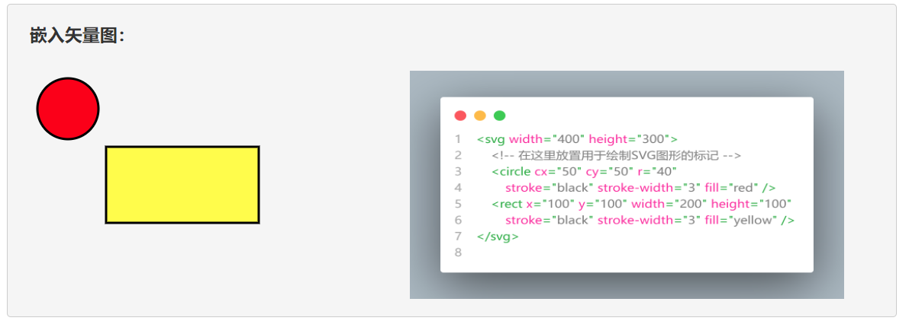
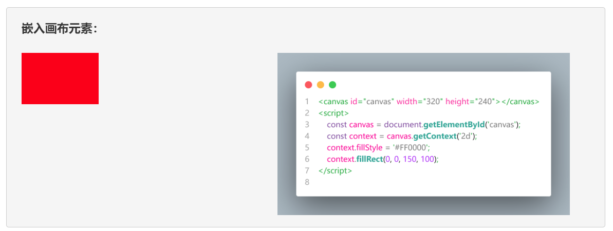

# HTML 学习笔记

HTML是Hyper Text Markup Language的英文缩写，在中文里通常被译为超文本标记语言。从计算机语言的分类上来说，它不是一种编程语言（Programming Language），而是一种标记语言（markup language），主要作用是描述网页的文档结构及其要显示的内容，然后交由网页浏览器来解析，因此网页也通常被称作HTML文档。在正式开始这门标记语言的学习之旅前，本笔记照例需要先来介绍一下它的标准化历程，这对于读者理解这门语言的使用方式与设计哲学是有很大帮助的。

## 发展历程

HTML的出现最早可以追溯到1980年，那时，物理学家蒂姆·伯纳斯-李在欧洲核子研究中心（CERN）承包了一项工程，为了能让该中心的研究员们使用并共享一些文档，他提出并创建了一个名叫“ENQUIRE”的原型系统项目。然后在1989年，伯纳斯-李在一份备忘录中基于这个项目进一步提出了一套基于互联网的超文本系统，他在该备忘录中初步制定了HTML的语言规范，并在1990年底写出浏览器和服务器软件。同年，伯纳斯-李与CERN的数据系统工程师罗伯特·卡里奥联合为项目申请资助，但未被CERN正式批准。

1991年，伯纳斯-李在另一份备忘录中对HTML的语法规范做了更为完整的描述，这份备忘录后来被公认为HTML 0.1。HTML 0.1的规范中定义了18个元素，包括HTML初始的、相对简单的设计。除了超链接标签外，其他设计都深受CERN内部一个以标准通用标记语言（SGML）为基础的文件格式SGMLguid的影响。这些元素后来仍然存在于HTML 4中。

然后直到了1993年中期，互联网工程任务组（IETF）才又正式发布了首个HTML规范的提案。这份名为[“超文本标记语言（HTML）”](https://www.w3.org/MarkUp/draft-ietf-iiir-html-01.txt)的互联网草案由伯纳斯-李与丹·康纳利共同撰写，其中包括一份基于文档类型定义概念（即Document Type Definition，通常缩写为DTD）的语法规范。值得注意的是，这份草案中纳入了对NCSA Mosaic浏览器中用于嵌入在线图像的自定义标签的认可，这反映IETF把标准立足于成功原型的理念。同样，戴夫·拉格特在1993年末提出了与之竞争的、名为“HTML+”的另一份互联网草案，该草案规范了当时在HTML中已经实现的另一些功能，例如表格与填写表单。这两份草案共同形成了被称之为·“HTML 1.0”的规范文件。

接下来，在“HTML”和“HTML+”这两份草案双双于1994年初到期后，IETF创建一个HTML工作组，并在1995年完成了如今被公认为是"HTML 2.0"的规范文件，这是第一个日后真正成为了HTML实现标准的规范文件。令人遗憾的的是，随后的HTML标准化历程一直因竞争利益而遭受停滞。

自1996年起，HTML规范一直由万维网联盟（W3C）维护，并由商业软件厂商出资。不过在2000年，HTML也成为国际标准（ISO/ IEC15445：2000）。HTML 4.01于1999年末发布，进一步的勘误版本于2001年发布。2004年，网页超文本应用技术工作小组（WHATWG）开始开发HTML5，并在2008年与W3C共同交付，2014年10月28日完成标准化。下面，然后我们来具体罗列一下HTML标准化的时间线：

| 版本     | 发布时间 | 描述                                                  |
| ------- | -------- | ---------------------------------------- |
| HTML 0.1 | 1991年 | HTML 0.1 是早期互联网发展中的里程碑，它定义了基础的超文本链接和元素，为网页内容的组织和展示奠定了基础。 |
| HTML 1.0 | 1993年 | HTML 1.0 引入了更多的元素和属性，支持更丰富的页面内容展示，为网页设计带来了更多的可能性。 |
| HTML 2.0 | 1995年 | HTML 2.0 在前一版本的基础上进一步扩展了元素集，以支持更复杂的网页结构和功能。           |
| HTML 3.2 | 1997年 | HTML 3.2 增强了表格、列表以及多媒体元素的支持，使网页可以更直观、动态地展示内容。         |
| HTML 4.01 | 1999年 | HTML 4.01 在前一版本的基础上进行了大量的改进和优化，引入了更多的元素和属性，同时增强了网页的交互性和适应性。 |
| HTML 5  | 2008年 | HTML 5 是现代网页开发的标准，引入了众多新的元素和API，如Canvas、Video、Audio等，支持更丰富的交互和多媒体内容，彻底改变了我们对网页的认知和使用方式。 |

在这篇笔记中，我们将基于HTML 5的标准来介绍相关的基础知识。后者赋予了HTML在面对富媒体、富应用以及富内容时强大的描述能力，这将有助于人们设计出信息量更为丰富的网页。

## 语法学习部分

正如之前所说，HTML是一种计算机标记语言，这意味着我们学习HTML的主要任务就是学会如何使用一系列带尖括号的语法标记。而为了让读者之后能更顺畅地开始学习这些语法标记，我们需要先介绍一些相关的基本概念。下面来看一段用于演示HTML标记用法的伪代码：

```xml
<tag name="example">
    需要使用tag标记定义的内容
</tag>
```

在上述伪代码中，我们定义了一个名为“tag”的元素，和`</tag>`是用于创建该元素的标记，`<tag>`被称为开始标记，`</tag>`被称为结束标记，而`name`所定义的则是该元素的属性，它们之间的关系具体如下。

- **标记**：标记是HTML中最基本的语法单元，它由一系列用尖括号包围的关键字（例如上面的`tag`，这些关键字通常被称为“标记名”）组成，它们的作用是定义HTML文档的基本结构及其要显示的内容。

- **元素**：元素是构成HTML文档的基本组成部分，它通常情况下由一个开始标记和一个结束标记组成（少数元素也可使用单一标记来定义），这对标记之间的内容通常将作为HTML文档的一部分显示在浏览器上。

- **属性**：属性是HTML元素的重要部分，它通常出现在被定义元素的开始标记中，并被放置在标记名之后，如果存在多个属性则以空格分隔，其作用是告诉浏览器如何解析当前标记所定义的元素。

在掌握了以上三个基本概念以及它们间的关系之后，接下来就可以具体学习在网页设计工作中常用的HTML标记及其作用了。本着从简单到复杂，逐步深入的学习原则，让我们先从用于定义文档结构的标记开始介绍。

### 文档定义类标记

在HTML的标准规范中，文档定义类标记通常会位于HTML树状结构的根部，用于定义整个网页的文档结构。下面，我们来具体介绍一下这些标记及其使用方法：

- `<!DOCTYPE>`标记：该标记会被放置在被定义文档的第一行，以便用于指定该文档的类型。例如，如果我们要定义的是一个基于HTML 5标准的网页文档，那么该标记就应该是`<!DOCTYPE html>`。
- `<html>`标记：该标记是用于定义网页文档的总标记。这意味着，所有网页的定义代码都必须从一个`<html>`开始，并以一个`</html>`标记结束，其他所有的HTML标记都必须被放在这两个标记之间。
- `<head>`标记：该标记是用于定义网页头部信息的总标记。换而言之，网页文档中所有与头部信息相关的定义代码都必须从一个`<head>`开始，并以一个`</head>`标记结束，其他用于描述具体头信息的HTML标记都必须被放在这两个标记之间。在HTML的语义中，头部信息中主要提供了网页文档的元数据、外链文件、内嵌代码等信息。虽然这些信息通常不会在网页中直接显示，但由于它们可被Google之类搜索引擎，与网页浏览器相关的应用程序读取并进行相关的解析和渲染，所以我们经常会通过定义头部的方式来提高网页的可访问性、可读性以及可发现性。
- `<body>`标记：该标记是用于定义网页主体内容的总标记。换而言之，网页中所有与可显示内容相关的定义代码都必须从一个`<body>`开始，并以一个`</body>`标记结束，其他需要被显示在网页浏览器中的，用于表示文字、图片、用户界面元素的、与具体内容信息的HTML标记都必须被放在这两个标记之间。
- `<meta>`标记：该标记用于定义网页的具体元数据，例如我们可以用该标签将当前网页所使用的字符集定义为`UTF-8`。
- `<title>`标记：该标记用于定义网页文档的标题，该信息通常会显示在浏览器的标题栏中。
- `<link>`标记：该标记用于定义网页文档所要链接的外部信息，例如我们可以用该标签将要使用的外部CSS样式文件链接到该网页文档中。
  
下面，我们来具体示范一下如何使用上述标记来定义基于HTML 5标准的空白网页文档，其定义代码如下：

```html
<!DOCTYPE html>
<html lang="zh-CN">
    <head>
        <meta charset="utf-8">
        <title>HTML5 入门</title>
    </head>
    <body>
        <!-- 网页内容 -->
    </body>
</html>
```

### 页面布局类标记

和画家在拿到画布之后需要先进行针对整体的构图作业一样，网页设计师们在定义好一个网页文档的结构之后，接下来要完成的就是网页的整体布局设计了。在HTML 5标准发布之前，网页的布局工作基本上是依靠`<div>`标记来完成的。该标记的作用是在网页中定义一个块状显示元素，这是网页设计中会用到的、最基本的布局工具，例如在下面的代码中，读者将会看到一个`id="card"`的块状元素，它的功能在相关的CSS样式作用下在网页中显示一个类似名片的卡片形态。

```html
<!DOCTYPE html>
<html lang="zh-CN">
    <head>
        <meta charset="UTF-8">
        <!-- 搭配相关的CSS样式 -->
        <link rel="stylesheet" href="./styles/main.css">
        <title>一张名片</title>
    </head>
    <body>
        <div id="card">
            
            <h1>企业名称</h1> 
            <p>一段企业简介。</p>
            <ul>
                <li>电话：123-456-7890</li>
                <li>邮箱：message@snowbear.com</li>
                <li>地址：上海市浦东新区某某路X号</li>
            </ul>
        </div>
    </body>
</html>
```

然而，上面这种方式在应对相对复杂的布局需求时通常会出现某种程度上混乱，这将给HTML代码的可读性带来一些不良的影响，并进而会给网页的维护工作带来一些意想不到的麻烦。对此，读者只需想象一下，当同一个HTML文档中存在数十个甚至上百个时而并列、时而嵌套的`<div>`标签时会是什么情况，就不能理解自己会遇到什么麻烦了。为了更好地避免这一类的麻烦，HTML 5标准中新增了许多专用于网页布局的标记，下面来看一下这些标记的基本介绍与使用示范。

- `<header>`标记：该标记不仅可用于定义一个网页的头部区域，也可用于定义网页中某个局部区域的头部；
- `<main>`标记：该标记不仅可用于定义一个网页的主体区域，也可用于定义网页中某个局部区域的正文内容；
- `<aside>`标记：该标记不仅可用于定义一个页面的侧边栏区域，也可用于定义网页中某个局部区域的侧边栏；
- `<footer>`标记：该标记不仅可用于定义一个网页的页脚区域，也可用于定义网页中某个局部区域的底部；
- `<nav>`标记：该标记主要用于定义网站的导航栏，通常被放置在由`<header>`标记所定义的头部区域下方，或者`<aside>`标记所定义的侧边栏区域中，功能是为网站中的各个主要页面提供导航链接。
- `<section>`标记：该标记通常用于定义一个页面的信息展示区，就像一本书可以有多个章节一样，同一页面中也可以包含多个信息展示区；
- `<article>`标记：该标记通常用于定义一个具体的主题单元，该单元可以是一篇文章，也可以是一个视频/音频播放器或小程序。通常情况下，这些主题单元会被放置在由`<section>`标记所定义的内容展示区中，且同一内容展示区内可以有多个主题单元。

从本质上来说，HTML5中新增的这些布局类标记都可被视为`<div>`标记的别名，它们只不过是语义化了该标记的一些特定应用场景。这样做不仅有利于提高HTML代码的可读性，以便降低网页设计项目的维护难度，还能提升网页对搜索引擎的友好度，使得相关信息更容易被找到。下面，我们照例来示范一下这些标记的基本使用方法。

```HTML
<!DOCTYPE html>
<html lang="zh-CN">
    <head>
        <link rel="stylesheet" href="./styles/main.css">
        <title>网页布局类标记的使用示例</title>
    </head>
    <body>
        <header>
            header 标记用于定义网页的头部区域，
            该区域通常用于放置网站的的标题和LOGO。
        </header>
        <nav>nav 标记用于定义网页的导航栏区域。</nav>
        <main>
            <p>main 标记用于定义网页中的主要内容区域。</p> 
            <section>
                <aside>aside 标记用于侧边栏区域。</aside>
                <p>
                    section 标记用于定义一个页面的章节区域，
                    根据要显示的内容类型，同一网页可被划分为多个章节区域。
                </p>
                <article>
                    <!-- 定义文章标题的标记，h1-h6 -->
                    <h1>文章标题</h1>
                    <!--定义文章段落的标记 -->
                    <p>article 标记用于定义一篇文章，
                        根据要显示的信息，同一章节中可以有多篇文章。
                        </p>
                </article>
            </section>
        </main>            
        <footer>
            footer 标记用于定义网页的页脚部分，
            该区域通常用于放置与网站的合作方、版权相关的信息。
        </footer>
    </body>
</html>
```

在将上述HTML代码保存为网页文件之后，读者只需要给该网页配上一些可让布局效果可视化的CSS样式（这些样式代码被保存在本笔记文件所在目录下的`examples/layoutCase/styles`目录中），就可以在用网页浏览器中打开这个网页时看到如图1所示的布局效果。


### 图文编排类标记

在完成了网页布局部分的工作之后，设计师们接下来的工作就是安排要显示在网页浏览器中的具体内容了。而在网页可显示的诸多元素中，最基本的就是图文类元素了，这类元素主要包括标题、段落。引用、列表、表格、链接、图片等。下面，我们就先来介绍一些常用于在网页中显示这类元素的HTML标记。

- `<h1>……<h6>`标记：该标记的作用是在网页中显示文本标题。根据HTML的语法规则，标题元素可以有六个级别，其中，`<h1>`标记定义的标题是最高级别的标题，而`<h6>`标记定义的标题是最低级别的标题。
- `<p>`标记：该标记的作用是在网页中定义一个文本段落元素。
- `<strong>`标记：该标记的作用是在网页中定义一个具有强调语义的文本元素，默认情况下会使用粗体字来显示该标记所包含的文本内容。
- `<em>`标记：该标记的作用也是在网页中定义一个具有强调语义的文本元素，区别是它在默认情况下会使用斜体字来显示该标记所包含的文本内容。
- `<span>`标记：该标记的作用也是在网页中定义一个具有强调语义的文本元素，区别是它在默认情况下并没有特定的样式，需要设计师们特别定义它的样式。
- `<q>`标记：该标记的作用是在网页中定义一个具有引用语义的文本元素，默认情况下会使用单引号来包围该标记所包含的文本内容。
- `<blockquote>`标记：该标记的作用是在网页中定义一个引用文本框元素，它会让浏览器将引用文本中的所有空格、换行符、制表符等原样显示出来，而不会将它们转换为HTML代码中的空格、换行符等。
- `<cite>`标记：该标记的作用是定义一个表示参考资料标题或名称的文本元素，通常是书籍、文章、报纸、电影、音乐等作品的标题。
- `<pre>`标记：该标记的作用是在网页中定义一个预格式文本元素，换而言之，该标记的作用是让浏览器将预格式文本中的所有空格、换行符、制表符等原样显示出来，而不会将它们转换为HTML代码中的空格、换行符等。
- `<br>`标记：该标记的作用是在网页中定义一个换行元素，换而言之，该标记的作用是让浏览器在网页中显示一个换行符。
- `<hr>`标记：该标记的作用是在网页中定义一条水平分割线，通常用于分隔网页中的多个章节区域。
- `<ul>`+`<li>`标记：这两个标记的作用是在网页中定义一个无序列表元素。
- `<ol>`+`<li>`标记：这两个标记的作用是在网页中定义一个有序列表元素。
- `<table>`标记：该标记的作用是在网页中定义一个表格元素，换而言之，网页中关于表格元素的所有定义代码都必须从一个`<table>`开始，并以一个`</table>`标记结束，其他用于描述表格行、单元格的HTML标记都必须被放在这两个标记之间。
- `<tr>`标记：该标记必须放在`<table>`和`</table>`这两个标记之间才能有效发挥作用。它的作用是定义表格的“行”元素，换而言之，表格中每一行的定义代码都必须从一个`<tr>`开始，并以一个`</tr>`标记结束，其中用于描述单元格的HTML标记都必须被放在这两个标记之间。
- `<th>`标记：该标记必须放在`<tr>`和`</tr>`这两个标记之间才能有效发挥作用。它的作用是定义表格标题行中的“单元格”元素，换而言之，表格标题行中每个单元格元素的定义代码都必须从一个`<th>`开始，并以一个`</th>`标记结束，其中用于显示具体信息的HTML标记都必须被放在这两个标记之间。
- `<td>`标记：该标记必须放在`<tr>`和`</tr>`这两个标记之间才能有效发挥作用。它的作用是定义表格中除标题行之外的“单元格”元素，换而言之，表格中除标题行之外的每个单元格元素的定义代码都必须从一个`<td>`开始，并以一个`</td>`标记结束，其中用于显示具体信息的HTML标记都必须被放在这两个标记之间。
- `<a>`标记：该标记的作用是在网页中定义一个超链接元素，换而言之，该标记的作用是让浏览器在网页中显示一个指向其他网页的超链接文本。
- ``标记：该标记的作用是在网页中定义一个图像元素，换而言之，该标记的作用是让浏览器在网页中显示一个图像。

下面，我们将通过模拟设计一个网页版的图文报告模板来示范一下上述HTML标记的使用方法，该示例会被保存在本笔记所在目录下的`examples/report`目录中，我在该目录中创建了一个名为`index.html`的HTML文件，并在其中输入了如下代码。

```html
<!DOCTYPE html>
<html lang="zh-CN">
    <head>
        <meta charset="UTF-8">
        <link rel="stylesheet" href="./styles/main.css">
        <title>图文报告模板</title>
    </head>
    <body>
        <header>
            <h1>图文报告标题</h1>
            <p>发布日期：2023年11月1日</p>
        </header>
        <main>
            <section>
                <h2>第一部分：概述</h2>
                <p>在这里写一些简要的介绍和背景信息，
                    并用<em>无序列表</em>元素设置一个目录。
                </p>
                <ul>
                    <li>第一部分：概述</li>
                    <li>第二部分：论述</li>
                    <li>第三部分：结论</li>
                    <li>第四部分：文献</li>
                </ul>    
            </section>
            <section>
                <h2>第二部分：论述</h2>
                <p>
                    在这里可以放置一些与报告内容相关的<em>图片、表格以及引用文字</em>。
                </p>
                <article>
                    
                    <div>
                        <h3>图文分析</h3>
                        <p>在这里可以用<em>无序列表</em>元素来做一些分析说明。</p>
                        <ul>
                            <li>第一项说明</li>
                            <li>第二项说明</li>
                            <li>第三项说明</li>
                        </ul>            
                    </div>
                </article>
                <article>
                    <h3>表格分析</h3>
                    <table>
                        <thead>
                            <tr>
                                <th>项目名称</th>
                                <th>报价数据</th>
                                <th>相关说明</th>
                            </tr>
                        </thead>
                        <tbody>
                            <tr>
                                <td>项目1</td>
                                <td>￥30000</td>
                                <td>在这里写一段说明文字。</td>
                            </tr>
                            <tr>
                                <td>项目2</td>
                                <td>￥25000</td>
                                <td>在这里写一段说明文字。</td>
                            </tr>
                            <tr>
                                <td>项目3</td>
                                <td>￥50000</td>
                                <td>在这里写一段说明文字。</td>
                            </tr>
                        </tbody>
                    </table>
                </article>
                <article>
                    <blockquote>
                        <h3>引用现有文献</h3>
                        <p>
                            在这里可以使用<em>引用元素</em>援引一段现有文献中的文本段落。
                        </p>
                        <cite>— 引用自《参考资料名称》</cite>
                    </blockquote>
                </article>                
            </section>
            <section>
                <h2>第三部分：结论</h2>
                <p>在这里可以用<em>无序列表</em>元素来做一个总结。</p>
                <ul>
                    <li><strong>结论一</strong>：在这里写一段总结文字。</li>
                    <li><strong>结论二</strong>：在这里写一段总结文字。</li>
                    <li><strong>结论三</strong>：在这里写一段总结文字。</li>
                </ul>
            </section>
            <section>
                <h2>第四部分：文献</h2>
                <p>在这里可以用<em>有序列表+超链接元素</em>来列举报告的参考文献。</p>
                <ol>
                    <li><a href="https://www.example.com">参考文献1</a></li>
                    <li><a href="https://www.example.com">参考文献2</a></li>
                    <li><a href="https://www.example.com">参考文献3</a></li>
                </ol> 
            </section>
        </main>
        <footer>
            <p>&copy; 2023 图文报告公司</p>
        </footer>
    </body>
</html>
```

然后，我们只需要为上述文档编写一些相应的CSS样式（我将来会在《[[CSS 学习笔记]]》一文中详细介绍这些样式的编写方法），并使用网页浏览器打开该文件，就可以看到如下效果。


### 元素嵌入类标记

在网页设计工作中，除了最基本的图文类元素之外，我们通常还会在当前网页中嵌入矢量图、画布、视频、音频、CSS样式、脚本代码等特定数据类型的元素。这些元素也都有对应的HTML标记。下面，我们就分别来介绍一下这些HTML标记，以便读者可以根据项目需求自行选择适当的标记来丰富网页的功能。

#### 嵌入矢量图与画布

在多媒体类的网页设计任务中，设计师们有时候会需要在页面中嵌入一些可定制的矢量图或动画元素，这就需要用到HTML 5提供的`<svg>`标记和`<canvas>`标记，下面来具体介绍一下这两个标记的使用方法。

- `<svg>`标记：该标记用于在网页文档中嵌入矢量图元素。在这里，矢量图是一种用数学公式来绘制的图形格式。由于人们在绘制矢量图时使用的是直线、矩形、圆形等数学几何图形而不是像素点，这使得它在被无限放大或缩小时完全不必担心图像显示会失真，所以矢量图这种图形格式通常要比我们之前使用的位图更适用于响应式网页的设计。
  
  在使用`<svg>`标记定义矢量图元素的过程中，设计师们需要用到一套基于XML实现的、名为SVG的计算机标记语言。例如，如果读者想在网页中嵌入一个绘制有红色圆形+黄色矩形的矢量图，就可以这样做：

    ```html
    <!DOCTYPE html>
    <html lang="zh-CN">
        <head>
            <meta charset="UTF-8">
            <title>嵌入矢量图</title>
        </head>
        <body>
            <svg width="400" height="300">
                <!-- 在这里放置用于绘制SVG图形的标记 -->
                <circle cx="50" cy="50" r="40" 
                    stroke="black" stroke-width="3" fill="red" />
                <rect x="100" y="100" width="200" height="100"
                    stroke="black" stroke-width="3" fill="yellow" />
            </svg>
        </body>
    </html>
    ```

  同样的，上述示例也会被保存在本书源码包中的`Examples/00_demo/embedCase`目录下的`index.htm`文件中，读者可以使用网页浏览器打开该文件，就可以看到如图3所示的效果。

  

  接下来，让我们根据上面的示例简单介绍一下`<svg>`及其子标记的使用要旨：

  - `<svg>`标记具有开始标记 `<svg>` 和结束标记 `</svg>`，在这两个标记之间的内容将被渲染为SVG图形。设计师们可以使用该标记的`width`和`height`属性来指定图形的宽度和高度。这决定了SVG画布的尺寸，所有的图形元素将在这个画布上绘制。
  - SVG拥有一个独立的坐标系，该坐标系的起点（即`(0,0)`）通常位于`<svg>`标记所定义元素的左上角。设计师们可以在SVG中使用该坐标系来放置和定位图形元素。`<svg>`标记内的坐标系统是相对的，它们与`width`和`height`属性的值相关联。在 `<svg>` 标记内，设计师们可以使用一系列子标记来绘制不同的SVG图形元素，例如 `<circle>`、`<rect>`、`<line>`、`<path>` 等，这些子标记有各自的属性，可用于控制图形的外观和行为。
  - 设计师们可以使用CSS样式来控制SVG图形元素的颜色、填充、描边等外观属性。这些样式可以通过在网页中嵌入内联样式或者引用外部CSS文件来进行定义。
  - SVG图形中也可以包含交互性功能，例如添加鼠标事件处理程序，使用户能够与图形进行互动。另外，SVG支持动画，设计师们可以使用 `<animate>` 标记或 JavaScript 来为图形元素添加动画效果。
  - 设计师们可以将SVG图形嵌入到网页中，也可以通过外部文件引入 SVG 图形。这使得图形的重用和维护变得更加容易。

  总而言之，`<svg>`标记是一个可用于在网页中创建矢量图形和图表的强大工具，它提供了丰富的功能，包括绘制、样式、交互性和动画等。而且，SVG图形还可以在不失真的情况下缩放，适合多种不同的屏幕尺寸和分辨率。

- `<canvas>`标记：该标记用于在网页文档中嵌入可用于在运行时进行绘画的画布元素。在使用该标记创建该画布元素时，设计师们通常会先使用该标签的`width`和`height`属性来设置画布的宽度和高度，然后通过执行JavaScript脚本的方式来完成在该元素内部的绘画任务，例如像下面这样：

    ```html
    <!DOCTYPE html>
    <html>
        <head>
            <title>嵌入画布元素</title>
        </head>
        <body>
            <canvas id="canvas" width="320" height="240"></canvas>
            <script>
                const canvas = document.getElementById('canvas');
                const context = canvas.getContext('2d');
                context.fillStyle = '#FF0000';
                context.fillRect(0, 0, 150, 100);
            </script>
        </body>
    </html>
    ```

  同样的，上述示例也会被保存在本书源码包中的`Examples/00_demo/embedCase`目录下的`index.htm`文件中，读者可以使用网页浏览器打开该文件，就可以看到如图4所示的效果：

    

  请注意，`<canvas>`标记与之前介绍的`<svg>`标记是不同的，`<svg>`标记所显示的是页面在被载入时由浏览器依据SVG语言的描述所绘制的数学几何图形，它通常是预先定义好的矢量图形。而`<canvas>`标记中的图形则是利用JavaScript脚本在其运行过程中依据指定参数来绘制的动态图形，因此它具有很大的可编程性，除了用于绘制静态图形之外，也可以用于制作动画和游戏。当然了，对于不熟悉JavaScript这门编程语言的网页设计师来说，在使用`<canvas>`标记之前可能需要学习一些与Canvas API相关的知识。另外，由于不同的网页浏览器对Canvas API的支持程度也有所不同，因此建议读者在使用时该标记时需要保持谨慎的态度，事前必须进行充分的兼容性测试。

#### 嵌入视频和音频

在HTML 5中，设计师们可以使用`<video>`、`<audio>`这两个标记来实现在网页中嵌入视频/音频播放器元素，如今我们所熟悉的哔哩哔哩、喜马拉雅等视频/音频网站，就是基于这两个标记来实现的。下面，我们来分别介绍一下它们的使用方法：

- `<video>`标记：该标记用于在网页文档中嵌入一个视频播放器，我们可以利用其`<source>`子标记的`src`属性来指定要播放的视频文件，例如像这样：

    ```html
    <!DOCTYPE html>
    <html>
        <head>
            <title>嵌入视频播放器</title>
        </head>
        <body>
            <video width="320" height="240" controls>
                <source src="movie.mp4" type="video/mp4">
                <p>你的浏览器不支持HTML 5的视频标签！</p>
            </video>
        </body>
    </html>
    ```

  上述示例被保存在本书源码包中的`examples/embedCase`目录下的`index.htm`文件中，读者可以使用网页浏览器打开该文件，就可以看到如图5所示的效果：

   

  接下来，让我们根据上面的示例来简单介绍一下在网页中嵌入视频播放器元素的基本步骤，具体如下：
  - 首先要做的是使用`<video>`标记来在网页中创建一个视频播放器元素，并设置该元素的位置、高度、宽度以及其他与播放器相关的属性。在此过程中，设计师们主要会使用到该标记的以下属性：
    - `width` 和 `height`属性：这两个属性主要用于设置视频播放器元素在网页中所要显示的高度和宽度。当然在这里，笔者更倾向于建议大家用CSS样式来设置这部分内容，而不是直接在HTML文档中使用这两个属性。
    - `autoplay`属性：该属性用于指定是否要在网页加载完毕之后自动开始播放视频。
    - `controls`属性：该属性用于指定是否要在网页中显示视频播放器的控制按钮。
    - `loop`属性：该属性用于指定是否要在网页中循环播放视频。
    - `preload`属性：该属性用于指定是否要在网页加载完毕之后预先加载视频文件。
    - `muted`属性：该属性用于指定是否要在网页中默认将视频静音。
    - `poster`属性：该属性用于指定是否要在网页中默认显示视频的封面图片。
  - 在定义好音频播放器元素之后，接下来要做的是使用其 `<source>` 子标记来指定该播放器元素具体要播放的媒体文件，该子标记的常用属性如下：
    - `src` 属性：该属性用于指定要媒体文件所在的位置，通常以URL的形式来表示。
    - `type`属性：该属性用于指定要播放的媒体文件的类型。到目前为止，在网页中可以播放的视频格式主要有以下几种：
      - `video/mp4`：该格式用于指定要播放的媒体文件为MP4格式。
      - `video/webm`：该格式用于指定要播放的媒体文件为WebM格式。
      - `video/ogg`：该格式用于指定要播放的媒体文件为Ogg格式。
  - 最后，由于考虑到目前市面上各种浏览器对HTML 5的支持程度并不一致，设计师们通常还会在`<video>`标记内部设置一些文本类标记（例如 `<p>` ），用来指定当浏览器不支持HTML 5的音频标签时页面中要显示的提示信息。

- `<audio>`标记：该标记用于在网页文档中嵌入一个音频播放器，我们可以利用其`<source>`子标记的`src`属性来指定要播放的音频文件，例如像这样：

    ```html
    <!DOCTYPE html>
    <html>
        <head>
            <title>嵌入音频播放器</title>
        </head>
        <body>
            <audio width="400" height="300" controls>
                <source src="horse.mp3" type="audio/mpeg">
                <p>你的浏览器不支持HTML 5的音频标签！</p>
            </audio>
        </body>
    </html>
    ```

  上述示例也被保存在本书源码包中的`examples/embedCase`目录下的`index.htm`文件中，读者可以使用网页浏览器打开该文件，就可以看到如图6所示的效果：

    
  
    接下来，让我们根据上述示例来简单介绍一下在网页中嵌入音频播放器元素的基本步骤，具体如下：
  - 首先要做的是使用 `<audio>` 标记来在网页中创建一个音频播放器元素，并设置该元素的位置、高度、宽度以及其他与播放器相关的属性。在此过程中，设计师们主要会使用到该标记的以下属性：
    - `width` 和 `height`属性：这两个属性主要用于设置音频播放器元素在网页中所要显示的高度和宽度。当然在这里，笔者更倾向于建议大家用CSS样式来设置这部分内容，而不是直接在HTML文档中使用这两个属性。
    - `autoplay`属性：该属性用于指定是否要在网页加载完毕之后自动开始播放音频。
    - `controls`属性：该属性用于指定是否要在网页中显示音频播放器的控制按钮。
    - `loop`属性：该属性用于指定是否要在网页中循环播放音频。
    - `preload`属性：该属性用于指定是否要在网页加载完毕之后预先加载音频文件。
    - `muted`属性：该属性用于指定是否要在网页中默认将音频静音。
  - 在定义好音频播放器元素之后，接下来要做的是使用其 `<source>` 子标记来指定该播放器元素具体要播放的媒体文件，该子标记的常用属性如下：
    - `src` 属性：该属性用于指定要媒体文件所在的位置，通常以URL的形式来表示。
    - `type`属性：该属性用于指定要播放的媒体文件的类型。到目前为止，在网页中可以播放的音频格式主要有以下几种：
      - `audio/mpeg`：该属性用于指定要播放的媒体文件为MPEG格式的音频文件。
      - `audio/ogg`：该属性用于指定要播放的媒体文件为Ogg格式的音频文件。
      - `audio/wav`：该属性用于指定要播放的媒体文件为WAV格式的音频文件。
      - `audio/webm`：该属性用于指定要播放的媒体文件为WebM格式的音频文件。
  - 最后，由于考虑到目前市面上各种浏览器对HTML 5的支持程度并不一致，设计师们通常还会在`<audio>`标记内部设置一些文本类标记（例如 `<p>` ），用来指定当浏览器不支持HTML 5的音频标签时页面中要显示的提示信息。

#### 嵌入CSS样式表

在HTML 5中，除了使用`<link>`标记引入外部的CSS样式文件之外，设计师们也可以选择将只适用于当前网页的样式代码直接写在`<style>`和`</style>`这对标记之间，例如像下面这样：

```html
<!DOCTYPE html>
<html>
    <head>
        <title>嵌入CSS样式</title>
        <style>
            h1 {
                color: red;
            }
        </style>
    </head>
    <body>
        <h1>这是一个 h1 标题</h1>
    </body>
</html>
```

在上述代码中，我们首先使用 `<style>` 标记定义了一个CSS样式，然后在该标记内部使用CSS样式来指定当前网页中所有`<h1>`标记的字体颜色为红色，最后使用 `<h1>` 标记来指定当前网页中所有的标题文字。其效果如下所示：


#### 嵌入脚本代码

在HTML 5中，设计师们可以使用 `<script>` 标记来在网页中嵌入脚本代码，例如我们可以选择将只适用于当前网页的JavaScript脚本代码直接写在`<script>`和`</script>`这对标记之间，让它们以网页内联脚本的形式来执行，例如像下面这样：

```html
<!DOCTYPE html>
<html>
    <head>
        <title>嵌入脚本代码</title>
        <script>
            function changeText() {
                document.getElementById("targetID").innerHTML = "Hello World!";
            }
        </script>
    </head>
    <body>
        <h1>嵌入 JavaScript 脚本代码.</h1>
        <button type="button" onclick="changeText()">打个招呼！</button>
        <p>点击上面的按钮将会在下面显示“Hello World!”。</p>
        <div id="targetID"></div>
    </body>
</html>
```

在上述代码中，我们首先使用 `<script>` 标记定义了一个JavaScript函数，然后在`<button>`标记内部将该函数注册为鼠标点击事件的处理函数，这样一来，当页面中的按钮被鼠标点击时，该函数就将会在`id="targetID"`的`<div>`元素中显示出“Hello World!”字样的文本。其效果如下所示：


当然了，上面这种内联形式的脚本通常只适合编写少量的代码，如果我们将大量的脚本代码与HTML标签混在一起，可能会严重影响代码的的可读性与可维护性。因此在更多时候，我们会选择使用`<script>`标签的`src`属性来嵌入外部的脚本文件，例如像这样：

```html
<!DOCTYPE html>
<html lang="zh-CN">
    <head>
        <meta charset="UTF-8">
        <title>嵌入外部脚本文件</title>
    </head>
    <body>
        <h1>嵌入外部脚本文件</h1>
        <button type="button" onclick="changeText()">打个招呼！</button>
        <p>点击上面的按钮将会在下面显示“Hello World!”.</p>
        <div id="targetID"></div>
        <script src="test.js"></script>
    </body>
</html>
```

然而，这样做会带来一个问题：由于浏览器在默认情况下采用的是同步嵌入模式，即它在读取到`<script>`标记时会先下载完外链的脚本文件，再继续读取后面的HTML标记，这其中造成的延时会影响整个网页的读取效率。为了解决这个问题，我们通常会在使用嵌入外部脚本时选择激活`<script>`标记的`async`属性，令浏览器改用异步载入模式，例如像这样：

```html
<!DOCTYPE html>
<html lang="zh-CN">
    <head>
        <meta charset="UTF-8">
        <title>异步嵌入外部脚本文件</title>
    </head>
    <body>
        <h1>异步嵌入外部脚本文件</h1>
        <button type="button" onclick="changeText()">打个招呼！</button>
        <p>点击上面的按钮将会在下面显示“Hello World!”.</p>
        <div id="targetID"></div>
        <script src="test.js" async="async"></script>
    </body>
</html>
```

这样一来，脚本文件的下载过程就不会影响到后面“其他页面元素”的载入了。然后，我们就只需要`test.js`文件中编写相应的脚本代码即可。

当然了，`<script>`标签的上述使用方式还存在着另一个问题：由于在异步嵌入模式下，浏览器一旦下载完脚本文件就会立即执行，开发者无法确保脚本被执行的具体时间，所以它在上述代码中依然得被放在`id="targetID"`的`<div>`元素的后面。很显然，更理想的选择是将该标签与引用CSS文件的`<link>`标签一样放在`<head>`标签中。如果想做到这一点，我们就得要求浏览器采用延后执行模式，即让浏览器在在载入所有HTML标签之后再执行脚本，这就需要激活`<script>`标签的`defer`属性，例如像这样：

```html
<!DOCTYPE html>
<html lang="zh-cn">
    <head>
        <meta charset="UTF-8">
        <title>嵌入延后执行的外部脚本文件</title>
        <script src="test.js" defer="defer"></script>
    </head>
    <body>
        <h1>嵌入延后执行的外部脚本文件</h1>
        <button type="button" onclick="changeText()">打个招呼！</button>
        <p>点击上面的按钮将会在下面显示“Hello World!”.</p>
        <div id="targetID"></div>
    </body>
</html>
```

除此之外，我们通常还会用`<script>`标签的`type`属性来指定其载入脚本的文本类型，以明确其引用的是哪一种脚本。在HTML 5的标准规范中，`<script>`标签的默认`type`属性值是`type="text/javascript"`，我们之前使用的都是这种文本类型，它不用特别声明。在默认情况下，浏览器会将该标签载入的代码当做普通的JavaScript脚本来执行，但当我们想使用模块，即`type="module"`时，浏览器就会将该标签载入的代码当做JavaScript模块来执行。

最后，我们还必须得考虑一下`<script>`标签不起作用时的情况。出于安全等原因，如今依然存在着一些特定的浏览器或用户会选择禁用脚本功能，这会让许多应用程序的用户界面就会无法正常工作。在脚本功能被禁用的情况下，浏览器会忽略`<script>`标签的存在，这时我们就需要用`<noscript>`标签来建议用户打开浏览器的脚本功能或者改用支持脚本的浏览器，该标签的具体用法如下：

```html
<!DOCTYPE html>
<html lang="zh-CN">
    <head>
        <meta charset="UTF-8">
        <title>浏览器端脚本支持测试</title>
        <script type="module" src="test.js"></script>
    </head>
    <body>
        <noscript>
            <p>本页面需要浏览器支持或启用脚本功能。</p>
        </noscript>
        <h1>浏览器端脚本支持测试</h1>
        <button type="button" onclick="changeText()">打个招呼！</button>
        <p>点击上面的按钮将会在下面显示“Hello World!”.</p>
        <div id="targetID"></div>
    </body>
</html>
```

这样一来，我们的网页就会在脚本功能被禁用时显示一条提示信息，虽然在如今的主流网页浏览器中，它已经很少有机会发挥作用了。

#### 嵌入其他元素

- `<iframe>`标记：该标记用于在网页文档中嵌入另一个网页，我们可以使用该标签的`src`属性来指定要嵌入网页的URL。例如：

    ```html
    <!DOCTYPE html>
    <html>
        <head>
            <title>嵌入另一个网页</title>
        </head>
        <body>
            <iframe src="res/html/example.htm" 
                        width="320" height="240">
            </iframe>
        </body>
    </html>
    ```

    在上述代码中，我们使用`<iframe>`标记在当前网页中嵌入了一个名为`example.htm`的网页，该网页的URL为`res/html/example.htm`，其效果如下所示：

    

    需要提醒读者的是，使用`<iframe>`标记时要注意安全性问题，我们原则上并不鼓励在网页设计中过多地使用该标记。即使在不得已使用时，我们也必须要确保嵌入的网页是可信的，以防止恶意代码或跨站脚本攻击。

### 人机交互类标记

自AJAX为代表的Web2.0技术崛起以来，网页的功能日益被扩展成了一种应用程序的用户界面（因此它们有时也被称为应用程序的前端）。因此，学习*如何构建Web应用程序的用户界面，并赋予它良好的用户体验*也就成为了网页设计工作中的重要任务。为了帮助设计师们更好地完成这一部分的工作，HTML 5中提供了一系列人机交互类的标记，以便用于构建应用程序的人机交互界面。下面，我们就来详细介绍一下这些标记以及它们的使用方法。

#### 可独立使用的标记

同样本着从简单到复杂，逐步深入的学习原则，我们在这里也将会从一些可独立设置的元素开始，下面是用于创建这类元素的HTML标记。

- `<button>`标记：该标记可用于在网页中创建一个独立的按钮元素，该元素可独立响应用户的鼠标点击操作，其基本使用方法如下所示：

    ```html
    <button type="button" onclick="alert('Hello World!')">
        <!-- 这里可以设置按钮上要显示的文字或图形 -->
        <p>普通按钮</p>
    </button>
    <button type="submit" onclick="alert('Hello World!')">
        <!-- 这里可以设置按钮上要显示的文字或图形 -->
        <p>提交按钮</p>
    </button>
    <button type="reset" onclick="alert('Hello World!')">
        <!-- 这里可以设置按钮上要显示的文字或图形 -->
        <p>重置按钮</p>
    </button>
    ```

    在上述示例中，`type`属性用于指定按钮的类型，其取值可以是`button`、`submit`或`reset`，分别表示普通按钮、提交按钮和重置按钮，默认值为`button`。而`onclick`属性则用于指定按钮在被点击时所要执行的JavaScript脚本，其值既可以是JavaScript代码，也可以是JavaScript代码所在的URL。在这里，我们让它弹出一个带有“Hello World!”字样的信息提示框。最后，在`<button>`和`</button>`标记之间，我们可以设置用于显示在按钮上的提示信息，该信息可以是一段文本，也可以是一个图形，但必须要能说明该按钮元素的功能。

- `<input>`标记：该标记可用于在网页中创建一个输入性质的元素，主要包括分别可用于创建文本输入框、密码输入框、单选框、复选框、文件上传控件等元素，其基本使用方法如下所示：

    ```html
    <!-- 以下定义一个文本输入框 -->
    <input type="text" value="文本输入框" />

    <!-- 以下定义一个密码输入框 -->
    <input type="password" value="密码输入框" />

    <!-- 以下定义一组单选框，其中只有一个选项被选中 -->
    <input type="radio" name="gender" value="male" checked="checked" />男
    <input type="radio" name="gender" value="female" />女

    <!-- 以下定义一组复选框，其中有两个选项被选中 -->
    <input type="checkbox" name="hobby" value="basketball" checked="checked" />篮球
    <input type="checkbox" name="hobby" value="football" />足球
    <input type="checkbox" name="hobby" value="swimming" />游泳
    
    <!-- 以下创建一个文件上传控件，用于上传图片 -->
    <input type="file" name="file" />

    <!-- 以下创建一个日期选择控件，用于选择生日 -->
    <input type="date" name="birthday" />

    <!-- 以下定义一个滑块，其中滑块的当前值是50 -->
    <input type="range" min="0" max="100" value="50" />
    ```

    在上述示例中，`type`属性用于指定输入框的类型，其值可以是`text`、`password`、`radio`、`checkbox`、`range`、`file`、`date`、`button`等。需要特别提醒的是，虽然`<input>`标记也可用于创建按钮元素，但与`<button>`标记相比，`<input>`标记的语义更偏向于用户输入的具体信息，笔者原则上并不鼓励用它来设置按钮元素。

- `<textarea>`标记：该标记用于在网页中创建一个支持多行输入的文本输入框，其基本使用方法如下所示：

    ```html
    <textarea rows="3" cols="20">文本区域</textarea>
    ```

    在上述示例中，`rows`属性用于指定该多行文本输入框元素中可以显示的行数，`cols`属性则用于指定该元素中可以显示的列数。

- `<output>`标记：该标记用于在网页中创建一个输出区域，通常需要配合输入性质的元素一起使用，其基本使用方法如下所示：

    ```html
    <!--
        for属性用于指定该输出区域与哪个输入性质的元素相关联，
        在本例中，该输出区域与range元素相关联
    -->
    <output for="range">0</output>    
    <input type="range" id="range"
        min="0" max="100"
        oninput="output.value = range.value"
    />
    ```

    在上述示例中，我们首先用`<output>`标记创建了一个输出区域，然后用`<input>`标记创建了一个滑块，并为其设置了`oninput`事件，当滑块的值发生变化时，会自动更新输出区域中的值。

- `<progress>`标记：该标记可用于在网页中创建一个独立的进度条元素，该元素的主要功能是根据用户的操作或某个预定义的JavaScript脚本来显示某一指定任务的执行进度，其基本使用方法如下所示：

   ```html
   <progress id="task" value="0" max="100"></progress>
   <script>
       document.getElementById('task').value = 50;
   </script>
   ```

    在上述示例中，`value`属性用于指定进度条当前的进度值，而`max`属性则用于指定进度条的最大值。在这里，该标记会根据`<script>`标记中预定义的JavaScript脚本来显示进度条的进度值。

- `<meter>`标记：该标记可用于在网页中创建一个独立的度量值元素，其基本使用方法如下所示：

   ```html
   <meter value="75" min="0" max="100">75%</meter>
   ```

    在上述示例中，`value`属性用于指定度量值元素的当前值，而`min`和`max`属性则用于指定度量值元素的最大值和最小值。

#### 需组合使用的标记

为了帮助设计师们设计出功能更为复杂的用户界面，HTML 5中还提供了一系列需要使用多个标记来创建的人机交互元素，下面，我们继续来介绍这部分HTML标记及其使用方法。

- `<select>`和`<option>`标记：这两个标记可用于在网页中创建一个独立的下拉列表元素，其基本使用方法如下所示：

    ```html
    <select>
        <option value="1">选项1</option>
        <option value="2">选项2</option>
        <option value="3">选项3</option>
    </select>
    ```

    在上述示例中，`<select>`标记用于创建下拉列表本身，而其`<option>`子标记则用于设置下拉列表中的选项，其`value`属性用于指定选项的值。

- `<details>`和`<summary>`标记：这两个标记可用于在网页中创建一个可折叠的内容块元素，该元素允许用户通过单击其标题部分来隐藏或显示它要显示的具体内容，其基本使用方法如下所示：

    ```html
    <details>
        <summary>内容块的标题</summary>
        <!-- 在这里放置要在内容块中显示的内容 -->
        <p>内容块中的一个段落。</p>
    </details>
    ```

    在上述示例中，`<details>`标记则于创建可折叠的内容块元素本身，其`<summary>`子标记则用于设置该块元素的标题部分，而内容块元素要显示或隐藏的具体内容则需要被放置在`<summary>`标记之后到`</details>`标记之前的那个区域中，例如我们在这里放置的是一个`<p>`标记。

- `<datalist>`和`<option>`标记：这两个标记可用于在网页中创建面向`<input>`标记的自动完成列表，其基本使用方法如下所示：
  
    ```html
    <!DOCTYPE html>
    <html>
        <head>
            <title>自动完成列表</title>
        </head>
        <body>
            <input type="text" list="fruits">
            <datalist id="fruits">
                <option value="Apple">
                <option value="Banana">
                <option value="Orange">
            </datalist>
        </body>
    </html>
    ```

    在上述示例中，我们先用`<input>`标记创建了一个文本输入框，然后再用`<datalist>`标记为该文本输入框创建一个自动完成列表元素，并利用其`<option>`子标记为该元素设置了`Apple`、`Banana`和`Orange`三个可选项。  

- `<form>`标记及其子标记：该标记用于在网页中创建一个表单元素，在基于HTML的用户界面设计中，表单元素的作用是收集用户输入的数据。在该元素下，设计师们可以使用一系列子标签来让用户输入数据，这些标记主要包括：
  - `<label>`子标记：该子标记用于在表单中创建一个标签元素，其`for`属性则用于指定该标签所对应的输入框的ID；
  - `<input>`子标记：该子标记用于在表单中创建一个输入性质的元素，其使用方法与该标签独立使用时相同；
  - `<textarea>`子标记：该子标记用于在表单中创建一个多行的文本输入框，其使用方法与该标签独立使用时相同；
  - `<button>`子标记：该子标记用于在表单中创建一个按钮元素，其使用方法与该标签独立使用时相同；
  - `<select>`子标记：该子标记用于在表单中创建一个下拉列表元素，其使用方法与该标签独立使用时相同；
  - `<optgroup>`子标记：该子标记用于在表单的下拉列表中创建一个选项组元素；
  - `<datalist>`子标记：该子标记用于在表单中创建一个自动完成列表元素，其使用方法与该标签独立使用时相同；
  - `<keygen>`子标记：该子标记用于在表单中创建一个密钥对生成器元素。
  - `<output>`子标记：该子标记用于在表单中创建一个输出元素，其使用方法与该标签独立使用时相同。
  - `<fieldset>`子标记：该子标记用于在表单中创建一个表单元素的分组，该分组会设置有一个专属边框；
  - `<legend>`子标记：该子标记用于在表单的分组中创建一个标题，其`for`属性则用于指定该标题所对应的输入框的ID；

    下面，我们来通过一个简单的、用于用户注册的表单示例来具体演示一下这些标记的使用方法：

    ```html
    <form method="post" action="https://www.example.com/register">
        <label for="username">用户名：</label>
        <input type="text" name="username" id="username" placeholder="请输入用户名">
        <br>
        <label for="password">密码：</label>
        <input type="password" name="password" id="password" placeholder="请输入密码">
        <br>
        <label for="email">邮箱：</label>
        <input type="email" name="email" id="email" placeholder="请输入邮箱">
        <br>
        <label for="birthday">生日：</label>
        <input type="date" name="birthday" id="birthday">
        <br>
        <label for="gender">性别：</label>
        <input type="radio" name="gender" id="male" value="male">
        <label for="male" class="radio-label">男性</label>
        <input type="radio" name="gender" id="female" value="female">
        <label for="female" class="radio-label">女性</label>
        <input type="radio" name="gender" id="secret" value="secret">
        <label for="secret" class="radio-label">保密</label>
        <br>
        <label for="hobby">爱好：</label>
        <input type="checkbox" name="hobby" id="football" value="football">
        <label for="football" class="checkbox-label">足球</label>
        <input type="checkbox" name="hobby" id="basketball" value="basketball">
        <label for="basketball" class="checkbox-label">篮球</label>
        <input type="checkbox" name="hobby" id="swimming" value="swimming">
        <label for="swimming" class="checkbox-label">游泳</label>
        <br>
        <label for="address">居住城市：</label>
        <select name="address" id="address">
            <option value="beijing">北京</option>
            <option value="shanghai">上海</option>
            <option value="guangzhou">广州</option>
            <option value="shenzhen">深圳</option>
        </select>
        <br>
        <label for="file">个人照片：</label>
        <input type="file" name="file" id="file">
        <br>
        <label for="textarea">个人描述：</label>
        <textarea name="textarea" id="textarea" cols="30" rows="10"></textarea>
        <br>
        <button type="submit"
                onclick="alert('提交成功')">提交</button>
        <button type="reset">重置</button>
    </form>
    ```

    在上述示例中，我们主要做了以下动作：

    1. 先使用`<form>`标记创建了表单元素。在此过程中，我们用`method`属性指定了表单提交的方式为`post`，用`action`属性指定了表单提交的目的地（即应用程序后端的某个URL）。
    2. 然后用`<form>`标记的各种子标记创建了该表单元素的各个输入字段，并为其设置了对应的`id` 属性，这样在提交表单时，这些输入字段的值会以键值对的形式被提交到服务端。
    3. 最后使用`<button>`创建了该表单元素的提交按钮和重置按钮，并为其添加了点击事件。
  
    上述HTML文档在搭配相应的CSS代码之后，在网页中的显示效果就会如下所示：

    

### 字符实体标记

在HTML中，有些字符拥有特殊的含义，如果直接使用这些字符，浏览器可能无法正常解析，因此我们需要使用一种被称为字符实体的方式来将显示在网页中，下面就让我们来罗列一些其中较为常用的字符，了解一下它们在HTML文档中的实体标记及其编码。

| 显示结果 | 描述     | 实体名称     | 实体编号 |
| -------- | -------- | ------------ | -------- |
|          | 空格     | `&nbsp;`       | `&#160;`   |
| <        | 小于号   | `&lt;`         | `&#60;`    |
| >        | 大于号   | `&gt;`         | `&#62;`    |
| &        | 和号     | `&amp;`        | `&#38;`    |
| "        | 引号     | `&quot;`       | `&#34;`    |
| '        | 撇号     | `&apos;`       | `&#39;` |
| ￠        | 分       | `&cent;`       | `&#162;`   |
| £        | 镑       | `&pound;`      | `&#163;`   |
| ¥        | 人民币 | `&yen;`       | `&#165;`   |
| €        | 欧元     | `&euro;`       | `&#8364;`  |
| §        | 小节     | `&sect;`       | `&#167;`   |
| ©        | 版权     | `&copy;`     | `&#169;`   |
| ®        | 注册商标 | `&reg;`    | `&#174;`   |
| ™        | 商标     | `&trade;`    | `&#8482;`  |
| ×        | 乘号     | `&times;`      | `&#215;`  |
| ÷        | 除号     | `&divide;`     | `&#247;`   |

关于上述字符实体，一个典型的应用场景是：作为网页设计师，我们有时会需要像下图中左侧那样在网页中直接显示HTML代码，这时候就可以像下图右侧这样使用大括号与小括号。


