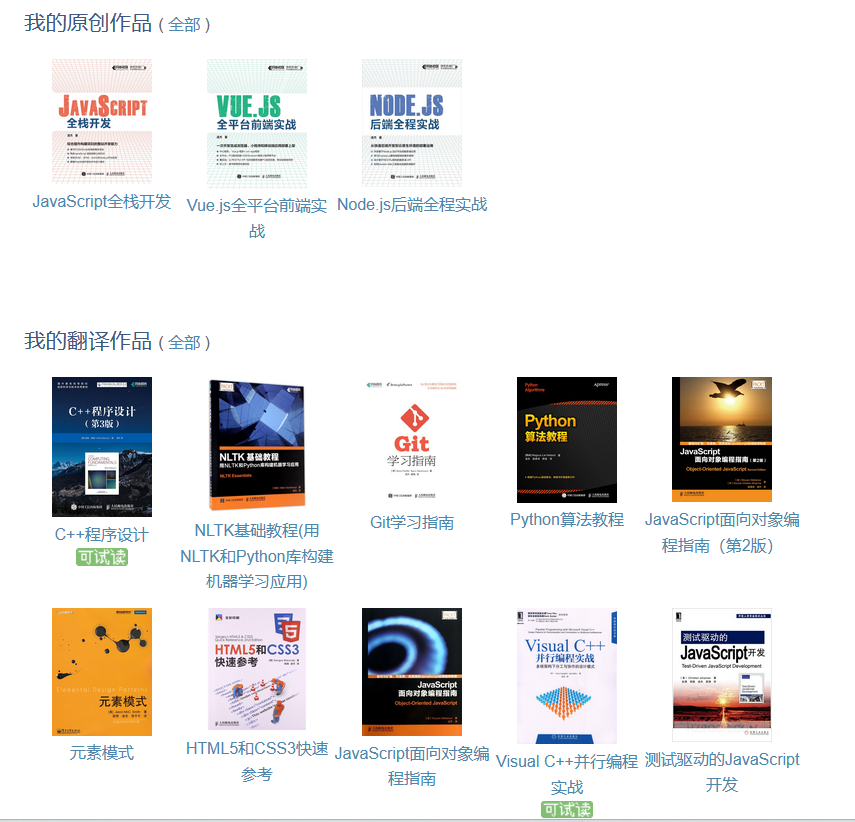

# 什么人适合从事计算机科学研究

最近，有朋友友希望我谈一谈从事计算机技术研究工作的体会和建议，这当然是因为这跟目前我所从事的工作有关系，*但在正式提出个人观点之前，请允许我先做一些自我介绍：严格来说，我是个自由职业者，经常会参与一些计算机专着的写作与翻译工作（主要作品如下图所示），业余偶尔也会有一些机会定期或不定期地参与国内外大学、开源社区中的一些个人研究项目，也帮忙指导过一些硕士论文，所以在编程语言研究、Web 应用程序开发等领域累积了一定的专业知识和实践经验。所以各位看官在看下面这些建议时，要先理解我是基于这些背*景在说话。

首先，各位要确定自己是不是真的适合从事计算机技术的研究工作，从我亲身接触过的各式人员来看，大约有以下三类人是不太适合的。

- *自认吊丝型（自认两个字很重要，个人从来不认为吊丝是一个客观存在的群体）*：这种人无所谓喜欢不喜欢计算，也无所谓研究目的，他们只是单纯地觉得除了“钱钱钱，女人女人女人”，其他都是装逼（比如这篇文章在他们眼里就是百分之一百在装逼），那么我觉得计算机领域里有很多工种更适合他，或者甚至于计算机以外的行当更适合他。吊丝有更适合实现自己梦想的方式。早点认清楚自己，做到扬长避短没什么不好。

- *无法独自相处型*：这种人花在社交网络上的时间远远超过他们看书，测试，分析技术的时间。在我曾经接触过的那些技术群组里，几乎总有那么一两个人，一天到晚总是有着没完没了的问题，再加上没完没了的跑题。有人喜欢他们，也有人不喜欢，但至今为止，我还没看到这样的人在业务上有什么成就，所以显然也不会有什么前途。

- *中国御史型，或者说中国公知型*：技术社区里的确需要激烈讨论，需要异见人士，但并不需要意见领袖，不需要技术讨论以外的道德政治讨论（特别是在工作时间，和派对时间，宁聊体育不聊政治），这种人在我所待过的技术团队里，没有人喜欢，也注定呆不久。

然后，建议各位在进行工作面试或实习的时候，要着重展示自己在以下两个方面的能力：

- *可持续之学习能力*：研究领域面对的是未知，创意以及前瞻性。我希望你知道你一个月内能学会什么东西，比你去年学会了什么东西更重要得多，比如，你有五年 C 语言使用经验，很好，但我们很多人都有，而如果你从今天开始，一个礼拜之内就能学会 Python，那么我们应该不会比你快多少。你对我们很重要。项目更是如此，我不喜欢你告诉我这个不会，那个不会，我更希望你说，给我一个礼拜了解一下。我们不差一个礼拜，但我们缺人才。而且是有限人数当中的人才。所以我们在选人的时候，这是个“背包问题”。我们会采用贪心算法，记住了。

- *自由之思想，无必要即无立场*：你个人喜欢 Linux，喜欢 MacOS，喜欢 Java，喜欢 C#，这都没关系。但最好别意识形态化，是，Windows 连 POSIX 标准都没做好，我本人也强烈不满。但拜托，你别天天念（如果可以的话，我会帮你拨比尔盖茨的电话，你找他理论去）。在技术社区，自由与责任是并行的，想想你为团队能做什么。我们给你自由的工作环境，不是让你来做个伪 geek 的。如果你不能平和地合作，我们会很困扰。况且，大家在坚持个性方面都不会比你差。技术社区不是政治会场，没有必要，请不要强调立场。（当然，这种糟糕的情况很普遍存在，我说得有点理想，但确实是很麻烦的问题）。

研究型工作，虽然很自由，但不轻松，我就说这些，希望能有用。

----
#已完成
