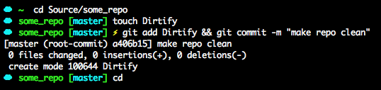
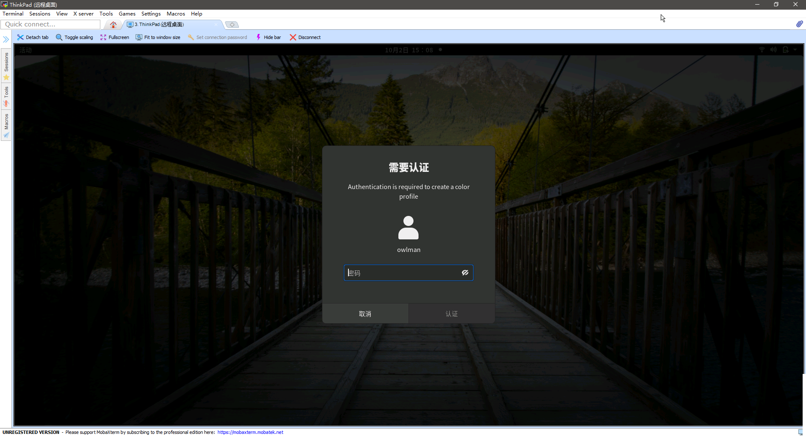

#!https://zhuanlan.zhihu.com/p/359806073

# Ubuntu 学习笔记

## 使用 Linux 的动机和理由

- 第一，非 IE 浏览器市场成熟了，比如网上购物、网上银行这类生活必需的应用不再非 IE 不可了；
- 第二，喜欢用命令行操作电脑，而 Windows 下的 Cygwin 或 Powershell 始终让我感觉差强人意；
- 第三，Windows 不止本身很耗资源，还不得不装一些很耗资源的安全软件，不然撑不过一个月（实际上也不见得有多安全）；
- 第四，Linux 的桌面环境已经比以前成熟多了，易用性也已经得到了很大的改善，不再需要像我在大学时代那样配置系统了（虽然这样对学习计算机专业知识是有好处的）；
- 第五，虚拟机软件很成熟了，无论是 VMware 还是 VirtualBox 都已经很好用了，我们可以在需要时随时建构一个 Windows 机来解决问题。
- 第六，对玩游戏这件事越来越没了兴趣，这可能也是一个重要原因。

## Linux 发行版的选择

需要普及的一个常识是，Linux 本身只是一个操作系统的内核，严格来说它并不是一个完整可用的操作系统。所以我们在说自己使用的是 Linux 系统时，实际上指的是某一种以 Linux 为内核的操作系统，它们通常被称之为 Linux 发行版。关于 Linux 的发行版，各位可以参考来自 Wikipedia 的这张表：


在我个人看来，Linux 目前主流的发行版主要可分为三大分支：

- **以 Debian 项目为基础的发行版**：
  包括 Ubuntu，deepin 等，使用的是 apt 包管理器，比较适合个人的普通用户，也就是不想在 Linux 的配置上花太多时间的用户。
- **以 Redhat 项目为基础的发行版**：
  包括 CentOS，Fedora 等，使用的是 yum 包管理器。由于 Redhat 本身是一个企业级系统，所以他比较适合需要稳定的服务器用户，开发方面的解决方案支持比较完善。
- **以 Arch Linux 项目为基础的发行版**：
  主要代表是 Manjaro，它们使用的是 pacman 包管理。软件为滚动式更新，软件策略比较激进，缺乏充分的稳定性。适合喜欢研究 Linux 的人群，主要是计算机系的学生和 Linux 发烧友。

在这里，个人的选择是 Ubuntu，主要原因是我不想在系统安装和配置上花费过多的时间，为此愿意`放弃一些自由度`。

## Ubuntu 的安装

Ubuntu 系统的具体安装过程非常简单，网上教程也很多，内容也都大同小异，基本上照着以下步骤做即可：

1. 去 Ubuntu 官方网站下载适合自己的安装镜像文件。在这里，我要安装系统的设备是一台 CPU 为 i7 3520M 的 ThinkPad X230，所以选择的是`ubuntu-20.04.3-desktop-amd64.iso`这个镜像文件，即 20.04 版本的桌面系统。

2. 准备一个存储容量大于 4G 的 U 盘，并使用 U 盘刻录软件将其制作成 Ubuntu 的系统安装盘。

3. 将 U 盘插入要安装系统的目标设备，并让该设备从 U 盘启动。待其加载完安装程序之后，在欢迎界面选择系统要使用的语言（这里选择中文），并单击【安装 Ubuntu】按钮开始正式安装。

4. 根据系统安装向导执行以下操作：
   - 在设置【键盘布局】时选择美式键盘。
   - 在设置【更新和其他软件】时，取消【安装 Ubuntu 时下载更新】选项。
   - 在设置【安装类型】时，如果没有双系统方面的需求，建议选择【现在安装】，让系统自动分配分区。
   - 在设置【你在什么地方】时，选择自己所在的时区，这里选择上海。
   - 在设置【你是谁】时，输入自己的名字、目标设备的名称、登录系统时所要使用的用户名和密码等信息。

5. 待系统安装向导执行完所有操作最后，会提示重启设备。这时候需先取出 U 盘，让设备从硬盘重启。这样一来，就能在设备重启之后进入 Ubuntu 系统的 GNOME 桌面环境了

## 初始环境配置

### 将 apt 的源换成国内源

由于某些不可抗力的存在和客观物理网络的问题，国外的网络资源通常被认为是朝不保夕的，所以在安装完 Ubuntu 之后，要做的第一件事应该就是将 apt 的软件源改成国内的镜像，这里选择的是阿里云的源，替换的具体操作如下：

首先备份一下原有的国外源，以备日后在需要时将其恢复：

```bash
cd /etc/apt
sudo cp sources.list sources.list.bak
```

然后用编辑器打开源配置文件`sources.list`，将其内容改成：

```bash
# 使用阿里云的源
deb http://mirrors.aliyun.com/ubuntu/ focal main restricted universe multiverse
deb-src http://mirrors.aliyun.com/ubuntu/ focal main restricted universe multiverse
deb http://mirrors.aliyun.com/ubuntu/ focal-security main restricted universe multiverse
deb-src http://mirrors.aliyun.com/ubuntu/ focal-security main restricted universe multiverse
deb http://mirrors.aliyun.com/ubuntu/ focal-updates main restricted universe multiverse
deb-src http://mirrors.aliyun.com/ubuntu/ focal-updates main restricted universe multiverse
deb http://mirrors.aliyun.com/ubuntu/ focal-proposed main restricted universe multiverse
deb-src http://mirrors.aliyun.com/ubuntu/ focal-proposed main restricted universe multiverse
deb http://mirrors.aliyun.com/ubuntu/ focal-backports main restricted universe multiverse
deb-src http://mirrors.aliyun.com/ubuntu/ focal-backports main restricted universe multiverse
```

最后更新一下系统：

```bash
sudo apt update  && sudo apt upgrade
```

### 安装输入输入法

我这里选择的是输入搜狗输入法，其安装过程如下：

首先，确认当前系统中是否已经安装了 fcitx，由于 Linux 版的搜狗输入法是基于这个输入法框架来设计的，所以必须先确保它已经被安装。在一般情况下，Ubuntu 中文版是安装了这个框架的，如果意外发现没有安装，请执行以下命令来安装它：

```bash
sudo apt install fcitx
# 如果发现有错误提示，请试一下"sudo apt -f install"命令，然后再试一下sudo apt install fcitx。
```

待安装完成之后，执行以下配置操作：

1. 在系统设置中依次打开【区域和语言】 -> 【管理已安装的语言】， 并在【语言】选项卡中点击【添加或删除语言】。

2. 在弹出【已安装语言】窗口中勾选【中文（简体）】，并点击【应用】按钮。

3. 回到【语言支持】窗口，在键盘输入法系统中，选择“fcitx”并点击“应用到整个系统。

4. 去[搜狗输入法的官网](http://pinyin.sogou.com/linux/)下载 ubuntu 系统下的安装包，记住下载对应自己版本的文件，这里下载的是`sogoupinyin_2.4.0.3469_amd64.deb`，然后进入到该文件所在的目录中使用 dpkg 命令安装它：

   ```bash
   sudo dpkg -i sogoupinyin_2.4.0.3469_amd64.deb
   # 如果发现有错误提示，请试一下"sudo apt -f install"命令，然后重新执行一下这条安装命令
   ```

5. 关闭窗口，重启电脑。

请注意，输入法安装之后通常是不能立即启用的。所以，我们需要先注销当前系统用户并重新登录一次，然后就可以搜索出 fcitx 配置，删除不需要的输入法，将搜狗输入法设为默认即可。

### 解决一些问题

如果发现耳机或外接音箱没有声音，建议安装 PulseAudio 音量控制器：

```bash
sudo apt install pavucontrol
```

它的配置方式非常简单，一看就会：


如果外接键盘的数字键存在启动问题，可执行以下命令安装 numlockx：

```bash
sudo apt install numlockx
```

然后编辑配置文件：`sudo gedit /usr/share/lightdm/lightdm.conf.d/50-unity-greeter.conf`，在该文件最后添加一行：`greeter-setup-script=/usr/bin/numlockx on`，然后重启系统即可。

## 工作环境配置

我是个自由开发者和技术写作者，当然编程工具、编辑工具和终端环境是首先要搞定的。

### 安装基本工具

- GNU 开发工具包：`sudo apt install build-essential`
- clang+llvm 环境：`sudo apt install clang llvm`
- JavaScript 环境：`sudo apt install nodejs`
- vim 和 Eclipse：`sudo apt install vim eclipse`
- pandoc 和 LaTeX : `sudo apt install pandoc texlive-full texmaker latex-cjk-all`
- git、wget 和 pip：`sudo apt install git wget python-pip`

### 配置 pip 的国内源

由于某种不可抗力的存在和客观物理网络的问题，国外网络资源是朝不保夕的，所以个人强烈建议，在安装完 pip 之后，第一件事就是将 pip 的源改成国内的，我这里选择的是豆瓣的源，具体如下：

在`/home/owlman/`目录（即你的用户目录）中编辑`.pip/pip.conf`（没有就创建一个），将其内容修改为：

```bash
[global]
    index-url = http://pypi.douban.com/simple
[install]
    trusted-host=pypi.douban.com
```

我们可以执行一下`pip install --upgrade pip`看看是否一切正常，顺便升级一下 pip。

### zsh 和 oh-my-zsh

先查看系统一下有什么 shell：

```bash
cat /etc/shells
```

如果在返回结果中没有看到 zsh，就先安装它：

```bash
sudo apt install zsh
```

安装完成后，输入：`chsh`，然后在返回提示符后输入新值：`/bin/zsh`，最后在终端中输入`sudo echo $SHELL`命令，若返回"/bin/zsh"，说明 SHELL已修改为 zsh（通常要将系统注销-登录一下才会生效）。

接下来，我们安装 oh-my-zsh ，执行以下命令：

```bash
wget https://github.com/robbyrussell/oh-my-zsh/raw/master/tools/install.sh -O - | sh
```

在安装完成后，在家目录下会有隐藏文件`.zshrc`，可根据个人喜好进行配置。例如 zsh 的主题：
可以通过查看 OMZ 提供的主题：

```hash
ls ~/.oh-my-zsh/themes
```

然后，选择一款主题，譬如我们选择`cloud`，就编辑`~/.zshrc`文件中的`ZSH_THEME`变量：`ZSH_THEME="cloud"`。效果如下所示：



### powerline 插件

powerline 是一款非常棒的命令行提示符插件，它可以让我们在使用命令行环境以及 vim 这种命令行编辑器时拥有更良好的用户体验。现在，我们可以执行以下命令来安装 powerline：

```bash
pip install powerline-status --user
```

然后通过`pip show powerline-status`命令查找其安装位置：

```bash
Name: powerline-status
Version: 2.6
Summary: The ultimate statusline/prompt utility.
Home-page: https://github.com/powerline/powerline
Author: Kim Silkebaekken
Author-email: kim.silkebaekken+vim@gmail.com
License: MIT
Location: /home/owlman/.local/lib/python2.7/site-packages
Requires:
Required-by:
```

(如果要进行 powerline 相关的配置，它的`Location`值是必须要了解的，下面我们将以`/home/owlman/.local/lib/python2.7/site-packages/powerline/`为例。）

安装 powerline 字体：

```bash
sudo apt install fonts-powerline
```

配置 zsh：

在`/home/owlman/`目录（即你的用户目录）中编辑`.zshrc`文件，在其末尾加入一行：

```bash
. .local/lib/python2.7/site-packages/powerline/bindlinds/zsh/powerline.zsh
```

效果如下：


配置 tmux：

在`/home/owlman/`目录（即你的用户目录）中编辑`.tmux.conf`文件，在其末尾加入一行：

```bash
source '.local/lib/python2.7/site-packages/powerline/bindings/tmux/powerline.conf'
```

效果如下：


配置 vim：

在`/home/owlman/`目录（即你的用户目录）编辑`.vimrc`文件，在其中加入一下三行：

```bash
set rtp+=.local/lib/python2.7/site-packages/powerline/bindings/vim/
set laststatus=2
set t_Co=256
```

效果如下：


## 日常所用软件

当然，计算机如今已经成为了人类生活的一部分，即使是程序员，除了编程工作之外，也是需要用计算机处理一些日常实物和娱乐的。下面就来分享一些本人除编程之外会用到的一些软件。

### 系统工具

- [Tilix](https://github.com/gnunn1/tilix)：
  这是一款极好用的命令行终端软件，个人非常喜欢。
- [vim](https://www.vim.org/)：
  著名的命令行编辑器，这个应该不用多介绍了吧？
- [vscode](https://code.visualstudio.com/)：
  时下很火热的一款跨平台的图形化编辑器，拥有极为丰富的插件。
- Gnome tweak tool：
  非常重要的gnome桌面配置工具，我们可用它来修改桌面主题，字体，鼠标光标，并安装各种gnome插件。

### 休闲类软件

- Web 浏览器：Firefox、Chromium（后者是 Chrome 的开源版）。
- E-Mail 客户端：Thunderbird。
- bt下载器： KTorrent、Deluge。
- 文件同步：[坚果云](https://www.jianguoyun.com/)，这是国内唯一一款支持 Linux 系统的文件云端同步软件。
- 视频播放器：[VLC](https://www.videolan.org/)，这是一款自由、开源的跨平台多媒体播放器及框架，可播放大多数多媒体文件，以及DVD、音频CD、VCD等及各类流媒体协议。

### 办公类软件

- [WPS套件](http://www.wps.cn/product/wpslinux/)：
  个人认为这是最适合中文环境的办公处理套件，基本兼容 Microsoft Office 套件的文档格式。当然，该软件在安装之后，可能会缺失一些字体，我为此专门写了一个脚本并将其上传到了我的 Github 中，有需要的人可以执行以下命令来安装这些字体：

    ```bash
    git clone https://github.com/owlman/wps_fonts.git
    cd wps_fonts
    ./install_wps_fonts.sh
    ```

- [xmind](https://www.xmind.cn/)：
  近几年思维导图软件是越来越火，XMind 是一款非常实用的商业思维导图软件，应用全球最先进的 Eclipse RCP 软件架构，全力打造易用、高效的可视化思维软件，强调软件的可扩展、跨平台、稳定性和性能，致力于使用先进的软件技术帮助用户真正意义上提高生产率。

- [Okular](https://okular.kde.org/)：
  Okular 是 Ubuntu 下很受欢迎的一款PDF阅读器，拥有各种好用的 PDF 文档注释及格式转换功能。我们可直接执行`sudo apt install okular`命令来安装它。

- [GIMP](https://www.gimp.org/)：
  GIMP 是 GNU 图像处理程序(GNU Image Manipulation Program)的缩写。包括几乎所有图象处理所需的功能，号称 Linux 下的 PhotoShop。我们可直接执行`sudo apt install gimp`命令来安装。

- [Dia](http://dia-installer.de/)：
  Dia 是 Linux 环境下的一款绘制流程图的工具，我们可以用它来绘制各种各样的图形，如UML、流程图、界面构造等。对于一些常用的图形，Dia 都提供了相应的模板。我们可直接执行`sudo apt install dia`命令来安装。

### 兼顾 Windows

在 Linux 下使用 Windows 软件，有两种方式，第一种是安装虚拟机软件（譬如 VirtualBox），然后在其中安装一个 Windows 系统的虚拟机，另一种是使用 wine。

- [VirtualBox](https://www.virtualbox.org/)的安装非常简单，在 Ubuntu 下可直接执行`sudo apt install virtualbox`命令来安装它。在其中安装Windows和在实体机上安装并没有差别，这里就不多做介绍了。

- [wine](https://www.winehq.org/)是一个在 Linux 和 UNIX 之上的，Windows 3.x 和 Windows APIs 的实现。请注意，Wine 不是 Windows 模拟器，而是运用 API 转换技术实做出 Linux 对应到 Windows 相对应的函数来调用 DLL 以运行 Windows 程序。Wine 可以工作在绝大多数的 UNIX 版本下,包括 Linux, FreeBSD 和  Solaris。另外，也有适用于 Mac OS X 的 Wine 程序。Wine 不需要 Microsoft Windows, 因为这是一个完全由百分之百的免费代码组成的。如果有可利用的副本的话，它也可以随意地使用本地系统的 DLLs。Wine 的发布是完全公开源代码的，并且是免费发行的。
  - 安装参考： `https://wiki.winehq.org/Ubuntu_zhcn`
  - 配置参考： `https://wiki.winehq.org/Winetricks`

#### wine使用实例：安装QQ

- 第一步：先核心字体，在终端中执行命令`winetricks corefonts vcrun6`
- 第二步：安装 QQ，在终端中执行命令`winetricks qq`
- 第三步：如果 QQ 的启动器不能启动，在终端中执行命令`gedit .local/share/applications/wine/Programs/腾讯软件/QQ/腾讯QQ.desktop`，打开启动器文件并将其内容修改如下：

    ```bash
    [Desktop Entry]
    Name=腾讯QQ
    Type=Application
    StartupNotify=true
    Icon=QQ
    Exec=wine /home/owlman/.wine/drive_c/Program\ Files/Tencent/QQ/Bin/QQScLauncher
    # Exec=env WINEPREFIX=/home/owlman/.wine wine C:\Program Files/Tencent/QQ/bin/QQScLauncher.exe
    ```

## 常用的 shell 命令

作为一名 Linux 用户来说，键盘的作用往往要远大于鼠标。而且，我也希望越来越多的用户能认识到命令行的潜在价值，不要把它视为只是计算机专家们的玩具，这些工具所带来的方便和效率，是图形界面无法比拟的。计算机管理员可以通过它们在更少的时间内、更有效地完成复杂的任务。以下是我自己的一些常用命令。

- 文件操作：
  - 进入指定目录：`cd <dirname>`
  - 显示当前目录：`pwd`
  - 创建目录： `mkdir <dirname>`
  - 表列出文件： `ls <dirname>`
  - 表列文件详细信息：`ls -l <dirname>`
  - 表列所有文件（包含隐藏文件）：`ls -a <dirname>`
  - 为文件添加可执行权限：`chomd +x <filename>`
  - 为文件或目录添加写权限：`chmod +w <filename_or_dirname>`
  - 为文件或目录分配只读权限：`chomd =r <filename_or_dirname>`
  - 复制文件或目录：`cp [option] <old_dir_or_old_file> <new_dir_or_new_file>`
  - 移动文件或目录：`mv [option] <old_dir_or_old_file> <new_dir_or_new_file>`
  - 删除文件或目录：`rm [option] <dirname_or_filename>`
  - 文件软链接：`ln -s <dirname_or_filename> <linkname>`
  - 显示文件内容：`cat <filename>`
  - 翻页显示文件内容：`cat <filename> | less`
  - 将文件内容追加到另一文件中：`cat <source_file> >> <target_file>`
  - 根据文件名查找文件：`find <dirname> -name "<regex>"`
  - 找出某目录下`n`天之内更新过的文件：`find <dirname> -ctime -n`
  
- apt 包管理器：
  - 搜索指定包：`apt-cache search <packagename>`
  - 获取指定包的信息：`apt-cache show <packagename>`
  - 安装指定包：`apt install <packagename>`
  - 重新安装指定包：`apt install <packagename> --reinstall`
  - 删除指定包：`apt remove <packagename>`
  - 删除指定包及其配置文件：`apt remove <packagename> --purge`
  - 更新源：`apt update`
  - 更新已安装的包：`apt upgrade`
  - 升级系统：`apt dist-upgrade`
  - 了解使用依赖：`apt-cache depends <packagename>`
  - 查看该包被哪些包依赖：`apt-cache rdepends <packagename>`
  - 下载指定的源代码：`apt source <packagename>`
  - 清理无用的包：`apt clean`
  
- sed 命令：
  - 对文件执行命令：`sed [options] <command> <filename(s)>`
  - 对文件执行脚本：`sed [options] -f <scriptfile> <filename(s)>`

- wget 命令：
  - 下载文件： `wget <URL>`
   下载并另存为：`wget -o <filename> <URL>`
  - 断点续传下载：`wget -c <URL>`

- tar 命令：
  - 查看压缩包：`tar -tf <packagename>.tar.gz`
  - 压缩文件：

      ```bash
      tar –cvf <packagename>.tar *.jpg
      tar –czf <packagename>.tar.gz *.jpg
      tar –cjf <packagename>.tar.bz2 *.jpg
      tar –cZf <packagename>.tar.Z *.jpg
      ```

  - 解压文件：

      ```bash
      tar –xvf <packagename>.tar
      tar -xzvf <packagename>.tar.gz
      tar -xjvf <packagename>.tar.bz2
       tar.bz2tar –xZvf <packagename>.tar.Z
      ```

- xsel 命令：
  - 将文件内容复制到剪贴板：`cat <filename> | xsel -i`
  - 将剪贴板中的内容复制到文件：`xsel > <filename>`
  - 将剪贴板中的内容追加到文件：`xsel >> <filename>`

## 设置远程桌面

有时候，我也会需要在另一台安装了 Windows 系统的台式机上访问安装了 Ubuntu 系统的笔记本。为了丰富远程登录的方式，除了配置 ssh 服务之外，我还为它配置了远程桌面的服务，其主要步骤如下：

1. 在系统设置的【共享】选项卡中打开【远程登录】选项，如下图所示：

   

2. 安装`xrdp`服务，这是一个微软远程桌面协议(RDP)的开源实现，它允许 Windows 用户可以使用 RDP 客户端远程访问 Linux 桌面，其安装命令如下：
  
   ```bash
   sudo apt install xrdp
   ```

3. 执行如下命令安装`dconf-editor`配置编辑器：

   ```bash
   sudo apt install dconf-editor
   ```

   待其成功安装之后，启动`dconf-editor`配置编辑器，然后依次展开org -> gnome -> desktop -> remote-access 选项卡，并将其中的`requlre-encryption`选项关闭（即设置为`false`），如下图所示：

   

4. 在另一台 Windows 系统的计算机上启动 RDP 客户端。在这里，我使用的是一款名为 MobaXterm 的远程登录软件，具体做法就是创建一个 RDP  类型的会话，并在其中笔记本在家中局域网中的 IP 地址和用于登录 Ubuntu 系统的用户名：

   

5. 保存会话之后，就可以启动 RDP 远程登录连接了。如果看到如下界面，就证明 Ubuntu 系统中的远程桌面服务已经配置妥当了。

   
