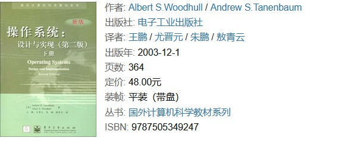
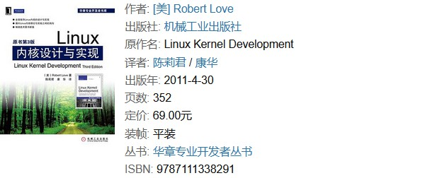
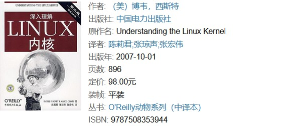
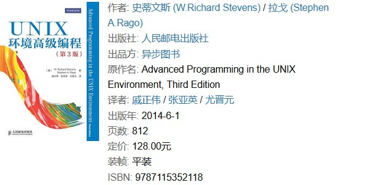
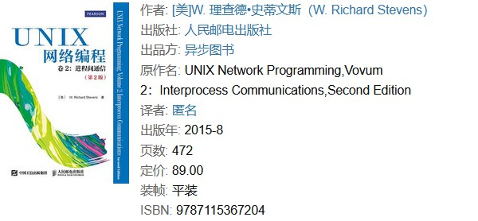

# 关于类 UNIX 系统的学习及其推荐书目

我曾经在知乎上看到有人问：为什么国产操作系统都是基于 Linux 内核来进行开发？为什么不能从零开始开发一套操作系统呢？事实上，这其中除了采用开源许可证能有效地规避一些法律问题，基于现成的代码能有助于降低开发成本之外，其技术上最大的原因就是类 UNIX 系统的 API 在操作系统领域建立的标准。只要稍加留意我们日常所使用的各类计算设备，读者可能就会发现这样一个事实：除了采用 IBM PC 体系的个人计算机之外，几乎所有国家的计算机设备上运行的操作系统大多都属于类 UNIX 系统，例如 Apple 设备、许多路由器产品中运行的几乎都是 *BSD 的操作系统，各种非 Apple 的移动端设备、主流服务器上运行的都是以 Linux 为内核的操作系统。

关于类 UNIX 系统在非 PC 端操作系统的市场中所占据的这种主导地位，很多解释都倾向于认为是 Windows 系统的可扩展性差、不够安全之类等缺点导致的，个人认为这种说法多少有点倒果为因了，事实上不过是因为这两类操作系统在相关领域存在着先来后到的历史事实，且先来者有权制定 API 标准罢了。而在科学技术领域，历来都是得标准者得天下。下面，就让我们先来简单介绍一下类 UNIX 系统的发展历史吧。

## 发展历史及其影响

在计算机发展的启蒙时代，计算机上执行的任务都是靠人工来编排的。而随着要执行的计算任务越来越多，这种人力编排的方式就越来越无法体现使用计算机的效率优势了，于是能实现自动化任务编排的批处理系统就应运而生了，而这就是最早的计算机操作系统。但这类系统也只是解决了任务在执行顺序上的编排问题，解决不了任务在等待用户输入期间的计算资源闲置问题，于是人们就继续研发出了能更合理分配计算资源的分时操作系统。另外，随着越来越多型号各异的计算机设备被生产出来，且这些设备的厂商都会为其配上专用的操作系统（例如，今天的 Apple 公司依然在坚持这个做法），这意味着用户一旦需要更换不同型号的计算机，就不得不学习新的操作系统，这是非常不利于计算机设备的普及的。为了解决这一问题，通用分时操作系统的概念就应运而生了。

通用分时操作系统主张让软件基于操作系统，而不是基于硬件来实现，以求在不同硬件上提供相似的用户体验。这类操作系统的开发最早可追溯到一个叫做 Multics 的项目，但这个项目因为在设计目标上的野心过大，开发进度过于缓慢而被撤销 。贝尔实验室的 Brian Kernighan 和 Dennis Ritchie 二人在撤出 Multics 项目之后，在其原本的设计上做了减法，从而搞出了 UNIX 系统（附带着发明了 C 语言）。令人遗憾的是，后来 UNIX 因为美国政府的一系列反垄断措施以及 AT&T 自身的错误决策导致了该系统在市场上的推广遇到了始料未及的困难。于是，为了绕开相关法律对科研工作的干扰，加州大学伯克利分校重新实现了 UNIX 的 API，发展出了被称之为 *BSD 的类 UNIX 系统，包括 FreeBSD、NetBSD、OpenBSD、Darwin 等，Apple 公司就是基于 Darwin 的内核开发出了 macOS、iOS 等一众产品的操作系统。除此之外，还有一位荷兰的大学教授 Andrew S. Tanenbaum 出于教学的需要，也基于 UNIX 的 API 开发出了一个叫做 MINIX 的操作系统，而该系统又启发 Linus Torvalds 开发出了 Linux 内核项目，而后者正是 Ubuntu、RedHat、Android 等一众操作系统的内核。

在上述发展过程中，业界基于 UNIX 系统的 API 逐步地制定出了 POSIX 标准。在这里，POSIX 这个名称是由 Richard Stallman 应 IEEE 的要求而提议的一个易于记忆的名称。其中，POSI 是 Portable Operating System Interface（中文可译为“可移植操作系统接口”）的英文缩写，而 X 则表明其对 UNIX API 的传承。该标准可以使得在各个类 UNIX 系统之间移植的软件只需重新编译即可运行，无需修改代码。也正因为如此，原本就致力于重新实现 UNIX API 的 Linux 项目、BSD 项目才能凭借着开源的优势迅速在非 PC 端的操作系统市场上占据了主导地位。另一方面，Windows 系列操作系统则因为早期专注于 PC 领域，忽视了对 POSIX 标准的参与，因而失去了进入服务器、移动设备以及路由器等网络设备市场的先机，成为了后来者。

关于上述历史中的更多详细细节，读者也可以通过《UNIX 传奇》这本书来聆听一下 Brian Kernighan 作为历史亲历者的讲述。

## 规划学习路线图

在理解了类 UNIX 系统在计算机世界中的主导地位之后，读者就应该明白了学习和研究它的必要性，但紧接着要面对的一个问题是：类 UNIX 系统是一个非常庞大的知识体系，我们该从何处入手呢？在笔者个人看来，和许多国产操作系统的开发一样，从 Linux 内核项目的着手是一个参考资料充足，可行性很高的切入点。接下来，我将会基于这个切入点，并辅以推荐书目的形式来为读者规划一个研究类 UNIX 系统的学习路线图，以供参考。

如果读者要想在操作系统这个领域行稳致远，首先需要对它有一个全局性的、概念性的理解。关于这一方面的学习，我个人会推荐读者去阅读《操作系统：设计与实现》这本书。正如我们之前所说，该书的作者  Andrew S. Tanenbaum 是基于教学的需要才开发出了 MINIX 这个启发了 Linux 项目的操作系统，他的讲解无论在理论还实现上都是非常具有权威性的。  

在深入地理解了操作系统的基本概念以后，接下来就可以开始研究 Linux 的内部运行机制了。在这个方面可参考《Linux 内核设计与实现》这本书。该书的作者 Robert Love 是一位 Linux 内核项目的核心开发人员，他在书中分享了在开发 Linux2.6 内核是累积的知识和经验，其主题包括进程管理、进程调度、时间管理和定时器、系统调用接口、内存寻址、内存管理和页缓存、VFS、内核同步、移植性相关的问题以及调试技术。  

在 Linux 内核运行机制有了一定的了解之后，就可以开始具体研究 Linux 内核源码了。这方面最值得推荐的书籍是《深入理解 Linux 内核》这本书。该书会手把手地带领读者对 Linux 内核实现中使用到的重要数据结构、算法和程序设计诀窍进行一次遍历式的代码剖析。通过对这些表面特性的探究，我们可以了解到作者对机器工作原理的独到见解。需要切记的一点是。在学习这本书时必须要搭配 Linux 的内核代码一起研究，这将会是一个非常漫长，且需要一步一个脚印的过程。  

在理解了 Linux 的内核实现之后，如果读者想更进一步在基于类 UNIX 系统的编程方面有所作为，也可以继续选择性地阅读以下书籍：

- 在编程思想方面，我强烈推荐读者阅读一下《UNIX 编程艺术》这本书，该书由公认的类 UNIX 系统领域的编程大师、开源运动领袖人物之一 Eric S. Raymond 编著。书中的内容覆盖了类 UNIX 系统的方方面面，系统性地介绍了这一编程领域的社群文化、软件设计哲学、开发原则与经验。  
    

- 在具体的项目实践方面，我要推荐给读者的是《UNIX 环境高级编程》这本书。该书借助一系列简明但完整的示例程序详细阐述了 400 多个 UNIX API，清楚地说明它们的用法、参数和返回值。它出版二十多年来帮助了几代程序员写出强大、高性能、可靠的代码，如果能把该书中的示例都实践一遍，我们就会对整个类 UNIX 系统的应用层编程有系统性的认识。  
    

- 如果条件允许，我也会建议读者去系统性地学习一下《UNIX 网络编程（卷 1-2）》这套书，这样一来，我们在从事与网络应用相关的开发工作就基本上应该不会有太大的问题了。  
    

    

## 结束语

在本文的最后，我想与读者共勉的是：请时刻提醒自己，千万不要因为类 UNIX 系统的复杂性而产生畏难情绪，我们要做的只是一步一个脚印地心无杂念地研究下去即可，研究本身就会给人带来极大的快乐与成就感。重点是不要被当下浮躁的社会风气影响，多把时间花在对自己更有意义的事情上。

 
----
#已完成
