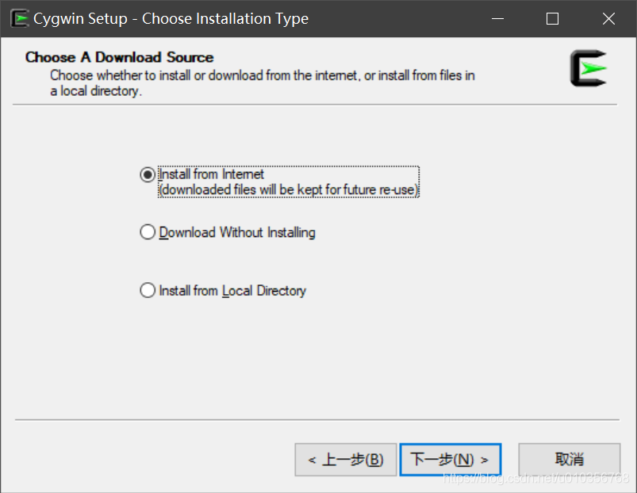
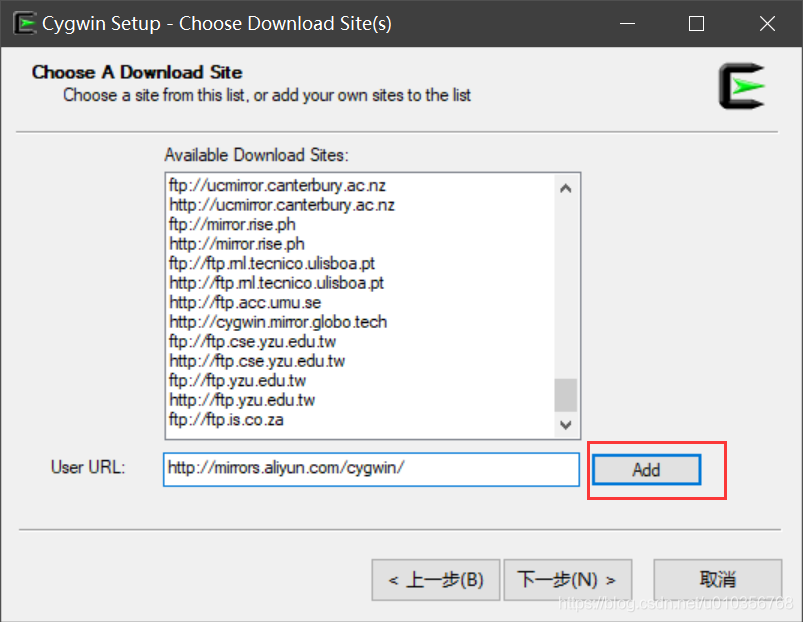

# Cygwin 研究笔记

这篇笔记将用于记录个人在研究 Cygwin 这一 UNIX-like 模拟环境过程中所获取的学习心得与使用经验，我会将笔记的原始文本存储在`https://github.com/owlman/study_note`项目的`OperatingSystem/Windows/ShellTool`目录下，并予以长期维护。

## Cygwin 简介

Cygwin 的开发始于 1995 年，它最初是 Cygnus 工程师 Steve Chamberlain 的一个私人项目。当时，Windows NT 和 Windows 95 中的可执行文件、共享库文件使用的都是 COFF（即 Common File format，中文可译为“通用目标文件格式”）的文件格式，而 GNU 工具集已经支持了面向 x86 和 COFF 的编译，以及 C 语言库 newlib。因而 Steve Chamberlain 认为至少在理论上，人们已经可以考虑通过将 gcc 编译器重定向来实现交叉编译（cross-compile），从而产生能在 Windows 系统上运行之前只能在 UNIX-like 系统中运行的程序。正是基于这一设想，他才在后来的不断实践中成就了 Cygwin 项目。

到了1996 年后，由于看到 Cygwin 可以在 Windows 系统上很好地为用户提供 Cygnus 嵌入式工具（以往的方案是使用 DJGPP），该公司的其他工程师也陆续加入到了这个项目中。该项目最吸引人的地方是：人们可以使用 Cygwin 提供的模拟环境来实现三方交叉编译（即 three-way cross-compile），例如，我们可以选择在 Sun 工作站上编译并建构应用程序，如此就形成 Windows-x-MIPS cross-compile，这样比单纯在 PC 上编译要快上不少。于是自 1998 年起，Cygnus 开始将 Cygwin 包作为公司的主打产品来提供。目前，Cygwin 项目已经被 Red Hat 公司收购，并交由其下属社区来负责维护，但 Cygwin 本身依然 声明遵守 GPL 许可协议，并可以跟符合开源定义的自由软件进行链接。

总而言之，Cygwin 就是一个在 Windows 平台上运行的 UNIX-like 模拟环境，在 WSL 出现之前，该软件对于在 Windows 环境中学习 UNIX-like Shell 操作环境，或者实现应用程序从 UNIX-like 到 Windows 的跨系统移植与开发工作都是非常有使用价值的。

从技术上来说，Cygwin 项目所做的主要就是提供了一个可在 Windows 系统中模拟 UNIX-like 系统环境的 DLL 文件，并在其上移植了多种在 UNIX-like 系统中常用的软件包。其中最重要的是，Cygwin 项目在 Windows 系统下实现了符合 POSIX 标准的系统 API，并成功移植了一套 GNU 工具集（比如 gcc、gdb 和 make）。除此之外，还有一个名为 MinGW 的库，该库可以跟 Windows 本地的 MSVCRT 库（即 Windows API）一起工作。MinGW 占用内存、硬盘空间都比较少，能够链接到任意软件，但它对 POSIX 标准的实现没有 Cygwin 库完备。

美中不足的是，Cygwin 不支持 Unicode。除了当前 Windows 系统以及 OEM codepages（例如，俄语用户的代码页应该是 CP1251 和 CP866，而不能是 KOI8-R、ISO/IEC 8859-5、UTF-8 等），Cygwin 对其他字符集都不支持。Cygwin 的较新版本可以通过自带终端模拟器的设置来满足显示 UTF-8 和更多代码页的功能。

## 安装与配置

Cygwin 的安装文件很容易通过搜索引擎找到。国内的网站上有"网络安装版"和"本地安装版"两种。标准的发行版应该是网络安装版。两者并无大不同。具体安装方法就是，在下载到 Cygwin 的安装文件（通常名为`setup.exe`）后，启动它的图形化安装向导即可开始进行安装，大多数情况下，我们只需 一路直接点"下一步(N)—>"即可，只有在下面步骤中需要做一些特别操作。

1. 在选择 Cygwin 的安装模式时，我们有"Install from Internet"、"Download from Internet"、"Install from Local Directory" 三个选项。通常情况下，我们会选择"Install from Internet"这一选项，即直接通过网络镜像来安装。

    

2. 考虑到网络环境的问题，我们往往还需在安装镜像列表中选择一个位于中国境内的镜像源，以便提高安装速度。

    

3. 选择需安装的 Cygwin 组件包。通常情况下，我们需要安装 Devel 这个部分的模块，其中包含了各种开发所用到的工具或模块。

    

接下来要做的是环境变量设置。在开始运行 Cygwin 中的 bash 终端环境之前，我们应该设置一些环境变量。为此，Cygwin 提供了一个`.bat`文件，里面已经设置好了最重要的环境变量。通过它来启动 bash 终端是最安全的办法。这个`.bat`文件安装在Cygwin所在的根目录下，其可编辑的主要内容如下：

- `CYGWIN`变量：该变量用于针对 Cygwin 运行时系统进行多种全局设置。通常情况下，我们会把它的值设为`tty`。

- `PATH`变量：该变量用于设置系统可搜索文件的路径列表。当 Cygwin 进程启动时，该变量的值会从 Windows 路径格式（例如`C:\WinNT\system32;C:\WinNT`）转换成 UNIX-like 路径格式（例如`/WinNT/system32:/WinNT`）。当然了，如果想在不运行 bash 的时候也能够使用 Cygwin 工具集，可在 Windows 的`PATH`系统环境变量中加入`x:\Cygwin\bin`路径，在这里`x:\Cygwin`是 Cygwin 在 Windows 系统中的安装目录。

- `HOME`变量：该变量用于设置用户个人的主工作目录，当 Cygwin 进程启动时，该变量的值也会从 Windows 路径格式转换成UNIX-like 路径格式。例如，如果我将当前 Windows 系统中`HOME`变量的值为`C:\`，那么它在 Cygwin 的 bash 中用`echo $HOME`命令看到的值就会变成`/cygdrive/c`。

- `TERM`变量：该变量用于指定 bash 终端型态。如果没对它进行设置，它将自动设为Cygwin。

- `LD_LIBRARY_PATH`变量：该变量被 Cygwin 函数 dlopen() 用作为搜索.dll文件的路径列表。同样的，该变量的值也会在 Cygwin 进程启动时从 Windows 路径格式转换成UNIX-like 路径格式。当然了，多数 Cygwin 应用程序不使用dlopen，因而通常不需要特别设置该变量。

## 特定问题的解决方案

### 1. 为什么 Cygwin 的安装目录在系统重装后会难以被删除？

在正常情况下，Cygwin 的反安装程序自然是删除该目录的最好选择。但 Windows 的重装会反安装程序，这之后再要删除该目录就有点麻烦了。因为 Cygwin 所模拟的是 Linux 的权限管理体系，这跟 Windows 的默认权限管理存在着一些冲突。不信的话，您可以用右键查看一下该目录属性中的安全选项，就会在"组或用户名"一栏中看到一些无法识别的用户（带问号），它们其实是系统重装之前的用户，它会有一串用于唯一识别的数字。所以哪怕我们重装系统之后再使用原来的用户名，这个唯一识别号也是完全不同的。因此，我们当前登录的帐号对文件没有修改和删除的权限。

### 解决方案

在 Windows 系统下，人们对于无法修改或删除的文件夹及文件，一般会采取先获得权限再进行修改的处理方式，这种方式通常包括两个步骤：首先修改目标文件夹及其文件的所有者，使得当前用户获得对其的访问权限。然而在 Windows 中，如果要删除一个文件夹的话，需要对该文件夹下的所有文件和文件夹都拥有权限才能删除，但在图形界面中，修改一个文件夹的用户权限仅对该文件夹下的第一层文件和文件夹有效，无法递归至更深层次的文件及文件夹。而 Cygwin 安装目录的深度很大，且文件众多，手动修改起来会显得非常麻烦，耗时，因此本人强烈建议大家选择第 2 种方法，程序修改。

#### 手动删除

1. 右键点要删除 Cygwin 文件夹，依次选择属性->安全->高级->所有者->编辑，将所有者改为你的登录帐户，勾选下方"替换子容器和对象的所有者"。

2. 继续在文件夹的属性对话框中依次点击安全->高级对话框中选"审核选项卡"->"继续"->"添加"，并在其中输入 Everyone，以便添加 Everyone 帐户，在弹出的对话框中将"完全控制"后面的允许勾上，勾选"使用可从此对象继承的权限替换所有子对象权限"，点击"确定"。

现在，我们可以顺利删除 Cygwin 文件夹了。显而易见，手动删除是件非常痛苦的工作。

#### 自动删除

1. 使用 takeown.exe 修改 Cygwin 文件夹及其子文件的权限。takeown.exe 可从网上下载，下载完成之后，将 takeown.exe 放在 Cygwin 的安装目录下，然后在cmd中输入：`takeown.exe /F * /R`。该命令会负责把 takedown 所处目录下的所有文件和文件夹的所有者修改成当前用户，并且可对这些目录进行递归操作，令其对所有子目录和子文件生效。

2. 用 win7 系统提供的命令修改用户对目标文件夹下所有子目录的访问权限。该命令为`Icacls`，其用法亦可在网上搜到：`Icacls \cygwin /T /grant <user>:F`。该命令会赋予`<user>`用户在 Cygwin 文件夹及其所有子目录的完全控制（F）权限。

以上两个步骤都需要 2、3 分钟左右的处理时间，请务必要耐心等其执行完毕。

<!-- 以下为待整理资料 -->
