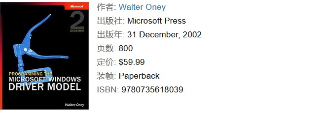

# 关于 Windows 系统的学习及其推荐书目

众所周知，在我们日常工作和生活中所接触到的个人计算机中，除了少数人使用的以 macOS 为操作系统的 Mac 系列设备之外，大部分人使用的都是以 Windows 为主要操作系统的 IBM PC。因此，如果你是一个面向中国市场的程序员，学习和研究基于 Windows 系统来开发设备驱动和应用程序将是一个绕不过去的课题。而想要在这一领域获得可长可久的生产力，我们自然需要深入地 Windows 系统本身的各种运行机制和设计思想。在本文接下来的内容中，我们将会以推荐书目的形式来为读者规划一个研究 Windows 系统内核及其应用层开发的学习路线图，以供参考。

## Windows 内部机制研究

如果按照操作系统内核类来进行分类，Windows 系统发展到目前为止，主要可被分为 MS-DOS 和 Windows NT 两个系列。其中，采用 MS-DOS 内核的主要包括 Windows 95/98/Me 这一系列操作系统，它们的共同特点是需要基于 16 位的 MS-DOS 基层程序来运行，并不能被视为真正意义上的 32 位操作系统。这主要是因为 Windows 最初是作为 MS-DOS 系统的图形界面被开发出来的，其地位相当于类 UNIX 系统中的 GNOME 和 KDE，本质上属于操作系统的 Shell。当然了，由于采用该内核的 Windows 系统已经年代久远，如今已经鲜少有人研究了，读者只需粗略了解一下即可。

自 Windows 2000 之后，所有版本的 Windows 系统都转而采用了原本只专用于服务器领域的 Windows NT 内核。由于该内核的实现彻底摆脱了对 DOS 基础程序的依赖，因而提供了比 MS-DOS 内核更好的执行性能、稳定性以及用户体验。虽然 Windows 是一个不开放源代码的操作系统，我们在面向该系统进行设备驱动与应用程序开发时未必需要了解它的内部实现，但在笔者看来，适当了解一下 Windows 的内核实现，将有助于理解为什么 Windows 系统的图形界面相较于类 UNIX 系统更有优势，并提高在工作中查找其浩如烟海的 API 时的效率和方向感。关于这方面的知识，读者可以去阅读一下潘爱民老师的《Windows 内核原理与实现》，这本书将以以 Windows 的源代码（WRK, Windows Research Kernel）为参照，详细解析 Windows 如何实现现代操作系统的各个关键部件，其中包括了进程、线程、物理内存和虚拟内存的管理，Windows 中的同步和并发性支持，以及Windows 的 I/O 模型等重要的议题。

当然了，如果读者不想从内核实现的角度来了解 Windows 系统的内部运行机制，也可以选择阅读由 Microsoft 公司亲自组织编著和出版的“Microsoft Windows Internals”系列作品，目前最新为第 7 版。下面，我们通过简单回顾一下该系列作品的版本迭代史，来帮助读者理解一下它在 Windows 领域的重要性。

- 该系列作品的第一个版本由 Windows NT 内核之父 Helen Custer 亲自编写，书名“Inside Windows NT”。

- 作品的第二个版本改由 David Solomon 编写，这位 David Solomon 是 David Cutler 在 DEC 任职就相识的老伙伴。因而被 David Cutler 特许自由翻看 Windows NT 内核的源代码。

- 作品的第三个版本的书名改成 “Inside Windows 2000”，由 David Solomon 和 Mark Russinovich 共同编写。

- 到了第四个版本之后，该作品的书名就基本固定为 “Microsoft Windows Internals”了，中文译为《深入解析 Windows 操作系统》。

所以显而易见的，该系列作品无疑是 Windows 领域作为权威的一本著作之一，虽然没有提供操作系统的内核源代码，，但我们确实可以相信这本书可以让读者做到知其然，且知其所以然。当然了，对于这个系列的作品，如今大部分读者只需要读过其第 4 版之后的任何一个版本即可，其最基本的内容是大同小异的。例如，我个人读过的是它的第 4 版。

## Windows 驱动程序开发

接下来，如果读者想要面向 Windows 系统来编写设备驱动程序，就可以阅读一下由 Walter Oney 编写的 “Programming the Microsoft Windows Driver Model”一书。这本书对微软的 WDM 设备驱动模型(即框架)作了深入的介绍，与传统的 Windows NT 设备驱动相比，WDM 要求设备驱动模块都支持PnP（即插即用）、电源管理、以及 WMI（Windows Management Instrumentation）。总而言之，这本书对于兼容内核中设备驱动框架和设备驱动界面的实现有着重要的指导意义，在读了它只会，再回过头看一些使用 Windows DDK 的代码示例，就更容易理解了。

这里需要提醒的是，上面这本书介绍的是新的 Window 设备驱动框架的设计与实现，后者提供了关于设备驱动接口的一些新的重要函数。当然了，我们如今实际在使用的以`.sys`为扩展名的驱动模块文件中还有不少采用了传统的 Windows NT 设备驱动开发框架，该框架可以被看做是 WDM 的一个子集，它整体上要比 WDM 简单一些。关于这方面的知识，读者可以参考由 Art Baker 编写的“The Windows NT Device Driver Book”一书。这本书虽然已经年代久远，但其中的内容却并没有过时，可以作为学习 WDM 的补充来阅读。

## Windows 应用程序开发

如果读者想要基于 Windows API 来编写应用程序，那么我在这里首先要推荐的是《Windows 程序设计》。这本书的内容涵盖了使用 Windows API 编程的方方面面，将我们在编程过程中会用到的每一个 API（如输入，输出及对话框，图形，多媒体，线程，文档与视图等）讲解得很清晰、简明，采用的大多是具有代表性的示例，代码风格好并且很有实用价值。总而言之，这本书是我们学习使用 Windows API 编程首选的导论性读本。

当然了，上面这本书中介绍的内容都较为基础，如果读者想更深入地学习这一方面的知识，就需要去进一步阅读《WINDOWS核心编程》这本书。该书的作者 Jeffrey Richter 一直以来都是 Windows 程序设计的领军人物，他的每一本书都对 Windows 核心有很精彩的剖析。在这本书中，作者从基本概念入手，全面系统地介绍了 Windows 系统的各种基本构件，如进程、线程、DLL 和内存管理等，并列举了大量应用程序，精辟地分析了构件的使用方法，为掌握 Windows 编程技巧提供了一条有效的捷径。

## 结束语

最后需要说明的是，关于 Windows 的技术资料，微软本身在 MSDN 网站上提供的资料也是非常重要的，但 MSDN 的缺点是信息量太大也太杂，许多人见了它们就烦，因为这些资料只能让我们“知其然”而不“知其所以然”。这其中的理由很简单，对于一件东西，如果我们将其放在透明的玻璃瓶里，自然就不需要作太多的描述；但倘若将其装在一个黑盒子中，描述起来可就费劲了。微软既不肯公开其源码，却又想要让开发者为 Windows 系统开发各种第三方软件，自然就得对其各种产品作黑盒子描述，“信息爆炸”就不可避免了。当然了，也有许多人非常喜欢 MSDN 提供的资料，是因为这些资料有不错的索引系统，是一个很好的速查手册，所以可实现“一抓就灵”。但在笔者看来，这些资料虽然可以使你成为“很称职的”工程师，却不会使你成为真正的专家。
