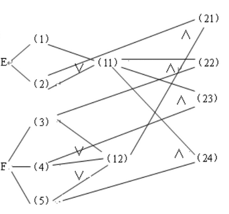

# 第 4 章：自动化测试开发

到目前为止，本书已经带领读者了解自动化测试这项工作的基本内容以及想要达成的目标，并学习了参与这项工作所需要掌握的编程语言与自动化测试框架，以及在工作中持续学习新框架的方法。在接下来的这一章中，读者将进入到本书最核心的议题：**如何开发可交由自动化工具来执行的测试用例**。在这一议题中，读者将会具体了解在设计测试用例时所需要采取的基本步骤，以及这项工作可以采取的一些常用策略。为了更好地展开这一议题的探讨，本章将会在介绍常用测试策略的同时辅以一系列具体的实例演示，以便具体说明如何针对具体的测试需求设计出有效的测试用例。总而言之，希望读者在阅读完本章内容之后能够：

- 了解执行自动化测试的基本步骤以及可采用的测试策略；
- 了解常见的测试任务以及这些测试任务各自的具体需求；
- 掌握根据测试任务的具体需求来设计相应测试用例的方法；

## 4.1 设计用例的设计

正如本书在第 1 章中所说，人们进行测试工作的基本目的是为了在软件产品发布之前尽可能多的找出其中可能存在的错误，以便及时修正，提高该产品的质量。但由于软件项目的开发时间是有限的，其能得到的项目经费也是有限的，这就让想要依靠计算机的穷举能力来实现完全测试成为了一种不可能完成的任务，因此测试人员只能退而求其次地追求尽可能接近于完全测试的工作方法。这样一来，掌握设计测试用例的方法就成为了软件测试工作中的最核心技能，它的地位就相当于软件开发工作中的算法设计，是赋予测试工作以高质量灵魂的关键所在。下面，本章将从基本步骤开始来介绍测试用例的设计。

### 4.1.1 基本设计步骤

从理论上来说，测试用例的设计本质上就是在寻找能发现待测软件某一问题的某一个输入/输出数据集合，该集合中的数据需要让测试用例满足如下条件。

- **符合具体的测试需求**：即当这些数据被用于执行测试用例时，它们要么能发现该软件在用户遵守输入规则时不符合预期的输出结果，要么能找出该软件在用户违反该输入规定时所做的错误应对措施。只有这样，测试工作才能达到在有限规模的输入中尽可能多地找出待测软件中存在的问题。
- **具有足够的覆盖面**：即当这些数据被用于执行测试用例时，它们所触发的软件行为要能尽可能地覆盖待测软件的所有功能，包括正常的用户操作、异常情况和边界值。如果测试人员设计的测试用例不能覆盖待测软件所有的功能，就有可能会导致其中的某些问题不能在测试中被发现，这将会直接影响该软件的质量管理成果。
- **能确保测试的有效性**：即这些数据不能让测试用例本身的执行过于复杂或者难以执行。毕竟，测试用例的作用是要能准确地验证待测软件的正确性或发现其中存在的缺陷，如果它本身的设计都存在执行效率或可行性之类的问题，就无法确保得到有效的测试结果了。
- **具有良好的可维护性**：即这些数据应该要能让测试用例具有良好的可复用性和可扩展性，这样既可以在提交测试报告时向待测软件的开发人员重现被发现的错误，也可以方便在待测软件发生版本迭代时进行回归测试，还可以在测试需求出现变化时进行相应的修改或升级。

为了很好地满足上述要求，测试人员在面对一个具体的自动化测试需求时，通常按照以下 4 个步骤来进行测试用例的设计与开发工作。

1. **完成需求分析**：在这一步骤中，测试人员需要准确地理解将要进行的测试工作的类型及其具体要达成的目标，在这一过程中，他们往往还需要仔细阅读待测软件的输入规范（如果条件允许的话，也应该阅读一下该软件的源代码），以便在后续的步骤中能基于黑盒或白盒测试的基本策略制定测试计划。
2. **制定测试计划**：在这一步骤中，测试人员需要根据需求分析的结果来制定详细的测试计划。计划的内容包括选择测试工作所需要使用的软硬件环境、测试用例要采用的整体策略。如果是一个测试团队，还需要另外计划好测试工作的进度安排、人员的任务分配等方面的事务。
3. **编写测试用例**：在这一步骤中，测试人员需要基于之前计划的软硬件环境和测试策略来编写若干个测试用例。在这过程中，他们需要反复查阅大量的文档资料，例如：待测软件的用户手册、自动化测试框架的官方文档等，目的是找出符合测试需求的输入数据集合。
4. **执行测试用例**：在这一步骤中，测试人员需要基于之前计划的软硬件环境配置好相应的自动化测试工具，并使用这些工具执行编写好的测试用例。

从上述步骤可以看出，测试用例设计得成功与否很大程度上就取决于测试人员所采用的测试策略。虽然本书在第 1 章中已经向读者说明了：如果是单纯依靠黑盒或白盒这样的基本测试策略来实现针对输入数据或代码执行路径的穷举式测试，那么虽然它在理论上可以实现完全覆盖式的测试，但在面对现实的时间与经济成本时是完全不具备可行性的。然而，测试人员也在日积月累的工作实践中总结出了一套以黑盒测试为主，有时辅以白盒测试的、用于设计测试用例的方法论，并从中提炼出了一系列具有实用性的经典测试策略。接下来，本章就为读者来介绍其中几种常用的测试策略。

### 4.1.1 基于黑盒测试的常用策略

在软件测试中，由于待测软件在大部分情况下并不会向测试人员开放自己的源代码，因此大多数测试用例的设计通常都是以黑盒测试为基本策略来展开的。而对于黑盒测试，成熟的软件产品都会在其用户手册中制定一套输入规范，只要用户输入的是该规范允许的数据，该软件就会输出可预期的结果，否则就会触发软件的错误处理机制。在软件测试的语境下，符合这套输入规范的数据集合被称之为有效输入，而违反输入规定的数据集合被称之为无效输入，这两种输入共同组成了待测软件的输入域。测试人员在黑盒测试中的主要任务就是要基于待测软件的输入域，和当前所执行的测试目的来寻找一个可在有限时间内、有限资源条件下执行有效测试的输入/输出数据集。目前，在日常测试实践中得到广泛使用的、基于黑盒测试的常用策略主要有等价类划分、边界值分析与因果图分析三种，下面分别来介绍一下它们。

#### 4.1.1.1 等价类划分

对基于黑盒测试的测试用例来说，其设计策略首先要解决的问题是：如果穷举软件输入域中的所有数据不具有现实可行性，那么该如何进行有效的测试输入呢？对此，人们自然而然会想到的一种解决思路是：如果能在该输入域中找到若干个子集，每个子集中的所有数据在被用于执行测试用例时都能得到相同效果的测试，那么测试人员就可以将这些子集定义为一个个“等价类”，并合理地假定：只要测试某一等价类中的任一数据，就相当于对该等价类中所有数据进行了测试。在测试用例的设计中，这种测试策略就被称作**等价类划分**。在这种策略下，测试人员在设计测试用例时会先将待测软件的输入域（有时也包括预期的输出结果）划分为多个无交集的等价类，然后只需从每个等价类中选择少量代表性的数据来充当测试用例，即可达到全面和高效的测试效果。当然了，这种测试策略能否达到最佳效果，最终还得取决于等价类的具体划分方法。通常情况下，测试人员在使用等价类划分策略设计测试用例时会秉持以下两个基本原则。

- 等价类的数量应该受到严格控制，尽可能地让它保持在能达成有效测试所需的最少数量即可；
- 每个等价类都要具有足够的覆盖面，即这些等价类都要能发现待测软件某一方面的特定问题；

虽然这两个原则在乍看之下非常相似，但它们事实上是两种相互制约的设计思想。其中，第一个原则所强调的是：测试人员所划分的每个等价类都应该尽可能多地反映不同的输入/输出情况，从而最大限度地减少测试工作所要执行的用例数量。而第二个原则强调的是：等价类的划分要尽可能地注意它们所覆盖的测试面向，这就要求对待测软件的输入域进行一定程度的细化分类，而这一定会产生相当数量的等价类。因此要想在设计测试用例的工作中平衡这两个设计原则并非易事，测试人员所需要具备的创造性一点也不亚于软件的开发人员。下面简单演示一下划分等价类的方法，假设读者现在需要对某一个可输入手机号码的软件进行测试，那么他通常可以选择将该软件的输入域划分为以下几个等价类。

1. 无效的输入数据：在中国，不是 11 位数字的、不以数字 1 开头的、包含字母、或空格等特殊符号的都属于无效的手机号码，例如`1234567`、`949199999`、`1385x411112`等；
2. 有效的输入数据：在中国，有效的手机号码应该是一个以数字 1 开头的、 长度为 11 位的数字号码。对于该等价类中的数据，为了防止误打误撞到某人的手机号码，这里就不特别举例了；
3. 输入空值的情况：例如，用户没有输入任何值或输入空格等空白符的情况；
4. 需要进行特殊处理的输入数据：例如，`400`、`800`、`110`、`120`等具有特定功能的电话号码；

采用等价类划分来设计测试用例的优势主要在于：它不仅可以让测试人员利用有限数量的测试用例来实现快速、有效的测试，同时也能赋予这些测试用例很好的可复用性和可扩展性，使其能够应对待测软件将来可能的、各种不同规模和复杂度的测试场景。

#### 4.1.1.2 边界值分析

尽管等价划分的测试策略要比基于穷举或随机选取输入域中数据的策略优越得多，但它仍然存在着一些不足住处。例如，该策略很容易忽略掉某些位于不同等价类之间的边界输入，而这些输入往往代表了一些能发现特定问题的测试用例。下面，我们就针对这一不足之处继续来介绍另一种被称之为**边界值分析**的测试策略。在这种策略下，测试人员在设计测试用例时会先在待测软件的输入/输出数据集合中找出各种边界值，然后再测试该软件在应对这些边界值时能否正常工作，其具体步骤如下。

1. 找出待测软件在输入/输出上的边界值和相关限制条件；
2. 确定要用于测试用例的边界值，通常是各等价类中的最大值、最小值和代表了某些限制的条件值；
3. 基于确定了的边界值来编写测试用例，以确保待测软件在这些边界条件下的正确性；
4. 使用自动化工具执行所有的测试用例，并根据后续测试需要来完善这些用例的细节；

下面，我们同样来简单演示一下使用边界值分析策略来设计测试用例的方法。假设读者现在手里有一个计算平方值的软件，该软件规定的输入域是 1 到 10 之间的整数，预期的输出是这些整数的平方值，那么他就可以基于边界值分析策略来设计以下测试用例。

- 输入最小值（= 1），预期待测软件会输出 1 的平方值（= 1）；
- 输入最小值+1（= 2），预期待测软件会输出 2 的平方值（= 4）；
- 输入最小值-1（= 0），预期待测软件会输出用于提示无效输入的错误信息；
- 输入最大值（= 10），预期待测软件会输出 10 的平方值（= 100）；
- 输入最大值-1（= 9），预期待测软件会输出 9 的平方值（= 81）
- 输入最大值+1（= 11），预期待测软件会输出用于提示无效输入的错误信息；

在上述测试用例中，我们选择了数字 1 和 10 作为边界值进行测试，先确保待测软件在最值情况下能正确工作。接下来，我们还选择了数字 2 和 9 以作为最值的内侧值来进行测试，以确保待测软件在其输入域的内侧能正常工作。最后，我们还测试了数字 0 和 11，确保待测软件能够正确地识别其输入域外侧的值，并输出适当的错误提示信息。在整个测试执行过程中，如果待测软件的输出结果一直符合预期，则说明该软件在边界条件下和一般情况下都能正常工作。如果不符合预期，则说明待测软件中存在缺陷，需要进行修复和优化。

从上述示例中，读者可以清楚地看出：边界值分析实际上就是一种专门针对软件输入/输出的边界值进行测试的黑盒测试策略。另外，由于基于该策略来设计的测试用例经常来自于不同等价类之间的边界数据，所以它也常被视为是等价类划分策略的补充策略，这两种策略的主要区别如下。

- 基于该策略的测试用例并不来自于某等价类中的任意代表性数据，而专门来自于该等价类的每个边界值；
- 基于该策略的测试用例不仅要考虑待测软件输入域中的各种边界值，同时也考虑该软件在输出端产生的边界值；

采用边界值分析来设计测试用例的优势主要在于：它能有效地发现输入或输出值错误和异常情况，从而提高系统的可性和稳定性。除此之外，该测试策略也可以节省测试工作在时间和经济上的成本，毕竟它只需要测试待测软件的输入/输出中某几个关键的边界值，而不是所有可能的输入或输出值。但是，边界值分析策略也同样存在着一些盲区，可能会忽略掉一些较为复杂的情况，也可能会忽略一些不太显而易见的错误或异常情况。 因此，测试人员在使用边界值分析设计测试用例时，通常需要结合等价类划分之类的其他测试策略，以便互为补充，实现更为全面的测试覆盖率。

#### 4.1.1.3 因果图分析

针对一些情况更为复杂的组合式输入，测试人员有时也会采用一种被称作**因果图分析**的策略来设计测试用例。在这种策略下，测试人员需要先用自然语言描述出待测软件中输入与输出之间的因果关系，即该软件在什么输入条件下预期会输出什么结果，然后用一套表示与、或、非的图形符号将这些因果关系转换成一个逻辑网络图，并根据该图来设计测试用例，其具体步骤如下。

1. 从待测软件的用户手册中分析出可划分为原因的输入型等价类，和可划分为结果的输出型等价类；
2. 用表示与、或、非的图形符号将存在因果关系的等价类连接起来，形成一个逻辑网络图；
3. 继续在该一个逻辑网络图上用一些符号标注形成因果关系的约束条件或限制条件；
4. 对测试的具体需求加以分析，并进一步将分析结果转化为因果图之间的关系图。
5. 把因果图转换成判定表，并以判定表中的每一列作为依据来设计测试用例。

下面，我们也通过简单示例[^1]来演示一下绘制因果图的方法。假设读者现在需要对一个单价为 1 元 5 角钱的、销售盒装饮料的自动售货机进行测试。按照该机器的软件手册中的说明，如果用户往机器中分别投入一枚 1 元 的硬币和一枚 5 角的硬币，然后按下“可乐”、“雪碧”、“红茶”这三个按钮中的任何一个，相应的饮料就会从机器中吐出来。而如果用户投入的是两枚 1 元的硬币，该机器在吐出饮料的同时还会退还一枚 5 角的硬币。那么，读者就可以将该软件所有可能的输入/输出划分为如表 4-1 所示的等价类。并根据这些等价类之间的因果关系绘制出相应的因果图（如图 4-1 所示）。

| 表示原因的等价类 | 表示中间状态的等价类 | 表示结果的等价类 |
| ------------------- | ---------------------- | ------------------- |
| (1) 投入1元5角硬币；<br> (2) 投入2元硬币；<br> (3) 按“可乐”按钮；<br> (4) 按“雪碧”按钮；<br> (5) 按“红茶”按钮；| (11) 已投币；<br> (12) 已按钮。| (21) 退还5角硬币；<br> (22) 送出“可乐”饮料；<br>(23) 送出“雪碧”饮料；<br> (24) 送出“红茶”饮料；|

表 4-1：划分因果等价类

接下来，读者需要根据上述等价类的编号以及它们之间的因果关系来绘制出相应的因果图，具体如图 4-1 所示。



图 4-1：自动售货机的因果图

从上述示例可以看出，在测试工作中采用因果图分析策略的主要优势在于，它能够有效地识别和分析出待测软件中存在的因果关系，并根据这些关系设计出有效的测试用例。与此同时，该策略也能够帮助测试人员更好地理解待测软件的功能特性，这有助于提高测试的覆盖率。当然，这也意味着使用该策略是有一定门槛的，它需要测试人员具备相当程度的专业技能和测试经验，由此产生的时间与经济成本也带来一定的影响。

除此之外，测试人员还会使用**错误猜测**等其他策略来设计更具有创造性的黑盒测试用例，这里限于篇幅，就不继续展开了、读者有兴趣，可自行查阅相关的资料，以进一步扩充自己的测试能力。

[^1]: 该示例参考自百度百科中的“因果图法”词条。

### 4.1.2 基于白盒测试的常用策略

在软件测试中，如果待测软件在用户手册之外还提供了自己的源代码，那么测试人员在基于黑盒测试来设计的测试用例之外，很多时候还会辅以基于白盒测试的测试用例。而对于白盒测试，同样由于时间和经费的限制，在测试工作中直接让软件将所有可能的执行路径都遍历一次也是不现实的，因此测试人员的主要任务是：仔细阅读并分析待测软件的源代码，然后在设计测试用例时找到合适的策略，以便尽可能多地覆盖该软件在源代码中的执行路径。目前，在日常测试实践中得到广泛使用的、基于百盒测试的常用策略主要有判定覆盖、条件覆盖与判定/条件覆盖三种，下面分别来介绍一下它们。

#### 4.1.2.1 判定覆盖

在面向软件的源代码来设计测试用例时，人们自然而然会想到的一种解决思路是让软件将其源代码中的每一条语句至少被执行一次，但这种思路在测试工作中恰恰是没有意义的。举例来说，对于下面这段带有 4 个条件表达式、两个`if`判定语句的 Python 函数。

```python
def afunc(x, y, z) :
    if (x>1 and y==0) :
        z = z / x
        print("第一个 if 语句判定为 true")
    if (x==2 or z>1) :
        z = z + 1
        print("第二个 if 语句判定为 true")
```

如果想让其中的每一条语句都至少执行一次，测试用例应该被设计为输入数据为`x==2, y==0, z==任意数`的等价类即可。但这样做充其量只是测试了该函数在其两个`if`判定语句都为`true`时的执行情况，甚至都不确认函数在其中一个`if`语句判定为`false`时的执行情况是否符合预期，根本谈不上是一次有效的测试。因此，更为有效的测试策略是让`afunc()`函数中的两个`if`判定语句在为`true`和`false`的情况下都各自有一次被执行的机会。在基于白盒测试的策略中，这种让每个条件判定语句都被执行一次的测试策略被称作**判定覆盖**或**分支覆盖**策略。在这种策略下，读者可以设计如下 4 个测试用例。

- 输入`x==2, y==0, z==任意数`的等价类，执行两个`if`语句都判定为`true`的情况；
- 输入`x<=1, y!=0, z<=1`的等价类，执行两个`if`语句都判定为`false`的情况；
- 输入`x==2, y!=0, z==任意数`的等价类，执行第 1 个`if`语句判定为`false`，第 2 个`if`语句判定为`true`的情况；
- 输入`x>1, y==0, (z/x)<=1`的等价类，执行第 1 个`if`语句判定为`true`，第 2 个`if`语句判定为`false`的情况；

在上述示例中，虽然读者可以用 4 个测试用例反映出`afunc()`函数在`if`语句判定为`false`时没有任何提示，可能会导致某些隐患的问题，但应该也可以看出，判定覆盖策略的测试相对来说是比较粗糙的。因为在基于判定覆盖策略设计测试用例时，测试人员通常只需要针对`if`语句的判定表达式进行输入域的等价类划分即可，例如，上述示例是针对对`and`表达式和`or`表达式来设计测试用例的。由于这两种表达式在进行布尔类型的运算时都具有“短路求值”的特性，即只要`and`表达式中的一个操作值为`false`，整个表达式就为`false`，同样的，只要`or`表达式中的一个操作值为`true`，整个表达式就为`true`，这就会让它们的另一个操作数被直接忽略，例如在上述示例中，`z`的值在两个设计用例中可以是任意数，因为它的值`if`语句的判定表达式中会被忽略。

#### 4.1.2.2 条件覆盖

如果读者想对`afunc()`函数进行更为精细的测试，就需要来针对该函数中的 4 个条件表达式来设计测试用例了。也就是说，让这 4 个条件表达式都有一次被求值为`true`和`false`的。在基于白盒测试的策略中，这种让每个条件表达式都被执行两次求值的测试策略被称作**条件覆盖**策略。在这种策略下，读者可以针对`afunc()`函数设计如下测试用例。

- 输入`x>1, y==任意数, z==任意数`的等价类，验证`x>1`求值为`true`时的情况；
- 输入`x<=1, y==任意数, z==任意数`的等价类，验证`x>1`求值为`false`时的情况；
- 输入`x==任意数, y==0, z==任意数`的等价类，验证`y==2`求值为`true`时的情况；
- 输入`x==任意数, y!=0, z==任意数`的等价类，验证`y==2`求值为`false`时的情况；
- 输入`x==2, y==任意数, z==任意数`的等价类，验证`x==2`求值为`true`时的情况；
- 输入`x!=2, y==任意数, z==任意数`的等价类，验证`x==2`求值为`false`时的情况；
- 输入`x==任意数 y==任意数, z>1`的等价类，验证`z>1`求值为`true`时的情况；
- 输入`x==任意数, y==任意数, z<=1`的等价类，验证`z>1`求值为`false`时的情况；

在上述示例中，等价类的划分存在着集合相交的情况，所以在实际测试中，我们只需要在这些等价类的交集中选取输入数据即可，例如：测试人员通常只需设计`x==2, y==0, z==4`和`x==1, y==1, z==1`这两个测试用例，基本上就可以实现条件覆盖策略所想要达成的测试目标了。当然了，条件覆盖在某些情况下也会出现忽略了`if`语句某个判定分支的问题，它与判定覆盖策略存在着各自为战的情况。如果只在它们之间二选一，设计的测试用例就会存在顾此失彼的问题。

#### 4.1.2.3 判定/条件覆盖

想要解决条件覆盖与判定覆盖着两种策略顾此失彼的问题，最好的选择就是将两者结合起来成为一个复合型的测试策略。在基于白盒测试的策略中，这种兼顾每个条件判定语句和条件表达式的测试策略被称作**判定条件覆盖**策略。在这种策略下，读者可以针对`afunc()`函数设计如下测试用例。

1. 输入`x>1, y==0, z==任意数`的等价类，验证`x>1`求值为`true`，且其所在`if`语句也判定为`true`时的情况；
2. 输入`x<=1, y==任意数, z==任意数`的等价类，验证`x>1`求值为`false`，且其所在`if`语句也判定为`false`时的情况；
3. 输入`x>1, y==0, z==任意数`的等价类，验证`y==2`求值为`true`，且其所在`if`语句也判定为`true`时的情况；
4. 输入`x>1, y!=0, z==任意数`的等价类，验证`y==2`求值为`false`，且其所在`if`语句也判定为`false`时的情况；
5. 输入`x==2, y!=0, z==任意数`的等价类，验证`x==2`求值为`true`，且其所在`if`语句也判定为`true`时的情况；
6. 输入`x!=2, y!=0, z<=1`的等价类，验证`x==2`求值为`false`，且其所在`if`语句也判定为`false`时的情况；
7. 输入`x!=2, y!=0, z>1`的等价类，验证`z>1`求值为`true`，且其所在`if`语句也判定为`true`时的情况；
8. 输入`x!=2, y!=0, z<=1`的等价类，验证`z>1`求值为`false`，且其所在`if`语句也判定为`false`时的情况；

同样的，上述等价类的划分也存在着集合相交甚至完全重叠的情况，所以在实际测试中，我们只需要在这些等价类的交集中选取输入数据即可，例如：测试人员通常只需设计以下 4 个测试用例就可以覆盖它们。

- `x==2, y==0, z==4`用例，覆盖了上述 1 和 5 中划分的等价类；
- `x==2, y==1, z==1`用例，覆盖了上述 2 和 6 中划分的等价类；
- `x==1, y==0, z==2`用例，覆盖了上述 3 和 7 中划分的等价类；
- `x==1, y==1, z==1`用例，覆盖了上述 4 和 8 中划分的等价类；

同样的，测试人员在面对更复杂的情况时还会使用**多重条件覆盖**等策略来设计更接近于完全覆盖式的白盒测试用例，这里限于篇幅，就不继续展开了、读者有兴趣，可自行查阅相关的资料，以进一步扩充自己的测试能力。

## 4.2 用例设计实践

在了解了设计测试用例的基本步骤和常用策略之后，读者接下来就可以根据自己所要执行的测试类型来设计符合具体工作需求的测试用例了。在这一节中，本书将结合四种常见的测试任务来演示测试用例的设计与执行，为读者提供实践层面上的参考。

### 4.2.1 单元测试

单元测试是程序员在软件开发过程常常执行的一种测试类型，测试的目标通常是软件源代码的最小单元，例如：函数、方法或类等。由于这类测试工作通常是由软件的开发人员自己来负责的，主要任务是验证代码的正确性，确保代码能够按照预期工作，并且在发现问题时能够快速地定位和修复问题，所以它的测试用例设计大体上要基于白盒测试策略来进行。

在针对单元测试编写测试用例时，开发人员通常会选择使用编写自动化测试脚本的方式来模拟各种不同的输入条件，以便最大程度地确认自己编写的函数、自定义类型能够在各种执行路径下都能正确地运行。事实上，本章之前在 4.1.2 节中在讲解基于白盒测试的常用策略时，针对`afunc()`函数所运行的所有测试用例都属于在执行单元测试的任务。下面，我们基于 PyTest 自动化测试工具来完善一下这个示例，并具体地来为读者演示一下单元测试的具步骤。

1. 在之前约定用于存放示例代码的目录中下创建一个名为`04_TestCaseDome`的目录，然后在该目录下继续创建一个名为的`testfunc.py`文件，并在其中输入如下代码。

    ```python
    # 修改之前的 afunc() 函数：
    def afunc(x, y, z) :
        if (x>1 and y==0) :
            print("第一个 if 语句判定为 true")
            print("x>1 的值为 %s，y==0 的值为 %s" % (x>1, y==0))
            z = z / x
        else :
            print("第一个 if 语句判定为 false")        
            print("x>1 的值为 %s，y==0 的值为 %s" % (x>1, y==0))
        if (x==2 or z>1) :
            print("第二个 if 语句判定为 true")
            print("x==2 的值为 %s，z>1 的值为 %s" % (x==2, z>1))
            z = z + 1
        else :
            print("第二个 if 语句判定为 false") 
            print("x==2 的值为 %s，z>1 的值为 %s" % (x==2, z>1))
    ```

2. 继续在`04_TestCaseDome`目录下创建一个名为的`testDome.py`文件，并基于 PyTest 的规则在其中输入如下代码。

    ```python
    import pytest
    
    # 演示单元测试    
    def test_UnitTestingDome() :
        # 导入要测试的目标模块
        import testfunc
        # 基于判定/条件覆盖策略的测试用例：
        testCases = [
            {"x" : 2, "y" : 0, "z" : 4},
            {"x" : 2, "y" : 1, "z" : 1},
            {"x" : 1, "y" : 0, "z" : 1},
            {"x" : 1, "y" : 1, "z" : 1}
        ]

        # 执行测试用例：
        for index, case in enumerate(testCases) :
            print("\n正在执行第 %s 个测试用例：" % str(index+1))
            testfunc.afunc(case["x"], case["y"], case["z"])
    ```

3. 在`04_TestCaseDome`目录下打开命令行终端环境，并执行`pytest -vs testDome.py::test_UnitTestingDome`命令来执行自动化测试脚本（在这里，`v`参数的作用是让 PyTest 输出测试用例的详细信息，而`s`参数的作用是输出脚本本身要输出的信息）。如果一切顺利，会得到如下输出。

    ```bash
    ============== test session starts =========================
    platform win32 -- Python 3.10.10, pytest-7.2.2, pluggy-1.0.0 -- C:\Users\lingjie\AppData\Local\Programs\Python\Python310\python.exe
    cachedir: .pytest_cache
    rootdir: D:\works\AutomatedTest_in_python\配套资源\示例代码\04_TestCaseDome
    collecting ... collected 1 item

    testDome.py::test_UnitTestingDome 
    正在执行第 1 个测试用例：
    第一个 if 语句判定为 true
    x>1 的值为 True，y==0 的值为 True
    第二个 if 语句判定为 true
    x==2 的值为 True，z>1 的值为 True

    正在执行第 2 个测试用例：
    第一个 if 语句判定为 false
    x>1 的值为 True，y==0 的值为 False
    第二个 if 语句判定为 true
    x==2 的值为 True，z>1 的值为 False

    正在执行第 3 个测试用例：
    第一个 if 语句判定为 false
    x>1 的值为 False，y==0 的值为 True
    第二个 if 语句判定为 false
    x==2 的值为 False，z>1 的值为 False

    正在执行第 4 个测试用例：
    第一个 if 语句判定为 false
    x>1 的值为 False，y==0 的值为 False
    第二个 if 语句判定为 false
    x==2 的值为 False，z>1 的值为 False
    PASSED

    ============== 1 passed in 0.00s ===========================
    ```

4. 根据上述输出结果来判断被测试的单元是否执行得符合自己的预期，如果不符合预期，就回头去修改出问题的地方，然后使用上述脚本进行回归测试，如此周而复始，直至最大限度地确认它没有问题为止。

### 4.2.2 接口测试

除了单元测试之外，接口测试是另一种由开发人员在软件开发过程中执行的测试类型。这类测试工作的主要任务是测试软件各组件之间的接口是否能够正确地交互，目的是确保软件各组件之间的通信过程能符合开发人员的预期，以便提高软件产品的可靠性。它通常会重点测试以下几方面的内容。

- 接口通信时使用的调用协议：包括接口的参数调用规范，使用的网络协议、数据传输协议等，目的是检查软件各组件接口的调用是否符合规范，以确保接口调用的正确性和安全性。
- 接口通信时使用的数据格式：其内容包括这些数据的类型、长度、范围、精度等，目的是检查接口传输的数据格式是否正确。
- 接口通信时数据的完整性：目的是检查接口之间传输的数据是否完整、准确，是否包含必要的字段和信息。
- 接口通信过程中的异常处理机制：其内容包括软件各组件接口在应对输入不合法、传输异常、服务器错误等情况时的处理能力，目的是检查这些接口对于异常情况的处理是否正确。

虽然接口测试也通常由待测软件的开发人员来执行，但它的主要任务对象是软件各组件之间的输入和输出，而非组件内部源代码的执行路径，所以在面对这一类测试的工作需求时，我们大体上会基于黑盒测试策略来设计测试用例，下面也通过一个简单的示例来演示一下进行接口测试的具体步骤。

1. 仔细阅读并分析待测接口的说明文档。在这里，假设接下来要测试的是一个基于 RESTful 架构的、用于用户登录的 HTTP API，其说明文档的主要信息如下。
    - 接口功能：用户登录；
    - 接口 URL：`http://localhost:3001/users/session`；
    - 调用方法：基于 HTTP 协议的 POST 方法；
    - 调用参数：包含`username`和`password`这两个字段的 JSON 格式数据；
    - 返回数据：`message`数据段内容为`"用户登录成功"`或`"用户名或密码错误"`的 JSON 格式数据；

2. 在`04_TestCaseDome`目录下创建一个名为的`requestHandler.py`文件，并在其中创建一个名为`RequestsHandle`的自定义类型，用于封装一些发送 HTTP 请求的操作，具体代码如下。

    ```python
    # 需要先执行 pip install requests 命令 
    import requests

    class RequestsHandler:
        def __init__(self):
            """session管理器"""
            self.session = requests.session()
        def visit(self, method, url, 
                params = None, 
                data= None, 
                json= None, 
                headers= None):
            result = self.session.request(method,url,
                                        params=params,
                                        data=data,
                                        json=json,
                                        headers=headers)
            try:
                # 返回 JSON 结果
                return result.json()
            except Exception:
                return 'not json'
        def close_session(self):
            self.session.close()
    ```

3. 在`04_TestCaseDome`目录下重新打开之前创建的`testDome.py`文件，并基于 PyTest 的规则在其中添加一个名为`test_InterfaceTestingDome()`的函数，该函数的具体代码如下。

    ```python
    # 演示接口测试    
    def test_InterfaceTestingDome() :
        # 导入之前封装的请求操作类
        from requestsHandler import RequestsHandler
        # 创建请求操作类的对象
        req = RequestsHandler()
        login_url = 'http://localhost:3001/users/session'
        # 基于边界值分析策略的测试用例：
        testCases = [
            {   # 已注册用户正常登录的情况
                "username": "lingjie", 
                "password": "12345678" 
            },
            {   # 已注册用户非正常登录的情况
                "username": "lingjie", 
                "password": "12x45678"
            }, 
            {    # 未注册用户登录的情况
                "username": "batman", 
                "password": "12345678" 
            },
            {   # 没填写用户名的情况
                "username": "", 
                "password": "12345678"
            },
            {   # 没有填写密码的情况
                "username": "lingjie", 
                "password": ""
            } 
        ]
        
        # 执行测试用例：
        for index, case in enumerate(testCases) :
            print("\n正在执行第 %s 个测试用例：" % str(index+1))
            # 获取响应数据
            res = req.visit('post', login_url, json=case)
            if(res != "not json") :
                # 查看 HTTP API 返回的数据
                print(res["message"])
            else :
                print("没有返回 JSON 格式的数据！")
        
        # 关闭请求会话
        req.close_session()
    ```

4. 在`04_TestCaseDome`目录下打开命令行终端环境，并执行`pytest -vs testDome.py::test_InterfaceTestingDome`命令来执行自动化测试脚本（同样的，这里的`v`参数的作用是让 PyTest 输出测试用例的详细信息，而`s`参数的作用是输出脚本本身要输出的信息）。如果一切顺利，会得到如下输出。

    ```bash
    ============== test session starts =========================
    platform win32 -- Python 3.10.10, pytest-7.2.2, pluggy-1.0.0 -- C:\Users\lingjie\AppData\Local\Programs\Python\Python310\python.exe
    cachedir: .pytest_cache
    rootdir: D:\user\Documents\works\AutomatedTest_in_python\配套资源\示例代码\04_TestCaseDome
    collecting ... collected 1 item

    testDome.py::test_InterfaceTestingDome 
    正在执行第 1 个测试用例：
    用户登录成功

    正在执行第 2 个测试用例：
    用户密码错误

    正在执行第 3 个测试用例：
    用户不存在，请先注册再登录

    正在执行第 4 个测试用例：
    用户名不能为空

    正在执行第 5 个测试用例：
    密码不能为空
    PASSED
   ============== 1 passed in 0.00s ===========================
    ```

5. 根据上述输出结果来判断被测试的接口在被调用时的表现是否符合自己的预期，如果不符合预期，就回头去修改出问题的地方，然后使用上述脚本进行回归测试，如此周而复始，直至最大限度地确认它没有问题为止。

### 4.2.3 功能测试

在一个软件产品完成初步开发之后，开发团队通常会请专职的测试人员对它进行功能测试，目的是检查该软件的各项功能是否符合它自身的规格说明。虽然在测试对象上，软件的各项功能模块与其组件接口有很大的概率是重叠的，但功能测试在工作的具体需求与接口测试之间存在着如下明显的区别。

- 在测试任务的侧重点上，接口测试是开发人员在软件开发过程中的自我测试，它的侧重点是检查各组件之间的通信规则与传输的数据内容是否符合开发人员自己的预期。而功能测试是专职测试人员在软件完成初步开发之后的验收测试，它的侧重点是验证软件提供的各项功能已经达到了交付要求。
- 在测试的覆盖范围上，接口测试通常关注的是软件各组件接口之间数据在传输时的正确性，以及这些接口本身的的兼容性等，覆盖范围相对较窄；而功能测试则往往需要对软件系统的各项功能进行全面测试，覆盖范围相对较广。
- 在测试用例的设计方法上，由于接口测试主要关注的是软件各组件接口之间的输入与输出，所以通常会基于黑盒测试策略来设计测试用例。而功能测试除了关注软件各功能组件的输入/输出，也要关心它的内部处理逻辑，所以通常会采用黑盒测试+白盒测试的混合策略来设计测试用例。

例如，同样是针对某一 Web 应用的用户登录模块进行测试，接口测试通常只需要在自动化测试脚本中直接模拟对 HTTP API 的调用即可，而在功能测试中，测试人员往往需要从其 Web UI 处开始着手，完整地模拟人类用户各种可能的登录操作，然后再从中提炼出可自动化执行的测试用例。下面，我们就来示范一下在功能测试的任务需求下，测试用户登录功能的具体步骤。

1. 在 Mozilla Firefox 中打开 Selenium IDE 的项目管理界面，并在该界面中新建一个项目（项目名称任意），然后创建一个名为`testLogin`的测试用例，然后录制一次在待测软件（这里假设软件所在的 URL 为`http://localhost:3001/`）的用户登录界面上的正常操作，如图 4-2 所示。

    

    图 4-2：在 Selenium IDE 中录制测试用例

2. 回到 Selenium IDE 的项目管理界面中，将上面录制的测试用例使用“Python pytest”选项导出为一个名为`testLogin.py`的 Python 脚本，并将其保存在之前创建的`04_TestCaseDome`目录中，然后将该脚本的代码修改如下。

    ```python
    # 导入 Selenium 框架的相关组件
    from selenium import webdriver
    from selenium.webdriver.common.by import By
    from selenium.webdriver.common.action_chains import ActionChains
    from selenium.webdriver.support import expected_conditions
    from selenium.webdriver.support.wait import WebDriverWait
    from selenium.webdriver.common.keys import Keys
    from selenium.webdriver.common.desired_capabilities import DesiredCapabilities

    # 将 TestLogin 类修改为普通的自定义类型
    class TestLogin():
        def __init__(self):
            self.driver = webdriver.Firefox()
            self.vars = {}

        def __del__(self):
            self.driver.quit()

        # 为 test_testLogin() 方法添加一个 user 参数
        # 用于执行不同的测试输入：
        def test_testLogin(self, user):
            self.driver.get("http://localhost:3001/")
            self.driver.set_window_size(880, 698)
            u_input = self.driver.find_element(By.CSS_SELECTOR, 
                                                "tr:nth-child(1) input")
            u_input.send_keys(user["username"])
            p_input = self.driver.find_element(By.CSS_SELECTOR,
                                                "tr:nth-child(2) input")
            p_input.send_keys(user["password"])
            login = self.driver.find_element(By.CSS_SELECTOR,
                                                "td:nth-child(1) > input")
            login.click()
            self.driver.close()
    ```

3. 在`04_TestCaseDome`目录下重新打开之前创建的`testDome.py`文件，并基于 PyTest 的规则在其中添加一个名为`test_FunctionalityTestingDome()`的函数，该函数的具体代码如下。

    ```python
    # 演示功能测试    
    def test_FunctionalityTestingDome():
        # 导入之前之前修改的自定义类型
        from testLogin import TestLogin
        
        # 基于边界值分析策略的测试用例：
        testCases = [
            {   # 已注册用户正常登录的情况
                "username": "lingjie", 
                "password": "12345678" 
            },
            {   # 已注册用户非正常登录的情况
                "username": "lingjie", 
                "password": "12x45678"
            }, 
            {    # 未注册用户登录的情况
                "username": "batman", 
                "password": "12345678" 
            },
            {   # 没填写用户名的情况
                "username": "", 
                "password": "12345678"
            },
            {   # 没有填写密码的情况
                "username": "lingjie", 
                "password": ""
            } 
        ]

        # 执行测试用例：
        for index, case in enumerate(testCases) :
            print("\n正在执行第 %s 个测试用例：" % str(index+1))
            # 创建一个 TestLogin 类的实例
            tester = TestLogin()
            tester.test_testLogin(case)
            del tester
    ```

4. 在`04_TestCaseDome`目录下打开命令行终端环境，并执行`pytest -vs testDome.py::test_FunctionalityTestingDome`命令来执行自动化测试脚本（同样的，这里的`v`参数的作用是让 PyTest 输出测试用例的详细信息，而`s`参数的作用是输出脚本本身要输出的信息）。如果一切顺利，Selenium 框架就会按照测试用例的设计重复播放之前用 Selenium IDE 录制的测试操作。测试人员可以根据其播放过程来判断被测试的用户登录功能是否表现得符合产品需求，如果不符合，就向开发部门提交测试报告，指出问题的地方。在后者修复问题之后，再使用上述脚本进行回归测试，如此周而复始，直至最大限度地确认它没有问题为止。

### 4.2.4 性能测试

除了功能测试之外，软件产品在发布之前还会交由测试人员进行性能测试。这类测试工作的主要任务是通过设计一定数量的测试用例来模拟多种正常、峰值以及异常负载条件来对待测软件的各项性能指标进行测试，目的是评估待测软件在特定负载条件下的性能。常见的性能测试类型包括负载测试、压力测试、容量测试和基准测试。其中，负载测试是指在待测软件达到最大负载之前不断地对其增加负载的测试方法，以确定该软件的最大负载容量；压力测试则是在待测软件最大负载下进行的测试，以确定该软件在高负载情况下的性能。容量测试是评估软件在长时间运行后的性能表现，而基准测试是用于对比不同软件的性能差异的测试。

相较于其他类型的测试任务，性能测试尤其需要借助自动化测试工具来进行，因为只有这类工具可以海量地模拟用户活动，并同时自动记录整个测试过程，这显然更有利于准确且快速地产生测试报告。例如，如果读者想用测试的方法来比较冒泡排序与快速排序这两种算法的性能，就可以采用如下步骤来进行性能测试中的基准测试。

1. 在`04_TestCaseDome`目录下创建一个名为`sorting.py`的文件，并在其中基于 Python 语言分别实现一下这两种排序算法，下面是本书提供的一个示例。

    ```python
    # 冒泡排序
    def bubbleSort(coll):
        if(coll == []): return []
        endl = len(coll)
        for i in range(endl, 0, -1):
            for j in range(0, i - 1):
                if(coll[j] > coll[j + 1]):
                    coll[j], coll[j + 1] = coll[j + 1], coll[j]

    # 快速排序
    def quickSort(coll):
        if(coll == []): return []
        return quickSort([x for x in coll[1:] if x < coll[0]]) + \
                        coll[0:1] + \
                        quickSort([x for x in coll[1:] if x >= coll[0]])
    ```

2. 在`04_TestCaseDome`目录下重新打开之前创建的`testDome.py`文件，并基于 PyTest 的规则在其中添加一个名为`test_PerformanceTestingDome()`的函数，该函数的具体代码如下。

    ```python
    def test_PerformanceTestingDome():
        # 引入需要的标准模块
        import random, sys
        # 引入自定义模块
        import sorting
        # 为快速排序算法放宽递归限制
        sys.setrecursionlimit(2000)

        # 定义一个用于获取排序用时的内部函数
        def runSort(func, case) :
            import time
            start = time.process_time()
            func(case)
            end = time.process_time()
            return end - start 
        
        bubbleCounter = 0 # 用于累计冒泡排序胜出的次数
        quickCounter = 0 # 用于累计快速排序胜出的次数
        # 在这里，我们设置执行 1000 次测试
        for i in range(1000) :
            # 生成一个拥有 1000 个随机数的数组，以充当测试用例
            testCase = [random.uniform(0, 1) for _ in range(1000)]
            bUsetime = runSort(sorting.bubbleSort, testCase)
            qUsetime = runSort(sorting.quickSort, testCase)
            # 累计两种算法胜出的次数，平局则忽略不计
            if(bUsetime > qUsetime):
                quickCounter = quickCounter+1 # 快速排序胜出
            elif(bUsetime < qUsetime):
                bubbleCounter = bubbleCounter+1 # 冒泡排序胜出
            
            print("'\n冒泡排序胜出 %s 次，快速排序胜出 %s 次" \
                % (bubbleCounter, quickCounter))
    ```

3. 在`04_TestCaseDome`目录下打开命令行终端环境，并执行`pytest -vs testDome.py::test_PerformanceTestingDome`命令来执行自动化测试脚本。如果一切顺利，在经过两三分钟的等待之后，读者就会得到类似下面这样的测试报告。

    ```bash
    ============== test session starts ===========================
    platform win32 -- Python 3.10.10, pytest-7.2.2, pluggy-1.0.0 -- C:\Users\lingjie\AppData\Local\Programs\Python\Python310\python.exe
    cachedir: .pytest_cache
    rootdir: D:\user\Documents\works\AutomatedTest_in_python\配套资源\示例代码\04_TestCaseDome
    collecting ... collected 1 item


    testDome.py::test_PerformanceTestingDome
    冒泡排序胜出 290 次，快速排序胜出 435 次
    PASSED

   ============== 1 passed in 113.34s (0:01:53) ==================
    ```

在大多数情况下，快速排序的胜出次数都会是冒泡排序的两倍左右。这里需要特别提醒读者的是，上述示例所展示的执行结果并不具备绝对的代表性，这也是性能测试的一大特点，其准确率取决于测试人员对待测软件施加的压力和使用的测试用例。除此之外，上面这个测试脚本能对那两个排序算法施加的压力还得取决于运行它的硬件设备，例如在笔者的机器上，如果将随机生成的数组元素增加到`9999`个，执行上述版本的快排算法就会出现栈溢出问题了（某种程度上，能反映出这个问题也是性能测试的目的）。
