# 第 3 章：掌握自动化框架

在掌握了一门趁手的编程语言，并配置好相应的编程环境之后，现在终于可以正式进入到自动化测试的议题探讨了。正如上一章末尾所说的，想要在自动化测试这样的特定领域中展开工作，程序员们使用 Python 所能做到的事情基本上取决于他能否基于自身所做的项目来找到适用的第三方扩展，并在合理的时间内掌握该扩展的使用方法。在本章，我们将以面向 Web 应用程序的前端测试工作为例，为读者介绍 Selenium 和 Robot 这两个当前最具有代表性的自动化测试框架。在这个过程中，读者将会具体学习到如何在 Python 编程环境中安装和配置这些大型的第三方框架，并快速掌握它们的使用方法，最终自我培养出能举一反三的自主学习能力。总而言之，希望读者在阅读完本章内容之后能够：

- 正确地将 Selenium 框架引入到自己所做的测试项目中，并初步掌握该框架的使用方法；
- 正确地将 Robot 框架引入到自己所做的测试项目中，并初步掌握该框架的使用方法；
- 理解自主学习能力的重要性，并根据本章的学习过程自我培养出快速掌握一个框架的能力；

## 3.1 学习 Selenium 框架

Selenium 框架是时下在 Web 领域中被使用得最为广泛的自动化测试工具集之一，它能帮助程序员们面向指定的 Web 前端应用快速地开发出自动化测试用例，且能实现跨各种平台、各种编程语言地在多种浏览器上开展测试工作。除此之外，由于该框架的学习曲线比较平缓，开发测试用例的周期也相对较短，这对于编程经验不是很丰富的初学者来说，从使用 Python+Selenium 这一工具组合开始来学习自动化测试也会是个很好的选择。所以接下来，就让我们先以该框架为敲门砖，打开进入自动化测试这一领域的大门吧。

### 3.1.1 Selenium 框架简介

Selenium 框架最初是一位名叫 Jason Huggins 的软件工程师在 2004 年为 ThoughtWorks 公司工作时开发的一个自动化工具集。据说，他当时在负责测试一个叫 Time and Expenses 的 Web 应用程序，这个程序有着非常频繁的回归测试需求，对其进行手工测试日益成为了一个越来越低效且枯燥的工作。为了解决这一类问题， Jason Huggins 基于 JavaScript 语言为自己开发了一套可自动控制 Web 浏览器执行测试操作的工具集，该工具最初被命名为 JavaScriptTestRunner。在从同公司的开发者身上看到了该工具集的推广潜力之后，Jason Huggins 最终决定将它开源给开发者社区，并将项目名称改为 Selenium Core。

由于这套自动化测试工具集可以轻松地被部署在各种主流的操作系统平台上，并陆续对多种编程语言提供了支持，所以很快就在开发者社区中得到了广泛的支持，人们陆续为它开发出了功能更为完善的 Selenium RC 项目（现已被 Selenium WebDriver 项目取代），以及包括 WebDriver、Selenium Grid、Selenium IDE 等在内的一系列扩展项目。截止到本书成稿之日为止（即 2023 年 3 月），该框架的版本已经迭代到了 Selenium 4.3.0，其中已经集成了如下功能特性。

- 该框架支持多种编程语言、操作系统以及 Web 浏览器，具体如下：
  - 支持的编程语言包括：C#、Java、Python、PHP、Ruby、Perl 和 JavaScript；
  - 支持的操作系统包括：Android、iOS、Windows、macOS 以及各种 Linux 发行版；
  - 支持的 Web 浏览器包括：Google Chrome、Mozilla Firefox，Microsoft Edge、Apple Safari 等；
- 该框架支持并行测试执行，这有助于减少测试时间，并提高工作效率；
- 该框架支持与 Ant 和 Maven 等自动化构建工具的集成协作，以便在自动化测试中执行对被测试软件的重新构建；
- 该框架支持与 TestNG、PyTest 等测试集成工具进行协作，以便能执行更充分的测试，并生成特定格式的测试报告；
- 该框架已经集成了 WebDriver 组件，该 Web 驱动组件可直接与 Web 浏览器进行交互，并不需要服务端的任何支持；
- 该框架已经集成了 Selenium IDE，该工具为测试工作提供了操作录制与回放的功能。该功能可帮助测试人员记录自己对被测试软件所进行的操作，并将其导出为可重复使用的脚本，这可以节省大量编写测试脚本的时间；

当然，基于凡事都有两面性的常识，上述功能特性也必然会给 Selenium 框架带来一些局限性，这些局限性可以简单归纳如下。

- 该框架不支持针对桌面端应用程序的自动化测试；
- 该框架不支持针对 Web 应用程序的服务端接口（譬如 RESTful API）执行自动化测试；
- 该框架中没有像 UTF/QTP 那样内置了对象存储库，但它可以使用页面对象模型来实现这一功能；
- 该框架本身没有内置生成测试报告的功能， 必须依赖 PyTest 和 TestNG 等测试集成工具来实现这一功能；
- 该框架无法对图像执行测试，这需要 Sikuli 进行集成才能执行针对图像的测试；
- 与 UFT、SilkTest 等企业级的自动化测试框架相比，该框架在创建测试环境方面需要花费更多时间；

程序员们需要在使用该框架的过程中注意扬长避短，只有这样才能发挥出该工具最大的优势。现在，相信读者已经对 Selenium 框架有了一个基本了解，接下来就可以开始学习如何在具体项目中引入该框架，并配置好使用该框架进行自动化测试所需要的相关工具了。

### 3.1.2 快速上手教程

在具体学习如何在具体项目中引入 Selenium 框架并配置其使用环境之前，我们先在这里假设接下来要使用的是一台基于 IBM PC 架构的单机设备，该设备的基本配置如下：

- 处理器：Intel i5-9500T (6) @ 2.210GHz；
- 物理内存：16 GB；
- 操作系统：Microsoft Windows 11 Pro；
- Web 浏览器：Mozilla Firefox 110.0.1；
- 编程环境：Python 3.6 以上的运行时环境；

#### 3.1.2.1 安装框架文件

作为学习框架的第一步，首先要做的就是基于上述环境配置来完成 Selenium 框架本身的安装操作。为此，读者需要做的就是打开 Powershell 这样的命令行终端环境并执行以下命令，执行的结果如图 3-1 所示。

```bash
# 将 pip 包管理器升级到最新版本
pip install --upgrade pip
# 安装 Selenium 框架的最新版本
pip install selenium
```


图 3-1：安装 Selenium 框架

如读者所见，这里安装的是 Selenium 4.8.2，本书接下来将基于这一版本来介绍该框架的使用方法。

#### 3.1.2.2 配置框架环境

正如上一节中所说，Selenium 框架本质上是一组基于 Web 浏览器的自动化测试工具集，其中的每个工具组件都在自动化测试工作中发挥着不同的作用。在单一设备中建立该框架的使用环境时，首先需要做的是为自己使用的 Web 浏览器安装对应的 Selenium WebDriver 组件。该组件是 Selenium 框架用于操作 Web 浏览器的驱动程序，主要用于浏览器的控制、页面元素的选择和调试。因此，不同的浏览器往往对应着不同的 WebDriver 组件。在这里，读者面对的是 Mozilla Firefox 浏览器，它的具体安装步骤如下。

1. 访问 Selenium 框架的官方网站，并打开该网站提供的官方文档。然后在其 WebDriver 组件说明页面中找到 Mozilla Firefox 浏览器所对应的 WebDriver 组件（如图 3-2 所示），并根据自己所在的操作系统将该组件下载到当前计算机设备中。

    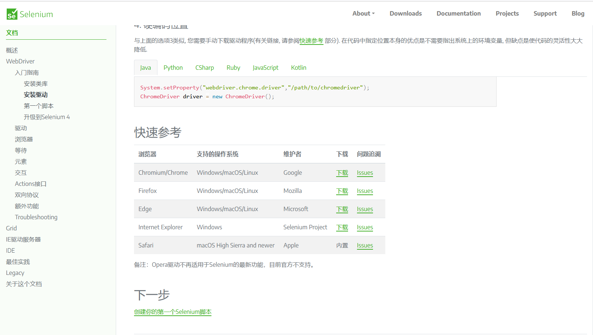

    图 3-2：下载 Selenium WebDriver 组件

2. 由于 Mozilla Firefox 使用的浏览器引擎是 Gecko，所以它对应的 WebDriver 组件名叫 geckodriver。而根据当前设备所用的 Windows 11 操作系统，这里需要下载的应该是`geckodriver-v0.32.2-win-aarch64.zip`这个压缩包文件。待该文件被成功下载到当前计算机中后，读者需要做的就是将其解压并把获得的`geckodriver.exe`文件复制到 Mozilla Firefox 浏览器的安装目录中，如图 3-3 所示

    

    图 3-3：安装与浏览器对应的 WebDriver 组件

3. 如果读者想验证一下 WebDriver 组件的安装是否成功，可选择先在之前约定用于存放示例代码的目录中下创建一个名为`02_HelloSelenium`的目录，然后在该目录下继续创建一个名为的`testGeckoDriver.py`文件，并在其中输入如下代码。

    ```python
    # 导入框架中的 WebDriver 组件
    from selenium import webdriver
    # 创建操作 Web 浏览器的驱动器对象
    driver = webdriver.Firefox()
    # 使用驱动器对象打开浏览器并访问指定的 URL
    driver.get("https://www.baidu.com")
    # 将浏览器的窗口设置为宽 800，高 400
    driver.set_window_size(800, 400)
    # 使用驱动器对象关闭浏览器窗口
    driver.close()
    ```

    如果读者在执行上述脚本之后，能看到它自动用 Mozilla Firefox 浏览器打开了百度的搜索页面（如图 3-4 所示）并调整了浏览器窗口的大小，就证明 Selenium 框架用于控制 Mozilla Firefox 浏览器的 WebDriver 组件已经被成功安装当前计算机设备中了。

    

    图 3-4：试用 WebDriver 组件

接下来，如果读者不喜欢以编写代码的方式来设计测试用例，也可以选择为 Mozilla Firefox 浏览器安装 Selenium IDE，这样就可以将自己使用浏览器进行手工测试的过程录制下来，以便导出可重复使用的测试用例，并在必要时自动生成基于指定编程语言的自动化测试脚本。由于在 Mozilla Firefox 浏览器中，Selenium IDE 是以插件的形式存在的，所以其安装步骤如下。

1. 打开 Mozilla Firefox 浏览器的附件管理器，并使用其搜索功能找到 Selenium IDE 插件的安装页面，如图 3-5 所示。

    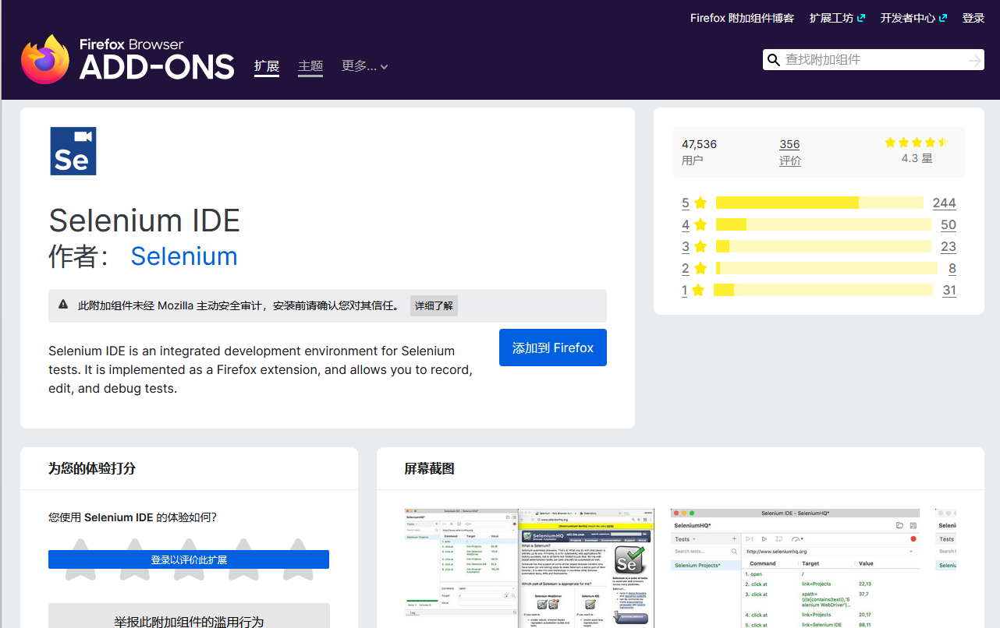

    图 3-5：Selenium IDE 的安装页面

2. 在上述页面直接用鼠标左键单击“添加到 Firefox”按钮即可开始安装。在安装完成后，打开该插件的界面如图 3-6 所示。

    

    图 3-6：Selenium IDE 的初始界面

如果读者想验证 Selenium IDE 的安装是否成功，可以执行以下步骤来初步试用一下这个插件。

1. 在上述界面中用鼠标左键单击“Create a new project”来新建一个项目，并将其命名为`testSeleniumIDE`，该项目创建后的管理界面如图 3-7 所示。

    

    图 3-7：Selenium IDE 的项目管理界面

2. 接着在上述界面中用鼠标左键单击左侧“tests”工具栏中的“+”按钮创建一个名为`openBaidu`的测试用例，然后在上述界面中用鼠标左键单击右侧主界面中红色的“rec”按钮并输入百度搜索页面的 URL，即可开始录制测试人员在 Web 浏览器中的测试操作，录制界面如图 3-8 所示。

    

    图 3-8：在 Selenium IDE 中录制测试用例

3. 在上述浏览器窗口中完成相关的操作之后，再次用鼠标左键单击之前的红色按钮即可结束测试用例的录制。如果想回放该测试用例，只需继续在图 3-7 所示的右侧主界面中用鼠标左键单击工具栏左侧第二个按钮即可，其界面如图 3-9 所示。

    

    图 3-9：在 Selenium IDE 中回放测试用例

如果上述过程一切顺利，我们就可以确定面向 Mozilla Firefox 浏览器的 Selenium IDE 插件已经被成功安装当前计算机设备中了。

正如之前所说，Selenium IDE 还支持将之前录制的测试用例导出为指定语言的脚本。例如，如果读者想将之前录制的、名为`openBaidu`的测试用例导出为基于 Python 语言的自动化测试脚本，就可以执行如下步骤来实现。

1. 在图 3-7 所示的界面中用鼠标右键点击该测试用例，然后在弹出的菜单栏中选择“Export”菜单项，如图 3-10 所示。

    

    图 3-10：Selenium IDE 中导出脚本的菜单项

2. 然后在弹出的对话框中选择要导出的是基于哪一种编程语言的自动化测试脚本。在这里，建议读者选择“Python pytest”选项，并用鼠标左键单击“EXPORT”按钮即可，如图 3-11 所示。

    

    图 3-11：选择脚本使用的编程语言

3. Selenium IDE 会自动导出一个名为`test_openBaidu.py`的 Python 脚本，在选择好保存路径之后（例如，本书会将其作为示例保存在之前创建的`02_HelloSelenium`目录中），读者就可以看到这个自动生成的脚本了，其代码如下。

    ```python
    # Generated by Selenium IDE
    import pytest
    import time
    import json
    from selenium import webdriver
    from selenium.webdriver.common.by import By
    from selenium.webdriver.common.action_chains import ActionChains
    from selenium.webdriver.support import expected_conditions
    from selenium.webdriver.support.wait import WebDriverWait
    from selenium.webdriver.common.keys import Keys
    from selenium.webdriver.common.desired_capabilities import DesiredCapabilities

    class TestOpenBaidu():
        def setup_method(self, method):
            self.driver = webdriver.Firefox()
            self.vars = {}
        
        def teardown_method(self, method):
            self.driver.quit()
        
        def test_openBaidu(self):
            self.driver.get("https://www.baidu.com")
            self.driver.close()
    ```

正如读者所见，Selenium IDE 导出的脚本中定义了一个名为`TestOpenBaidu`的自定义类型，而该自定义类型又是基于 PyTest 这个第三方的测试集成工具来实现的。所以，如果读者想执行这个自动化脚本中定义的测试用例，首先需要在命令行终端中执行`pip install pytest`命令将该扩展工具安装到自己的计算机设备中，然后就可以通过执行`pytest -v [脚本文件所在路径]`命令来执行测试了。在这里，`-v`参数的作用是让 PyTest 输出测试用例的详细信息，如图 3-12 所示。[^1]

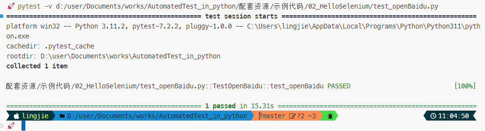

图 3-12：PyTest 输出的测试报告

上述命令的执行效果与之前在 Selenium IDE 中重播测试用例的过程是完全一致的。由此可以看出，该集成环境导出脚本的功能对于一些不习惯使用编程语言来设计测试用例的初级测试人员的确是会有不少帮助的。但如果读者想设计出真正具有创造力的测试用例，以保证更好地找出被测试对象中存在的问题，最终还是会需要学习如何使用编程语言，并基于 Selenium 框架亲自编写出可以自动化执行测试的脚本，而这正是读者稍后要重点学习的技能。

值得一提的是，如果读者想将使用 Selenium 框架的测试环境扩展至多台安装了不同操作系统和 Web 浏览器的设备，就需要另行安装该框架中用于多设备并行的组件：Selenium Grid。该组件可以让测试人员在不同的操作系统平台上并行地针对不同的 Web 浏览器来执行测试任务，它本质上的作用是建立一个基于 Hub-Node 分布式架构的自动化测试网络。这类网络通常由一台扮演管理角色的 Hub 设备和若干台用于执行具体任务的 Node 设备组成，Hub 设备会负责管理该网络中各个 Node 设备，接收来自测试人员的测试任务请求，并把这些任务分配给符合要求的 Node 设备来执行。

当然了，搭建分布式的自动化测试网络并不是本书要讨论的议题，这里鉴于篇幅方面考虑，就不展开演示它的搭建方法了，读者如有需要可自行参考 Selenium 框架官方文档中关于 Selenium Grid 组件的详细介绍。

[^1]: 本书将会在第5章中详细介绍该工具的使用方法，在第5章之前，读者暂时只需跟着本书的讲解简单地使用它即可。

#### 3.1.2.3 查阅官方文档

对于程序员来说，学习使用新的框架来编写程序源代码的工作往往是从查阅该框架的官方文档开始的。与经由正式出版流程来发布的纸质技术类书籍相比，学会阅读开发框架的官方文档主要如下好处。

- 程序员们能更及时地获得框架开发方提供的第一手资料，因为这些官方文档无需经历纸质书籍绕不开的出版流程；
- 程序员们能更直接地了解框架开发方的设计意图，而纸质书籍中往往包含了作者本人的理解以及相关的二次操作；
- 程序员们能利用 HTML 文档可搜索、可跳转的特性更快速地找到并查看目标信息，而纸质书籍则往往需要更多的阅读时间；

当然，这些文档也有内容过于简洁、用词过于专业、对初学者不够友好等缺点，程序员们想要在工作中更好地利用它们的确是需要一定的经验积累的。面对这一问题，笔者接下来将以使用 Selenium 框架编写自动化测试脚本为需求，为读者初步介绍一下利用该框架提供的官方文档来解决问题的基本步骤。

1. 只要是拥有一定用户基础的开发框架，通常都会提供有一个官方网站，读者只需要在搜索引擎中输入框架的名字就可以快速找到其官方网站。例如在这里，读者只要在 Google 中搜索“Selenium”关键字，就可以快速找到并访问 Selenium 框架提供的官方网站，如图 3-13 所示。

    

    图 3-13：Selenium 框架的官方网站

2. 通常情况下，开发框架的官方网站都会在首页放置其文档的访问链接。例如在这里，读者只需在图 3-13 所示页面的顶部导航栏中找到带有“Documentation”字样的链接，通过用鼠标左键单击该链接就可以直接跳转到 Selenium 框架的官方文档首页了，如图 3-14 所示。

    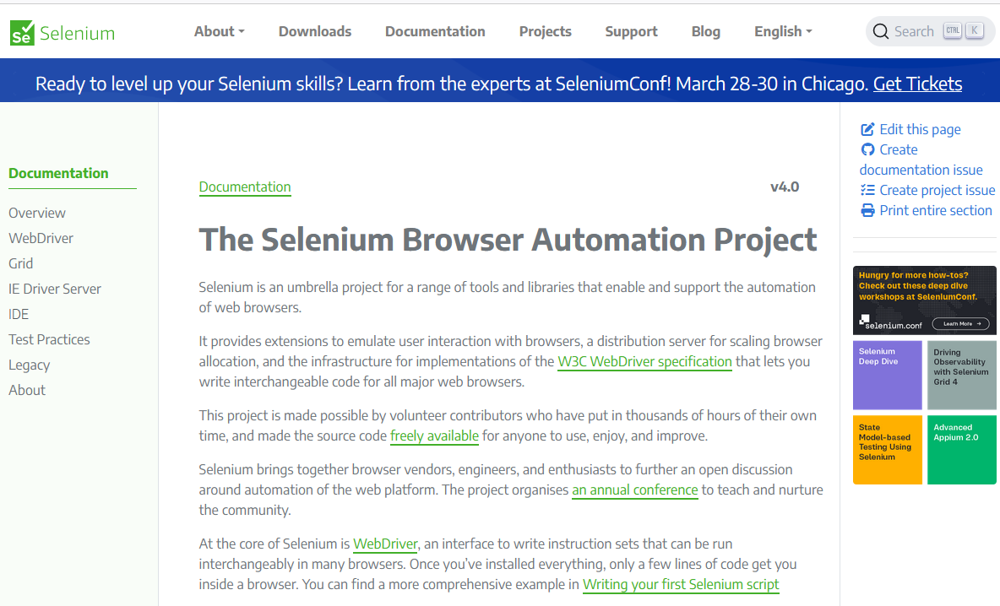

    图 3-14：Selenium 框架的官方文档首页

3. 开发框架的文档页面通常都有着与 Windows 资源管理器类似的结构分布，左侧是文档目录，右侧则是用于阅读文档内容的主窗口，读者在这里需要根据自己的需求来查看相关的文档资料。例如，如果读者想知道 WebDriver 组件究竟提供哪些可控制浏览器窗口的 API，就可以在图 3-14 所示页面的左侧找到带有“WebDriver”字样的链接，并用鼠标左键单击该链接就可以开始阅读这部分文档了，如图 3-15 所示。

    

    图 3-15：WebDriver 组件的官方文档

4. 根据图 3-15 所示页面提供的入门教程，只要耐心花上一定的时间，就可以初步掌握使用 WebDriver 组件控制 Web 浏览器的方法了。例如，读者在这里可试着修改一下之前创建的`testGeckoDriver.py`脚本，并在其中添加更多操作浏览器窗口的 API 调用，并观察效果。

    ```python
    from time import sleep
    # 导入框架中的 WebDriver 组件
    from selenium import webdriver
    # 创建操作 Web 浏览器的驱动器对象

    def TestGeckodriver(Url):
        driver = webdriver.Firefox()
        # 使用驱动器对象打开浏览器并访问指定的 URL
        driver.get(Url)
        # 设置浏览器的窗口宽 800，高400
        driver.set_window_size(800, 400)
        # 等待 3 秒再继续
        sleep(3)
        # 使用驱动器对象刷新当前页面
        driver.refresh()
        # 等待 3 秒再继续
        sleep(3)
        # 使用驱动器对象最大化浏览器窗口
        driver.maximize_window()
        # 等待 3 秒再继续
        sleep(3)
        # 使用驱动器对象关闭浏览器窗口
        driver.close()
        # 使用驱动器对象退出浏览器程序
        driver.quit()

    # 调用测试方法
    if (__name__ == "__main__") :
        TestGeckodriver("https://www.baidu.com")
    ```

以上脚本在执行时首先会打开一个浏览器窗口并访问百度的搜索页面，然后会将浏览器的窗口设置为宽 800，高 400 的大小，接着在等待 3 秒之后刷新页面，再 3 秒之后执行窗口最大化操作，最后再 3 秒关闭窗口并退出浏览器所在的进程。由此，读者就等于将针对浏览器窗口的主要操作大致体验了一遍。

关于 Selenium 框架更多 API 的调用，笔者将会在第 4 章中结合具体的测试用例设计来做更具有实用性的演示。在这里，笔者更希望读者能先洞察到不同体裁的参考资料，以及学习它们的方式有着各自的优点。开发框架的官方文档的定位更接近于人类语言的字典或产品说明书，而纸质书籍则更侧重于由浅入深地教学和方法论的传授。如果读者是刚刚入门的初学者，可以先通过阅读纸质书籍来了解一下自己将要使用的框架。在对它的设计思路有了一定程度的理解之后，就可以在工作中利用其官方文档来培养自己“在学中做，在做中学”的能力，并累积经验了。

## 3.2 学习 Robot 框架

为了更好地让读者理解快速学习新框架的思路，笔者接下来会继续介绍另一个名为 Robot 的自动化测试框架，希望读者能参考本书从零开始讲解一个开发/测试框架的流程，从中总结出适合于自己的快速学习方法。

与 Selenium 框架相比，Robot 框架是一款更为通用的、可扩展的自动化测试框架，它最大的特点是支持关键字驱动的测试方法。这意味着，测试人员可以先基于该框架的扩展规则来引入其他用 Python 或 Java 实现的第三方测试扩展（包括 Selenium），并将这些扩展的住处编写成 HTML、TXT 等格式的关键字文档，就可以获得一款强大的测试工具了。之后，只需再以关键字的形式编写测试用例即可进行测试。总体而言，掌握 Robot 框架的学习重点就是要切实地理解关键字驱动的自动化测试方法，下面就来具体介绍一下这一测试方法及其背后的工作原理。

### 3.2.1 关键字驱动测试

在测试方法中，关键字驱动测试的主要构想是将程序员编写的自动化测试代码进行两次分离：第一次先将该测试代码中使用的具体测试数据剥离出来；第二次再从已剥离了数据的代码中将模仿人类行为的部分剥离出来。然后在工作时反过来基于具体的测试数据与指定的行为来生成对应的自动化测试代码。这样做将有利于人们更加便捷地进行自动化测试代码的管理，提高这些代码的复用性，让自动化测试的工具更容易被普通人理解并使用。

考虑到上述理论说明有些复杂，下面来举个简单的例子。如果读者编写了一个用于测试“用户登录”功能的自动化脚本，那么该脚本代码中用于测试的每一组用户名和密码都属于具体的测试数据，在设计基于关键字驱动的测试方法中，它们应该首先被剥离出去。然后在剩下的代码中，有包含“输入用户名和密码”、“点击登录按钮”等模仿人类操作的行为部分，也有“检查输入是否有效”、“检查登录是否成功”等执行目标程序流程的测试部分，而我们第二次分离工作要做到就是将模仿人类操作的行为部分从中剥离出来，并保存为与相应测试功能相关联的关键字。这样一来，我们在后续工作中就可以拿一组用户数据，加上指定的关键字让 Robot 这样的自动化工具自动生成测试代码了，譬如像表 3-1 中所描述的这样。

| 具体测试数据             | 关键字           | 生成的测试代码             |
| ------------------------ | ---------------- | -------------------------- |
| 用户张三（用户名，密码） | 输入用户名和密码 | 检查输入是否有效的测试代码 |
| 用户张三（用户名，密码） | 点击登录按钮     | 检查登录动作是否成功的测试代码 |

表 3-1：数据+关键字驱动的测试

从上述例子可以看出，关键字驱动测试的核心思路就是将自动化测试脚本中用于模仿人类操作的行为部分提取出来，作为一个以关键字形式存在的固定测试动作。这样就之后只需要提供具体的测试数据，就可以实现对于相应测试动作相应的自动化代码了。而这个提取行为部分的过程，在专业术语中被称之为“关键字封装”。

### 3.2.2 快速上手教程

在理解了 Robot 框架的基本工作原理之后，读者就可以开始学习如何在具体项目中引入该框架，并配置好使用该框架进行自动化测试所需要的相关工具了。对于一个新的开发框架，程序员们对它的上手过程基本都是从这一步开始的。

#### 3.2.2.1 安装框架文件

正如之前所说，Robot 框架可以利用其扩展性引入 Selenium 框架一起搭配使用，因此在接下来的演示中，本书会选择继续在之前配置了 Selenium 框架的环境中介绍 Robot 框架的安装与配置方法，其具体步骤如下。

1. 确认当前计算机设备中已经安装了 Selenium 框架，以及与 Web 浏览器相匹配的 WebDriver 组件（关于这部分的具体操作，读者可复习本章在 3.1 节中的介绍）。

2. 在当前计算机设备中打开 Powershell 这样的命令行终端环境，并在其中执行`pip install robotframework`命令来安装 Robot 框架。在本书中，笔者安装的是 Robot Framework 6.0.2，如图 3-16 所示。

    

    图 3-16：安装 Robot 框架

待上述安装过程顺利完成之后，接下来要做的就是根据自己安装的框架版本来配置使用该框架的自动化测试环境了。

#### 3.2.2.2 配置框架环境

为了更便捷地使用 Robot 框架，人们通常还会选择为其配置一款名叫 RIDE 的集成开发环境，这是一款基于 Python 语言实现的，专门面向 Robot 框架编写测试用例的软件。它的安装方式非常简单，读者只需继续在之前打开的命令行终端环境中执行`pip install robotframwork-ride`命令即可。在这里需要特别提醒的是：如果读者使用的是最新版本的 Python 运行时环境，其对应的 RIDE 版本可能还未被更新到 Pip 包管理器的软件仓库中。为了解决这一问题，读者可前往 GitHub 网站中搜索 robotframework/RIDE 项目，并根据其官方说明来安装该软件。总而言之，待该软件的安装过程完成之后，当前计算机的 Windows 桌面上就会出现一个如图 3-17 所示的图标。

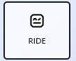

图 3-17：RIDE 的图标

如果读者想验证 Robot 框架及其集成环境的安装是否成功，接下来可以通过试用 RIDE 来初步体验一下这个框架的功能，其具体步骤如下。

1. 在当前计算机的 Windows 桌面上用鼠标双击如图 3-17 所示的图标，稍等片刻就会打开 RIDE 的主界面，该界面的初始状态如图 3-18 所示。

    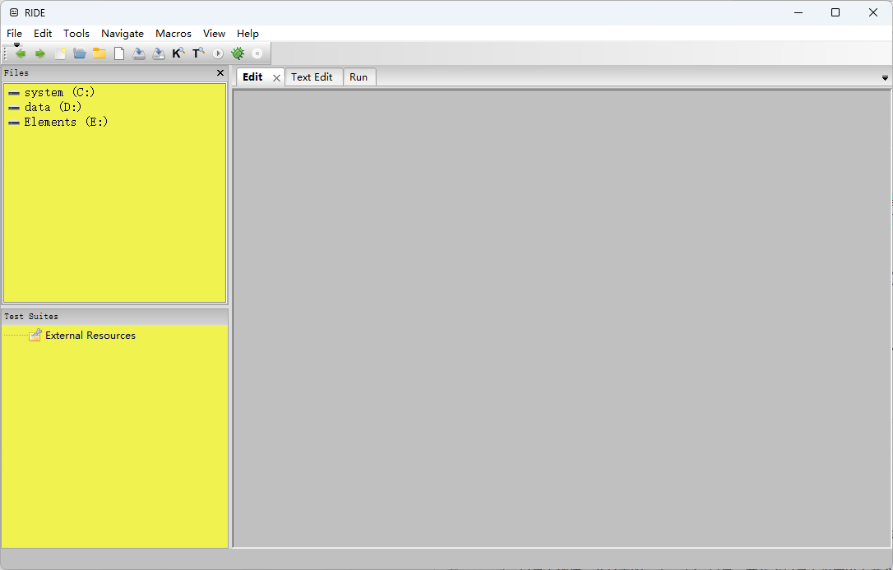

    图 3-18：RIDE 的初始界面

2. 在如图 3-18 所示界面的菜单栏中，通过依次用鼠标单击“File”→ “New Project”菜单项，创建一个名为`03_HelloRobot`的新项目，保存目录依然为之前约定的`配套资源/示例代码`目录，如图 3-19 所示。

    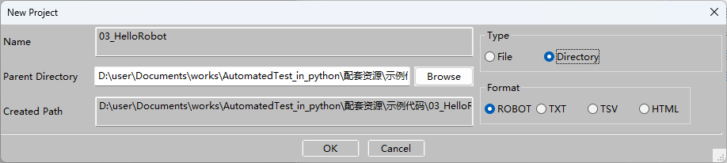

    图 3-19：在 RIDE 中创建新项目

    在选择工程类型时，如果读者想创建的是一个多文件的项目，就选择“Directory”，否则就保持默认选项即可。

3. 待上述项目创建之后，读者就会在如图 3-20 所示的主界面中看到这个新项目了。在该界面中，除了顶部的菜单栏和工具栏之外，其工作区主要由三个窗格组成。左侧上半部的“Files”窗格可被视为是当前计算机设备的资源管理器，其中显示的是当前文件所在的目录；左侧下半部的“Test Suites”窗格可被视为是项目管理器，其中显示的是我们使用 RIDE 创建的项目及其相关资源；最后，右侧占大部分区域的窗格就是当前项目的主工作区。

    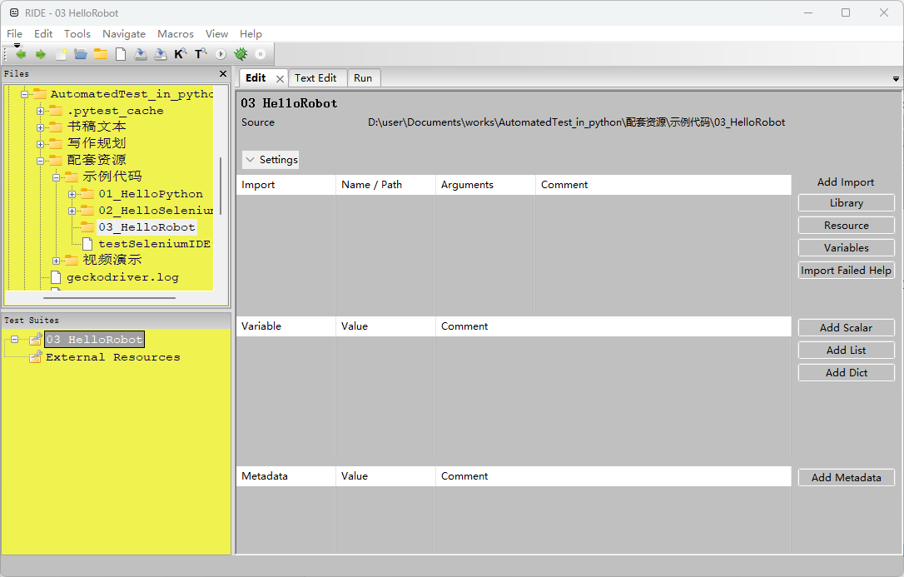

    图 3-20：RIDE 中的项目管理界面

4. 在 RIDE 中，下面的管理单元分为项目、测试套件和测试用例三个级别。因此读者接下来要做的就是在图 3-20 所示界面左侧的“Test Suites”窗格中用鼠标右键单击之前创建的`03_HelloRobot`项目，并在弹出的菜单中选择“New Suite”菜单项来新建一个新的测试套件。在这里，笔者将该套件命名为`testOpenBaidu`，如图 3-21 所示。

    

    图 3-21：在 RIDE 中创建测试套件

5. 继续在“Test Suites”窗格中用鼠标右键单击之前创建的`testOpenBaidu`测试套件，并在弹出的菜单中选择“New Test Case”菜单项来新建一个新的测试用例。在这里，笔者将该测试用例命名为`openBaiduCase`，如图 3-22 所示。

    

    图 3-22：在 RIDE 中创建测试用例

6. 在上述步骤完成之后，读者就会在 RIDE 的主界面中看到如图 3-23 所示的项目信息了。此刻，主界面右侧工作区呈现的就是当前测试用例的编辑界面。接下来，读者就需要在该界面中进行测试用例的具体设计了。

    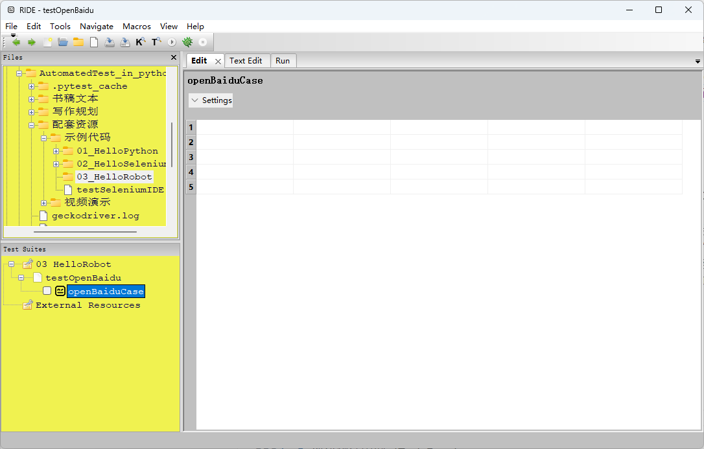

    图 3-23：RIDE 的用例编辑界面

7. 作为在 Robot 框架设计测试用例的第一步，读者首先要做的就是将 Selenium 框架作为第三方扩展引入到当前项目中。具体操作是：首先打开命令行终端环境并在其中执行`pip install robotframework-selenium2library`命令安装对应的插件。然后回到 RIDE 中，并在“Test Suites”窗格中用鼠标左键单击之前创建的`testOpenBaidu`测试套件，并在右侧主工作区中用鼠标左键单击“Add Import”栏下面的“Library”按钮，如图 3-24 所示。

    

    图 3-24：RIDE 的套件编辑界面

8. 在弹出的如图 3-25 所示对话框中填写要导入的扩展为“Selenium2Library”（注意区分大小写），并用鼠标左键单击“OK”即可完成 Selenium 框架的导入。

    

    图 3-25：导入 Selenium 扩展

    待扩展添加完成之后，我们就可以在如图 3-26 所示界面中看到该扩展了。如果该扩展的名称为黑色，即证明该扩展已经被成功导入。如果为红色，可能就遇到了一些路径问题，最直接的解决方法就是找到该扩展的安装目录（该目录通常位于`[Python安装目录]\lib\site-packages\`目录下），并在其中创建一个名为`GLOBAL_VARIABLES.py`的空文件即可。

    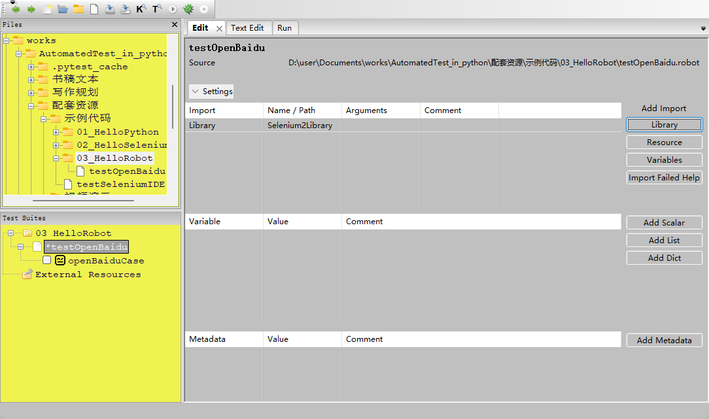

    图 3-26：RIDE 中的扩展列表

9. 在“Test Suites”窗格中用鼠标左键单击之前创建的`testOpenBaidu`测试用例，回到 RIDE 的用例编辑界面中，使用 Robot 框架的内置关键字编写如下测试剧本（在编写过程中，读者可以使用“Alt+Ctrl+Space”快捷键来查看当前可用的关键字），具体如图 3-27 所示。

    - 打开浏览器并访问百度的搜索；
    - 在搜索框中输入文字：robot framework
    - 用鼠标左键单击“百度一下”按钮；
    - 让浏览器窗口等待 20 秒；
    - 关闭浏览器；

    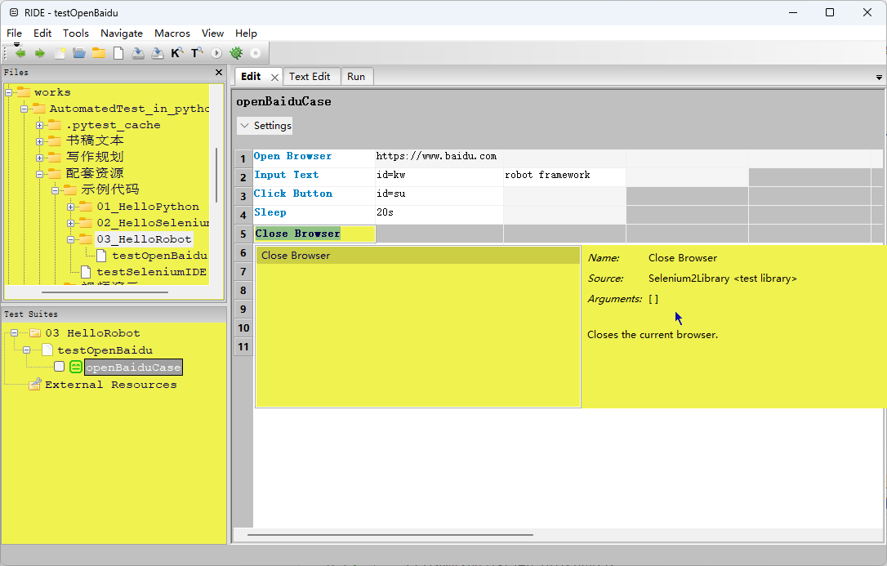

    图 3-27：使用关键字编写测试用例

10. 在 RIDE 顶部的菜单栏中依次选择“Tools”→“Run Tests”即可启动当前的测试用例了。待测试用例执行完成之后，RIDE 右侧的主工作区中将会自动报告测试的结果，如图 3-28 所示。

    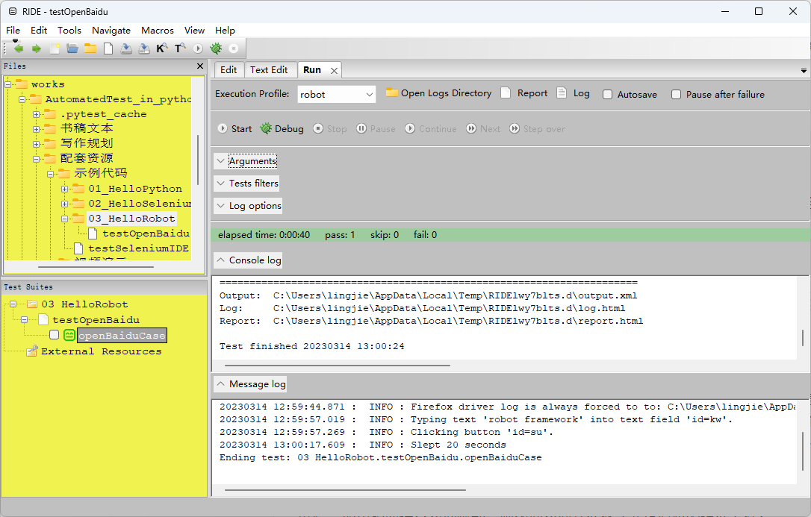

    图 3-28：测试用例的执行报告

至此，读者就完整地体验了在 RIDE 集成环境中基于 Robot+Selenium 框架，使用关键字编写测试用例的基本流程。从该流程中，我们可以明确地感受到关键字驱动的测试方法所能带来的便利性，以及整个测试过程的自动化程度。但这也带出了下一个要解决的问题：**测试人员在使用 Robot 框架编写测试用例时，究竟可以使用哪些关键字呢？**这就来到了程序员们快速学习一个新框架的最后一个步骤。

#### 3.2.2.2 查阅官方文档

对于测试人员来说，学习使用 Robot 框架进自动化测试工作的第一步是掌握该框架提供的内置关键字。而想要了解这些内置关键字，最便捷的方法就是查阅 Robot 框架的官方文档，其步骤具体如下。

1. 在 Google、百度这样的搜索引擎中输入“robot framework”关键字，就可以快速找到并访问 Robot 框架提供的官方网站，如图 3-29 所示。

    

    图 3-29：Robot 框架的官方网站

2. 在图 3-29 所示页面的顶部导航栏中找到带有“DOCS”字样的链接，并在展开的菜单中选择“BuitIn Library”链接即可跳转到 Robot 框架的内置关键字文档首页了，如图 3-30 所示。

    

    图 3-30：Robot 框架的内置关键字文档

3. 从图 3-30 所示的文档中，读者可以看到 Robot 提供了 106 个内置关键字，这些关键字主要用于变量定义、循环控制、数据计算、进制转换、断言判断、日志输入/输出等基本测试功能。例如，如果读者想知道“Call Method”关键字的作用，以及使用时需要指定哪些参数，就可以使用该文档页面中的搜索功能来查看该关键字的详细说明，如图 3-31 所示。

    

    图 3-31：Call Method 关键字的文档

在掌握了 Robot 框架的内置关键字之后，接下来该框架的标准库中提供的关键字。如果读者想查阅这部分关键字的文档，可在图 3-29 所示页面的顶部导航栏中找到带有“DOCS”字样的链接，并在展开的菜单中选择“Standard Library”链接即可跳转到 Robot 框架标准库中的关键字文档首页了，如图 3-32 所示。


图 3-32：标准关键字文档

上述 11 个分组的关键字涵盖了程序员们在日常编程时会需要用到的测试功能。例如：Collections 组的关键字主要用于执行与列表、字典等与集合类操作相关的测试；DateTime 组的关键字主要用于与日期、时钟类型数据相关的测试等，读者可以根据自己的需要用鼠标单击相应的“view”链接，并查阅相关的文档。

如果读者还想要对更复杂的功能进行测试，那就需要专门学习经由第三方扩展导入的关键字了，而这需要查阅这些扩展提供的官方文档。例如，读者之前所使用的“Open Browser”、“Input Text”等关键字，都是借由 Selenium2Library 这个第三方扩展导入的、专用于 Web 前端测试的关键字。如果读者想查阅该扩展提供的关键字文档，可执行如下步骤。

1. 在 Google、百度这样的搜索引擎中输入“robot framework selenium2library”关键字，就可以快速找到并访问 Selenium2Library 项目提供的官方网站，如图 3-33 所示。

    

    图 3-33：Selenium2Library 项目的官方网站

2. 在图 3-33 所示页面中找到带有“Latest keyword documentation”字样的链接并用鼠标单击它，即可跳转到 Selenium2Library 扩展提供的关键字文档首页了，如图 3-34 所示。

    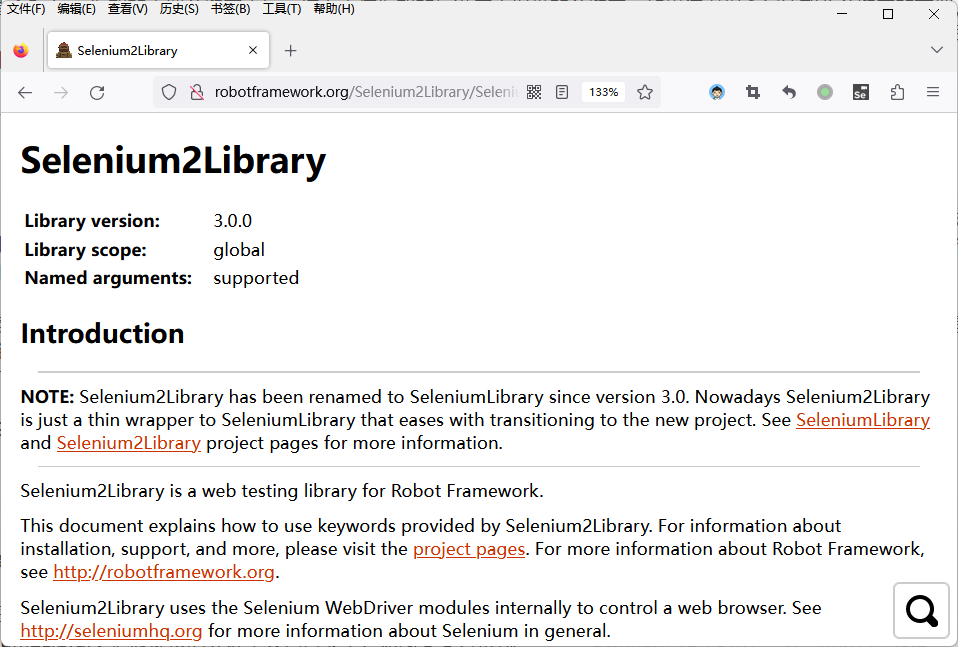

    图 3-34：Selenium2Library 的关键字文档

3. 在图 3-34 所示的文档界面中，读者可以用鼠标左键单击其底部的放大镜按钮，并使用其搜索功能快速定位到自己要查阅的关键字。例如，下面的图 3-35 中显示的就是“Open Browser”这个关键字的使用说明。

    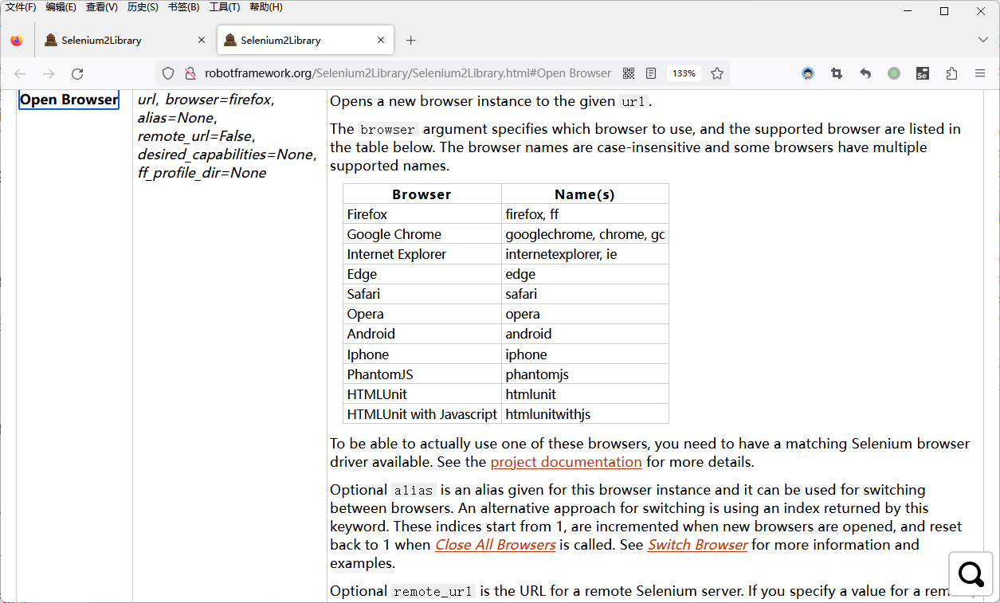

    图 3-35：Open Browser 关键字的使用说明

最后，在某些特殊情况下，读者也可以通过建立用户关键字的方式将自己编写的代码封装成可供 Robot 框架调用关键字。关于这部分的内容，读者也在 Robot 框架的官方网站上找到带有“DOCS”字样的链接，并在展开的菜单中选择“User Guide”链接，查阅其 2.7 节与用户关键字部分的内容，然后进行相关练习。例如，假设读者在这里需要将之前编写的`testGeckoDriver.py`脚本封装成一个名为“Test Geckodriver”的关键字，可执行以下步骤。

1. 回到 RIDE 中，并在“Test Suites”窗格中用鼠标左键单击之前创建的`testOpenBaidu`测试套件，并在右侧主工作区中用鼠标左键单击“Add Import”栏下面的“Library”按钮，然后再弹出的对话框中单击“Browse”，然后将之前编写的`testGeckoDriver.py`脚本作为扩展导入到当前测试套件中，其结果如图 3-36 所示。

    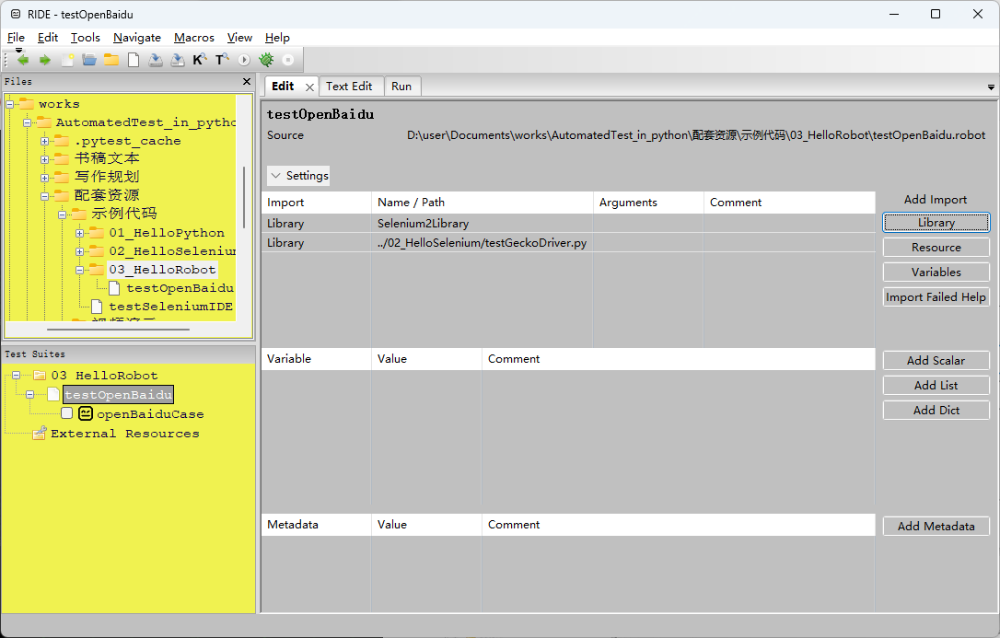

    图 3-36：在 RIDE 中导入自定义脚本

2. 继续在“Test Suites”窗格中用鼠标右键键单击之前创建的`testOpenBaidu`测试套件，并在弹出的菜单中选择“New User Keyword”菜单项来新建一个新的自定义关键字。在这里，笔者将该关键字命名为`Test Geckodriver`，并指定它有一个名为`${Url}`的参数，如图 3-37 所示。

    

    图 3-37：在 RIDE 中创建自定义关键字

3. 在“Test Suites”窗格中用鼠标左键单击刚创建的`Test Geckodriver`关键字，进入到该关键字的编辑界面中，然后在其中调用之前在`testGeckoDriver.py`脚本定义的函数，并设定其参数就是关键字接收到的参数：`${Url}`，如图 3-38 所示。

    

    图 3-38：在 RIDE 中编辑自定义关键字

4. 只要上述操作顺利，自定义关键字的操作就完成了。如果读者想验证一下该关键字是否可用，可继续在“Test Suites”窗格中用鼠标右键单击之前创建的`testOpenBaidu`测试套件，并在弹出的菜单中选择“New Test Case”菜单项，新建一个名为`helloSeleniumCase`的测试用例，并在该测试用例的编辑界面中调用`Test Geckodriver`关键字，并为其指定要访问的 URL 参数，如图 3-39 所示。

    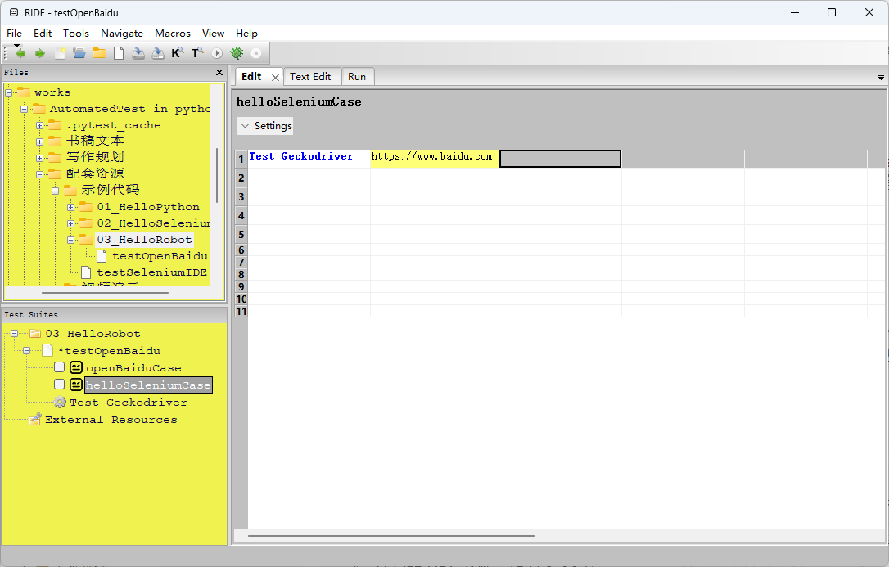

    图 3-39：在 RIDE 中调用自定义关键字

5. 最后只需在 RIDE 左侧的“Test Suites”窗格勾选`helloSeleniumCase`测试用例，并在其顶部的菜单栏中依次选择“Tools”→“Run Tests”即可启动该测试用例了，其测试报告如图 3-40 所示。

    

    图 3-40：验证自定义关键字的使用

关于上述内容的更详细说明，读者也在 Robot 框架的官方网站上找到带有“DOCS”字样的链接，并在展开的菜单中选择“User Guide”链接，查阅其 2.7 节与用户关键字部分的内容，然后进行相关练习。

## 3.3 培养自主学习的能力

需要再次强调的是，本章虽然花了很多篇幅介绍了在 Web 前端测试领域较为流行的两大自动化测试框架及其使用方法，但笔者主要聚焦的是*可持续的自主学习能力*。毕竟。在如今的软件开发活与测试动中，程序员们可以选择的开发/测试框架不仅琳琅满目，选择众多，而且新陈代谢得极为快速。这意味着，即使本书很完善地介绍了当前最为流行的框架及其使用方法，很有可能等到它最终出版之时，人们已经有了更好的选择。所以**授之以鱼，不如授之以渔**，学习本章内容的真正目的应该是要培养读者“快速学习新框架”的能力，这需要掌握如何找到并查阅这些框架本身提供的官方文档，以便自行去了解这些框架的设计思路，并理解为什么决定开放那些接口给用户，为什么对用户隐藏那些实现。这就需要读者自己具备开发框架的能力。换句话说，虽然不必重复发明轮子，但一个优秀的工程师或设计师应该了解轮子是如何被发明的，这样才能清楚在怎么样的轮子上构建怎么样的车。

总而言之，对于如今的项软件工程师来说，在一个月内快速掌握某个新框架的能力远比之前已经掌握了多少个框架重要得多，例如当开发团队的管理员在面试新成员时，如果这位面试者有五年 A 框架的使用经验，那固然是很好，但团队中很多人都有，未必需要再多一个同类型的人才、但如果该面试者能在一个礼拜快速上手基于 Python 开发的任意一种框架，那么这位人才的重要性就会被凸显出来。
