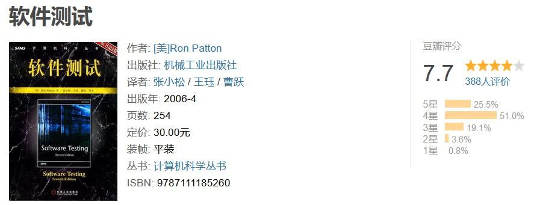
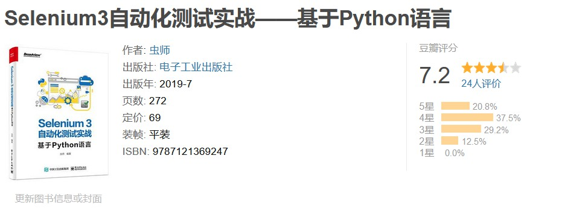
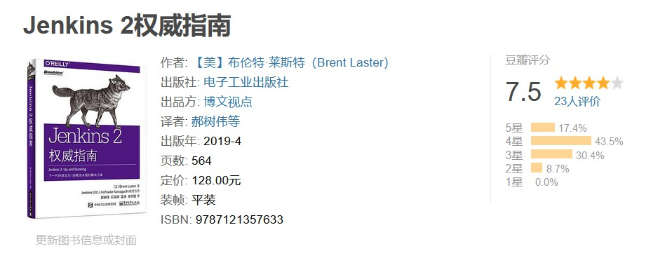

# 关于自动化测试及其书籍推荐

如今，在与程序员相关的就业市场中，除了大家所熟悉的、软件开发类的岗位之外，软件测试工程师也是一个颇具发展前景的热门岗位。毕竟，目前几乎所有大中型的软件产品在发布前都需要完成大量的质量控制、测试和文档工作，这些工作通常大约会占用掉整个软件项目中 50% 的时间和总成本，而软件测试工程师就是负责这部分工作的重要岗位。然而我们面对的现实情况是：一方面是就业市场对高质量的测试工程师需求量越来越大，另一方面则因为国内教育方面在过去的很长一段时间里对测试工作的重视程度不够，让很多人根本不了解这项工作的具体内容及其在软件工程中的重要性，这最终到导致了中国在这方面的优质人才供给存在着较大的缺口。据笔者曾经看过的一些调查数据显示，中国目前在软件业每年都会新增约 20 万测试类的岗位需求，但相关学校与培训机构培养出的软件测试人才不足这个需求量的 10%，并且需求与供给间的差距仍在进一步拉大。

而具体到了软件测试工作中，自动化测试则又被认为是其中一个非常重要的技能方向。在这里，自动化测试泛指的是软件测试工程师们使用独立于待测软件之外的自动化脚本或其他软件工具来完成测试任务并生成相应测试报告的能力。从广义上来说，一切通过计算机程序的方式来代替或辅助人工测试的行为都可以被视为测试的自动化。而如果从狭义上来说，自动化测试通常指的是测试工程师们利用工具记录用户操作并在后续测试中重复这些操作的过程，或者指通过编写脚本的方式来模拟人工测试的过程。在接下来的这篇文章中，我们将会主要从狭义的角度来探讨实现自动化测试工作所需要学习的知识，并以推荐书目的方式为读者规划进入这一领域的路线图。

## 测试自动化简介

自动化测试这一工作技能在如今广为流行的敏捷开发、持续交付和持续集成等新型软件工程理念中，享有着至关重要的地位。毕竟，随着我们在生产环境中开发的软件系统在规模上越来越庞大，对这些软件系统的测试也在变得更加困难和复杂，这也使得传统的人工测试将越来越难以胜任相关的工作任务。因此，我们也越来越需要利用自动化技术来克服传统测试技术的许多问题，在原则上，只要某一软件的测试流程是已经确定了的，那么实现针对它的测试自动化在理论上就具备了一定的意义，毕竟这样做既可以让我们在工作效率上快速地执行一些重复但必须要完成的测试工作，也可以从工作规模上来完成一些人工测试几乎不可能完成的任务。

### 核心任务及其局限

从具体工作内容上来说，自动化测试的核心任务就是通过制定一套严密的测试法则和评估标准，从而定义出一个完整的自动测试流程。也正因为如此，它才可以有效地避免测试工程师因某种惯性思维或迷信经验而导致的测试疏漏。下面，让我们通过举例来具体了解一下自动化在具体测试任务中的作用。

首先，让我们来看单元测试。这一类测试的自动化被认为是极限编程和敏捷开发这类新型开发方式的一个关键衍生，由它主导的开发过程通常被称之为测试驱动开发。在这一类开发活动中，单元测试的用例可以在开发人员编写完应用程序的业务代码之前就完成预先设计，并作为对这一部分业务目标的一种定义。然后，随着代码编写进度的不断推进，单元测试随之同步进行，代码中存在的Bug也将被不断找出，并被持续纠正和完善。由于开发人员能够及时发现缺陷然后立即作出改变，修复的代价大大减小，这种不断发展的开发方式被认为比瀑布模型这类开发结束再测试的方式更为可靠。正因为如此，在项目开发过程中使用单元测试框架来实现自动化测试也已经成为了目前软件开发行业的一大趋势。

接下来，让我们再来看看回归测试。如果读者之前做过一些软件测试的工作，大概都应该知道如果以人工测试的方式来对大量的低级接口进行回归测试将会是一件十分耗时费工的事情，况且这种寻找 Bug  的效率还非常低下。而一旦这部分的测试实现了自动化，日后的测试工作将可以高效循环完成。很多时候这是针对软件产品进行长期回归测试的高效方法。毕竟，早期一个微小的补丁中引入的回归问题可能在日后导致巨大的损失。

当然了，凡事都有作用的局限性，事情做过了头就会带来反效果。尽管从整个软件开发周期来看，自动化测试可以软件开发活动带来开支上的节省，但如果我们一味地追求将所有的测试工作完全自动化，那么对测试自动化本身的实现也有可能会在短期内给项目团队带来巨大的开销。毕竟，虽然测试本身可以实现“自动化”，但对测试脚本维护和编写仍然需要大量的人工来投入。因此在实际生产环境中，测试工程师们会根据软件测试的具体需求采用人工测试和自动化测试相结合的方法来完成相任务。通常情况下，我们将一项测试工作自动化需满足以下要求：

- **对测试用例的要求**：可被自动化的测试用例大多是目标项目在每次被修改之后都需要进行回归测试的重要部分。只有在这种情况下，对相关代码实现测试的自动化才能有效地降低人工测试消耗的人力物力。
- **对测试人员的要求**：由于在将测试自动化的过程中，测试用例和输出结果也都是由以代码的形式存在的，因此这就要求测试工程师们本身也必须具备编程语言的使用能力。当然了，某些测试自动化工具支持通过关键词指定测试步骤，因而免除了程序编写的过程，对测试人员而言也就不再要求他们掌握编程技术了。
- **对项目团队的要求**：是否要对测试过程实现自动化，最终还是要取决于开发目标项目的团队是否真的需要自动化，这需要项目团队的管理者根据要被测试的目标系统、测试工作的规模和种类、可使用的测试工具、人和组织的工作重心等因素进行综合考虑来做出决策。

对于上述要求中的最后一项，如果我们是某个项目团队的管理者，就需要具体了解究竟有哪几种测试是可以实现自动化的，只有这样我们才能根据项目进行回归测试的必要性、经济因素、被测系统成熟度来做出决定。下面，我们就来介绍一下自动化测试的分类。

### 自动化测试的分类

基于对测试工作的各种不同的目标和需求，我们通常会将可实现的自动化测试分类如下：

- **图形化界面测试**：在这一类测试中，测试工程师们会利用到许多自动化工具，这些工具会以播放宏记录用户在图形化界面（即 GUI）上进行的鼠标点击、键盘输入等交互操作。然后在接下来的测试过程中，这些播放宏便可以自动模拟这些交互操作，并与正常情况下的交互反馈进行对比。这种方法虽然通常不要求测试人员具有软件开发经验，但它们存在着一些可靠性和维护性问题，即任何按钮的重命名或是移动都会让播放宏出现错误，这就需要我们重新录制这些播放宏。
- **Web 界面测试**：这一类测试实际上是图形化界面的变种。在这里，我们要测试的“界面”不再是应用程序的 GUI 而是 Web 页面，由于 Web 页面是由 HTML 渲染器生成的用户界面，因此这类测试不必再聚焦于用户操作本身，而是代为渲染 HTML 并监听 DOM 事件来完成测试用例的记录与回放。在这里，像 curl 这样的无界面浏览器工具或 Selenium Web Driver 通常用于 Web 页面的测试工作。
- **接口测试**：接口测试是最为常见的软件测试任务之一，它通常需要测试工程师们能够排除图形化界面的影响，对软件功能本身进行测试。它是软件业务逻辑测试中非常关键的一步。通常在一个软件项目的早期阶段，接口测试就会开始执行来确保代码始终是准确无误的。接口测试也作为集成测试的一部分，用于判断系统是否满足功能、可靠性、性能表现和安全性的要求。由于接口测试不使用 GUI，它主要通过字符方式与测试者进行交互。
- **性能测试**：性能测试是通过自动化的测试工具模拟多种正常、峰值以及异常负载条件来对系统的各项性能指标进行测试。负载测试和压力测试都属于性能测试，两者可以结合进行。通过负载测试，确定在各种工作负载下系统的性能，目标是测试当负载逐渐增加时，系统各项性能指标的变化情况。压力测试是通过确定一个系统的瓶颈或者不能接受的性能点，来获得系统能提供的最大服务级别的测试。
- **持续测试**：持续测试是一个过程，它将自动化测试作为软件交付通道中内嵌的一部分，以尽快获得软件发布后业务风险的反馈。 自动化测试旨在生成一组与用户故事或应用程序要求相关的通过/失败的数据点。 另一方面，持续测试侧重于业务风险，并提供有关软件是否可以发布的判断。

## 学习路线图规划

在了解了自动化测试的基本概念、核心工作任务及其能力局限之后，我们就可以来具体规划进入这一领域的学习路线图了。根据个人的经验。我在这里会建议读者：首先，了解在进行软件测试工作时所需要的基础知识，这部分的主要内容包括软件测试类型、用例设计方法、测试策略等；然后，掌握一两门在软件测试工作中需要使用的编程语言及其相关工具，例如 Java、Python、Ruby、JavaScript 等；最后，掌握一两款当今主流自动化测试框架的使用方法。下面，让我们基于上述建议来做一些具体的学习建议和书籍推荐，以供读者参考。

### 基础知识的掌握

在学习软件测试的基础知识方面，我首先要向读者推荐的是《软件测试的艺术》这本书。该书被誉为软件测试工程师入门“圣经”，它对软件测试类型、用例设计方法、测试策略等，都有精彩具体的描述；总结的十大软件测试经典原则，至今仍被广为引用。值得一提的是，此书的篇幅仅 100 多页，非常适合专业人员每年都精读一次，每次都会有新的感悟。

接下来要推荐的是软件测试行业入门“地图”—— 《软件测试》。该书的作者 Ron Patton 具有近 20 年软件测试和软件质量保证的工作经验，曾从事过各种产品的软件测试，从关键任务到儿单绘图程序。普先后就职于德州仪器公司、西门子公司和微软公司，担任过质量保证工程师、软件测试经理等职务。他现在是一个独立的软件项目管理和软件质量保证咨询师。他在书中为读者详细描述了软件测试行业的“概貌”，开发过程、软件产品、实战测试策略、测试相关文档、测试未来、测试职业等。相信读者能从此书中找到软件测试世界的入口，找到知识才能的用武之地。

### 自动化测试框架

自动化测试框架泛指的是某种为特定产品设置一系列特定测试规则并自动化执行这些规则的集成系统。这套系统中通常整合了各种用于测试的函数库、测试数据集、元数据和各种可重用模块。将这些模块按照测试需求组合起来便可以得到一个完整的，针对特定功能或应用场景的测试用例。测试框架为自动化测试提供基础，并简化了自动化测试的工作流程。

在面向 Web 应用程序的的自动化测试工作中，Selenium 和 Robot Framwork 这两个框架是当前软件测试工程师们最主流的两种选择。其中，Selenium 框架是时下在 Web 领域最常用的自动化测试工具之一，它能帮助我们快速开发出自动化测试用例，且 跨各种平台、跨多种编程语言（包括 Java、Python）支持在多种浏览器上开展测试工作。该框架的学习曲线比较平缓，对于编程经验不是很丰富的测试人员来说，使用 Python+Selenium 这一组合工具是个很好的选择。关于这个框架的学习，我个人会推荐读者参考一下《Selenium3 自动化测试实战――基于 Python 语言》这本书。该书的写作目的并不是简单地告诉读者如何使用一个自动化测试工具，而是希望读者在学习本书的内容后能够提升技术高度、拓展技术宽度，从而摆脱简单的手工测试，向高级测试工程师迈进。

> 关联笔记：[[Selenium 学习笔记]]

而 Robot Framwork 则是一款更为通用的、可扩展的、支持关键字驱动的自动化测试框架，通常被专业的测试工程师们用于端到端地进行验收测试，例如用于验收测试驱动开发的成果，或者用于测试分布式异构应用程序中的各种接口。该框架的优势主要在于：关键字驱动测试可以重复利用、易扩展、支持生成 HTML 格式的测试报告、有庞大的测试库提供支撑等，但也存在着一些界面操作的共性问题，它会在测试用例过于庞大时产生界面卡顿，并触发一些 BUG，例如在导入测试库时会遇到界面卡死的现象。令人遗憾的是，笔者没能找到一本值得推荐的，致力于介绍 Robot framework 使用方法的中文教程，因此在这里就只能推荐一些网络资源了，具体如下：

> **学习 Robot framework 框架的参考资料**
>
> - 框架教程：https://docs.robotframework.org/docs
> - 用户手册：https://robotframework.org/robotframework/latest/RobotFrameworkUserGuide.html
> - API 文档：https://robot-framework.readthedocs.io/en/stable/
> - 关联笔记：[[Robot 框架学习笔记]]

基本上，只要很好地掌握了 Selenium 和 Robot framekwork 这两个框架，那么无论是主流的、基于 Web 界面的自动化测试，还是面向其他 UI 的自动化测试，我们都能够获得一定的心得体会与实践经验，并且在日后的自我学习中举一反三，例如学习用于在 Android 和 iOS 平台上进行自动化测试的 [Appium 框架](http://appium.io/)，它的使用方法是大同小异的（其参考资料如下）。这样一来，我们就能让自己在就业市场中占有一席地位。

> **学习 Appium 框架的参考资料**
>
> - 中文官方文档：https://appium.io/docs/cn/about-appium/intro/
> - 英文官方文档：https://appium.io/docs/en/about-appium/intro/
>  

除了测试框架之外，我们在某些自动化测试场景中可能还会用到一些持续集成的工具。例如，在测试工程师基于上述框架将自动化测试脚本都编写好之后，他大概率还是需要每天上班点击“开始“运行脚本，而且当开发提交新的版本时，也需要重新运行自动化脚本。如果他想让这些脚本的运行更自动化一些，就会需要学习持续集成。在这方面，我们会推荐读者去了解一下一款叫做 [Jenkins](https://www.jenkins.io/zh/) 的持续集成工具。该工具是基于 Java 语言实现的开源工具，它无论是在扩展性方面，还是实用性方面都有非常优异的表现，颇受业界欢迎。如果想系统地学习该工具的使用方法，我个人会推荐读者参考一下《Jenkins2 权威指南》这本书。

> - 关联笔记：[[Pytest+Jenkins 学习笔记]]

通过阅读这本实用性很强的书籍，软件项目的管理人员、开发人员、测试人员以及其他专业人员将会学到如何利用 Jenkins2 的新特性来定义软件工程的自动化工作流程，以便简化和加速 DevOps 环境的建设。当然了，要想用好这款工具，重点还是需要软件工程师们深入地理解以持续集成与持续交付为核心的 DevOps 工作理念，关于后者，推荐读者阅读一下我在之前的《[[关于软件工程及其书籍推荐]]》一文中推荐的参考资料。

## 结束语

最后需要说明的是，虽然相对于软件的开发工作来说，其测试工作会相对轻松一些，技术难度也不是特别高。但自动化测试是一项涉及领域非常广泛的技术，因此需要结合各行各业的具体情况来设计测试用例，为此通常都需要至少 3-5 年的潜心钻研才行，希望读者在做测试的这条路上保持学习的动力和耐心，紧跟各个行业的发展态势，了解它们的需求。保持与时俱进。

----
#已完成
