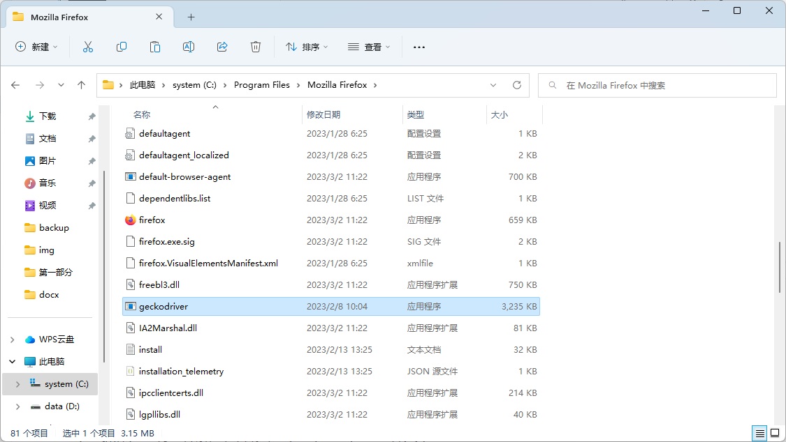
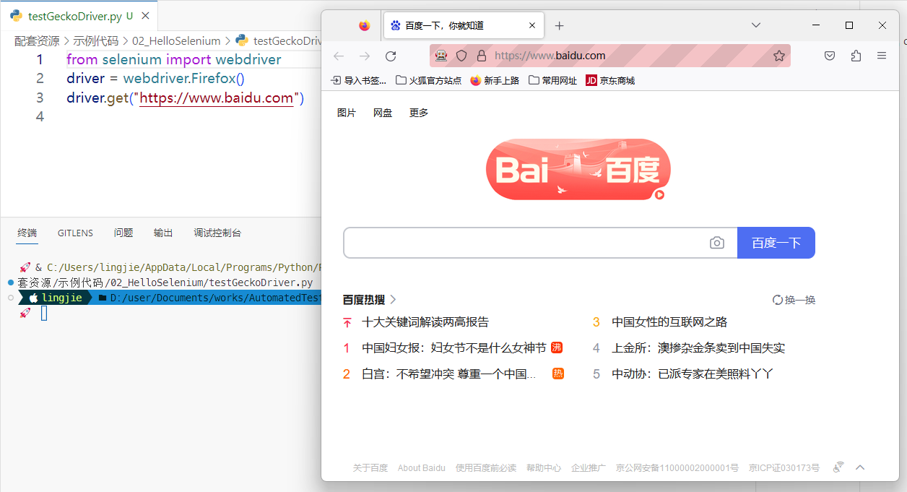
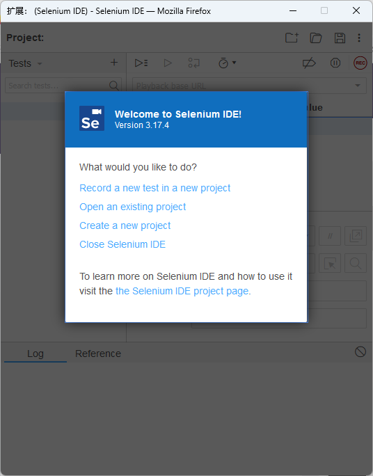
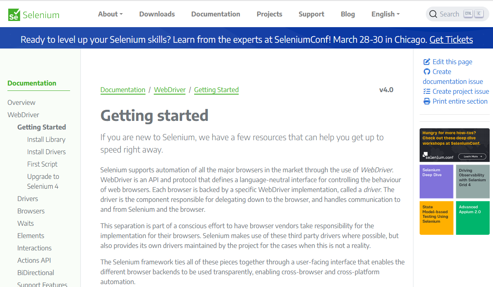

# Selenium 学习笔记

Selenium 框架是时下在 Web 领域中被使用得最为广泛的自动化测试工具集之一，它能帮助程序员们面向指定的 Web 前端应用快速地开发出自动化测试用例，且能实现跨各种平台、各种编程语言地在多种浏览器上开展测试工作。除此之外，由于该框架的学习曲线比较平缓，开发测试用例的周期也相对较短，这对于编程经验不是很丰富的初学者来说，从使用 Python+Selenium 这一工具组合开始来学习自动化测试也会是个很好的选择。所以接下来，就让我们先以该框架为敲门砖，打开进入自动化测试这一领域的大门吧。

## Selenium 框架简介

Selenium 框架最初是一位名叫 Jason Huggins 的软件工程师在 2004 年为 ThoughtWorks 公司工作时开发的一个自动化工具集。据说，他当时在负责测试一个叫 Time and Expenses 的 Web 应用程序，这个程序有着非常频繁的回归测试需求，对其进行手工测试日益成为了一个越来越低效且枯燥的工作。为了解决这一类问题， Jason Huggins 基于 JavaScript 语言为自己开发了一套可自动控制 Web 浏览器执行测试操作的工具集，该工具最初被命名为 JavaScriptTestRunner。在从同公司的开发者身上看到了该工具集的推广潜力之后，Jason Huggins 最终决定将它开源给开发者社区，并将项目名称改为 Selenium Core。

由于这套自动化测试工具集可以轻松地被部署在各种主流的操作系统平台上，并陆续对多种编程语言提供了支持，所以很快就在开发者社区中得到了广泛的支持，人们陆续为它开发出了功能更为完善的 Selenium RC 项目（现已被 Selenium WebDriver 项目取代），以及包括 WebDriver、Selenium Grid、Selenium IDE 等在内的一系列扩展项目。截止到这篇笔记成稿之日为止（即 2023 年 3 月），该框架的版本已经迭代到了 Selenium 4.3.0，其中已经集成了如下功能特性。

- 该框架支持多种编程语言、操作系统以及 Web 浏览器，具体如下：
  - 支持的编程语言包括：C#、Java、Python、PHP、Ruby、Perl 和 JavaScript；
  - 支持的操作系统包括：Android、iOS、Windows、macOS 以及各种 Linux 发行版；
  - 支持的 Web 浏览器包括：Google Chrome、Mozilla Firefox，Microsoft Edge、Apple Safari 等；
- 该框架支持并行测试执行，这有助于减少测试时间，并提高工作效率；
- 该框架支持与 Ant 和 Maven 等自动化构建工具的集成协作，以便在自动化测试中执行对被测试软件的重新构建；
- 该框架支持与 TestNG、PyTest 等测试集成工具进行协作，以便能执行更充分的测试，并生成特定格式的测试报告；
- 该框架已经集成了 WebDriver 组件，该 Web 驱动组件可直接与 Web 浏览器进行交互，并不需要服务端的任何支持；
- 该框架已经集成了 Selenium IDE，该工具为测试工作提供了操作录制与回放的功能。该功能可帮助测试人员记录自己对被测试软件所进行的操作，并将其导出为可重复使用的脚本，这可以节省大量编写测试脚本的时间；

当然，基于凡事都有两面性的常识，上述功能特性也必然会给 Selenium 框架带来一些局限性，这些局限性可以简单归纳如下。

- 该框架不支持针对桌面端应用程序的自动化测试；
- 该框架不支持针对 Web 应用程序的服务端接口（譬如 RESTful API）执行自动化测试；
- 该框架中没有像 UTF/QTP 那样内置了对象存储库，但它可以使用页面对象模型来实现这一功能；
- 该框架本身没有内置生成测试报告的功能， 必须依赖 PyTest 和 TestNG 等测试集成工具来实现这一功能；
- 该框架无法对图像执行测试，这需要 Sikuli 进行集成才能执行针对图像的测试；
- 与 UFT、SilkTest 等企业级的自动化测试框架相比，该框架在创建测试环境方面需要花费更多时间；

程序员们需要在使用该框架的过程中注意扬长避短，只有这样才能发挥出该工具最大的优势。现在，相信读者已经对 Selenium 框架有了一个基本了解，接下来就可以开始学习如何在具体项目中引入该框架，并配置好使用该框架进行自动化测试所需要的相关工具了。

## 快速上手教程

在具体学习如何在具体项目中引入 Selenium 框架并配置其使用环境之前，我们先在这里假设接下来要使用的是一台基于 IBM PC 架构的单机设备，该设备的基本配置如下：

- 处理器：Intel i5-9500T (6) @ 2.210GHz；
- 物理内存：16 GB；
- 操作系统：Microsoft Windows 11 Pro；
- Web 浏览器：Mozilla Firefox 110.0.1；
- 编程环境：Python 3.6 以上的运行时环境；

### 安装框架文件

作为学习框架的第一步，首先要做的就是基于上述环境配置来完成 Selenium 框架本身的安装操作。为此，读者需要做的就是打开 Powershell 这样的命令行终端环境并执行以下命令，执行的结果如图 1 所示。

```bash
# 将 pip 包管理器升级到最新版本
pip install --upgrade pip
# 安装 Selenium 框架的最新版本
pip install selenium
```

<!--  -->


图 1：安装 Selenium 框架

如读者所见，这里安装的是 Selenium 4.8.2，我们接下来将基于这一版本来研究该框架的使用方法。

### 配置框架环境

正如上一节中所说，Selenium 框架本质上是一组基于 Web 浏览器的自动化测试工具集，其中的每个工具组件都在自动化测试工作中发挥着不同的作用。在单一设备中建立该框架的使用环境时，首先需要做的是为自己使用的 Web 浏览器安装对应的 Selenium WebDriver 组件。该组件是 Selenium 框架用于操作 Web 浏览器的驱动程序，主要用于浏览器的控制、页面元素的选择和调试。因此，不同的浏览器往往对应着不同的 WebDriver 组件。在这里，读者面对的是 Mozilla Firefox 浏览器，它的具体安装步骤如下。

1. 访问 Selenium 框架的官方网站，并打开该网站提供的官方文档。然后在其 WebDriver 组件说明页面中找到 Mozilla Firefox 浏览器所对应的 WebDriver 组件（如图 2 所示），并根据自己所在的操作系统将该组件下载到当前计算机设备中。

    <!--  -->
    

    图 2：下载 Selenium WebDriver 组件

2. 由于 Mozilla Firefox 使用的浏览器引擎是 Gecko，所以它对应的 WebDriver 组件名叫 geckodriver。而根据当前设备所用的 Windows 11 操作系统，这里需要下载的应该是`geckodriver-v0.32.2-win-aarch64.zip`这个压缩包文件。待该文件被成功下载到当前计算机中后，读者需要做的就是将其解压并把获得的`geckodriver.exe`文件复制到 Mozilla Firefox 浏览器的安装目录中，如图 3 所示

    <!--  -->
    

    图 3：安装与浏览器对应的 WebDriver 组件

3. 如果读者想验证一下 WebDriver 组件的安装是否成功，可选择先在之前约定用于存放示例代码的目录中下创建一个名为`HelloSelenium`的目录，然后在该目录下继续创建一个名为的`testGeckoDriver.py`文件，并在其中输入如下代码。

    ```python
    # 导入框架中的 WebDriver 组件
    from selenium import webdriver
    # 创建操作 Web 浏览器的驱动器对象
    driver = webdriver.Firefox()
    # 使用驱动器对象打开浏览器并访问指定的 URL
    driver.get("https://www.baidu.com")
    # 将浏览器的窗口设置为宽 800，高 400
    driver.set_window_size(800, 400)
    # 使用驱动器对象关闭浏览器窗口
    driver.close()
    ```

    如果读者在执行上述脚本之后，能看到它自动用 Mozilla Firefox 浏览器打开了百度的搜索页面（如图 4 所示）并调整了浏览器窗口的大小，就证明 Selenium 框架用于控制 Mozilla Firefox 浏览器的 WebDriver 组件已经被成功安装当前计算机设备中了。

    <!--  -->
    

    图 4：试用 WebDriver 组件

接下来，如果读者不喜欢以编写代码的方式来设计测试用例，也可以选择为 Mozilla Firefox 浏览器安装 Selenium IDE，这样就可以将自己使用浏览器进行手工测试的过程录制下来，以便导出可重复使用的测试用例，并在必要时自动生成基于指定编程语言的自动化测试脚本。由于在 Mozilla Firefox 浏览器中，Selenium IDE 是以插件的形式存在的，所以其安装步骤如下。

1. 打开 Mozilla Firefox 浏览器的附件管理器，并使用其搜索功能找到 Selenium IDE 插件的安装页面，如图 5 所示。

    <!--  -->
    

    图 5：Selenium IDE 的安装页面

2. 在上述页面直接用鼠标左键单击“添加到 Firefox”按钮即可开始安装。在安装完成后，打开该插件的界面如图 6 所示。

    <!--  -->
    

    图 6：Selenium IDE 的初始界面

如果读者想验证 Selenium IDE 的安装是否成功，可以执行以下步骤来初步试用一下这个插件。

1. 在上述界面中用鼠标左键单击“Create a new project”来新建一个项目，并将其命名为`testSeleniumIDE`，该项目创建后的管理界面如图 7 所示。

    <!--  -->
    

    图 7：Selenium IDE 的项目管理界面

2. 接着在上述界面中用鼠标左键单击左侧“tests”工具栏中的“+”按钮创建一个名为`openBaidu`的测试用例，然后在上述界面中用鼠标左键单击右侧主界面中红色的“rec”按钮并输入百度搜索页面的 URL，即可开始录制测试人员在 Web 浏览器中的测试操作，录制界面如图 8 所示。

    <!--  -->
    

    图 8：在 Selenium IDE 中录制测试用例

3. 在上述浏览器窗口中完成相关的操作之后，再次用鼠标左键单击之前的红色按钮即可结束测试用例的录制。如果想回放该测试用例，只需继续在图 7 所示的右侧主界面中用鼠标左键单击工具栏左侧第二个按钮即可，其界面如图 9 所示。

    <!--  -->
    

    图 9：在 Selenium IDE 中回放测试用例

如果上述过程一切顺利，我们就可以确定面向 Mozilla Firefox 浏览器的 Selenium IDE 插件已经被成功安装当前计算机设备中了。

正如之前所说，Selenium IDE 还支持将之前录制的测试用例导出为指定语言的脚本。例如，如果读者想将之前录制的、名为`openBaidu`的测试用例导出为基于 Python 语言的自动化测试脚本，就可以执行如下步骤来实现。

1. 在图 7 所示的界面中用鼠标右键点击该测试用例，然后在弹出的菜单栏中选择“Export”菜单项，如图 10 所示。

    <!--  -->
    

    图 10：Selenium IDE 中导出脚本的菜单项

2. 然后在弹出的对话框中选择要导出的是基于哪一种编程语言的自动化测试脚本。在这里，建议读者选择“Python pytest”选项，并用鼠标左键单击“EXPORT”按钮即可，如图 11 所示。

    <!--  -->
    

    图 11：选择脚本使用的编程语言

3. Selenium IDE 会自动导出一个名为`test_openBaidu.py`的 Python 脚本，在选择好保存路径之后（例如，笔者会将其作为示例保存在之前创建的`HelloSelenium`目录中），读者就可以看到这个自动生成的脚本了，其代码如下。

    ```python
    # Generated by Selenium IDE
    import pytest
    import time
    import json
    from selenium import webdriver
    from selenium.webdriver.common.by import By
    from selenium.webdriver.common.action_chains import ActionChains
    from selenium.webdriver.support import expected_conditions
    from selenium.webdriver.support.wait import WebDriverWait
    from selenium.webdriver.common.keys import Keys
    from selenium.webdriver.common.desired_capabilities import DesiredCapabilities

    class TestOpenBaidu():
        def setup_method(self, method):
            self.driver = webdriver.Firefox()
            self.vars = {}
        
        def teardown_method(self, method):
            self.driver.quit()
        
        def test_openBaidu(self):
            self.driver.get("https://www.baidu.com")
            self.driver.close()
    ```

正如读者所见，Selenium IDE 导出的脚本中定义了一个名为`TestOpenBaidu`的自定义类型，而该自定义类型又是基于 PyTest 这个第三方的测试集成工具来实现的。所以，如果读者想执行这个自动化脚本中定义的测试用例，首先需要在命令行终端中执行`pip install pytest`命令将该扩展工具安装到自己的计算机设备中，然后就可以通过执行`pytest -v [脚本文件所在路径]`命令来执行测试了。在这里，`-v`参数的作用是让 PyTest 输出测试用例的详细信息，如图 12 所示。

<!--  -->


图 12：PyTest 输出的测试报告

上述命令的执行效果与之前在 Selenium IDE 中重播测试用例的过程是完全一致的。由此可以看出，该集成环境导出脚本的功能对于一些不习惯使用编程语言来设计测试用例的初级测试人员的确是会有不少帮助的。但如果读者想设计出真正具有创造力的测试用例，以保证更好地找出被测试对象中存在的问题，最终还是会需要学习如何使用编程语言，并基于 Selenium 框架亲自编写出可以自动化执行测试的脚本，而这正是读者稍后要重点学习的技能。

值得一提的是，如果读者想将使用 Selenium 框架的测试环境扩展至多台安装了不同操作系统和 Web 浏览器的设备，就需要另行安装该框架中用于多设备并行的组件：Selenium Grid。该组件可以让测试人员在不同的操作系统平台上并行地针对不同的 Web 浏览器来执行测试任务，它本质上的作用是建立一个基于 Hub-Node 分布式架构的自动化测试网络。这类网络通常由一台扮演管理角色的 Hub 设备和若干台用于执行具体任务的 Node 设备组成，Hub 设备会负责管理该网络中各个 Node 设备，接收来自测试人员的测试任务请求，并把这些任务分配给符合要求的 Node 设备来执行。

当然了，搭建分布式的自动化测试网络并不是这篇笔记要讨论的议题，这里鉴于篇幅方面考虑，就不展开演示它的搭建方法了，读者如有需要可自行参考 Selenium 框架官方文档中关于 Selenium Grid 组件的详细介绍。

### 查阅官方文档

对于程序员来说，学习使用新的框架来编写程序源代码的工作往往是从查阅该框架的官方文档开始的。与经由正式出版流程来发布的纸质技术类书籍相比，学会阅读开发框架的官方文档主要如下好处。

- 程序员们能更及时地获得框架开发方提供的第一手资料，因为这些官方文档无需经历纸质书籍绕不开的出版流程；
- 程序员们能更直接地了解框架开发方的设计意图，而纸质书籍中往往包含了作者本人的理解以及相关的二次操作；
- 程序员们能利用 HTML 文档可搜索、可跳转的特性更快速地找到并查看目标信息，而纸质书籍则往往需要更多的阅读时间；

当然，这些文档也有内容过于简洁、用词过于专业、对初学者不够友好等缺点，程序员们想要在工作中更好地利用它们的确是需要一定的经验积累的。面对这一问题，笔者接下来将以使用 Selenium 框架编写自动化测试脚本为需求，为读者初步介绍一下利用该框架提供的官方文档来解决问题的基本步骤。

1. 只要是拥有一定用户基础的开发框架，通常都会提供有一个官方网站，读者只需要在搜索引擎中输入框架的名字就可以快速找到其官方网站。例如在这里，读者只要在 Google 中搜索“Selenium”关键字，就可以快速找到并访问 Selenium 框架提供的官方网站，如图 13 所示。

    <!--  -->
    

    图 13：Selenium 框架的官方网站

2. 通常情况下，开发框架的官方网站都会在首页放置其文档的访问链接。例如在这里，读者只需在图 13 所示页面的顶部导航栏中找到带有“Documentation”字样的链接，通过用鼠标左键单击该链接就可以直接跳转到 Selenium 框架的官方文档首页了，如图 14 所示。

    <!--  -->
    

    图 14：Selenium 框架的官方文档首页

3. 开发框架的文档页面通常都有着与 Windows 资源管理器类似的结构分布，左侧是文档目录，右侧则是用于阅读文档内容的主窗口，读者在这里需要根据自己的需求来查看相关的文档资料。例如，如果读者想知道 WebDriver 组件究竟提供哪些可控制浏览器窗口的 API，就可以在图 14 所示页面的左侧找到带有“WebDriver”字样的链接，并用鼠标左键单击该链接就可以开始阅读这部分文档了，如图 15 所示。

    <!--  -->
    

    图 15：WebDriver 组件的官方文档

4. 根据图 15 所示页面提供的入门教程，只要耐心花上一定的时间，就可以初步掌握使用 WebDriver 组件控制 Web 浏览器的方法了。例如，读者在这里可试着修改一下之前创建的`testGeckoDriver.py`脚本，并在其中添加更多操作浏览器窗口的 API 调用，并观察效果。

    ```python
    from time import sleep
    # 导入框架中的 WebDriver 组件
    from selenium import webdriver
    # 创建操作 Web 浏览器的驱动器对象

    def TestGeckodriver(Url):
        driver = webdriver.Firefox()
        # 使用驱动器对象打开浏览器并访问指定的 URL
        driver.get(Url)
        # 设置浏览器的窗口宽 800，高400
        driver.set_window_size(800, 400)
        # 等待 3 秒再继续
        sleep(3)
        # 使用驱动器对象刷新当前页面
        driver.refresh()
        # 等待 3 秒再继续
        sleep(3)
        # 使用驱动器对象最大化浏览器窗口
        driver.maximize_window()
        # 等待 3 秒再继续
        sleep(3)
        # 使用驱动器对象关闭浏览器窗口
        driver.close()
        # 使用驱动器对象退出浏览器程序
        driver.quit()

    # 调用测试方法
    if (__name__ == "__main__") :
        TestGeckodriver("https://www.baidu.com")
    ```

以上脚本在执行时首先会打开一个浏览器窗口并访问百度的搜索页面，然后会将浏览器的窗口设置为宽 800，高 400 的大小，接着在等待 3 秒之后刷新页面，再 3 秒之后执行窗口最大化操作，最后再 3 秒关闭窗口并退出浏览器所在的进程。由此，读者就等于将针对浏览器窗口的主要操作大致体验了一遍。

关于 Selenium 框架更多 API 的调用，笔者将来会结合具体的测试用例设计来做更具有实用性的演示。在这里，笔者更希望读者能先洞察到不同体裁的参考资料，以及学习它们的方式有着各自的优点。开发框架的官方文档的定位更接近于人类语言的字典或产品说明书，而纸质书籍则更侧重于由浅入深地教学和方法论的传授。如果读者是刚刚入门的初学者，可以先通过阅读纸质书籍来了解一下自己将要使用的框架。在对它的设计思路有了一定程度的理解之后，就可以在工作中利用其官方文档来培养自己“在学中做，在做中学”的能力，并累积经验了。

----
#已完成
            