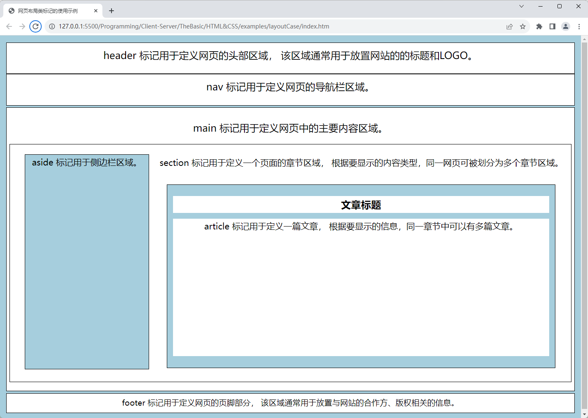

# CSS学习笔记

CSS（即Cascading Style Sheets的英文缩写，在中文里通常被译为“层叠样式表”）是一门用于为HTML或XML文档定义外观样式的计算机标记语言。对于这门语言，我们首先要了解的是，它不是一门能单独使用的计算机语言，它必须与HTML或XML这一类用于描述文档结构的标记语言一起协同工作。除此之外，它还可以配合各种脚本语言动态地对HTML或XML文档中的各元素进行格式化，对它们的位置和显示范围进行精确地控制。在这篇笔记中，我们将主要介绍在网页设计中使用的CSS语言，下面先来介绍一些基本概念。

## 基本概述

在网页设计工作中，HTML和CSS这两门标记语言有着明确的分工，HTML负责确定网页的文档结构及其要显示的内容元素，例如文本标题与段落、列表、表格、图片等（关于这方面，读者可参考我的[[HTML 学习笔记]]），而CSS则负责确定以何种外观来展现这些元素，例如，设置网页的整体布局、图文排版、交互界面等，并且这些设置一经完成就可以被反复使用。

CSS语言及其相关技术对网页设计工作的最大贡献之一，就是让设计师们得以将网页中的内容与它要呈现的方式分开。毕竟，在CSS语言出现前，设计师们在使用HTML定义网页的结构和内容时还必须要指定它们的呈现外观，如今很少用到的`<font>`、`<b>`、`<i>`等HTML标记就是那时候的产物。这些标记主要用于设置字体的颜色、背景色、大小、字形以及排列方式等。例如在HTML语法中，`<h2>`标记用于定义二级标题，它在级别上比一级标题低，比三级标题高，这些都属于是文档结构上的定义。但假如设计师要更改二级标题的颜色、字形、大小的话，在没有CSS语言的时代，他就得要使用`<font>`这样的标记了，光靠`<h2>`是不够的，因为后者只是一个用于表示文档结构的标记。例如，如果读者想让二级标题使用白底红字的斜体字，就需要这样写：

```html
<h2><font color="red" bgcolor="white"><i>二级标题</i></font></h2>
```

上面这种样式设置的方法最大的问题是，它只对当前设置的页面元素有效，因此相同的样式可能需要在同一网页中的每个二级标题元素上反复设置。考虑到同一网页中通常都会设有多个二级标题，这样做几乎一定会大大增加HTML代码的冗余度，从而导致整个网页文档变得非常臃肿和混乱，难以维护。因为如果以后想更改二级标题的样式，就必须在网页文档中找到所有用到`<h2>`+`<font>`标记的地方，然后逐一修改。

在CSS语言出现后，这些问题就迎刃而解了，因为这门标记语言及其相关的技术主张将文档的结构内容与外观样式分而治之，从而让设计师们在使用HTML时可以专注于文档结构的定义，而外观样式则专门使用CSS语言来定义。例如对于上面这个例子来说，设计师们如今只需要使用HTML的`<h2>`标记定义网页的二级标题元素，而该元素的外观样式则用CSS来定义，这样一来，上面的HTML代码就可以被简化成这样：

```html
<h2>二级标题</h2>
```

然后，设计师们只需要在对应的CSS文件中将二级标题的样式设置为白底红字的斜体字，具体代码如下：

```css
h2 {
    color: red; 
    background: white; 
    font-style: italic;
}
```

对于上述代码中使用的具体语法，我们稍后会做具体介绍。在这里，读者暂时只需要理解：由于CSS语言的出现，我们实现了HTML/XML文档的内容结构与其外观样式的解耦合。从此之后，HTML就只负责定义网页的结构与内容，则CSS负责定义网页的外观样式，包括颜色、字形、大小以及面向不同显示设备的自适应能力等。

除此之外，CSS语言的“层叠”特性还赋予了它非常灵活的使用方式。CSS代码既可以被保存为一个独立的文件，也可以被内嵌在特定的HTML文档内，网页浏览器会自行根据CSS提供的一套优先判定方法来决定网页最终的外观样式。甚至，设计师们还可以选择先针对同一份HTML/XML文档定义多份CSS代码，然后让网页浏览器根据动态脚本的设定来决定网页要使用的样式。这样一来，设计师们就可以为不同的显示设备设计不同的CSS代码了，例如，他们可以让HTML文档在计算机屏幕上的显示与其在打印机中的输出效果略有不同，以便让它在不同的设备中都能有更好的显示方式。总而言之，CSS语言赋予了设计师们更强大的设计能力。

当然了，在计算机世界中，没有任何一项技术是完美的。CSS语言虽然在网页设计工作中起着至关重要的作用，但它也存在一些缺点。下面，我们就带读者来详细了解一下这些缺点。

- **语法繁琐且极易出错**：CSS的语法相对复杂，需要对各种选择器、属性和值的组合使用进行熟悉。编写CSS代码时，一个小错误可能导致整个样式表无法正常工作。这需要开发人员具备良好的CSS知识和经验，以确保代码的正确性。

- **浏览器兼容存在差异**：不同浏览器对CSS的解析和渲染存在差异，这可能导致网页在不同浏览器上显示效果不一致。为了兼容各种浏览器，开发人员需要编写特定的CSS代码，这增加了开发的复杂性。

- **文件加载速度较慢**：当浏览器加载一个网页时，会同时加载该网页所使用的所有CSS样式表文件。如果网页中使用的CSS文件过多或文件体积较大，会导致网页加载速度变慢，影响用户体验。这需要开发人员优化CSS代码，减少文件大小和数量，以提高网页加载速度。

- **全局作用域**：CSS样式表中的样式规则是全局生效的，这意味着一个样式规则可以影响到网页中的所有元素。这种全局作用域可能导致样式冲突和难以维护的问题。为了避免这些问题，开发人员需要使用命名约定和选择器的层级关系来管理样式。

尽管CSS语言存在上述缺点，但它仍然是网页设计工作中不可或缺的工具。通过学习CSS语言，我们可以创建出具有吸引力、可维护的网页，并提供良好的用户体验。要想更好地理解CSS的设计思维，就得要了解一下这项技术是如何获得如今这种地位的，下面，我们就来具体介绍一下它的发展历程。

## 发展历程

CSS语言最初由Netscape公司发明，后来被W3C组织标准化，并最终成为W3C组织标准的一部分。下面，我们将照例为读者简单介绍一下这门计算机标记语言从无到有，并最终实现标准化的发展历程。

### 启蒙时代

正如之前所说，HTML规范中虽然规定了标题、段落等页面元素应该使用的标记，但并没有对这些元素在网页浏览器中的呈现方式做出明确的规范。因此，为了满足日益增长的万维网访问需求，各大网页浏览器在1990年代初那段时间里都各自为它们的用户提供了不同的样式表技术，然后让用户自行使用这些技术来决定网页的呈现方式。换而言之，样式表技术最初是作为浏览器的特定功能直接提供给用户，毕竟早期的HTML文档中能呈现的页面元素很少，用户完全有能力自行定制它们的外观样式。

到了1993年，罗伯特-雷施（Robert Raisch）在www-talk的邮件列表中曾经提出过一个关于通用样式表的提案，他在该提案中首次提出了一套易于被浏览器解析，且能与HTML文档一起发布的样式表编写规则。这套规则被命名为“RRP”，其定义网页样式的代码大致如下：

```rrp
@BODY fo(fa=he,si=16)
```

上面这段代码的作用是在将字体样式（`fa`，即font family）设置为`he`（即helvetica），字体大小（`si`，即font size）设置为`16`像素。现在的人一定会觉得这段代码中的语法单元过度使用了英文缩写（或者某种速记法），可读性和可维护性都很差，但在没有gzip，且平均网速只有`14.4k`的时代，尽力压缩代码的体量，以便减少样式表文件在网络传输过程中所需要的时间是非常必要的措施。RRP作为一套通用化的样式表规则，最大的问题还是缺少一个明确的尺寸单位，浏览器对代码中数字使用的单位得根据它们所在的上下文来判断（例如字体大小都以像素为单位）。这也让RRP看起来更像是“一系列指导渲染的指示或者建议”，它最大的价值是提出了让同一份样式表在命令行浏览器和图形界面浏览器中都能正常工作。另外值得一提的是，RRP并不支持如今样式表技术中的“层叠”特性，即一个HTML文档在同一时刻只能激活一个样式表。

令人遗憾的是，Mosaic浏览器在当时并没有采用这一通用化的样式表规则，而是选择了直接使用HTML提供的样式类标记（即之前提到的`<font>`、`<b>`、`<i>`等标记）。需要特别说明的是，1993年发布的这个Mosaic浏览器是万维网历史上第一个可以在网页中显示图片元素的浏览器，它也是日后大名鼎鼎的Netscape Navigator浏览器的前身。


另一方面，来自台湾的魏培源在更早些时候也开发了一款名叫“ViolaWWW”的浏览器（这款浏览器被认为是万维网历史上第一款被广泛使用的图形化界面的网页浏览器，并一度成为了Mosaic浏览器的强劲对手）。该浏览器的作者也曾经提出过一套通用的、支持嵌套式结构的样式表编写规则。这套规则被命名为PWP，其代码编写方式大致如下：

```pwp
(BODY fontSize=normal
      BGColor=white
      FGColor=black
  (H1   fontSize=largest
        BGColor=red
        FGColor=white)
)
```

上述代码的作用就是分别为`<body>`和`<h1>`标记定义的页面元素设置了字体大小、颜色与背景色。PWP的代码可读性显然比RRP好了许多，大部分开发者一眼就可以看出它与如今的CSS语法规则已经非常接近了。特别值得一提的是， PWP也是万维网历史上第一个允许HTML文档利用`<link>`标记从外部加载样式表文件的技术，这也对后来的CSS产生了深远的影响。同样令人遗憾的是，采用了这项样式表技术的ViolaWWW浏览器只能在X Window System下工作，而后者只在 Unix 系统上受欢迎。当Mosaic浏览器被成功移植到到Windows后，ViolaWWW浏览器就组件失去了竞争优势，并最终消失在了历史中。


然后到了1994年，[哈肯-维姆-莱（Håkon Wium Lie）](https://zh.wikipedia.org/wiki/%E5%93%88%E8%82%AF%C2%B7%E7%BB%B4%E5%A7%86%C2%B7%E8%8E%B1)提出层叠HTML样式表（即Cascading HTML Style Sheets，英文缩写为CHSS）。CHSS既支持用户自定义样式表，也支持网页作者样式表，而且可以满足不同规则以百分比的方式组合使用。它的权重规则计算方式不够直观，当不同规则混合时会得到什么实际效果并不容易从代码中看出。1996年，出现了与CSS语法很像的表现指明语言（Presentation Specification Language，简称"PSL 96"）。PSL 96除表达样式外，也支持条件判断等功能，还可根据对浏览器信息的判断来使用不同的样式，但未获得青睐。

### 诞生与发展

1994年，[W3C组织](https://zh.wikipedia.org/wiki/%E4%B8%87%E7%BB%B4%E7%BD%91%E8%81%94%E7%9B%9F)宣布成立，该组织一直致力于各种万维网技术的标准化，当年的主要任务之一就是制定一套通用的样式表规范。哈肯·萊和[伯特·波斯（Bert Bos）](https://zh.wikipedia.org/wiki/%E4%BC%AF%E7%89%B9%C2%B7%E6%B3%A2%E6%96%AF)是W3C的成员，他们与当时正在设计Mosaic浏览器的网景公司（Netscape）合作，共同设计出了CSS的第一个版本。哈肯·萊是Mosaic浏览器的开发者之一，而伯特·波斯是网景公司的首席技术官。在这两位的影响之下，W3C特别针对CSS的发展组织了一次讨论会。哈肯、波斯和其他一些人（比如微软的托馬斯·里尔登）是这个项目的主要技术负责人。

1996年12月，哈肯-维姆-莱与伯特·波斯发布了CSS规范的第1个版本，这一版的规范来也被哈肯·萊写进了自己的博士论文。令人遗憾的是，由于当时主流的网页浏览器所采用的内核架构完全不适合解析CSS的语法，再加上那个时候的设计师们还习惯于滥用HTML中的样式类标记（即之前提到的`<font>`等标记），且漠不关心代码校验，所以CSS语言真正流行起来还得等到若干年之后。

1998年，网页浏览器市场份额被微软公司的Internet Explorer和网景公司的Netscape Navigator两大浏览器巨头所占据。自CSS出现后，IE浏览器虽然走在了逐步实现CSS第1版标准的前列。但因为微软公司后来不重视问题修补，导致遗留Bug很多，这也使得该浏览器长期为人们诟病。而网景公司则把重心放在了网页脚本语言的开发上，但很快被微软模仿。网景在90年代末和微软展开的浏览器大战中最终一败涂地，走向破产边缘，但网景也成功推出了日后广泛流行于网页设计中的JavaScript语言。浏览器大战使得网页设计人员深受其害，因为不同浏览器支持的语法规则不太一样，网页设计人员不得不为IE浏览器和网景浏览器分别各设计一套网页。为了解决这一问题，新成立的民间设计人员团体“网页标准计划（WaSP）”开始在网络舆论场上致力于将W3C的建议宣扬为标准，并持续向还未加盟W3C标准的浏览器开发商施加压力。

事实上早在1997年初，W3C就已经组织了专门负责CSS的工作组。这个工作组充分地讨论看第1版中没有涉及到的问题，并在1998年5月出版了CSS的第2版规则。为了推广这一版标准，WaSP的7位成员成立了“CSS武士团（CSS Samurai）”，专门致力于劝说Opera浏览器和IE浏览器解决在支持CSS方面存在的诸多问题。除此之外。WaSP也积极劝说网景公司和Macromedia公司分别改进其产品对CSS标准的支持。

2003年，戴夫-谢伊（Dave Shea）推出了一个名为“CSS禅意花园（CSS Zen Garden）”的站点，向人们展示出仅通过应用不同页面样式规则，就可以实现对网页艺术风格的焕然一新。这个网站在网页设计相关人群中产生了不小影响。然后从2006年到2009年，这种“DIV+CSS”网页布局方式逐步了取代缺乏灵活性的传统表格布局，无表格网页设计成为解决网页布局问题的主流方案。虽然这一方案后来也导致了网页设计界出现了一些为了跟风而滥用`<div>`布局的情况，比如将`<h1>`和`<h2>`等本身已有语义的标签也改用`<div>`标签替代。但CSS语言在网页设计中的地位也因此得到了最终的确立，成为了网页设计师们必须掌握的核心技术。

### 标准化历程

下面，让我们用一张表格来具体地整理一下CSS语言所走过的标准化历程，及其每一版规范所添加的内容。

| 年份 | CSS版本 | 标准化组织 | 描述 |
|------|---------|-----------|------|
| 1996 | CSS 1    | W3C       | CSS 1是第一个CSS标准版本，定义了基本的样式属性和选择器。 |
| 1998 | CSS 2    | W3C       | CSS 2扩展了CSS1的功能，引入了浮动、定位、背景、字体等新特性。 |
| 2001 | CSS 2.1  | W3C       | CSS 2.1是对CSS2的修订版本，解决了一些CSS2规范中的错误和模糊之处。 |
| 2005 | CSS 3    | W3C       | CSS 3是一个模块化的标准，将CSS分为多个模块，每个模块独立发展。 |
| 2011 | CSS 4    | 无        | CSS 4并没有成为官方标准，而是将新特性分为CSS模块级别的工作草案。 |
| 2017 | CSS Grid Layout | W3C | CSS Grid Layout引入了一种新的布局方式，可以创建复杂的网格布局。 |
| 2019 | CSS Scroll Snap | W3C    | CSS Scroll Snap定义了滚动容器的分割点，使得滚动更加精确和流畅。 |
| 2021 | CSS Contain | W3C       | CSS Contain提供了一种优化CSS性能的方式，通过限制样式的影响范围。 |

在这篇笔记中，我们介绍所有的内容都将主要基于CSS 3这一版最新的官方标准来展开。该标准新增了圆角效果、渐变效果、图形化边界、文字阴影、透明度设置、多背景图设置、可定制字体、媒体查询、多列布局以及弹性盒模型布局等诸多更为丰富的新样式特性，这将有助于我们设计出更为丰富多彩的网页。

## 基本语法规则

在CSS 3标准所规范的样式定义语法中，一段完整的样式表代码通常由一系列样式规则语句组成，而每个样式规则语句的定义则主要由选择器、属性名称和属性值三个语法单元，以及在必要时才会添加的代码注释组成，其具体形式大致如下：

```css
[选择器1] {
    [属性名称1]: [属性值1];
    [属性名称2]: [属性值2];
    [属性名称3]: [属性值3];
    /* 注释：同一样式规则语句中可设置多个样式属性 */    .
    [属性名称n]: [属性值n];
}
[选择器2] {
    [属性名称1]: [属性值1];
    [属性名称2]: [属性值2];
    [属性名称3]: [属性值3];
    [属性名称n]: [属性值n];
}
/* 注释：同一CSS文件中可包含多条样式规则语句 */
[选择器n] {
    [属性名称1]: [属性值1];
    [属性名称2]: [属性值2];
    [属性名称3]: [属性值3];
    [属性名称n]: [属性值n];
}
```

下面，让我们来详细介绍一下上述语法规则中使用到的语法单元及其各自的编写方式。

### 选择器

`[选择器]`是样式规则语句的第一部分，主要作用是在HTML元素与CSS样式规则之间建立对应关系，以便对指定的HTML元素应用该选择器后面所定义的样式规则。而根据选择HTML元素的方式，CSS选择器可以被划分成几个不同的种类。只有切实地了解了这些不同种类的选择器，读者才能更容易正确得使用它们。接下来，我们先来介绍几种在网页设计工作中会用到的基本选择器。

- **基于标记名的选择器**：这种CSS选择器通常被称为*元素选择器*，主要用于匹配其关联HTML文档中的所有指定名称的标记，它的语法是最简单的，只需直接指定要匹配的标记名称即可。譬如，下面是一些元素选择器的简单示例。

    ```css
    h1 { /* 匹配文档中所有的一级标题元素 */
        color: blue;
    }
    p { /* 匹配文档中所有段落元素 */
        color: blue;
    }
    div { /* 匹配文档中所有 div 元素 */
        color: blue;
    }
    ```

- **基于id属性值的选择器**：这种CSS选择器通常被称为*ID选择器*，主要用于匹配其关联HTML文档中的所有设置了特定`id`属性值的标记，语法格式为：`#ID值`。譬如，下面是一些ID选择器的简单示例。

    ```css
    #card { /* 匹配文档中所有 id=“card” 的元素 */
        color: blue;
    }
    #user { /* 匹配文档中所有 id=“user” 的元素 */
        color: blue;
    }
    ```

- **基于class属性值的选择器**：这种CSS选择器通常被称为*类选择器*，主要用于匹配其关联HTML文档中的所有设置了特定`class`属性值的标记，语法格式为：`.类名`。譬如，下面是一些类选择器的简单示例。

    ```css
    .box { /* 匹配文档中所有 class=“box” 的元素 */
        color: blue;
    }
    .video { /* 匹配文档中所有 class=“video” 的元素 */
        color: blue;
    }
    ```

- **基于标记+属性的选择器**：这种CSS选择器通常被称为属性选择器，主要用于匹配其关联HTML文档中的包含指定属性的特定标记，语法格式为：`标记名[属性名{=属性值}]`，其中`{=属性值}`的部分可以省略。譬如，下面是一些属性选择器的简单示例。

    ```css
    /* 匹配<a title="属性值">这个标记，这里的“属性值”可是任意字符串 */
    a[title] { 
        color: blue;
    }
    /* 匹配<a href="https://example.com">这个标记 */
    a[href="https://example.com"] {
        color: blue;
    }    
    ```

- **基于标记+伪类的选择器**： 这种CSS选择器通常被称为伪类选择器，这主要是因为其用法与之前介绍的类选择器非常类似，只不过它匹配的不是明确指定了`class`属性的HTML标记，而是指定标记的某个特定状态或子结构，语法格式为：`标记名:伪类名`，其中的`伪类名`代表的就是被指定标记所定义元素的某个状态或子结构。譬如，下面是伪类选择器的一些简单示例。

    ```css
    a:hover { /* 匹配鼠标指针悬浮到超链接元素上时的状态 */
        color: blue;
    }
    a:active { /* 匹配超链接元素被激活时的状态 */
        color: blue;
    }
    a:visited { /* 匹配超链接元素被访问过的状态 */
        color: blue;
    }
    p:first-child { /* 匹配段落元素中的第一个子标记 */
        color: blue;
    }
    p:last-child { /* 匹配段落元素中的最后一个子标记 */
        color: blue;
    }
    p:nth-child(2) { /* 匹配段落元素中的第二个子标记 */
        color: blue;
    }
    p:nth-last-child(2) { /* 匹配段落元素中的倒数第二个子标记 */
        color: blue;
    }
    ```

- **基于特定标记+伪元素的选择器**：这种CSS选择器通常被称为伪元素选择器，主要用于匹配某个指定标记的某个部分而不是全部，语法格式为：`标记名::伪元素名`，其中的`伪元素名`代表的就是被指定标记中的某个特定部分。譬如，下面是伪元素选择器的一些简单示例。

    ```css
    p::first-line { /* 匹配段落元素中的第一行 */
        color: blue;
    }
    p::last-line { /* 匹配段落元素中的最后一行 */
        color: blue;
    }
    p::selection { /* 匹配用户选中或高亮显示的文本 */
        color: blue;
    }
    p::before { /* 匹配段落元素之前插入的内容 */
        content: "Hello, ";
    }
    p::after { /* 匹配段落元素之后插入的内容 */
        content: "!";
    }
    p::first-letter { /* 匹配段落元素中的第一个字母 */
        color: blue;
    }    
    ```

### 样式属性

在之前提到的CSS语法规则中，`[选择器]`以外的部分都可被称为“样式属性”，这部分通常由一对大括号包裹住的、一系列格式为`[属性名称]:[属性值]`的语句构成，下面继续来介绍一下`[属性名称]`和`[属性值]`这两个语法单元：

- **属性名称**：`[属性名称]`的作用是指定被设置样式的具体项。在CSS代码中，一段样式定义可以指定的具体项取决于`[选择器]`单元所匹配的页面元素，例如，对于`<header>`、`<nav>`这样的布局类元素来说，设计师们可以为它们设置以下常见的样式项：
  - `height`：设置页面元素的垂直高度；
  - `width`：设置页面元素的水平宽度；
  - `margin`：设置页面元素的外边距；
  - `padding`：设置页面元素的内边距；
  - `font-size`：设置页面元素中文本的字体大小；
  - `border`：设置页面元素的边框；
  - `color`：设置页面元素中文本的字体颜色；
  - `background-color`：设置页面元素的背景颜色；

- **属性值**：`[属性值]`的作用是为`[属性名称]`所指定的样式项目设置具体的值，它的取值类型和范围取决于它要设置的`[属性名称]`，例如：
  - 对于`height`、`margin`之类的、与尺寸问题相关的`[属性名称]`，它的取值就是以`px`、`em`或`%`为单位的数字；
  - 对于`background-color`这种与颜色相关的`[属性名称]`，它的取值就是Hex、RGB之类的颜色编码，或者CSS预定义的颜色名称；
  - 对于`background-image`这种与多媒体文件相关的`[属性名称]`，它的取值就是用于表示该文件所在位置的字符串；

### 代码注释

在CSS语法规则中，用于注释的语法单元通常以`/*`开始，以`*/`结束。它主要用于*在某段CSS代码的作用隐晦不明时*对其进行文字说明，以便增强代码的可读性，并不会被网页浏览器渲染。例如在之前那个用于示范布局类HTML标记的示例中，我们基于教学目的将它的CSS样式代码注释如下：[^1]

[^1]: 具体可参考本笔记文件所在目录下的`examples/layoutCase`目录中的示例。
  
```css
/* 只有`:root`伪类选择器的自定义属性可被全局使用，
 * 一般选择器的自定义属性只能在被其匹配的元素中使用
 */
:root {
    --primary-bg-color: rgb(164, 205, 223);
}

/* 为了在后续代码中顺利使用相对尺寸单位，
 *  在这里必须要先利用html根标记的选择器建立一个基准
 */
html {
    /* 将网页的基准高度设置为浏览器的视口高度*/
    height: 100%; 
    /* 将网页的基准宽度设置为浏览器的视口宽度 */
    width: 100%;
    /* 设置网页使用的默认字体大小为16个像素单位*/
    font-size: 16px;
}

/* 匹配body标签，用于定义整个网页所在区域的样式 */
body {
    /* 设置被匹配标签所在元素的高度：为网页基准高度的90% */
    height: 90%;
    /* 设置被匹配标签所在元素的背景色 */
    background-color: rgb(164, 205, 223);
    /* 设置被匹配标签所在元素的内边距 */
    padding: 1vh 0.5vw;
}

/* 匹配header标签，用于定义网页头部区域的样式 */
header {
    height: 5%;
    background-color: white;
    padding: 1.5vh;
    font-size: 1.5rem;
    text-align: center;
    border: 1px solid;
}

/* 匹配nav标签，用于定义网页导航栏区域的样式 */
nav {
    height: 5%;
    background-color: white;
    padding: 1.5vh;
    border: 1px solid;
    font-size: 1.5rem;
    text-align: center;
}

/* 匹配main标签，用于定义网页主要内容区域的样式 */
main {
    height: 80%;
    background-color: white;
    margin: 0.5vh 0;
    padding: 1vh 0.5vw;
    font-size: 1.5rem;
    border: 1px solid;
    text-align: center;
}

/* 匹配section标签，用于定义网页主体区域的样式 */
section {
    height: 85%;
    background-color: white;
    margin: 0.5vh 0vw;
    padding: 1vh 1vw;
    font-size: 1.3rem;
    border: 1px solid;
    text-align: center;
}

/* 匹配aside标签，用于定义网页侧边栏区域的样式 */
aside {
    float: left;
    height: 90%;
    width: 20%;
    background-color: rgb(164, 205, 223);
    margin: 1.5vh 1.5vw;
    padding: 0.5vh 0.5vw;
    border: 1px solid;
    font-size: 1.3rem;
    text-align: center;
}

/* 匹配article标签，用于网页中某一特定内容区域的样式 */
article {
    float: left;
    height: 70%;
    width: 70%;
    background-color: rgb(164, 205, 223);
    margin: 1.5vh 0.5vw;
    padding: 1.4vh 0.5vw;
    border: 1px solid;
    font-size: 1.3rem;
    text-align: center;
}
/* 匹配article标签下的h1标签 */
article h1 {
    background-color: white;
    margin: 1.5vh 0.5vw;
    padding: 0.5vh 0.5vw;
}
/* 匹配article标签下的p标签 */
article p {
    height: 75%;
    background-color: white;
    margin: 1.5vh 0.5vw;
    padding: 0.5vh 0.5vw;
}

/* 匹配footer标签，用于定义网页底部区域的样式 */
footer {
    height: 5%;
    background-color: white;
    padding: 1vh 0.5vw;
    border: 1px solid;
    font-size: 1.5rem;
    text-align: center;
}
```

以上就是CSS的基本语法规则，我们可以利用这套语法来创建一系列样式规则，以便完成对页面元素的外观设计。当然了，如果我们想让自己设计的结果得到更好的呈现效果，就还需要掌握CSS在HTML文档中的引入方式，并了解不同来源的样式规则对同一页面元素生效的优先顺序，以便利用好CSS的层叠特性。

## 样式层叠特性

正如之前所说，CSS的强大之处很大一部分来自于它的层叠特性。该特性允许CSS在HTML文档中可以有多种引入方式，并且同一文档可以引入多个CSS文件，同一种CSS规则可以被反复多次添加。这虽然可以让CSS的使用方式变得非常灵活，但也会导致不同样式规则之间的冲突，例如，当两种以上的样式规则对同一页面元素的外观进行设定时就会引起这种冲突。为了解决这个问题，CSS创造性地提出了一系列优先级判定方法，具体如下：

1. 特定性：特定性是用于衡量样式规则选择器的权重，以确定哪个规则更具体、更优先。特定性是由选择器中的标签名、类名、ID选择器和内联样式来确定的。特定性可以用一个四元组(a, b, c, d)来表示，其中a表示内联样式的数量，b表示ID选择器的数量，c表示类选择器、属性选择器和伪类选择器的数量，d表示元素选择器和伪元素选择器的数量。特定性的计算方式如下：

   - 对于内联样式，a的值为1。
   - 对于ID选择器，b的值为ID选择器的数量。
   - 对于类选择器、属性选择器和伪类选择器，c的值为它们的数量之和。
   - 对于元素选择器和伪元素选择器，d的值为它们的数量之和。

   特定性的比较规则是从左到右逐个比较四元组的值，较大的值表示较高的特定性。例如，特定性为(0, 1, 2, 3)的样式规则比特定性为(0, 1, 1, 4)的样式规则具有更高的优先级。举个例子，假设我们现在某CSS文件中编写了以下两个样式规则：

   ```CSS
   p {
     color: red;
   }
   #myId {
     color: blue;
   }
   ```

   如果在引入了该CSS文件的HTML文档中，某个段落元素同时被这两个样式规则的选择器匹配了的话，由于ID选择器的特定性更高，段落最终会呈现出蓝色的字体。

2. 重要性：重要性是一种特殊情况下的优先级控制方法，可以通过在样式规则中使用`!important`声明来提高样式的优先级。使用`!important`声明的样式规则具有最高的优先级，即使其他规则具有更高的特定性或来源，也会被应用于元素。举个例子，假设我们现在某CSS文件中编写了以下两个样式规则：

   ```CSS
   p {
     color: red !important;
   }
   p {
     color: blue;
   }
   ```

   如果在引入了该CSS文件的HTML文档中，某个段落元素同时被这两个样式规则的选择器匹配了的话，由于第一个规则使用了`!important`声明，所以最终的颜色将是红色。

3. 来源：来源是指样式规则的来源，包括外部样式表、内部样式表和内联样式。当多个样式规则应用于同一元素时，具有相同特定性和`!important`声明的规则将根据来源的优先级进行排序。内联样式的优先级最高，其次是内部样式表，最后是外部样式表。举个例子，假设我们现在某CSS文件中编写了以下三个样式规则：

   ```CSS
   p {
     color: red;
   }
   <style>
     p {
       color: blue;
     }
   </style>
   <link rel="stylesheet" href="styles.css">
   ```

    如果在引入了该CSS文件的HTML文档中，某个段落元素同时被这三个样式规则的选择器匹配了的话，由于内联样式的优先级最高，所以最终的颜色将是红色。

4. 顺序：当多个样式规则具有相同的特定性、来源和`!important`声明时，它们将按照在样式表中出现的顺序进行排序。后面的规则将覆盖前面的规则。举个例子，假设我们现在某CSS文件中编写了以下两个样式规则：

   ```CSS
   p {
     color: red;
   }
   p {
     color: blue;
   }

   ```

    如果在引入了该CSS文件的HTML文档中，某个段落元素同时被这两个样式规则的选择器匹配了的话，由于第二个规则在第一个规则之后出现，所以最终的颜色将是蓝色。

综上所述，CSS的优先级判定方法是通过特定性、重要性、来源和顺序等规则来确定样式规则的优先级，从而解决样式规则冲突的问题。在编写CSS样式规则时，应该注意这些规则，以确保样式规则能够正确地应用于元素。另外，上面这些方法会分层次、立体化地决定不同CSS样式规则之间的生效顺序，从而实现样式设置的叠加效果，这就是我们之前所说的层叠特性。具体来说，这一特性主要包含以下几个方面：

1. 特定性的概念：特定性是用于衡量样式规则选择器的权重，以确定哪个规则更具体、更优先。特定性的计算方式基于选择器中的标签名、类名、ID选择器和内联样式。可以使用以下规则来计算特定性：
   - 对于每个选择器，给予一个特定性值，其中ID选择器的特定性值最高，类选择器和属性选择器次之，标签选择器的特定性值最低。
   - 对于每个选择器，将特定性值组合成一个特定性计数，例如，ID选择器的计数为（0, 1, 0, 0），类选择器的计数为（0, 0, 1, 0），标签选择器的计数为（0, 0, 0, 1）。
   - 比较特定性计数，特定性计数较高的规则将具有更高的优先级。

2. 继承的影响：在层叠特性中，还应该提及继承的影响。CSS中的某些属性具有继承性，即它们会从父元素传递给子元素。当多个样式规则应用于同一元素时，继承属性的值可能会受到其他样式规则的影响。这意味着，即使没有直接为子元素指定样式规则，它们仍然可能继承父元素的样式。

3. 重要性规则：CSS中还存在一种重要性规则，可以通过在样式规则中使用!important声明来提高样式的优先级。这是一种特殊情况下的优先级控制方法，应该在描述优先级判定方法时提及。然而，应该谨慎使用!important声明，因为滥用它可能导致样式难以维护和调试。

4. 外部样式表和内联样式：在描述引入方式时，可以提及外部样式表和内联样式的区别。外部样式表是通过`<link>`标签引入的独立CSS文件，可以在多个HTML文件中共享样式规则，使得样式的管理更加方便。内联样式是直接在HTML元素的style属性中定义的样式，适用于仅对特定元素应用样式的情况。内联样式的优先级较高，会覆盖外部样式表中的相同属性。

总而言之，在掌握了CSS的层叠特性之后，网页设计师们就可以轻松地解决样式规则冲突的问题，从而避免了样式设置过程中可能出现的混乱。这意味着他们可以使用不同的、可相互叠加的CSS样式规则来控制元素的外观，从而设计出更为复杂、精致且具有交互性的网页。

## 样式设计基础

在设计网页样式的过程中，设计师们很大一部分的工作都与尺寸、定位和色彩这三个基础概念有关，因为这三个概念涉及到他们将如何在计算机中描述网页的样式，后者将直接影响到诸如网页整体布局、图文信息排版以及用户交互界面等网页设计问题的解决方案。所以，在正式讨论这些解决方案之前，我们很有必要先详细地了解一下在样式设计工作中会用到的基础知识。

### 元素盒模型

在使用CSS进行样式设计时，设计师们通常会将HTML文档中的每个元素都视为一个矩形盒子，这个盒子通常被称为CSS的元素盒模型。该盒模型是CSS样式设计中最重要的概念之一，设计师们需要通过它来定义网页中每个元素的外观样式，包括元素的高度、宽度、位置以及与周围其他元素之间的关系。因此，元素的盒模型也被认为是在学习网页设计的过程中必须要掌握的一个基础概念。我们在这里也将先从这个概念开始介绍完成网页样式设计工作所需要掌握的基础知识。下面，先请读者来看一下这个盒模型的示意图：


正如读者所见，CSS的元素盒模型主要由内容区、内边距、边框和外边距四个部分组成，它们相互作用，共同决定了元素在HTML文档中最终呈现的外观样式。接下来，让我们来详细地介绍一下这四个部分。

1. **内容区**：这一部分位于盒模型的中央区域，是页面元素中用于显示实际内容的地方，其中通常会保护文本、图像或其他嵌套元素，我们对内容区的样式设置主要包括以下内容：
   - 区域的大小：在CSS中，我们会通过`width`和`height`这两个属性来设置该区域的宽度和高度。
   - 区域的背景：在CSS中，区域背景的样式主要通过`background-color`和`background-image`这两个属性来设置。前者设置的是区域背景的填充颜色，而后者设置的则是区域背景的图片。

    例如，如果我们希望一个`class="box"`的元素有一个宽度为`200px`、高度为`100px`的内容区，并且背景颜色填充为红色，那么就可以为该元素编写如下CSS样式：

   ```css
   .box {
     width: 200px;
     height: 100px;
     background-color: red;
   }
   ```

2. **内边距**：这一部分位于内容区与边框之间，它的主要作用是在元素的内容区与其边框之间填充一定的空白间隔，这样做通常会有助于网页的布局效果和整体美观。在CSS中，我们一般会通过`padding`这个属性来设置元素的内边距，该属性的值通常由4个尺寸值来决定，分别用于指定元素在上、右、下、左四个方向的内边距，例如像这样：

   ```css
   .box {
        padding: 10px 15px 10px 15px;
   }
   ```

   在上述代码中，我们为`class="box"`的元素设置了`10px`的上、下内边距、`15px`的左、右内边距。当然了，如果上下内边距的值相同，左右内边距的值也相同，那么我们也可以将`padding`属性的值简写为两个尺寸值，分别用于指定元素的上下内边距与左右边距，例如在这里，我们可以将上面的代码简写成这样：

   ```css
   .box {
        padding: 10px 15px;
   }
   ```

   同样的，如果一个元素在上、下、左、右四个方向上均设置了相同的内边距，那么我们也可以将`padding`属性的值简写为单个的尺寸值，例如，如果某个元素在每个方向上的内边距都是`10px`，那么我们可以这样编写CSS样式：

   ```css
   .box {
        padding: 10px;
   }
   ```

   另外在某些特定情况下，我们也会通过`padding-top`、`padding-right`、`padding-bottom`和`padding-left`这4个属性单独设置元素的上、右、下、左四个方向的内边距，例如像这样：

   ```css
   .box {
        padding-top: 10px;
        padding-right: 15px;
        padding-bottom: 10px;
        padding-left: 15px;
   }
   ```

   在上述代码中，我们用4个样式属性分别为`class="box"`的元素设置了四个方向的内边距，其中，`padding-top`属性用于设置上内边距，`padding-right`属性用于设置右内边距，`padding-bottom`属性用于设置下内边距，`padding-left`属性用于设置左内边距。需要注意的是，在CSS中，如果某个元素的某个方向的内边距的值设置为`0px`，那么该元素的该方向的内边距将不起作用，也就是说，如果某个元素的上内边距的值设置为`0px`，那么该元素的上内边距将消失，其内容会直接贴着上边框。

3. **边框**：这一部分指的是元素所在区域的边界线。在CSS中，我们可以通过`border`属性来设置边框的样式，该属性的值通常包括四个方向的边框样式、宽度、颜色，例如，如果我们想为元素设置一个宽度为`1px`、线条样式为`solid`、颜色为`#ccc`的边框，那么我们可以这样编写CSS样式：

   ```css
   .box {
        border: 1px solid #ccc;
   }
   ```

   在某些特情况下，我们也可以通过`border-width`、`border-color`和`border-style`这3个属性分别设置边框宽度、颜色和样式，例如对于上述代码，我们也可以将其修改为：

    ```css
    .box {
        border-width: 1px;
        border-color: #ccc;
        border-style: solid;
    }
    ```

    另外，元素的边框样式和内边距一样，也可以分不同的方向来进行分别设置。换而言之，我们也可以通过`border-top`、`border-right`、`border-bottom`和`border-left`这4个属性单独设置元素的上、右、下、左四个方向上的边框，例如，如果我们只想为`class="box"`的元素设置一个宽度为`1px`、线条样式为`solid`、颜色为`#ccc`的上边框，那么我们可以这样编写CSS样式：

    ```css
    .box {
        border-top: 1px solid #ccc;
    }
    ```

    如果我们希望边框的四个角上都带有圆角效果，那么我们可以通过`border-radius`属性来设置，例如，如果我们想为`class="box"`的元素设置一个宽度为`10px`、颜色为`#ccc`的圆角边框，那么我们可以这样编写CSS样式：

    ```css
    .box {
        /*
            border-radius 属性可以接受一个或两个参数，
            如果只设置一个参数，则表示设置四个角的圆角半径，
            如果设置两个参数，则第一个参数表示左上角和右下角，
            第二个参数表示右上角和左下角。
        */
        border-radius: 10px;
        border: 1px solid #ccc;
    }
    ```

    如果希望为边框添加阴影效果，也可以通过`box-shadow`属性来设置，例如，如果我们想为`class="box"`的元素添加一个宽度为`1px`、颜色为`#ccc`的阴影，那么我们可以这样编写CSS样式：

    ```css
    .box {
        /*
            box-shadow 属性可以接受一个或多个参数，每个参数由逗号分隔，
            每个参数由 x-offset、y-offset、blur 和 color 这4个参数组成，
            其中 x-offset 和 y-offset 分别表示阴影的水平偏移量和垂直偏移量，
            blur 表示阴影模糊半径，color 表示阴影的颜色。
        */
        box-shadow: 1px 1px #ccc;
    }
    ```

4. **外边距**：这一部分位于元素的边框与相邻元素边框之间，通常用来控制元素之间的间距。在CSS中，我们可以通过`margin`属性来设置外边距，设置方法与内边距基本相同，该属性的值也由4个尺寸值构成，分别表示上、右、下、左的外边距，例如像这样：

   ```css
   .box {
        margin: 10px 14px 10px 14px;
   }
   ```

   在上述代码中，我们为`class="box"`的元素设置了`10px`的上、下外边距、`14px`的左、右外边距。同样的，如果上下外边距的值相同，左右外边距的值也相同，那么我们也可以将`padding`属性的值简写为两个尺寸值，分别用于指定元素的上下与左右的外边距，例如在这里，我们可以将上面的代码简写成这样：

   ```css
   .box {
        margin: 10px 14px;
   }
   ```

   同样的，如果一个元素在上、下、左、右四个方向上均设置了相同的内边距，那么我们也可以将`margin`属性的值简写为单个的尺寸值，例如，如果某个元素在每个方向上的外边距都是`14px`，那么我们可以这样编写CSS样式：

   ```css
   .box {
        margin: 14px;
   }
   ```

   另外在某些特定情况下，我们也会通过`margin-top`、`margin-right`、`margin-bottom`和`margin-left`这4个属性单独设置元素的上、右、下、左四个方向的外边距，例如像这样：

   ```css
   .box {
        margin-top: 10px;
        margin-right: 14px;
        margin-bottom: 10px;
        margin-left: 14px;
   }
   ```

需要再次强调的是，正确理解元素的盒模型对于网页设计工作来说是非常重要的，因为它们会深度地影响到元素在网页中的具体位置与外观样式。例如，通过调整内边距和外边距的大小，可以控制元素之间的间距和对齐方式。通过设置边框的样式和颜色，可以为元素添加装饰效果。通过设置内容区域的大小，可以控制元素的宽度和高度。下面，我们可以通过一个简单示例来让读者直观地感受一下CSS盒模型在网页中所呈现的样子，为此，我们需要执行以下操作：

1. 创建一个HTML文档，然后在文档中创建一个`<div class="box">`元素，并为其设置宽度、高度、内边距、边框、外边距和背景颜色：

    ```html
    <!DOCTYPE html>
    <html>
        <head>
            <style>
                .box {
                    width: 200px;
                    height: 100px;
                    background-color: #f1f1f1;
                    padding: 10px;
                    border: 1px solid #ccc;
                    margin: 14px;
                }
            </style>
        </head>
        <body>
            <div class="box">
                This is a box.
            </div>
        </body>
    </html>
    ```

2. 打开Google Chrome浏览器，并访问该HTML文档，此时，我们就可以看到一个带有灰色背景的盒子，其宽度为200像素，高度为100像素，内边距为10像素，边框为1像素的实线，外边距为14像素，并显示了“This is a box.”这一文本，如下图所示：

    

### 尺寸设置

在这一小节中，让我们来了解与尺寸相关的概念和计量单位，这些知识在网页布局、图文排版等问题中将会起到关键作用，其重要性就相当于画家在开始作画时使用的各种标尺。下面就先来具体介绍一些基本概念：

1. **像素**：这一概念是计算机显示设备中的基本度量单位，这一单位最初来自于计算机显示设备上可显示的物理光源。换而言之，在与计算机显示设备相关的领域中，一个像素就代表一个显示单元，像素的大小很大程度上代表了设备的分辨率。
2. **分辨率**：这一概念主要用于量化显示设备（如计算机显示屏、手机屏幕等）所显示图像的精细程度，它的具体表达形式是`[水平分辨率]x[垂直分辨率]`。其中，`[水平分辨率]`是显示设备在水平方向上可显示的像素单位，而`[垂直分辨率]`则是它在垂直方向上可显示的像素单位。例如，如果某个显示设备在水平方向上可显示1920个像素单位，在垂直方向上可显示1080个像素单位，那么该设备的分辨率就可以被表示为`1920x1080`。
3. **视口**：视口这一概念主要指的是用户在网页浏览器中看到的有效可视区域，即浏览器窗口中刨除菜单栏、工具栏、侧边栏等软件本身的界面元素之外，真正用于显示网页内容的那个区域。每个浏览器都有自己不同的有效可视区域。在网页设计工作中，设计师们需要根据这些不同的视口尺寸来进行网页设计工作，以确保网页中显示的内容在各种视口尺寸上都能适应良好。
4. **布局尺寸**：这一尺寸概念主要用于确定网页中各个元素的相对尺寸和位置，其中的设置对象包括布局元素、文本标题与段落、图像、视频播放器等。在CSS代码中，设计师们通常会使用相对长度单位来设置这些元素在不同设备屏幕上的尺寸，以提高它们的适应性。
5. **字体尺寸**：这一尺寸概念主要用于确定字体在网页中的大小。在CSS代码中，设计师们通常使用相对长度单位来设置合适的字体大小，以确保网在不同设备屏幕上的可读性。
6. **内外边距尺寸**：这一尺寸概念主要用于设置网页中各元素内侧与外围的空白区域。在网页设计工作中，设计师们通常需要确保网页中存在着一些合理的空白区域，以提升网页的布局效果及其可读性。
7. **图像的尺寸及分辨率**：这一尺寸概念对于确保网页中的图像能适应不同的设备屏幕是至关重要的。在网页设计工作中，设计师们通常会使用响应式图像完成网页中与图像有关的设计，本书将会在下一章的项目中具体演示这部分知识的应用。

只要能综合利用好上述概念，网页设计师们就可以设计出能适应不同显示设备的网页，确保这些网页在多种设备与网页浏览器上都能够呈现出符合设计意图的视觉效果。为了能更好地实现这一目的，本书在这里建议读者尽可能使用以下相对长度单位来设置网页中的尺寸。

- `px`：这是CSS代码中使用的像素单位，它既不是一个确定的物理量，也不是一个点或者小方块，而是一个抽象概念，因此在CSS代码中使用像素概念时务必要考它具体的运行环境。默认情况下，一个CSS像素应该等于一个物理像素的宽度。但在一些像素密度较高的显示设备上，一个CSS像素单位也有可能相当于多个物理像素的尺寸；
- `em`: 这是CSS代码中基于网页浏览器中默认字体高度的相对尺寸单位，由于目前主流网页浏览器的默认字体高度为`16px`，所以通常可以认为`1em`等于`16px`；
- `rem`：这是CSS代码中基于当前网页根元素（即`<html>`标记对应的元素）的字体高度来使用的相对尺寸单位。当然，在使用该尺寸单位之前，设计师们必须先确当前网页的根元素对字体高度做了明确的设置；
- `%`：这是CSS代码中当前元素相对于其外层元素的尺度单位，通常用于设置网页中布局尺寸的设计，当然了，在对当前元素使用这个尺度单位之前，设计师们必须先确保其外层元素的相关尺寸已经得到了明确的设置；
- `vm`：这是CSS代码中相对于浏览器视窗宽度的尺度单位，换而言之，`1vw`等于浏览器视窗宽度的`1%`;
- `vh`：这是CSS代码中相对于浏览器视窗高度的尺度单位，换而言之，`1vw`等于浏览器视窗高度的`1%`;

### 元素定位

元素定位是CSS中非常重要的概念，它允许我们对网页中的元素进行精确的布局和定位。在进行样式设计的过程中，设计师们需要掌握相对定位、绝对定位和固定定位这三种常用的定位方式。本教程将详细介绍这三种定位方式的语法、特点和使用场景，帮助读者全面理解元素定位的原理和应用。

1. **相对定位**：相对定位是CSS中最常用的定位方式之一。它能够使元素相对于其正常位置进行偏移，但不会改变元素在网页中的位置。相对定位的语法格式如下：

    ```css
    /* 设置元素相对定位 */
    position: relative;
    ```

    相对定位的元素不会脱离文档流，因此其正常位置不会被改变。相对定位的元素会根据其自身的位置进行偏移，但不会改变元素在网页中的位置。我们可以通过设置`top`、`right`、`bottom`和`left`属性来控制元素的偏移量。例如：

    ```css
    /* 设置元素相对定位，并向下偏移20像素 */
    position: relative;
    top: 20px;
    ```

    相对定位常用于微调元素的位置，例如在网页布局中，我们可以使用相对定位将一个元素相对于其正常位置向下或向右偏移一定距离。

2. **绝对定位**：绝对定位是CSS中的另一种常用定位方式。它能够使元素相对于其包含块进行偏移，但不会改变元素在网页中的位置。绝对定位的语法格式如下：

    ```css
    /* 设置元素绝对定位 */
    position: absolute;
    ```

    绝对定位的元素会脱离文档流，因此其正常位置会被改变。绝对定位的元素会根据其包含块的位置进行偏移，但不会改变元素在网页中的位置。我们可以通过设置`top`、`right`、`bottom`和`left`属性来控制元素相对于包含块的偏移量。例如：

    ```css
    /* 设置元素绝对定位，并相对于包含块向右偏移50像素 */
    position: absolute;
    left: 50px;
    ```

    绝对定位常用于创建浮动元素、实现图像轮播等特殊效果。通过设置元素的绝对定位，我们可以将其放置在网页的任意位置，不受其他元素的影响。

3. **固定定位**：固定定位是CSS中的另一种常用定位方式。它能够使元素相对于浏览器视窗进行偏移，但不会改变元素在网页中的位置。固定定位的语法格式如下：

    ```css
    /* 设置元素固定定位 */
    position: fixed;
    ```

    固定定位的元素会脱离文档流，因此其正常位置会被改变。固定定位的元素会根据浏览器视窗的位置进行偏移，但不会改变元素在网页中的位置。我们可以通过设置`top`、`right`、`bottom`和`left`属性来控制元素相对于视窗的偏移量。例如：

    ```css
    /* 设置元素固定定位，并相对于视窗向下偏移100像素 */
    position: fixed;
    top: 100px;
    ```

    固定定位常用于创建悬浮菜单、回到顶部按钮等需要始终显示在浏览器窗口特定位置的元素。

另外，在使用定位时，还需要了解定位元素的层叠顺序。层叠顺序决定了元素在网页中的显示顺序，具有较高层叠顺序的元素会覆盖具有较低层叠顺序的元素。一般情况下，后面出现的元素会覆盖前面出现的元素。但是，通过设置`z-index`属性，我们可以改变元素的层叠顺序。`z-index`属性的值越大，元素的层叠顺序越高。例如：

```css
/* 设置元素的层叠顺序为2 */
z-index: 2;
```

通过合理设置`z-index`属性，我们可以控制元素在网页中的显示顺序，实现更复杂的布局效果。

在这一小节中，我们详细介绍了CSS中的三种元素定位方式：相对定位、绝对定位和固定定位。相对定位使元素相对于其正常位置进行偏移，不会改变元素在网页中的位置；绝对定位使元素相对于其包含块进行偏移，不会改变元素在网页中的位置；固定定位使元素相对于浏览器视窗进行偏移，不会改变元素在网页中的位置。通过合理使用这三种定位方式，我们可以实现网页中元素的精确布局和定位。同时，我们还介绍了定位元素的层叠顺序，通过设置`z-index`属性，我们可以改变元素的层叠顺序，实现更复杂的布局效果。掌握元素定位的原理和应用，对于进行网页布局和设计非常重要。

### 颜色编码

在描述网页的配色方案时，设计师们的主要任务是将方案编写成CSS样式代码。在这个任务中，设计师们需要将配色方案中的每个颜色进行编码，以便能被计算机及其软件识别并渲染在显示设备中。所以在接下来的这一小节中，我们将会为读者介绍几种在CSS样式代码中常见的颜色编码方式：

1. **RGB**：RGB是一种将红色、绿色和蓝色组合在一起来表示颜色的方法。每个颜色通道的取值范围是0到255，其中0表示没有颜色，255表示最大强度的颜色。通过调整三个通道的数值，可以创建各种不同的颜色。例如，纯红色可以表示为RGB(255, 0, 0)。
2. **Hex**：即十六进制颜色代码，这是一种使用六个字符（0-9和A-F）来表示颜色的方法。每个字符对应于RGB通道的强度值。前两个字符表示红色通道，中间两个字符表示绿色通道，最后两个字符表示蓝色通道。例如，纯红色可以表示为#FF0000。
3. **HSL**：HSL是一种使用色相、饱和度和亮度三个参数来表示颜色的方法。色相表示颜色在色轮上的位置，取值范围是0到360度。饱和度表示颜色的纯度或灰度程度，取值范围是0%到100%。亮度表示颜色的明亮程度，取值范围是0%到100%。通过调整这三个参数的值，可以创建各种不同的颜色。
4. **RGBA**：RGBA是一种与RGB类似的表示颜色的方法，但多了一个透明度通道。透明度通道的取值范围是0到1，其中0表示完全透明，1表示完全不透明。RGBA可以用于创建具有不同透明度的颜色，使得网页元素可以显示出层次感和透明效果。

值得特别注意的是，由于CSS本身为用户提供了一系列预定义了名称的颜色，我们在这里会更倾向于建议读者在使用自定义的颜色编码之前，最好先查看一下该颜色编码是否已经存在于下面的预定义颜色表中，以避免重复发明轮子，浪费了自己宝贵的时间。

| 颜色名称   | 颜色值       | 颜色名称   | 颜色值       | 颜色名称   | 颜色值       |
| ----------- | ------------ | ----------- | ------------ | ----------- |---------- |
| AliceBlue   | #F0F8FF      | AntiqueWhite| #FAEBD7      | Aqua        | #00FFFF      |
| Aquamarine  | #7FFFD4      | Azure       | #F0FFFF      | Beige       | #F5F5DC      |
| Bisque      | #FFE4C4      | Black       | #000000      | BlanchedAlmond | #FFEBCD   |
| Blue        | #0000FF      | BlueViolet  | #8A2BE2      | Brown       | #A52A2A      |
| BurlyWood   | #DEB887      | CadetBlue   | #5F9EA0      | Chartreuse  | #7FFF00      |
| Chocolate   | #D2691E      | Coral       | #FF7F50      | CornflowerBlue | #6495ED   |
| Cornsilk    | #FFF8DC      | Crimson     | #DC143C      | Cyan        | #00FFFF      |
| DarkBlue    | #00008B      | DarkCyan    | #008B8B      | DarkGoldenRod | #B8860B   |
| DarkGray    | #A9A9A9      | DarkGreen   | #006400      | DarkKhaki   | #BDB76B      |
| DarkMagenta | #8B008B      | DarkOliveGreen | #556B2F   | DarkOrange  | #FF8C00      |
| DarkOrchid  | #9932CC      | DarkRed     | #8B0000      | DarkSalmon  | #E9967A      |
| DarkSeaGreen | #8FBC8F    | DarkSlateBlue | #483D8B    | DarkSlateGray | #2F4F4F    |
| DarkTurquoise | #00CED1    | DarkViolet  | #9400D3      | DeepPink    | #FF1493      |
| DeepSkyBlue | #00BFFF      | DimGray     | #696969      | DodgerBlue  | #1E90FF      |
| FireBrick   | #B22222      | FloralWhite | #FFFAF0      | ForestGreen | #228B22      |
| Fuchsia     | #FF00FF      | Gainsboro   | #DCDCDC      | GhostWhite  | #F8F8FF      |
| Gold        | #FFD700      | GoldenRod   | #DAA520      | Gray        | #808080      |
| Green       | #008000      | GreenYellow | #ADFF2F      | HoneyDew    | #F0FFF0      |
| HotPink     | #FF69B4      | IndianRed   | #CD5C5C      | Indigo      | #4B0082      |
| Ivory       | #FFFFF0      | Khaki       | #F0E68C      | Lavender    | #E6E6FA      |
| LavenderBlush | #FFF0F5    | LawnGreen   | #7CFC00      | LemonChiffon | #FFFACD    |
| LightBlue   | #ADD8E6      | LightCoral  | #F08080      | LightCyan   | #E0FFFF      |
| LightGoldenRodYellow | #FAFAD2 | LightGray   | #D3D3D3      | LightGreen  | #90EE90      |
| LightPink   | #FFB6C1      | LightSalmon | #FFA07A      | LightSeaGreen | #20B2AA    |
| LightSkyBlue | #87CEFA     | LightSlateGray | #778899   | LightSteelBlue | #B0C4DE   |
| LightYellow | #FFFFE0      | Lime        | #00FF00      | LimeGreen   | #32CD32      |
| Linen       | #FAF0E6      | Magenta     | #FF00FF      | Maroon      | #800000      |
| MediumAquaMarine | #66CDAA | MediumBlue  | #0000CD      | MediumOrchid | #BA55D3    |
| MediumPurple | #9370DB     | MediumSeaGreen | #3CB371   | MediumSlateBlue | #7B68EE   |
| MediumSpringGreen | #00FA9A | MediumTurquoise | #48D1CC  | MediumVioletRed | #C71585  |
| MidnightBlue | #191970    | MintCream   | #F5FFFA      | MistyRose   | #FFE4E1      |
| Moccasin    | #FFE4B5      | NavajoWhite | #FFDEAD      | Navy        | #000080      |
| OldLace     | #FDF5E6      | Olive       | #808000      | OliveDrab   | #6B8E23      |
| Orange      | #FFA500      | OrangeRed   | #FF4500      | Orchid      | #DA70D6      |
| PaleGoldenRod | #EEE8AA   | PaleGreen   | #98FB98      | PaleTurquoise | #AFEEEE    |
| PaleVioletRed | #DB7093   | PapayaWhip  | #FFEFD5      | PeachPuff   | #FFDAB9      |
| Peru        | #CD853F      | Pink        | #FFC0CB      | Plum        | #DDA0DD      |
| PowderBlue  | #B0E0E6      | Purple      | #800080      | RebeccaPurple | #663399    |
| Red         | #FF0000      | RosyBrown   | #BC8F8F      | RoyalBlue   | #4169E1      |
| SaddleBrown | #8B4513      | Salmon      | #FA8072      | SandyBrown  | #F4A460      |
| SeaGreen    | #2E8B57      | SeaShell    | #FFF5EE      | Sienna      | #A0522D      |
| Silver      | #C0C0C0      | SkyBlue     | #87CEEB      | SlateBlue   | #6A5ACD      |
| SlateGray   | #708090      | Snow        | #FFFAFA      | SpringGreen | #00FF7F      |
| SteelBlue   | #4682B4      | Tan         |

在实际项目实践中，设计师常常会根据自己的偏好和项目的具体需求来搭配使用上面这些颜色表述方法，以便设计出可文档化的网页配色方案，比如使用RGB或Hex代码来表示颜色，同时使用HSL来调整颜色的亮度和饱和度。

## 要解决的问题

在网页设计过程中，网页的整体布局安排、配色方案的设计、图文信息的排版、用户交互类元素在网页上的具体位置以及这些元素彼此之间的距离都是设计师们几乎一定会遇到的问题。在这一节中，我们将逐一为读者介绍这些问题的解决方案，以及这些方案所体现出来的CSS设计思维。下面，让我们从网页设计工作中首先要解决的整体布局问题开始。

### 网页整体布局

在网页设计工作中，页面的整体布局安排是设计师们首先要解决的一个关键问题，因为这直接关系到布局类元素、图文类元素、用户交互类元素在网页上的具体位置与呈现范围，以及这些元素彼此之间的距离。

#### PC端的网页布局

在PC端，显示设备的大小相对来说是较为固定的，因此设计师们可以较为放心的对网页进行整体布局，比如将网页分为头部、主体、底部三个部分，再对每个部分进行进一步的划分，比如头部可以分为导航栏、logo、搜索栏等，主体部分可以分为内容区、侧边栏等。底部则可以分为版权声明、页脚等。在这一节中，我们将通过模拟一个简单的页面设计过程来为读者介绍如何在面向PC端的网页设计工作中使用CSS语言。在通常情况下，我们在PC端创建一个网页时大致会执行以下步骤：

1. 先创建一个HTML文档，并用HTML 5提供的布局类标记定义好网页的文档结构和内容元素，我们在《[[HTML 学习笔记]]》一文中曾经示范过这些标记的使用方法，该示例的具体代码如下：

   ```html
   <!DOCTYPE html>
    <html lang="zh-CN">
        <head>
            <link rel="stylesheet" href="./styles/main.css">
            <title>网页布局类标记的使用示例</title>
        </head>
        <body>
            <header>
                header 标记用于定义网页的头部区域，
                该区域通常用于放置网站的的标题和LOGO。
            </header>
            <nav>nav 标记用于定义网页的导航栏区域。</nav>
            <main>
                <p>main 标记用于定义网页中的主要内容区域。</p> 
                <section>
                    <aside>aside 标记用于侧边栏区域。</aside>
                    <p>
                        section 标记用于定义一个页面的章节区域，
                        根据要显示的内容类型，同一网页可被划分为多个章节区域。
                    </p>
                    <article>
                        <!-- 定义文章标题的标记，h1-h6 -->
                        <h1>文章标题</h1>
                        <!--定义文章段落的标记 -->
                        <p>article 标记用于定义一篇文章，
                            根据要显示的信息，同一章节中可以有多篇文章。
                            </p>
                    </article>
                </section>
            </main>
            <footer>
                footer 标记用于定义网页的页脚部分，
                该区域通常用于放置与网站的合作方、版权相关的信息。
            </footer>
        </body>
    </html>
   ```

2. 现在，我们要做的就是基于上述HTML文档中定义的页面元素来依次定义它们的样式，首先是`<body>`标记所定义的网页主体区域的样式，我们在这里可以定义一些适用于整个页面的通用样式，例如像这样:

   ```css
    /* 匹配body标签，用于定义整个网页所在区域的样式 */
    body {
        /* 设置网页使用的默认字体 */
        font-family: "Microsoft Yahei", Helvetica, Arial, sans-serif;
        font-size: 16px;
        /* 设置网页使用的主背景色并将其保存为变量 */
        --primary-bg-color: rgb(164, 205, 223);
        background-color: var(--primary-bg-color);
        /* 设置被匹配标签所在元素的内边距 */
        padding: 1vh 0.5vw;
    }
   ```

3. 在设置完全局样式之后，接下来就可以开始设置`<header>`标记所定义的头部区域的样式了，我们在这里可以为它编写如下样式：

   ```css
    /* 匹配header标签，用于定义网页头部区域的样式 */
    header {
        height: 5vh;
        background-color: white;
        padding: 1.5vh;
        font-size: 1.5rem;
        text-align: center;
        border: 1px solid;
    }
   ```

4. 再接下来要做的是定义`<nav>`标记所定义的导航栏的样式，在这里我们可以为它编写如下样式：

   ```css
    /* 匹配nav标签，用于定义网页导航栏区域的样式 */
    nav {
        height: 5vh;
        background-color: white;
        padding: 1.5vh;
        border: 1px solid;
        font-size: 1.5rem;
        text-align: center;
    }
   ```

5. 接着，就轮到由`<main>`标记所定义的网页主体区域及其内部元素的样式了，这里包括网页中的各个分区域、侧边栏区域、文章区域（包括标题与段落）等元素，我们在这里可以为它编写如下样式：

   ```css
    /* 匹配main标签，用于定义网页主要内容区域的样式 */
    main {
        height: 72vh;
        background-color: white;
        margin: 0.5vh 0;
        padding: 1vh 0.5vw;
        font-size: 1.5rem;
        border: 1px solid;
        text-align: center;
    }

    /* 匹配section标签，用于定义网页中各个分区域的样式 */
    section {
        height: 60vh;
        background-color: white;
        margin: 0.5vh 0vw;
        padding: 1vh 1vw;
        font-size: 1.3rem;
        border: 1px solid;
        text-align: center;
    }

    /* 匹配aside标签，用于定义网页侧边栏区域的样式 */
    aside {
        float: left;
        height: 55vh;
        width: 20vw;
        background-color: var(--primary-bg-color);
        margin: 1.5vh 1.5vw;
        padding: 0.5vh 0.5vw;
        border: 1px solid;
        font-size: 1.3rem;
        text-align: center;
    }

    /* 匹配article标签，用于网页中某一特定内容区域的样式 */
    article {
        float: left;
        height: 45vh;
        width: 65vw;
        background-color: var(--primary-bg-color);
        margin: 2vh 1.5vw;
        padding: 1.4vh 0.5vw;
        border: 1px solid;
        font-size: 1.3rem;
        text-align: center;
    }
    /* 匹配article标签下的h1标签 */
    article h1 {
        background-color: white;
        margin: 1.5vh 0.5vw;
        padding: 0.5vh 0.5vw;
    }
    /* 匹配article标签下的p标签 */
    article p {
        height: 35vh;
        background-color: white;
        margin: 1.5vh 0.5vw;
        padding: 0.5vh 0.5vw;
    }
    ```

6. 最后，让我们来定义一下`<footer>`标记所定义的网页页脚区域样式，在这里我们可以为它编写如下样式：

   ```css
    /* 匹配footer标签，用于定义网页底部区域的样式 */
    footer {
        height: 3vh;
        background-color: white;
        padding: 1vh 0.5vw;
        border: 1px solid;
        font-size: 1.2rem;
        text-align: center;
    }
   ```

7. 在将上述HTML+CSS代码保存为相应类型的文件之后（这些代码被保存在本笔记文件所在目录下的`examples/layoutCase/styles`目录中），就可以在用网页浏览器中打开这个网页时看到如下图所示的布局效果。

    

从上述示例的效果图中可以看出，在CSS的视角下，网页的外观样式模型主要由一系列元素盒子组成，这些盒子之间有些是相互包裹的上下层关系，有些则是属于同一层级的横向或纵向排列关系。设计师们在设计网页的整体布局时要思考的问题主要是：

1. 如何基于元素的盒模型概念设置好它们的内外边距（并在必要时设置边框）。
2. 如何基于网页要显示的内容让这些元素盒子以合适的大小显示在合适的位置上。

#### 移动端的网页布局

在为移动端设备设计网页时，设计师们需要更进一步考虑如何让网页动态适配各种大小不一的显示设备。正如读者所知，Apple、Google、三星以及华为等各大移动设备制造商如今在设备屏幕上的设计方案可谓是八仙过海、各显神通，且不说不同设备制造商之间产品的屏幕参数各不相同，就连出自同一设备制造商在每一年推出同品牌同系列的产品时的屏幕设计方案也都会存在些许差异。例如在下表中，我们可以看到当前一些主流品牌系列的手机屏幕情况：[^2]

| 设备名称                       | 操作系统 | 尺寸 (英寸) | 纵横比   | 分辨率（px）    |
| ------------------------------ | -------- | ----------- | -------- | -------- |
| iPhone 12 Pro Max              | iOS      | 6.7         | 19 : 9   | 1284 x 2778    |
| iPhone 12 Pro                  | iOS      | 6.1         | 19 : 9   | 1170 x 2532    |
| iPhone 12 Mini                 | iOS      | 5.4         | 19 : 9   | 1080 x 2340    |
| iPhone 11 Pro                  | iOS      | 5.8         | 19 : 9   | 1125 x 2436    |
| iPhone 11 Pro Max              | iOS      | 6.5         | 19 : 9   | 1242 x 2688    |
| iPhone 11                      | iOS      | 6.1         | 19 : 9   | 828 x 1792     |
| iPhone SE（SE, 5S, 5C）        | iOS      | 4.0         | 16 : 9   | 640 x 1136     |
| Google Pixel 3,Lite            | Android  | 5.5         | 2:1      | 1080 x 2160    |
| Google Pixel                   | Android  | 5.0         | 16 : 9   | 1080 x 1920    |
| Samsung Galaxy A70，A80        | Android  | 6.7         | 20 : 9   | 1080 x 2400    |
| Samsung Galaxy A60             | Android  | 6.3         | 19.5 : 9 | 1080 x 2340    |
| Huawei P40 Pro+                | 鸿蒙 OS  | 6.58        | 11 : 5   | 1200 x 2640    |
| Huawei P40 Pro                 | 鸿蒙 OS  | 6.58        | 11 : 5   | 1200 x 2640    |

[^2] 自iPhone 12发布之后。各大主流手机制造商在屏幕设计上的选择都逐渐趋于统一，因此这里对于那之后的产品就不再进行罗列了。

因此，设计师们在设计网页时首先做的就是让网页在被载入时自动获取当前网页浏览器的视口尺寸。为了完成好这项工作，我们在这里会推荐读者使用Google Chrome浏览器的调试工具来模拟各种移动端设备，具体方法是通过单击调试工具界面顶部工具栏中的移动设备图标（如图2所示）来打开该调试工具的移动端模式：


在启动调试工具的移动端模式之后，设计师们就可以通过上述图中移动端视图顶部的屏幕参数控制栏中具体调整自己所需要的视口尺寸。而关于对视口尺寸的自动感知问题，当今市面上流行着几种面向不同平台的解决方案，鉴于本书要讨论的是基于HTML5+CSS3的解决方案，所以下面还是来重点介绍一下这个解决方案的基本思路吧。

在基于HTML5+CSS3技术的解决方案中，让网页在各种移动设备上自动适配屏幕的工作通常被称作*响应式设计（Responsive Web Design，简称 RWD）*。RWD是由美国著名的网页设计师Ethan Marcotte在2010年5月首度提出的一种面向移动端应用的用户界面设计方式，这种设计方式致力于让基于HTML5来定义的网页自动检测移动端设备的视口尺寸，并根据该尺寸来调整网页中各界面元素的外观、大小以及布局方式。总体而言，这一设计方案大致上可以被视为是以下三种不同的技术搭配使用：

- **流体网格**：这项技术概念的核心是要求设计师们在进行网页设计时尽可能使用百分比、`rpx`或`rem`这样的相对单位，而不要使用像素点（即`px`）这样的绝对单位。
- **响应式图片**：这种图片应该可以使用百分比等相对单位来调整大小（最大到100%），这样做可以防止图片元素显示于它们的上层元素外。
- **媒体查询**：这项技术可以让应用程序的用户界面自动获取其当前所在的屏幕情况，并采用不同CSS规则定义其外观样式。

需要特别强调的是， RWD不是一项被Ethan Marcotte发明出来的、独立存在的全新技术，它本质上只是对现有技术的一种灵活运用，是一种从实践经验中总结的方法论。例如在设计页面的CSS样式时，读者可以像下面这样来定义该页面分别在窄屏和宽屏情况下的外观样式：

```CSS
/* 假设以下CSS代码已经关联到某一HTML文档上,
 * 并且该文档中存在着一个由<nav>标签定义的导航栏元素
 */
nav {
    float: right;
}

nav ul {
    padding: 0;
    margin: 0;
    list-style: none;
}

nav ul li {
    color: #a2a0a0;
    float: left;
    text-transform: uppercase;
    transition: background 0.5s ease;
}

nav ul li:hover {
    color: white;
    background: #aaa;
}

nav ul li.active {
    color: white;
    background: #343831;
}

nav ul li a {
    display: block;
    padding: 0 40rpx;
    line-height: 100rpx;
    color: inherit;
    cursor: pointer;
    transition: all 0.3s ease;
}

@media screen and (max-width: 768px) {
    nav {
        width: 100%;
        padding: 100rpx 0 30rpx;
    }

    nav ul li {
        float: none;
        border-bottom: 1rpx solid lightgray;
    }
}
```

在上述代码中，`@media`是CSS中的媒体查询指令，该指令可以让指定HTML文档中的导航栏元素在浏览器视口小于768个像素时采用面向移动端屏幕的布局方式。现如今，市面上主流的网页布局方式都基本是响应式的，而且如今的各种网页浏览器中也内置了一些新的机制，这些机制也进一步使得网页对移动端视口感知变得更加容易。例如在HTML5文档中，设计师们往往还会选择通过在`<head>`标签中加入`<meta name="viewport">`标签的方式来加强网页对视口尺寸的感知功能，例如像这样：

```HTML
<meta name="viewport" content="width=device-width,initial-scale=1">
```

在上述`<meta>`标签中，我们利用HTML5提供的`device-width`关键字将应用程序的视口宽度设定为当前设备的屏幕宽度，同时也将文档放大到其预期大小的100%，当然了，之所以要设置这个标签，主要是因为移动端的浏览器会倾向于在它们的视口宽度上说谎。众所周知，自从iPhone横空出世以来，人们开始在手机屏幕上查看网络信息。而由于在相当长的一段时间里，大多数网页并未对移动端做针对性优化的关系，移动端的浏览器通常选择默认的视口宽度设置960像素，并基于这个宽度来渲染网页，其渲染的效果就变成了其在PC端浏览器上的缩放版本，这种情况带来的用户体验是非常糟糕的。

更糟糕的是，如果是在网页的初始化阶段，上述基于媒体查询等技术所做的响应式设计在某些移动端浏览器中可能无法正常地发挥作用。在这种情况下，设计师们只需要在`<meta>`标签中加入`width=device-width`这样的设定，就可以让网页在初始化阶段自动获取到所在设备的实际视口尺寸，并用它覆写移动端浏览器默认的视口尺寸。这样一来，网页的初始化问题就可以得到很好的解决了。

### 配色方案设计

下面来继续介绍另一个网页设计师们在网页设计工作中要解决的关键问题：设计网页的配色方案，该问题对于网站的用户体验和品牌标识具有着非常重要的影响。因此，在启动一个网页设计项目时，设计师们首要任务之一就是要为网站设计一个符合其所属企业或个人的配色方案，以便增强用户对相关品牌标识的认知和记忆。例如，如今的人看到黄底黑字的配色很容易联想到美团外卖，看到红加白的配色可能就会联想到蜜雪冰城等。为了能更好达成这一目的，读者在设计网站的配色方案时通常需要选择好其网页要使用的主要颜色、辅助颜色和背景颜色，而关于颜色的选择，设计师们通常会基于以下因素来完成他们的工作。

1. **品牌标识**：设计师们在为网站选择配色方案时通常都要与该网站所属企业或个人的品牌标识保持一致，这样做将有助于建立品牌的视觉一致性和识别度。
2. **色彩心理学**：设计师们需要了解不同颜色可以激发不同的情感和反应，以确保自己所选的配色方案与网站所要传递的信息内容在目标上保持一致。例如，蓝色通常与冷静和信任相关，红色可能传达激情和警戒。
3. **对比度和可读性**：在网页中，文本和背景之间的对比度对于文字的可读性至关重要。因此，设计师们在设计配色方案时需要让文本在颜色上与其背景之间形成足够的对比，以使提高文本的可读性。
4. **无障碍性**：为了确保网站对所有用户都友好，设计师们在设计配色方案时需要充分考虑颜色对于视力受损人士的可访问性。例如，选择对比度较大的颜色，以便视力受损用户也能轻松阅读和浏览内容。

在选择好配色方案之后，设计师们的下一个任务是将该配色方案编写成CSS样式代码。在这个任务中，设计师们首先需要将配色方案中的每个颜色进行编码，以便能被计算机及其软件识别并渲染在显示设备中。由于我们之前在“样式设计基础”一节中已经介绍过了在CSS中常用的颜色编码方式，所以在这里就不再赘述了。

在完成了颜色的编码之后，接下来要做的就是将颜色编码定义成可在CSS样式代码中重复使用的变量（这在维护和修改样式时非常有用）。这个任务可以利用CSS提供的自定义属性来实现。在这里，本书会建议读者按照以下步骤来完成这个任务。

1. 首先定义一个名为`:root`的伪根类选择器，并将要使用的颜色编码设置成该选择器的自定义属性（只有`:root`伪类选择器的自定义属性可被全局使用，一般选择器的自定义属性只能在与之匹配的页面元素中被使用）。按照约定俗成，设计师们通常会使用`--`前缀来表示这些自定义颜色的名称。例如，读者可以先像下面这样在`:root`伪类选择器中定义了一个名为`--primary-bg-color`的自定义属性，并用RGB的编码方式将它的值设置成`rgb(164, 205, 223)`。

    ```css
    :root {
        --primary-bg-color: rgb(164, 205, 223);
    }
    ```

2. 接下来，读者就可以在整个CSS样式表中通过`var( --primary-bg-color)`的方式来使用这个自定义颜色了。通过这种方式，设计师们就可以轻松地在整个CSS样式文件中引用相同的颜色值，而不必多次输入Hex或RGB编码。如果需要更改颜色，只需在`:root`伪类中更新自定义属性的值即可，而不必在整个样式文件中查找并替换颜色值。例如，读者可以选择像下面这样将一系列页面元素的背景色（即这些元素的`background-color`）设置成这个自定义颜色。之后如果想修改这些页面元素的背景色，就只需要修改`:root`伪类的`--primary-bg-color`属性值即可。

    ```css
    body {
        /* 设置网页主体部分的背景色 */        
        background-color: rgb(164, 205, 223);
    }

    #box {
         /* 设置网页中id=“box”的元素所使用的背景色 */
        background-color: rgb(164, 205, 223);
    }

    .button {
         /* 设置网页中class="button"的元素所使用的背景色 */
        background-color: rgb(164, 205, 223);
    }
    ```

当然了，考虑到CSS本身也为用户提供了一系列预定义的颜色名称，我们也更倾向于建议读者在为某个颜色编码建立自定义属性之前，不妨先查看一下我们之前在“样式设计基础”一节中列出的CSS预定义的颜色名称表，这也可以避免干出重复发明轮子的“傻事”。

<!-- 以下资料来自维基百科 -->
