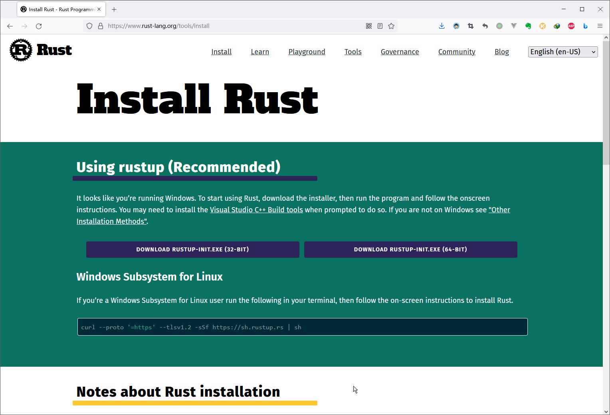

# Rust 学习笔记

这篇学习笔记将用于记录本人在学习 Rust 编程语言过程中所编写的学习心得与代码。为此，我会在`https://github.com/owlman/study_note`项目的`Programming/Language/`目录下创建一个名为的`Rust`目录，并在该目录下设置以下两个子目录：

- `note`目录用于存放`markdown`格式的笔记。
- `code`目录则用于存放笔记中所记录的代码示例。

## 学习规划

- 学习基础：有 C/C++/JavaScript/Python 等编程语言的使用经验。
- 学习资料：
  - 书籍教材：[《Rust 权威指南》](https://book.douban.com/subject/35081743/)
  - 视频资料：[Rust 编程语言教程视频](https://www.bilibili.com/video/BV1hp4y1k7SV?spm_id_from=333.999.0.0)
- 学习目标：
  - 开发一个基于 RESTful 架构的 Web 服务端应用。

## 第 1 部分：Rust 编程语言基础

### 1.1 语言环境的安装

由于 Rust 的语言环境是依赖于 C 语言的编译工具来构建的，这意味着在安装语言环境之前，我们的计算机上至少需要先安装一个 C 语言的编译环境。换句话说，如果使用的是 UNIX/Linux 系统，我们需要先安装 GCC 或 clang。如果是 macOS，需要先安装 Xcode。如果是 Windows，则需要安装的是 Visual Studio 2013 或 MinGW 之类的 C/C++ 环境。

在 Windows 下，我们只需在搜索引擎中搜索“rust”关键字或直接在 Web 浏览器的地址栏中输入`https://www.rust-lang.org/`这个 URL 即可进入到 Rust 语言的官方网站，然后通过点击首页中的“install”链接，就会看到如下页面：



在该页面中，我们可以根据自己所在的平台下载 32 位或 64 位版本的语言环境安装包。待下载完成之后，我们就可以双击打开该安装包（通常是一个名为`rustup-init.exe`的二进制文件），并遵循屏幕上的指示来安装（对于初学者，只需一路选择默认选项即可）。

如果是 Windows 的 Linux 子系统（WSL）用户，也只需要在终端中运行以下命令，并遵循屏幕上的指示来安装（对于初学者，只需一路选择默认选项即可）。

```bash
curl --proto '=https' --tlsv1.2 -sSf https://sh.rustup.rs | sh
```

在 UNIX/Linux 下，我们只需直接执行下面的 shell 代码，并遵循屏幕上的指示来安装（对于初学者，只需一路选择默认选项即可）。

```bash
# import USTC mirror
echo "export RUSTUP_DIST_SERVER=https://mirrors.ustc.edu.cn/rust-static" >> ~/.bashrc
echo "export RUSTUP_UPDATE_ROOT=https://mirrors.ustc.edu.cn/rust-static/rustup" >> ~/.bashrc
source .bashrc

curl --proto '=https' --tlsv1.2 -sSf https://sh.rustup.rs | sh

# 安装完毕后刷新环境变量
source ~/.cargo/env
```

待上述命令执行完成之后，我们可通过在终端中执行`rustc -V` 和`cargo -V`来查看是否能输出相应的版本信息。如果输出正常，就证明 Rust 语言环境的安装和配置工作已经成功了一半了，接下来的任务是配置 cargo 包管理器并安装相关插件。

### 1.2 配置 cargo 包管理器

代理信息需要写到 cargo 的配置文件中（该配置文件就叫“config”，没有扩展名）。通常情况下，此文件位于`${HOME}/.cargo/`目录中。具体配置内容如下：

```bash
[source.crates-io]
registry = "https://github.com/rust-lang/crates.io-index"
# 指定镜像
replace-with = 'sjtu'

# 清华大学
[source.tuna]
registry = "https://mirrors.tuna.tsinghua.edu.cn/git/crates.io-index.git"

# 中国科学技术大学
[source.ustc]
registry = "git://mirrors.ustc.edu.cn/crates.io-index"

# 上海交通大学
[source.sjtu]
registry = "https://mirrors.sjtug.sjtu.edu.cn/git/crates.io-index"

# rustcc社区
[source.rustcc]
registry = "https://code.aliyun.com/rustcc/crates.io-index.git"
```

### 1.3 安装一些插件

因为代码提示racer的一些#future功能不能在稳定版使用，无法安装
所以安装nightly版本的rust 并设置默认版本

```bash
rustup install nightly
rustup default nightly
```

安装RLS组建

```bash
rustup component add rls --toolchain nightly
rustup component add rust-analysis --toolchain nightly
rustup component add rust-src --toolchain nightly
```

安装racer

```bash
cargo install racer
```

### 1.4 IDE的安装

推荐使用vscode：`https://code.visualstudio.com/`
安装好vscode后，Ctrl + Shift + X 打开应用商店
搜索chinese安装中文语言包，搜索Rust (rls)官方的插件，基本上就OK可以撸代码了。

## 第 2 部分：编写本地应用程序

## 第 3 部分：编写网络应用程序
