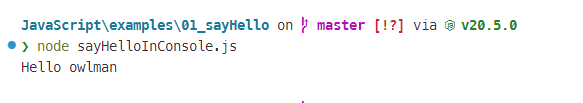

# JavaScript 学习笔记：基础篇

> 本文节选自笔者于 2021 年出版的[《JavaScript 全栈开发》](https://book.douban.com/subject/35493728/)一书。

在如今琳琅满目的编程语言中，JavaScript 是一个非常特殊的存在。如果从语言设计的角度来分析，JavaScript 应该被归类为基于原型的、解释型的高级编程语言。这也就是说，尽管 JavaScript 在语法上与 Java、C/C++ 非常相似，但在程序设计的思路上，它受 Self 和 Scheme 这类语言的影响恐怕会更多一些，因此在具体使用方式上可能更接近于后者。除此之外，JavaScript 还是一门支持多种编程范式的语言，它支持面向对象编程、指令式编程以及函数式编程，因而具有极为灵活的表达能力。

而在适用领域方面，如今的 JavaScript 也从最初的纯浏览器端脚本语言，逐步发展成了可在浏览器端、移动设备端、桌面应用端以及服务器端通用的强大编程语言。正是由于这门语言具有如此的使用深度和广度，以及在语法、设计理念上的复杂度，使得笔者认为在具体学习该语言之前，需要先用一点篇幅系统地介绍一下它的概况。

## 语言概况简介

如果仔细观察一下如今在世界范围内最受欢迎的那些 Web 应用程序，譬如 Twitter、Facebook 、YouTube、bilibili、新浪微博、淘宝等，就会发现它们能获得如此大的成功，主要是因为它们首先在 Web 浏览器端实现了与桌面应用相类似的人机交互体验，然后又在移动端也实现了同样良好的用户体验。但众所周知的是，在过去相当长的一段时间里，我们所知道的 Web 站点都只不过是一组依靠超链接简单串联在一起的 HTML 文档而已。这些文档既无数据处理能力，也无法响应用户的操作，简单到甚至都不能被称之为“程序”，充其量不过是一本被放在互联网上供人浏览的“书”罢了。大概正是因为如此，如今用来阅读 Web 页面的这个工具才会被叫做“浏览器”吧。然而，随着 Web 站点的业务需求与日俱增（例如电子商务、线上交友、视频分享等），开发者们越来越希望自己所创建的 Web 站点能具有更强大的数据交互功能，并能即时响应用户的操作。于是，JavaScript 应运而生了。

### 发展历程

当然，罗马不是一天建成的，JavaScript 这门语言也不是生来就如此强大的，设置它最初的设计目标只是想在 Web 浏览器中运行一些嵌入式脚本而已。JavaScript 的历史开始于 1995 年，当时世界上最成功的 Web 浏览器提供商 —— 网景公司聘请了一个名叫布兰登·艾克（Brendan Elch）的人，希望他研发一个能与 Java 语言搭配使用，语法上也与其相似的浏览器端脚本语言。后者也没有辜负网景公司的重托，本着速战速决的态度，仅用了十天就完成了该语言的原型设计，并在 Netscape Navigator 2.0 的 Beta 版中发布了它，当时这门语言的名称还是 LiveScript。等到同年的 12 月，网景公司在 Netscape Navigator 2.0 Beta 3 版发布时又将它重新名为 JavaScript，相传这样做的目的主要是想让这门新生的编程语言蹭一下 Java 的“热度”，相信他们当时可能也没有想到，这个名字反而在日后成为了大众对该语言的诸多误解之一，因为在事实上，Java 和 JavaScript 之间就像印度和印度尼西亚一样，并没有任何从属关系。

之后的事情大家就都耳熟能详了，网景公司凭借着 JavaScript 在 Web 浏览器市场上大获成功，这最终引起了微软公司的注意。为了与之竞争，微软公司随后在 Internet Explorer 3.0 浏览器上提供了自家的 JavaScript 实现，即 JScript。如果这能带来良性竞争，倒也不失为一件好事，但让人非常遗憾的是，当时微软公司在自己的版本中加入了很多 Internet Explorer（IE） 浏览器的专属特性。这些举措让不少基于 IE 浏览器设计的 Web 页面无法在非 IE 的浏览器中正常显示，结果就导致了它与网景公司之间的竞争，最终引燃了一场非常惨烈，且影响深远的浏览器大战（时间大约是在 1996 年到 2001 年间）。站在今天的角度回顾那段历史，我们会发现那场大战不只开启了开源运动的时代，也让 JavaScript 这门语言的标准化问题被提上了议事议程。

1996 年 11 月，为了反制微软的恶性竞争，同时也是为了使 JavaScript 语言的实现趋于标准化，网景公司正式向 ECMA （欧洲计算机制造商协会）提交语言标准。然后在次年的 6 月，ECMA 就以当下的 JavaScript 语言实现为基础制定了 ECMA-262 标准规范。自此之后，JavaScript 核心部分的实现也被称为 ECMAScript。截止到 2019 年 5 月，ECMA 一共更新了以下 9 个版本的标准规范：

| 版本 | 发表日期 | 相关说明 |
| ---- | -------- | -------- |
| 1    | 1997 年 6 月 | 随着第 1 版标准规范的发布，JavaScript 语言进入了标准化的时代。 |
| 2    | 1998 年 6 月 | 这一版修正了语言的编码格式，使其形式与 ISO/IEC16262 国际标准一致。 |
| 3    | 1999 年 12 月 | 这一版增加了新的控制指令、异常处理以及功能强大的正则表达式，优化了词法作用域链、错误定义，数据输出格式等特性。 |
| 4    | 2008 年 7 月（放弃） | 由于草案的目标过于激进，相关各方对于标准的方案出现了严重分歧，争论过于激烈，ECMA 最终决议放弃发布第 4 版的标准规范。 |
| 5    | 2009 年 12 月 | 这一版新增了“严格模式（strict mode）”，提供更彻底的错误检查，以避免结构出错。澄清了许多第 3 版标准中的模糊之处，并适应了与规范不一致的真实世界实现的行为。除此之外，这一版的 ECMAScript 中还增加了部分新的功能，譬如：getters 及 setters，支持 JSON 的解析和序列化等。 |
| 5.1  | 2011 年 6 月 | ECMAScript 的 5.1 版所做的修改主要为了与国际标准 ISO/IEC 16262:2011 保持一致。 |
| 6    | 2015 年 6 月 | ECMAScript 2015（ES2015），这一版最早被称作是 ECMAScript 6（ES6），这一版本的 ECMAScript 新增了类和模块的语法，以及包括迭代器，Python 风格的生成器和生成器表达式，箭头函数，二进制数据，静态类型数组，集合（maps，sets 和 weak maps），promise，reflection 和 proxies 在内的其他特性。 |
| 7    | 2016 年 6 月 | 即 ECMAScript 2016（ES2016），这一版小幅度地新增了一些新的语言特性。 |
| 8    | 2017 年 6 月 | 即 ECMAScript 2017（ES2017），这一版小幅度地新增了一些新的语言特性。 |
| 9    | 2018 年 6 月 | 即 ECMAScript 2018（ES2018），这一版新增了异步循环、生成器、新的正则表达式特性和 rest/spread 语法。 |

与所有编程语言的标准化工作一样，标准规范的制定与实际生产过程中的实现或多或少还是会存在着一些落差。目前市场上所使用的 ECMAScript 基本以 ES5、ES6 为主，下面我们就再通过一张表格来了解一下目前主流的 JavaScript 脚本引擎对这些不同版本标准规范的兼容性：

| 脚本引擎              | 代表性浏览器          | ES5  | ES6  | ES7  | ES7之后 |
| --------------------- | --------------------- | ---- | ---- | ---- | -------- |
| Chakra                | Microsoft Edge 18     | 100% | 96%  | 100% | 58%      |
| SpiderMonkey          | Firefox 63            | 100% | 98%  | 100% | 78%      |
| Chrome V8             | Google Chrome 70      | 100% | 98%  | 100% | 100%     |
| JavaScriptCore（Nitro） | Safari 12             | 99%  | 99%  | 100% | 90%      |

希望这个Markdown表格对你有帮助！如果你还有其他问题，请随时提问。
正是基于这样的现实，本书的内容也将会主要会以 ES5/ES6 为标准来展开。这样做既有助于读者理解 JavaScript 发展至今所形成的设计理念与编程思想，也有助于这门语言的初学者们快速上手并实验本书中所呈现的示例，而不必因为相关执行环境对标准的兼容度而发愁。

### 组成与特性

正如我们之前所说，JavaScript 最初只是一门依附于 Web 浏览器的脚本语言，但随着 Node.js 运行环境的出现，它如今已经发展成了横跨 Web 开发领域的前后端、移动设备端以及桌面应用端的全能型编程语言。所以，当我们讨论 JavaScript 这门语言的时候，必须要了解该语言除了核心部分的 ECMAScript 标准之外，还包含了其所在的宿主环境。

譬如，当我们讨论基于 Web 浏览器的 JavaScript 的时候，就应该知道这时候的讨论内容除了 ECMAScript 标准所规定的语法和基本对象之外，通常还会涉及到用于处理 Web 页面内容的文档对象模型（简称 DOM），和用于处理 Web 浏览器事务的浏览器对象模型（简称 BOM）。但到了 Node.js 运行环境中，DOM 和 BOM 就不存在了，这时候，我们需要关心的就是 Node.js 所提供的核心模块，以及各种特定用途的第三方模块了。

总而言之，JavaScript 这个术语所代表的已经不只是 ECMAScript 标准所规范的一门脚本语言了，它还会涉及到这门语言所在的宿主环境与应用框架，在之后学习 JavaScript 的过程中，我们会越来越意识到这一点的重要性，这种意识将有助于大家理解 JavaScript 在 Web 应用的前后端开发中扮演的不同角色，而不至于会产生混淆。

当然，我们在这里所说的“全能型编程语言”仅仅指的是 JavaScript 适用的领域很广，并非是认为可以用这门语言来解决所有的编程问题。JavaScript 自诞生以来一以贯之的设计理念让这门语言具备了一些与众不同的特性，这些特性基本上决定了它的编程思想以及专长的领域。下面，我们先来初步罗列一下这些特性：

- **动态化类型**：和大多数脚本语言一样，JavaScript 中的数据类型是直接取决于变量中的“值”的，变量本身没有数据类型上的约束，这是它们与编译型语言最大的区别之一。也就是说，JavaScript 中的同一个变量可以存储不同类型的值，例如，如果我们在 JavaScript 的代码中定义了一个名为`x`的变量，`x`的值是可以初始值为数字，然后在执行过程中被重新赋值为字符串的，JavaScript 的宿主环境会负责自动识别变量的类型。
- **多范式编程**：JavaScript 虽然在语法上与 Java、C/C++ 非常类似（例如 if-else、switch 条件语句、while、for 循环语句等），但在内在的设计哲学上，它则更接近于 Self 和 Scheme 这一类语言。也就是说，它既支持面向对象编程，也支持指令式编程和函数式编程，因而具有极为灵活的表达能力。
- **单线程执行**：由于最初脱胎于 Web 浏览器的关系，JavaScript 社区一直习惯采用单一线程的执行模式（尽管如今有了支持多线程的 Worker 组件），这一习惯即使到了 Node.js 运行环境中也基本如此。采用单一线程的最大好处是不用像多线程编程那样处理很容易产生 bug 的同步问题，这就从根本上杜绝了死锁问题，也避免了线程上下文交换所带来的性能上的开销。当然了，单一线程的执行方式也有它自身的弱点，譬如，它无法充分发挥多核处理器的性能、一个错误就会导致整个程序崩溃，以及执行大量计算时会因长期占用处理器而影响其他异步 I/O 的执行。
- **事件驱动**：在 Web 开发领域，JavaScript 之所以能在浏览器端扮演越来越重要的角色，很大程度上就是得益于其具有与桌面应用相似的事件驱动模型。当然，这种编程模型虽然具有轻量级、松耦合等优势，但在多个异步任务的场景下，由于程序中的各个事件是彼此独立的，它们之间的协作就成为了一个需要我们费心解决的问题。
- **异步编程**：在目前流行的 Vue、React 等 JavaScript 前端框架以及 Node.js 运行环境提供的接口中，我们都可以很容易地观察到，其大部分操作都是以异步调用的方式来进行的，而这些异步调用往往都会以回调函数的形式存在，这已经成为了使用 JavaScript 编程的一大特色。当然，虽然大家都认为回调函数是执行异步调用并接收其返回数据的最佳方式，但这种方式也会导致代码的编写顺序与其具体执行顺序的不一致，对于很多习惯同步思路编程的人来说，阅读这样的代码会是一个不小的挑战。另外在流程控制方面，也会由于程序中穿插了各种异步方法和回调函数，让代码在可读性上也远没有常规的同步方式那么一目了然，这也会给程序的调试和维护工作带来一定的麻烦。

### 适用领域

正如之前所说，如果想判断一门编程语言是否适用于某个领域，很大程度就要去分析该领域是否能发挥出语言的特性优势。既然我们已经对 JavaScript 的语言特性有了一定的了解，接下来就可以对这门语言的适用领域做一些分析了。这些分析将有助于初学者们明确 JavaScript 适合用来解决什么问题，不适合用来解决什么问题，以便厘清自己的学习需求和努力方向。现在，让我们先来罗列一下适合用 JavaScript 来解决的问题领域 ：

- **Web 浏览器端的应用**：JavaScript 在 Web 浏览器端的优势是最显而易见，且无可争议的，毕竟这门语言最初就是为解决这一领域的问题而设计的。正是由于 JavaScript 赋予了 Web 页面在浏览器端强大的用户交互能力，我们才迎来了电子商务、云端办公、社交网络等各路 Web 应用蓬勃发展的 Web 2.0 时代。
- **轻量级的服务器应用**：Node.js 运行环境的出现让 JavaScript 的适用领域得以扩展到了 Web 浏览器之外，其中很大的一块就是服务器端的应用。与 ASP、PHP 这些传统的服务器端脚本相比，JavaScript 支持事件驱动、异步编程的特性使它在实现轻量级数据密集型的服务器应用方面享有了一些高性能、高负载的优势。当然在另一方面，单线程执行和非阻塞 I/O 的特性也让该语言的能力在资源利用率和安全性方面受到了一些限制，使其不适合被用来实现需要大规模并行计算，或对数据安全有相当要求的应用。
- **轻量级的桌面应用**：Electron 框架的出现也让我们可以用 JavaScript 来实现一些适用于事件驱动、异步编程、非阻塞型 I/O 等特性的轻量级桌面应用，譬如目前流行的 VSCode、Atom 等代码编辑器都是基于这一框架的 JavaScript 应用。但同样是由于其单线程执行的特性使 JavaScript 无法充分利用多核处理器的计算资源，因而也不适合用来实现需要大规模并行计算的桌面应用。
- **富媒体式的应用**：在 HTML5 出现之前，市面上主要用于创作富媒体的应用程序（如 Flash）大多采用的都是 ActionScript 脚本，由于后者也是一种基于 ECMAScript 标准的脚本语言，所以，也可被视为是 JavaScript 的一种应用。当然，目前这种形式的应用正在逐渐被人遗忘，毕竟 HTML5 为我们提供了更好的选择。

除此之外，JavaScript 有时候还会被用来实现一些 Web 浏览器的扩展与插件、移动端的一些应用，甚至是一些用于系统管理的命令行脚本。总而言之，我们希望再三强调的是，虽然目前 JavaScript 已经发展成了一门无处不在的全能型编程语言，但还是得注意语言特性的发挥，能发挥出特性的优势才是它真正适用的领域，反之，不分场合地强行使用这门语言可能只会让我们弄巧成拙、事倍功半。

## 学习环境的搭建

在笔者个人看来，想要学好一门语言，无论是英语、汉语这样的人类语言还是 C/C++、Java、JavaScript 这样的编程语言，最好的办法就是尽可能地在实践中使用它们，在实际表达需求的驱动下模仿、试错并总结使用经验。所以在这本书中，我们并不打算提供任何可供下载的、并可直接复制/粘贴的代码。我们希望读者“自己动手”去模仿本书中提供的示例，亲手将自己想要执行的代码输入到计算机中，观察它们是如何工作的。然后，试着修改它们，并验证其结果是否符合预期。如果符合预期，就总结当下的经验，如果不符合预期，则去思考应该做哪些调整来令其符合预期。如此周而复始，才能让学习效果事半功倍。

当然，工欲善其事必先利其器，在进入具体的学习任务之前，我们需要先将 JavaScript 的执行环境搭建起来。众所周知，JavaScript 的执行环境主要分为 Web 浏览器环境和 Node.js 运行环境两种。目前，大部分开发人员都会将 Google Chrome 或 Mozilla Firefox 设为自己的默认 Web 浏览器，它们本身都自带了一款有非常不错的 JavaScript 执行/调试环境。其中，对于 Google Chrome 浏览器，我们只需在[该浏览器的官方下载页面](https://www.google.com/intl/zh-CN/chrome/)中下载并安装它，然后其主菜单中依次单击「更多工具」→「开发者工具」，然后在弹出的窗口单击「Console」选项卡，就可以看到如下图所示的 JavaScript 执行/调试环境了：


Mozilla Firefox 则是另一款可扩展的浏览器，在 Windows、Linux 以及 MacOS 这些主流操作系统上都有相应的版本，读者可根据自身所在的操作系统到[Firefox 浏览器的官方下载页面](http://www.mozilla.com/firefox/)中去下载并安装它。安装完成之后，我们可以在任何网页下按 F12 键或在菜单栏中依次单击「工具」→「Web开发者」→「Web控制台」，就可以看到如下图所示的 JavaScript 执行/调试环境了：


关于在浏览器中如何具体执行/调试 JavaScript 脚本，我们将会在本笔记的第二部分中具体讨论。在这里，读者暂时只需知道如何搭建并启动这个执行/调试环境即可。当然了，在笔者个人看来，如果不考虑 Web 浏览器特有的 BOM 和 DOM 组件，单纯只是学习 ECMAScript 的话，Node.js 应该被优先考虑，因为它可以让我们像使用 Shell、Ruby 或 Python 脚本一样直接在命令行终端中执行 JavaScript 指令和脚本文件，某种程度上更便于我们在初期的学习过程中随时查看代码的执行结果。

> 关于 Node.js 的安装与使用，读者可参考笔者笔记库中的《[[Node.js 学习笔记]]》一文。

## 基本语法学习

自《The C Programming Language》这本程序设计领域的经典教程问世以来，在命令行终端中（譬如 Windows 中的 cmd、Linux 中的 bash 等）输出 “Hello World” 字样都已经成为了我们学习一门新的编程语言或者测试该语言执行/调试环境的第一个演示程序。这样做的好处是先让大家对要学习的语言，以及如何执行该语言的程序有一个整体的印象。这既可以确认语言的执行/调试环境是否搭建完成，也可以为接下来关于语法元素的介绍做一个开场或者说提供一个切入点。所以，接下来就闲话少说，让我们来编写 JavaScript 版的 “Hello World” 吧！
“Hello World” 翻译成中文就是 “你好！世界”，顾名思义，这个程序的作用就是让我们用自己新学的语言来向世界发出一声问候。仔细想想，这也算是一种非常俗套的语言学习惯例了。在这里，出于想增加一点趣味性和复杂度的考虑，笔者打算让本书的第一个 JavaScript 程序问候一下自己。下面，就请大家跟着下列步骤一起来创建它：

1. 请大家在自己计算机中创建一个名为code的目录，当然，读者也可以给该目录起其他任何自己喜欢的名字，这个目录将用于存放我们在接下来的学习过程中要写的所有代码。

2. 在code目录下创建一个名为01_sayhello的目录，由于 JavaScript 的输出方式有很多种，我们之后还会回来写浏览器输出的、文件输出的、TCP服务输出的 “Hello World” 版本。

3. 在code/01_sayhello目录下创建一个01-sayHello.js的脚本文件，并输入如下代码：

    ```javascript
    // 第一个 JavaScript 脚本
    // 作者：owlman

    const name = 'owlman';
    console.log('你好！', name);
    ```

4. 在保存文件并退出编辑器之后，打开命令行终端进入到code/01_sayhello目录下，并执行node 01-sayHello.js命令，如果之前搭建的执行/调试环境一切正常，我们就会看到程序输出结果如下：

    

### 为代码编写注释

在上面这段 “Hello World” 程序中，我们首先看到的是三行以//开头的注释信息。在 JavaScript 中，注释主要有以下两种形式：

- **`// 注释内容`形式**：这种形式的注释可以在代码的任意地方以`//`开头编写注释信息，直至其所在行结束为止，例如：

    ```javascript
    // JavaScript 支持加减法运算
    const a = 100;
    const b = 50;
    const c  = a + b; // 请问 c = ？
    ```

- **`/* 注释内容 */`形式**：这种形式的注释可以在代码的任意地方以/*开头编写注释信息，然后以*/结束。由于这种形式的注释内容可以包含换行符，因此通常用于编写多行注释，譬如对于之前 这段 “Hello World” 程序中的那三行注释，我们还有另一种写法：

    ```javascript
    /*
    * 第一个 JavaScript 脚本
    * 作者：owlman
    */

  const name = 'owlman';
  console.log('你好！', name);
    ```

和所有的编程语言一样，注释也不会被 JavaScript 解释器视为可执行代码，它主要用于说明相关代码的作用，以此来提高代码的可读性，方便日后的维护工作，譬如在上面这段程序中，我们用注释说明了这个程序的基本信息。当然，我们永远应该记得：JavaScript 本身就是一门语言，它的作用除了让机器按照它的意图正确执行之外，也应该让使用这门语言的人类看得懂它的意图，注释只是辅助说明，可不是充当翻译。换而言之，我们应该尽量用代码本身来表达它所要表达的意图，而不是处处都借助注释，譬如下面代码中的注释很大程度上是画蛇添足的：

```javascript
const a = 100;    // 变量 a = 100
const b = 50;     // 变量 b = 50
const c = a + b;  // 变量 c = a + b
```

除此之外，注释还有一个额外的作用：即在调试过程中，临时暂停某一条代码的执行。举个例子，如果我在执行上面这段 “Hello World” 程序的时候发现自己的命令行终端不能显示中文，为了确定这不是代码本身的问题，我可能会选择像下面这样，临时注释掉中文的输出，然后增加一条英文的输出：
/*
 * 第一个 JavaScript 脚本
 * 作者：owlman
 */

const name = 'owlman';
// console.log('你好！', name);
console.log('Hello ', name);
这时候，如果我们觉得可以让用户来选择这段程序是输出中文还是英文，也可以直接把上面的代码交给用户，让他们自己使用注释语法来切换，这是一种很常用的代码编写技巧。
2.3 变量与操作符
下面，让我们继续 “Hello World” 程序的讲解。在看完程序基本信息的注释说明之后，紧接着看到的是const name = 'owlman'这行代码，它的作用是在程序中定义一个变量。变量这个概念最早源自于数学中的代数运算，为了方便演算过程的书写，我们通常会用一些简单的字母来指代演算过程中不断变化的已知量或未知量，毕竟在公式中写x、y、z这样的字母总是要比写10^2019或者3.141592653589这样的数字简单方便多了。
而到了计算机程序中，变量的概念得到了进一步扩展，除了是某个数据值的指代外，它还关联着计算机中用于存储该数据的一块内存空间，换而言之，变量现在还是程序用来存储某个数据的容器。当然了，这些容器既然能被称为“变”量，也就说明它们所存储的数据是会随着程序的执行而变化的。由于变量是程序所要操作的基本对象，所以在编写程序时，定义变量往往是我们首先要做的工作。下面，我们就来看看具体该如何定义并使用变量吧！
2.3.1 变量的定义
在 JavaScript 中，定义变量的动作是用定义语句来描述的（关于语句的概念，我们会在 2.4 节中做详细介绍），它主要由以下三部分组成：
	变量的定义指令： 在 ES6 标准发布之前，我们一直是使用var关键字来定义变量的，而 ES6 则为我们另外增加了let、const这两个新的关键字，以便大家能更精确地定义变量的作用。关于这三个关键字之间的差异，我们将会等到介绍作用域和常量对象时再来分别做详细介绍。
	变量的名称： 在 JavaScript 中，每个变量都必须要有相应的变量名，这些变量名通常应由一个或多个字母、数字、下划线和美元符号$组成，并且只能以字母、下划线和$符号开头。另外，变量名也不能与 JavaScript 语言自身内部使用的保留字相同。关于变量的命名规范，我们稍后会详细说明。
	变量的初始值： 这部分的内容是可选的，但为了避免程序出现各种无意义的操作，我们通常都会在定义变量时赋予它一个初始值。
接下来，让我们来具体讨论一下变量的命名问题。根据 ECMAScript 标准，变量名可以由字母、数字、下划线及美元符号$以任何顺序排列组合而成，并且只能以字母、下划线和$符号开头，像下面这些变量名都是不被允许的：
  const 2day;
  const ‘Week;
  const \Month;
  const /Year;
需要特别提醒的是，JavaScript 中的变量名是大小写敏感的。为了证明这一点，读者可以在 node 解释器的交互模式中进行以下测试：
图 2-4：变量名区分大小写
 
如大家所见，a和A在 JavaScript 中是完全不同的变量。在这里，细心的读者可能会好奇，这些变量定义代码为什么会返回一个 undefined ？ 这就涉及到了表达式的概念，我们在后面的章节中会详细介绍它，眼下读者只需要知道这里的 undefined 是表达式返回的值，暂时忽略它即可。
除此之外，每一种编程语言都会有一些特殊用途的保留字，这些保留字不能被用作变量名。下面，让我们先来罗列一下语言本身的保留字。
保留字	保留字	保留字	保留字	保留字
abstract	arguments	boolean	break	byte
Case	catch	char	class	const
continue	debugger	default	delete	do
double	else	enum	eval	export
extends	false	final	finally	float
For	function	goto	if	implements
import	in	instanceof	int	interface
Let	long	native	new	null
package	private	protected	public	return
Short	static	super	switch	synchronized
This	throw	throws	transient	true
Try	typeof	var	void	volatile
While	with	yield		
与此同时，我们在原则上还应该避免使用一些 JavaScript 标准库中使用的对象及其属性和方法的名称。下面，我们继续来罗列一下使用时需要注意，不要意外与标准库冲突的变量名：
变量名	变量名	变量名	变量名	变量名
Array	Date	eval	function	hasOwnProperty
Infinity	isFinite	isNaN	isPrototypeOf	length
Math	NaN	name	Number	Object
prototype	String	toString	undefined	valueOf
最后，出于代码可读性方面的考虑，变量的命名应该尽量使用有意义的单词或单词组合，不能太过随意。在这里，笔者个人更倾向于建议读者应在变量的命名上遵守某种一致的命名规范。譬如匈牙利命名法，这套命名规范建议我们将变量的数据类型也写到变量名中，例如在var strname='owlman'这个变量定义中，我们用str表明了这是个字符串类型的变量。再譬如驼峰命名法，遵守这种命名规范的变量名通常由一个以上的单词组成，除了首个单词的字母不是大写，其余所有单词的首字母均为大写，例如myName、myBook、someValue、getObject等。
2.3.2 变量的类型
在计算机中，如果程序想要对某一块内存空间中数据进行存储和操作，首先要明确的是该空间内数据的存储方式和操作方式。譬如，变量中存储的是数据本身还是数据在内存中的位置？这将决定着这些数据的复制方式。再譬如，变量中的数据可以执行什么操作？是算术运算还是逻辑判断，亦或是文本处理？这就需要我们对这些内存空间中的数据，即变量的值进行归类，譬如用来做算术运算的数据归为一类，用于文本处理的数据则归为另一类，在编程术语上，这些归类被人们约定俗成地称之为“类型（type）”。简而言之，就是变量中的值所属的类型决定了该变量的存储形式及其可以执行的操作。下面，我们从变量值的数据类型开始介绍。
2.3.2.1 数据类型
具体到 JavaScript 语言中，我们可以将变量的数据类型分成基本数据类型和对象类型两种。关于对象类型，我们将会在下一章中单独介绍，现在先来看看 JavaScript 所支持的五种基本类型：
	Number： 即数字类型，这一类型的数据包括：
	正负整数与浮点数，例如：0、1、-1、-0.25、3.14等。
	八进制数与十六进制数，例如：0377、0xff等。
	指数，即用科学计数法表示的数字，例如：1e+2、10e+3等。
	Infinity 与 NaN，这是 JavaScript 中的两个特殊数字。其中，Infinity 表示的是一个超出 JavaScript 能接受范围的数字，相当于 JavaScript 世界中的“无穷大”，和数学中有正无穷大和负无穷大一样，这类值也是有 Infinity 和 -Infinity 两种的。而 NaN 则表示的是一种不符合规范但仍属于数字类型的数字，例如当我们让一个数字与一个字符串相乘时，结果就会是一个 NaN。
	String： 即字符串类型，这一类型的数据主要指的是被反引号、单引号或双引号所包括起来的、由任意数量字符组成的字符序列，例如：'a'、'123'、"one"、"one two three"等。另外，出于代码可读性方面的考虑，笔者个人更倾向于建议读者应在字符串的表示风格上保持一致，不要时而用单引号，时而用双引号。当然，ES6 新增的反引号表示的字符串形式比较特殊，它主要用于建立模版字符串，我们通常只有在特定场景中才会用到它。例如，当我们需要将某个变量的值嵌入到某个 HTML 标签中，就可以这样做：
	const name = 'owlman';
console.log(`<h1> ${ name } </h1>`); // 输出：<h1> owlman </h1>
	如你所见，在模版字符串中，我们只需要使用${[变量名]}这样的语法就可以将现有变量的值嵌入到字符串中了，这里的[变量名]可以是任何已在别处定义的变量的名称。这样一来，就避免了我们一系列拼接字符串的麻烦，既简洁又不易出错。
	Boolean： 即布尔类型，这一类型的数据只有true和false两种值，主要用于关系运算和逻辑运算。关于这两种运算，我们稍后会详细说明。
	undefined： 这是 JavaScript 中的一个特殊值，当我们访问一个不存在的变量，或未被初始化的变量时，程序就会得到一个 undefined 值。
	null： 这也是 JavaScript 中的一个特殊值，通常是指没有值、空值，不代表任何东西。null 与 undefined 最大的不同在于，被赋予 null 的变量会被认为是被初始化了的，只不过它是个空值。关于空值的概念，我们以后会通过一些具体的示例来解释。
在 JavaScript 中， 任何不属于上述五种基本类型的值都会被视为对象，某些宿主环境甚至将 null 值也视为一个对象。我们将会在下一章中深入阐述对象的概念，现在我们还需要再进一步来探讨一下类型与值的关系。
正如我们在上一章中所说的，作为一种动态类型的脚本语言，JavaScript 的数据类型是直接与“值”，而不是与变量相关联的。这也就意味着，在 JavaScript 代码的执行过程中，变量的类型是可以随着变量的值而变化的，例如，如果我们在代码中定义了一个名为x的变量，x的值是可以初始值为数字，然后在执行过程中被重新赋予其他类型的值的，JavaScript的宿主环境会负责自动识别变量的类型。下面，我们可以用类型操作符typeof来验证一下（该操作符会返回一个代表数据类型的字符串），请打开 node 解释器的交互模式，执行以下测试：
图 2-5：动态化类型
 

2.3.2.2 存储类型
在上一节中，我们讨论的是变量“值”所属的数据类型，它决定的是这些值可执行的操作。但正如我们所说，在 JavaScript 中，变量只负责存储数据，与数据类型并没有直接的关联，这是它与 Java、C/C++ 这些强类型语言的一个重大区别。那么，变量在存储上有没有分类型呢？答案是有的，变量的存储类型决定了变量值的存储方式。在这一节中，我们就来讨论一下变量的存储类型。
根据 ECMAScript 标准的规定，变量按照其存储方式可分为以下两种类型：
	原始类型： 在这一类型存储方式下，变量的值往往会直接存储在变量所在栈空间中，由于这种方式所占的内存空间是固定的，所以通常用来存储一些简单且需要快速存取的数据。
	引用类型： 在这一类型存储方式下，变量的值往往会被分配在堆空间中，然后将其在堆空间中的位置存储在变量中，这通常用来存储一些复杂且内存开销较大的数据。 
那么，当我们为一个变量赋值时，该如何判断该值的存储类型呢？答案很简单，在 JavaScript 中，只有基本类型是以原始值的方式存储的。也就是说，除了 Number、String、Boolean、undefined 和 null 这五种基本数据类型之外，所有的值都是以引用的形式存储的。
请记住，如果某个数据选择用引用的方式来存储，就说明这段数据所占用的内存空间大小是不固定的，因此需要让 JavaScript 解释器会在堆空间中为其分配内存。如果我们将其分配在栈空间中，其不固定的内存空间势必会降低数据的查寻速度。所以，我们选择了将该数据在堆空间中的位置存储在了变量所在的栈空间中，而位置信息的大小是固定的，所以把它存储在栈中对变量性能无任何负面影响。
2.3.3 变量的操作
在做好变量的定义之后，我们就可以对其进行相关的操作了。例如在上面的 “Hello World” 程序中，console.log('你好！', name)这条代码的作用就是将'你好！'这个字符串和name变量中的内容拼接成一个字符串，并输出在命令行终端中。当然，我们在这里调用的是一个函数，该函数由拼接字符串等一系列基本操作组成，所以想要学好编程，我们首先得要学会编写这些基本操作。
和大多数编程语言一样，JavaScript 中的大部分基本操作都是通过操作符来完成的。这里所谓的操作符，通常指的是能对一到两个目标执行某种操作，并返回结果的符号。为了让读者更清晰地理解这一概念，我们先来看一个具体的示例，请在 node 解释器的交互模式下输入7 + 8这条代码，读者应该会看到如下结果： 
> 7 + 8
15
从这一结果，我们大致上可以得到下面这几点信息：
	+是一个操作符。
	该操作是一次加法运算。
	该操作的目标是 7 和 8 这两个数字（它们也叫做操作数）。
	该操作的结果为15。
当然，现在我们是直接拿了两个数字来当作操作目标，接下来可以改用变量来执行同样的操作，请继续在 node 解释器的交互模式下输入如下代码：
> const a = 7
> const b = 8
> const c = a + b
> c
15
在理解了操作符的概念之后，我们紧接着要问的就是 JavaScript 中到底有多少个操作符？可以执行哪些操作？一般而言，笔者通常会将 JavaScript 中的操作符分为基本操作符与对象操作符两大类。在这里，我们就先来介绍一下基本操作符。
2.3.３.1 基本操作符
在 JavaScript 中，我们可以将其支持的基本操作符按其作用分为位运算符、算术运算符、逻辑运算符、关系运算符、字符串操作符与赋值操作符六种，它们主要用于操作一些简单的数据。下面，就让我们看看它们分别是哪一些运算符。
位运算符：
众所周知，计算机中的所有数据都是以二进制形式存储的，位运算是一种直接对整数底层存储形式进行操作的运算，它主要作用于 32 位的正负整数上。下面，我们用一张表来罗列一下这些运算符及其使用示例：
表 2-1：位运算符
运算符	中文术语	使用示例	二进制结果	转换成十进制
&	按位与	x = 5 & 1	0001	1
|	按位或	x = 5	1	0101
~	取反	x = ~ 5	1010	-6
^	异或	x = 5 ^ 1	0100	4
<<	左移	x = 5 << 1	1010	10
>>	右移	x = 5 >> 1	0010	2
当然，由于我们很少用 JavaScript 代码来执行计算机的底层操作，所以位运算在 JavaScript 应用中并不常见，如果读者对二进制与十进制之间的转换运算并不熟悉，也可以忽略这部分内容。
算术运算符：
接下来是算术运算符，它主要用于基于数字的算术运算。我们同样一张表来列举 JavaScript 所支持的算术运算符，并提供相应的使用示例（在这里，我们将变量y的值一律赋值为 5）：
表 2-2：算术运算符
运算符	中文术语	使用示例	y的值	x的值
+	加法	x = y + 2	y = 5	x = 7
-	减法	x = y - 2	y = 5	x = 3
*	乘法	x = y * 2	y = 5	x = 10
/	除法	x = y / 2	y = 5	x = 2.5
%	余数（取模）	x = y % 2	y = 5	x = 1
++（前置）	自增	x = ++y	y = 6	x = 6
++（后置）	自增	x = y++	y = 6	x = 5
--（前置）	自减	x = --y	y = 4	x = 4
--（后置）	自减	x = y--	y = 4	x = 5
逻辑运算符：
再接下来是逻辑运算符，它主要用于布尔类型的计算，确定布尔值之间的逻辑关系。下面，我们继续用一张表来列举 JavaScript 所支持的逻辑运算符，并提供相应的使用说明：
表 2-3：逻辑运算符
运算符	中文术语	使用说明
&&	逻辑与	仅true && true时为 true，其余三种情况均为 false。
||	逻辑或	仅false || false时为 false，其三种情况均为 true。
!	逻辑非	!false为 true，!true为 false。
关系运算符：
关系运算符有时也被称之为比较运算符，它主要用于判断相关值之间的关系，常用于流程控制的条件判断中。下面是 JavaScript 中提供的关系运算符，以及它们的使用说明（在这里，我们将变量x的值一律赋值为 5）：
表 2-4：关系运算符
运算符	中文术语	使用说明
==	等于	符号两边的值相等时为真，例如x == 8为 false，x == 5为 true。
===	恒等于	符号两边的类型和值均相同时为真，例如x === "5"为 false，x === 5为 true。
!=	不等于	符号两边的值不相等时为真，例如x != 8为 true，x != 5为 false。
!==	不恒等于	符号两边的类型和值均不相同时为真，例如x !== "5"为 true，x !== 5为 false。
>	大于	符号左边的值大于右边时为真，例如x > 8为 false，x > 4为 true。
<	小于	符号左边的值小于右边时为真，例如x < 8为 true， x < 4为 false。
>=	大于或等于	符号左边的值大于或等于右边时为真，例如x >= 8为 false，x >= 5为 true。
<=	小于或等于	符号左边的值小于或右边时为真，例如x <= 8为 true， x <= 6为 false。
字符操作符：
或许是因为先天就是被设计用来处理 HTML 文本的关系，基于字符串类型的文本操作在 JavaScript 中是较为特殊的一种操作。它的特殊之处主要体现在其变量类型上，在大多数编程语言中，字符串类型通常都属于对象数据类型，采用引用方式来存储，但在 JavaScript 中，字符串属于基本数据类型，它的数据是直接存储在变量中的。其次，字符串操作并没有单独的操作符，它只是改变了一些现有的算术运算符和关系运算符的定义，然后用它们来执行字符串操作。例如，只要有一个操作目标为字符串类型，+操作符执行的就是字符串的拼接操作，即使另一个操作目标不是字符串类型，它也被自动转换为字符串类型。再例如，当操作目标为字符串类型时，>、<、=等这些关系运算符比较的就不是数字的大小，而是字符在字母表中的先后顺序了。下面，我们可以在 node 的交互模式下测试一下这些操作符：
> '1' + 1
'11'
> 1 + '1'
'11'
> 1 + '' + 1
'11'
> 'a' > 'b'
false
> 'bat' > 'owl'
false
> 'cd' < 'dvd'
true
> '10' < '9'
true
> '123' == 123
true
> '123' === 123
false
> '123' === '123'
true
值得一提的是，从上面所进行的最后三个测试中，我们看到了一个有趣现象，即字符串’123‘和数字 123 进行==比较时，由于只是单纯的值比较，所以数字被转换成字符串之后，该比较操作就返回 true 了。但是当他们进行===比较时，比较的除了值还有类型，比较操作符就得返回 false 了。正因为如此，今后在判断两个字符串变量是否相同时，我们更倾向于建议读者尽可能多地使用===运算符。
赋值操作符：
最后是赋值操作符，它主要用于赋予变量一个指定的值，并让其所在的赋值表达式返回该值（我们会在下一节中介绍赋值表达式的概念）。下面是 JavaScript 中提供的赋值操作符，以及它们的使用说明（在这里，我们预先设定x = 10、y = 5）：
表 2-5：赋值操作符
运算符	使用示例	示例说明
=	x = y	将x的值赋值给y，结果 x = 5。
+=	x += y	将x + y的值赋值给x，结果 x = 15。
-=	x -= y	将x - y的值赋值给x，结果 x = 5。
*=	x *= y	将x * y的值赋值给x，结果 x = 50。
/=	x /= y	将x / y的值赋值给x，结果 x = 2。
%=	x %= y	将x % y的值赋值给x，结果 x = 0。
2.3.３.2 对象操作符
在习惯上，笔者通常会将基本操作符之外的所有操作符归类为对象操作符。这些操作符往往都对应着一种特定的对象类型，大致上可以分成以下几类：
	函数操作符：例如，function操作符用于定义函数，()操作符用于调用函数。
	数组操作符：例如,[]操作符用于索引数组元素，in操作符用于判断某元素是否存在于数组中。
	实例操作符：例如，.操作符用于调用对象实例的方法与属性，new操作符用于新建对象实例，delete用于删除对象实例。
	类型操作符：例如，typeof操作符用于查看变量值的数据类型，instanceof操作符用于判断某个变量值是否是某个类型的实例。
正是由于这些操作符都与某种类型的对象相关，所以我们更倾向于等到具体介绍相关对象时再来说明它们的使用方法，这里就不再做单独介绍了。
2.3.３.3 操作符优先级
当然了，我们在计算机中实际所执行的操作往往都是由几类不同的操作符共同组合而成的。但是，当几种不同的操作符出现在同一条操作指令中时，程序会如何决定这些操作的执行顺序呢？理论上，这个问题可以交由操作符的优先级来解决。如果读者在大学时期有过学习 C/C++、Java 等编程语言的经验，想必都还会记得在学习语言的初期都会把不少时间花在记忆操作符的优先级上。例如，我们经常会看到某些教材出题让读者回答下面这类算术运算的操作顺序：
++a * b + c / d ;
于是，为了回答这类问题，读者就必须要记得：
	单目标操作符拥有最高的优先级，所以前置的++会先被执行。
	乘除法的优先级高于加减法，所以*和/会先于+被执行。
除此之外，为了解决类似的习题，我们可能还必须要记得算术运算符的优先级高于关系运算符、关系运算符的优先级高于逻辑运算符、赋值操作符的优先级低于逻辑运算符等规则。但是，读者最终会发现记住这些规则的最大用处就是解决上面这类教材中的练习题，以及基于这些教材的考试题。在实际编程中，我们通常会极力避免写出上面这种含糊不清的操作指令，这一方面是为了增加代码的可读性，另一方面也是为了减低编写这类复杂指令时的出错率。所以，通常我们会将复杂的操作指令拆分成几条简单的指令，譬如对于上面的操作，我们通常会这样做：
++a;
const x = a * b;
const y = c / d;
x + y;
即使我们在特定情况下不得不写一些复杂的运算指令，通常也都会使用一对圆括号来辅助表达自己的意图，譬如，如果我们不想额外增加x和y这两个变量，也可以这样做：
++a;
(a * b) + (c / d);
这样一来，无论操作符优先级是如何规定的，我们都可以确定圆括号中的操作会被优先执行，这就不存在任何表达上或阅读上的歧义了。当然，圆括号也可以用于改变原本的操作顺序，譬如，如果我们想先执行加法再执行乘除法，就可以这样做：
a * (b + c) / d;
总而言之，我们需要记住，编程语言归根结底是一门语言，如何清晰、正确地表达意图是最重要的，任何有可能让我们的表达含糊不清，让别人产生困惑做法都应该极力避免，切忌华而不实地炫技。
2.4 表达式与语句
众所周知，计算机程序本质上就是一组用某一门编程语言编写而成的指令序列，人类用这门语言表达自己的意图，而计算机则利用这门语言的解释器或编译器理解人类的意图，并将该意图转换成机器指令并执行它。所以，我们程序员的任务就是要学会用编程语言来表述自己的意图。在 JavaScript 中，表述意图的基本指令单元通常被称为“语句”。我们在上一节中学习的变量和操作符就相当于人类语言中的“名词”和“动词”，而现在就是要学习如何按照自己的意图将这些“名词”和“动词”组织成“语句”了。
和英文语句通常是由多个短语组成的一样，在 JavaScript 的语句中，表达式就扮演了“短语”的角色。一条语句中通常包含着一个或多个表达式。另外，和我们写完一句话时常用句号来结尾一样，JavaScript 语句也通常会以分号结束。但 JavaScript 的特殊之处在于，即使我们忘了在语句末尾加上分号，解释器在大部分情况下也会自动帮我们加上。这就意味着，在 JavaScript 中，语句末尾的分号是可以省略的。事实上，如今确实也有一些 JavaScript 的编码规范，譬如 JavaScript Standard Style   会建议我们不加分号，他们认为这样做有助于形成一些良好的编码习惯。当然，不加分号也会带来一些麻烦（譬如，如果语句以(、[符号开头就可能会出现一些不可预料的结果）。总而言之，用不用分号结束语句，完全取决于个人或个人所属团队的喜好。这基本上属于编码风格的问题，我们只需要保持前后一致，确保代码的可读性即可。
下面，就让我们从最简单的表达式语句着手，开始学习编写 JavaScript 语句吧！
2.4.1 表达式语句
如前所述，使用语言最根本的目标是要准确而清晰地表达意图。所以编写语句的第一步是要明确自己要表达的内容，可以是执行某个动作，也可以是呈现某个状态。当然，在没有习惯用 JavaScript 语言表达自己意图之前，不妨先用自己熟悉的人类语言将要表达的内容写出来。举个例子，如果想将 100 元人民币的币值换算成美元，通常我们会这样表达:
	先获取人民币的币值：100。
	再取得人民币对美元的汇率：0.1404。
	将人民币的币值乘以汇率，即为美元币值。
下面，我们用 JavaScript 语言来翻译一下上面四个短句（当然，我们在这里首先得假设CNY、exRate和USD这三个变量已经完成了定义）：
CNY = 100;
exRate = 0.1404;
USD = CNY * exRate;
如你所见，这里出现了三条 JavaScript 语句。由于这些语句都由一个或两个表达式组成，所以它们所表达的意图是由其中的表达式类型来决定的，而表达式类型则取决于表达式中起最终作用的操作符。例如在这个例子中，前两条语句中只有一个赋值操作符，所以无疑都属于赋值表达式；而第三条语句则由一个乘法运算符和一个赋值操作符共同组成，似乎应该是一个由算术表达式和赋值表达式组合而成的复合表达式，但在习惯上我们是用“起最终作用”的操作符来为表达式归类的，所以它依然属于赋值表达式。
以此类推，我们今后还会遇到算术表达式、关系表达式、逻辑表达式、函数调用表达式或对象操作表达式等执行各类不同操作的表达式，它们都可以直接组成语句。对于这种只包含表达式的语句，我们通常称之为表达式语句，这是 JavaScript 中最简单的一种语句。
2.4.2 复合语句
在 JavaScript 中，更多语句是由表达式和其他语法元素共同组合而成的，这些语句往往被用于表述比表达式更复杂的意图，我们将其统称为复合语句。在作用上，我们可以将复合语句进一步细分为语句块、条件语句和循环语句三种类型。下面，让我们分别来介绍一下它们：
2.4.2.1 语句块
在某些情况下，我们会发现自己用若干条语句描述了一个独立于程序其它部分的意图，这时候就可以选择用一堆大括号将这些语句包括在一起构成一个语句块。例如，对于上面这个币值换算操作，我们可以这样做：
{
    let CNY, exRate, USD;
    CNY = 100;
    exRate = 0.1404;
    USD = CNY * exRate;
}
这样一来，上面的一条定义语句（这类语句我们在 2.3.1 节中已经介绍过了）和三条赋值语句就组成了一个语句块，它在 JavaScript 解释器眼里是一条语句。这样做的好处是，我们可以在语句块内部创建一个独立的变量命名空间，在该空间中命名的任何变量名都不会影响到空间外的任何地方，我们通常将该空间称作变量的块级作用域。当然，在这里需要特别说明一件事，读者在阅读一些年代久远的代码时可能会发现，在 ES6 标准发布之前，JavaScript 中的所有变量都是用var关键字来定义的，而该关键字所定义的变量只有全局作用域和函数作用域两种，并不支持块级作用域。为了解决这个问题，ES6 标准新增了let和const这两个关键字，以便我们可以在语句块的作用域中定义局部变量。下面，就让我们来实际体验一下这两者的区别：
	首先请在之前创建的code目录中创建一个02_console目录，用于今后存放一些需在命令行终端中执行的程序。
	在02_console目录中创建一个名为02-test.js的脚本文件，并输入以下代码：
	 // 测试 JavaScript 的语法
 // 作者：owlman

 {
     var CNY, exRate, USD;
     CNY = 100;
     exRate = 0.1404;
     USD = CNY * exRate;
 }

 console.log(USD);

 {
     let CNY, exRate, USD;
     CNY = 200;
     exRate = 0.1404;
     USD = CNY * exRate;
 }

 console.log(USD);
	在保存文件退出编辑器之后，打开命令行终端进入到code/02_console目录下，并执行node 02-test.js命令，如果一切正常，我们就会看到程序输出结果如下：
	图 2-6：块级作用域
	 
如你所见，程序两次输出的都是第一个语句块中用var关键字定义的全局变量，第二个语句块中用let关键字定义的变量对其不产生任何影响。当然，如果我们不希望某个变量在程序执行过程中被修改，也可以改用const关键字来定义它，以表示该变量中存储的值是不可“变”的。例如在这里，如果我们希望人民币对美元的汇率是固定的，就可以将上述代码中的第二个语句块修改成：
{
    let CNY, USD;
    const exRate = 0.1404; // 现在，汇率是固定的了。
    CNY = 200;
    USD = CNY * exRate;
}
基于 ES6 标准所带来的以上变化，并且为了更清晰地表述变量的作用，我们今后也会尽量使用let和const来定义变量。
2.4.2.2 条件语句
到目前为止，我们所看到的所有程序都是按照语句出现的顺序一路执行到底的，基本没有任何应变能力。如果我们希望自己编写的程序能具备一定的“随机应变”能力，就得让它执行条件判断。在编程语言中，我们用来表述条件判断的语句叫做条件语句。条件语句在编程设计概念中属于流程控制语句中的一种，它的主要作用是根据某一由程序员预先指定的条件来决定是执行还是跳过某部分的语句（这些语句通常被称之为条件分支）。
在 JavaScript 中，条件语句主要有if语句和switch语句两种。下面，就让我们分别来介绍一下它们。
if语句：
if语句是编程设计中最常见、最基本的一种流程控制语句，它根据条件分支的多少，可以分为以下三种形式：
	单分支形式： 这种形式的if语句只用于指定在某条件成立时需要执行的条件分支，具体语法如下：
	if ([条件表达式])
  [分支语句]
	双分支形式： 这种形式的if语句会同时指定在某条件成立或不成立时需要执行的条件分支，具体语法如下：
	if ([条件表达式])
  [分支语句]
else
  [分支语句]
	多分支形式： 这种形式的if语句会根据多个条件来决定程序需要执行的条件分支，具体语法如下：
	if ([条件表达式])
  [分支语句]
else if ([条件表达式])
  [分支语句]
else if ([条件表达式])
  [分支语句]
 ...
 else
  [分支语句]
在这里，[条件表达式]主要会是一些返回布尔类型的表达式，譬如关系表达式、逻辑表达式等，个别时候也会使用到一些返回 null、undefined 值的表达式，即如果表达式为 null 或 undefined，则被认为条件成立。而[分支语句]的部分则既可以是简单的表达式语句，也可以是一个由多条语句组成的语句块。
下面，我们通过一个具体的例子来演示一下if语句的用法。大家都知道，货币的币值通常不会为负数，基于这一点，我们可以对之前币值换算代码做出如下修改：
let CNY, USD;
const exRate = 0.1404;
CNY = 200;
if (CNY >= 0) {
  USD = CNY * exRate;
  console.log('换算的美元币值为：', USD);
}
在这种情况下，我们只会在CNY的值大于或大于 0 时才会看到书出结果。但是这种做法有个问题，那就是一旦CNY的值为负数，我们在执行这段代码时将看不到任何反馈信息，甚至不确定程序是否运行过。为了解决问题，我们要让代码在条件不成立时也输出一条提示信息：
let CNY, USD;
const exRate = 0.1404;
CNY = 200;
if (CNY >= 0) {
  USD = CNY * exRate;
  console.log('换算的美元币值为：', USD);
} else {
    console.log('人民币的币值不能为负数！');
}
下面就让我们将上述修改更新到之前的02-test.js的脚本文件中，然后查看CNY的值分别为 100 和 -100 时执行结果：
图 2-7：if语句
 
当然，如果我们还想确保exRate也不是负数，也可以继续将代码修改成一个多分支判断：
let CNY, USD;
const exRate = -0.1404; // 现在汇率为负值。
CNY = 200;
if (CNY < 0) {
    console.log('人民币的币值不能为负数！');
} else if (exRate < 0) {
    console.log('人民币对美元的汇率不能为负数！');
} else {
  USD = CNY * exRate;
  console.log('换算的美元币值为：', USD);
}
读者可继续将上述修改更新到的02-test.js的脚本文件中，并查看执行结果：
图 2-8：多分支的if语句
 
switch语句：
我们之前用if语句处理多个条件分支时，面对的是不同的条件表达式。但是如果多个条件分支取决于相同的表达式，并且条件分支的数量在三个以上时，就应该要考虑用switch语句来替代if语句了。下面，我们先来看一下switch语句的基本语法：
switch ([表达式]) {
  case [预估值 1]:
    [分支语句]
    break;
  case [预估值 2]:
    [分支语句]
    break;
  case [预估值 3]:
    [分支语句]
    break;
  ...
  case [预估值 n]:
    [分支语句]
    break;
  default:
    [分支语句];
    break;
}
在这里，[表达式]通常会是一个变量，但也可以是其他任何能提供返回值的东西。然后，从[预估值 1]到[预估值 n]则都是程序员预测[表达式]可能会返回的值。在该语句被执行时，程序会拿这些预估值去一一比对[表达式]返回的实际值，如果存在匹配的预估值，就执行该值之后的所有语句。请注意，这里说的是“所有语句”，即匹配预估值后面所有分支中的语句，如果我们只想执行它当前所在分支的[分支语句]，就必须要在该[分支语句]后面加上一个break跳转语句，跳出switch语句的执行。关于跳转语句，我们后面会详细介绍。
如果程序没有找到任何匹配的预估值，就会执行由关键字default所标记的的分支。当然，和if语句中的else分支一样，这里的default分支也是可选的，如果程序员觉得没有必要，也可以不设置这一分支，在这种情况下，如果程序员没有找到匹配的预估值，switch 语句就会什么也不做。
说得更具体一点，整个switch语句的执行可细分为以下步骤：
	对switch语句[表达式]部分进行求值，并记录结果。
	移动到第一个case分支中，将其预估值与步骤1的结果进行比对。
	如果步骤2中的比对结果为 true，则执行该case分支后面的“所有代码”。
	在相关case分支中的语句执行完成之后，如果遇到break语句就直接退出switch语句。
	如果步骤2中的比对结果为 false，就继续进到下一个case分支中，重复步骤2到5中的操作。
	如果直到最后一个case分支，比对结果依然为 false，就执行default分支后面的代码。
	如果default分支不存在，就直接退出switch语句。
下面，我们同样通过一个具体的例子来演示一下switch语句的用法。大家都知道，switch 这个单词的其中一个含义是交换机，这就让人联想到了拨打电话的原理，所以接下来，我们就用switch语句来模拟一个简单的只能打电话给四个人的电话交换机：
let number = 1002;

switch (number) {
  case 1001:
    console.log('张三');
    break;
  case 1002:
    console.log('李四');
    break;
  case 1003:
    console.log('王五');
    break;
  case 1004:
    console.log('赵六');
    break;
  default:
    console.log('你拨打的是空号！');
    break;
}
现在，读者可以和之前一样自行将上述代码更新到02-test.js的脚本文件中，然后查看number的值分别为 1001、1002、1003、1004和其他任意数字时执行结果，譬如下面是number值为 1002 和 1005 时的结果：
图 2-9：switch语句
 

除此之外，读者也可以将其中任意一个或几个break语句注释掉，看看程序的执行会与之前有何不同。
2.4.2.3 循环语句
在测试上面这些条件语句时，细心的读者可能已经发现了一个问题，那就是这些条件语句都只能执行一次。而我们如果想测试不同的数据，就得去修改代码本身，这种测试方法不仅操作不方便，而且根本没有办法面对海量的测试数据。如果想要解决这个问题，我们就得想办法让程序能根据我们所指定的条件来重复执行某部分的语句，而这就涉及到了编程语言中另一种流程控制语句：循环语句。
在 JavaScript 中，循环语句也主要有两种：for语句和while语句。下面，就让我们分别来介绍一下它们。
for语句：
从使用习惯上来说，for语句的整个循环过程通常会由某个被指定的变量来驱动，因此通常更适合被用来描述一些执行次数确定的循环。其具体语法如下：
for ([定义循环变量]; [循环条件测试]; [更新循环变量])
  [被循环语句]
下面，我们来具体解释一下for语句中的语法单元，在这里：
	首先，[定义循环变量]所在位置应该是一个带初始化动作的变量定义语句（譬如let i = 0），由于这个变量将被用于驱动整个循环的执行，故而被称之为循环变量。
	然后，在[循环条件测试]处，我们会设置一个用于测试循环变量的、能返回布尔类型的表达式（譬如i < 10），只要该表达式测试的结果 true，循环就会一直执行下去，该表达式是循环是否继续的判断依据。
	接下来，在[更新循环变量]处，我们要设置好该循环每重复执行一次之后，循环变量所要做的更新操作（譬如++i），通常情况下，循环变量每更新一次，[循环条件测试]就应该要更趋向于返回 false，否则就有可能会导致无限循环。
	最后，[被循环语句]就是该循环要重复执行的语句，它既可以是简单的表达式语句，也可以是一个由多条语句组成的语句块。例如，如果你想在命令行终端中输出从 0 到 9 这十个数字，就可以这样做：
for (let i = 0; i < 10; ++i) {
  console.log('数字：', i);
}
除此之外，for语句还有for-of和for-in两种特殊形式。其中，for-of形式是 ES6新增的一种循环，主要用于遍历数组、集合等数据结构，而for-in则主要用于枚举对象的属性。这两种形式的具体语法，我们将会等到具体介绍数组和对象时再来具体说明。
while语句：
while语句与for语句相比，最大的区别在于它并没有为循环变量的初始化和更新预留语法单元，其具体语法如下：
while ([循环条件测试])
  [被循环语句]
如你所见，while语句中的语法单元只有两个：
	首先，在[循环条件测试]处，我们会设置一个能返回布尔类型的表达式，只要该表达式测试的结果 true，循环就会一直执行下去，该表达式是循环是否继续的判断依据。
	然后，[被循环语句]就是该循环要重复执行的语句，它既可以是简单的表达式语句，也可以是一个由多条语句组成的语句块。
这就意味着，while语句具有更高的自由度，它允许程序员更灵活地安排循环的执行方式（当然了，也相对更容易出错），因此在习惯上更适合用来描述一些执行次数不确定的循环操作。例如，如果我们有一个用于逐行读取文本的函数readLine(text) ，它要读取的文本是不确定的，我们无法事先知道文本中有多少行内容，但可以确定该函数会在读取完文本之后会返回 false，那么，我们就可以这样做：
let line = null;
let i = 1;
while (line = readLine(text)) {
    console.log(i + '. ', line);
    i++;
}
当然了，如果我们硬要用for循环实现这样的循环，也是可以做到的，而且while循环也可以用来执行循环次数确定的操作。这里只是笔者在使用习惯上所做的建议，仅供读者参考。除此之外，while语句还有一种特殊的形式，我们称之为do-while语句，其具体语法如下：
do {
  [被循环语句]  
} while ([循环条件测试]);
该循环与一般while循环之间最大的不同之处在于，它即使在[循环条件测试]一开始就返回 false 的情况下，[被循环语句]也至少会被执行一次。例如，对于上面输出文本的循环，如果我们希望在正式内容输出之前无论如何都要先输出一条提示信息，就可以这样做：
let line = '下面是目标文件的内容：';
let i = 1;
do {
    console.log(i + '. ', line);
    i++;
} while (line = readLine(text));
2.4.3 跳转语句
在程序执行过程中，我们常常会遇到一些需要提前结束当前执行单元（譬如条件语句、循环语句）的特殊情况，这时候就会需要用到一种能让程序直接改变执行位置的语句，我们称之为跳转语句。下面，就让我们来介绍一下 JavaScript 提供的几种跳转语句：
	break语句： 对于这种跳转语句，我们之前在介绍switch语句时就已经遇到过了，它的主要作用就是让程序直接跳出当前正在执行的条件语句与循环语句。例如，如果我们希望之前那个读取文本的循环在遇到空行时就停止读取，就可以这样做：
	let line = '下面是目标文件的内容：';
let i = 1;
do {
  if (line === '')
     break;
  console.log(i + '. ', line);
  i++;
} while (line = readLine(text));
	continue语句： 这种跳转语句只能被运用在循环语句中，它的作用是停止执行当前这一轮的循环操作，直接进入下一轮循环。例如，如今有很多文本格式是用空行来分割段落的（例如 Markdown）。这时候，如果我们觉得遇到空行就直接停止读取的方式不妥当，程序只需不输出空行就可以了，也可以这样做：
	let line = '下面是目标文件的内容：';
let i = 1;
do {
  if (line === '')
      continue;
  console.log(i + '. ', line);
  i++;
} while (line = readLine(text));
	return语句： 这种跳转语句主要用于终止函数或整个程序的执行，我们将会在下一章中介绍函数时再来说明它的具体使用方法。
	throw语句： 这种跳转语句是异常处理机制的一部分，也主要用于终止函数或整个程序的执行，我们将会在第 5 章中介绍JavaScript 的异常处理机制时再来说明它的具体使用方法。
2.5 综合练习
在学习了那么多知识之后，我们希望读者在进入下一章的学习之前能停下来沉淀一下，消化一下自己所学到的东西。在这里，我们鼓励读者应该实际做一点编程练习，看看能不能将这些基本语法元素组合起来，解决一些简单的问题。为了启发读者的思维，我们在这里会提供一个小小的示例，示范一下如何只用目前已学的知识来解决一些实际问题。
正如之前所说，我们在测试用switch语句实现的那个迷你电话交换机时遇到了一个问题：即如果我们想测试该交换机的所有线路，就会发现自己每测试一条线路就得去修改一次number变量的值，或许你觉得这在只有四条线路的情况下还尚可被接受，但如果该电话交换机的线路有十几条，甚至数十条呢？很显然，这种测试方法不仅操作不方便，而且根本没有办法面对大量的测试数据。当时，我们说这个问题可以用循环语句来解决，现在就来示范一下这个解决方案，其具体步骤如下：
	首先请在之前创建的code/02_console目录中创建一个名为02-testTelephoneExchange.js的脚本文件。
	用编辑器打开02-testTelephoneExchange.js脚本文件，并输入以下代码：
	 // 电话交换机测试
 // 作者：owlman

 for (let number = 1001; number < 1006; ++number) {
   switch (number) {
     case 1001:
       console.log('张三');
       break;
     case 1002:
       console.log('李四');
       break;
     case 1003:
       console.log('王五');
       break;
     case 1004:
       console.log('赵六');
       break;
     default:
       console.log('你拨打的是空号！');
       break;
     }
 }
	在保存文件退出编辑器之后，打开命令行终端进入到code/02_console目录下，并执行node 02-testTelephoneExchange.js命令，如果一切正常，我们就会看到程序输出结果如下：
	图 2-10：电话交换机测试
	 
	
当然了，由于这个交换机线路的电话号码是连续的整数，所以我们用循环变量递增的方式就可以对其进行测试了。但是如果这些号码是不连续的整数呢？要想应对这种更复杂的情况，我们通常就得先用一个数组之类的数据结构将测试数据收集起来，然后用for-of这种专用的遍历循环进行照表操课。除此之外，相信读者也会意识到，如果电话线路多达数十条以上，用switch语句来实现电话交换机也会让代码长得无法接受，这也需要我们先用一个映射集之类的数据结构建立一个“电话簿”，然后让程序去查询。由此可以看出，如果我们想编写更实用一点的程序，就势必会需要构建数据结构，而这正是我们在下一章中要学习的内容。

本章小结
在这一章中，我们首先按照编程教学的惯例给读者展示了 JavaScript 版本的 “Hello World” 程序。然后以该程序为切入点，依次介绍了注释、变量、表达式以及语句这些基本语法元素的概念和用法。在这过程中，我们首先对如何对代码进行注释做了相关的介绍和建议。然后，我们介绍了变量的定义操作、命名规范、数据类型、存储类型等基础知识，并且紧接着介绍了用于操作变量的操作符。最后，我们详细讲解了如何编写程序的最基本执行单位：语句。这其中既包含了只有操作符或关键字组成的表达式语句和跳转语句，也包含了由多条语句组成的语句块，以及由表达式和语句块进一步组成的条件语句和循环语句。

在学习了上述知识之后，我们应该已经可以开始编写一些具有简单功能的程序了。在下一章中，我们将致力于将它们封装成细粒度更大的语法元素，并重复调用它们，以便实现一些功能更为复杂一点的程序。


## 程序库的使用
