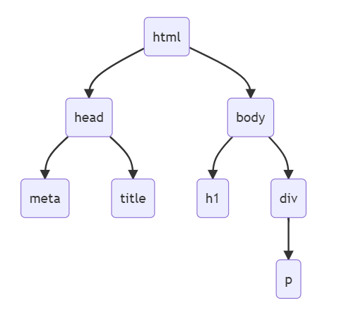

# JavaScript 学习笔记：前端篇

> 本文部分内容节选自笔者于 2021 年出版的[《JavaScript 全栈开发》](https://book.douban.com/subject/35493728/)一书。

众所周知，网页浏览器是 JavaScript 最初的宿主环境，基于浏览器端的编程（即前端编程）也是这门脚本语言应用得最为成熟的领域。而这一领域编程也是时下最热门的技术议题之一，能否充分发挥 JavaScript 语言在浏览器端强大处理能力直接关系到我们所构建的 Web 应用程序的核心竞争力。在这篇笔记中，我们将具体为读者介绍如何使用这门语言处理浏览器端的工作。

## 前端编程概述

在基于网页浏览器的编程环境中，我们所使用的 JavaScript 语言其实是由三部分组成的。首先是语言的核心部分：ECMAScript，再来就是用于操作 HTML 文档的文档对象模型（DOM）和用于操作浏览器部分功能的浏览器对象模型（BOM）。换而言之，我们在前端编程中主要面对的是以下两个对象模型：

- **文档对象模型**： 即 Document Object Model，简称 DOM，它是一组按照 W3C 组织的标准定义的、用于操作 HTML 及 XML 文档的应用程序接口，JavaScript 是通过这些接口来操作 Web 页面中的各种元素的。简而言之，就是 DOM 会在内存中将读取到的 HTML 或 XML 文档解释成一个树状的数据结构，然后让 JavaScript 以增、删、改、查该树形结构上节点并为其注册事件响应函数的形式来完成对 Web 页面的处理。

- **浏览器对象模型**： 即 Browser Object Model，简称 BOM，该对象模型中包含了`windows`、`navigator`、`screen`、`history`、`location`等一系列与浏览器功能相关的对象组件，JavaScript 是通过它们来实现窗口的弹出与平移、获取浏览器名称、版本号、用户的操作系统、用户机器的屏幕分辨率以及用户之前的访问记录等超出 HTML 文档范围的、Web 应用的客户端功能。当然了，由于 BOM 长期以来并没有统一的标准，每个浏览器都有自己的 BOM 实现，所以我们在使用 BOM 时经常会遇到各种兼容性问题，但读者也不必太过担心，在 HTML5 标准发布并被广泛采用之后，这个问题已经得到了很大程度的解决，如今的主流浏览器几乎都采用了相同的对象实现，这些对象的方法和属性被约定俗成地统称为 BOM 的方法和属性。

除此之外，由于前端编程面对的环境是 Web 应用程序的用户界面，界面的装饰美化也是我们需要关注的任务。因此，以 CSS 为代表的 Web 美工技术也是我们学习前端编程必须要具备的基础知识。况且，如今在 JavaScript 的具体使用中，我们在选取页面元素时也会用到不少 CSS 选择器的使用思维。当然了。本书预设读者已经掌握了从 HTML5 到 CSS3 的所有相关基础技术，这里只是强调一下它们在前端开发中的重要性，具体就不做专门的介绍了，读者如果有需要的话，请自行阅读相关资料，补足相关的基础再继续后面的学习。

> 关联笔记：[[HTML 学习笔记]] [[CSS 学习笔记]]

当然了，除了与 HTML 和 CSS 相关的基础知识之外，初学者在具体学习如何在前端环境中使用 JavaScript 之前，还需要先对网页浏览器在前端编程中所扮演的角色要有一个基本的了解。下面，我们就来简单介绍一下这部分的基础知识。

### 浏览器的角色

正如我们之前所说，要学习 Web 应用程序的开发就必须要先分清楚浏览器和服务器在 B/S 架构下各自所扮演的角色，它们的分工具体如下：

- Web 服务器在 B/S 架构下所承担的角色通常被称之为 Web 应用程序的“后端”，主要负责存储并处理用户提交的请求数据，然后把响应数据返回给用户所在的 Web 浏览器。它一般用于处理较为复杂的业务逻辑，包括执行大型计算、存储海量数据等，开发与维护的成本都比较高。

- Web 浏览器在 B/S 架构下所承担的角色通常被称之为 Web 应用程序的“前端”，主要负责提供应用程序的用户操作界面，以及向 Web 服务器提交请求数据并接收来自服务器的响应数据。它一般用于处理与用户交互相关的业务逻辑，包括呈现数据、响应用户操作等。这部分的开发与维护成本主要受到浏览器的影响较大。

从上述分工可以看出，如果我们要想进行 Web 应用程序的前端开发，首先必须要熟悉应用程序主要面向的执行环境 —— 网页浏览器。就目前来说，浏览器之间差异主要来自于它们采用的渲染引擎。下面，让我们来对如今市面上主流的浏览器渲染引擎做个简单的介绍：

- **Trident**：Internet Explorer 浏览器采用的渲染引擎，除此之外，采用该渲染引擎的浏览器还有：Avant、Sleipnir、GOSURF、GreenBrowser 和 KKman 等。由于 Internet Explorer 浏览器是市占率最高的桌面操作系统 —— Windows 系统的内置浏览器，所以除非我们想开发一个小众的应用程序，否则就不能忽视采用这一引擎的浏览器。而且直到目前为止，国内主要的网上银行还都只支持 Internet Explorer 浏览器。
  
  由于 Internet Explorer 浏览器曾经长期处于垄断地位（从 Windows 95 的年代一直到 Windows XP 初期），一家独大的心态使得微软在很长一段时间内都惰于更新浏览器引擎，这让 Trident 引擎一度与 W3C 标准近乎脱节，并且累积了大量的安全性漏洞。也正因为如此，许多开发者和学者对采用这一引擎的浏览器一直都颇有微词，这客观上也促使了很多用户转向了采用其他引擎的浏览器。

- **Gecko**：最初是 Netscape 浏览器采用的渲染引擎，后来的 FireFox 浏览器也采用了这一引擎。由于 Gecko 是一款完全开源的浏览器渲染引擎，全世界的开发者都可以为其编写代码，因此受到许多人的青睐，采用 Gecko 引擎的浏览器也很多，除了被使用最多的 Firefox 浏览器，还包括 Mozilla SeaMonkey、waterfox、Iceweasel、K-Meleon 等。

- **Webkit**：最初是 Safari 浏览器采用的渲染引擎，后来的 Chrome 浏览器也采用了这一引擎 。在很长的一段时间里，该渲染引擎都只是 macOS 系统上 Safari 浏览器的专用引擎，非常小众。但随着 Safari 浏览器推出了 Windows 版，和 Chrome 浏览器的加入，以及这两款浏览器在分别在 iOS 和 Android 等移动端操作系统上所占据的主导地位，该浏览器引擎安全、稳定、快速的优势得到了极大的发挥。目前，Chrome 浏览器的市占率已经超越了 Internet Explorer，成为了浏览器领域新的领头羊。

在了解了主流浏览器采用的渲染引擎之后，我们就可以来介绍一下浏览器的工作原理了。正如我们之前所说，浏览器的主要功能就是向 Web 应用程序所在的服务器发出请求，然后在浏览器窗口中展示服务器返回来的响应数据。这里所说的响应数据一般是包括 HTML 文档、PDF 文档、图片、视频等不同类型的资源。具体来说，浏览器按照分工可以分成以下几个组成部分：

- **用户界面**：用户所请求的资源位置通常要通过 URI（统一资源标示符）的形式在浏览器的地址栏中或者用之前保存在浏览器中的书签来指定。除此之外，Web 页面的导航通常也需要通过浏览器显示区中的页面元素，或工具栏中的前进/后退按钮以及菜单栏中的历史列表来完成。这些功能都是浏览器的用户界面来提供的，它会负责将用户的请求数据交付给浏览器引擎，由后者将其发送给服务器。

- **浏览器引擎**：这一部分主要负责在用户界面和渲染引擎之间传送数据与操作指令，以及向服务器发送请求并接收响应，它是整个浏览器的调度中心。

- **页面渲染引擎**：这一部分主要负责显示响应数据的内容。具体来说，就是浏览器在收到服务器返回的响应数据之后，就会将其交给渲染引擎。如果返回的响应数据是 HTML 文档。它就负责解析 HTML 和 CSS 内容，并将解析结果排版后显示在屏幕上。如果返回的响应数据是 JavaScript 脚本代码，它就负责去调用 JavaScript 解释器，以便解释执行这些脚本代码。

- **前端数据存取**： Web 应用程序在某些情况下也会需要在客户端保存一些数据，例如用户允许浏览器记住的用户名和密码等，这时候就需要用到 Cookie 以及 HTML5 新定义的“网络数据库”这一类浏览器端的数据存储功能。

### 前端编程任务

由浏览器在 B/S 架构中扮演的角色可以看出，所谓 Web 应用程序的前端开发，应该主要包含以下任务：

- 第一： **设计 Web 应用的用户界面**：这部分的任务包括用 HTML 来定义的网页结构，和用 CSS 来设计的网页样式。在这部分工作中，我们会决定 Web 应用要在浏览器中呈现的标题、段落、列表、表格、图片以及音乐、视频等多媒体页面元素，这是基本的，也是我们后续工作的基础所在。

- 第二： **赋予 Web 应用的用户界面与用户交互的能力**：这部分的任务包括响应网页上所有被注册了相关事件的元素，以及部分用户对浏览器本身所做的操作，譬如前进/后退的导航按钮、将某些数据存储到 Cookie 中等。这部分工作我们就主要是通过 JavaScript 这一类浏览器脚本语言来实现的。

在明确了前端开发中要完成的具体任务之后，接下来，我们就可以来具体研究如何使用 JavaScript 语言来完成这些任务了。下面，让我们先从用于操作 HTML/XML 元素的、最基础的 DOM 接口开始。

## 文档对象模型简介

在这一节中，我们将详细为读者介绍文档对象模型（即 DOM）。首先，我们会简略地回顾一下 DOM 的发展历程。以便读者能更全面地理解 DOM 标准规范的来龙去脉，发展现况以及使用思路。然后，我们会借助大量示例来演示如何在 JavaScript 中用 DOM 处理 HTML 文档中的各种页面元素。

### 起源与标准化历程

正如我们之前所说，DOM 是 由 W3C 组织负责标准化的一套最初只针对 XML 文档，后来逐步扩展到 HTML 文档的应用程序接口。和 JavaScript 一样，在标准化的文档对象模型出现之前，由于微软和网景这两家公司在浏览器市场上的恶性竞争，Web 应用的开发者们经历过一段较为黑暗的时代。在那个混沌的年代里，Internet Explorer 4 和 Netscape Navigator 4 各自实现的是不同的 DHTML（即 Dynamic HTML）接口，彼此在很多地方都互不兼容，这让 HTML 面临着失去跨平台的先天性优势的危机，而开发者们为了扩展 Web 应用的市场。又必须要尽可能地维持程序在双方浏览器上的兼容性，这往往需要付出非常大的精力来构建一些看起来极不优雅并且后期难以维护的解决方案。时至今日，笔者每每回忆起那些岁月所做的 Web 开发，其过程真是让人苦不堪言。

于是，为了响应广大开发者的呼声，对软件寡头们之间的恶性竞争行为进行约束，负责制定 Web 通信标准的 W3C 组织制定出了一套统一面向 XML 和 HTML 文档的应用程序接口规范，即 DOM 标准。这套标准按照其制定进展，各大浏览器对 DOM 的支持通常被分为以下几个级别：

- **DOM 0**：该级别在标准化的意义上其实是不存在的，因为它实际上是标准化初级阶段的 DOM，大部分实现还停留在实验阶段，但如今开发者们习惯上将其称之为 DOM 0。在实现了这一级别的浏览器中，具有代表性的就是分别在 1997 年的 6 月和 10 月发布的 Internet Explorer 4 和 Netscape Navigator 4、这两款浏览器都各行其是地定义了一组用于操作 HTML 文档的应用程序接口，从而使 JavaScript 的功能得到了大大地扩展，如今我们更习惯将这些扩展称之为 DHTML。需要说明的是，DHTML 并不是一项新技术，而是将 HTML、CSS、JavaScript 技术组合的一种描述。即：

    – 利用 HTML 标签将 Web 页面划分为各种页面元素。
    – 利用 CSS 样式来设置这些页面元素的外观及位置。
    – 利用 JavaScript 脚本来操控页面元素及其外观样式。

    但正如之前所说，由于没有统一的规范和标准，这两款浏览器对相同功能的实现确完全不一样。为了保持程序的兼容性，Web 开发者们必须先写一些探测性的代码来检测一下自己编写的 JavaScript 脚本到底运行于哪一款浏览器之下，然后再切换至与之对应的脚本片段。但这就让 Web 应用程序的代码变得前所未有的臃肿，且难以维护，DHTML 也因此在人们心中留下了非常糟糕的印象。

- **DOM 1**：W3C 组织在结合了各方浏览器实现的优点之后。于 1998 年的 10 月完成了第 1 级的 DOM，我们习惯上称之为：DOM 1。DOM 1 主要定义了 XML 和 HTML 文档的底层结构，它主要由 DOM Core 和 DOM HTML 两个部分组成。其中，DOM Core 规定的是 XML 文档的结构标准，该标准简化了我们对文档中页面元素的操作。而 DOM HTML 则是在 DOM Core 的基础上做了进一步的扩展，添加了许多面向 HTML 文档的对象和方法，譬如用于表示整个文档的document对象及其方法。

- **DOM 2**：DOM 2 引入了更多的交互能力，也支持了更高级的 XML 特性。DOM 2 在原来 DOM 1 的基础上又扩充了鼠标、键盘等用户界面事件，并通过对象接口增加了对 CSS 的支持。DOM 2 中的 DOM Core 也经过扩展开始支持 XML 命名空间。具体来说就是，DOM 2 在 DOM 标准中引入了下列模块：

    – DOM Views：该模块定义了跟踪不同文档视图的接口。
    – DOM Events：该模块定义了事件和事件处理的接口。
    – DOM Style：该模块定义了基于 CSS 样式为页面元素设置外观的接口。
    – DOM Traversal & Range：该模块定义了遍历和操作文档树的接口。

- **DOM 3**：DOM 3 在 DOM 2 的基础上进一步扩展了 DOM，它继续在 DOM 标准中引入了以下模块：
    – DOM Load & Save：该模块定义以统一方式加载和保存文档的接口。
    – DOM Validation：该模块定义了验证文档的接口。
    – DOM Core 的扩展：增加了对 XML 1.0 规范的支持，包含了 XML Infoset、XPath 和 XML Base 等组件。

除此之外，W3C 组织也制定了一系列专用标记语言的 DOM 扩展标准。例如：用于制作矢量图的 SVG，用于编写数学公式的 MathML，用于描述多媒体的 SMIL 等，这些都是基于 XML 扩展而来的标记语言，DOM 标准也为它们定义了专用的应用程序接口。

当然，W3C 组织只负责制定标准，浏览器对标准的实现完成度才是我们在编程过程中所要面对的实际问题。幸运的是，经过多年的努力，如今的 Chrome 和 Firefox 等主流浏览器都基本实现了 DOM 标准制定的接口，但由于一些历史遗留问题，Internet Explorer 浏览器在实现 DOM 标准的同时，依然保留了大量标准化之前的 OnlyIE 的接口。这样做主要是为了确保大量旧时代的代码依然能正确运行，作为标准化之后的开发者，我们在编写新的代码时就不宜再使用这些接口了。关于这一点，我们稍后在具体介绍 DOM 接口的调用时会特别举例说明。

### DOM 的树状结构

在具体使用 DOM 之前，我们首先要明确一个概念，即 DOM 只是一套用于处理 XML 和 HTML 文档的应用程序接口，它并不是 JavaScript 专有的，VBScript、Python 等脚本语言也一样可以调用这套接口。所以换句话说，DOM 本质上是一套以 XML 这类结构化标记语言为中心的编程工具，它的设计目的是为 XML 和 HTML 这类文档提供一种映射在内存中的数据结构，以便其他编程语言可以在程序运行时通过该数据结构来操作文档，从而改变文档的结构，样式和内容。具体来说就是，DOM 会将其读取到的 XML 和 HTML 文档映射到在内存中一个树状的数据结构上，文档界面中的每个页面元素都会被解析成该树状结构上的节点，然后其他脚本语言就可以通过增、删、改。查这些节点来完成对这些文档的处理。举个例子，对于下面这个 HTML 文档：

```html
<!DOCTYPE html>
<html lang="zh-CN">
    <head>
        <meta charset="UTF-8">
        <title>浏览器标题栏文字</title>
    </head>
    <body>
        <h1>网页一级标题</h1>
        <div>
            <p>网页正文内容</p>
        </div>
    </body>
</html>
```

如果我们想要在程序中直接对上述文本进行解析，那就得从上到下逐行读取，然后用词法分析算法处理每一行中的语法标记，整个过程是非常复杂的，基本上是在亲手实现一个网页浏览器，这完全不符合编程方法中“不重复发明轮子”的原则，现在有了 DOM 标准接口，浏览器就会自行根据其读取到的文档在内存中创建一个与之相对应的树状数据结构，该数据结构其大致如下图所示：



然后，我们就只需要直接在 JavaScript 或 VBScript 脚本中对该树状结构进行操作即可。换句话说，开发人员现在不必再去亲自解析 XML 和 HTML 文档的具体文本了，DOM 已经将目标文档转换成了内存中一个可直接操作的树状结构，并且其接口设计完全适用于面向对象编程，这显然就大大简化了 Web 应用程序开发的复杂度。

### 节点类型及其接口

如果我们之前学过数据结构的基础理论，就该知道“树（Tree）”是一种以开枝展叶的形式将多个节点链接起来的多层结构体。其             节点之间的关系非常类似于传统家庭里的父系族谱，从被称为“根”的单一节点往下，每一个节点都与其上下一层的节点之间是父子辈关系，与同一层节点之间是兄弟关系。例如在上面的 DOM 结构示意图中，`html`节点是整个树状结构的根节点，`head`和`body`则是它的两个子节点，而`h1`和`div`这两个节点则又是`body`节点的子节点。与此同时，由于`h1`和`div`来自同一个父节点，所以它们彼此是兄弟节点的关系。

所以在 DOM 标准所定义的接口中，节点（Node）是我们可操作的最基本类型。其树状数据结构中的每一个节点都对应着 HTML 文档中的一个标签元素。为了便于对所有的节点进行统一处理，DOM 标准定义了一套适用于所有 DOM 节点对象的接口，下面我们来介绍其中比较常用的一些属性和方法：

- **`nodeType`属性**：该属性值是一个从 1 到 12 的整数常量，每个常量都代表着一种类型的 DOM 节点对象，具体如下：

    | 常量标识符                  | 常量值 | 相关说明                                                         |
    | --------------------------- | ------ | ---------------------------------------------------------------- |
    | Node.ELEMENT_NODE           | 1      | 代表 XML 或 HTML 文档中的页面元素，通常对应着一个具体的页面标记。   |
    | Node.ATTRIBUTE_NODE         | 2      | 代表页面元素的某一个属性，譬如div元素的id属性。                    |
    | Node.TEXT_NODE              | 3      | 代表页面元素或其属性中的文本内容，譬如p元素中的文本。               |
    | Node.CDATASECTIONNODE       | 4      | 代表文档中用<![CDATA[]]>表示声明的不需要解析的文本。               |
    | Node.ENTITYREFERENCENODE    | 5      | 代表实体引用，常见于 XML 文档中。                                 |
    | Node.ENTITY_NODE            | 6      | 代表实体，常见于 XML 文档中。                                     |
    | Node.PROCESSINGINSTRUCTIONNODE | 7      | 代表ProcessingInstruction对象，常见于 XML 文档。                  |
    | Node.COMMENT_NODE           | 8      | 代表文档中的注释节点，即<!--注释内容--->标签的内容。               |
    | Node.DOCUMENT_NODE          | 9      | 代表整个文档，即DOM 树的根节点：document对象。                     |
    | Node.DOCUMENTTYPENODE       | 10     | 代表文档采用的接口版本，譬如<!DOCTYPE html>代表的是 HTML5。        |
    | Node.DOCUMENTFRAGMENTNODE   | 11     | 代表 HTML 文档的某个部分，但它没有对应的元素标签，也不直接显示在浏览器中。 |
    | Node.NOTATION_NODE          | 12     | 代表 DTD 中声明的符号。                                           |

    但在通常情况下，我们只需要记住以下几种常用的节点类型即可：

    | nodeType值 | 对应的节点类型 |
    | ---------- | -------------- |
    | 1          | 元素节点       |
    | 2          | 属性节点       |
    | 3          | 文本节点       |
    | 8          | 注释节点       |
    | 9          | 文档节点       |

    当然了，我们在之前的那一张表中也看到了，DOM 标准事实上是为这些常量定义了相应的常量标识符的，譬如元素节点是`node.ELEMENT_NODE`、属性节点是`node.ATTRIBUTE_NODE`、文本节点是`node.TEXT_NODE`、注释节点是`node.COMMENT_NODE`、文档节点是`node.DOCUMENT_NODE`等。奈何并不是所有的浏览器都支持了这些标识符（譬如微软的 IE8 及其更早的版本就不支持它们），所以我们通常还是直接使用数字来判断节点类型。

- **`nodeName`属性**：该属性的值取决于节点的具体类型，常见情况如下：

  - 元素节点的`nodeName`属性值是其对应的 HTML 标签名。
  - 属性节点的`nodeName`属性值与其对应 HTML 标签的属性名相同。
  - 文本节点的`nodeName`属性值始终为`#text`。
  - 注释节点的`nodeName`属性值始终为`#comment`。
  - 文档节点的`nodeName`属性值始终为`#document`，

- **`nodeValue`属性**：该属性的值也取决于节点的具体类型，常见情况如下：

  - 元素节点的`nodeValue`属性值是`undefined`或`null`。
  - 属性节点的`nodeValue`属性值是其对应 HTML 标签属性的值。
  - 文本节点的`nodeValue`属性值是其对应 HTML 标签中的文本本身。

  请注意：如果希望返回指定元素节点中的文本，请务必要记住文本始终位于文本节点中，我们必须先获取该元素节点下面的文本节点，才能读取到这段文本。例如，假设我们要获取`element`这个元素节点下的文本，就应该这样写：

    ```javascript
    const someText = element.childNodes[0].nodeValue;
    ```

- **`childNodees`属性**：事实上，我们在上面的代码中已经迫不及待地使用该属性了，这也间接说明了它是节点接口中最常用的属性之一。该属性中存储的是当前节点的所有子节点，这是一个实现了迭代器接口的`NodeList`对象，我们可以将其作为一个数组对象来使用，譬如对其进行如下遍历：

    ```javascript
    for(let i = 0; i < element.childNodes.length; ++i) {
        console.log(element.childNodes[i].nodeName);
    }
    ```

    或者直接通过`for-of`循环，利用迭代器接口来完成遍历：

    ```javascript
    for(let aNode of element.childNodes) {
        console.log(aNode.nodeName);
    }
    ```

- **`firstChild`属性**：该属性引用的是当前节点的第一个子节点，即`aNode.childNodes[0]`的值。

- **`lastChild`属性**：该属性引用的是当前节点的最后一个子节点，即`aNode.childNodes[aNode.childNodes.length-1]`的值，而当某个节点只有一个子节点时，其`firstChild`属性和`lastChild`属性指向的是同一个节点。

- **`parentNode`属性**：该属性引用的是当前节点的父节点，当且仅当当前节点为根节点时，该属性值为`null`。

- **`previousSibling`属性**：该属性引用的是当前节点的前一个兄弟节点，即该节点在其共同父节点的`childNodes`属性中的索引位置是当前节点的前一个，当且仅当当前节点为其父节点的第一个节点时，该属性值为`null`。

- **`nextSibling`属性**：该属性引用的是当前节点的后一个兄弟节点，即该节点在其共同父节点的`childNodes`属性中的索引位置是当前节点的后一个，当且仅当当前节点为其父节点的最后一个节点时，该属性值为`null`。

- **`appendChild()`方法**：该方法的作用是在当前节点的`childNodes`属性的最后一个索引位置后面再继续添加一个子节点，它只接收一个节点类型的实参，用于传递要添加的节点。例如：

    ```javascript
    aNode.appendChild(newNode);
    console.log(aNode.lastChild == newNode); // 输出：true
    ```

- **`insertChild()`方法**：该方法的作用是在当前节点的`childNodes`属性中指定位置的前面再继续添加一个子节点，它接收两个节点类型的实参，第一个实参用于传递要添加的节点，第二个实参用于指示节点的添加位置，通常是`childNodes`属性中的某个现有节点，新节点会被添加在该节点之前，而当该实参值为`null`时，就相当于调用了`appendChild()`方法，新节点会被添加到`childNodes`列表的末尾。与此同时，该方法也会返回这个新添加的节点。下面来看几个示例：

    ```javascript
    // 将新节点添加到第一个子节点前面
    const returnNode = aNode.insertChild(newNode, aNode.firstChild);
    console.log(aNode.firstChild == newNode);  // 输出：true
    console.log(returnNode == newNode);        // 输出：true

    // 将新节点添加到最后一个子节点前面
    aNode.insertChild(newNode, aNode.lastChild);
    console.log(aNode.lastChild.previousSibling == newNode);  // 输出：true

    // 将新节点添加为最后一个子节点
    aNode.insertChild(newNode, null);
    console.log(aNode.lastChild == newNode);  // 输出：true
    ```

- **`replaceChild()`方法**：该方法的作用是用一个新节点去替换当前节点的某一个被指定的子节点，它接收两个节点类型的实参，第一个实参传递的是将被用于替换的新节点，第二个实参指向的是当前节点的某个子节点，它是我们的替换目标，并且将作为方法的返回值被返回。下面来看几个示例：

    ```javascript
    // 替换当前节点的第一个子节点
    const oldNode = aNode.firstChild;
    const returnNode = replaceChild(newNode, aNode.firstChild);
    console.log(aNode.firstChild == newNode); // 输出：true
    console.log(returnNode == oldNode);       // 输出：true

    // 替换当前节点的最后一个子节点
    const oldNode = aNode.lastChild;
    const returnNode = replaceChild(newNode, aNode.lastChild);
    console.log(aNode.lastChild == newNode); // 输出：true
    console.log(returnNode == oldNode);       // 输出：true
    ```

- **removeChild()`方法**：该方法的作用是移除一个指定的当前节点的子节点，它只接收一个节点类型的实参，用于指定需要被移除的节点，并将其作为返回值返回。下面来看几个示例：

    ```javascript
    // 移除当前节点的第一个子节点
    const oldNode = aNode.firstChild;
    const newFirstChild = aNode.firstChild.nextSibling;
    const returnNode = removeChild(aNode.firstChild);
    console.log(aNode.firstChild == newFirstNode); // 输出：true
    console.log(returnNode == oldNode);            // 输出：true

    // 移除当前节点的第一个子节点
    const oldNode = aNode.lastChild;
    const newLastChild = aNode.lastChild.previousSibling;
    const returnNode = removeChild(aNode.lastChild);
    console.log(aNode.lastChild == newLastNode);   // 输出：true
    console.log(returnNode == oldNode);            // 输出：true
    ```

- **`cloneNode()`方法**：该方法的作用是复制当前节点，它只接收一个布尔类型的实参。当实参值为`false`时，该方法执行的是浅拷贝，它返回的是当前节点的引用。当实参值为`true`时，该方法执行的是深拷贝，它会将当前节点及其所有子节点全部重新复制一份，并该副本的引用返回。下面来看个示例，假设`aNode`节点的内容如下：

    ```html
    <div id="targetID">
        <p>这是一个 div 区域。</p>
    </div>
    ```

    我们就可以对它编写如下代码：

    ```javascript
    // 浅拷贝
    const shallowCopy = aNode.cloneNode(false);
    console.log(shallowCopy.childNodes.length);  // 输出：0

    // 深拷贝
    const deepCopy = aNode.cloneNode(true);
    console.log(deepCopy.childNodes.length);    // 输出：3
    ```

细心的读者可能已经发现了，上面这些的代码大多数都无法直接执行，因为我们既没有介绍当前节点`aNode`如何获取，也没有介绍新节点`newNode`如何创建，代码根本就是无的放矢，没有具体操作对象。这是因为这两个操作都要取决于节点的具体类型，接下来就让我们来补上这一课吧。

正如我们之前所说，DOM 节点的类型实际上有 12 种，但其中的绝大部分不是在 HTML 文档中不太常用，就是因在各大浏览器中的行为尚不一致而不被推荐，所以我们实际需要熟悉并时常用到的节点类型只有之前在第二张表中列出的元素节点、属性节点、文本节点、注释节点以及文档节点。下面，我们就逐一来介绍一下这些节点类型以及它们所提供的接口。

- **文档节点**：文档节点通常用于代表一整个 XML 或 HTML 文档，换句话说，一个文档的 DOM 树状结构中往往有且只能有一个文档节点。文档节点的`nodeType`的值为 9、`nodeName`的值为`#document`、`nodeValue`的值为 null。而在浏览器环境下，文档节点事实上是一个名为`document`的全局对象，我们通常都是通过这个对象来获取当前 HTML 页面中的信息，并对页面中的元素执行各种操作的。下面，我们就来了解一下 DOM 标准为文档节点定义的专用接口（文档节点自然也继承了上一节中介绍的所有统一节点接口，这里就不重复介绍了）：

  - `documentElement`属性： 在 HTML 文档中，这个属性代表的是当前页面的`<html>`标签，它在 DOM 树状结构中对应着一个元素类型的节点。在某些浏览器的实现中，该节点有时也是文档节点的的第一个子节点。对此，我们可以用下面的代码来验证一下：

    ```javascript
    const htmlNode = document.documentElement;
    console.log(htmlNode == document.firstChild);
    // 某些浏览器会输出 false，而另一些则输出 true。
    ```

  - `body`属性： 在 HTML 文档中，这个属性代表的是当前页面的`<body>`标签，它在 DOM 树状结构中也对应着一个元素类型的节点。由于在 Web 开发中，我们要执行绝大部分操作针对的都是该节点的子节点，所以该属性应该是`document`对象使用率最高的属性之一了。与此同时，它在通常情况下还应该是上述`htmlNode`节点的最后一个子节点，我们可以接着上面的代码继续来验证一下：

    ```javascript
    const bodyNode = document.body;
    console.log(bodyNode == htmlNode.lastChild);
    ```

  - `title`属性： 该属性中存储的是`<title>`标签中的文本，该文本会通常出现在浏览器窗口的标题栏和标签页中。我们也可以用该属性来修改当前页面的标题，例如：

    ```javascript
    console.log(document.title); // 输出现有标题
    document.title = 'new title';
    console.log(document.title); // 输出：new title
    ```

  - `URL`属性： 该属性中存储的是当前页面在浏览器地址栏中显示的 URL，我们是通过该 URL 来向服务器发送访问当前页面的请求的。

  - `domain`属性： 该属性中存储的是当前页面的 URL 所属的域名，譬如，假设当前页面的 URL 是`http://owlman.org/index.htm`，该属性值就是`owlman.org`。

  - `referrer`属性： 该属性中存储的是链接到当前页面的那个页面的 URL。譬如，假设我们是通过`http://owlman.org/index.htm`这个页面访问到`http://owlman.org/readme.htm`的，那么，后者的该属性值就是`http://owlman.org/index.htm`。当然了，如果当前页面不来自任何页面，我们是亲自输入 URL 来访问它的，那该属性值就为`null`。

  - `anchors`属性： 该属性是一个类数组对象，其中存储的是当前页面中所有设置了`name`属性的`<a>`元素。

  - `forms`属性： 该属性也是一个类数组对象，其中存储的是当前页面中所有的`<form>`元素。

  - `images`属性： 该属性也是一个类数组对象，其中存储的是当前页面中所有的``元素。

  - `links`属性： 该属性也是一个类数组对象，其中存储的是当前页面中所有设置了`href`属性的`<a>`元素。

  - `getElementById()`方法： 该方法的作用是获取当前页面中指定`id`值的页面元素，如果当前页面中有`id`值相同的元素，就选取其中的第一个元素。在上一节中频繁出现的`aNode`节点通常就是用该方法来获取的。例如对于下面的 HTML 文档：

    ```html
    <!DOCTYPE html>
    <html lang="zh-CN">
        <head>
            <meta charset="UTF-8">
            <title>浏览器端JS代码测试</title>
            <link rel="stylesheet" type="text/css" href="style.css" />
            <script type="module" src="test.js"></script>
        </head>
        <body>
            <noscript>
                <p>本页面需要浏览器支持或启用JavaScript。</p>
            </noscript>
            <h1>浏览器端的JavaScript</h1>
            <div class="box" id="box_1">
                <p>这是一个 div 区域。</p>
            </div>
            <div class="box" id="box_2">
                <p>这是另一个 div 区域。</p>
            </div>
            </body>
    </html>
    ```

    如果我们想获取`id`值为`box_1`的`<div>`元素，就可以在其外链的`test.js`文件中编写如下代码：

    ```javascript
    const aNode = document.getElementById('box_1');

    // 浅拷贝
    const shallowCopy = aNode.cloneNode(false);
    console.log(shallowCopy.childNodes.length);  // 输出：0

    // 深拷贝
    const deepCopy = aNode.cloneNode(true);
    console.log(deepCopy.childNodes.length);    // 输出：3
    ```

    请注意：这里的`id`值在大部分浏览器中是严格区分大小写的，或许只有 IE7 及其早期版本例外。

    - `getElementsByName()`方法： 该方法的作用是返回一个类数组对象，其中包含了当前页面中所有设置了相同`name`值的元素。我们经常会在处理表单中的单选框时用到它，毕竟为了让浏览器知道哪一些单选框属于同一组互斥性选项，我们会将同一组单选框赋予相同的`name`值。

    - `getElementsByTagName()`方法： 该方法的作用是返回一个类数组对象，其中包含了当前页面中所有使用了相同标签的元素，例如，我们上面介绍某些类数组功能的属性也可以使用该方法来实现：

    ```javascript
    console.log(document.forms == document.getElementsByTagName('form'));
    console.log(document.images == document.getElementsByTagName('img'));
    ```

    - `getElementsByClassName()`方法： 该方法的作用是返回一个类数组对象，其中包含了当前页面中设置了相同`class`属性的元素。众所周知，在 HTML 文档中，元素的`class`属性主要是提供给 CSS 设计样式的，而有时候样式的设置需要 JavaScript 脚本的配合。例如，如果我们想为之前那个 HTML 文档中所有设置了`box`样式的元素注册一个鼠标单击事件，就可以在其外链的`test.js`文件中这样写：

    ```javascript
    const aClassNodes = document.getElementsByClassName('box');
    for(const tmpNode of aClassNodes) {
        tmpNode.onClick = function() {
            tmpNode.className = 'newStyle';
        }
    }
    ```

    当然，读者在这里暂时不必理会事件的概念，我们将会在之后的笔记中具体介绍这部分的内容。

    - `write()`方法： 该方法的作用是将其接收到的字符串类型的实参原样输出到`document`对象所代表的 HTML 文档中。

    - `writeln()`方法： 该方法的作用与`write()`方法基本相同，唯一的区别是该方法会在输出实参字符串的同时加上一个换行符。例如，我们可以在之前使用的 HTML 文档中`id`值为`box_2`的`div`元素后面再添加一个`<script>`标签，具体如下：

    ```html
    <!DOCTYPE html>
    <html lang="zh-cn">
        <head>
            <meta charset="UTF-8">
            <title>浏览器端JS代码测试</title>
            <link rel="stylesheet" type="text/css" href="style.css" />
            <script type="module" src="test.js"></script>
        </head>
        <body>
            <noscript>
                <p>本页面需要浏览器支持或启用JavaScript。</p>
            </noscript>
            <h1>浏览器端的JavaScript</h1>
            <div class="box" id="box_1">
                <p>这是一个 div 区域。</p>
            </div>
            <div class="box" id="box_2">
                <p>这是另一个 div 区域。</p>
            </div>
            <script>
                document.write('当前时间是：');
                const now = new Date();
                document.writeln(now.toLocaleDateString());
            </script>
        </body>
    </html>
    ```

    - `createElement()`方法： 该方法的作用是创建一个新的元素节点。例如，对于之前示例中没有详细说明来历的、代表新节点的`newNode`对象，我们可以这样创建：

    ```javascript
    const newNode = document.createElement('div');
    document.body.appendChild(newNode);
    ```

    如你所见，`createElement()`方法只接收一个代表新建元素标签名的字符串为实参，并且对于 HTML 标签来说，该实参值是不区分大小写的。关于元素节点本身的具体操作，我们稍后会详细介绍。

    - `createAttribute()`方法： 该方法的作用是创建一个新的属性节点。例如，我们可以这样为上面的`newNode`节点添加一个属性节点：

    ```javascript
    const attrNode = document.createAttribute('class');
    attrNode.value = 'box';
    newNode.setAttributeNode(attrNode);
    ```

    如你所见，`createAttribute()`方法也只接收一个字符串类型的实参，用来指明新建属性节点的名称。关于属性节点本身的操作，我们稍后会做详细介绍。

    - `createTextNode()`方法： 该方法的作用是创建一个新的文本节点，它也只接收一个字符串类型的实参，用来指定其创建节点所要容纳的文本。例如，我们可以这样为上面的`newNode`节点所代表的`<div>`标签中添加一段文本：

    ```javascript
    const textNode = document.createTextNode('这是box_4中的文本。');
    newNode.appendChild(textNode);
    ```

    关于文本节点本身的操作，我们稍后会做详细介绍。

    - `createComment()`方法： 该方法的作用是创建一个新的注释节点，它同样只接收一个字符串类型的实参，用来指定注释的内容。例如，如果我们想在上述`newNode`节点所代表的`<div>`标签中添加一段注释，可以这样做：

    ```javascript
    const myComment = document.createComment('这是一个用脚本添加的div元素。');
    newNode.appendChild(myComment);
    console.log(newNode.lastChild.data); // 输出：这是一个用脚本添加的div元素。
    ```

    我们稍后也会具体介绍注释节点本身的属性和方法。在这里需要注意的是，`document`对象虽然可以往 HTML 文档中写入字符串，或对文档中的特定元素执行各种增、删、改、查操作，但作为文档节点本身，它是只读的。换句话说，我们直接在`document`对象上调用`appendChild()`、`removeChild()`这一类增删直系子节点的方法是无效的。

- **元素节点**：在 DOM 的定义中，元素节点代表的是 XML 或 HTML 文档中的各种页面元素，其`nodeType`的值为 1、`nodeName`的值为它们各自对应的页面标签、`nodeValue`的值为 null。在 Web 前端开发的语境下，元素节点通常对应着一个具体的 HTML 标签。例如，之前调用的`document.body`属性返回的就是一个 HTML 标签为`<body>`的元素节点。严格来说，HTML 的每一种标签都对应着一种类型的元素节点，但在通常情况下，我们在处理元素节点时不需要进行如此细致的分类，只需要熟练掌握一部分通用的属性和方法就足以解决绝大部分问题了。下面就来介绍一下这些属性和方法，首先是任意一种元素节点都有的通用属性：

  - `tagName`属性： 该属性的作用是返回当前元素节点所对应的 HTML 标签，事实上可以认为这是`nodeName`属性的一个别名。但该属性专属于元素节点，无论从接口语义上，还是在名称上都显得要更直观一些，例如对于之前所用的 HTML 文档中的第一个`<div>`元素，我们可以这样查看它的标签名：

    ```javascript
    const aNode = document.getElementById('box_1');
    console.log(aNode.tagName);   // 输出：DIV
    ```

    需要注意的是，`tagName`属性返回的 HTML 标签名都是用大写字母来表示的，而对于 XML 标签，它返回的则是文档中实际使用的标签字符。所以，如果我们不清楚自己编写的脚本是用于处理 HTML 还是 XML，就必须要对`tagName`属性返回的字符串进行统一的大小写转换。

  - `id`属性： 该属性的作用是返回当前元素节点所对应 HTML 标签的id属性。例如对于上面的`aNode`节点，我们可以这样查看它的id属性：

    ```javascript
    console.log(aNode.id);  // 输出：box_1
    ```

  - `className`属性： 该属性的作用是返回当前元素节点所对应 HTML 标签的`class`属性，但由于`class`在 JavaScript 中属于语言本身的关键字，所以只能将其对应属性命名为`className`。例如我们可以这样查看`aNode`节点的`className`属性：

    ```javascript
    console.log(aNode.className); // 输出：box
    ```

  - `title`属性： 该属性的作用是返回当前元素节点所对应 HTML 标签的`title`属性，该属性主要用于对相关的页面元素进行说明，当鼠标悬停在该元素上时就会显示。例如我们可以这样查看`aNode`节点的`title`属性：

    ```javascript
    console.log(aNode.title);
    ```

  - `lang`属性： 该属性的作用是返回当前元素节点所对应 HTML 标签的`lang`属性，该属性主要用于声明相关页面元素及其子元素所采用语言的编码。例如在编写中文网页时，我们通常会这样编写`<html>`标签：`<html lang="zh-CN">`。当然，在一般元素节点中很少需要设置该属性。到了JavaScript 中，我们可以这样查看`aNode`节点的lang属性：

    ```javascript
    console.log(aNode.lang);
    ```

  - `dir`属性： 该属性的作用是返回当前元素节点所对应 HTML 标签的`dir`属性，该属性主要用于说明当前页面中文字的走向，它只有两个值，分别是代表从左向右的`ltr`和代表从右向左的`rtl`，当然了，这一属性在实际开发中也很少被用到，相关的工作一般会交由 CSS 来完成。例如我们可以这样查看`aNode`节点的`dir`属性：

    ```javascript
    console.log(aNode.dir);
    ```

    到目前为止，我们所介绍的这些属性反映的都是一个元素节点的基本信息。这些信息不仅可以读取。也可以在 JavaScript 中修改它们。例如，我们可以这样修改`aNode`节点的基本信息：

    ```javascript
    aNode.id = 'box_3';
    aNode.className = 'newBox';
    aNode.title = '第三段测试文本';
    aNode.lang= 'en';
    aNode.dir = 'rtl';
    ```

    当然，上面这些属性对应的都是每个 HTML 标签都有的通用属性，它们自然可以通过 DOM 节点对象的属性方式来操作。除此之外，还会有一些特定标签的专用属性，例如`<a>`标签的`href`属性、``标签的`src`属性等。基本上，对于 HTML 规范所定义的标签属性，DOM 中与之对应的元素节点对象都是有相应的属性的。例如，对于下面这个设置了`onclick`事件的`<a>`元素：

    ```html
    <a id="sayhello" href="#" onclick="alert('hello')">打个招呼</a>
    ```

    我们仍然可以通过 DOM 对象属性的方式来对其进行操作，像这样：

    ```javascript
    const sayhello = document.getElementById('sayhello');
    console.log(typeof sayhello.onclick);                  // 输出：function
    sayhello = function() {};
    ```

    除此之外，我们还可以选择调用 DOM 提供的三个属性方法：

  - `getAttribute()`方法： 该方法的作用是读取当前元素的指定属性，它会接收一个字符串类型的实参，用于指定要读取的属性名。需要注意的是，这里的属性名是要与当前元素对应的 HTML 标签的属性名相同。譬如对于`<div>`标签的`class`属性，我们传递给该方法的实参值就应该是`class`，而不是`className`了。下面，我们来具体演示一下该方法的使用：

    ```javascript
    // 获取当前页面中所有标签的src属性
    for(const image of document.images) {
        console.log(image.getAttribute('src'));
    }

    // 获取当前页面中所有<a>标签的href属性
    for(const link of document.links) {
        console.log(link.getAttribute('href'));
    }
    ```

    另外，需要注意的是，`getAttribute()`方法的实参值并不区分大小写，换句话说，`SRC`和`src`指定的是相同的属性名，如果该方法没有找到指定的属性名，就会返回 null。

  - `setAttribute()`方法： 该方法的作用是设置当前元素节点所对应 HTML 标签中指定属性的值，如果指定的属性不存在，那就创建该属性。它接收两个实参，第一个实参是一个用于指定目标属性名的字符串，该实参的用法规则与`getAttribute()`方法的实参完全相同。第二个实参则是目标属性的值。下面，我们来具体演示一下该方法的使用：

    ```javascript
    // 为当前页面中所有标签设置src属性
    for(let i = 0; i < document.images.length; ++i) {
        document.images[i].setAttribute('src', i+'.png');
    }
    ```

  - `removeAttribute()`方法： 该方法的作用是删除当前元素节点对应 HTML 标签中的指定属性，这一方法在实际开发中并不常用。

  但这三个方法存在着一个明显的问题，即它们都是以字符串的形式来增、删、改、查相应 HTML 标签中的属性的。换句话说，它们读取到的`onclick`属性是一段内容是 JavaScript 代码的字符串，而不是一个`function`类型的对象。我们可以用`typeof`操作符来验证一下使用 DOM 元素对象的属性与调用`getAttribute()`方法的区别：

    ```javascript
    console.log(typeof sayhello.onclick);                 // 输出：function
    console.log(typeof sayhello.getAttribute('onclick'));  // 输出：string
    ```
  
  正是出于这样的原因，在实际开发中，我们对于 HTML 规范定义的标签属性，基本都会采用 DOM 对象属性的方式来操作。但我们有时候也会为某些标签添加一些自定义属性，譬如在 HTML5 规范中，我们通常会定义一些名称以data-为前缀的可被验证的自定义属性，用来传递某些特定的数据，这些属性在对应的 DOM 对象中是没有相应属性的。通常只有对于这样的自定义属性，我们才会使用到getAttribute()方法。例如，对于下面这个带有自定义属性的<div>标签：

    ```html
    <div id="box_4" data-sayhello="hello"></div>
    ```

  我们可以分别用对象属性和调用`getAttribute()`方法这两种方式分别来访问一下上述`<div>`标签中的自定义属性`data-sayhello`的值，看看各自是什么结果：

    ```javascript
    const otherNode = document.getElementById('box_4');
    console.log(otherNode.data-sayhello);                  // 输出：NaN 或 undefined
    console.log(otherNode.getAttribute('data-sayhello'));  // 输出：hello
    ```

  如你所见，用对象属性方式访问标签自定义属性的结果是因浏览器而异的，有些浏览器会返回 NaN，有些浏览器则会返回 undefined。所以在实际开发中，我们通常会用`getAttribute()`方法来访问 HTML 标签的自定义属性。最后，如果我们在某些情况下需要以 DOM 节点对象的形式操作相关元素的属性的话，也可以选择调用以下三个方法：

  - `getAttributeNode()`方法： 该方法的作用是以 DOM 节点对象的形式读取当前元素中的指定属性，它接收一个字符串类型的实参，用于指定要读取的属性，并以节点对象的形式将其返回。
  - `setAttributeNode()`方法： 该方法的作用是以 DOM 对象节点的形式设置当前元素中的指定属性，它接收一个属性节点类型的实参，用于指定要设置的属性。如果指定属性不存在，就将该属性节点添加为当前元素的新属性。
  - `removeAttributeNode()`方法： 该方法的作用是以 DOM 对象节点的形式删除当前元素中的指定属性，它接收一个属性节点类型的实参，用于指定要删除的属性。

  关于以上三个方法的具体使用，我们将会留待详细介绍书信节点的时候再加以演示。

- **属性节点**：在 DOM 的定义中，属性节点代表的是 XML 或 HTML 文档中各种页面元素的属性，其`nodeType`的值为 2、`nodeName`的值为节点所代表的标签属性的名称、`nodeValue`的值为节点所代表的标签属性中存取的数据。在 Web 前端开发的语境下，属性节点通常对应着一个 HTML 标签的属性。例如，之前调用的`sayhello.onclick`属性返回的就是代表`<a>`标签元素的`onclick`属性的节点。属性节点对象主要提供了以下三个接口：

  - `name`属性：`nodeName`属性的别名，用于存取节点所代表标签属性的名称。
  - `value`属性： `nodeValue`属性的别名，用于存取节点所代表标签属性中的数据。
  - `specified`属性：该属性是一个布尔类型的值，用来表示该属性是用脚本代码设置的（值为`true`），还是原本就设置在 HTML 文档中的（值为`false`）。

  下面，我们可以用脚本创建一个 HTML 标签为`<div>`的元素节点，并在其中演示一下属性节点的使用：

    ```javascript
    // 用脚本创建新节点
    const newNode = document.createElement('div');
    document.body.appendChild(newNode);
    // 新建属性节点
    let attrNode = document.createAttribute('class');
    attrNode.value = 'box';
    // 为当前元素添加属性
    newNode.setAttributeNode(attrNode);
    // 重新获取属性节点
    attrNode = newNode.getAttributeNode(attrNode.name);
    // 以节点对象的形式修改当前元素的属性
    attrNode.value = 'newbox';
    newNode.setAttributeNode(attrNode);
    // 以节点对象的形式删除当前元素的属性
    newNode.removeAttributeNode(attrNode);
    console.log(attrNode.specified);  // 输出：true
    ```

    严格来说，属性节点通常并不被视为是 HTML 文档所对应 DOM 模型的一部分，它很少被当做独立的节点来使用。

- **文本节点**：在 DOM 的定义中，文本节点代表的是 XML 或 HTML 文档中各种页面元素中显示的文本，其`nodeType`的值为 3、`nodeName`的值为`#text`、`nodeValue`的值为节点所代表的那段文本。通常情况下，文本节点都位于 DOM 树状结构的末端，被认为是叶子节点，不再有子节点了。因此，文本节点上的操作基本是一些字符串处理，为此，DOM 为文本节点定义了以下接口：

  - `data`属性：`nodeValue`属性的别名，用于存取注释节点中的文本。
  - `appendData()`方法： 该方法的作用是将指定的文本加入到当前节点的现有文本的后面，它接收一个字符串类型的实参，用于指定要插入的文本。
  - `deleteData()`方法： 该方法的作用是将指定的文本从当前节点的现有文本中删除，它接收两个实参，第一个实参用于指定要删除文本的始起位置，第二个实参用于指定要删除文本的字符数。
  - `insertData()`方法： 该方法的作用是将指定的文本插入到当前节点的现有文本中，它接收两个实参，第一个实参用于指定要插入文本在现有文本中的始起位置，第二个实参用于指定要插入的文本。
  - `replaceData()`方法： 该方法的作用是用指定文本替换掉当前节点的现有文本中的某段文本，它接收三个实参，第一个实参用于要替换文本在现有文本中的始起位置，第二个实参用于指定现有文本中要被替换文本的字符数，第三个实参用于指定要替换的文本。
  - `splitText()`方法： 该方法的作用是按照指定位置分割当前节点中的现有文本，它接收一个用于指定分割位置的实参。
  - `subSrtingData()`方法： 该方法的作用是从当前节点的现有文本中读取某一段指定的文本，它接收两个实参，第一个实参用于指定要读取文本在现有文本中的始起位置，第二个实参用于指定要读取文本的字符数。

  下面，我们可以用脚本创建一个 HTML 标签为`<div>`的元素节点，并在其中演示一下上述接口的使用：

    ```javascript
    // 用脚本创建新节点
    const newNode = document.createElement('div');
    newNode.id = 'box_4';
    document.body.appendChild(newNode);
    // 创建文本节点
    const textNode = document.createTextNode('这是box_4中的文本。');
    newNode.appendChild(textNode);
    console.log(newNode.lastChild.data); // 输出：这是box_4中的文本。
    // 在现有文本后面添加文本
    textNode.appendData('你好！');
    console.log(newNode.lastChild.data); // 输出：这是box_4中的文本。你好！
    // 在指定位置添加文本
    textNode.insertData(0, 'test: ');
    console.log(newNode.lastChild.data); // 输出：test: 这是box_4中的文本。你好！
    // 读取指定文本
    console.log(textNode.substringData(0, 'test: '.length)); // 输出：test:
    // 替换指定文本
    textNode.replaceData(0,'test: '.length, '测试：');
    console.log(newNode.lastChild.data); 
                                    // 输出：测试：这是box_4中的文本。你好！
    // 删除指定文本
    textNode.deleteData(0, '测试：'.length);
    console.log(newNode.lastChild.data); // 输出：这是box_4中的文本。你好！
    ```

- **注释节点**：在 DOM 的定义中，注释节点代表的是 XML 或 HTML 文档中的注释标签。其`nodeType`的值为 8、`nodeName`的值为`#comment`、`nodeValue`的值为节点所代表注释标签中的文本。注释节点对象的接口与文本节点对象基本相同，它可以执行文本节点除`splitText()`方法之外的所有操作，例如对于下面这个带有注释标签的`<div>`标签：

    ```html
    <div id="box_5"><!--这是一个注释。---></div>
    ```

    注释标签应该是该`<div>`标签的第一个子节点，我们可以通过该子节点的`data`属性来读取其中的注释文本，并用`appentData()`方法添加内容，像这样：

    ```javascript
    const box_5 = document.getElementById('box_5');
    console.log(box_5.firstChild.data);          // 输出：这是一个注释。
    box_5.firstChild.appendData('测试。');
    console.log(box_5.firstChild.data);          // 输出：这是一个注释。测试。
    ```

### BOM 的使用

## 引入 jQuery
