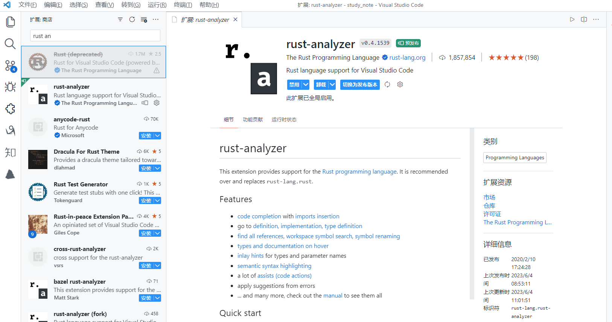
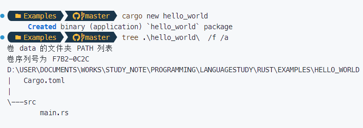
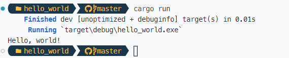

# Rust 学习笔记（持续更新中）

这篇学习笔记将用于记录本人在学习 Rust 编程语言过程中所编写的学习心得与代码。为此，我会在`https://github.com/owlman/study_note`项目的`Programming/LanguageStudy/`目录下创建一个名为的`Rust`目录，并在该目录下设置以下两个子目录：

- `QuickStart`目录用于存放 Markdown 格式的笔记。
- `Examples`目录则用于存放笔记中所记录的代码示例。

## 参考资料说明

- 参考书籍：
  - [《精通 Rust》](https://book.douban.com/subject/35290878/)：本人所采用的主要参考书；
  - [《Rust 实战》](https://book.douban.com/subject/36059499/)：本人所采用的补充参考书；
- 视频教程：
  - [Rust 编程语言入门教程](https://www.bilibili.com/video/BV1hp4y1k7SV?spm_id_from=333.999.0.0)：哔哩哔哩上的教学视频；

## 背景知识介绍

Rust 是一门由 Mozilla 公司主导开发的通用、编译型程序设计语言。这门语言的设计准则为“安全、并发、实用”，支持函数式、并发式、命令式等多种编程范式，目前被认为是自 C++ 以来最全能的系统级程序设计语言。它为系统编程领域提供了一种更安全、更快速且原生支持并发的现代化解决方案，因而具有相当的学习价值。当然了，按照学习一门编程语言的惯例，在进入具体的学习阶段之前，我们需要做一些知识准备工作。首先，让我们来了解一下该语言的起源故事，以便之后的学习过程中更好地理解它的设计思想。

### 语言的起源故事

[Rust 项目](https://github.com/rust-lang/rust) 最初是 Mozilla 公司员工、主要负责编译器实现的语言工程师 Graydon Hoare 在 2006 年开发的一个私人试验项目。众所周知，在上个世纪 70 年代末和 80 年代初，编程语言领域出现了许多优秀的设计理念，但这些理念中的许多设计都受限于当时的技术条件，并没有机会被转化成得到广泛使用的系统级语言，Graydon Hoare 希望能在该项目中通过结合现代编程语言的相关理论来重新设计一门系统级编程语言，目标是让开发者们在系统编程领域中能在得到比 C/C++更好的编码体验的同时，避开 Java/C# 这类语言因其自身附带的大型垃圾回收机制而产生的内存开销。关于这方面的详细信息，读者可参考[InfoQ 在 2012 年对 Graydon Hoare 本人的专访](https://www.infoq.com/news/2012/08/Interview-Rust/)。至于 Mozilla 公司本身，则是从 2009 年开始赞助这个项目的，他们成立了专门的团队来支持 Rust 的开发，并开始将其应用于实验性的 Servo 浏览器引擎项目。

2010 年之后，Rust 项目正式向公众发布产品，并于同年开始改写自托管编译器（基于 LLVM 后端）来替换原来用 OCaml 写的编译器。其发布方式主要分为 stable、beta、nightly 三个版本系列。其中，nightly 版本系列会每天迭代一次，主要用于开发者针对 Rust 语言的最新特性进行学习和研究。而 beta 版本系列则是针对一些相对成熟的特性发布的测试版本，每六周迭代一次，通常用于前瞻性的试验性开发。然后，beta 系列的版本在通过了六周的测试之后，就会被合并到 stable 版本系列中，后者是主要用于实际生产环境的稳定版本。基本上，Rust 项目的发布流程就像火车一样按照时刻表井然有序。

```bash
nightly: * - - * - - * - - * - - * - - * - * - *
                     |                         |
beta:                * - - - - - - - - *       *
                                       |
stable:                                *
```

值得一提的是，Rust 这个名字在英文中的原意指的是一种生命力很强的真菌，Graydon Hoare 希望 Rust 语言可以覆盖在死去语言的残骸之上，吸收这些旧语言的优秀特性，像真菌一样拥有多种可以互相转化的生命形态 [32]。Rust 的名字从字形上糅合了 Trust 和 Robust，也暗示了“信任”和“鲁棒性”。目前来看，Rust 确实拥有了极强的生命力，让我们期待一下 Rust 的永不休眠。

### 开源与社区生态

虽然 Rust 项目的主要资金来自 Mozilla 公司的资助，但本质上依然是一个由开发者社区共有的开源项目，它相当大一部分代码来自于开源社区的贡献者。因此，该项目有着完善的提案流程（RFC，Request For Comments），每一个人都可以提交提案，进行开发工作的核心团队细分为专项治理语言项目、社区运营、语言核心开发、工具开发、库开发等，来管理维护各个项目的各方面事项。

最近，由于受到新冠肺炎疫情的影响，Mozilla 公司在 2020 年 8 月宣布裁员四分之一，这其中包括了 Rust 开发团队，这显然是非常令人惋惜的。但塞翁失马焉知非福，由于 Rust 开发团队的专家们被裁后加入了 Facebook、Amazon、Google 等科技巨头公司，客观上或许也会更有利于 Rust 语言的推广，并获得更多资源支持。例如，Rust 基金会在2021 年 2 月宣布成立，其赞助商中就包括了华为、AWS、Google、Microsoft、Facebook 等一众计算机科技界的巨头企业，在这里，笔者真心希望该基金会能专注于促进 Rust 语言的开发与生态发展。

### 语言的优劣分析

正如 Graydon Hoare 在之前提到的那次采访中所说的，Rust 语言的目标群体是“被 C++ 所困扰的开发者”，它希望帮助人们以更简单明了的方式来设计安全且快速的系统级应用程序。这意味着，这门语言应该要既可用于实现针对机器底层的具体操作，也可用于完成针对业务逻辑的抽象设计。具体来说，开发者们可以通过学习和使用 Rust 这门编程语言来让自己在工作中获得以下能力：

- **可使用更有效率的编程工具链**：Rust 语言为开发者们提供了得到了精心维护且便于查询的官方文档、以及支持多种编辑器的完整工具链，其中提供了语法错误提示、智能自动补全、自动类型监测、自动格式化、包管理以及编译与构建等功能，使得开发者们可以在不使用任何第三方工具的情况下，轻松利用这一工具链进行高效的编程工作。
- **可进行更方便的多线程开发**：Rust 语言独特的所有权机制和内存安全的特性也为实现没有数据竞争的并发提供了语言层面上的原生支持。
- **可开发面向 WebAssembly 应用程序**：WebAssembly 的出现解决了人们希望在 Web 浏览器、嵌入式设备等环境中执行计算密集型操作的需求。而用 Rust 语言编写的代码可以被直接编译成 WebAssembly 程序，这样就能确保程序在上述执行环境中拥有与本地代码相似的执行速度。
- **可编写更安全的应用程序**：与 C/C++ 语言相比，Rust 语言可以利用其所有权、生命周期等特性来帮助开发者们在语言层面上去解决内存管理、数据布局等系统编程难题。
- **可获得更优秀的执行性能**：与 Java/C# 等语言相比，Rust 语言对内存安全的承诺并不依赖于庞大的运行时环境（Runtime Environment）与垃圾回收器机制（GC），这种遵循零成本抽象（Zero-Cost Abstraction）规则的设计在赋予了开发者更多底层操作能力的同时，也提高了应用程序的执行性能。

当然了，Rust 语言也是存在一些不足的，例如学习曲线陡峭就是一个经常被开发者们抱怨的问题。在 2020 年的一份调查报告中，约 15.8% 的开发者认为“如果 Rust 更好学一些，使用它的人会应该更多”，其中生命周期、所有权等概念对于初学者来说可能难以理解，特别是“生命周期”，有 61.4% 的反馈者认为难以理解或学习困难。除此之外，编译时间较长也是 Rust 社区一直在讨论的问题。在上面提到的那份报告中，约 50.5% 开发者感觉已经有一定的提升，但缩短 Rust 的编译时间仍然是 Rust 团队接下来的重要任务。

然而，这些不足并不妨碍 Rust 成为近年来最为热门的编程语言之一。根据 Stack Overflow 对开发者的调研显示，虽然只有 7% 的开发者表示自己正在使用 Rust，对比 JavaScript、Python 等语言，使用 Rust 的开发者占比并不高；但从 2016 年开始，Rust 每年都是开发者们最喜爱的编程语言。下面，让我们继续来了解一下能让该语言的上述优势得到发挥的主要领域：

- **学术研究**：Rust 语言在计算机专业领域中是一个很好的学术研究工具。例如，人们可以学习如何使用 Rust 语言开发操作系统，这个学习过程将帮助他们更好地理解操作系统中的各种概念。
- **团队合作**：对于开发者团队来说， Rust 语言是非常实用的工具。众所周知，低水平的程序代码会包含很多 bug，需要测试人员进行覆盖测试广泛验证。然而在 Rust 语言中，如果程序代码中包含 bug，编译器将拒绝编译代码，这样一来，开发者就可以更专注于程序的业务逻辑了。
- **商业开发**：到目前为止，已经有不少大大小小的公司选择使用 Rust 语言来完成各种商业开发的任务。这些任务包括命令行工具，Web 服务，DevOps 工具，嵌入式设备，音频和视频的分析和转码，加密货币，生物信息学，搜索引擎，物联网应用，机器学习，甚至是火狐浏览器的重要组成部分。
- **开源运动**：Rust 本身就是一门遵守 Apache 和 MIT 开源许可证的程序设计语言，这意味人们可以按照这些许可证赋予的权益参与各种 Rust 语言设计与推广的公益活动。

### 应用现状及案例

就目前的情况来看，安全问题通常是商业公司考虑采用 Rust 语言的首要原因，Rust 在没有牺牲性能的情况下提供了比 C/C++ 安全的系统编程，使其成为了更好的选择。但根据 JetBrains 2021 年的调研报告，出于兴趣或为私人项目选择 Rust 的开发者仍然占大多数，真正用于工作的开发者仅占 16%，而 Go 语言用于工作的开发者比例占到了 61%，差距明显。为 Rust 项目提供支持、给 Rust 开发者创造更多工作机会也是 Rust 基金会的目标之一。

下面，让我们来介绍一些知名的计算机科技公司对 Rust 语言的具体应用情况。

- **Google**：该公司于 2016 年开始开发一个名为 Fuchsia 操作系统，该项目在 2020 年 12 月首次亮相于 Google Open Source，项目中有 22% 的代码是使用 Rust 语言来编写的。
- **Microsoft**：该公司在 2019 年 2 月发布报告称其产品中 70% 的安全问题为内存安全问题，为了解决安全问题，开始尝试使用 Rust 来代替 C/C++ 重写 Windows 组件；除此之外，Microsoft 的 DeisLabs 团队也选择 Rust 来构建 Kubernetes 工具 Krustlet，并称 Rust 比 Go 更适合 Kubernetes 的开发。
- **Meta**：该公司最早使用 Rust 语言的项目可追溯到 2016 年。当时，Facebook 的源代码管理团队启动了一个名为 Mononoke 的重写项目，目标是改善公司内部使用的源代码管理工具，以便更好地服务于 Facebook 的数千名开发人员和自动化流程。当时，Facebook 的后端代码库非常依赖于 C++，这意味着 Mononoke 默认情况下应该用 C++来实现。但是源控制团队需要考虑源控制后端的可靠性需求。因为当损坏或停机可能导致服务中断时，可靠性显然是重中之重。这就是为什么团队选择在 C++ 代码库上使用 Rust 语言的原因。Mononoke 项目的生产实践，证明了 Rust 的实用性。
- **Amazon**：该公司于 2017 年开始在其提供的部分服务中采用了 Rust 语言，例如 Firecracker、Botterocket 等。
- **PingCAP**：该公司于 2016 年 1 月开始使用 Rust 语言来开发底层分布式储存 TIKV，并于 2016 年 4 月宣布将该项目开源。
- **字节跳动**：其远程办公系统“飞书”的开发团队从 2017 年开始在该项目中采用 Rust 语言，该系统在客户端的非 UI 部分就是依靠 Rust 语言来实现跨平台的。除此之外，该公司在 2021 年 5 月宣布开源的 rsmpeg 项目，也是选择了 Rust 来作为其主要的开发语言。

总而言之，Rust 语言的设计侧重于内存安全、零成本抽象和实用性，尤其是它致力于解决的内存安全问题一直以来是系统开发的痛点，传统领域如网络、数据库对于安全要求越来越高，新兴领域如区块链天然对于安全性就有极高的要求，因此 Rust 这门新的编程语言才能迅速获得国内外公司的青睐，成为 C/C++ 的有力竞争者。

## 开发环境配置

由于 Rust 的开发环境是基于 C/C++ 编译工具来构建的，这意味着在安装语言环境之前，我们的计算机上至少需要先安装一个 C/C++ 编译工具。换句话说，如果该计算机上使用的是类 UNIX 系统，它就需要先安装 GCC 或 clang。如果是 macOS 系统，则就需要先安装 Xcode。如果是 Windows 系统，则需要先安装 MinGW 之类的 C/C++ 编译工具。

### 安装开发工具

到目前为止，Rust 语言的开发工具大体上都是通过自动化脚本的形式来安装的。所以在确定安装了 C/C++ 编译工具之后，` 接下来要做的就是根据自己所在的操作系统来下载并执行用于安装 Rust 语言开发工具的脚本文件了。

- 如果想要在 Windows 系统下学习 Rust 语言，我们只需在搜索引擎中搜索“rust”关键字或直接在 Web 浏览器的地址栏中输入`https://www.rust-lang.org/`这个 URL 即可进入到 Rust 项目的官方网站，然后通过点击首页中的“install”链接，就会看到如下页面：

  

  在该页面中，我们可以根据自己所在的平台来下载 32 位或 64 位版本的安装脚本（通常是一个名为`rustup-init.exe`的二进制文件）。待下载完成之后，我们就可以双击执行该脚本文件，并遵循屏幕上的指示来安装（对于初学者，只需一路选择默认选项即可）。

- 如果想在类 UNIX 的系统环境（包括 WSL 环境)下学习 Rust 语言，我们只需直接在 Bash 之类的终端环境中执行下面的 Shell 代码，并遵循终端返回的指示信息来安装（对于初学者，只需一路选择默认选项即可）。

  ```bash
  # 可选步骤：设置国内下载镜像
  echo "export RUSTUP_DIST_SERVER=https://mirrors.ustc.edu.cn/rust-static" >> ~/.bashrc
  echo "export RUSTUP_UPDATE_ROOT=https://mirrors.ustc.edu.cn/rust-static/rustup" >> ~/.bashrc
  source .bashrc

  # 第一步：下载并执行安装脚本
  curl --proto '=https' --tlsv1.2 -sSf https://sh.rustup.rs | sh

  # 第二步：安装完毕后刷新环境变量
  source ~/.cargo/env
  ```

需要注意的是，我们在默认情况下安装的 Rust 开发环境是属于 stable 这一版本系列的。正如之前所说，这一系列的版本每六周迭代一次，在各方面的配置上都会偏向于确保生产环境的稳定性。但如果我们想使用 racer 这一类使用某些新特性的组件，就必须切换到配置方案更偏向于学习、研究性质的 nightly 版本。对于 Rust 开发工具的版本管理操作，我们通常需要用到 rustup 这一命令行工具。下面来示范一下该工具的具体使用方式。

```bash
# rustup install <版本号> 或 <版本系列名称>
# 如果想安装 1.68.0 版本的 Rust 语言环境，可执行命令：
rustup install 1.68.0
# 如果想安装语言环境的 nightly 系列中的最新版本，可执行命令：
rustup install nightly
# 如果想设置语言环境的默认版本，可执行命令：
rustup default nightly
# 如果想更新当前语言环境的版本，可执行命令：
rustup update
# 如果想删除当前版本的语言环境，可执行命令：
rustup self uninstall
```

待成功执行开发工具的安装操作之后，我们可通过在终端中执行`rustc -V`命令来验证安装状态。如果该命令输出了相应的版本信息，就证明 Rust 开发工具的安装和配置工作已经成功了一半了，接下来的任务是配置 Cargo 包管理器，并使用它来安装一些插件。

### 配置包管理器

在面向 Rust 语言的编程活动中，我们的项目通常是以“包”的形式来进行组织和管理的，目前 Rust 社区中共注册有 6.8 万个包，其中包括了该语言的基础库和各种第三方框架，总下载次数达到 95 亿次，下载次数较多的包涉及数值、解析器、字符解码、FFi 开发、序列化/反序列化等。关于这些包的管理与构建操作，我们通常需要用到 Cargo 这个命令行工具（这是一个内置在 Rust 开发工具中的包管理器）。下面，我们来具体介绍一下这个工具的具体方法、

如前所述，在开发 Rust 项目的过程中，我们通常需要使用 Cargo 包管理器来下载并管理当前项目所依赖的包，以及完成项目的构建工作。而 Cargo 在默认情况下链接的是`https://crates.io/`这个官方的程序仓库。由于众所周知的原因，这个服务器位于国外的官方仓库在可用性上非常容易受到各种不可抗力的影响，因此在正式使用该包管理器之前，我们最好还是先将其设置为位于国内的代理仓库。为此，读者需要将代理仓库的服务器地址写到 Cargo 的配置文件中（该配置文件就叫“config”，没有扩展名，通常情况下位于`${HOME}/.cargo/`目录中）。在这里，笔者将其具体配置如下：

```bash
[source.crates-io]
registry = "https://github.com/rust-lang/crates.io-index"
# 指定镜像
replace-with = 'sjtu'

# 清华大学
[source.tuna]
registry = "https://mirrors.tuna.tsinghua.edu.cn/git/crates.io-index.git"

# 中国科学技术大学
[source.ustc]
registry = "git://mirrors.ustc.edu.cn/crates.io-index"

# 上海交通大学
[source.sjtu]
registry = "https://mirrors.sjtug.sjtu.edu.cn/git/crates.io-index"

# rustcc 社区
[source.rustcc]
registry = "https://code.aliyun.com/rustcc/crates.io-index.git"
```

在配置完上述内容之后，我们可通过在终端中执行`cargo -V`命令来验证安装，如果该命令输出了相应的版本信息，就证明该工具已经完成了配置，并处于可用状态了。

### 配置代码编辑器

从理论的角度上来说，要想编写一个基于 Rust 语言开发的应用程序，通常只需要使用任意一款纯文本编辑器就可以了。但在具体的项目实践中，为了在工作过程中获得代码的语法高亮与智能补全等功能以提高编码体验，并能方便地使用各种强大的程序调试工具和版本控制工具，我们通常还是会选择使用一款专用的代码编辑器来编写代码。在这方面的工具选择上，笔者个人会推荐读者使用 Visual Studio Code 这一款编辑器（以下简称 VSCode 编辑器）。下面就让我们来简单介绍一下这款编辑器的安装方法，以及如何将其打造成一款用于编写 Rust 应用程序的集成开发环境吧。

VSCode 是一款微软公司于 2015 年推出的现代化代码编辑器，由于它是一个基于 Node.js 这个跨平台运行时环境的开源项目，所以在 Windows、macOS 以及各种类 UNIX 系统上均可使用（这也是笔者推荐这款编辑器的重要原因之一）。VSCode 编辑器的安装非常简单，在通过搜索引擎找到并打开它的官方下载页面之后，就会看到如下图所示的内容：


然后，大家需要根据自己所在的操作系统来下载相应的安装包。待下载完成之后，我们就可以打开安装包来启动它的图形化安装向导了。在安装的开始阶段，安装向导会要求用户设置一些选项，例如选择程序的安装目录，是否添加相应的环境变量（如果读者想从命令行终端中启动 VSCode 编辑器，就需要激活这个选项）等，大多数时候只需采用默认选项，直接一路点击「Next」就可以完成安装了。

接下来，我们的任务就是要将其打造成可用于开发 Rust 应用的集成开发环境。众所周知，VSCode 编辑器的最强大之处在于它有一个非常完善的插件生态系统，我们可以通过安装插件的方式将其打造成面向不同编程语言与开发框架的集成开发环境。在 VSCode 编辑器中安装插件的方式非常简单，只需要打开该编辑器的主界面，然后在其左侧纵向排列的图标按钮中找到「扩展」按钮并单击它，或直接在键盘上敲击快捷键「Ctrl + Shift + X」，就会看到如下图所示的插件安装界面：



根据开发 Rust 应用的需要，笔者在这里会推荐安装以下 VSCode 插件（但并不局限于这些插件）。

- **rust syntax**：该插件可以为 Rust 代码文件提供语法高亮功能。
- **crates**：该插件可以帮助开发者分析当前项目的依赖是否是最新的版本。
- **rust test lens**：该插件可以用于快速运行某个 Rust 测试。
- **rust-analyzer**：该插件会实时编译和分析我们编写的 Rust 代码，提示代码中的错误，并对类型进行标注。
- **better toml**：由于 Rust 开发使用 toml 格式的文件来充当项目配置文件，所以我们通常会需要一个能方便用于编辑该格式文件的插件。
- **Tabnine AI Autocomplete**：这是一款基于 AI 的自动代码补全插件，可以帮助开发者们更快地撰写代码。
- **GitLens**：该插件用于查看开发者们在Git版本控制系统中的提交记录。
- **vscode-icons**：该插件用于为不同类型的文件加上不同的图标，以方便文件管理。
- **Path Intellisense**：该插件用于在代码中指定文件路径时执行自动补全功能。

当然，VSCode 编辑器的插件浩若繁星，读者也可以根据自己的喜好来安装其他功能类似的插件，只要这些插件后面的项目实践需求即可。除此之外，Atom 与 Submit Text 这两款编辑器也与 VSCode 编辑器有着类似的插件生态系统和使用方式，如果读者喜欢的话，也可以使用它们来打造属于自己的项目开发工具，方法是大同小异的。

## 基本编程方法

自《The C Programming Language》这本程序设计领域的经典教程问世以来，在命令行终端环境中输出“Hello World”字样都已经成为了开发者们学习一门新的编程语言，或者验证该语言的开发环境是否已经完成配置的第一个演示程序。这样做不仅可以先让初学者对要学习的编程语言及其执行程序的方式有一个整体的印象，同时也为接下来的基本语法学习提供了一个切入点。所以，现在就让我们闲话少说，正式开始构建一个 Rust 版的 Hello World 程序吧！

### Hello World

在 Rust 开发工具中，Cargo 除了是用于解决项目中依赖关系的包管理器之外，同时也是在我们开发项目时要使用的自动化构建工具（其功能类似于 Node.js 运行时环境中的 NPM 工具）。下面，让我们先来演示一下如何使用该工具创建并运行一个 Hello World 项目，以便读者能初步了解开发 Rust 项目所要执行的基本步骤，具体如下。

1. 使用 Bash 或 Powershell 之类的命令行终端进入到之前在本篇笔记开头创建好的，计划用于存放代码示例的`Examples`目录中，并执行`cargo new hello_world`命令来创建新项目。如果一切顺利，该命令在 Powershell 中的执行效果如下图所示。

    

2. 在上面这个新建的项目中，位于项目根目录下的`Cargo.toml`文件是该项目的配置文件，我们可以用它来配置项目的名称、版本号以及依赖包等选项，其初始内容如下。

    ```toml
    [package]
    name = "hello_world"
    version = "0.1.0"
    edition = "2021"

    # See more keys and their definitions at https://doc.rust-lang.org/cargo/reference/manifest.html

    [dependencies]
    ```

3. 位于项目根目录下的`src`目录是用于存放项目源代码的地方，例如该目录下的`main.rs`文件，就是当前这个 Hello World 程序的源代码，其初始内容如下。

    ```rust
    fn main() {
        println!("Hello, world!");
    }
    ```

4. 如果想要执行这个 Hello World 程序，我们就只需要在该项目的根目录下执行`cargo run`命令即可，该命令在 Powershell 中的执行效果如下图所示。

    

如读者所见，上面这个 Hello World 项目的创建、编译以及演示操作都是使用 Cargo 这个自动化工具来完成的。下面，让我们接着来介绍一下这些自动化操作具体所做的事情。

- 首先是`cargo new [项目名称]`。该命令的职责是根据其默认的项目模板创建一个指定名称为`[项目名称]`的项目。通常情况下，该项目中会包含有一个文件名为`Cargo.toml`的项目配置文件，和一个用于存放项目源代码的`src`目录（该目录下会有一个名为`main.rs`的源码文件，其中包含的是 Hello World 程序的简单实现）。

- 接下来是`cargo run`命令。该命令其实执行的是两个操作：第一个操作是将源代码编译成可执行的二进制文件；第二个操作是在当前终端环境中执行该二进制文件，后者会输出“Hello, World”字样的信息。如果读者只想执行源代码的编译操作，也可以改为执行`cargo build`命令，该命令的执行效果如下图所示。

    

需要特别说明的是，这里执行的`Cargo build`命令也只是一个 Rust 项目的自动化构建命令，它其实也执行了两个操作：第一个操作是调用一个名为`rustc`的命令来执行编译动作，后者才是真正用于编译 Rust 源代码的编译器。第二个操作是将编译的结果保存到项目根目录下的`target/debug`目录中（如果该目录不存在，就先自动创建它）。在默认情况下，该命令编译的是带有调试信息的 Debug 版本，如果读者想生成体量更小的、不带调试信息的 Release 版本，就需要在执行`cargo run`或`cargo build`命令时加上`--release`参数，其在  Powershell 中的执行效果如下图所示。


如读者所见，这一回程序的编译结果被保存在了项目根目录下的`target/release`目录中。当然了，如果我们不想使用自动化工具来编译源代码，并执行决定编译结果的存储目录，也可以直接在命令行终端中手动调用`rustc`编译器，例如像这样。


在上述演示中，我们直接使用了`rustc`命令编译了`src/main.rs`文件中的代码，并使用`-o`参数为其指定了编译结果的文件名及其存储位置，其效果与`cargo build`命令基本系统，只是拥有了更大的自由度。虽然这两种方式都可以用于编译 Rust 项目，但通常情况下，我们会更推荐使用 Cargo 这种自动化工具来完成相关的任务。读者也将会在后面的演示项目中看到，后者在面对多文件编译的任务时能更方便地处理项目中复杂的依赖关系。

### 输入与输出

### 条件与循环

## 具体项目实践
