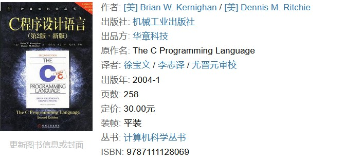

# 关于编程方法论及其推荐书目

如果读者经常参与一些线上的交流，就会发现一个普遍存在的问题，即人们在讨论计算机编程议题时实际上绝大多数都在讨论编程语言本身，例如，初学者应该先学习 C 还是 Java，Rust 或 Go 值不值得学习等议题。但在笔者看来，编程语言即使再重要，也只是语言文字对于人类思想的表达意义。举例来说，如果我想写一封情书，无论选择用英文写还是中文写，能解决的都只有如何精确地、有效地传递我对爱人的爱慕之情，决定这封情书核心质量的是我对爱人此时此刻的思恋，而不是文章本身用了欧美的十四行诗还是蝶恋花之类的宋词。编程工作也是如此，最终决定我们工作质量的是代码所要表达的编程思想。所以，当我们陷于一些诸如“Java 代码的执行性能很不好，用 C 编码才是永远的王道”之类的争论时，首先要搞清楚的是自己与争论对象想要表达的思想内容是否属于同一领域，不要和人吵了三天三夜之后发现对方是做跨平台终端应用的，自己是做 JVM 的，而 Java 这门语言也从来没被拿来实现 JVM 这样的中间件（这本来就是用 C 语言来实现的），这简直就和讨论“关公战秦琼谁会赢”一样毫无意义。

那么，究竟什么才是我们在编程时要表达的思想内容呢？在个人看来，它主要由用于宏观设计的方法论（Methodology）和用于具体实现的算法（Algorithm）两部分组成。在这篇文章中，我们会先聚焦于编程方法论的讨论，并以推荐书目的形式来为读者规划一个研究这一课题的路线图，以供参考。

## 编程方法论简介

在编程方法论（Programming Methodology）这一课题下，我们主要研究的是如何从宏观的角度来设计程序、构建程序这两个问题，其本质都是在探讨如何针对编程目标进行模块化设计。这里的模块化（Modularity），具体来说就是要探讨如何按照某个既定规则将要编程的目标任务划分成若干个相对独立的部分，从而实现将整个编程过程分而治之的一种方法论。在该方法论之下，我们会默认计算机程序是由一系列模块组成的，这些模块之间通过一种被称之为“接口”的机制来实现相互联系，而我们实际要做的工作就是设计用于定义这套接口机制的规则。从 20 世纪 60 年代至今，围绕着对于接口机制的设计规则，业界陆续发展出了以下主要的编程方法论：

- **面向过程编程（Procedural programming）**：也被称作过程化编程，这是一种通过定义函数以及抽象数据类型的方式来实现模块化设计的编程方法。在该编程方法之下，程序的数据逻辑将通过抽象数据类型（Abstract Data Type，可简称 ADT）的方式来进行分组定义，而其接口机制的规则将通过一系列函数的定义来完成设计。面向过程编程主要常用于系统编程领域，代表性的编程语言主要包括 Fortran、Pascal、C 等。

- **面向对象编程（Object-oriented programming）**：这是一种在面向过程编程的基础上进一步执行抽象化设计的编程方法，它主张将之前的 ADT 及其相关的函数封装成一个被称为“对象（Object）”的单位，然后以此为基础来完成针对编程目标的模块化设计。在该编程方法之下，被封装的 ADT 被称为对象的数据成员，它们就是被模块化了的数据逻辑，而被封装的函数则被称为对象的方法，它们实际上就是这些模块的接口。

  另外在上述模块化过程中，我们通常会选择将对象的封装动作抽象为一种被称作“类（Class）”的定义机制，以便于提高设计方案的可复用性与可扩展性。在这里，类与对象之间属于抽象与具象的关系，即类是对象的抽象化产物，而对象是类的具象化结果。面向对象编程是目前被使用得最为广泛的编程方法之一，主要用于应用层的编程，代表性的编程语言主要包括 Python、C#、Java 等。

- **函数式编程（Functional programming）**：也被称作函数程序设计，这是一种以 λ 演算规则为基础，将所有的计算机运算都视为函数运算，并且避免使用程序状态以及可变对象的编程方法。在该编程方法之下，我们的模块化设计是以函数为主要单位来完成的，这意味着在编写代码的过程中，一个函数既可以被当做输入给其它函数的参数，也可以用来充当从其他函数输出的返回值，并且随时可对它进行修改，或分配给一个指定的变量。

  与面向过程的编程相比，函数式编程更倾向于强调代码被执行的结果而非过程，它倡导的是尽可能利函数这样的简单执行单位来推进计算过程的逐层推导，以此来完成复杂的运算。也正因为如此，这种编程方法长期以来追求的是编程语言在编码风格上的清晰明了、言简意赅，而非通过复杂的算法设计来追求代码的执行效率，常用于学术圈的教学与科研工作，代表性的编程语言主要包括 Lisp、Erlang、Haskell 等。

## 学习路线规划

在了解了当前被广泛使用的主要编程方法论之后，我们就可以根据自己的需要来进行学习路线的规划了。根据个人的经验。我在这里会建议读者：首先，根据编程目标所需要的抽象层次、工作的侧重点来选择自己要使用的方法论；然后，选择一门适用于表达该方法论的编程语言来学习，并到具体的项目中进行编程实践，以便累积经验；最后，从自己和别人的实践经验中提取你对该方法论的领悟，并将这些领悟推广至对其他编程语言的使用。下面，让我们来针对之前介绍的主要编程方法论来做一些具体的学习建议和书籍推荐，以供读者参考。

### 面向过程的编程

如果读者的编程目标是操作系统内核，或像 JVM 这样的中间件，那么由于其抽象层次更接近于计算机本身的硬件设备，以及技术上的历史积累（即因为历史原因，这些领域的已有项目大多数都是用 C 来实现的），我会建议读者从抽象层次最低的、面向过程的编程方法开始切入。想要学习面向过程的编程，最好的选择就是从学习使用 C 语言开始。对于这门编程语言的学习，我会强烈推荐读者阅读《C程序设计语言》这本书（作者是 Brian Kernighan 和 Dennis Ritchie，以下简称 K&R ）。

在笔者个人看来，写编程语言教程最困难的地方就在于如何在细节严谨性与教学引导性之间找到合适的平衡点。首先，如果教程的内容缺乏一个循序渐进的过程，读者很可能就会不得其门而入。而如果其中缺乏足够的、可以立刻上机测试的代码实例，也会让他们觉得兴趣黯然，导致学习过程形同嚼蜡。这就需要作者有丰富的教学经验以及项目经验。有了前者，就能熟悉教学心理，知道先教什么，后教什么，内容之间如何承前启后。而有了实际项目经验就会知道新手在具体实践中会遇到哪些情况，并且能准确的预料到学生在运行什么代码时会遇到什么问题，而在这种情况下往往是一点就通，不用长篇大论，事倍功半。

其次，单纯只懂如何做一个好老师依然还是不足以写出写出好的编程教程。毕竟，编程语言归根结底是一门科学性质的工具语言，严谨实干的精神是绝对必不可少的。这就要求作者自己得是相关领域中的专家，至少得对这门语言的标准，设计原则了如指掌。唯有这样才能做到面向读者的实际需求，并言之有物，而不是靠类似`++i+i++`这样似是而非的、在细节上耍小聪明的内容来滥竽充数，却对真正需要被浓墨重彩讲解的 ADT 理念与 UNIX API 语焉不详，敷衍了事。同时做到以上两个方面并不容易，但这本书不但做到了，而且做得堪称典范。毕竟，作为 C 语言和 UNIX 操作系统的缔造者，本书的两位作者 K&R 对于 C 语言的标准及其运用自然有着无可争辩的权威。

在掌握了 C 语言的基本使用并累积了一定的项目经验之后，就可以根据自己的技术积累搭配顶级工程师们分享的经验来提炼对面向过程编程方法论的领悟了。在这一阶段，我会推荐读者参考《程序设计实践》这本书。该书的作者之一正是 K&R 中的 K，即 Brian Kernighan，而 Rob Pike 则是 Plan 9 和 Inferno 操作系统的主要结构设计与实现者。他们在书中分享了如何在实际项目工作中同时兼顾代码的执行性能、可移植性、可读性等多个方面的经验，并讨论了一些既具备实用性，又具有广泛意义的编程思想和方法。

### 面向对象的编程

如果读者的编程目标是面向各类操作系统 API 的应用程序，那么由于其抽象层次更接近于操作系统的内核，并在工作中更侧重于追求代码的可移植性、可复用性与可扩展性，我会建议读者从抽象层次更高一些的、面向对象的编程方法开始切入，这时候 Java 语言无疑是兼顾了教学性与实用性的最佳选择。对于这门编程语言的学习，我会强烈推荐读者阅读《Java 编程思想》这本书。

对于面向对象编程中所涉及到的所有重要概念，例如对象、类、接口、继承、多态等，该书的作者 Bruce Eckel 都利用其极具亲和力的文字，和一系列短小精悍的代码示例做了详尽的讲解。基本上，只要耐心读完这本颇具分量的书，读者就可以完成从基础语法到该语言的一系列高级特性的知识点梳理，以获得初步进行面向对象编程的项目实践能力。

在累积了一定的、使用 Java 语言的项目经验之后，读者就可以搭配顶级工程师们分享的经验来提炼对面向对象编程方法论的领悟了。在这一阶段，我会推荐读者参考《设计模式：可复用面向对象软件的基础》这本书。该书的四位作者从丰富的项目实践经验中提炼出了在进行面向对象设计时常用的 23 个设计模式。

需要注意的是，通常提到所谓的设计模式时，人们很容易有意无意地把“模式”误认知成“模版”，然后在工作实践中进行各种生搬硬套式的、吃力不讨好的错误操作，但实际上它们只不过是一些设计套路而已，是需要根据实际情况来进行微调的，甚至在某些特殊情况下还可以作为设计反例来参考。总而言之，这本书中的这些模式很好地总结了面向对象方法论中最有价值的经验, 并且将其用简洁可复用的形式表达了出来。

### 函数式编程

如果读者的编程目标是学术界的教学与科研工作，那么由于其抽象层次更接近于人类自己对于各种科学、数学逻辑的表达，并在工作中更侧重于追求代码的表达能力与高可读性，我会建议读者从抽象层次最接近于数学逻辑的函数式编程方法开始切入。在这种选择之下，学习一下 Lisp 语言或它的某种方言会是一个不错的选择。对于这门编程语言的学习，我会推荐读者阅读《计算机程序构造与解释》这本书。

这本书由麻省理工学院的三位教授编写，其内容看似是在介绍 Scheme 这一门源自 Lisp 语言的方言，但实际上，Scheme 在书中只是一个阐述的工具，作者实际的目的是借助这个语言工具来召唤出一个被称作“ λ 演算”的神兽，并让这只神兽帮助我们来完成函数式编程。该书会从最初的基础计算开始切入，逐步进阶段到诸如“用 Scheme 实现自己的编译器”这一类的高级议题，深入地释解计算机程序设计所要涉猎的方方面面。

同样的，在累积了一定的项目经验之后，读者就可以搭配顶级工程师们分享的经验来提炼对函数式编程的领悟了。在这一阶段，读者可以选择性地参考一下《函数式编程思维》这本书。该书会脱离特定的语言特性，集中展示如何通过函数式语言来解决我们在工作中会遇到的问题。例如，如何在函数式语言中利用高阶函数、多元方法等实现可复用的代码等。有助于引导人们从习惯的面向过程、面向对象等传统编程方法过渡到函数式编程，建立起对这种编程方法论的良好理解。

## 结束语

最后，如果读者是一位时间比较充裕的、对编程工作有着极大兴趣和热情的年轻人，我个人会建议学习一下 C++ 这门编程语言。这门语言最大的优势是对面向过程、面向对象、泛型编程以及函数式编程等所有主流的编程方法论都有很好的支持，我们可以通过它来实现对这些编程方法论的全面学习，当然，这个优势也给这门语言带来了过高的复杂性和陡峭的学习曲线，并不是所有人都承担得起它的学习成本的。但就笔者个人的经验来说，如果我们可以忍受 C++ 过于复杂且庞大的语言特性，耐心地学好这门语言，将会为自己的编程能力打下一个深厚的功底，同时也会加快我们日后学习其他大部分编程语言的速度，其效果就像是《倚天屠龙记》中张无忌在学习了九阳真经之后，再学其他武学时拥有的逆天能力（虽然这种说法略有夸张，但颇为传神）。

总而言之，最为重要的，且必须反复强调的一件事是：不要为了编程语言而学习编程语言，请将注意力更多地放在本文介绍的编程方法论，和我下一篇要介绍的算法上。
