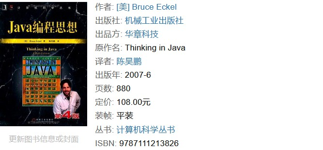
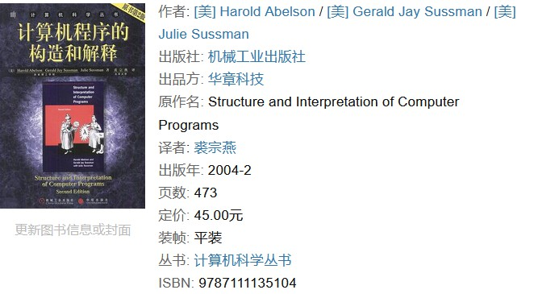

# 关于编程方法论及其推荐书目

如果读者经常参与一些线上的交流，就会发现一个普遍存在的问题，即人们在讨论计算机编程议题时实际上绝大多数都在讨论编程语言本身，例如，初学者应该先学习 C 还是 Java，Rust 或 Go 值不值得学习等议题。但在笔者看来，编程语言即使再重要，也只是语言文字对于人类思想的表达意义。举例来说，如果我想写一封情书，无论选择用英文写还是中文写，能解决的都只有如何精确地、有效地传递我对爱人的爱慕之情，决定这封情书核心质量的是我对爱人此时此刻的思恋，而不是文章本身用了欧美的十四行诗还是蝶恋花之类的宋词。编程工作也是如此，最终决定我们工作质量的是代码所要表达的编程思想。所以，当我们陷于一些诸如“Java 代码的执行性能很不好，用 C 编码才是永远的王道”之类的争论时，首先要搞清楚的是自己与争论对象想要表达的思想内容是否属于同一领域，不要和人吵了三天三夜之后发现对方是做跨平台终端应用的，自己是做 JVM 的，而 Java 这门语言也从来没被拿来实现 JVM 这样的中间件（这本来就是用 C 语言来实现的），这简直就和讨论“关公战秦琼谁会赢”一样毫无意义。

那么，究竟什么才是我们在编程时要表达的思想内容呢？在个人看来，它主要由用于宏观设计的方法论（Methodology）和用于具体实现的算法（Algorithms）两部分组成。在这篇文章中，我们会先聚焦于编程方法论的讨论，并以推荐书目的形式来为读者规划一个研究这一课题的路线图，以供参考。

## 编程方法论简介

在编程方法论（Programming Methodology）这一课题下，我们主要研究的是如何从宏观的角度来设计程序、构建程序这两个问题，其本质都是在探讨如何针对编程目标进行模块化设计。这里的模块化（Modularity），具体来说就是要探讨如何按照某个既定规则将要编程目标划分成若干个相对独立的部分，从而实现将整个编程过程分而治之的一种方法论。在该方法论之下，我们会默认计算机程序是由一系列模块组成的，这些模块之间通过一种被称之为“接口”的机制来实现相互联系，而我们实际要做的工作就是设计用于定义这套接口机制的规则。从 20 世纪 60 年代至今，围绕着对于接口机制的设计规则，业界陆续发展出了以下主要的编程方法论：

- **面向过程编程（Procedural programming）**：也被称作过程化编程，这是一种通过定义函数以及抽象数据类型的方式来实现模块化设计的编程方法。在该编程方法之下，程序的数据逻辑将通过抽象数据类型（Abstract Data Type，可简称 ADT）的方式来进行分组定义，而其接口机制的规则将通过一系列函数的定义来完成设计。面向过程编程主要常用于系统编程领域，代表性的编程语言主要包括 Fortran、Pascal、C 等。

- **面向对象编程（Object-oriented programming）**：这是一种在面向过程编程的基础上进一步执行抽象化设计的编程方法，它主张将之前的 ADT 及其相关的函数封装成一个被称为“对象（Objective）”的单位，然后以此为基础来完成针对编程目标的模块化设计。在该编程方法之下，被封装的 ADT 被称为对象的数据成员，它们就是被模块化了的数据逻辑，而被封装的函数则被称为对象的方法，它们实际上就是这些模块的接口。

  另外在上述模块化过程中，我们通常会选择将对象的封装动作抽象为一种被称作“类”的定义机制，以便于提高设计方案的可重用性与可扩展性。在这里，类与对象之间属于抽象与具象的关系，即类是对象的抽象化产物，而对象是类的具象化结果。面向对象编程是目前被使用得最为广泛的编程方法之一，主要用于应用层的编程，代表性的编程语言主要包括 Python、C#、Java 等。

- **函数式编程（Functional programming）**：也被称作函数程序设计，这是一种以 λ 演算规则为基础，将所有的计算机运算都视为函数运算，并且避免使用程序状态以及可变对象的编程方法。在该编程方法之下，我们的模块化设计是以函数为主要单位来完成的，这意味着在编写代码的过程中，一个函数既可以被当做输入给其它函数的参数，也可以用来充当从其他函数输出的返回值，并且随时可对它进行修改，或分配给一个指定的变量。

  与面向过程的编程相比，函数式编程更倾向于强调代码被执行的结果而非过程，它倡导的是尽可能利函数这样的简单执行单位来推进计算过程的逐层推导，以此来完成复杂的运算。也正因为如此，这种编程方法长期以来追求的是编程语言在编码风格上的清晰明了、言简意赅，而非通过复杂的算法设计来追求代码的执行效率，常用于学术圈的教学与科研工作，代表性的编程语言主要包括 Lisp、Erlang、Haskell 等。

## 学习路线规划

在了解了当前被广泛使用的主要编程方法论之后，我们就可以根据自己的需要来进行学习路线的规划了。根据个人的经验。我在这里会建议读者：首先，根据编程目标所需要的抽象层次、工作的侧重点来选择自己要使用的方法论；然后，选择一门适用于表达该方法论的编程语言来学习，并到具体的项目中进行编程实践，以便累积经验；最后，从自己和别人的实践经验中提取你对该方法论的领悟，并将这些领悟推广至对其他编程语言的使用。下面，让我们来针对之前介绍的主要编程方法论来做一些具体的学习建议和书籍推荐，以供读者参考。

### 面向过程的编程

如果读者的编程目标是操作系统内核，或像 JVM 这样的中间件，由于其抽象层次更接近于底层的硬件设备，以及技术上的历史积累（即因为历史原因，这些领域的已有项目大多数都是用 C 来实现的），我会建议读者从抽象层次最低的、面向过程的编程方法开始切入。想要学习面向过程的编程，最好的选择就是从学习使用 C 语言开始。对于这门编程语言的学习，我会强烈推荐读者阅读《C程序设计语言》这本书（作者是 Brian Kernighan 和 Dennis Ritchie，以下简称 K&R ）。

在笔者个人看来，写编程语言教程最困难的地方就在于如何在细节严谨性与教学引导性之间找到合适的平衡点。如果教程的内容缺乏一个循序渐进的过程，读者很可能就会不得其门而入。而如果其中缺乏足够的、可以立刻上机测试的代码实例，也会让他们觉得兴趣黯然，导致学习过程形同嚼蜡。这就需要作者有丰富的教学经验以及项目经验。有了前者，就能熟悉教学心理，知道先教什么，后教什么，内容之间如何承前启后。而有了实际项目经验就会知道新手在具体实践中会遇到哪些情况，并且能准确的预料到学生在运行什么代码时会遇到什么问题，而在这种情况下往往是一点就通，不用长篇大论，事倍功半。

然而，只懂如何做一个老师是不够的，计算机语言毕竟是一门科学语言，严谨的细节感是必不可少的。这就要求作者自己得是相关领域中的专家，至少得对这门语言的标准，设计原则了如指掌。唯有这样才能言之有物，而不是靠类似`++i+i++`这样的东西来哗众取宠，而又在细节上似是而非的东西来滥竽充数，却对真正需要被浓墨重彩书写的 ADT 理念与 UNIX API 语焉不详，敷衍了事。同时做到以上两个方面并不容易，但这本书不但做到了，而且做得堪称典范。毕竟，作为 C 语言和 UNIX 操作系统的缔造者，本书的两位作者 K&R 对于 C 语言的标准及其运用自然有着无可争辩的权威。

在掌握了 C 语言的基本使用并累积了一定的项目经验之后，就可以根据自己的技术积累搭配业界顶级工程师分析的经验来提炼对面向过程边方法论的领悟了。在这一阶段，我会推荐读者参考《程序设计实践》这本书。该书的作者之一正是 K&R 中的 K，即 Brian Kernighan，而 Rob Pike 则是 Plan 9 和 Inferno 操作系统的主要结构设计与实现者。他们在书中分享了如何在实际项目工作中同时兼顾代码的执行性能、可移植性、可读性等多个方面的经验，并讨论了一些既具备实用性，又具有广泛意义的编程思想和方法。

### 面向对象的编程

本书赢得了全球程序员的广泛赞誉，即使是最晦涩的概念，在Bruce Eckel的文字亲和力和小而直接的编程示例面前也会化解于无形。从Java的基础语法到最高级特性（深入的面向对象概念、多线程、自动项目构建、单元测试和调试等），本书都能逐步指导你轻松掌握。

本书结合设计实例从面向对象的设计中精选出23个设计模式, 总结了面向对象设计中*有价值的经验, 并且用简洁可复用的形式表达出来。本书分类描述了一组设计良好、 表达清楚的软件设计模式, 这些模式在实用环境下特别有用。 本书适合大学计算机专业的学生、研究生及相关人员参考。

### 函数式编程

《SICP》自然是缩写了，全名《Structure and Interpretation of Computer Programs》，中文名叫《计算机程序构造与解释》，由麻省理工学院的三位教授编写，目前最新的版本为第二版，这是这本书的初探。本书看似是在讲述 Scheme，一门源自 Lisp 语言的方言，但远不止步于此，实际上，Scheme 在这里只是一个阐述的工具，更多的东西，借助 Scheme 我们要“召唤出一个叫做‘Lambda’的神灵”，让这个神灵帮助我们去运用 Scheme，从最初的基础计算，逐步到最后，用 Scheme 实现自己的编译器，全部用 Scheme 实现出来，期间的工作，深入骨髓地释解计算机程序涉猎的方方面面。

有别于我们接触更多的命令式编程风格，Scheme 运用的是函数式编程，而且，正如作者在本书课程提到的那样，“我会很快教会你用 Scheme 编写可以使用的程序，就像教你如何下国际象棋一样”，元素非常简单，但是，“仍然需要你大量练习”。

本书脱离特定的语言特性，关注各种OOP语言的共同实践做法，展示如何通过函数式语言解决问题。例如，如何利用函数式语言，通过高阶函数、多元方法等完成代码重用。知名软件架构师Neal Ford为我们展示不同的编程范式，帮我们完成从Java命令式编程人员，到使用Java、Clojure、Scala函数式编程人员的完美转变，建立对函数式语言的语法和语义的良好理解。

## 结束语

<!-- 以下为待整理的资料 -->
