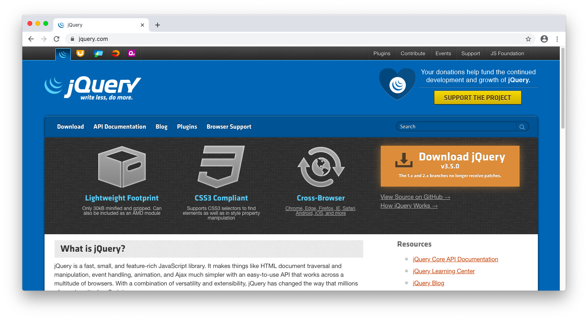
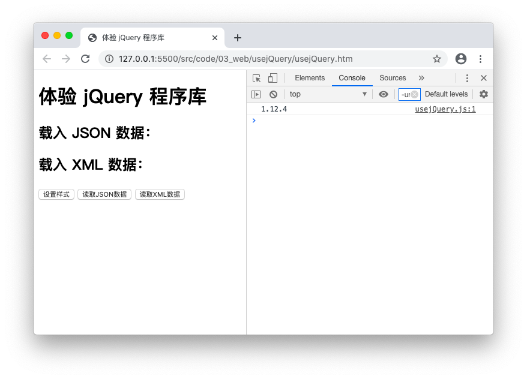
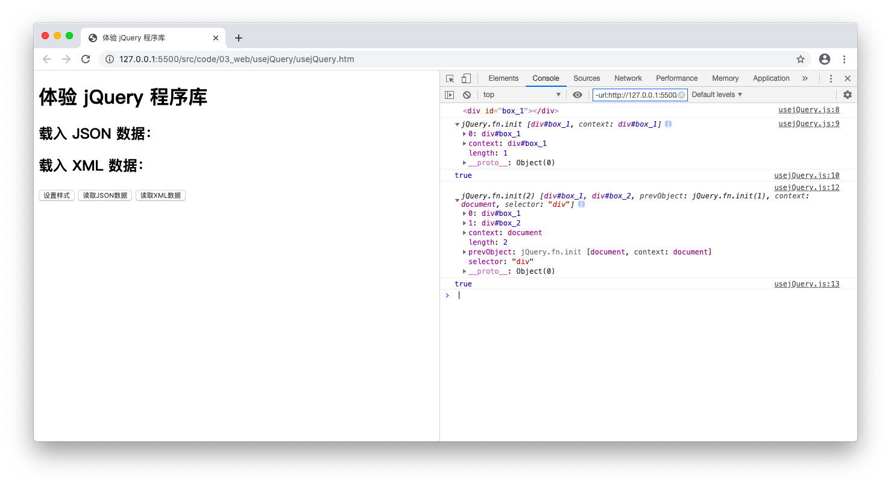
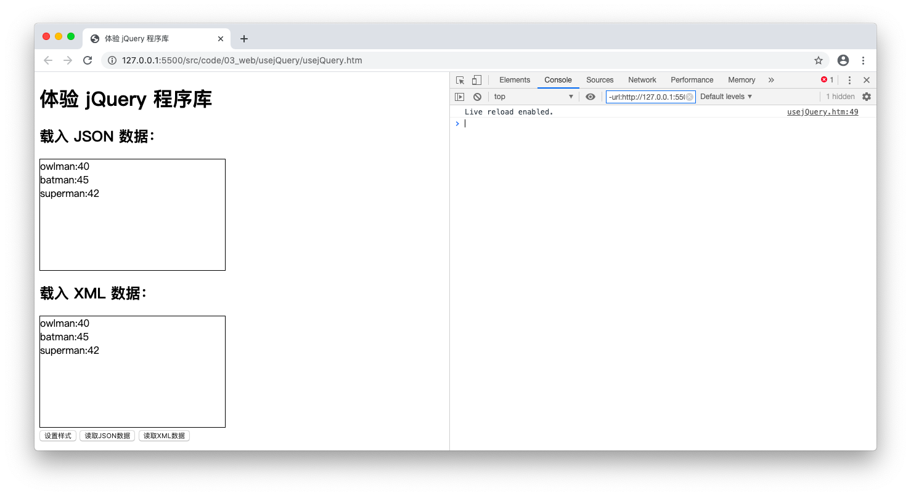

#! https://zhuanlan.zhihu.com/p/681082820

# 前端编程接口：AJAX

> 本文部分内容节选自笔者于 2021 年出版的[《JavaScript 全栈开发》](https://book.douban.com/subject/35493728/)一书。

在这篇笔记中，我们将一起学习真正让 HTML 文档得以成为 Web 应用程序用户界面的异步编程技术：AJAX。由于这项技术可以在不重新加载当前页面的情况下更新来自服务器端的数据，从而让一个基于 B/S 架构的应用程序拥有了与 C/S 应用程序近乎相同的用户体验。这一效果极大地提高了用户在 Web 浏览器上使用应用程序的意愿，让 B/S 这种开发和部署成本更低的应用程序架构真正被市场接受。并且随着 Web 应用程序的日益复杂化，B/S 架构按照任务的分工进一步将此类应用程序的开发任务解耦成了前端和后端两个相对独立的工种，让人们各司其职，减少相互干扰。所以从某种意义上来说，AJAX 是一项真正开启了 Web 前端工程师这一工种的编程技术。

另外，随着前端编程的蓬勃发展，被称为“前端工程师”的开发者们基于 AJAX 技术和 DOM 结构发展出了各种琳琅满目的前端程序库与开发框架。这些程序库和框架极大地简化了前端开发的过程，以至于如今的某些初学者在完全不了解 AJAX 和 DOM 基础接口的情况下也能使用这些库和框架开发出不错的应用程序。但是，从知识完整性的角度来说，我们还是希望读者能够系统地了解一下 AJAX 技术的来龙去脉和基础知识，毕竟只有做到知其然且知其所以然，才能更好地使用这些程序库和框架。总而言之，我们希望在阅读完这篇笔记之后，读者能：

- 了解 AJAX 技术的来龙去脉。
- 掌握使用 AJAX 技术编程的基本步骤。
- 了解如何在浏览器端处理 JSON 或 XML 格式的数据。
- 以 jQuery 为例了解使用前端程序库的基本思路和方法。

## AJAX 编程基础

AJAX 是 Asynchronous Javascript And XML 的缩写，这一技术名词最早出现于 Jesse James Garrett 在 2005 年撰写的“Ajax: A New Approach to Web Applications”一文中，这篇文章中第一次系统性地阐述了如何利用这一技术实现浏览器与服务器之间的异步数据通信，并在不重新加载当前页面的情况下局部更新该页面上的数据，从而赋予其更好的用户体验。需要特别提醒的是，虽然 AJAX 中的“X”是 XML 的缩写，但这并不代表这项技术只能针对服务器上的 XML 文件来发送异步通信请求，它并没有数据格式上的限制，以 txt、json 等格式存储的数据也一样可行。但在具体介绍如何通过异步通信的方式从服务器上获取这些格式的数据之前，我们还是应该先解释一下执行这种异步通信的必要性。

### 为何需要异步通信

众所周知，在 B/S 架构中，浏览器与服务器之间的 HTTP 连接长期以来都被认为是种一次性的短期连接，它被限制每次连接只处理一个请求。也就是说，每当浏览器向服务器发送一次访问请求，服务器就会在返回响应内容之后立即切断自身与浏览器之间的连接。与此同时，HTTP 连接还是一种无状态连接，即服务器不会记得同一个浏览器上一次请求的内容。这意味着，B/S 架构之下的浏览器不可能像其他 C/S 架构中的客户端一样与服务器保持连续的通信状态。

所以，Web 应用程序的前后端之间的通信在传统模式下都是一次性的。在这一次通信中，位于前端的浏览器会首先获取 HTML 文档描述的界面结构，再加载以 JavaScript 为代表的前端脚本，然后再由脚本代码来加载界面中需要呈现的数据，这一系列动作是一个连贯的、不可分割的整体。而且由于 HTTP 连接无状态的特性，应用程序的后端也不记得前端上一次请求的内容，自然无法通过比较两次请求内容的差异，从中剥离出变化了的部分返回给前端。这一切反映到 Web 应用程序的用户体验上，就变成了任何一丁点儿的前后端之间的数据通信都会导致整个用户界面的重新加载，这就是 Web 应用程序传统的“发送请求-等待响应”交互模式。这种用户体验极差的交互模式在相当长一段时间里都是制约 B/S 架构程序被市场接受的主要因素之一。而正如我们之前所说，JavaScript 解决这一问题的核心思路，就是用异步操作为数据类通信单独发送请求，这样浏览器就不必向服务器发送访问整个页面的请求了。

事实上，早在 Garrett 提出 AJAX 这个新的编程技术之前，开发者们就已经在利用各种变通手段来实现浏览器与服务器之间的异步数据通信了，例如在 HTML 文档中使用隐藏式的`<iframe>`元素来执行额外的数据请求任务，或者使用 Java applet 或 Flash 中的相关功能等。但由于这些方法使用的工具都不是专用于异步数据通信的，所以在具体使用时总是会遇到这样那样的问题，效果不尽如人意。而 AJAX 的独到之处就是提出了`XMLHttpRequest`这个专用来处理异步数据通信的对象，它能更为流畅地完成向服务器发送请求、并解析服务器响应数据的任务。所以，学习 AJAX 技术的关键就在于我们是否能深入地了解`XMLHttpRequest`对象，并熟练掌握它的使用方法。

### 了解`XMLHttpRequest`对象

`XMLHttpRequest`对象最初来自于微软的 IE5 浏览器，它原本是后者 MSXML 库中的一个 ActiveX 对象。但随着 AJAX 技术被广泛运用，如今绝大部分 Web 浏览器也都已经提供了相同的对象实现。这也就是说，`XMLHttpRequest`对象某种程度上已经成为了当下主流浏览器事实上的标准组件，所以在通常情况下（或者说在 IE7 及其之后出现的主流浏览器中），我们都可以直接通过`new`操作符来创建`XMLHttpRequest`对象，像这样：

```JavaScript
const xhr = new XMLHttpRequest();
```

当然，如果我们不得不考虑 IE6 等老版本的浏览器，也可以考虑将创建`XMLHttpRequest`对象的操作封装成一个兼容新老浏览器的函数，然后再用它来创建对象，像这样：

```JavaScript
function createXMLHttpRequest() {
    if (window.XMLHttpRequest) { // Chrome、Firefox、Safari、IE7+ ...
        return new XMLHttpRequest();
    } else if (window.ActiveXObject) { // IE6 及更老版本的 IE 浏览器
        return new ActiveXObject("Microsoft.XMLHTTP");
    } else {
        throw new Error('你的浏览器不支持 XMLHttpRequest 对象！');
    }
}

const xhr = createXMLHttpRequest();
```

在创建了该对象之后，就可以开始使用该对象提供接口了。接下来，就让我们先来介绍一下该对象的常用接口：

- **`readyState`属性**：只读属性，作用是返回一个用于表示请求状态的枚举值，下面是各枚举值代表的含义：
  - UNSET：请求处于未初始化状态。
  - OPENED：请求处于启动状态。
  - HEADERS_RECEIVED：请求处于发送状态。
  - LOADING：请求处于接收响应数据的状态。
  - DODE：请求处于任务完成的状态。

- **`response`属性**：只读属性，作用是返回`XMLHttpRequest`对象从服务器上接收到响应内容，其具体值的类型取决于`XMLHttpRequest.responseType`的值。

- **`responseText`属性**：只读属性，作用是以纯文本的格式返回`XMLHttpRequest`对象从服务器上接收到响应内容，如果请求未成功或尚未发送，则返回 null。

- **`responseType`属性**：该属性是一个枚举值，用于表示响应数据的类型，具体如下：
  - "text" ：表示响应数据为纯文本类型的字符串对象，这是其默认类型（该枚举值也可以是个空字符串：""）。
  - "arraybuffer"：表示响应数据为`ArrayBuffer`类型的二进制数组对象。
  - "blob" ：表示响应数据为`Blob`类型的对象。
  - "document"：表示响应数据为一个 HTML 或 XML 格式的文档对象。
  - "json"：表示响应数据为一个 JSON 格式的对象。

- **`responseURL`属性**：只读属性，作用是返回响应数据所在的 URL，如果该 URL 为空，则返回空字符串。

- **`responseXML`属性**：只读属性，作用是以 XML DOM 对象的格式返回`XMLHttpRequest`对象从服务器上接收到响应内容，如果请求未成功、尚未发送或时不能被解析为 XML 或 HTML，则返回 null。

- **`status`属性**：只读属性，作用是以数字的形式返回`XMLHttpRequest`对象发送请求完成之后得到的响应状态值，譬如 200 代表响应正常，404 代表其请求的内容不存在等。

- **`statusText`属性**：只读属性，作用是以文本的形式返回`XMLHttpRequest`对象发送请求完成之后得到的响应状态。与`status`属性不同的是，它包含完整的响应状态文本（例如，"200 OK"）。

- **`timeout`属性**：该属性可被赋予一个无符号长整型的数值，用于设置`XMLHttpRequest`对象所发送请求的最大请求时间（单位为毫秒），一旦某次请求所用的时间超出了该属性被设定的值，就会被自动终止。

- **`upload`属性**：只读属性，作用是返回一个用来表示上传进度的`XMLHttpRequestUpload`对象，我们可以通过响应该对象事件的方式来追踪数据上传的进度。下面我们就具体来介绍一下可在该对象上注册的一些事件处理函数：
  - **`onloadstart`事件处理函数**：在数据上传开始时被调用。
  - **`onprogress`事件处理函数**：在数据上传的过程中一直被调用，所以建议不要执行太复杂的操作。
  - **`onabort`事件处理函数**：在数据上传过程被中止时被调用。
  - **`onerror`事件处理函数**：在数据上传失败时被调用。
  - **`onload`事件处理函数**：在数据上传成功时被调用。
  - **`ontimeout`事件处理函数**：在数据上传未在用户规定的时间内完成时被调用。
  - **`onloadend`事件处理函数**：在数据上传的过程完成时被调用（不论上传成功与否）。

- **`withCredentials`属性**：该属性是一个布尔类型的值，用于设置`XMLHttpRequest`对象是否该使用类似 cookies、authorization headers(头部授权)或 TLS 客户端证书这一类认证机制来创建一个跨域请求。

- **`abort()`方法**：该方法会在请求已被发送的情况下，于收到响应之前中止请求。

- **`getAllResponseHeaders()`方法**：该方法以字符串的形式返回所有用 CRLF 分隔的响应头，如果请求没有收到响应，则返回 null。

- **`getResponseHeader()`方法**：该方法会返回包含指定响应头的字符串，如果请求没有收到响应或在收到的响应中不存在该报头，则返回 null。

- **`open()`方法**：该方法的作用是初始化`XMLHttpRequest`对象要发送的请求。

- **`overrideMimeType()`方法**：该方法会重写由服务器返回的 MIME 类型。

- **`send()`方法**：该方法用于发送请求。如果请求是异步的（默认），那么该方法将在请求发送后立即返回。

- **`setRequestHeader()`方法**：该方法用于设置 HTTP 请求头的值，它必须在`open()`之后、`send()`之前被调用。

- **`onreadystatechange`事件处理函数**：该事件处理函数会在其所在`XMLHttpRequest`对象的`readyState`属性值发生变化时被调用。

和之前一样，由于我们并不打算将本书写成一本照本宣科式的参考手册，所以上面列出的这些只是`XMLHttpRequest`对象中最常用的，且被大多数主流浏览器支持的属性、方法与事件处理函数，并不是该对象提供的所有接口。如果有读者希望更完整地了解`XMLHttpRequest`对象的所有细节，那么他还需要去查阅专门的技术文档。

### `XMLHttpRequest`对象的基本使用

在了解了`XMLHttpRequest`对象的常用接口之后，我们就可以具体来介绍一下该如何用它来异步数据通信了。下面，先来看一下用`XMLHttpRequest`对象与服务器进行异步通信的基本操作：

```JavaScript
// 第一步：创建 XMLHttpRequest 对象
const xhr = createXMLHttpRequest();
// 第二步：初始化请求
xhr.open('GET', '[某个URL]', true);
// 第三步：向服务器发送请求
xhr.send(null);
// 第四步：处理服务器的响应
xhr.onreadystatechange = function(){
    if(xhr.readyState === XMLHttpRequest.DONE) {
        if(xhr.status >= 200 && xhr.status < 300 || xhr.status == 304) {
            useData(xhr.response);
        } else {
            throw new Error('请求数据失败！');
        }
    }
};
```

如你所见，在 AJAX 编程方法中，一次异步通信主要有四个步骤组成。下面，我们就逐一来详细说明一下其每个步骤所要完成的任务，以及需要注意的事项：

- **第一步：创建`XMLHttpRequest`对象**：这一步骤的任务是在构建进行 AJAX 编程的基础设施，完成该任务时需要注意各大主流浏览器对`XMLHttpRequest`对象的兼容，所以我们在上面使用的是之前封装好的、兼容新老浏览器的`createXMLHttpRequest()`函数。

- **第二步：初始化请求**：这一步骤的任务是初始化`XMLHttpRequest`对象将要发送的请求。完成这个任务首先要调用`XMLHttpRequest`对象的`open()`方法，该方法需要传递三个实参：第一个实参是一个字符串类型的值，用于指定请求的类型是“GET”还是“POST”；第二个实参也是一个字符串类型的值，用于指定请求数据的 URL；第三个实参是一个布尔类型的值，用于设置该请求是否为异步，true 代表这是一个异步请求。

  在调用了`open()`方法之后，我们还可以继续对将要发送的请求做进一步的设置，例如用`timeout`属性设置最大的请求时间、用`withCredentials`属性设置是否允许跨域请求等，譬如像这样：

    ```JavaScript
    xhr.open('GET', '[某个URL]', true);
    xhr.withCredentials = true;  // 允许跨域请求数据
    xhr.timeout = 2000;          // 请求时间超过 2000 毫秒即视为超时
    ```

- **第三步：向服务器发送请求**：这一步骤的任务是将之前设置好的请求发送给服务器。完成该任务需要调用`XMLHttpRequest`对象的`send()`方法，该方法需要传递一个实参，用于设置要发送给服务器的数据。在请求类型为“GET”时，数据是随着 URL 一起发送的，所以不需要`send()`方法来发送数据，我们只需将其实参值设置为 null 即可。但当请求类型为“POST”时，我们通常就需要用`send()`方法来发送数据了。例如，假设当前页面上有一个`id`值为“userForm”的`<form>`元素的话，我们就可以这样用`XMLHttpRequest`对象将表单数据发送给服务器：

    ```JavaScript
    xhr.open('POST', '[某个URL]', true);
    const form = document.querySelector('#userForm');
    xhr.send(new FormData(form));  
    ```

  请注意，在发送表单数据之前，必须要先将这些数据做一些序列化处理，我们在这里是通过创建一个`FormData`对象来完成这一任务的。该对象是 HTML5 的 DOM 提供的新对象，专用于序列化表单数据，它的使用非常简单，只需在创建时将目标表单的元素引用传递给它的构造函数即可。

- **第四步：处理服务器的响应**：这一步骤的任务是处理`XMLHttpRequest`对象从服务器收到的响应数据，这个工作得通过`onreadystatechange`这个事件处理函数来完成。该事件处理函数会在`XMLHttpRequest`对象的`readyState`属性发送变化时被调用。然后，当`readyState`属性的值等`XMLHttpRequest.DONE`的时候，代表响应数据的接收过程已经完成。接下来就要通过`XMLHttpRequest`对象的`status`属性值来确认 HTTP 响应的具体状态，基本上，如果该值在 200 到 300 之间或等于 304，就可以认为数据请求成功。最后，我们就可以对`XMLHttpRequest`对象的`response`属性中存储的响应数据进行进一步处理了（在上面的示例中，我们假设预先定了一个名为`useData()`的回调函数来处理响应数据）。当然，在这里我们也可以先通过`responseType`属性确认响应数据的类型，然后再来选择是使用`responseText`属性还是`responseXML`属性来返回格式更为具体的数据。

当然，在这里需要特别说明一件事：出于安全方面的考虑，许多浏览器在默认情况下会禁止 JavaScript 代码进行跨域访问。所谓的跨域访问，指的是客户端的 JavaScript 代码在当前域名（包含端口号）下访问另一域名（或相同域名的不同端口号）所指向的服务端资源。例如，如果我们要想让在`batman.com`域名下的 JavaScript 客户端脚本向`owlman.com`域名下的资源发送异步请求，这就是一次跨域访问。浏览器的这种限制会给我们在客户端构建 AJAX 应用带来不小麻烦。所以读者在编写 AJAX 应用之前，应该先了解一下如何在当前域名所指向的服务端上做一些资源获取方面的处理工作，以避免这种跨域访问资源。至于在本章，只要我们的代码是在用 Apache、IIS 这类软件或者 Visual Studio Code 的 Go Live 插件构建 Web 服务器中运行的，就不必担心这个问题了。

### 封装`XMLHttpRequest`对象

其实，在使用 AJAX 这种编程方法一段时间之后，读者就会发现他们每次要编写的代码都大同小异，基本上就是上述基本步骤的小幅调整，有时是传递的实参些许不同，有时是请求的初始化设置多了几个，但总体而言，代码的重复率是高的。每当遇到这种情况时，我们就应该要考虑将这些重复的部分封装成若干个的工具函数以供日常调用，以减少代码的重复率，提高我们的编码效率。下面，我们就以请求类型的不同来封装一个用于发送“GET”请求的`ajax_get()`函数和一个用于发送“POST”请求的`ajax_post()`函数，以作示范。

现在，让我们先来封装用来发送“GET”请求的`ajax_get()`函数。由于这种请求方式相对简单，即使要向服务器发送数据，这些数据也是以参数的形式被写在要请求的 URL 中，所以我们只需要给该函数设置两个形参，第一个形参是用于设置 URL 的字符串，第二个形参则是用于处理响应数据的回调函数，其具体编码如下：

```JavaScript
function ajax_get(url, useData) {
    const xhr = createXMLHttpRequest(); // 此处依然使用之前封装的创建函数
    xhr.open('GET', url, true);
    xhr.send(null);
    xhr.onreadystatechange = function(){
    if(xhr.readyState === XMLHttpRequest.DONE) {
        if(xhr.status >= 200 && xhr.status < 300 || xhr.status == 304) {
            useData(xhr.response);
        } else {
            throw new Error('请求数据失败！');
        }
    }
    }
}
```

有了这个函数之后，当我们要用 AJAX 方式发送异步的“GET”请求时就只需要像下面这样调用它即可：

```JavaScript
ajax_get('[某个URL]', function(data){
    // 处理响应数据，例如，将其输出到控制台中：
    console.log(data);
});
```

接下来，我们再来封装用于发送“POST”请求的`ajax_post()`函数。由于这类请求通常用于提交表单数据，所以该函数的形参除了用于设置 URL 的字符串和用于处理响应数据的回调参数，还需要一个传递表单数据的形参，其具体编码如下：

```JavaScript
function ajax_post(url, sendData, useData) {
    const xhr = createXMLHttpRequest(); // 此处依然使用之前封装的创建函数
    xhr.open('POST', url, true);
    xhr.send(sendData);
    xhr.onreadystatechange = function(){
    if(xhr.readyState === XMLHttpRequest.DONE) {
        if(xhr.status >= 200 && xhr.status < 300 || xhr.status == 304) {
            useData(xhr.response);
        } else {
            throw new Error('请求数据失败！');
        }
    }
    }
}
```

同样地，在有了这个函数之后，当我们要用 AJAX 方式发送异步的“POST”请求时就只需要像下面这样调用它即可：

```JavaScript
// 在这里，我们假设当前页面上有一个 id 值为 userForm 的表单元素：
const form = document.querySelector('#userForm');
const formData = new FormData(form);
ajax_post(form.action, formData, function(data){
    // 处理响应数据，例如，将其输出到控制台中：
    console.log(data);
});
```

需要说明的是，与表单数据相关的请求往往还伴随着服务器端对这些数据的处理，单纯依靠在浏览器端发送一个异步请求其实很难得到什么有效的响应数据。也正因为如此，我们打算将“表单处理”相关的议题留到本书的第三部分，具体介绍如何用 JavaScript 在服务器端响应浏览器的请求时再做讨论，而这里只是纯粹示范一下如何用 AJAX 方法发送异步的“POST”请求而已。

事实上，除了以上两个用于发送指定请求类型的 AJAX 工具函数外，我们还可以根据自己的需要，封装出专门用于请求 XML 或 JSON 格式数据的函数，或者可设置最大请求时间以及允许跨域请求数据的 AJAX 函数。这些函数的封装方法的是大同小异的。简而言之，其基本的设计思路就是将 AJAX 编程中会变化的部分抽离出来，设置成函数的形参，以便在调用时以实参的形式传递给函数，而不变的、需要重复编码的部分则封装成为函数体，以便重复调用。

### 响应数据的处理

如你所见，在我们之前封装的 AJAX 工具函数中，对于来自服务器的响应数据，我们都是交由一个回调函数来处理的。这样做有利于将每次编程中要执行的具体任务与用`XMLHttpRequest`对象进行异步通信的基本操作分离，从而提高它们各自的可重用性和灵活性，这也是 JavaScript 传统的编程风格。下面，我们就具体来介绍一下如何编写这些回调函数，以完成对响应数据的处理。

根据`XMLHttpRequest`对象的`responseType`属性，我们可以知道响应数据的类型大致上不外乎纯文本、JSON、DOM 对象以及普通的二进制数四种。在实际编程中，纯文本字数据和二进制数据通常是可以直接使用的，它们和普通的字符串和数组没有多少区别。所以，真正需要做一定处理且比较常用是 JSON 和 XML/HTML 这两种数据类型，下面我们就分别来看一下 JavaScript 在前端是如何处理这两类数据的。

#### JSON 数据

JSON 是 JavaScript Object Notation 这个专有名词的缩写形式，从字面上理解，这就是一种 JavaScript 对象的表示方法。由于这种表示方法在描述结构化数据时使用的是 JavaScript 中的一些语法格式，这使得它看起来比 XML 这种传统的结构化数据格式更为简洁明了，也更易于解析，所以 JSON 更多时候被当做一种描述结构化数据的格式，常用于执行一些轻量级的数据交换任务。需要特别说明的是，JSON 数据并不是只可以在 JavaScript 中被使用，Java、Python、C# 等多种编程语言也都支持该数据格式的序列化与解析，它如今与 XML 一样，已经成为了一种描述结构化数据的通用格式。

但从语法上来说，JSON 数据的格式仍然可被认为是 JavaScript 语法中字面量表示法的一个子集，它可以描述的数据只有简单值、对象和数组三种类型，下面我们就逐一来做个说明：

- **简单值**：这种类型的 JSON 数据通常只有一个单值，该值可以是数字、字符串、布尔值或 null，但不能是 JavaScript 中的 undefined 值。当然，在实际应用中，我们很少会需要动用 JSON 格式来描述一个单值，它更多时候是作为后两种复杂类型的基础而存在的。

- **对象**：这种类型的 JSON 数据的描述语法与一般 JavaScript 对象的字面直接量是非常相似的，都是被一个大括号括住的一系列键/值对，例如：

    ```JSON
    {
        "name" : "owlman",
        "age"  : 40
    }
    ```

  但如果仔细观察，还是会发现 JSON 格式描述的对象与用字面直接量描述的 JavaScript 对象之间还是有两点重要区别的。第一，JSON 对象的属性名必须要用双引号括起来，第二，JSON 对象的属性值同样只能是 JSON 格式可描述的简单值、对象或数组，不能是 JavaScript 中的函数、原型对象或 undefined 值。

- **数组**：这种类型的 JSON 数据的描述语法与一般 JavaScript 数组的字面直接量也非常相似，都是被一个中括号括住的一组值，这组值可以是一组 JSON 格式的简单值，例如：

    ```JSON
    ["owlman", 40, false, null]
    ```

  也可以是 JSON 格式的对象，例如：

    ```JSON
    [
        {
            "name" : "owlman",
            "age"  : 40
        },
        {
            "name" : "batman",
            "age"  : 45
        },
        {
            "name" : "superman",
            "age"  : 42
        }
    ]
    ```

  甚至可以是另一个 JSON 格式的数组，但同样不能是 JavaScript 中的函数、原型对象或 undefined 值。

当然，这些语法只是用于描述结构化数据，但数据本身在程序的输入/输出是以字符串的形式存在的。对此，我们可以写一个脚本验证一下，首先，我们需要在之前用于存放示例代码的`code`目录下创建一个名为`data`的目录，并在其中创建一个名为`hero.json`的文件，该文件的内容如下：

```JSON
[
    {
        "name" : "owlman",
        "age"  : 40
    },
    {
        "name" : "batman",
        "age"  : 45
    },
    {
        "name" : "superman",
        "age"  : 42
    }
]
```

然后在之前用于测试代码的`code/03_web/03-test.js`脚本文件中这样调用我们之前封装的`ajax_get()`函数：

```JavaScript
ajax_get('../data/hero.json', function(data) {
    console.log(typeof data); // 输出：string
    console.log(data);        // 输出内容与 hero.json 文件的内容一致
});
```

在通过`03-test.htm`文件执行上述代码之后。我们就可以看到`data`的数据类型是字符串，且其内容是一段与`hero.json`文件内容相同的 JSON 格式的数据，具体如下图所示：


所以，要想在浏览器端用 JavaScript 脚本对 JSON 数据进行处理，首先要将从服务器输入的包含数据内容的字符串**解析**成 JavaScript 中相应类型的对象，以便进一步处理，然后在处理数据之后，又要将相应的 JavaScript 对象重新**序列化**成用于描述 JSON 数据的字符串，以便输出给服务器。为了方便解决这些问题，ECMAScript 规范为我们定义了一个名为 JSON 的全局对象，专用于解析和序列化 JSON 字符串，它主要提供了以下两个方法：

- **`parse()`方法**：该方法的作用是将包含 JSON 数据的字符串解析成 JavaScript 中相应类型的对象。在大多数情况下，我们在调用该方法时只需要提供那个要解析的目标字符串作为实参即可。例如，我们可以像下面这样修改之前对`ajax_get()`函数的调用：

    ```JavaScript
    ajax_get('../data/hero.json', function(data) {
        console.log(typeof data); // 输出：string
        console.log(data);        // 输出内容与 hero.json 文件的内容一致
        const hero = JSON.parse(data);
        console.log(typeof hero); // 输出：object
        for(const item of hero) {
            console.log(item.name + ':' + item.age);
        }
        // 以上循环输出：
        // owlman:40
        // batman:45
        // superman:42
    });
    ```

  在通过`03-test.htm`文件执行上述代码之后。我们就可以看到`data`字符串被解析成了一个可在 JavaScript 中被遍历的数组对象，具体如下图所示：

  

  另外，在特定需求下，我们有时候还会在提供要解析的目标字符串外，还会额外提供一个回调函数作为实参，用于排除一些数据或修改一些数据被解析的方式。在专业术语上，我们通常将这个回调函数称之为“还原函数”，他设置有两个形参，分别用于接收键和值。例如在下面的代码中，如果我们不希望解析 JSON 数据中的`age`属性，就可以这样做：

    ```JavaScript
    const jsonData = `
        {
            "name" : "owlman",
            "age"  : 40
        }`;

    const jsObj = JSON.parse(jsonData, function(key, value) {
        if(key == 'age') {
            return undefined;
        } else {
            return value;
        }
    });

    console.log(jsObj.name); // 输出：owlman
    console.log(jsObj.age);  // 输出：undefined
    ```

  如果执行了上述代码，我们就会看到`jsonData`字符串中 JSON 数据在被解析成`jsObj`对象后，`age`属性的值变成了 undefined。

- **`stringify()`方法**：该方法的作用是将 JavaScript 中的对象数据序列化成字符串类型的 JSON 数据。同样地，在大多数情况下，我们在调用该方法时只需要提供要序列化的 JavaScript 对象作为实参即可，例如像这样：

    ```JavaScript
    const TCPL_Book = {
        title   : 'The C Programmming Language',
        authors : [
            'Brian W.Kernighan',
            'Dennis M.Ritchie'
        ]
    };

    const jsonData = JSON.stringify(TCPL_Book);
    console.log(jsonData);
    ```

  如果执行了上述代码，我们就会看到`TCPL_Book`对象被序列化成了如下内容的字符串：

    ```JSON
    {"title":"The C Programmming Language","authors":["Brian W.Kernighan","Dennis M.Ritchie"]}
    ```

  需要注意的是，在 JavaScript 对象被序列化的过程中，值为函数、原型对象或 undefined 的属性将会被忽略。并且，在特定情况下，我们也可以在提供被序列化的目标对象之外，再提供一个用于排除一些数据或修改一些数据被序列化的方式的实参。在专业术语上，我们称这个实参为“过滤器”，它可以有两种形式，如果是一个数组，那么就只有在该数组中列出的属性会被序列化。例如，如果我们将上面的代码修改成这样：

    ```JavaScript
    const TCPL_Book = {
        title   : 'The C Programmming Language',
        authors : [
            'Brian W.Kernighan',
            'Dennis M.Ritchie'
        ]
    };

    const jsonData = JSON.stringify(TCPL_Book,['title']);
    console.log(jsonData);
    ```

  就会看到其序列化结果中已经没有“authors”属性的数据了。而如果“过滤器”实参是个回调函数，那么该回调函数的用法与`parse()`方法的“还原函数”相似，可以改变一些数据被序列化的方式。例如，如果我们希望“authors”属性的数据被序列化之后的结果是个字符串，而不再是个数组，就可以将上述代码修改成这样：

    ```JavaScript
    const TCPL_Book = {
        title   : 'The C Programmming Language',
        authors : [
            'Brian W.Kernighan',
            'Dennis M.Ritchie'
        ]
    };

    const jsonData = JSON.stringify(TCPL_Book, function(key, value) {
        if(key == 'authors') {
            return value.join(', ');
        } else {
            return value;
        }
    });
    console.log(jsonData);
    ```

  在重新执行脚本之后，就会看到`jsonData`字符串的内容变成了这样：

    ```JSON
    {"title":"The C Programmming Language","authors":"Brian W.Kernighan, Dennis M.Ritchie"}
    ```

  另外，为了便于数据的网络传输，默认情况下的序列化结果是不带任何用于缩进或换行的空白符的。如果出于某种考虑，希望序列化的结果能带有缩进或换行的话，我们还可以在调用`stringify()`方法时提供第三个实参。用它来指定缩进的方式，如果该实参传递的是数字，代表的就是缩进所用的空格数，如果该实参传递的是一个字符串，那么序列化的结果就会用该字符串来进行缩进，并且，序列化过程也会在缩进的同时按照属性进行自动换行。例如，如果我们将上面对`stringify()`方法的调用改成这样：

    ```JavaScript
    const jsonData = JSON.stringify(TCPL_Book, function(key, value) {
        if(key == 'authors') {
            return value.join(', ');
        } else {
            return value;
        }
    }, 4);
    ```

  在重新执行脚本之后，就会看到`jsonData`字符串的内容变成了这样：

    ```JSON
    {
        "title": "The C Programmming Language",
        "authors": "Brian W.Kernighan, Dennis M.Ritchie"
    }
    ```

#### XML 数据

XML 则是一种更为传统的、描述结构化数据的方式，甚至曾经一度成为了在网络上传输结构化数据的事实标准。从语法层面来看，XML 是一门与 HTML 非常类似，但更为灵活的标记语言，它的大部分语法都与 HTML 语法基本相同，例如每个标签的名称都要用一对尖括号括住，并且严格分为开始标签和和结束标签等。它们之间最大的区别在于，HTML 使用的标签全部都预先被定义好的，并且标签名是不区分大小写的，而 XML 的标签则是可以由使用者自定义的，且标签名要区分大小写。例如对于之前我们在`hero.json`文件中描述的数据，在 XML 中可以这样描述：

```XML
<?xml version="1.0" encoding="UTF-8"?>
<heroes>
    <hero>
        <name>owlman</name>
        <age>40</age>
    </hero>
    <hero>
        <name>batman</name>
        <age>45</age>
    </hero>
    <hero>
        <name>superman</name>
        <age>42</age>
    </hero>
</heroes>
```

当然，这只是最简单的一个 XML 示例，如果要全面介绍 XML 的语法，我们可能需要另外写一本书。但是既然我们已经假设本书的读者是具备 HTML 相关的基础知识和使用经验的，相信在理解 XML 语法上应该不会遇到太大的问题。我们需要重点关注的还是如何在浏览器端用 JavaScript 来处理 XML 描述的数据。所以在继续下面的讨论之前，我们需要将上述代码保存到一个名为`hero.xml`的文件中，然后将其放在`code/data`目录中，待会会用到它。下面，我们就来具体介绍如何用 JavaScript 处理来自服务器端的 XML 数据。

首先，和之前的 JSON 数据一样，XML 数据被输入到 JavaScript 程序中时通常是以字符串的形式存在的，而 XML 在 JavaScript 中也是以 DOM 对象的形式存在的。所以，我们需要先将其解析成 JavaScript 更便于处理的 XML DOM 对象，这部分的工作可以通过`DOMParser`对象来完成，例如我们可以这样调用之前封装的`ajax_get()`函数：

```JavaScript
ajax_get('../data/hero.xml', function(data) {
    console.log(typeof data); // 输出：string
    const parser = new DOMParser();
    const xmldom = parser.parseFromString(data, 'text/xml');
    console.log(typeof xmldom); // 输出：object
    const heroes = xmldom.querySelectorAll('hero');
    for(const hero of heroes) {
        const name = hero.querySelector('name').textContent;
        const age = hero.querySelector('age').textContent;
        console.log(name + ':' + age);
    }
    // 以上循环输出：
    // owlman:40
    // batman:45
    // superman:42
});
```

如你所见，在上述调用中，我们异步请求了之前保存的`hero.xml`文件，得到的响应数据`data`是一个字符串对象。然后，我们新建了一个`DOMParser`对象，并用该对象的`parseFromString()`方法将包含响应数据的字符串解析成了相应的 XML DOM 对象，该方法接收两个实参，第一个实参用于指定要解析的字符串，在这里就是`data`，而第二个实参则用于目标字符串内容所描述的数据格式，在这里就是`text/xml`。

当然了，浏览器对 XML DOM 的支持一直以来是开发者们非常关注的议题，在经过了 DOM 2 的规范之后，XML DOM 的使用方式已经与 HTML DOM 基本大同小异了，在大多数情况下就可以直接使用我们已经熟悉了的 HTML DOM 接口，就像上述代码中所做的那样。

最后，如果我们在处理完`xmldom`对象中的数据之后，想将其重新序列化回字符串，以便后续的数据传输或存储，就需要使用`XMLSerializer`对象，例如像这样（如果想测试调用效果，可以将下面三行代码添加都上述调用的回调函数末尾）：

```JavaScript
const serializer = new XMLSerializer();
const xmlData = serializer.serializeToString(xmldom);
console.log(xmlData); // 输出内容与 hero.xml 文件的内容一致
```

如你所见，序列化 DOM 对象的过程非常简单，我们只需要创建一个`XMLSerializer`对象，并以`xmldom`为实参调用该对象的`serializeToString()`方法即可。由于我们并没有修改`xmldom`中的数据，所以在这里，`xmlData`的内容与`data`以及`hero.xml`文件的内容应该是一致的。

需要特别说明的是，其实在执行 AJAX 异步请求时，解析 XML 数据更简单的方法是直接让`XMLHttpRequest`对象返回它的`responseXML`属性。但这也意味着我们需要要去修改`ajax_get()`函数的实现，让`XMLHttpRequest`对象的`responseType`属性值等于“xml”时返回它的`responseXML`属性，对此这里就不做演示了，读者有兴趣的话可自行去实践一下。

### 响应数据的使用

细心的读者可能已经发现了，到目前为止，我们只是在终端中输出了经过处理之后的响应数据，但 AJAX 编程的目标是要在不刷新当前页面的情况下使用这些响应数据。所以，仅仅在控制台中使用这些数据是不够的，接下来，我们要来完成 AJAX 编程的最后一步：在不刷新页面的情况下加载响应数据。

首先，让我们在`03-test.htm`页面中添加一个`id`值为“showData”的按钮元素和一个`id`值为“hero”的`<div>`元素，然后在该页面外链的`03-test.js`脚本文件中为这个新增的按钮元素注册一个单击事件的处理函数，并在其中调用我们之前封装的`ajax_get()`函数，以获取存储在`code/data/hero.json`文件中的数据，具体代码如下：

```JavaScript
const showData = document.querySelector('#showData');
showData.addEventListener('click',function() {
    ajax_get('../data/hero.json', function(data) {
        const hero = JSON.parse(data);
        let jsonData = new Array();
        for(const item of hero) {
            jsonData.push([item.name, item.age].join(':'));
        }
        const heroDiv = document.querySelector('#hero');
        heroDiv.innerHTML = jsonData.join('<br>');
    });
},false);
```

然后，我们在浏览器中打开`03-test.htm`页面，并单击刚才新增的按钮就就可以看到之前在控制台中输出的那三行数据显示在页面中了，并且在整个过程中该页面并没有被重新载入。由于这里的执行过程是个动态的效果，无法用静态图片展示，所以我们就不做截图了，读者可自行在浏览器中实验这个效果。

## 不要重复发明轮子

细心的读者可能已经发现了，我们在使用 DOM 、BOM 以及`XMLHttpRequest`这些对象的接口进行编程时，很大一部分精力都花在将一些相关基础调用封装成工具函数这件事上，这样做有时单纯是为了提高代码的重用率，例如之前封装`ajax_get()`和`ajax_post()`这两个函数就是出于这方面的考虑，有时则是为了兼容新旧版本的浏览器，例如之前用于创建`XMLHttpRequest`对象的`createXMLHttpRequest()`函数，和使用新老元素选择器接口来选择页面元素的`getElement()`函数都是基于这种考虑来设计的。从编程实践的角度来说，经常根据自己的任务需要来封装一些常用的函数和对象是一个不错的习惯，有助于提高我们的编码效率和程序本身对其执行环境的兼容性。

但在编程实践中，我们同时还应该遵守“不要重复发明轮子”这一基本原则。也就是说，在我们亲自动手封装一些函数之前，应该先查看一下当前 JavaScript 宿主环境的自带程序库以及一些流行的第三方 JavaScript 程序库中是否已经提供了类似功能的函数和对象。如果有的话，就不必再自己编写一个了，这样不仅可以避免重复劳动，节省时间，提高我们的编码效率，而且这些库提供的函数和对象往往具有更专业的实现，并经历过更严格的测试和优化，直接使用它们来完成相关任务也有助于改善程序本身的性能和安全性。

就本章讨论的 AJAX 编程来说，在如今琳琅满目的 JavaScript 前端程序库中，jQuery 是一个非常经典的存在，同时也是我们在实际编程中的一个不错的选择。下面，我们就以 jQuery 为例来演示一下如何用前端程序库来完成 AJAX 编程任务。

### 创建一个 jQuery 项目

要想体验 jQuery 提供的函数和对象，我们首先需要获取 jQuery 库的源文件，并将其加载到我们的 JavaScript 项目中。在实际编程实践中，我们获取 jQuery 库源文件的途径有很多种，既可以在命令行终端中打开项目目录并使用`npm install jquery`命令来下载它，也可以使用 CDN 的方式直接在`<script>`标签中引用它，例如下面就是几个我们经常会引用的 CDN 外链：

```HTML
<script src="https://cdn.staticfile.org/jquery/1.10.2/jquery.min.js">
</script>
<script src="https://apps.bdimg.com/libs/jquery/2.1.4/jquery.min.js">
</script>
<script src="https://upcdn.b0.upaiyun.com/libs/jquery/jquery-2.0.2.min.js">
</script>
```

但以上两种方式都比较依赖于开发者在工作当下所处的时空环境，毕竟我们谁也不能保证以上的 CDN 外链一直有效，或者 NPM 的资源仓库一直可用。所以最简单有效的方法，还是去`https://jquery.com/`这个 jQuery 的官方网站上去下载自己所需要的库源文件，该官方网站首页如下图所示：



如你所见，jQuery 的最新版本是 3.5.0，但我们这里是一个教学项目，通常会希望相关应用能兼容 IE8 之前的老版浏览器，且无需涉及 jQuery 库的最新特性，所以应该下载 jQuery的 1.12.4 这个版本，链接是：`https://code.jquery.com/jquery/#jquery-all-1.x`。需要注意的是，该库每个版本的下载都有压缩版和未压缩版两种。如果是在生产环境中，我们会希望项目中每个文件的体积都尽可能地小，以便浏览器能更快速的加载，这时候就应该选择压缩版。但如果是学习研究的用途，我们会希望库文件中的代码有很好的可读性，以及充分的注释信息，这时候就应该选择非压缩的版本。考虑到本项目的作用，笔者在这里选择了非压缩的版本，所以下载到了一个名为`jquery-1.12.4.js`的文件。

接下来，我们就可以来创建这个体验 jQuery 的项目了。首先，在`code/03_web/`目录下创建一个名为`usejQuery`的项目目录，并在该目录下再创建一个名为`js`的子目录，然后再将之气前下载的`jquery-1.12.4.js`文件放在这个子目录下。到了这一步，我们这个用于体验 jQuery 程序库的项目就算有了一个基本的架构，下面的问题就是该如何引用这个库在的函数和对象了。

首先要做的将 jQuery 库的源文件加载到程序中，我们可以在 HTML 文档中用`<script>`标签的`src`属性以外链的形式来加载它。具体步骤是，先在`code/03_web/usejQuery/`目录下新建一个名为`usejQuery.htm`的 HTML 文件，并在其中编写如下代码：

```HTML
<!DOCTYPE html>
<html lang="zh-cn">
    <head>
        <meta charset="UTF-8">
        <title>体验 jQuery 程序库</title>
        <script src="js/jquery-1.12.4.js"></script>
        <script defer="defer" src="js/usejQuery.js"></script>
    </head>
    <body>
        <noscript>
            <p>本页面需要浏览器支持或启用JavaScript。</p>
        </noscript>
        <h1>体验 jQuery 程序库</h1>
        <h2>载入 JSON 数据：</h2>
        <div id="box_1"></div>
        <h2>载入 XML 数据：</h2>
        <div id="box_2"></div>
        <input type="button" id="setStyle" value="设置样式">
        <input type="button" id="readJSON" value="读取JSON数据">
        <input type="button" id="readXML" value="读取XML数据">
    </body>
</html>
```

在这里需要注意的是，加载 jQuery 源文件的`<script>`标签必须放在所有存放或加载自定义 JavaScript 代码的`<script>`标签之前，以确保该源文件先于这些代码被载入到浏览器中。只有这样，我们才能正确引用 jQuery 库中定义的函数和对象。接下来，我们就可以在该项目的`js`子目录下新建一个名为`usejQuery.js`的脚本文件，并在其中编写使用 jQuery 库的代码了。例如，如果我们想验证该库的源文件是否已经成功，就可以在`usejQuery.js`文件中编写如下代码：

```JavaScript
console.log($.fn.jquery);
```

然后在浏览器中执行`usejQuery.htm`文件，如果在控制台中看到我们所使用 jQuery 库的版本号（在这里是 1.12.4），就说明该库的源文件已经成功载入了，效果如下图所示：



### jQuery 的简单入门

在使用 jQuery 库进行编程时。所有的动作都是从对`$()`函数的调用开始的。`$()`是 jQuery 库提供的一个全局工具函数，它的作用由其在被调用时接收到的具体实参来决定，具体情况如下：

- 当`$()`函数的调用实参是个 DOM 对象时，它就是一个对象封装器，负责将实参 DOM 对象封装成相应的 jQuery 对象，并将其返回，例如：

  ```JavaScript
  $(document);    // 将文档的 DOM 对象转换成相应的 jQuery 对象
  ```

  关于 DOM 对象与 jQuery 对象的区别，我们稍后会做详细说明。

- 当`$()`函数的调用实参是一个内容为 CSS 选择器的字符串时，它的作用就是一个元素选择器，在使用方式上基本与`querySelectorAll()`相同，但返回的是一个 jQuery 对象。我们可以用任何一种 CSS 元素选择语法来选取相关 HTML 文档中所有匹配的元素节点（可能是一个，也可能是多个），下面是`$()`函数在被当做元素选择器使用时的几个示范：

  ```JavaScript
  $('div');       // 选取页面上所有的 div 元素
  $('#box_1');    // 选取页面上所有 id 值为 box_1 的元素
  $('.call');     // 选取页面上所有的 class 值为 call 的元素
  $('div.call');  // 选取页面上所有的 class 值为 call 的 div 元素
  ```
  
  同样地，该函数返回的也不是 DOM 对象，而是一个将 DOM 对象重新封装过的 jQuery 对象。

- 当`$()`函数的调用实参是个内容为 HTML 代码的字符串时，它的作用就是创建并返回一个新的 jQuery 对象，其中封装了一个实参内容所描述的 DOM 对象。例如，如果我们想新建一个代表了`<h2>`元素节点的 jQuery对象，就可以这样做：

  ```JavaScript
  const newNode = $('<h2>二级标题</h2>');
  ```

- 当`$()`函数的调用实参是个匿名函数时，它的作用就是将该函数类型的实参注册为`document`对象的`ready`事件（在文档对象载入完成时触发））的一个事件处理函数，例如，如果我们在一个加载了 jQuery 库的 HTML 页面中编写如下 JavaScript 代码：

  ```JavaScript
  $(function() {
    alert('当前页面载入完成！')
  });
  ```

  那么当该页面被载入完成时，就会弹出一个显示“当前页面载入完成！”字样的对话框，我们常用它来替代`window.onload()`事件处理函数。

总而言之，无论`$()`函数的具体作用是什么，它在大多数情况下都会返回一个 jQuery 对象。正如我们在上面所说的，jQuery 对象是一个封装了 DOM 对象的实体。那么，它究竟是如何封装 DOM 对象的呢？对于这个问题，我们可以在之前创建的 jQuery 小项目中做个小小的分析，请在`usejQuery.js`文件中编写如下代码：

```JavaScript
const box_1 = document.querySelector('#box_1');
console.log(box_1);
console.log($(box_1));
console.log(box_1 === $(box_1)[0]);  // 输出：true

const divs = $('div');
console.log(divs);
console.log(box_1 === divs[0]);      // 输出：true
```

然后在浏览器中执行一下`usejQuery.htm`文件，其执行结果如下图所示：



现在，让我们来分析一下这段代码与它的输出结果。首先，我们用`querySelector()`选择器从页面中获取了一个`id`值为“box_1”的`<div>`元素节点，通过将其输出，可以确认这就是一个普通的 DOM 对象。接下来，我们输出了将该 DOM 对象封装之后的 jQuery 对象，从输出结果可以看到，该对象是一个类数组结构的实体，而被封装的 DOM 对象则似乎成为了该类数组对象中索引值为 0 的元素。为了证实这一猜想，我们直接对该 jQuery 对象使用了数组索引语法，取出其索引值为 0 的元素，并将其用`===`操作符与原先的 DOM 对象进行了比较，果然得到了输出 true 的结果。最后，我们又用`$()`作为选择器获取了页面中所有的`<div>`元素，并将其得到的 jQuery 对象输出。在输出结果中，我们果然看到了一个包含了两个 DOM 对象的类数组对象，并且其第一个元素也与我们最初获取到的 DOM 对象相等价。至此，我们就可以基本得出一个结论：**jQuery 对象是一个以元素形式封装 DOM 对象的类数组结构体**。

jQuery 将 DOM 对象重新封装成一个类数组对象，不仅可以重新定义一组操作 HTML 页面元素的方法，还可以利用数组结构的特性，让我们在 jQuery 对象调用的方法，对其数组结构中的每个元素产生作用。这种隐式迭代的效果免去了让我们许多需要显式编写循环迭代的麻烦。下面，我们就以为`usejQuery.htm`页面中的两个`<div>`元素设置统一的大小和边框为例，演示一下使用 jQuery 编程的基本风格，以及隐式迭代所带来的的方便、首先，让我们在`usejQuery.js`文件中添加如下代码：

```JavaScript
$('#setStyle').click(function() {
    $('div').css({
        'width' : '300px',
        'height': '180px',
        'border': '1px solid black'
    });
});
```

在上述代码中，我们首先为`id`值为“setStyle”的按钮元素注册了一个单击事件的处理函数。在 jQuery 编程方式中，为页面元素注册事件处理函数，只需要按照`[jQuery对象].[事件名称]([事件处理函数])`的语法格式编写即可。在这里，`[jQuery对象]`就是`$('#setStyle')`这个选择器调用返回的结果，而`[事件名称]`则是`click`事件。然后，在`[事件处理函数]`中，我们通过调用`$('div')`这个选择器调用获取到了包含页面中所有`<div>`元素的 jQuery 对象，然后对其调用`css()`方法。

在 jQuery 库中，`css()`方法的作用是获取和设置 jQuery 对象所对应 HTML 元素的`style`属性值。根据调用实参的不同，它有如下三种调用方式：

- 当我们需要获取 jQuery 对象所对应 HTML 元素当前的`style`属性值时，可以用无实参的方式调用`css()`方法，例如：

    ```JavaScript
    console.log($('#box_1').css());  
    ```

- 当我们需要为 jQuery 对象所对应 HTML 元素设置单个样式时，可以用两个字符串实参调用`css()`方法，第一个实参用于指定要设置的样式属性名，而第二个实参则用于指定对应的属性值，例如：

    ```JavaScript
    $('#box_1').css('backgroundColor', 'red');
    ```

- 当我们需要为 jQuery 对象所对应 HTML 元素设置多个样式时，可以用一个自定义对象作为实参调用`css()`方法，该对象的每个属性都是一个 CSS 样式，例如我们之前在`usejQuery.js`文件中使用的就是一个设置多个样式的调用：

    ```JavaScript
    $('div').css({
        'width' : '300px',
        'height': '180px',
        'border': '1px solid black'
    });
    ```

接下来，我们可以在浏览器中执行一下`usejQuery.htm`页面，然后单击该页面中显示“设置样式”字样的按钮，就看到其执行结果如下图所示：


如你所见，有了 jQuery 库的帮助，我们只需短短数行代码就完成了页面上所有`<div>`元素样式的设定。如果有兴趣的话，读者可以自行尝试一下，如果单纯使用 DOM 接口来未完成相同的任务，我们需要编写多少行代码。下面让我们回归主题，看看如何利用 jQuery 库来进行 AJAX 编程，实现浏览器与服务器之间的异步数据通信。

### 使用 AJAX 相关的接口

和我们之前封装的`ajax_get()`和`ajax_post()`函数一样，jQuery 库也对`XMLHttpRequest`对象的基本操作进行了封装，并将其定义成了`$`对象的`get()`、`post())`、`ajax()`等一系列采用`XMLHttpRequest`对象进行异步数据通信的方法。这意味着，基于“不要重复发明轮子”原则，其实我们是不需要自己来封装这些函数的，在实际编程中只需要引入 jQuery 这样的第三方库，就可以使用到这些封装得更专业，且经历过严格测试的工具。下面，我们就用`$.get()`方法分别来异步获取一下我们之前存储在`code/data`目录下的 JSON 数据和 XML 数据，并将这些数据加载到`usejQuery.htm`页面中，以此为例来演示一下如何使用 jQuery 库来进行 AJAX 编程。

首先，我们要在`usejQuery.js`脚本中为`usejQuery.htm`页面中`id`值为“readJSON”和“readXML”的两个按钮元素分别注册一个单击事件的处理函数，并在其中调用`$.get()`方法，具体代码如下：

```JavaScript
$('#readJSON').click(function() {
    $.get('../../data/hero.json', function(data, status) {
        if(status === 'success') {
            let jsonData = new Array();
            for(const item of data) {
                jsonData.push([item.name, item.age].join(':'));
            }
            $('#box_1').html(jsonData.join('<br>'));
        } else {
            $('#box_1').text('数据请求失败了！');
        }
    });
});

$('#readXML').click(function() {
    $.get('../../data/hero.xml', function(data, status) {
        if(status === 'success') {
            let xmlData = new Array();
            const heroes = data.querySelectorAll('hero');
            for(const hero of heroes) {
            const name = hero.querySelector('name').textContent;
            const age = hero.querySelector('age').textContent;
            xmlData.push(name + ':' + age);
            }
            $('#box_2').html(xmlData.join('<br>'));
        } else {
            $('#box_1').text('数据请求失败了！');
        }
    });
});
```

如你所见，`$.get()`方法的调用方式与我们自己封装的`ajax_get()`函数大同小异。相同之处是，它们都只需要提供两个实参，第一个实参用于指定被请求数据所在的 URL，第二个实参用于设置处理响应数据的回调函数。不同之处在于，这里的回调函数除了有一个接收响应数据的`data`形参之外，还有一个用于接收异步请求状态的`status`形参。异步请求的状态包括有"success"、"notmodified"、"error"、"timeout"、"parsererror"五种状态，我们在这里只用到了代表请求成功的状态，其他几种状态都或多或少地涉及到服务器端的处理，我们将会在本书的第三部分讨论它们。

除此之外，这里的回调函数接收到的响应数据是一个已经被解析好的对象。也就是说，当我们请求的是 JSON 数据时，`data`形参接收到的就已经是一个完成了解析、存储有 JSON 数据的普通 JavaScript 对象了。同样地，当我们请求的是 XML 数据时，`data`形参接收到的也已经是一个完成了解析、存储有 XML 数据的 DOM 对象了，这就免去了我们之前解析数据所花费的精力。

最后，读者应该也可以观察到调用 jQuery 对象方法所带来的变化。例如，我们在这里用 jQuery 对象的`text()`和`html()`方法代替了 DOM 对象`innerText`和`innerHTML`这两个属性，以此排除了因个别浏览器对 DOM 对象的个别属性不支持的情况（例如`innerText`属性）所带来的兼容性的问题。

接下来，我们就可以浏览器中执行一下`usejQuery.htm`页面，然后分别单击该页面中显示“读取 JSON 数据”或者“读取 XML 数据”字样的按钮，就会看到相应的数据显示在`id`值分别为“box_1”和“box_2”的`<div>`元素中，如下图所示：



当然，jQuery 库提供的方法远不止这些，即使是用于 AJAX 编程的方法也不止这些，如果想要更全面地介绍这个第三方程序库，可能需要另外写一本书。在这里，我们只是希望通过简单介绍 jQuery 库的基本用法和编程思维，让读者了解到“不要重复发明轮子”这一原则的重要性。如果读者需要更深入地了解并使用 jQuery 程序库，还需要去阅读更具针对性的专着。除此之外，读者还可以关注一些封装粒度更大的前端框架，例如，VueJS、AngularJS、ReactJS 等这些框架都提供了功能丰富的工具，给 Web 应用程序开发者们带来了很大便利，使他们从琐碎的基层调用及其兼容性问题中解脱出来，将更多的精力放在应用程序本身的功能设计与实现上。
