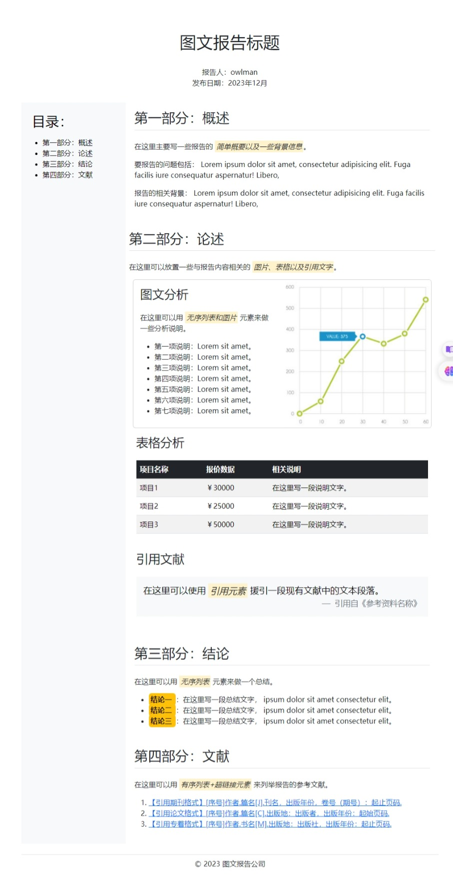
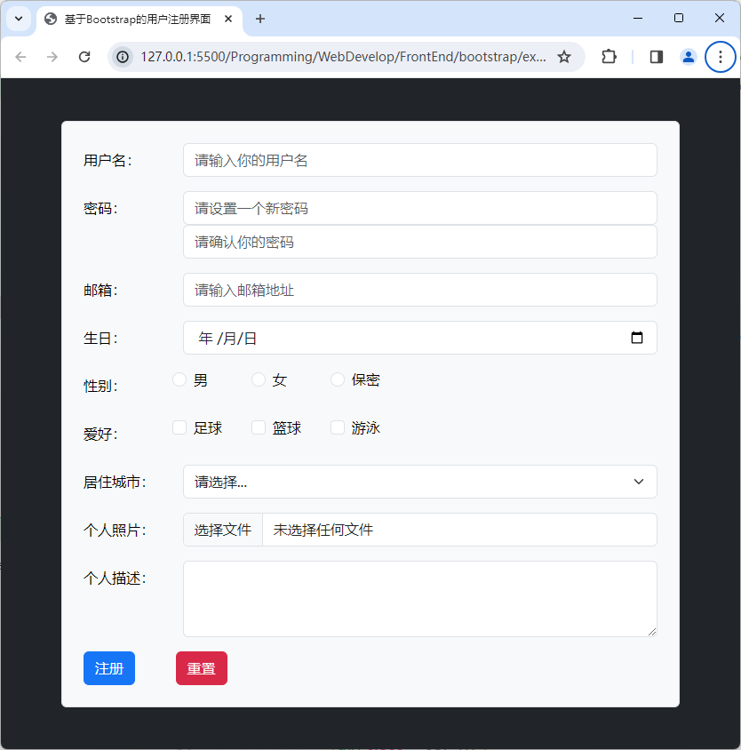
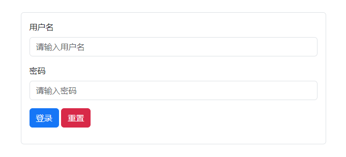
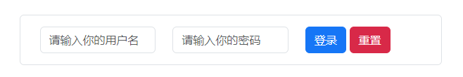

#! https://zhuanlan.zhihu.com/p/673657190
# Bootstrap 学习笔记

从方法论的角度来说，采用从零开始编写HTML+CSS代码的做法对于网页设计教学是非常有必要的，它能让初学者以“在做中学，学中做”的方式来实现快速入门，但在实际的生产环境中，继续这样做就不见得是最佳实践了，因为它不仅非常耗时费力，而且也极易出错，所以对网页设计师的要求也相对较高。如果我们平常只是一个前端程序员，并没有经历过专业的美术训练，那么大概率会在网页整体布局、图文信息排版、用户界面设计等问题上遇到较大的挑战。因此，在实际生产过程中，设计师们往往更倾向于使用成熟的第三方框架来辅助进行网页设计的工作。这篇笔记中，我们将致力于记录如何学习基于Bootstrap框架来快速完成网页的设计工作。

## 框架简介

Bootstrap框架是一款由Twitter公司推出、基于HTML+CSS+JavaScript技术实现的、用于网页设计的开源工具集，其中提供了一系列可重用的页面组件、样式类以及脚本代码，旨在帮助网页设计师快速构建出既充满专业感，又显得精致美观的网页（以及基于网页技术的应用程序界面）。目前，Bootstrap框架被广泛用于各种主流的Web应用中，例如Bing、LinkedIn、Instagram、Pinterest、Reddit、StackOverflow等，该框架在网页设计领域的最大竞争优势来自于以下几个方面：

- Bootstrap框架对响应式布局的强大支持。通过在项目中引入该框架，设计师们可以非常轻松地设计出能自动适应不同屏幕尺寸的网页，这将有助于提供更好的用户体验。在移动设备越来越普及的今天，响应式布局已经成为了Web开发的标配，Bootstrap框架的出现为开发者提供了一个快速实现响应式布局的工具。

- Bootstrap框架提供了丰富的用户界面组件和JavaScript插件（如导航栏、表格、表单、模态框等），这些组件和插件都经过了精心的设计和优化，能在不同的显示设备和浏览器上保持一致的显示效果，可以帮助设计师们轻松、快速地构建出各种常见的界面元素，这将大大提高他们的工作效率。除了现成的界面组件和JavaScript插件外，Bootstrap框架还支持自定义主题和样式，开发者可以根据自己的需求进行定制，从而实现更加个性化的界面设计。

- Bootstrap框架的开发者们还为初学者提供了详细的文档、丰富的示例代码以及完善的社区支持，这些资源都极大地平缓了该框架的学习曲线，使得人们快速掌握该框架的使用方法，这也是笔者在这里大力推荐读者基于 Bootstrap框架来学习网页设计的原因之一。

总而言之，Bootstrap框架是一款功能强大、易用性高、可扩展性强的前端开发框架，它为网页设计师们提供了快速构建响应式布局和常见Web界面元素的工具，极大地提高了开发效率和用户体验。如果读者想成为一名前端开发者，Bootstrap框架绝对是你应该要学习的工具之一。截止到本文撰写的时间为止（即2023年12月），Bootstrap框架已经迭代到了5.x版本系列，它相对于4.x和3.x最大的区别在于JavaScript脚本部分的实现，如今的Bootstrap框架在操作DOM时会直接使用ECMAScript 6的原生接口，不再需要额外引入jQuery库了。

本文将基于5.x这一系列的版本来介绍如何使用Bootstrap框架来构建网页，接下来，我们将根据网页设计工作中不同的任务主题来介绍该框架的使用方法。

## 页面整体设计

正如上一节中所说，Bootstrap框架之所以如此受到欢迎，主要因为它提供了大量可重用的界面组件和CSS样式，这些组件和样式可以帮助设计师们快速有效地完成网页的整体设计任务。具体来说，Bootstrap框架在网页整体设计方面可以提供的便利主要如下：

- 它提供了大量的预定义样式，能够帮助网页设计师快速完成网页的整体布局。
- 它提供了大量的预定义模板，能够帮助网页设计师快速选择网页的配色方案。
- 它提供了大量的预定义组件，能够帮助网页设计师快速构建网页中要使用的界面元素。
- 它采用了基于移动设备优先的策略，能够帮助网页设计师快速实现网页的响应式布局。

### 完成整体布局

下面，让我们先从网页的整体布局任务开始。在考虑网页的整体布局时，Bootstrap框架为我们提供了以下几种常见的布局样式：

1. **固定宽度布局**：如果要采用这种布局样式，设计师需要使用`container`类来为网页内容提供了一个中心对齐且具有固定宽度的容器。这种容器会随着屏幕或视口尺寸的改变而调整其宽度。

2. **流体宽度布局**：如果要采用这种布局样式，设计师需要使用`container-fluid`类来为网页元素提供一个宽度为100%的容器，意味着它会占据其父元素或视口的整个宽度。

3. **网格系统布局**：如果要采用这种布局样式，设计师需要先将要设计的网页视为一个由多行多列组成的网格系统，然后用被设置了`row`类的布局类标记定义好页面元素在该网格系统中所处的行位置（栅格系统中可以使用的行数通常不受限的）。最后再用`col-*`类来定义页面元素在该栅格系统中所占的列数（其中的`*`可以取值从1到12的整数，通常可以被划分为12列）。下面是使用该系统进行页面布局的一个示意图：

   

4. **Flexbox布局**：Flexbox是一个独立的CSS布局模型，但Bootstrap框架已经整合了这种布局样式，提供了一系列与Flexbox相关的样式类（包括`d-flex`、 `justify-content-*`、 `align-items-*`等）。这种布局样式可以让设计师在一个容器内以更灵活的方式排列、对齐和分配子元素。与传统的浮动或定位方法相比，Flexbox提供了更多的控制和更简单的解决方案，特别是对于复杂的布局和对齐问题。

5. **组件布局**： Bootstrap框架还提供了许多组件，如导航栏、卡片、警报框等，读者可以使用这些组件来构建特定类型的布局。例如，我们可以使用导航栏组件来创建一个具有导航功能的网站头部。

当然了，除了选择上面其中一种布局方式之外，读者还可以根据自己的具体需求灵活地混合使用这些方式，以便创建出更具复杂性的网页。Bootstrap框架的灵活性及其提供的丰富文档资源可以帮助我们轻松实现各种复杂的网页布局设计。接下来，让我们通过一个简单项目来为读者演示一下在项目中引入Bootstrap框架的具体步骤，以及如何基于该框架来完成网页的整体布局任务，项目的创建过程如下。

1. 在本地计算机中创建一个名为`HelloBootstrap`的文件夹（在这里，我将会将它创建在本笔记文件所在的目录下的`examples`目录中），并在其中创建一个名为`index.htm`的网页文件和两个分别名为`styles`和`scripts`的子目录。

2. 打开网页浏览器，使用搜索引擎找到Bootstrap框架的官网，然后进入到如下图所示的下载页面，并单击图中的「Download」按钮将编译好的CSS和JavaScript文件下载到本地计算机中。当然了，如果读者想使用NPM包管理器来构建自己的项目，也可以直接在项目的根目录下执行`npm install bootstrap --dev`命令来下载该框架。

    

3. 下载完成后，读者会得到一个名为`bootstrap-5.3.2-dist.zip`的压缩包文件，接下来的工作就是要该文件解压并将其中路径为`css/bootstrap.min.css`的文件复制到`HelloBootstrap`项目的`styles`目录下，而路径为`js/bootstrap.min.js`的文件则复制到该项目的`scripts`目录下（如果读者在上一步骤中是使用 NPM来下载框架的，那么这两个文件现在已经存在于当前项目的`/node_modules/bootstrap/dist/css`和`/node_modules/bootstrap/dist/js`这两个目录中，直接使用即可）。在这里，之所以要使用框架中文件名带有`min`的文件，是因为这些文件已经经过压缩处理，可以大大提高网页加载速度。

4. 接下来，读者需要使用VS Code编辑器中打开`HelloBootstrap`项目，并在之前创建的`index.htm`文件的输入如下代码：

    ```html
    <!DOCTYPE html>
    <html lang="zh-CN">
        <head>
            <meta charset="UTF-8">
            <meta name="viewport" content="width=device-width, initial-scale=1.0">
            <link rel="stylesheet" href="styles/bootstrap.min.css">
            <title>基于Bootstrap的网页布局</title>
        </head>
        <body>
            <nav class="p-3 navbar navbar-expand-lg bg-dark navbar-dark">  
                <div class="container">  
                <a class="navbar-brand" href="#">
                    
                    <span style="vertical-align: middle;" >导航栏区域</span>
                </a>  
                <button class="navbar-toggler" type="button"
                    data-bs-toggle="collapse" data-bs-target="#navbarNav"  
                    aria-controls="navbarNav" aria-expanded="false"
                    aria-label="Toggle navigation">
                    <span class="navbar-toggler-icon"></span>  
                </button>  
                <div class="collapse navbar-collapse" id="navbarNav">  
                    <ul class="navbar-nav ms-auto">  
                    <li class="nav-item">  
                        <a class="nav-link" href="#">链接1</a>  
                    </li>  
                    <li class="nav-item">  
                        <a class="nav-link" href="#">链接2</a>  
                    </li>  
                    <li class="nav-item">  
                        <a class="nav-link" href="#">链接3</a>  
                    </li>  
                    </ul>  
                </div>  
                </div>  
            </nav>
            <header class="p-4 bg-secondary text-light">
                <div class="container">
                    <h1>头部区域</h1>
                    <p>
                        header 标记用于定义网页的头部区域，
                        该区域通常用于放置网站的的标题。
                    </p>
                </div>
            </header>
            <main class="p-5">
                <section class="container">
                    <h2>章节区域</h2>
                    <p class="p-4">
                        section 标记用于定义网页中的章节区域，
                        根据要显示的内容类型，同一网页可被划分为多个章节区域。
                    </p> 
                    <div class="d-flex">
                        <aside class="p-3 bg-secondary text-light">
                            <h3>侧边栏区域</h3>
                            <p >aside 标记通常用于设置文章的内部导航。</p>
                            <nav class="navbar flex-column">
                                <a class="nav-link active" href="#">目录 1</a>
                                <a class="nav-link" href="#">目录 2</a>
                                <a class="nav-link" href="#">目录 3</a>
                                <a class="nav-link" href="#">目录 4</a>
                                <a class="nav-link" href="#">目录 5</a>
                                <a class="nav-link" href="#">目录 6</a>
                            </nav>
                        </aside>
                        <article class="p-3">
                            <h3>文章区域</h3>
                            <p class="mx-3">
                                article 标记通常用于定义一篇文章，
                                同一章节中可以有多篇文章。
                            </p>
                            <div class="p-3">
                                <h4>文章标题</h4>
                                <p class="mx-3">
                                    这是一个段落。这是一个段落。这是一个段落。
                                </p>
                                <h5>文章子标题</h5>
                                <p class="mx-3">
                                    这是另一个段落。这是另一个段落。这是另一个段落。
                                </p>
                            </div>
                        </article>        
                    </div>
                </section>
            </main>
            <footer class="p-3 bg-dark text-light  fixed-bottom">
                <div class="container">
                    <p>
                        footer 标记用于定义网页的页脚部分，
                        该区域通常用于放置与网站的合作方、版权相关的信息。
                    </p> 
                </div>
            </footer>
            <script src="./scripts/bootstrap.min.js"></script>
        </body>
    </html>
    ```

5. 在保存上述代码之后，读者就可以使用网页浏览器打开`index.htm`文件查看当前网页设计的结果，其外观样式在Google Chrome浏览器中的效果如下图所示。

    

在上述示例中，我们首先在项目中引入了Bootstrap框架的CSS样式文件和JavaScript文件（以便能该框架提供的外观样式及其相关的功能），然后使用了该框架提供的样式类来完成网页的整体布局，并安排不同布局元素中的内容。关于页面内容的安排，我们会在后面的章节中做专门介绍，现在先来重点关注网页的整体布局。我们在这里主要采用了组件布局和Flexbox布局两大类布局样式。其中，组件布局类的样式主要运用于导航栏区域，而在作为网页主要区域的章节区域中采用的则是Flexbox布局，具体说明如下：

- 在导航栏区域，我们使用`navbar`和`navbar-expand-lg`这两个类创建了一个响应式的`<nav>`元素。在该元素内部，`navbar-brand`类用于定义当前网页的Logo元素（包括图片与文字）。`navbar-nav`类和`nav-item`类用于创建导航栏中的链接列表元素。另外在响应式布局方面，我们还利用`navbar-toggler`类创建了一个按钮元素，当网页在小尺寸的屏幕设备上被访问时它就会被显示出来，而导航链接列表将会被收起，只有当用户点击该按钮时它才会重新被展开或收起。为此，我们需要将导航栏中的链接列表放在一个由`collapse`和`navbar-collapse`这两个类创建的`<div>`元素中。除此之外，我们还为导航链接列表本身添加了一个`ms-auto`类，这也是Bootstrap的响应式工具类之一，它会在小尺寸的屏幕设备上自动将导航链接移到另一侧，以适应屏幕宽度。

- 在章节区域，我们首先使用`d-flex`类创建了一个以`<div>`标记来定义的弹性容器，然后用该容器来完成相关页面元素的排列和定位。这里的`d-flex`类也是Bootstrap框架提供的一个响应式工具类，下面是关于该类的使用说明：
  - **Flex容器**：`d-flex`类被应用于一个HTML元素（通常是`<div>`），将其定义为Flex容器。这意味着该元素的子元素将遵循Flexbox规则进行排列和布局。
  - **子元素排列**：一旦一个元素被定义为Flex容器，它的直接子元素成为Flex项，这些项会在容器内自动排列。你可以使用Bootstrap框架提供的其他类来控制子元素的排列方式，例如`justify-content-*`和`align-items-*`类，用于水平和垂直对齐。
  - **弹性布局**：Flexbox布局提供了一种强大的方式来管理和调整元素之间的空间分配。使用`d-flex`类，你可以轻松实现弹性的网页布局，以适应不同屏幕尺寸和内容需求。
  - **适应性和响应性**：Flexbox是响应式布局的理想选择，因为它可以在不同屏幕尺寸下自动调整元素的排列和大小，无需使用媒体查询。这使得你可以更容易地创建适应各种设备的网页布局。

### 制定配色方案

除了布局方面之外，网页的整体设计任务中还包含了配色方案的选择。由于网页的配色方案对于它所属的品牌标识，以及其用户的使用体验都具有着非常重要的影响，因此在启动一个网页设计项目时，设计师们首要任务之一就是要为网站设计一个符合其所属企业或个人的配色方案，以便增强用户对相关品牌标识的认知和记忆。例如，如今的人看到黄底黑字的配色很容易联想到美团外卖，看到红加白的配色可能就会联想到蜜雪冰城等。

正如你在上述示例中所见，设计师们在使用Bootstrap框架来进行网页整体设计的时候，通常会优先使用`*-primary`、`*-secondary`、`*-success`、`*-danger`、`*-warning`、`*-info`、`*-light`和`*-dark`这八组预定义的样式类来制定网页基础的配色方案，这八组样式类所代表的语义及其默认颜色具体如下：

- `primary`：用于设置配色方案中所使用的主要颜色，默认为蓝色；
- `secondary`：用于设置配色方案中所使用的次要颜色，默认为灰色；
- `success`：用于设置配色方案中代表成功信息的颜色，默认为绿色；
- `danger`：用于设置配色方案中代表危险信息的颜色，默认为红色；
- `warning`：用于设置配色方案中代表警告信息的颜色，默认为黄色；
- `info`：用于设置配色方案中代表提示信息的颜色，默认为蓝色；
- `light`：用于设置配色方案中代表亮色系的配色，默认为浅灰色；
- `dark`：用于设置配色方案中代表暗色系的配色，默认为深灰色。

而对于这八组样式类中的`*`，则主要用于指定要设置颜色的目标，它的常见取值及其作用具体如下：

- `bg`：用于设置其作用元素的背景颜色；
- `text`：用于设置其作用元素的文本颜色；
- `text-bg`：用于设置其作用元素的文本及背景颜色；
- `border`：用于设置其作用元素的边框颜色；
- `link`：用于设置其作用链接元素的文本颜色；
- `link-underline`：用于设置其作用链接元素的下划线颜色；
- `table`：用于设置其作用表格元素的背景颜色；
- `btn`：用于设置其作用按钮元素的文本及背景颜色。
- `btn-outline`：用于设置其作用按钮元素的边框及文本颜色。
- `alert`：用于设置其作用警告框元素的背景颜色。
- `focus-ring`：用于设置其作用元素获得焦点时的边框颜色。

当然了，我们在上述示例中所制定的配色方案采用的都是Bootstrap框架的默认颜色，如果想改变这八组样式类使用的默认颜色，就需要利用到一项叫做SCSS的样式表技术来修改Bootstrap框架的默认设置。具体操作如下：

1. 使用`npm install sass -g`命令安装SCSS编译工具，并将Bootstrap框架的源文件完整的下载到本地（建议使用`npm install bootstrap`命令来下载）。

2. 在Bootstrap框架的源文件中找到路径为`/scss/_variables.scss`，然后通过修改其中的`$primary`、`$secondary`、`$success`、`$danger`、`$warning`、`$info`、`$light`和`$dark`这八组变量来重写Bootstrap框架文件中定义的默认颜色。

3. 最后在终端环境下进入到Bootstrap框架的根目录中，并使用`npm run dist`命令重新编译该框架（在此过程中可能会需要手动安装一些依赖项），并重新将需要的`.css`和`.js`文件复制到自己的项目中，这样就可以让默认的配色方案发生改变了。

## 图文信息排版

在完成了网页的整体设计工作之后，设计师们接下来的工作就是安排要如何显示网页中的具体内容了。而在网页可显示的诸多元素中，最基本的就是图文类元素了，这类元素主要包括标题、段落、强调、引用、链接、列表、表格、图片等。下面，让我们来继续介绍Bootstrap框架中可用于图文信息排版的样式类。和之前的《[[CSS 学习笔记]]》一样，我们在这里也会先通过设计一个简单的示例来演示一下这些样式类在图文信息排版任务中的应用，以便读者能自行去比较相同任务的不同实现方法，从而了解到Bootstrap框架给网页设计工作带来的便利，该示例的构建步骤如下：

1. 在本地计算机中创建一个名为`reportCase`的项目（在这里，我将会将它创建在本笔记文件所在的目录下的`examples`目录中），并按照之前示例中演示的方法将Bootstrap框架引入到当前项目中。

2. 在VS Code这样的代码编辑器中打开刚刚创建项目，然后在该项目的根目录下创建一个`index.htm`文件，并在其中输入以下代码：

    ```html
    <!DOCTYPE html>
    <html lang="zh-CN">
        <head>
            <meta charset="UTF-8">
            <meta name="viewport" 
                content="width=device-width, initial-scale=1.0">
            <link rel="stylesheet" href="./styles/bootstrap.min.css">
            <script src="./scripts/bootstrap.min.js" defer></script>
            <title>网页文本排版示例</title>
        </head>
        <body class="p-4 container">
            <header class="p-3 text-center">
                <h1 class="p-3 m-3">图文报告标题</h1>
                <p class="m-0">报告人：owlman</p>
                <p class="m-0">发布日期：2023年12月</p>
            </header>
            <main class="row">
                <aside class="mt-3 p-3 col-3 text-bg-light">
                    <h2 class="p-2">目录：</h2>
                    <ul>
                        <li>第一部分：概述</li>
                        <li>第二部分：论述</li>
                        <li>第三部分：结论</li>
                        <li>第四部分：文献</li>
                <section class="p-2 col-9">
                    <article class="py-2 my-3 container">
                        <h2 class="mb-4 pb-2 border-bottom">第一部分：概述</h2>
                        <p>
                            在这里主要写一些报告的
                            <em class="mark">简单概要以及一些背景信息</em>。
                        </p>
                        <p>
                            要报告的问题包括：
                            Lorem ipsum dolor sit amet, consectetur elit. 
                            Fuga facilis iure consequatur aspernatur! Libero。
                        </p>
                        <p>
                            报告的相关背景：
                            Lorem ipsum dolor sit amet, consectetur elit. 
                            Fuga facilis iure consequatur aspernatur! Libero。
                        </p>
                    </article>
                    <article class="py-2 my-3">
                        <h2 class="mb-4 pb-2 border-bottom">第二部分：论述</h2>
                        <p>
                            在这里可以放置一些与报告内容相关的
                            <em class="mark">图片、表格以及引用文字</em>。
                        </p>
                        <div class="card m-2">
                            <div class="row  g-0">
                                <div class="card-body col-6">
                                    <h3 class="card-title mb-4">图文分析</h3>
                                    <p class="card-text">
                                        在这里可以用
                                        <em class="mark">无序列表和图片</em>
                                        元素来做一些分析说明。
                                    </p>
                                    <ul class="card-text">
                                        <li>第一项说明：Lorem sit amet。</li>
                                        <li>第二项说明：Lorem sit amet。</li>
                                        <li>第三项说明：Lorem sit amet。</li>
                                        <li>第四项说明：Lorem sit amet。</li>
                                        <li>第五项说明：Lorem sit amet。</li>
                                        <li>第六项说明：Lorem sit amet。</li>
                                        <li>第七项说明：Lorem sit amet。</li>
                                    </ul>
                                </div>
                                
                            </div> 
                        </div>
                        <div class="p-2 m-2">
                            <h3 class="mb-4">表格分析</h3>
                            <table class="table table-striped">
                                <thead class="table-dark">
                                    <tr>
                                        <th>项目名称</th>
                                        <th>报价数据</th>
                                        <th>相关说明</th>
                                    </tr>
                                </thead>
                                <tbody>
                                    <tr>
                                        <td>项目1</td>
                                        <td>￥30000</td>
                                        <td>在这里写一段说明文字。</td>
                                    </tr>
                                    <tr>
                                        <td>项目2</td>
                                        <td>￥25000</td>
                                        <td>在这里写一段说明文字。</td>
                                    </tr>
                                    <tr>
                                        <td>项目3</td>
                                        <td>￥50000</td>
                                        <td>在这里写一段说明文字。</td>
                                    </tr>
                                </tbody>
                            </table>
                        </div>
                        <div class="p-2 m-2">
                            <h3 class="mb-4">引用文献</h3>
                            <blockquote class="p-3 blockquote text-bg-light">
                                <p>
                                    在这里可以使用
                                    <em class="mark">引用元素</em>
                                    援引一段现有文献中的文本段落。
                                </p>
                                <p class="blockquote-footer text-end">
                                    引用自《参考资料名称》
                                </p>
                            </blockquote>
                        </div>                
                    </article>
                    <article class="py-2 my-3 container">
                        <h2 class="mb-4 pb-2 border-bottom">第三部分：结论</h2>
                        <p>
                            在这里可以用
                            <em class="mark">无序列表</em>
                            元素来做一个总结。
                        </p>
                        <ul>
                            <li>
                                <strong class="p-1 text-bg-warning rounded ">
                                    结论一
                                </strong>：在这里写一段总结文字，
                                <span>
                                    ipsum dolor sit amet consectetur elit。
                                </span>  
                            </li>
                            <li>
                                <strong  class="p-1 text-bg-warning rounded">
                                    结论二
                                </strong>：在这里写一段总结文字，
                                <span>
                                    ipsum dolor sit amet consectetur elit。
                                </span>
                            </li>
                            <li>
                                <strong class="p-1 text-bg-warning rounded">
                                    结论三
                                </strong>：在这里写一段总结文字，
                                <span>
                                    ipsum dolor sit amet consectetur elit。
                                </span>
                            </li>
                        </ul>
                    </article>
                    <article class="py-2 mt-3 container">
                        <h2 class="mb-4 pb-2 border-bottom">第四部分：文献</h2>
                        <p>
                            在这里可以用
                            <em class="mark">有序列表+超链接元素</em>
                            来列举报告的参考文献。
                        </p>
                        <ol>
                            <li><a href="https://www.example.com">
                            【引用期刊格式】[序号]作者.篇名[J].刊名，出版年份，卷号（期号）：起止页码.
                            </a></li>
                            <li><a href="https://www.example.com">
                            【引用论文格式】[序号]作者.篇名[C].出版地：出版者，出版年份：起始页码. 
                            </a></li>
                            <li><a href="https://www.example.com">
                            【引用专着格式】[序号]作者.书名[M].出版地：出版社，出版年份：起止页码.
                            </a></li>
                        </ol> 
                    </article>
                </section>
            </main>
            <footer class="mt-4 p-2 border-top row text-center">
                <p class="text-muted">&copy; 2023 图文报告公司</p>
            </footer>        
        </body>
    </html>
    ```

3. 在保存上述代码之后，读者就可以使用网页浏览器打开`index.htm`文件查看当前网页设计的结果，其外观样式在Google Chrome浏览器中的效果如下图所示。

    

正如读者所见，上述示例仅使用Bootstrap框架提供的一系列样式类就实现了《[[CSS 学习笔记]]》一文中用上百行CSS代码实现的类似效果，下面，就让我们分门别类地来介绍一下这些样式类的使用方法。

### 元素基本设置

正如笔者曾经在《[[CSS 学习笔记]]》一文所介绍的，HTML/XML文档中的元素在CSS视角下是以“盒模型”的形式出现在显示设备中的，因此设置元素的尺寸大小，以及它们之间的间距是网页设计工作中最基本，最重要的任务之一。为了完成这一任务，设计师们通常会需要亲自编写相应的在CSS代码，先使用选择器匹配要设置样式的元素，然后利用`width`和`height`属性设置该元素的尺寸大小，用`margin`属性来设置该元素与相邻外界元素之间的距离（即外边距），而`padding`属性则用来设置该元素与其内部子元素之间的距离（即内边距）。但如果在项目中引入了Bootstrap框架，我们通常只需要直接在HTML/XML文档中使用`w-*`、`h-*`、`m-*`和`p-*`这两组预定义的样式类就可以快速完成这一任务。下面，我们就来详细介绍一下这两组样式类。

- `w-*`样式类：以`w-`为前缀的这组样式类主要用于设置元素的宽度尺寸，其可设定的值包括`25`、`50`、`75`、`100`和`auto`五种，其对应的CSS样式值如下表所示：

    | Bootstrap样式类 | CSS样式值 |
    | :--------------- | :--------- |
    | `w-25`            | `{width:25% !important}` |
    | `w-50`            | `{width:50% !important}` |
    | `w-75`            | `{width:75% !important}` |
    | `w-100`          | `{width:100% !important}` |
    | `w-auto`         | `{width:auto !important}` |

- `h-*`样式类：以`h-`为前缀的这组样式类主要用于设置元素的高度尺寸，其可设定的值同样也包括`25`、`50`、`75`、`100`和`auto`这五种，其对应的CSS样式值如下表所示：

    | Bootstrap样式类 | CSS样式值 |
    | :--------------- | :--------- |
    | `h-25`           | `{height:25% !important}` |
    | `h-50`           | `{height:50% !important}` |
    | `h-75`           | `{height:75% !important}` |
    | `h-100`          | `{height:100% !important}` |
    | `h-auto`         | `{height:auto !important}` |

- `m-*`样式类：以`m-`为前缀的这组样式类主要用于设置元素的外边距，其可设置的值主要有`0`、`1`、`2`、`3`、`4`、`5`和`auto`这七种，其对应的CSS样式值如下表所示：

    | Bootstrap样式类 | CSS样式值 |
    | :--------------- | :--------- |
    | `m-0`             | `{margin:0 !important}` |
    | `m-1`             | `{margin:0.25rem !important}` |
    | `m-2`             | `{margin:0.5rem !important}` |
    | `m-3`             | `{margin:1rem !important}` |
    | `m-4`             | `{margin:1.5rem !important}` |
    | `m-5`             | `{margin:3rem !important}` |
    | `m-auto`          | `{margin:auto !important}` |

    当然了，我们也可以在`m`之后加上`l`、`r`、`t`、`b`、`x`、`y`和`a`这七个字母中的任意一个，来分别单独设置元素的外左边距、外右边距、外上边距、外下边距、外左右边距和外上下边距，它们同样可以设置`0`、`1`、`2`、`3`、`4`、`5`和`auto`这七种值，其对应的CSS样式值如下表所示：

    | Bootstrap样式类 | CSS样式值 |
    | :--------------- | :--------- |
    | `ml-0`          | `{margin-left:0 !important}` |
    | `ml-1`          | `{margin-right:0.25 !important}` |
    | `ml-2`          | `{margin-right:0.5 !important}` |
    | `ml-3`          | `{margin-right:1 !important}` |
    | `ml-4`          | `{margin-right:1.5 !important}` |
    | `ml-5`          | `{margin-right:3 !important}` |
    | `ml-auto`       | `{margin-right:auto !important}` |
    | `mr-0`          | `{margin-right:0 !important}` |
    | `mr-1`          | `{margin-right:0.25 !important}` |
    | `mr-2`          | `{margin-right:0.5 !important}` |
    | `mr-3`          | `{margin-right:1 !important}` |
    | `mr-4`          | `{margin-right:1.5 !important}` |
    | `mr-5`          | `{margin-right:3 !important}` |
    | `mr-auto`       | `{margin-right:auto !important}` |
    | `mt-0`          | `{margin-top:0 !important}` |
    | `mt-1`          | `{margin-top:0.25 !important}` |
    | `mt-2`          | `{margin-top:0.5 !important}` |
    | `mt-3`          | `{margin-top:1 !important}` |
    | `mt-4`          | `{margin-top:1.5 !important}` |
    | `mt-5`          | `{margin-top:3 !important}` |
    | `mt-auto`       | `{margin-top:auto !important}` |
    | `mb-0`          | `{margin-bottom:0 !important}` |
    | `mb-1`          | `{margin-bottom:0.25 !important}` |
    | `mb-2`          | `{margin-bottom:0.5 !important}` |
    | `mb-3`          | `{margin-bottom:1 !important}` |
    | `mb-4`          | `{margin-bottom:1.5 !important}` |
    | `mb-5`          | `{margin-bottom:3 !important}` |
    | `mb-auto`       | `{margin-bottom:auto !important}` |
    | `mx-0`          | `{margin-left:0 !important;margin-right:0 !important}` |
    | `mx-1`   | `{margin-left:0.25 !important;margin-right:0.25 !important}` |
    | `mx-2`   | `{margin-left:0.5 !important;margin-right:0.5 !important}` |
    | `mx-3`   | `{margin-left:1 !important;margin-right:1 !important}` |
    | `mx-4`   | `{margin-left:1.5 !important;margin-right:1.5 !important}` |
    | `mx-5`   | `{margin-left:3 !important;margin-right:3 !important}` |
    | `mx-auto`  | `{margin-left:auto !important;margin-right:auto !important}` |
    | `my-0`   | `{margin-top:0 !important;margin-bottom:0 !important}` |
    | `my-1`   | `{margin-top:0.25 !important;margin-bottom:0.25 !important}` |
    | `my-2`   | `{margin-top:0.5 !important;margin-bottom:0.5 !important}` |
    | `my-3`   | `{margin-top:1 !important;margin-bottom:1 !important}` |
    | `my-4`   | `{margin-top:1.5 !important;margin-bottom:1.5 !important}` |
    | `my-5`   | `{margin-top:3 !important;margin-bottom:3 !important}` |
    | `my-auto` | `{margin-top:auto !important;margin-bottom:auto !important}` |

- `p-*`样式类：以`p-`为前缀的这组样式类主要用于设置元素的内边距，其可设置的值也主要有`0`、`1`、`2`、`3`、`4`、`5`和`auto`这七种，其对应的CSS样式值如下表所示：

    | Bootstrap样式类 | CSS样式值 |
    | :--------------- | :--------- |
    | `p-0`             | `{padding:0 !important}` |
    | `p-1`             | `{padding:0.25rem !important}` |
    | `p-2`             | `{padding:0.5rem !important}` |
    | `p-3`             | `{padding:1rem !important}` |
    | `p-4`             | `{padding:1.5rem !important}` |
    | `p-5`             | `{padding:3rem !important}` |
    | `p-auto`          | `{padding:auto !important}` |

    同样的，我们也可以在`p`之后加上`l`、`r`、`t`、`b`、`x`、`y`和`a`这七个字母中的任意一个，来分别单独设置元素的内左边距、内右边距、内上边距、内下边距、内左右边距和内上下边距，它们同样可以设置`0`、`1`、`2`、`3`、`4`、`5`和`auto`这七种值，其对应的CSS样式值如下表所示：

    | Bootstrap样式类 | CSS样式值 |
    | :--------------- | :--------- |
    | `pl-0`   | `{padding-left:0 !important}` |
    | `pl-1`   | `{padding-left:0.25rem !important}` |
    | `pl-2`   | `{padding-left:0.5rem !important}` |
    | `pl-3`   | `{padding-left:1rem !important}` |
    | `pl-4`   | `{padding-left:1.5rem !important}` |
    | `pl-5`   | `{padding-left:3rem !important}` |
    | `pl-auto` | `{padding-left:auto !important}` |
    | `pr-0`      | `{padding-right:0 !important}` |
    | `pr-1`     | `{padding-right:0.25rem !important}` |
    | `pr-2`     | `{padding-right:0.5rem !important}` |
    | `pr-3`     | `{padding-right:1rem !important}` |
    | `pr-4`     | `{padding-right:1.5rem !important}` |
    | `pr-5`     | `{padding-right:3rem !important}` |
    | `pr-auto` | `{padding-right:auto !important}` |
    | `pt-0`       | `{padding-top:0 !important}` |
    | `pt-1`       | `{padding-top:0.25rem !important}` |
    | `pt-2`       | `{padding-top:0.5rem !important}` |
    | `pt-3`       | `{padding-top:1rem !important}` |
    | `pt-4`       | `{padding-top:1.5rem !important}` |
    | `pt-5`       | `{padding-top:3rem !important}` |
    | `pt-auto`  | `{padding-top:auto !important}` |
    | `pb-0`      | `{padding-bottom:0 !important}` |
    | `pb-1`      | `{padding-bottom:0.25rem !important}` |
    | `pb-2`      | `{padding-bottom:0.5rem !important}` |
    | `pb-3`      | `{padding-bottom:1rem !important}` |
    | `pb-4`      | `{padding-bottom:1.5rem !important}` |
    | `pb-5`      | `{padding-bottom:3rem !important}` |
    | `pb-auto` | `{padding-bottom:auto !important}` |
    | `px-0`      | `{padding-left:0 !important; padding-right:0 !important}` |
    |`px-1`|`{padding-left:0.25rem !important; padding-right:0.25rem !important}` |
    |`px-2`| `{padding-left:0.5rem !important; padding-right:0.5rem !important}` |
    |`px-3` |`{padding-left:1rem !important; padding-right:1rem !important}` |
    |`px-4`|`{padding-left:1.5rem !important; padding-right:1.5rem !important}` |
    |`px-5`|`{padding-left:3rem !important; padding-right:3rem !important}` |
    |`px-auto` | `{padding-left:auto !important; padding-right:auto !important}` |
    | `py-0`     | `{padding-top:0 !important; padding-bottom:0 !important}` |
    |`py-1`|`{padding-top:0.25rem !important; padding-bottom:0.25rem !important}` |
    |`py-2`| `{padding-top:0.5rem !important; padding-bottom:0.5rem !important}` |
    | `py-3`| `{padding-top:1rem !important; padding-bottom:1rem !important}` |
    |`py-4`|`{padding-top:1.5rem !important; padding-bottom:1.5rem !important}` |
    |`py-5`| `{padding-top:3rem !important; padding-bottom:3rem !important}` |
    |`py-auto` | `{padding-top:auto !important; padding-bottom:auto !important}` |

正如读者在之前的图文排版示例中所看到的，我们利用Bootstrap框架提供的这些样式类对页面中的很多元素都设置了相应的宽度和内外边距，以便它们可以更合适的形态出现在页面中，这些操作都是对网页进行图文信息排版时首先要完成的任务。

### 文本元素设置

对于网页中可显示的文本类元素，Bootstrap框架首先设置了一些默认的文本样式，然后在此基础上对页面中经常出现的标题、段落、强调、链接等纯文本元素预定义了一系列相应的样式类，并且这些样式类之间还有着一定的相互配合关系。下面，我们来具体介绍一下这部分的内容：

- **默认文本样式**：Bootstrap框架对于网页中显示的文本，做了以下默认设置：
  - `font-family`属性设置为`'Helvetica Neue', Helvetica, Arial, sans-serif`：这是一个常见的字体栈，表示如果用户的设备上有"Helvetica Neue"字体，则使用它，否则依次尝试使用"Helvetica"、"Arial"和"san-serif"字体。
  - `font-size`属性设置为`16px`：这是文本的默认字体大小。在Bootstrap中，`1rem`等于`16px`，因此可以通过设置`rem`单位来快速调整文本的大小。
  - `line-height`属性设置为`1.5`：这是文本行高的默认值。行高指的是文本行与行之间的垂直间距，使用相对单位`1.5`可以确保行高与字体大小的比例关系，使文本更易读。
  - `font-weight`属性设置为`400`：这是文本的默认字体粗细。`400`表示正常的字体粗细，可以通过设置其他值来实现不同的粗细效果，如`bold`表示加粗。

- **标题文本样式**：对于页面中`<h1>`到`<h6>`六个标题元素，Bootstrap框架中预定义了从`h1`到`h6`六个对应的样式类，以便为它们设置更粗的字体属性（即`font-weight`）以及更具有响应能力的字体大小（即`font-size`）。除此之外，该框架还提供了从`display-1`到`display-6`六个样式类，以便设置更大的字体尺寸（即`font-size`）以及更大的行高（即`line-height`）。这些样式类与相应的样式值的对应关系如下表所示：

    | Bootstrap样式类 | CSS样式值 |
    | :--------------- | :--------- |
    | `h1` | `font-size: 3.5rem; line-height: 4rem;` |
    | `h2` | `font-size: 2.5rem; line-height: 3rem;` |
    | `h3` | `font-size: 2rem; line-height: 2.5rem;` |
    | `h4` | `font-size: 1.5rem; line-height: 2rem;` |
    | `h5` | `font-size: 1.25rem; line-height: 1.75rem;` |
    | `h6` | `font-size: 1rem; line-height: 1.5rem;` |
    | `display-1` | `font-size: 6rem; line-height: 1.2;` |
    | `display-2` | `font-size: 5.5rem; line-height: 1.2;` |
    | `display-3` | `font-size: 4.5rem; line-height: 1.2;` |
    | `display-4` | `font-size: 3.5rem; line-height: 1.2;` |
    | `display-5` | `font-size: 2.75rem; line-height: 1.2;` |
    | `display-6` | `font-size: 2rem; line-height: 1.2;` |

    当然了，以上是我根据Bootstrap框架的官方文档所进行的说明，必须要注意的是，这些样式值可能会因为Bootstrap版本的不同而有所变化。建议读者在使用时自行参考该框架的官方文档，以确保信息的准确性。

- **通用文本样式**：对于页面中的文本类元素，Bootstrap框架提供了一系列通用的样式类，以便设计师们可以为页面赋予不同的文本样式，具体如下：
  - `fs-1`到`fs-6`：这组样式类的用法与之前介绍标题文本样式类似，区别是标题文本样式同时包含了对`font-size`和`line-height`这两个属性的设置，而这组样式类只包含对`font-size`属性的设置。
  - `fst-*`：以`fst-`开头的样式类用于设置文本元素的`font-style`属性，其中`*`表示文本元素的字体样式，具体如下：
    - `fst-italic`：该样式类会让其作用的文本以斜体的字体来显示；
    - `fst-normal`：该样式类会让其作用的文本以正常的字体来显示。
  - `fw-*`：以`fw-`开头的样式类用于设置文本元素的`font-weight`属性，其中`*`表示文本元素的字体粗细，具体如下：
    - `fw-light`：该样式类会让其作用的文本以细的字体来显示；
    - `fw-lighter`：该样式类会让其作用的文本以更细的字体来显示；
    - `fw-normal`：该样式类会让其作用的文本以正常的字体来显示；
    - `fw-medium`：该样式类会让其作用的文本以中等粗的字体来显示；
    - `fw-bold`：该样式类会让其作用的文本以粗的字体来显示；
    - `fw-semibold`：该样式类会让其作用的文本以中粗的字体来显示；
    - `fw-bolder`：该样式类会让其作用的文本以更粗的字体来显示；
  - `lh-*`：以`lh-`开头的样式类用于设置文本元素的`line-height`属性，它们的具体作用如下：
    - `lh-base`：该样式类会让其作用的文本以Bootstrap框架默认的行高来显示。
    - `lh-1`：该样式类会让其作用的文本以1倍行高来显示。这意味着文本的行高将与字体大小相等，即每行文本之间没有额外的垂直间距。
    - `lh-sm`：该样式类会让其作用的文本以较小字体大小的行高来显示。具体的行高值会根据具体的字体大小进行调整，以保持一致的比例关系。
    - `lh-lg`：该样式类会让其作用的文本以较大字体大小的行高来显示。同样，具体的行高值会根据字体大小进行调整，以保持一致的比例关系。
  - `text-start`：该样式类会让其作用的段落文本以左对齐的形式来显示；
  - `text-center`：该样式类会让其作用的段落文本以居中对齐的形式来显示；
  - `text-end`：该样式类会让其作用的段落文本以右对齐的形式来显示；
  - `text-truncate`：该样式类会让其作用的段落文本对溢出元素大小的部分呈现带有省略号的截断效果；
  - `text-break`：该样式类会禁止其作用的段落文本对其内容以字母为对象来进行自动换行；
  - `text-wrap`：该样式类会让其作用的文本元素对其内容以单词为对象来进行自动换行；
  - `text-nowrap`：该样式类会禁止其作用的文本元素对其内容进行自动换行；

- **特定文本样式**：对于页面中用`<span>`、`<strong>`、`<em>`、`<small>`、`<abbr>`、`<blockquote>`、`<cite>`、`<code>`、`<sub>`、`<sup>`、`<del>`等标记定义的、具有某种特别语义的文本类元素，Bootstrap框架提供了一系列常用的预定义样式类，以便设计师们赋予它们一些具有凸显效果的样式，具体如下：
  - 颜色样式：如果我们想用颜色来凸显特定文本的外观，可以使用之前介绍过的`text-primary`、`text-secondary`、`text-success`、`text-danger`、`text-warning`、`text-info`、`text-light`、`text-dark`这八个样式类来进行设置，这里就不需要再重复介绍了；
  - `mark`：该样式类会为其作用的文本元素添加类似荧光笔标注的高亮效果；
  - `lead`：该样式类会为其作用的文本元素添加字体放大的强调效果；
  - `small`：该样式类会为其作用的文本元素添加字体放小的注释效果；
  - `text-muted`：该样式类会为其作用的文本元素添加浅灰色字体的注释效果；
  - `text-decoration-line-through`：该样式类会为其作用的文本元素添加删除线的效果；
  - `text-decoration-underline`：该样式类会为其作用的文本元素添加下划线的效果；
  - `text-decoration-none`：该样式类会去除其作用的文本元素中的下划线、删除线等效果；
  - `text-uppercase`：该样式类仅对英文文本有效，效果为文本中所有字母都以大写形式显示；
  - `text-lowercase`：该样式类仅对英文文本有效，样式效果为文本中所有字母都以小写形式；
  - `text-capitalize`：该样式类仅对英文文本有效，样式效果为文本中所有单词的首字母都显示为大写；
  - `blockquote`：该样式类通常会搭配`<blockquote>`标签使用，为其作用的元素添加引用语义的样式；
  - `blockquote-footer`：该样式类通常会搭配`<blockquote>`+`<cite>`标签使用，为其作用的元素添加代表引用出处的样式；

- **链接文本样式**：对于页面中用`<a>`标记的链接文本，Bootstrap框架提供了一系列的预定义样式类，以便设计师们赋予它们一些具有特定效果的样式。下面，我们就逐一来介绍这些样式类：
  - 如果我们想设置链接文本样式中的文本颜色，可以使用`link-primary`、`link-secondary`、`link-success`、`link-danger`、`link-warning`、`link-info`、`link-light`、`link-dark`这八个样式类来进行设置。由于我们在“制定配色方案”一节已经讨论过这些颜色类的用法及其代表的含义，这里就不再赘述了；
  - 如果我们想设置链接文本样式中的文本不透明度，可以使用`link·opacity-*`这组样式类，它们的具体名称及其效果如下：
    - `link-opacity-10`：该样式类会为其作用的链接文本元素设置`10%`的不透明度；
    - `link-opacity-25`：该样式类会为其作用的链接文本元素设置`25%`的不透明度；
    - `link-opacity-50`：该样式类会为其作用的链接文本元素设置`50%`的不透明度；
    - `link-opacity-75`：该样式类会为其作用的链接文本元素设置`75%`的不透明度；
    - `link-opacity-100`：该样式类会为其作用的链接文本元素设置`100%`的不透明度；
  - 如果我们还想设置鼠标悬停在链接之上时的文本透明度，可以使用`link-opacity-*-hover`样式类，这里`*`的取值与`link-opacity-*`相同，效果当然也是相同的，这里就不再复述了。
  - 如果我们想设置的是链接文本样式中下划线的颜色，可以使用`link-underline-primary`、`link-underline-secondary`、`link-underline-success`、`link-underline-danger`、`link-underline-warning`、`link-underline-info`、`link-underline-light`、`link-underline-dark`这八个样式类来进行设置。同样的，由于我们之前在“制定配色方案”一节已经讨论过这些颜色类的用法及其代表的含义，这里就不赘述了；
  - 如果我们还想设置鼠标悬停在链接之上时下划线的颜色，可以考虑使用`link-underline-primary-hover`、`link-underline-secondary-hover`、`link-underline-success-hover`、`link-underline-danger-hover`、`link-underline-warning-hover`、`link-underline-info-hover`、`link-underline-light-hover`、`link-underline-dark-hover`这八个样式类来进行设置。同样的，这里对于颜色类的语法及其代表的含义就不再复述了。
  - 如果我们想设置的是链接文本样式中下划线的不透明度，可以考虑使用`link-underline-opacity-*`这组样式类来进行设置，其中`*`的取值与`link-opacity-*`相同，效果当然也是相同的，这里就不再复述了。
  - 如果我们还想设置鼠标悬停在链接之上时下划线的透明度，可以考虑使用`link-underline-opacity-*-hover`这组样式类来进行设置，其中`*`的取值与`link-opacity-*`相同，效果当然也是相同的，这里就不再复述了。
  - 如果我们想设置的是链接文本样式中下划线与文本之间的距离，可以考虑使用`link-offset-*`这组样式类来进行设置，它们的具体名称及其效果如下：
    - `link-offset-1`：该样式类会在其作用的链接元素的下划线与文本之间设置`1em`的间距；
    - `link-offset-2`：该样式类会在其作用的链接元素的下划线与文本之间设置`2em`的间距；
    - `link-offset-3`：该样式类会在其作用的链接元素的下划线与文本之间设置`3em`的间距；
  - 如果我们还想设置鼠标悬停在链接之上时下划线与文本之间的距离，可以考虑使用`link-offset-*-hover`这组样式类来进行设置，其中`*`的取值与`link-offset-*`相同，效果当然也是相同的，这里就不再复述了。

### 图表元素设置

除了纯文本类的元素，设计师在网页设计工作中还经常会用到列表、表格、图片等图表类元素，以便用于展示一些特定内容的信息。Bootstrap框架中为这些图表类元素提供了多种样式类和组件。下面，让我们继续介绍这部分的样式类和组件。

- **列表元素样式**：对于页面中用`<ul>+<li>`、`<ol>+<li>`这两组标记定义的无序列表或有序列表元素，Bootstrap框架中提供了`list-*`这组样式类来辅助设计师们定义它们的样式，它们的具体名称及其效果如下：
  - `list-unstyled`：该样式类会去除列表类元素中的默认样式，使得列表类元素中的列表项内容不再带有默认的`1.`、`a.`等样式前缀。需要注意的是，该样式类只对其作用的列表元素的直接列表项起作用，如果该列表元素中还嵌套了其他的列表类元素，则这些嵌套的列表类元素依然会带有它们的默认样式；
  - `list-inline`：该样式类会为列表类元素中的列表项内容设置为内联样式，这会使得列表元素中的列表项内容之间没有换行；

- **列表群组样式**：如果我们想在页面中建立一个更为复杂的列表元素，也可以考虑使用由Bootstrap框架提供的、一个名为“列表群组”的专用组件来进行辅助设计。与该组件相关的样式类及其效果主要如下：
  - `list-group`：该样式类通常作用于由`<ul>`或`<ol>`标记定义的列表元素上，效果是将列表元素设置为一个列表群组，其基本样式是一个带有圆角边框的`<ul>`或`<ol>`列表元素，其中列表群组中的列表项内容会以垂直方向排列。
    - 如果想让列表项以水平方向排列，则需要在`list-group`类的后面再加上`list-group-horizontal`样式类；
    - 如果想去掉元素的圆角边框，则需要在`list-group`类的后面再加上`list-group-flush`样式类；
    - 如果是由`<ol>`标记定义的有序列表，则还可以在`list-group`样式类的后面再加上`list-group-numbered`样式类，以使得列表群组中的列表项内容前面会带有有序编号；
  - `list-group-item`：该样式类通常与`list-group`类搭配使用，主要作用于被定义为列表群组的列表元素中的每一个·`<li>`标记上，效果是为每个列表项设置一个基本样式。其基本样式是`<li>`元素中内容与列表项的边框之间没有间距，同时列表项的边框会与列表群组的边框之间有`1px`的间距。
    - 如果想去掉列表项的边框，可以在该样式类的后面再加上`list-group-item-no-border`样式类。
    - `list-group-item`样式类后面通常还会再加上`active`、`disabled`、`focus`、`hover`这四个样式类，它们分别用于设置列表群组元素中的列表项内容处于激活状态、不可用状态、获得焦点状态、鼠标悬停状态时的样式。

- **表格元素样式**：在使用Bootstrap框架设计表格元素的样式时，`table`基本上是必须要用到的样式类,它会为表格设置一些基本的样式。在这个基本样式的基础上，Bootstrap框架中又提供了`table-*`这组样式类来辅助设计师们设置一些更复杂的表格样式，它们的具体名称及其效果如下：
  - 颜色样式：如果我们想设置表格元素的颜色，可以使用之前介绍过的`table-primary`、`table-secondary`、`table-success`、`table-danger`、`table-warning`、`table-info`、`table-light`、`table-dark`这八个样式类来进行设置，这里就不需要再重复介绍了。唯一需要补充的是，这些样式类不仅可以作用于定义整个表格元素的`<table>`标记（以便定义设置表格的全局样式），也可以作用于定义表格各个局部元素的`<thead>`、`<tbody>`、`<tfoot>`、`<tr>`、`<th>`、`<td>`等子标记（以便设置不过的局部样式）；
  - `table-hover`：该样式类会为其作用的表格元素添加鼠标悬停时的效果，与颜色样式相同，该样式类也可作用于表格的局部元素；
  - `table-active`：该样式类通常只作用于表格中的局部元素，被设置的表格行或单元格会呈现高亮效果；
  - `table-striped`：该样式类会为表格类元素中的奇数行设置为浅色背景，偶数行设置为深色背景；
  - `table-bordered`：该样式类会为表格类元素中的所有单元格设置边框；
  - `table-borderless`：该样式类会为表格类元素中的所有单元格去除边框；
  - `table-condensed`：该样式类会为表格类元素中的所有单元格设置紧凑的间距；
  - `table-responsive`：该样式类会为表格类元素设置响应式表格效果，使得表格类元素在移动设备上也可以正常显示；

- **图片元素样式**：对于页面中用``标记定义的图片元素，Bootstrap框架中提供了`img-*`这组样式类，它们的具体名称及其效果如下：
  - `img-fluid`：该样式类会为图片元素设置响应式布局的效果，以便它能自动适应各种尺寸的屏幕；
  - `img-thumbnail`：该样式类会为图片元素设置宽度为`1px`的圆角边框效果；
  - `float-start`：该样式类会为图片元素设置浮动效果，并将其向左浮动；
  - `float-end`：该样式类会为图片元素设置浮动效果，并将其向右浮动；
  - `mx-auto`：该样式类会为已被设置为块级元素的图片设置居中显示的效果；

- **徽章组件**：对于表单元素或页面其他元素中放置的标签元素，我们可以考虑使用Bootstrap框架提供的徽组件来进行辅助设计，下面是该组件的一个简单示例：

    ```html
    <h1>Example heading <span class="badge bg-primary">New</span></h1>
    <h2>Example heading <span class="badge bg-secondary">New</span></h2>
    <h3>Example heading <span class="badge bg-success">New</span></h3>
    <h4>Example heading <span class="badge bg-danger">New</span></h4>
    <h5>Example heading <span class="badge bg-warning">New</span></h5>
    <h6>Example heading <span class="badge bg-info">New</span></h6>
    <h6>Example heading <span class="badge bg-light text-dark">New</span></h6>
    <h6>Example heading <span class="badge bg-dark">New</span></h6>
    ```

  接下来，让我们根据上述示例来介绍一下与徽章组件相关的样式类及其使用方法，具体如下：

  - `badge`：该样式类通常作用于`<span>`或其他用于表示强调的文本类标记，效果是将该标记定义的元素设置为徽章组件，并赋予其默认样式。
  - 如果想改变徽章组件的背景色，则需要在`badge`样式类后面添加`bg-primary`、`bg-secondary`、`bg-success`、`bg-danger`、`bg-warning`、`bg-info`、`bg-light`或`bg-dark`这八个样式类中的一个。关于这些配色及其代表的含义，我们之前已经做过介绍，整理就不再重复了；
  - 如果想让徽章组件呈现出更圆的边角、更大的边界半径，则需要在`badge`样式类后面添加一个`rounded-pill`样式类；

- **轮播组件样式**：如果我们想让图片元素以幻灯片的形式呈现在页面中，也可以考虑使用由Bootstrap框架提供的、一个名为“轮播”的专用组件来进行辅助设计，下面是该组件的一个简单示例：
  
    ```html
    <div id="carouselExample" class="carousel slide" data-bs-ride="carousel">
        <!-- 组件指示符 -->
        <div class="carousel-indicators ">
            <button type="button" data-bs-target="#carouselExample"
                data-bs-slide-to="0" class="active" aria-current="true" 
                aria-label="Slide 1">
            </button>
            <button type="button" data-bs-target="#carouselExample" 
                data-bs-slide-to="1" aria-label="Slide 2">
            </button>
            <button type="button" data-bs-target="#carouselExample" 
                data-bs-slide-to="2" aria-label="Slide 3">
            </button>
        </div>
        <!-- 组件主播放区 -->
        <div class="carousel-inner">
            <div class="carousel-item active">
                
                <div class="carousel-caption">
                    <h2>第一张图</h2>
                    <p>关于第一张图的描述文字。</p>
                </div>
            </div>
            <div class="carousel-item">
                
                <div class="carousel-caption">
                    <h2>第二张图</h2>
                    <p>关于第二张图的描述文字。</p>
                </div>
            </div>
            <div class="carousel-item">
                
                <div class="carousel-caption">
                    <h2>第三张图</h2>
                    <p>关于第三张图的描述文字。</p>
                </div>
            </div>
        </div>
        <!-- 组件控制按钮区  -->
        <button class="carousel-control-prev" type="button"
            data-bs-target="#carouselExample" data-bs-slide="prev">
            <span class="carousel-control-prev-icon" aria-hidden="true"></span>
            <span class="visible">上一张</span>
        </button>
        <button class="carousel-control-next" type="button" 
            data-bs-target="#carouselExample" data-bs-slide="next">
            <span class="carousel-control-next-icon" aria-hidden="true"></span>
            <span class="visible">下一张</span>
        </button>
    </div>        
    ```

  接下来，让我们根据上面的示例来简单介绍一下与该组件相关的样式类及其效果，具体如下：
  - `carousel`：该样式类通常作用于组件最外层的`<div>`标记，效果是将该标记所定义的元素设置为轮播组件，并为其设置一些该组件的基本样式。默认情况下，轮播组件采用的是亮色系的样式，如果读者想将其设置为暗色系，则需要在该样式类后面添加`carousel-dark`样式类；
  - `carousel-inner`：该样式类为`carousel`类的次级样式类，通常作用于组件主内容区所在的`<div>`标记，效果是将该标记所定义的元素设置为轮播组件的幻灯片播放器；
  - `carousel-item`：该样式类为`carousel-inner`类的次级样式类，通常作用于组件中每一张幻灯片所在的`<div>`标记，效果是将该标记所定义的元素设置为组件要播放的各张幻灯片。在设置幻灯片元素时，读者需要注意以下事项：
    - 在被设置了该样式类的各个`<div>`标记中，通常必须要有一个同时设置了`active`样式类，否则轮播组件会无法生效；
    - 在被设置了该样式类的各个`<div>`标记中，用于放置图片元素的``标记通常需要设置`d-block`和`w-100`这两个样式类，否则某些浏览器的预定对齐规则可能会破坏该组件的样式；
    - 如果我们想为组件中的每张幻灯片添加文字说明，可以选择在用于放置图片元素的后面添加一个被设置了`carousel-caption`样式类的`<div>`标记，并在该标记中放置说明文字的标题和其他文本类元素。
  - `carousel-control-prev`：该样式类为`carousel`类的次级样式类，通常用于设置轮播组件中切换至上一张幻灯片的控制按钮元素；
  - `carousel-control-next`：该样式类为`carousel`类的次级样式类，通常用于设置轮播组件中切换至下一张幻灯片的控制按钮元素；
  - `carousel-indicators`：该样式类为`carousel`类的次级样式类，通常作用于组件中指示器按钮所在的`<div>`标记，效果是将该标记所定义的元素设置成位于轮播组件底部中间的指示器按钮列表。在设置这些指示器按钮时，读者需要注意以下事项：
    - 这些按钮元素的`data-bs-target`属性必须要设置为当前轮播组件的`id`属性值；
    - 这些按钮元素的`data-bs-slide-to`属性必须要设置为当前幻灯片索引值；
    - 这些按钮元素中必须要有一个被设置了`active`样式类，否则这些按钮元素将无法正常工作；

- **图文卡片组件**：如果我们想在页面中设置一些图文混合的元素，可以考虑使用Bootstrap框架中提供的卡片组件来进行辅助设计，下面是该组件的一个简单示例：
  
    ```html
    <div class="card w-25">
        <div class="card-header">
            这里是卡片组件的头部区域
        </div>
        
        <div class="card-body">
            <h4 class="card-title">这是卡片组件的标题</h4>
            <h5 class="card-subtitle">这是卡片组件的子标题</h5>
            <p class="card-text">这里是卡片组件的主体部分。</p>
            <ul class="list-group list-group-flush">
                <li class="list-group-item">列表文本 1</li>
                <li class="list-group-item">列表文本 2</li>
                <li class="list-group-item">列表文本 3</li>
            </ul>
            <a class="card-link" href="">链接文本 1</a>
            <a class="card-link" href="">链接文本 2</a>
        </div>
        <div class="card-footer">
            这里是卡片组件的底部区域
        </div>
    </div>
    ```

  接下来，让我们根据上面的示例来简单介绍一下与该组件相关的样式类及其使用方法，具体如下：
  - `card`：该样式类用于将要设置图文混合元素的`<div>`标记定义为卡片组件，并赋予了它一些脚本样式；
  - `card-header`：该样式类为`card`类的次级样式类，通常用于为卡片组件定义其头部区域；
  - `card-body`：该样式类为`card`类的次级样式类，通常用于为卡片组件定义其主体内容区域；
  - `card-footer`：该样式类为`card`类的次级样式类，通常用于为卡片组件定义其底部区域；
  - `card-title`：该样式类为`card`类的次级样式类，通常用于为卡片组件定义其标题；
  - `card-subtitle`：该样式类为`card`类的次级样式类，通常用于为卡片组件定义其副标题；
  - `card-text`：该样式类为`card`类的次级样式类，通常用于为卡片组件定义其文本内容；
  - `card-link`：该样式类为`card`类的次级样式类，通常用于为卡片组件定义其链接；
  - `card-img-*`：该样式类为`card`类的次级样式类，通常用于为卡片组件定义其图片，其中的`*`可以取值`top`、`bottom`和`overlay`，分别表示该图片位于卡片组件的顶部、底部，或是覆盖在卡片组件的背景色之上；

- **折叠组件**：如果我们想让在页面中设置一个用于控制单个元素显示的开关，也可以考虑使用由Bootstrap框架提供的折叠组件来进行辅助设计，下面是该组件的一个简单示例：

    ```html
    <div id="collapseDemo">
        <a class="btn btn-primary" data-bs-toggle="collapse" 
            href="#collapseExample" role="button" aria-expanded="false" 
            aria-controls="collapseExample">
            使用链接控制
        </a>
        <button class="btn btn-primary" type="button" 
            data-bs-toggle="collapse" data-bs-target="#collapseExample" 
            aria-expanded="false" aria-controls="collapseExample">
            使用按钮控制
        </button>
        <div class="collapse show" id="collapseExample">
            <div class="card card-body">
                这里是一个卡片组件。
            </div>
        </div>
    </div>
    ```

  接下来，我们根据上述示例来介绍一下折叠组件的使用方法以及相关的样式类，具体如下：
  - `collapse`：该样式类通常作用于`<div>`或其他布局类的标记，效果是将该标记定义的元素设置为一个折叠组件，以便用于放置要被控制显示的内容。在使用该样式类设置折叠组件时，读者需要注意以下事项：
  - `show`：折叠组件所控制的元素在默认情况下是被隐藏的，如果我们想让该元素在页面加载时默认显示，则需要为折叠组件的`<div>`标记添加`show`样式类；
    - 如果想让折叠组件真正发挥作用，我们就必须要为它设置一个具有唯一性的`[id属性值]`。然后，如果控制按钮是由`<a>`标记定义的，那么就需要将`<a>`标记的`herf`属性值设置为`#[id属性值]`；如果控制按钮是由`<button>`标记定义的，则需将`<button>`标记的`data-bs-target`属性值设置为`#[id属性值]`；

- **手风琴组件**：如果我们想在页面中设置一个用于控制多个元素显示的折叠面板，可以考虑使用Bootstrap框架中提供的手风琴组件来进行辅助设计，下面是该组件的一个简单示例：
  
    ```html
    <div class="accordion" id="accordionExample">
        <div class="accordion-item">
            <h2 class="accordion-header" id="headingOne">
                <button class="accordion-button" type="button" 
                    data-bs-toggle="collapse" data-bs-target="#collapseOne" 
                    aria-expanded="true" aria-controls="collapseOne">
                    标题1
                </button>
            </h2>
            <div id="collapseOne" class="accordion-collapse collapse show"
                aria-labelledby="headingOne" 
                data-bs-parent="#accordionExample">
                <div class="accordion-body">
                    第一个元素。
                </div>
            </div>
        </div>
        <div class="accordion-item">
            <h2 class="accordion-header" id="headingTwo">
                <button class="accordion-button collapsed" type="button" 
                    data-bs-toggle="collapse" data-bs-target="#collapseTwo" 
                    aria-expanded="false" aria-controls="collapseTwo">
                    标题2
                </button>
            </h2>
            <div id="collapseTwo" class="accordion-collapse collapse"
                aria-labelledby="headingTwo" 
                data-bs-parent="#accordionExample">
                <div class="accordion-body">
                    第二个元素。
                </div>
            </div>
        </div>
        <div class="accordion-item">
            <h2 class="accordion-header" id="headingThree">
                <button class="accordion-button collapsed" type="button" 
                    data-bs-toggle="collapse" data-bs-target="#collapseThree" 
                    aria-expanded="false" aria-controls="collapseThree">
                    标题3
                </button>
            </h2>
            <div id="collapseThree" class="accordion-collapse collapse"
                aria-labelledby="headingThree" 
                data-bs-parent="#accordionExample">
                <div class="accordion-body">
                    第三个元素。
                </div>
            </div>
        </div>
    </div>
    ```

  接下来，我们根据上述示例来介绍一下手风琴组件的使用方法以及相关的样式类，具体如下：
  - `accordion`：该样式类通常作用于`<div>`或其他布局类标记，效果是将该标记定义的元素设置为一个手风琴组件，以便用于放置手风琴组件中的各个子项。
  - `accordion-item`：该样式类是`accordion`类的次级样式类，通常作用于手风琴组件内第一级的`<div>`或其他布局类标记，效果是将该标记定义的元素设置为一个手风琴组件中各个子项的容器，以便具体放置构成这些子项的元素。
  - `accordion-header`：该样式类是`accordion-item`类的次级样式类，通常作用于手风琴组件内各子项中的标题类标记（从`<h1>`到`<h6>`），效果是将该标记定义的元素设置为一个手风琴组件中各子项的标题，同时用于放置这些子项的控制按钮。默认为显示状态，如果想将其设置为默认隐藏，则需要在该样式类后面添加`collapsed`样式类。
  - `accordion-button`：该样式类是`accordion-header`类的次级样式类，通常作用于手风琴组件中各子项标题内的`<button>`或`<a>`标记，效果是将该标记定义的元素设置为一个手风琴组件中各子项的控制按钮，以便用于控制该子项主体部分的显示与隐藏。
  - `accordion-collapse`：该样式类是`accordion-item`类的次级样式类，通常作用于手风琴组件内各子项标题部分的后面，用于充当其主体部分容器的`<div>`或其他布局类标记，以便用于放置手风琴组件中各子项主体部分的显示内容。
  - `accordion-body`：该样式类是`accordion-collapse`类的次级样式类，通常作用于被设置了`accordion-collapse`类的元素内部的第一级`<div>`或其他布局类标记，以便用于放置手风琴组件中各子项主体部分的具体内容。

- **选项卡组件**：如果我们想以选项卡的方式来组织页面中的图文内容，可以考虑使用Bootstrap框架中提供的选项卡组件来进行辅助设计，下面是该组件的一个简单示例：

    ```html
    <div id="tabdemo">
        <ul class="nav nav-tabs" role="tablist">
            <li class="nav-item" role="presentation">
                <button class="nav-link active" id="tab1-tab" 
                    data-bs-toggle="tab" data-bs-target="#tab1" 
                    aria-controls="tab1" aria-selected="true">
                    选项卡 1
                </button>
            </li>
            <li class="nav-item" role="presentation">
                <button class="nav-link" id="tab2-tab"
                    data-bs-toggle="tab" data-bs-target="#tab2"
                    aria-controls="tab2" aria-selected="false">
                    选项卡 2
                </button>
            </li>
            <li class="nav-item" role="presentation">
                <button class="nav-link" id="tab3-tab"
                    data-bs-toggle="tab" data-bs-target="#tab3"
                    aria-controls="tab3" aria-selected="false">
                    选项卡 3
                </button>
            </li>
            <li class="nav-item" role="presentation">
                <button class="nav-link disabled" id="tab4-tab"
                    data-bs-toggle="tab" data-bs-target="#tab4"
                    aria-controls="tab4" aria-selected="false">
                    禁用选项卡
                </button>
            </li>
        </ul>
        <div class="tab-content container p-3">
            <div class="tab-pane fade show active" id="tab1"
                    role="tabpanel" aria-labelledby="tab1-tab">
                这是选项卡1的内容
            </div>
            <div class="tab-pane fade" id="tab2" role="tabpanel"
                aria-labelledby="tab2-tab">
                这是选项卡2的内容
            </div>
            <div class="tab-pane fade" id="tab3" role="tabpanel" 
                aria-labelledby="tab3-tab">
                这是选项卡3的内容
            </div>
            <div class="tab-pane fade" id="tab4" role="tabpanel" 
                aria-labelledby="tab4-tab">
                这是禁用选项卡的内容
            </div>
        </div>
    </div>
    ```

  接下来，让我们根据上面的示例来简单介绍一下与该组件相关的样式类及其使用方法，具体如下：

- `nav-tabs`：该样式类通常作用于设置了`nav`样式类的`<ul>`标记，效果是将该无序列表定义为选项卡组件的导航栏部分。另外，如果想让选项卡组件正常工作，我们还需为该`<ul>`标记设置`role`属性，并将该属性的值设置为`tablist`；
- `nav-item`：该样式类是和`nav`和`nav-tabs`这两个类的次级样式类，通常作用于设置了`nav-tabs`样式类的`<ul>`标记内部的各`<li>`标记，效果是将这些列表项设置为选项卡组件中导航栏部分的各个子项。同样，如果想让这些导航项正常工作，我们还需为这些`<li>`标记设置`role`属性，并将该属性的值设置为`presentation`；
- `nav-link`：该样式类用于设置选项卡组件中导航项的样式，通常作用于设置了`nav-item`样式类的`<li>`内部的`<a>`或`<button>`标记，效果是将该标记设置为链接样式；在设置这些导航项的样式时，读者需要注意以下事项：
  - 如果想让当前导航项处于默认被激活的状态，就需要在`nav-link`类后面再加上`active`样式类；
  - 如果想让当前导航项处于禁用状态，就需要在`nav-link`类后面再加上`disabled`样式类；
- `tab-content`：该样式类通常作用于选项卡组件中紧跟着导航栏部分后面的`<div>`标记，效果是将该标记定义的元素设置为充当组件中各选项卡元素的容器；
- `tab-pane`：该样式类通常作用于设置了`tab-content`样式类的`<div>`标记内第一级的各个`<div>`标记，效果是将这些标记设置为选项卡组件中的各个选项卡；在设置这些选项卡元素时，读者需要注意以下事项：
  - 每个`<div>`标记都应该有一个`id`属性，该属性的值应该与被设置了`nav-link`类的标记中`aria-controls`属性的值相同；
  - 如果想让组件中的各个选项卡都能正常发挥作用，我们就需要为这些`<div>`标记设置`role`属性，并将该属性的值设置为`tabpanel`；
  - 如果想赋予组件中的各选项卡元素在被切换时有淡入淡出的效果，我们就需要在`tab-pane`类后面再加上`fade`样式类；
  - 如果想让组件中的某个选项卡在页面载入时默认显示，我们就需要回到该选项卡所在的`<>`标记的`class`属性中，在`tab-pane`类后面再加上`show`样式类；
  - 如果想让组件中的某个选项卡默认处于激活状态，我们就需要回到该选项卡所在的`<>`标记的`class`属性中，在`tab-pane`类后面再加上`active`样式类；

- **分页导航组件**：如果我们想让页面中的内容分页显示，可以考虑使用Bootstrap框架中提供的分页组件来进行辅助设计，下面是该组件的一个简单示例：
  
    ```html
    <nav id="paginationExample" aria-label="Page navigation example">
        <ul class="pagination">
            <li class="page-item disabled">
                <a class="page-link" href="#" tabindex="-1" 
                    aria-disabled="true">Previous</a>
            </li>
            <li class="page-item active" aria-current="page">
                <a class="page-link" href="#">1</a>
            </li>
            <li class="page-item">
                <a class="page-link" href="#">2</a>
            </li>
            <li class="page-item">
                <a class="page-link" href="#">3</a>
            </li>
            <li class="page-item">
                <a class="page-link" href="#">Next</a>
            </li>
        </ul>
    </nav>
    ```

  接下来，让我们根据上面的示例来简单介绍一下与该组件相关的样式类及其使用方法，具体如下：  
  - `pagination`：该样式类通常作用于`<nav>`标记下面的`<ul>`标记，效果是将该无序列表元素设置为分页组件，并赋予其该组件的基本样式；
  - `page-item`：该样式类是`pagination`类的次级样式类，通常作用于分页组件中的每个`<li>`标记，效果是将这些列表项设置为该组件中跳转按钮的样式。在设置这些跳转按钮元素时，读者还需要注意以下事项：
    - 如果想让某个跳转按钮处于禁用状态，则需要在`page-item`类后面再添加一个`disabled`样式类；
    - 如果想将某个跳转按钮设置为默认激活状态，则需要在`page-item`类后面再添加一个`active`样式类；
  - `page-link`：该样式类是`page-item`类的次级样式类，通常被放置在被设置了`page-item`样式类的`<li>`标记的内部，作用是具体设置组件中各个分页所在的链接；

## 交互界面设计

自从Ajax等Web2.0技术问世以来，基于HTML+CSS+JavaScript技术的交互界面设计日益成为了网页设计工作中至关重要的一环，一个精心设计的交互界面可以提供直观、易用和愉悦的用户体验。换而言之，只要设计师们为应用程序的前端设计了布局合理，简单直观的交互界面，用户就可以轻松地实现与应用程序后端的交互，这对于该应用的推广是至关重要的。在这一节内容中，我们就来介绍Bootstrap框架在交互界面设计方面的应用，先从网页中最常用的交互界面组件：表单元素的样式设置开始。

### 表单样式设置

在具体介绍Bootstrap框架为表单元素提供的样式类之前，我们在这里也会参照之前在《[[CSS 学习笔记]]》中所做的任务，先通过一个基于表单元素的用户注册界面来演示一下Bootstrap框架在交互界面设计任务中的应用，以便读者能自行去比较这两种对于相同任务的不同实现方法，从而了解到Bootstrap框架给网页设计工作带来的便利，该示例的构建步骤如下：

1. 在本地计算机中创建一个名为`formCase`的项目（在这里，我将会将它创建在本笔记文件所在的目录下的`examples`目录中），并按照之前示例中演示的方法将Bootstrap框架引入到当前项目中。

2. 在VS Code这样的代码编辑器中打开刚刚创建项目，然后在该项目的根目录下创建一个`index.htm`文件，并在其中输入以下代码：

    ```html
    <!DOCTYPE html>
    <html lang="zh-CN">
        <head>
            <meta charset="UTF-8">
            <meta name="viewport" content="width=device-width, initial-scale=1.0">
            <link rel="stylesheet" href="./styles/bootstrap.min.css">
            <script src="./scripts/bootstrap.min.js" defer></script>
            <title>基于Bootstrap的用户注册界面</title>
        </head>
        <body class="text-bg-dark">
            <main class="container">
                <form method="post" action="http://example.com/user-register"
                    class="text-bg-light border rounded p-4 mt-5 mx-auto" >
                    <div class="row mb-3">
                        <label for="username" class="col-form-label col-2">
                            用户名：
                        </label>
                        <div class="col-10">
                            <input type="text" class="form-control"
                                id="username" name="username"
                                placeholder="请输入你的用户名">
                        </div>    
                    </div>
                    <div class="row mb-3">
                        <label for="password" class="col-form-label col-2">
                            密码：
                        </label>
                        <div class="col-10">
                            <input type="password" class="form-control"
                                id="password" name="password"
                                placeholder="请设置一个新密码">
                            <input type="password" class="form-control"
                                id="repassword" name="repassword"
                                placeholder="请确认你的密码">
                        </div>    
                    </div>
                    <div class="row mb-3">
                        <label for="email" class="col-form-label col-2">
                            邮箱：
                        </label>
                        <div class="col-10">
                            <input type="email" class="form-control"
                                id="email" name="email"
                                placeholder="请输入邮箱地址">
                        </div>    
                    </div>
                    <div class="row mb-3">
                        <label for="birthday" class="col-form-label col-2">
                            生日：
                        </label>
                        <div class="col-10">
                            <input type="date" class="form-control"
                                id="birthday" name="birthday">
                        </div>
                    </div>
                    <div class="row mb-3">
                        <label for="gender" class="col-form-label col-2">
                            性别：
                        </label>
                        <div class="col-10 row">
                            <div class="form-check col-2">
                                <input type="radio" class="form-check-input"
                                    name="gender" id="male" value="male">
                                <label class="form-check-label" for="male">
                                    男
                                </label>
                            </div>
                            <div class="form-check col-2">
                                <input type="radio"  class="form-check-input"
                                    name="gender"  id="female" value="female">
                                <label class="form-check-label" for="female">
                                    女
                                </label>
                            </div>
                            <div class="form-check col-2">
                                <input type="radio"  class="form-check-input"
                                    name="gender"  id="secret" value="secret">
                                <label class="form-check-label" for="secret">
                                    保密
                                </label>
                            </div>
                        </div>
                    </div>
                    <div class="row mb-3">
                        <label for="hobby" class=" col-form-label col-2">
                            爱好：
                        </label>
                        <div class="col-10 row">
                            <div class="form-check col-2">
                                <input type="checkbox" class="form-check-input"
                                    id="hobby" name="hobby" value="football">
                                <label for="hobby" class="form-check-label">
                                    足球
                                </label>
                            </div>
                            <div class="form-check  col-2">
                                <input type="checkbox" class="form-check-input"
                                    id="hobby" name="hobby" value="basketball">
                                <label for="hobby" class="form-check-label">
                                    篮球
                                </label>
                            </div>
                            <div class="form-check col-2">
                                <input type="checkbox" class="form-check-input"
                                    id="hobby" name="hobby" value="swimming">
                                <label for="hobby" class="form-check-label">
                                    游泳
                                </label>
                            </div>
                        </div>
                    </div>
                    <div class="row mb-3">
                        <label for="address" class="col-form-label col-2">
                            居住城市：
                        </label>
                        <div class="col-10">
                            <select class="form-select" name="address" 
                                id="address">
                                <option selected>请选择...</option>
                                <option value="beijing">北京</option>
                                <option value="shanghai">上海</option>
                                <option value="guangzhou">广州</option>
                                <option value="shenzhen">深圳</option>
                            </select>
                        </div>
                    </div>
                    <div class="row mb-3">
                        <label for="file" class="col-form-label col-2">
                            个人照片：
                        </label>
                        <div class="col-10">
                            <input type="file" class="form-control"
                                id="file" name="file">
                        </div>
                    </div>
                    <div class="row mb-3">
                        <label for="textarea" class="col-form-label col-2">
                            个人描述：
                        </label>
                        <div class="col-10">
                            <textarea class="form-control"
                                id="textarea" name="textarea" rows="3"></textarea>
                        </div>
                    </div>
                    <div class="w-25 d-flex justify-content-between">
                        <button type="submit" class="btn btn-primary">
                            注册
                        </button>
                        <button type="reset" class="btn btn-danger">
                            重置
                        </button>
                </form>
            </main>
        </body>
    </html>
    ```

3. 在保存上述代码之后，读者就可以使用网页浏览器打开`index.htm`文件查看当前网页设计的结果，其外观样式在Google Chrome浏览器中的效果如下图所示。

   

同样的，上述示例也只使用Bootstrap框架提供的一系列样式类就实现了《[[CSS 学习笔记]]》一文中用上百行CSS代码实现的类似效果，下面继续来介绍一下这部分样式类的使用方法。

#### 表单整体布局

默认情况下，表单中的元素是纵向排列的，我们通常只需要使用`<div>`将它们分组并设置好一定的间距即可实现基本的布局，例如下面是一个使用了默认布局的用户登录界面：

```html
<form class="border rounded p-3 m-5"
    method="post" action="http://example.com/api">
    <div class="mb-3">
        <label for="username" class="form-label">用户名</label>
        <input type="text" class="form-control" id="username" name="username"
            placeholder="请输入用户名">
    </div>
    <div class="mb-3">
        <label for="password" class="form-label">密码</label>
        <input type="password" class="form-control" id="password" name="password"
            placeholder="请输入密码">
    </div>
    <div class="mb-3">
        <button type="submit" class="btn btn-primary">登录</button>
        <button type="reset" class="btn btn-danger">重置</button>
    </div>
</form>
```

正如读者所见，在上述代码中，我们使用`<div>`元素将表单中的元素进行了分组，并使用`class="mb-3"`设置了它们之间的间距。另外，由于`<form>`标记本身也可以被视为一个用于组织交互界面元素的布局类元素，所以我们同样也它设置了长宽度、边框以及内外边距等样式，其效果如下图所示：



如果想采用水平布局的表单设计，只需要将`<form>`标记的`class`属性值设置为`row`，然后将分组交互元素的`<div>`的`class`属性设置为`col-*`即可，例如下面是一个使用了水平布局的用户登录界面：

```html
<form method="post" action="http://example.com/api"
    class="row border rounded p-3 m-5">
    <div class="col-4">
        <input type="" class="form-control" 
            placeholder="请输入你的用户名">
    </div>
    <div class="col-4">
        <input type="password" class="form-control" 
            placeholder="请输入你的密码">
    </div>
    <div class="col-4">
        <button type="submit" class="btn btn-primary">登录</button>
        <button type="reset" class="btn btn-danger">重置</button>
    </div>
</form>
```

上述代码的显示效果如下图所示：



当然了，由`row`和`col-*`搭配的栅格布局方式也可以用于设计多行多列的表格元素，例如下面这个用于填写用户信息的表单：

```html
<form method="post" action="http://example.com/api"
    class="border rounded p-3 m-5">
    <div class="row p-1">
        <div class="col-6">
            <input type="text" class="form-control"
                name="firstname" id="firstname"
                placeholder="姓">
        </div>
        <div class="col-6">
            <input type="text" class="form-control"
                name="lastname" id="lastname"
                placeholder="名">
        </div>
    </div>
    <div class="row p-1">
        <label for="address" class="col-form-label col-12">
            具体地址：
        </label>
        <div class="col-12">
            <input type="text" class="form-control"
                name="address" id="address"
                placeholder="请输入详细街道地址">
        </div>
    </div>
    <div class="row p-1">
        <div class="col-6">
            <label for="city" class="form-label">城市：</label>
            <input type="text" class="form-control" 
                name="city" id="city">
        </div>
        <div class="col-4">
            <label for="state" class="form-label">国家：</label>
            <input type="text" class="form-control"
                name="state" id="state">
        </div>
        <div class="col-2">
            <label for="zipcode" class="form-label">邮编：</label>
            <input type="text" class="form-control"
                name="zipcode" id="zipcode">
        </div>
    </div>
    <div class="d-flex gap-3 m-2">
        <button type="submit" class="btn btn-primary">提交</button>
        <button type="reset" class="btn btn-danger">重置</button>
    </div>
</form>
```

上述代码的显示效果如下图所示：


#### 表单元素样式

在完成了表单的整体布局之后，接下来就是设置表单中的交互元素了。在Bootstrap框架中，用于设置表单中交互元素的样式类和组件主要有如下几个：

- `form-text`：该样式类主要作用于表单元素中的文本类标记，设置的是提示文本的样式。
- `form-label`：该样式类主要作用于表单元素中的`<label>`标记，设置的是表单标签的样式。
- `form-check`：该样式类主要作用于表单中用来设置单选钮或复选框的`<div>`标记，设置的是表单中一组单选钮或复选框的样式。
- `form-check-inline`：该样式类主要作用于表单元素中用来设置单选钮或复选框的`<div>`标记，通常需要与`form-check`样式类配合使用，效果是将表单中的一组单选钮或复选框设置为水平排列。
- `form-switch`：该样式类主要作用于表单中用来给复选框分组的`<div>`标记，通常需要与`form-check`样式类配合使用，效果是将表单中的一组复选框设置为开关样式。
- `form-check-input`：该样式类主要作用于表单元素中的`<input type="radio">`或`<input type="checkbox">`标记，这两个标记通常会被放置在`class="form-check"`的`<div>`标记内部，设置的是表单中特定单选钮或复选框的样式。
- `form-check-label`：该样式类主要作用于表单中被放置在`class="form-check"`的`<div>`标记内部的`<label>`标记，设置的是表单中特定单选钮或复选框的标签样式。
- `form-file`：该样式类主要作用于表单中的`<input type="file">`标记，设置的是表单中文件上传元素的样式。
- `form-range`：该样式类主要作用于表单中的`<input type="range">`标记，设置的是表单中滑块的样式。
- `form-control`：该样式类主要作用于表单中用`<input>`或`<textarea>`标记定义的元素（上面已经列出的特定元素除外），设置的是表单中一般输入性元素的样式。
- `form-select`：该样式类主要作用于表单中的`<select>`标记，设置的是表单中下拉列表的样式。
- `form-group`：该样式类主要作用于表单中用来给交互元素分组的`<div>`标记，设置的是表单中某一组交互元素的样式。

#### 表单验证设置

在使用表单为应用程序构建交互界面的过程中，设计师们通常还需要为界面中的交互元素设计一些用于在发生操作错误时显示出相关提示的验证类元素，以保证用户输入的内容符合预期。在Bootstrap框架中，用于设置表单中验证类元素的样式类主要有如下几个：

- `is-invalid`：该样式类主要用于表示交互元素的无效状态。该类通常需要与表单中的`<input>`、`<select>`或`<textarea>`等交互元素搭配使用，当这些交互元素得到的用户输入不符合制定验证规则时，可通过相应的JavaScript脚本激活这个类，使其显示为红色边框和红色文字。
- `is-valid`：该样式类主要用于表示交互元素的合法状态。该类通常需要与表单中的`<input>`、`<select>`或`<textarea>`等交互元素搭配使用，当这些交互元素得到的用户输入符合制定验证规则时，可通过相应的JavaScript脚本激活这个类，使其显示为绿色边框和绿色文字。
- `was-validated`：该样式类主要用于表示表单已经通过验证。当表单中的所有必填字段都通过验证时，可以添加这个类，以便显示成功的样式。这个类通常添加在`<form>`元素上。
- `invalid-feedback`：用于显示验证错误的消息。当表单元素的值不符合验证规则时，可以添加这个类，并在其后添加相应的错误提示信息。这个类通常与`<div>`元素一起使用。

除了上述常用的样式类之外，Bootstrap框架中还提供了一些专用的表单验证组件，这些组件可以利用强大的JavaScript脚本来处理表单的验证逻辑，读者可以自行查看官方文档中对于这些组件的相关介绍，这些信息可以帮助你在用户输入不符合预期时显示错误消息，并在表单提交时进行验证。

### 专用交互组件

除了表单元素之外，Bootstrap还提供了一些具有专用功能的交互组件，这些组件可以用来构建更加复杂的交互界面，这些组件主要包括：

- **按钮组件**：对于表单元素或页面其他元素中放置的按钮元素，我们可以考虑使用Bootstrap框架提供的按钮组件来进行辅助设计，下面是该组件的一个简单示例：

    ```html
    <button type="button" class="btn btn-primary">Primary</button>
    <button type="button" class="btn btn-secondary">Secondary</button>
    <button type="button" class="btn btn-success">Success</button>
    <button type="button" class="btn btn-danger">Danger</button>
    <button type="button" class="btn btn-warning">Warning</button>
    <button type="button" class="btn btn-info">Info</button>
    <button type="button" class="btn btn-light">Light</button>
    <button type="button" class="btn btn-dark">Dark</button>
    <button type="button" class="btn btn-link">Link</button>
    ```

  接下来，让我们根据上述示例来介绍一下与按钮组件相关的样式类及其使用方法，具体如下：

  - `btn`：该样式类通常作用于`<button>`或`<a>`标记，效果是将该标记定义的元素设置为按钮组件，并赋予其默认样式。在设置按钮组件时，读者还需要注意以下事项：
    - 如果想改变按钮组件的默认配色，则需要在`btn`样式类后面添加`btn-primary`、`btn-secondary`、`btn-success`、`btn-danger`、`btn-warning`、`btn-info`、`btn-light`或`btn-dark`这八个样式类中的一个。关于这些配色及其代表的含义，我们之前已经做过介绍，整理就不再重复了；
    - 如果想将组件设置为链接样式，则需要在`btn`样式类后面添加一个`btn-link`样式类；

- **下拉菜单组件**：如果我们想在页面中设置一个类似于桌面应用程序中的下拉菜单，则可以使用Bootstrap框架提供的下拉菜单组件来进行辅助设计。下面是该组件的一个简单示例：

    ```html
    <div class="dropdown">
        <button class="btn btn-secondary dropdown-toggle" type="button" 
            id="dropdownMenuButton1" data-bs-toggle="dropdown" 
            aria-expanded="false">
            下拉菜单的按钮元素
        </button>
        <ul class="dropdown-menu" aria-labelledby="dropdownMenuButton1">
            <li><a class="dropdown-item" href="#">菜单项 1</a></li>
            <li><a class="dropdown-item" href="#">菜单项 2</a></li>
            <li><a class="dropdown-item" href="#">菜单项 3</a></li>
        </ul>
    </div>
    ```

  接下来，我们根据上述示例来介绍一下手风琴组件的使用方法以及相关的样式类，具体如下：
  - `dropdown`：该样式类通常作用于一个`<div>`标记，效果是将该标记定义的元素设置为一个下拉菜单组件；
  - `dropdown-toggle`：该样式类是`dropdown`类的次级样式类，通常作用于被设置了`dropdown`类的`<div>`标记内的`<button>`或`<a>`标记，效果是将该标记定义的元素设置为一个下拉菜单组件的控制按钮，以便用于控制下拉菜单组件的显示与隐藏；
  - `dropdown-menu`：该样式类是`dropdown`类的次级样式类，通常作用于被设置了`dropdown`类的`<div>`标记内的`<ul>`标记，效果是将该标记定义的元素设置为一个下拉菜单组件的菜单部分，以便用于放置该组件中的具体菜单项；
  - `dropdown-item`：该样式类是`dropdown-menu`类的次级样式类，通常作用于被设置了`dropdown-menu`类的`<ul>`标记内的`<li>`标记，效果是将该标记定义的元素设置为一个下拉菜单组件中的菜单项，以便用于放置这些菜单项中的具体链接；

- **模态对话框组件**：如果我们想在页面中设置一个类似于桌面应用程序中的弹出式对话框，则可以使用Bootstrap框架提供的模态对话框组件来进行辅助设计。下面是该组件的一个简单示例：

    ```html
    <button type="button" class="btn btn-primary"
        data-bs-toggle="modal" data-bs-target="#modalExample">
        显示模态弹框
    </button>
    <dialog class="modal fade" id="modalExample" tabindex="-1"
        aria-labelledby="modalExampleLabel" aria-hidden="true">
        <div class="modal-dialog">
            <div class="modal-content">
                <div class="modal-header">
                    <h5 class="modal-title" 
                        id="modalExampleLabel">
                        模态弹框标题
                    </h5>
                    <button type="button" class="btn-close"
                        data-bs-dismiss="modal" 
                        aria-label="Close">
                    </button>
                </div>
                <div class="modal-body">
                    <p>这是一个模态弹框组件的简单示例。</p>
                </div>
                <div class="modal-footer">
                    <button type="button" 
                        class="btn btn-secondary"
                        data-bs-dismiss="modal">关闭</button>
                    <button type="button" 
                        class="btn btn-primary">
                        保存更改
                    </button>
                </div>
            </div>
        </div>
    </dialog>
    ```

  接下来，我们根据上述示例来介绍一下该组件的使用方法以及相关的样式类，具体如下：
  - `modal`：该样式类通常作用于一个`<div>`或`<dialog>`标记，效果是将该标记定义的元素设置为一个模态对话框组件。在设置该组件时，读者需要注意以下事项：
    - 由于该组件是一个弹出式对话框，所以我们需要设置一个按钮元素来触发该对话框的弹出。在定义该按钮元素的`<button>`标记中，`data-bs-toggle`属性的值应设置为`modal`，`data-bs-target`属性的值则应为`#[id属性值]`（在这里，`[id属性值]`为模态对话框组件的`id`属性值）。
    - 如果我们想赋予该模态对话框淡入淡出的效果，就需要在`modal`样式类后面再添加一个`fade`样式类；
    - `modal-dialog`：该样式类是`modal`类的次级样式类，通常作用于被设置了`modal`类的`<div>`标记内第一级的`<div>`标记，效果是将该标记定义的元素设置为模态对话框组件的对话框部分。在设置这部分样式时，读者需要注意以下事项：
    - 如果我们想在对话框中使用滚动条元素，就需要在`modal-dialog`样式类后面再添加一个`modal-dialog-scrollable`样式类；
    - 如果我们想在对话框中使用居中布局，就需要在`modal-dialog`样式类后面再添加一个`modal-dialog-centered`样式类；
  - `modal-content`：该样式类是`modal-dialog`类的次级样式类，通常作用于被设置了`modal-dialog`类的`<div>`标记内第一级的`<div>`标记，效果是将该标记定义的元素设置为一个用于放置对话框内部元素的容器；
  - `modal-header`：该样式类是`modal-content`类的次级样式类，通常作用于被设置了`modal-content`类的`<div>`标记内第一级的`<div>`标记，效果是将该标记定义的元素设置为一个模态对话框组件的头部部分。
  - `modal-title`：该样式类是`modal-header`类的次级样式类，通常作用于被设置了`modal-header`类的`<div>`标记内的标题类标记，效果是将该标记定义的元素设置为一个模态对话框组件的标题文本。
  - `modal-body`：该样式类是`modal-content`类的次级样式类，通常作用于被设置了`modal-content`类的`<div>`标记内第一级的`<div>`标记，效果是将该标记定义的元素设置为一个模态对话框组件的身体部分。
  - `modal-footer`：该样式类是`modal-content`类的次级样式类，通常作用于被设置了`modal-content`类的`<div>`标记内第一级的`<div>`标记，效果是将该标记定义的元素设置为一个模态对话框组件的底部部分；

- **进度条组件**：如果我们想在页面中设置一个显示某个操作过程的进度条，就可以使用Bootstrap框架提供的进度条组件来进行辅助设计。下面是该组件的一个简单示例：

    ```html
    <div class="progress">
        <div class="progress-bar" role="progressbar" aria-valuemin="0" 
            aria-valuemax="100" style="width: 25%;">
            25%
        </div>
    </div>
    ```

  接下来，我们根据上述示例来介绍一下该组件的使用方法以及相关的样式类，具体如下：
  - `progress`：该样式类通常作用于一个`<div>`标记，效果是将该标记定义的元素设置为一个进度条组件；
  - `progress-bar`：该样式类是`progress`类的次级样式类，通常作用于被设置了`progress`类的`<div>`标记内第一级的`<div>`，效果是将该标记定义的元素设置为一个该组件的进度条本体部分。在设置这部分样式，我们需要将该`<div>`的`role`属性设置为`progressbar`，将`aria-valuemin`属性设置为`0`，将`aria-valuemax`属性设置为`100`，并将`style`属性设置为`width: 25%;`，以实现进度条的25%进度效果。
  
需要注意的是，本笔记在这里所介绍的只是笔者在个人实践中常用到的Bootstrap组件及其基本使用方法，如果读者想知道更为详细的资料，可以访问[Bootstrap中文网](http://www.bootcss.com/)来查看相关文档。

## 响应式设计扩展

到目前为止，我们所介绍的Bootstrap样式类及其相关的组件，大多数都是针对桌面设备进行设计的。如果我们想让这些样式更好地适应各种移动设备，就需要使用Bootstrap框架提供的、专用于响应式设计的样式类。在命名规则上，这些类都是加了`-sm`、`-md`、`-lg`和`-xl`后缀的，这些后缀的具体含义如下所示：

- `-sm`：表示样式类适用于小尺寸的屏幕设备（屏幕宽度小于768像素）。
- `-md`：表示样式类适用于中等尺寸的屏幕设备（屏幕宽度大于等于768像素，小于等于992像素）。
- `-lg`：表示样式类适用于大尺寸的屏幕设备（屏幕宽度大于等于992像素，小于等于1200像素）。
- `-xl`：表示样式类适用于超大尺寸的屏幕设备（屏幕宽度大于等于1200像素）。

在接下来的这一节中，我们将会分门别类地针对这些扩展类做一些补充，先从元素的基本设置开始。

- **元素显示方式**：Bootstrap框架中提供了一系列用于设置元素显示样式的扩展类，以便用于设置元素在不同屏幕尺寸下的显示方式，这些扩展类具体如下：
- `d-block`：该样式类用于设置元素在所有屏幕尺寸下的显示方式；
- `d-sm-block`：该样式类用于设置元素在小尺寸的屏幕设备下显示；
- `d-md-block`：该样式类用于设置元素在中等尺寸的屏幕设备下显示；
- `d-lg-block`：该样式类用于设置元素在大尺寸的屏幕设备下显示；
- `d-xl-block`：该样式类用于设置元素在超大尺寸的屏幕设备下显示；
- `d-none`：该样式类用于设置元素在特定尺寸的屏幕设备下隐藏；
- `hidden-sm`：该样式类用于设置元素在小尺寸的屏幕设备下隐藏；
- `hidden-md`：该样式类用于设置元素在中等尺寸的屏幕设备下隐藏；
- `hidden-lg`：该样式类用于设置元素在大尺寸的屏幕设备下隐藏；
- `hidden-xl`：该样式类用于设置元素在超大尺寸的屏幕设备下隐藏；

- **栅格布局系统**：在Bootstrap框架中，我们可以通过以下扩展类对栅格布局方式进行补充，使其能更好地适应不同的屏幕尺寸：
  - `col-sm-*`：该扩展类用于设置元素在小尺寸的屏幕设备下所占的列数；
  - `col-md-*`：该扩展类用于设置元素在中等尺寸的屏幕设备下所占的列数；
  - `col-lg-*`：该扩展类用于设置元素在大尺寸的屏幕设备下所占的列数；
  - `col-xl-*`：该扩展类用于设置元素在超大尺寸的屏幕设备下所占的列数；
  除此之外，Bootstrap框架还为它的网格系统提供了以下基于响应式设计的扩展：
  - `offset-sm-*`：该扩展类用于设置元素在小尺寸的屏幕设备下所偏移的列数；
  - `offset-md-*`：该扩展类用于设置元素在中等尺寸的屏幕设备下所偏移的列数；
  - `offset-lg-*`：该扩展类用于设置元素在大尺寸的屏幕设备下所偏移的列数；
  - `offset-xl-*`：该扩展类用于设置元素在超大尺寸的屏幕设备下所偏移的列数；
  - `order-sm-*`：该扩展类用于设置元素在小尺寸的屏幕设备下的排序顺序；
  - `order-md-*`：该扩展类用于设置元素在中等尺寸的屏幕设备下的排序顺序；
  - `order-lg-*`：该扩展类用于设置元素在大尺寸的屏幕设备下的排序顺序；
  - `order-xl-*`：该扩展类用于设置元素在超大尺寸的屏幕设备下的排序顺序；

- **表单交互元素**：针对表单中交互元素的响应式设计，Bootstrap框架也提供了以下扩展类：
  - `form-control-sm`：该扩展类用于设置输入性元素在小尺寸的屏幕设备下的样式；
  - `form-control-md`：该扩展类用于设置输入性元素在中等尺寸的屏幕设备下的样式；
  - `form-control-lg`：该扩展类用于设置输入性元素在大尺寸的屏幕设备下的样式；
  - `form-control-xl`：该扩展类用于设置输入性元素在超大尺寸的屏幕设备下的样式；
  - `btn-block-sm`：该扩展类用于设置按钮元素在小尺寸的屏幕设备下的样式；
  - `btn-block-md`：该扩展类用于设置按钮元素在中等尺寸的屏幕设备下的样式；
  - `btn-block-lg`：该扩展类用于设置按钮元素在大尺寸的屏幕设备下的样式；
  - `btn-block-xl`：该扩展类用于设置按钮元素在超大尺寸的屏幕设备下的样式；

- **图文卡片组件**：针对图文卡片组件的响应式设计，Bootstrap框架同样也为其中的图片元素提供了以下扩展类：
  - `card-img-*-sm`：该扩展类用于设置卡片组件中图片元素在小尺寸的屏幕设备下的样式；
  - `card-img-*-md`：该扩展类用于设置卡片组件中图片元素在中等尺寸的屏幕设备下的样式；
  - `card-img-*-lg`：该扩展类用于设置卡片组件中图片元素在大尺寸的屏幕设备下的样式；
  - `card-img-*-xl`：该扩展类用于设置卡片组件中图片元素在超大尺寸的屏幕设备下的样式；
  在上述扩展类中，`*`的取值可以是`top`、`bottom`和`overlay`，分别用于表示图片元素是位于卡片组件的顶部、底部，或是覆盖在卡片组件的背景色之上。

- **导航栏组件**：针对导航栏组件的响应式设计，Bootstrap框架同样也提供了以下扩展类：
  - `navbar-expand-sm`：该扩展类用于设置导航栏组件在小尺寸的屏幕设备下的样式；
  - `navbar-expand-md`：该扩展类用于设置导航栏组件在中等尺寸的屏幕设备下的样式；
  - `navbar-expand-lg`：该扩展类用于设置导航栏组件在大尺寸的屏幕设备下的样式；
  - `navbar-expand-xl`：该扩展类用于设置导航栏组件在超大尺寸的屏幕设备下的样式；

- **分页导航组件**：针对分页导航组件的响应式设计，Bootstrap框架同样也提供了以下扩展类：
  - `pagination-sm`：该扩展类用于设置分页导航组件在小尺寸的屏幕设备下的样式；
  - `pagination-md`：该扩展类用于设置分页导航组件在中等尺寸的屏幕设备下的样式；
  - `pagination-lg`：该扩展类用于设置分页导航组件在大尺寸的屏幕设备下的样式；
  - `pagination-xl`：该扩展类用于设置分页导航组件在超大尺寸的屏幕设备下的样式；

同样需要提醒的是，本笔记在这里所介绍的只是笔者在个人实践中常用到的Bootstrap框架的响应式设计扩展类，读者可以根据自己的需求，自行查阅Bootstrap框架的官方文档，了解更多的相关资料。
