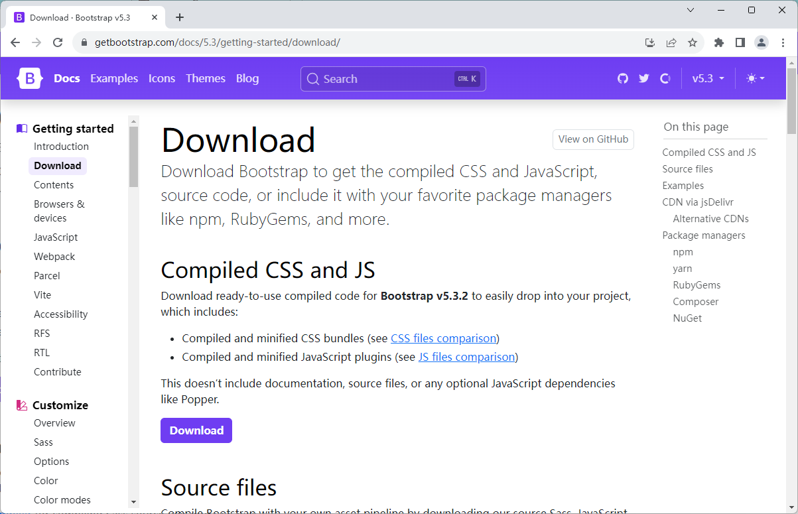
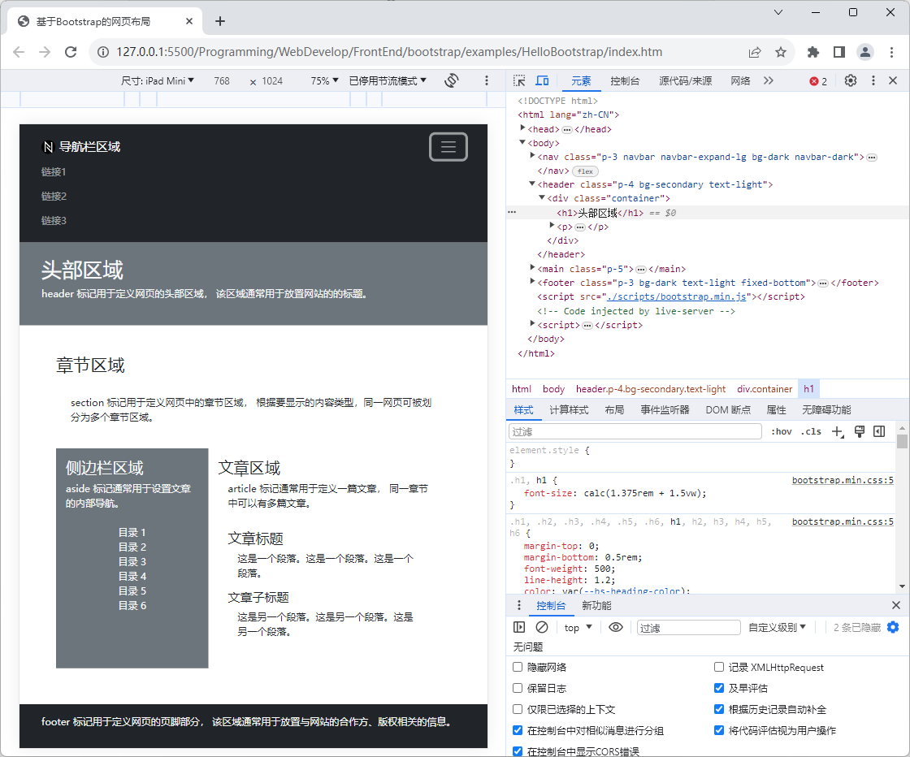

# Bootstrap 学习笔记

从方法论的角度来说，从零开始编写HTML+CSS代码的做法对于网页设计教学是非常有必要的，它能让初学者以“在做中学，学中做”的方式来实现快速入门，但在实际项目实践中，它就不见得是最佳选择了，因为它不仅工作量巨大，极易出错，而且对网页设计师的要求也相对较高。毕竟，如果读者平常只是一个前端程序员，并没有经历过专业的美术训练，那么大概率会在用户界面设计、配色方案设计上遇到较大的挑战。因此，在实际生产环境中，设计师们往往更倾向于使用成熟的第三方框架来辅助进行网页设计的工作。这篇笔记中，我们将以Bootstrap框架为例，来为读者介绍一下如何基于第三方库来快速完成网页的布局设计。

## Bootstrap 简介

Bootstrap框架是Twitter公司推出的一个用于开发响应式布局网页的框架，它基于HTML5和CSS3技术，能够帮助网页设计师快速实现响应式布局的网页设计。具体来说，Bootstrap框架在网页布局设计方面可以提供的便利主要如下：

- 它提供了大量的预定义样式，能够帮助网页设计师快速实现网页的布局设计。
- 它提供了大量的预定义模板，能够帮助网页设计师快速选择网页的配色方案。
- 它提供了大量的预定义组件，能够帮助网页设计师快速实现网页的用户交互界面设计。
- 它采用了基于移动设备优先的策略，能够帮助网页设计师快速实现移动端网页的布局设计。

在使用Bootstrap框架时，读者使用该框架提供的一系列CSS类和组件来完成网页设计工作。例如，读者在使用Bootstrap框架时可以采用以下几种常见的方式来完成网页的布局工作：

1. **固定宽度布局**：如果要采用这种布局方式，设计师需要使用`container`类来为网页内容提供了一个中心对齐且具有固定宽度的容器。这种容器会随着屏幕或视口尺寸的改变而调整其宽度。

2. **流体宽度布局**：如果要采用这种布局方式，设计师需要使用`container-fluid`类来为网页元素提供一个宽度为100%的容器，意味着它会占据其父元素或视口的整个宽度。

3. **响应式栅格布局**：如果要采用这种布局方式，设计师需要使用`container`和`row`这两个类来组织内容，然后在每个`row`类定义的页面元素中使用`col`类来安排更具体的网页内容。Bootstrap框架的栅格系统是一个强大的布局工具，它是响应式的，可以让网页自行适应不同视口尺寸。

4. **Flexbox布局**：Flexbox是一个独立的CSS布局模型，但Bootstrap框架已经整合了这种布局方式，提供了一系列与Flexbox相关的实用类（包括`d-flex`、 `justify-content-*`、 `align-items-*`等）。这种布局方式可以让设计师在一个容器内以更灵活的方式排列、对齐和分配子元素。与传统的浮动或定位方法相比，Flexbox提供了更多的控制和更简单的解决方案，特别是对于复杂的布局和对齐问题。

5. **组件布局**： Bootstrap框架还提供了许多组件，如导航栏、卡片、警报框等，读者可以使用这些组件来构建特定类型的布局。例如，你可以使用导航栏组件来创建一个具有导航功能的网站头部。

另外，读者还可以根据项目的具体需求灵活地混合使用上述布局方式，以便创建各种具有复杂布局的网页。总而言之，Bootstrap框架的灵活性，及其提供的丰富文档资源使读者能够轻松实现各种布局。接下来，我们先通过一个简单项目来为读者演示如何在项目中引入Bootstrap框架，并基于该框架来实现网页的响应式布局，该项目的具体步骤如下。

1. 首先，在本地计算机中创建一个名为`HelloBootstrap`的文件夹，并在其中创建一个名为`index.htm`的网页文件和两个分别名为`styles`和`scripts`的子目录。

2. 打开网页浏览器，使用搜索引擎找到Bootstrap框架的官网，然后进入到如下图所示的下载页面，并单击图中的「Download」按钮将编译好的CSS和JavaScript文件下载到本地计算机中。

    

3. 下载完成后，读者会得到一个名为`bootstrap-5.3.2-dist.zip`的压缩包文件，接下来的工作就是要该文件解压并将其中的`css/bootstrap.min.css`文件复制到`HelloBootstrap`项目的`styles`目录下，而`js/bootstrap.bundle.min.js`文件夹中的文件则复制到该项目的`scripts`目录下。

4. 接下来，读者需要使用VS Code编辑器中打开`HelloBootstrap`项目，并在之前创建的`index.htm`文件的输入如下代码：

    ```html
    <!DOCTYPE html>
    <html lang="zh-CN">
        <head>
            <link rel="stylesheet" href="styles/bootstrap.min.css">
            <title>基于Bootstrap的网页布局</title>
        </head>
        <body>
            <nav class="p-5 navbar navbar-expand-lg bg-dark navbar-dark">
                <div class="container">
                    <a class="navbar-brand" href="#">导航栏区域</a>
                    <div>
                        <ul class="navbar-nav ms-auto">
                            <li class="nav-item">
                                <a class="nav-link" href="#">链接1</a>
                            </li>
                            <li class="nav-item">
                                <a class="nav-link" href="#">链接2</a>
                            </li>
                            <li class="nav-item">
                                <a class="nav-link" href="#">链接3</a>
                            </li>
                        </ul>
                    </div>
                </div>
            </nav>
            <header class="p-5 bg-secondary text-light">
                <div class="container">
                    <h1>头部区域</h1>
                    <p>header 标记用于定义网页的头部区域，
                    该区域通常用于放置网站的的标题和LOGO。</p>
                </div>
            </header>
            <main class="p-5">
                <section class="container">
                    <h2>章节区域</h2>
                    <p class="p-4">
                        section 标记用于定义网页中的章节区域，
                        根据要显示的内容类型，同一网页可被划分为多个章节区域。
                    </p> 
                    <div class="d-flex">
                        <aside class="p-3 bg-secondary text-light">
                            <h3>侧边栏区域</h3>
                            <p >aside 标记通常用于设置文章的内部导航。</p>
                            <nav class="navbar flex-column ">
                                <a class="nav-link active" href="#">目录 1</a>
                                <a class="nav-link" href="#">目录 2</a>
                                <a class="nav-link" href="#">目录 3</a>
                                <a class="nav-link" href="#">目录 4</a>
                                <a class="nav-link" href="#">目录 5</a>
                                <a class="nav-link" href="#">目录 6</a>
                            </nav>
                        </aside>
                        <article class="p-3">
                            <h3>文章区域</h3>
                            <p class="mx-3">article 标记通常用于定义一篇文章，
                                同一章节中可以有多篇文章。</p>
                            <div class="p-3">
                                <h4>文章标题</h4>
                                <p class="mx-3">这是一个段落。这是一个段落。这是一个段落。</p>
                                <h5>文章子标题</h5>
                                <p class="mx-3">
                                    这是另一个段落。这是另一个段落。这是另一个段落。
                                </p>
                            </div>
                        </article>        
                    </div>
                </section>
            </main>
            <footer class="p-3 bg-dark text-light">
                <div class="container">
                    <p>footer 标记用于定义网页的页脚部分，
                    该区域通常用于放置与网站的合作方、版权相关的信息。</p> 
                </div>
            </footer>
            <script src="scripts/bootstrap.bundle.min.js"></script>
        </body>
    </html>
    ```

5. 在保存上述代码之后，读者就可以使用网页浏览器打开`index.htm`文件查看当前网页设计的结果，其外观样式在Google Chrome浏览器中的效果如图2-6所示。

    

在上述示例中，我们首先在项目中引入了Bootstrap框架的CSS样式文件和JavaScript文件（以便能该框架提供的外观样式及其相关的功能），然后使用了该框架中的CSS类来定义网页的不同区域及其中的界面元素。具体到网页布局方面，我们在这里主要采用了组件布局和Flexbox布局两种方式。其中，组件布局主要运用于导航栏区域，而在作为网页主要区域的章节区域中采用的则是Flexbox布局，具体说明如下：

- 在导航栏区域，我们首先使用`navbar`和`navbar-expand-lg`这两个类创建了一个响应式的导航栏组件。然后在该组件内部，`navbar-brand`类用于定义导航栏的品牌标识。`navbar-nav`类和`nav-item`类用于创建导航栏的链接列表。

- 在章节区域，我们首先使用`d-flex`类创建了一个以`<div>`标记来定义的弹性容器，然后用于排列和分布该容器内的页面元素，使网页布局更加灵活和响应式。下面是关于`d-flex`类的详细说明：
  - **Flex容器**：`d-flex`类被应用于一个HTML元素（通常是`<div>`），将其定义为Flex容器。这意味着该元素的子元素将遵循Flexbox规则进行排列和布局。
  - **子元素排列**：一旦一个元素被定义为Flex容器，它的直接子元素成为Flex项，这些项会在容器内自动排列。你可以使用Bootstrap框架提供的其他类来控制子元素的排列方式，例如`justify-content-*`和`align-items-*`类，用于水平和垂直对齐。
  - **弹性布局**：Flexbox布局提供了一种强大的方式来管理和调整元素之间的空间分配。使用`d-flex`类，你可以轻松实现弹性的网页布局，以适应不同屏幕尺寸和内容需求。
  - **适应性和响应性**：Flexbox是响应式布局的理想选择，因为它可以在不同屏幕尺寸下自动调整元素的排列和大小，无需使用媒体查询。这使得你可以更容易地创建适应各种设备的网页布局。

当然了，上述示例中所做的只是一次关于Bootstrap框架的初体验，目的是让读者对该框架能有一个大致的了解。接下来，我们将分主题具体介绍Bootstrap框架在网页设计工作中的具体使用方法。

## 页面布局设计


## 页面内容设计

## 页面交互设计

## 页面数据可视化
