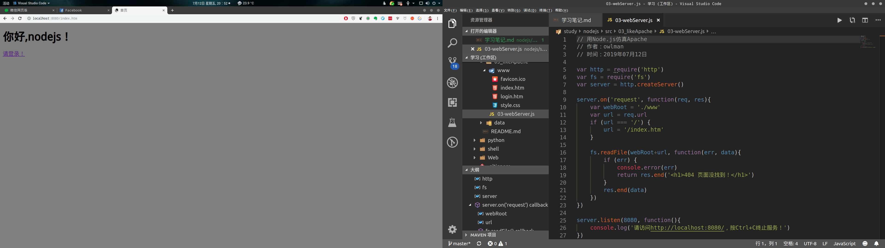
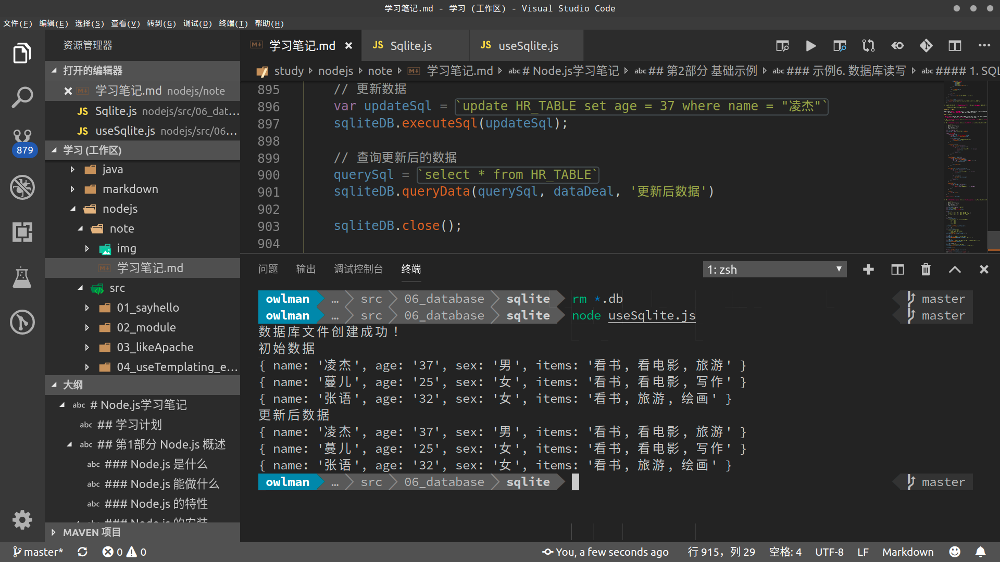

# Node.js 学习笔记

在这部分学习笔记中，笔者将记录一些在学习 Node.js 环境时所编写的基本用法示例。为此，我会在`ProgrammingLanguage/JavaScript`目录下创建一个名为的`nodejs`目录，并在该目录下设置以下两个子目录：

- `note`目录用于存放笔记的`markdown`格式的笔记。
- `code`目录则用于存放笔记中所记录的代码示例。

## 学习规划

- 学习基础：
  - 会使用 HTML、CSS、JavaScript 的基本语法。
  - 了解与浏览器、服务器、数据库相关的基本知识。
- 学习资料：
  - 视频教程：
    [黑马程序员-Nodejs 教学课程](https://www.bilibili.com/video/av27670326?p=1)
  - 书籍教材：
    [《深入浅出 Node.js》](https://book.douban.com/subject/25768396/)
  - 线上论坛：
    [cnode论坛](https://cnodejs.org/)
- 学习目标：
  - 学习并体验全栈开发
  - 开发一个"网上书店"程序

## 第1部分：认识 Node.js

- Node.js 是什么？

  Node.js 是一个 JavaScript 运行时环境，它移植了 Google Chrome 浏览器的 V8 引擎，通常被用作 JavaScript 代码在浏览器之外的宿主环境，这大大扩展了 JavaScript 的使用范围，使其成为了一款近乎全能型的编程语言。

- Node.js 能做什么？

  

### Node.js 的特性

Node.js 保留了 JavaScript 在浏览器端中所使用的大部分 API，Node.js 的作者 Ryan Dahl 并没有改变这门语言本身的任何特性，它的编程模型依旧将基于作用域和原型链这些概念，这让 Node.js 在服务器端上的应用具备了以下这些与众不同的特性：

- **单一线程**：
  Node.js 沿用了 JavaScript 单一线程的执行特性。即在 Node.js 中，JavaScript 的执行线程与其他线程之间同样也是无法共享状态的。单一线程的最大好处是不用像多线程编程那样处理很容易产生 bug 的同步问题，它从根本上杜绝了死锁问题，也避免了线程上下文交换所带来的性能上的开销。当然了，单一线程的执行方式也有它自身的弱点，譬如，它无法充分发挥多核处理器的性能、一个错误就会导致整个程序崩溃，以及执行大量计算时会因长期占用处理器而影响其他异步 I/O 的执行。

- **事件驱动**：
  在Web开发领域，JavaScript 如今在浏览器端正承担了越来越重要的角色，其事件驱动的编程模型也逐渐深入人心。当然了，这种编程模型虽然具有轻量级、松耦合等优势，但在多个异步任务的场景下，由于程序中的各个事件是彼此独立的，它们之间的协作就成为了一个需要我们费心解决的问题。

- **异步编程**：
  在 Node.js 中，大部分操作都是以异步调用的方式来进行的。Node.js 的开发者们在其底层构建了许多异步 I/O 的 API，包括文件读取、网络请求等。这样一来，我们就可以很自然地在语言层面上并行地执行 I/O 操作，这可以使得程序中的每个调用都无须等待之前的 I/O 调用结束，这带来了极大的效率提升。例如，如果我们想要读取两个相互不依赖的文件，如果采用的是异步 I/O，其耗费的时间只取决于读取较慢的那个文件，而如果采用同步 I/O 的话，其耗时就是两个文件的读取时间之和了，异步操作模型带来的优势是显而易见的。

  除此之外，Node.js 对回调函数的支持也是其一大特色。回调函数是执行异步调用并接收其返回数据的最佳方式，当然了，这种方式也会导致代码的编写顺序与其具体执行顺序的不一致，对于很多习惯同步思路编程的人来说，阅读这样的代码会是一个不小的挑战。另外在流程控制方面，也会由于程序中穿插了各种异步方法和回调函数，它也远没有常规的同步方式那么一目了然，这也会给我们对程序的理解和调试带来一定的麻烦。

### Node.js 的安装

Node.js 的安装主要有两种方式，通常在 Windows 和 MacOS 下，我们会采用下载`.msi`和`.pkg`格式的安装包，使用安装向导来进行安装。而在 Linux 和 FreeBSD 这一类系统中，我们则往往会采用 apt 和 yum 这样的包管理器来安装。这两种方式都不复杂，下面以 Windows 和 Ubuntu 为代表，简单介绍一下这两种安装方法。

#### 使用安装包

在 Windows 下想要安装 Node.js，首先要选择一个合适的版本。打开 Node.js 的官网`https://nodejs.org/`，我们会看到有 LTS 和 Current 两种版本可供下载。LTS 版即受到长期支持的版本，其组件通常都经历过了充分的测试，比较稳定，适合于正式的生产开发。而 Current 版本则是最新的版本，通常包含了最新纳入的新特性，比较适合想对 Node.js 本身进行研究的朋友。


下载完`.msi`格式的安装包之后，我们就可以打开安装包启动安装向导了。在安装的开始阶段，安装向导会要求我们设置一些选项，大多数时候只需采用默认选项，直接点击「Next」即可。只是在组件选择的页面中，需要注意一下，如果你对 Node.js 的组件并不熟悉，最好选择安装全部组件。另外，请记得点开下图中那个「add path」选项前面的`+`号，这样安装程序就会主动把 Node.js 和 NPM 这两个模块的命令路径添加到系统环境变量里，这对初学者来说是非常方便的。


待一切选项设置完成之后，我们就可以点击下面的「Install」即可完成安装。


如果一切顺利，我们在 Windows 中打开`cmd`终端，在其中输入`node -v`命令并回车之后，应该就会看到相关的版本信息。


#### 使用包管理器

在 Ubuntu 这类 Linux 操作系统中，我们安装软件往往都会选择使用 apt 这一类的包管理器，简单而方便，依次执行以下命令即可：

```bash
 sudo apt update
 sudo apt install nodejs
 # 最新 的Node.js 已经集成了 npm，所以某些情况下是无需单独安装 npm 的，这具体还要取决于你使用的软件源。
 sudo apt install npm
```

除此之外，我们还能安装n管理器来管理 Node.js 的版本，其安装命令如下：

```bash
sudo npm install -g n
```

该工具的具体使用方式如下：

```bash
sudo n lts            # 长期支持
sudo n stable         # 稳定版
sudo n latest         # 最新版
sudo n 12.4.0         # 直接指定版本
sudo n                # 使用上下键切换已有版本
```

同样的，如果一切顺利，我们打开命令行终端，并在其中输入`node -v`命令并回车之后，应该就会看到相关的版本信息。

## 第2部分 基础语法示例

### 示例1. 跟大家说 Hello

由于Node.js只是 JavaScript 语言的运行时环境，所以它并不会限制 JavaScript 代码的具体运行形式。为了说明这一点，本示例将使用四种形式来说"Hello"。首先，我们要执行`mkdir code/01_sayhello`命令来创建这一示例的目录。

#### 1. 终端输出

创建第一个Node.js脚本，步骤如下：

1. 在`code/01_sayhello`目录下执行`touch 01-sayHello.js`命令。
2. 执行`vim 01-sayHello.js`命令打开该脚本文件。
3. 在`01-sayHello.js`脚本文件中输入如下代码：

    ```JavaScript
    const name = 'owlman'
    console.log('你好！', name)
    ```

4. 保存文件后，在`code/01_sayhello`目录下执行`node 01-sayHello.js`命令，结果如下：

    

#### 2. 文件读写

用 Node.js 脚本读文本文件，步骤如下：

1. 在`code/01_sayhello`目录下执行`touch 01-readFile.js`命令。

2. 在`code/01_sayhello`目录下执行`mkdir data`命令，创建用于存放文件的目录。

3. 在`code/01_sayhello/data`目录下执行`touch text-data.txt`命令，并在其中输入以下内容：

    ```bash
    Hello，owlman，欢迎学习Nodejs。

    接下来，请读取下面这首诗：

    朝辞白帝彩云间，
    千里江陵一日还。
    两岸猿声啼不住，
    轻舟已过万重山。
    ```

4. 在`code/01_sayhello`目录下执行`vim 01-readFile.js`命令打开脚本文件，输入如下代码：

    ```JavaScript
    const fs = require('fs')
    fs.readFile('./data/text-data.txt', function(err, data) {
        if (err !== null ) {
           return console.error('错误信息：' + err.message)
        }
        console.log(data.toString())
    })
    ```

5. 保存文件后，在`code/01_sayhello`目录下执行`node 01-readFile.js`命令，结果如下：

    

用 Node.js 脚本写文本文件，步骤如下：

1. 在`code/01_sayhello`目录下执行`touch 01-writeFile.js`命令。

2. 在`code/01_sayhello`目录下执行`vim 01-writeFile.js`命令打开脚本文件，并输入如下代码：

    ```JavaScript
    const fs = require('fs')
    const str = '你好，Nodejs！'

    fs.writeFile('./data/output.txt', str, function(err) {
        if (err !== null ) {
           return console.error('错误信息：' + err.message)
        }
        console.log("文件写入成功!")
    })
    ```

3. 保存文件后，在`code/01_sayhello`目录下执行`node 01-writeFile.js`命令，结果如下：

    

#### 3. Web 服务

用 Node.js 脚本创建 Web 服务，步骤如下：

1. 在`code/01_sayhello`目录下执行`touch 01-webServer.js`命令。
2. 执行`vim 01-webServer.js`命令打开脚本文件，输入如下代码：

    ```JavaScript
    const http = require('http')
    const server = http.createServer()

    server.on('request', function(req, res){
        res.end('<h1>你好，Nodejs！</h1>')
    })

    server.listen(8080, function(){
        console.log('请访问http://localhost:8080/，按Ctrl+C终止服务！')
    })
    ```

3. 保存文件后，在`code/01_sayhello`目录下执行`node 01-webServer.js`命令，并用浏览器访问`http://localhost:8080/`，结果如下：

    

#### 4. TCP 服务

1. 在`code/01_sayhello`目录下执行`touch 01-tcpServer.js`命令。
2. 执行`vim 01-tcpServer.js`命令打开脚本文件，输入如下代码：

    ```JavaScript
    const net = require('net')
    const server = net.createServer(function (socket) {
        console.log('连接来自' + socket.remoteAddress)
        socket.end('你好，Nodejs！\n')
    })

    server.listen(7000, 'localhost', function(){
        console.log('TCP服务器监听 localhost 的 7000 端口，按 Ctrl+C 终止服务！')
    })
    ```

3. 保存文件后，在`code/01_sayhello`目录下执行`node 01-tcpServer.js`命令，并用`telnet localhost 7000`命令测试该服务器，结果如下：

    

### 示例2. 演示自定义模块及其使用方式

本示例将致力于演示 Node.js 的自定义模块语法以及部分 ES6 新增的语法。首先，我们要在`code`目录下执行`mkdir 02_module`命令来创建这一示例的目录。

#### 1. 单文件模块

1. 在`code/02_module`目录下执行`touch 02-singleFile.js`命令,创建脚本文件，并输入如下代码：

    ```JavaScript
    class singleFile_module {
        constructor() {
            this.name = 'singleFile_module'
        }

        sayhello() {
            console.log('Hello', this.name)
        }
    }

    module.exports = singleFile_module
    ```

2. 在`code/02_module`目录下执行`touch 02-test.js`命令,创建脚本文件，并输入如下代码：

    ```JavaScript
    const es5_syntax = require('./02-singleFile')
    const testobj = new singleFile_module()
    testobj.sayhello()
    ```

3. 保存文件后，在`code/02_module`目录下执行`node 02-test.js`命令，结果如下：

    

#### 2. 多文件模块

1. 在`code/02_module`目录下执行`mkdir 02-multiFile`命令，并进入到该目录中执行`npm init -y`命令，创建模块目录。

2. 在`code/02_module/02-multiFile`目录下执行`touch functions.js`命令，创建脚本文件，并输入如下代码：

    ```JavaScript
    function add(x,y){
        return x + y
    }

    exports.add = add
    ```

3. 在`code/02_module/02-multiFile`目录下执行`touch dataObj.js`命令，创建脚本文件，并输入如下代码：

    ```JavaScript
    const name = 'multFile_module'

    exports.name = name
    ```

4. 在`code/02_module/02-multiFile`目录下执行`touch index.js`命令，创建脚本文件，并输入如下代码：

    ```JavaScript
    const func = require('./functions')
    const str = require('./dataObj')

    class multiFile_module {
        constructor() {
            this.func = func.add
            this.name = str.name
        }

        sayhello() {
            console.log('Hello', this.name)
            console.log('x + y = ', this.func(10,5))
        }
    }

    module.exports = multiFile_module
    ```

5. 在`code/02_module`目录下将`02-test.js`脚本修改如下：

    ```JavaScript
    const singleFile_module = require(`./02-singleFile`)
    const testobj = new singleFile_module()
    testobj.sayhello()

    const multiFile_module = require(`./02-multiFile`)
    const testobj2 = new multiFile_module()
    testobj2.sayhello()
    ```

6. 保存所有文件后，在`code/02_module`目录下执行`node 02-test.js`命令，结果如下：

    

### 示例3. 模仿 Apache Web 服务器

本示例将致力于用 Node.js 模拟一个类似于 Apache 的 Web 服务器，处理浏览器端的请求，将相关的页面响应给浏览器。首先，我们要在`code`目录下执行`mkdir 03_likeApache`命令来创建这一示例的目录。然后执行以下步骤：

1. 在`code/03_likeApache`目录下执行`mkdir www`命令，创建网站目录，然后在其中创建`index.htm`和`login.htm`两个 HTML 文件以及一个名为`style.css`的 CSS 文件：
   - index.htm:

        ```HTML
        <!DOCTYPE html>
        <html lang="zh-cn">
            <head>
                <meta charset="utf-8" />
                <link rel="stylesheet" type="text/css" href="style.css" />
                <title>首页</title>
            </head>
            <body>
                <h1>你好,nodejs！</h1>
                <p> <a href="login.htm">请登录！</a> </p>
            </body>
        </html>
        ```

   - login.htm:

        ```HTML
        <!DOCTYPE html>
        <html lang="zh-cn">
            <head>
                <meta charset="utf-8" />
                <link rel="stylesheet" type="text/css" href="style.css" />
                <title>登录页面</title>
            </head>
            <body>
                <h1>你已经登录。。。</h1>
                <p> <a href="index.htm">回首页！</a> </p>
            </body>
        </html>
        ```

   - style.css:

        ```css
        body {
            background: gray;
        }
        ```

2. 在`code/03_likeApache`目录下执行`touch 03-webServer.js`命令，创建脚本文件，并输入如下代码：

    ```JavaScript
    var http = require('http')
    var fs = require('fs')
    var server = http.createServer()

    server.on('request', function(req, res) {
        var webRoot = './www'
        var url = req.url
        if ( url === '/' ) {
            url = '/index.htm'
        }

        fs.readFile(webRoot+url, function(err, data) {
            if ( err !== null ) {
                console.error('错误信息：' + err.message)
                return res.end('<h1>404 页面没找到！</h1>')
            }
            res.end(data)
        })
    })

    server.listen(8080, function(){
        console.log('请访问http://localhost:8080/，按Ctrl+C终止服务！')
    })
    ```

3. 保存所有文件后，在`code/03_likeApache`目录下执行`node 03-webServer.js`命令，结果如下：

    

### 示例4. 使用`art-template`模版引擎生成网页

本示例将以生成个人信息页面为例，演示在服务器端基于 Node.js 使用`art-template`模板引擎来生成网页。为此，我们需要在`code`目录下执行`mkdir 04_useTemplating_engine`命令来创建这一示例的目录。

#### `art-template`模版引擎的基本语法

首先，我们先来示范一下`art-template`模版引擎的基本语法，请跟着以下步骤来构建示例：

1. 在`code/04_useTemplating_engine`目录下执行`npm install art-template --save`命令，安装将`art-template`安装到当前示例项目中。

2. 在`code/04_useTemplating_engine`目录下执行`touch tpl.htm`命令，创建一个模版文件，具体如下：

    ```HTML
    <!DOCTYPE html>
    <html lang="zh-cn">
        <head>
            <meta charset="utf-8" />
            <link rel="stylesheet" type="text/css" href="style.css" />
            <title>{{ name }}的个人信息</title>
        </head>
        <body>
            <h1>{{ name }}的个人信息</h1>
            <table>
                <tr><td>姓名：</td><td>{{ name }}</td></tr>
                <tr><td>年龄：</td><td>{{ age }}</td></tr>
                <tr><td>性别：</td><td>{{ sex }}</td></tr>
                <tr>
                    <td>爱好：</td>
                    <td>{{ each items }} {{ $value }} {{ /each }}</td>
                </tr>
            </table>
        </body>
    </html>
    ```

3. 在`code/04_useTemplating_engine`目录下执行`touch 04-useTemplating_engine.js`命令，创建一个脚本文件，具体如下：

    ```JavaScript
    var http = require('http')
    var fs = require('fs')
    var template = require('art-template')

    class human {
        constructor(name, age, sex, items=[])
        {
            this.name  = name
            this.age   = age
            this.sex   = sex
            this.items = items
        }
    }

    var server = http.createServer()

    server.on('request', function(req, res){
        var url = req.url
        var boy = null
        if ( url === '/' ) {
            boy = new human('凌杰', '37', '男', ['看书', '看电影','旅游'])
        } else if ( url === '/wang' ) {
            boy = new human('蔓儿', '25', '女', ['看书', '看电影','写作'])
        }

        if ( boy === null ) {
            return res.end('<h1>404 页面没找到！</h1>')
        }

        fs.readFile('./tpl.htm', function(err, data){
            if ( err !== null ) {
                return res.end('<h1>404 没找到模版文件！</h1>')
            }

            const strHtml = template.render(data.toString(), {
                name : boy.name,
                age  : boy.age,
                sex  : boy.sex,
                items: boy.items
            })

            res.end(strHtml)
        })
    })

    server.listen(8080, function(){
        console.log('请访问http://localhost:8080/，按Ctrl+C终止服务！')
    })
    ```

4. 保存所有文件后，在`code/04_useTemplating_engine`目录下执行`node 04-useTemplating_engine.js`命令，结果如下：

    

### 示例5. Web 表单处理

本示例将致力于演示用 Node.js 处理 Web 表单，我们将会分别示范如何用`get`和`post`两种方法来处理表单的请求。首先，我们要在`code`目录下执行`mkdir 05_webForm`命令来创建这一示例的目录。

#### 1. get 方法

先用一个信息查询程序来演示一下如何处理使用`get`方法来发送请求的表单。首先，在`code/05_webForm`目录下执行`mkdir get_form`命令，并执行以下步骤：

1. 在`code/05_webForm/get_form`目录下执行`npm install art-template`命令，将`art-template`安装到当前示例项目中。

2. 在`code/05_webForm/get_form`目录下执行`touch index.htm`，创建一个模版文件，具体如下：

    ```HTML
    <!DOCTYPE html>
    <html lang="zh-cn">
    <head>
        <meta charset="UTF-8">
        <title>个人信息查询</title>
    </head>
    <body>
        <h1>个人信息查询</h1>
        <form action="/query" method="GET">
            <label for="message">请输入要查询的姓名：</label>
            <input type="text" name="qname" />
            <input type="submit" value="查询" />
        </form>
        <br />
        {{ if name }}
            <table>
                <caption>{{ name }}的个人信息</caption>
                <tr><td>姓名：</td><td>{{ name }}</td></tr>
                <tr><td>年龄：</td><td>{{ age }}</td></tr>
                <tr><td>性别：</td><td>{{ sex }}</td></tr>
                <tr>
                    <td>爱好：</td>
                    <td>{{ each items }} {{ $value }} {{ /each }}</td>
                </tr>
            </table>
        {{ else if query_error }}
            <h2>没有找到相关信息！</h2>
        {{ /if }}
    </body>
    </html>
    ```

3. 在`code/05_webForm/get_form`目录下执行`touch app.js`，创建一个脚本文件，具体如下：

    ```JavaScript
    var http = require('http')
    var fs = require('fs')
    var url = require('url')
    var template = require('art-template')

    class human {
        constructor(name, age, sex, items=[])
        {
            this.name  = name
            this.age   = age
            this.sex   = sex
            this.items = items
        }
    }

    var db = [
        new human('凌杰', '37', '男', ['看书', '看电影','旅游']),
        new human('蔓儿', '25', '女', ['看书', '看电影','写作']),
        new human('张语', '32', '女', ['看书', '旅游','绘画'])
    ]

    var server = http.createServer(function(req, res){
        var query = url.parse(req.url, true)
        var obj = null
        var query_error = false
        if ( query.pathname === '/' ) {
            query_error = false
        }
        else if (query.pathname === '/query') {
            for(let i = 0; i < db.length; ++i) {
                if (db[i].name == query.query["qname"]) {
                    obj = db[i]
                }
            }
            if ( obj === null ) {
                query_error = true
            }
        } else  {
            return res.end('<h1>404 页面没找到！</h1>')
        }

        fs.readFile('./index.htm', function(err, data){
            if ( err !== null ) {
                return res.end('<h1>404 没找到模版文件！</h1>')
            }

            var strHtml = null
            if ( obj !== null ) {
                strHtml = template.render(data.toString(), {
                    name : obj.name,
                    age  : obj.age,
                    sex  : obj.sex,
                    items: obj.items,
                    query_error: query_error
                })
            } else {
                strHtml = template.render(data.toString(), {
                    name : false,
                    query_error: query_error
                })
            }
            res.end(strHtml)
        })
    })

    server.listen(8080, function() {
        console.log('请访问http://localhost:8080/，按Ctrl+C终止服务！')
    })
    ```

4. 保存所有文件后，在`code/05_webForm/get_form`目录下执行`node app.js`命令，结果如下：

    

#### 2. post 方法

先来演示如何处理使用`post`方法来发送请求的表单。首先，在`code/05_webForm`目录下执行`mkdir post_form`命令，并执行以下步骤：

1. 在`code/05_webForm/get_form`目录下执行`npm install art-template`命令，将`art-template`安装到当前示例项目中。

2. 在`code/05_webForm/post_form`目录下执行`touch index.htm`，创建一个模版文件，具体如下：

    ```HTML
    <!DOCTYPE html>
    <html lang="zh-cn">
    <head>
        <meta charset="UTF-8">
        <title>个人信息管理</title>
    </head>
    <body>
        <h1>个人信息管理</h1>
        <table>
            <caption>个人数据表</caption>
            <tr><th>姓名</th><th>年龄</th><th>性别</th><th>爱好</th></tr>
            {{ each db }}
            <tr>
                <td>{{ $value.name }} </td>
                <td>{{ $value.age }} </td>
                <td>{{ $value.sex }} </td>
                <td>{{ each $value.items }} {{ $value }} {{ /each }}</td>
            </tr>
            {{ /each }}
        </table>

        <form action="/add" method="POST">
        <table>
            <caption>录入新人员</caption>
            <tr><td>姓名：</td><td><input type="text" name="uname" /></td></tr>
            <tr><td>年龄：</td><td><input type="text" name="age"></td></tr>
            <tr><td>性别：</td><td><input type="text" name="sex"></td></tr>
            <tr><td>爱好：</td><td><input type="text" name="items"></td></tr>
        </table>
        <input type="submit" value="添加" />
        </form>
    </body>
    </html>
    ```

3. 在`code/05_webForm/post_form`目录下执行`touch app.js`，创建一个脚本文件，具体如下：

    ```JavaScript
    var http = require('http')
    var fs = require('fs')
    var url = require('url')
    var querystring = require('querystring')
    var template = require('art-template')

    class human {
        constructor(name, age, sex, items=[])
        {
            this.name  = name
            this.age   = age
            this.sex   = sex
            this.items = items
        }
    }

    var db = [
        new human('凌杰', '37', '男', ['看书', '看电影','旅游']),
        new human('蔓儿', '25', '女', ['看书', '看电影','写作']),
        new human('张语', '32', '女', ['看书', '旅游','绘画'])
    ]

    var server = http.createServer(function(req, res){
        var query = url.parse(req.url, true)
        var obj = null
        if ( query.pathname === '/' ) {
            fs.readFile('./index.htm', function(err, data) {
                if ( err !== null ) {
                    return res.end('<h1>404 没找到模版文件！</h1>')
                }

                var strHtml = template.render(data.toString(), {
                    "db": db
                })

                res.end(strHtml)
            })
        }
        else if ( query.pathname === '/add' ) {
            req.on('data', function(chunk) {
                var obj = querystring.parse(chunk.toString())
                db.push(new human(
                    obj['uname'],
                    obj['age'],
                    obj['sex'],
                    obj['items'].split('，'),
                ))
            })

            res.writeHead(302, {
                'location': `/`
            })

            res.end()
        } else  {
            return res.end('<h1>404 页面没找到！</h1>')
        }
    })

    server.listen(8080, function(){
        console.log('请访问http://localhost:8080/，按Ctrl+C终止服务！')
    })
    ```

4. 保存所有文件后，在`code/05_webForm/post_form`目录下执行`node app.js`命令，结果如下：

    

## 第3部分 高级应用示例

### 示例6. 数据库读写

本示例将示范`SQLite`、`MongoDB`这两种不同类型的数据库在 Node.js 中的使用方法。首先，我们要在`code`目录下执行`mkdir 06_database`命令来创建这一示例的目录。

#### 1. SQLite

`SQLite`是一个轻量级的关系型数据库，我们在这里用它来示范 Node.js 对关系型数据库的处理。首先，在`code/06_database`目录下执行`mkdir sqlite`命令，并执行以下步骤：

1. 在`code/06_database/sqlite`目录下执行`npm install sqlite3`命令，将`sqlite3`安装到当前示例项目中。

2. 为控制程序按串行方式执行，需在`code/06_database/mongodb`目录下执行`npm install async`命令，将`async`包安装到当前示例项目中。

3. 在`code/06_database/sqlite`目录下执行`touch Sqlite.js`，创建一个脚本文件，具体如下：

    ```JavaScript
    var fs = require('fs')
    var sqlite3 = require('sqlite3').verbose()

    class SqliteDB {
        constructor(file) {
            this.db = new sqlite3.Database(file)
            var db_exist = fs.existsSync(file)

            if ( !db_exist ) {
                console.error('数据库文件创建成功！')
                fs.openSync(file, 'w')
            }
        }

        createTable(sql) {
            this.db.serialize(function() {
                this.run(sql, function(err) {
                    if( err !== null ) {
                        return console.error('错误信息：' + err.message)
                    }
                })
            })
        }

        insertData(sql, objects) {
            this.db.serialize(function() {
                var stmt = this.prepare(sql)
                for ( var i = 0; i < objects.length; ++i ) {
                    stmt.run(objects[i])
                }

                stmt.finalize()
            })
        }

        queryData(sql, callback, message) {
            this.db.all(sql, function(err, rows) {
                if( err !== null ) {
                    return console.error('错误信息：' + err.message)
                }

                if( callback ) {
                    callback(rows, message)
                }
            })
        }

        executeSql(sql) {
            this.db.run(sql, function(err) {
                if( err !== null ) {
                    return console.error('错误信息：' + err.message)
                }
            })
        }

        close() {
            this.db.close()
        }
    }

    module.exports = SqliteDB
    ```

4. 在`code/06_database/sqlite`目录下执行`touch useSqlite.js`，创建一个脚本文件，具体如下：

    ```JavaScript
    var async = require('async')
    var SqliteDB = require('./Sqlite')
    var file = "HRDB.db"
    var sqliteDB = new SqliteDB(file)

    var arr = [
        ['凌杰', '24', '男', '看书, 看电影, 旅游'],
        ['蔓儿', '25', '女', '看书, 看电影, 写作'],
        ['张语', '32', '女', '看书, 旅游, 绘画']
    ]

    function dataDeal(objects, message) {
        console.log(message)
        for ( var i = 0; i < objects.length; ++i )  {
            console.log(objects[i])
       }
    }

    async.series([
        function (callback) {
            // 创建表格
            var createTableSql = `
                create table if not exists HR_TABLE (
                    name  TEXT,
                    age   TEXT,
                    sex   TEXT,
                    items TEXT
                );`
            sqliteDB.createTable(createTableSql)
            callback()
        },

        function (callback) {
            // 插入数据
            var insertTileSql = `
                insert into HR_TABLE
                    (name, age, sex, items)
                    values(?, ?, ?, ?)`
            sqliteDB.insertData(insertTileSql, arr)
            callback()
        },

        function (callback) {
            // 查询数据
            var querySql = 'select * from HR_TABLE'
            sqliteDB.queryData(querySql, dataDeal, '初始数据')
            callback()
        },

        function (callback) {
            // 更新数据
            var updateSql = `update HR_TABLE set age = 37 where name = "凌杰"`
            sqliteDB.executeSql(updateSql)
            callback()
        },

        function (callback) {
            // 查询更新后的数据
            querySql = `select * from HR_TABLE`
            sqliteDB.queryData(querySql, dataDeal, '更新后数据')
            callback()
        },

        function (callback) {
            sqliteDB.close()
            callback()
        }
    ])
    ```

5. 保存所有文件后，在`code/06_database/sqlite`目录下执行`node useSqlite.js`命令，结果如下：

    

#### 2. MongoDB

`MongoDB`是非关系型数据库的一个典型代表，我们在这里用它来示范 Node.js 对关系型数据库的处理。在 Node.js 中操作`MongoDB`数据库有两个扩展包可以选择，下面我们一一来演示。首先，在`code/06_database`目录下执行`mkdir mongodb`命令，并执行以下步骤：

##### 使用`mongodb`包

1. 在`code/06_database/mongodb`目录下执行`npm install mongodb`命令，将`mongodb`包安装到当前示例项目中。

2. 为控制程序按串行方式执行，需在`code/06_database/mongodb`目录下执行`npm install async`命令，将`async`包安装到当前示例项目中。

3. 在`code/06_database/mongodb`目录下执行`touch useMongodb.js`，创建一个脚本文件，具体如下：

    ```JavaScript
    var MongoClient = require('mongodb').MongoClient
    var async = require('async')
    const server = 'mongodb://localhost:27017'
    const dbName = 'hrdb'
    const collName = 'hr_table'
    const dbPath = server + '/' + dbName

    MongoClient.connect(dbPath, { useNewUrlParser: true },
                                        function(err, db) {
        if ( err !== null ) {
            return console.error('错误信息：' + err.message)
        }

        var dbo = db.db(dbName)
        console.log(dbName + '数据库创建成功')

        var collect = dbo.collection(collName)
        console.log(collName + '集合创建成功')

        async.series([
            // 控制程序串行执行

            function (callback) {
                // 插入单条数据
                var data = {
                    name  : '杨过',
                    age   : '42',
                    sex   : '男',
                    items : '看书, 喝酒, 习武'
                }

                collect.insertOne(data, function(err, res) {
                    if ( err !== null ) {
                        return console.error('错误信息：' + err.message)
                    }
                    console.log('单条数据插入成功')
                })
                callback()
            },

            function (callback) {
                // 插入多条数据
                var dataArray = [
                    {
                        name  : '小龙女',
                        age   : '24',
                        sex   : '男',
                        items : '看书, 唱歌, 习武'
                    },
                    {
                        name  : '郭靖',
                        age   : '52',
                        sex   : '男',
                        items : '看书, 喝酒, 习武'
                    },
                    {
                        name  : '黄蓉',
                        age   : '45',
                        sex   : '女',
                        items : '看书, 绘画, 习武'
                    },
                    {
                        name  : '雅典娜',
                        age   : '24',
                        sex   : '女',
                        items : '看书, 音乐, 被救'
                    }
                ]

                collect.insertMany(dataArray, function(err, res) {
                    if ( err !== null ) {
                        return console.error('错误信息：' + err.message)
                    }
                    console.log('数组插入成功')
                })
                callback()
            },

            function (callback) {
                // 列出所有数据
                collect. find({}).toArray(function(err, result) {
                    if ( err !== null ) {
                        return console.error('错误信息：' + err.message)
                    }
                    console.log('列出当前集合中的所有数据：')
                    console.log(result)
                })
                callback()
            },

            function (callback) {
                // 更新单一数据
                var whereData = {'name' : '小龙女'}
                var updataValue = { $set: { 'sex' : '女' } }
                collect.updateOne(whereData, updataValue,
                                                    function(err, res) {
                    if ( err !== null ) {
                        return console.error('错误信息：' + err.message)
                    }
                    console.log(whereData['name'] + "的数据更新成功")
                })
                callback()
            },

            function (callback) {
                // 查询指定数据
                var querystr = { 'name' : '小龙女' }
                collect. find(querystr).toArray(function(err, result) {
                    if ( err !== null ) {
                        return console.error('错误信息：' + err.message)
                    }
                    console.log('查看更新后的' + querystr['name'] + '的数据：')
                    console.log(result)
                })
                callback()
            },

            function (callback) {
                // 删除指定单一数据
                var whereData = { 'name' : '黄蓉' }
                collect.deleteOne(whereData,function(err, result) {
                    if ( err !== null ) {
                        return console.error('错误信息：' + err.message)
                    }
                    console.log(whereData['name'] + '的数据已被删除')
                })
                callback()
            },

            function (callback) {
                // 查询所有数据，并按name降序排列
                var isort = { name : -1 }
                collect. find({}).sort(isort).toArray(function(err, result) {
                    if ( err !== null ) {
                        return console.error('错误信息：' + err.message)
                    }
                    console.log('降序排列当前集合中的所有数据：')
                    console.log(result)
                })
                callback()
            },

            function (callback) {
                // 删除指定多条数据
                var whereData = { 'age' : '24' }
                collect.deleteMany(whereData,function(err, result) {
                    if ( err !== null ) {
                        return console.error('错误信息：' + err.message)
                    }
                    console.log('年龄为' + whereData['age'] + '的数据已被删除')
                })
                callback()
            },

            function (callback) {
                // 查询所有数据，并按name升序排列
                var isort = { name : 1 }
                collect. find({}).sort(isort).toArray(function(err, result) {
                    if ( err !== null ) {
                        return console.error('错误信息：' + err.message)
                    }
                    console.log('升序排列当前集合中的所有数据：')
                    console.log(result)
                })
                callback()
            },

            function (callback) {
                // 删除指定集合
                dbo.dropCollection(collName, function(err, delOK) {
                    if ( err !== null ) {
                        return console.error('错误信息：' + err.message)
                    }
                    if ( delOK !== null ) {
                        console.log(collName + "集合已删除！")  
                    }
                })
                callback()
            }
        ])

        db.close()
    })

    ```

4. 保存所有文件后，在`code/06_database/mongodb`目录下执行`node useMongodb.js`命令，结果如下：

    

##### 使用`mongoose`包

1. 在`code/06_database/mongodb`目录下执行`npm install mongoose`命令，将`mongoose`包安装到当前示例项目中。

2. 在`code/06_database/mongodb`目录下执行`touch useMongoose.js`，创建一个脚本文件，具体如下：

    ```JavaScript
    const server = 'mongodb://localhost:27017'
    const dbName = 'hrdb'
    const collName = 'hr_table'
    const dbPath = server + '/' + dbName
    const mongoose = require('mongoose');
    var async = require('async')
    var Schema = mongoose.Schema
    var hrSchema = new Schema({
        name : {
            type : String,
            required: true
        },
        age : {
            type : String,
            required: true
        },
        sex : {
            type : String,
            required: true
        },
        items : {
            type : String,
            required: true
        }
    })
    var hrModel = new mongoose.model('Hrobj', hrSchema)
    mongoose.connect(dbPath, {useNewUrlParser: true});
    var conn = mongoose.connection
    conn.on('error', console.error.bind(console, '连接错误:'))
    conn.on('open', console.log.bind(console, '数据库连接成功'))
    conn.on('disconnected', console.log.bind(console, '断开数据库连接'))

    conn.once('open', function(){
        async.series([
            function(callback) {
                // 插入单条数据
                var someone = new hrModel ({
                    name  : '杨过',
                    age   : '42',
                    sex   : '男',
                    items : '看书, 喝酒, 习武'
                })
                someone.save(function(err, one){
                    callback(err, one.name+'的数据插入成功')
                })
            },

            function(callback) {
                hrModel.find(function(err, hrTable){
                    callback(err, '插入一条数据后的结果：' + hrTable)
                })
            },

            function(callback) {
                // 插入多条数据
                var dataArray = [
                    {
                        name  : '小龙女',
                        age   : '24',
                        sex   : '男',
                        items : '看书, 唱歌, 习武'
                    },
                    {
                        name  : '郭靖',
                        age   : '52',
                        sex   : '男',
                        items : '看书, 喝酒, 习武'
                    },
                    {
                        name  : '黄蓉',
                        age   : '45',
                        sex   : '女',
                        items : '看书, 绘画, 习武'
                    },
                    {
                        name  : '雅典娜',
                        age   : '24',
                        sex   : '女',
                        items : '看书, 音乐, 被救'
                    },
                    {
                        name  : '阿波罗',
                        age   : '24',
                        sex   : '女',
                        items : '看书, 音乐, 被救'
                    }
                ]

                hrModel.insertMany(dataArray, function(err) {
                    callback(err, '数组中的数据插入成功')
                })
            },

            function(callback) {
                hrModel.find(function(err, hrTable){
                    callback(err, '插入多条数据后的结果：' + hrTable)
                })
            },

            function(callback) {
                hrModel.updateMany({sex:'男'}, {sex:'女'}, function(err, one){
                    callback(err, '将所有男人改为女人')
                })
            },

            function(callback) {
                hrModel.updateOne({name:'阿波罗'}, {sex:'男'}, function(err, one){
                    callback(err, '将阿波罗的性别改为：男')
                })
            },

            function(callback) {
                hrModel.find({age:'24'}, function(err, hrTable){
                    callback(err, '所有年龄为24的数据：' + hrTable)
                })
            },

            function(callback) {
                hrModel.findOne({age:'24'}, function(err, hrTable){
                    callback(err, '第一个年龄为24的结果：' + hrTable)
                })
            },

            function(callback) {
                hrModel.deleteMany({age:'24'}, function(err, hrTable){
                    callback(err, '所有年龄为24数据已被删除')
                })
            },

            function(callback) {
                hrModel.find({age:'24'}, function(err, hrTable){
                    callback(err, '所有年龄为24的数据：' + hrTable)
                })
            },

            function(callback) {
                hrModel.deleteMany({}, function(err, hrTable){
                    callback(err, '所有数据已被删除')
                })
            },

            function(callback) {
                hrModel.find(function(err, hrTable){
                    callback(err, '删除所有数据后的结果：' + hrTable)
                })
            },

            function(callback) {
                mongoose.disconnect(function(err){
                    callback(err, '正在断开连接……')
                })
            }
        ], function(err, message) {
            if ( err !== null ) {
                return console.error('错误信息：' + err.message)
            }
            console.log(message)
        })
    })
    ```

3. 保存所有文件后，在`code/06_database/mongodb`目录下执行`node useMongoose.js`命令，结果如下：

    

### 示例7. Express Web开发

本示例将通过`你好，Express`、`留言板`和`学生管理`三个应用的实现来演示`Express`框架的基本使用。首先，我们要在`code`目录下执行`mkdir 07_Expressjs`命令来创建这一示例的目录，并执行一下步骤：

1. 在`code/07_Expressjs`目录下执行`npm init --yes`命令来初始化本示例项目。

2. 在`code/07_Expressjs`目录下执行`npm install express body-parser sqlite3 mongodb async art-template express-art-template --save`命令来安装本示例所要用到的扩展包。

3. 在`code/07_Expressjs`目录下执行`mkdir views`命令来创建用于存放模板文件的目录。

4. 在`code/07_Expressjs`目录下执行`mkdir public`命令创建`public`目录，并进入到该目录中，执行`mkdir DB css js img`命令来创建用于存放相应类型资源的目录。

5. 在`code/07_Expressjs`目录下执行`touch index.js`命令，创建本示例的程序入口文件，具体代码如下：

    ```JavaScript
    const path = require('path')
    const express = require('express')
    const bodyParser =require('body-parser')
    const router = require(path.join(__dirname, 'router'))
    const app = express()

    // 配置public目录
    app.use('/public/', express.static(path.join(__dirname, 'public')))

    //配置body-parser中间件`，以便获取post请求数据。`
    app.use(bodyParser.urlencoded({extended : false}));
    app.use(bodyParser.json());

    // 配置模板引擎为art-template
    app.engine('htm', require('express-art-template'))
    app.set('views', path.join(__dirname, 'views'))
    app.set('view engine', 'art')

    // 调用路由表函数
    app.(router)

    // 监听8080端口
    app.listen(8080, function(){
        console.log('请访问http://localhost:8080/，按Ctrl+C终止服务！')
    })
    ```

6. 在`code/07_Expressjs`目录下执行`touch router.js`命令，创建本示例的程序路由文件，具体代码如下：

    ```JavaScript
    const path = require('path')
    var express = require('express')
    var sayHello = require(path.join(__dirname, 'sayHello'))
    var student = require(path.join(__dirname, 'student'))
    var board = require(path.join(__dirname, 'board'))

    var router = express.Router()

    // Hello，Express！
    sayHello(router)
    // 学生管理
    student(router)
    // 留言板
    board(router)

    module.exports = router
    ```

#### 1. 你好，Express

这个应用主要用于示范如何用`Express`框架来创建一个 Web 页面，并使用`art-template`模板引擎。其主要步骤如下：

1. 在`code/07_Expressjs/public/img/`目录下放置一张`Express`官网首页的截图，将其命名为`express.jpeg`。

2. 在`code/07_Expressjs/public/css/`目录创建一个名为`main.css`的样式文件，内容如下：

    ```css
    body {
        padding-top: 10px;
    }
    ```

3. 在`code/07_Expressjs/views/`目录创建一个名为`hello.htm`的模版文件，内容如下：

    ```HTML
    <!DOCTYPE html>
    <html lang="zh-CN">
        <head>
            <meta charset="utf-8">
            <meta http-equiv="X-UA-Compatible" content="IE=edge">
            <meta name="viewport" content="width=device-width, initial-scale=1">
            <meta name="description" content="">
            <meta name="author" content="">

            <!-- Bootstrap CSS -->
            <link href="https://cdn.bootcss.com/bootstrap/3.3.7/css/bootstrap.min.css" rel="stylesheet">

            <!-- 自定义 CSS -->
            <link href="/public/css/main.css" rel="stylesheet">

            <title>Express使用示例</title>
        </head>

        <body>
            <div class="container">
                <!-- 导航栏部分开始 -->
                <nav class="navbar navbar-default">
                    <div class="container-fluid">
                        <div class="navbar-header">
                            <button type="button" class="navbar-toggle collapsed" data-toggle="collapse" data-target="#navbar" aria-expanded="false" aria-controls="navbar">
                                <span class="sr-only">切换导航栏</span>
                                <span class="icon-bar"></span>
                                <span class="icon-bar"></span>
                                <span class="icon-bar"></span>
                            </button>
                            <a class="navbar-brand" href="#">Express使用示例</a>
                        </div>
                        <div id="navbar" class="collapse navbar-collapse">
                            <ul class="nav navbar-nav">
                                <li class="active"><a href="/">你好，Express！</a></li>
                                <li><a href="/student">学生管理</a></li>
                                <li><a href="/board">留言板</a></li>
                            </ul>
                        </div>
                        <!-- 导航栏部分结束 -->
                    </div>
                </nav>

                <!-- 主体部分开始 -->
                <div class="jumbotron">
                    <h1>你好，{{ name }}！</h1>
                    
                </div>
            </div>
            <!-- 主体部分结束 -->

            <!-- Bootstrap的核心JavaScript
            ================================================== -->
            <script src="https://cdn.bootcss.com/jquery/1.12.4/jquery.min.js"></script>
            <script> window.jQuery || document.write('<script src="../../assets/js/vendor/jquery.min.js"><\/script>')</script>
            <script src="https://cdn.bootcss.com/bootstrap/3.3.7/js/bootstrap.min.js"></script>
        </body>
    </html>
    ```

4. 在`code/07_Expressjs`目录下执行`mkdir sayHello`命令来创建该应用的目录，并在其中创建一个名为`index.js`的脚本文件，内容如下：

    ```JavaScript
    module.exports = function(app) {
        app.get('/', function (req, res) {
            res.render('hello.htm', {name : 'Express'})
        })
    }
    ```

5. 保存所有文件后，在`code/07_Expressjs`目录下执行`node index.js`命令，结果如下：

    

#### 2. 学生管理

本应用主要用于演示如何用`Express`框架实现学生管理系统，并使用`SQLite3`作为数据库，其具体步骤如下：

1. 在`code/07_Expressjs/views/`目录创建一个名为`student.htm`的模版文件，内容如下：

    ```HTML
    <!DOCTYPE html>
    <html lang="zh-CN">
        <head>
            <meta charset="utf-8">
            <meta http-equiv="X-UA-Compatible" content="IE=edge">
            <meta name="viewport" content="width=device-width, initial-scale=1">
            <meta name="description" content="">
            <meta name="author" content="">

            <!-- Bootstrap CSS -->
            <link href="https://cdn.bootcss.com/bootstrap/3.3.7/css/bootstrap.min.css" rel="stylesheet">

            <!-- 自定义 CSS -->
            <link href="/public/css/main.css" rel="stylesheet">

            <title>Express使用示例</title>
        </head>

        <body>
            <div class="container">
                <!-- 导航栏部分开始 -->
                <nav class="navbar navbar-default">
                    <div class="container-fluid">
                        <div class="navbar-header">
                            <button type="button" class="navbar-toggle collapsed" data-toggle="collapse" data-target="#navbar" aria-expanded="false" aria-controls="navbar">
                                <span class="sr-only">切换导航栏</span>
                                <span class="icon-bar"></span>
                                <span class="icon-bar"></span>
                                <span class="icon-bar"></span>
                            </button>
                            <a class="navbar-brand" href="#">Express使用示例</a>
                        </div>
                        <div id="navbar" class="collapse navbar-collapse">
                            <ul class="nav navbar-nav">
                                <li><a href="/">你好，Express！</a></li>
                                <li class="active"><a href="/student">学生管理</a></li>
                                <li><a href="/board">留言板</a></li>
                            </ul>
                        </div>
                        <!-- 导航栏部分结束 -->
                    </div>
                </nav>

                <!-- 主体部分开始 -->
                <div class="jumbotron">
                    <h2>学生信息表</h2>
                    <a class="btn btn-success" href="/student/add">添加学生</a>
                    <table class="table table-striped">
                        <tr>
                            <th>姓名</th>
                            <th>年龄</th>
                            <th>性别</th>
                            <th>爱好</th>
                            <th>操作</th>
                        </tr>
                        {{ each db }}
                        <tr>
                            <td>{{ $value.name }} </td>
                            <td>{{ $value.age }} </td>
                            <td>{{ $value.sex }} </td>
                            <td>{{ $value.items }}</td>
                            <td>
                                <a href="/student/edit?name={{ $value.name}}">编辑</a>
                                <a href="/student/delete?name={{ $value.name}}">删除</a>
                            </td>
                        </tr>
                        {{ /each }}
                    </table>
                </div>
            </div>
            <!-- 主体部分结束 -->

            <!-- Bootstrap的核心JavaScript
            ================================================== -->
            <script src="https://cdn.bootcss.com/jquery/1.12.4/jquery.min.js"></script>
            <script> window.jQuery || document.write('<script src="../../assets/js/vendor/jquery.min.js"><\/script>')</script>
            <script src="https://cdn.bootcss.com/bootstrap/3.3.7/js/bootstrap.min.js"></script>
        </body>
    </html>
    ```

2. 在`code/07_Expressjs/views/`目录创建一个名为`add.htm`的模版文件，内容如下：

    ```HTML
    <!DOCTYPE html>
    <html lang="zh-CN">
        <head>
            <meta charset="utf-8">
            <meta http-equiv="X-UA-Compatible" content="IE=edge">
            <meta name="viewport" content="width=device-width, initial-scale=1">
            <meta name="description" content="">
            <meta name="author" content="">

            <!-- Bootstrap CSS -->
            <link href="https://cdn.bootcss.com/bootstrap/3.3.7/css/bootstrap.min.css" rel="stylesheet">

            <!-- 自定义 CSS -->
            <link href="/public/css/main.css" rel="stylesheet">

            <title>Express使用示例</title>
        </head>

        <body>
            <div class="container">
                <!-- 导航栏部分开始 -->
                <nav class="navbar navbar-default">
                    <div class="container-fluid">
                        <div class="navbar-header">
                            <button type="button" class="navbar-toggle collapsed" data-toggle="collapse" data-target="#navbar" aria-expanded="false" aria-controls="navbar">
                                <span class="sr-only">切换导航栏</span>
                                <span class="icon-bar"></span>
                                <span class="icon-bar"></span>
                                <span class="icon-bar"></span>
                            </button>
                            <a class="navbar-brand" href="#">Express使用示例</a>
                        </div>
                        <div id="navbar" class="collapse navbar-collapse">
                            <ul class="nav navbar-nav">
                                <li><a href="/">你好，Express！</a></li>
                                <li class="active"><a href="/student">学生管理</a></li>
                                <li><a href="/board">留言板</a></li>
                            </ul>
                        </div>
                        <!-- 导航栏部分结束 -->
                    </div>
                </nav>

                <!-- 主体部分开始 -->
                <div class="jumbotron">
                    <h2>注册新学生：</h2>
                    <form action="/student/add" method="POST" class="form-horizontal" role="form">
                        <div class="form-group">
                            <label for="firstname" class="col-sm-2 control-label">姓名：</label>
                            <div class="col-sm-10">
                            <input type="text" class="form-control" name="name" placeholder="请输入名字">
                            </div>
                        </div>
                        <div class="form-group">
                            <label for="lastname" class="col-sm-2 control-label">年龄：</label>
                            <div class="col-sm-10">
                            <input type="text" class="form-control" name="age" placeholder="请输入年龄">
                            </div>
                        </div>
                        <div class="form-group">
                            <label for="lastname" class="col-sm-2 control-label">性别：</label>
                            <div class="col-sm-10">
                            <input type="text" class="form-control" name="sex" placeholder="请输入性别">
                            </div>
                        </div>
                        <div class="form-group">
                            <label for="lastname" class="col-sm-2 control-label">爱好：</label>
                            <div class="col-sm-10">
                            <input type="text" class="form-control" name="items" placeholder="请输入爱好">
                            </div>
                        </div>
                        <div class="form-group">
                            <div class="col-sm-offset-2 col-sm-10">
                            <button type="submit" class="btn btn-default">加入</button>
                            </div>
                        </div>
                    </form>
                </div>
            </div>
            <!-- 主体部分结束 -->

            <!-- Bootstrap的核心JavaScript
            ================================================== -->
            <script src="https://cdn.bootcss.com/jquery/1.12.4/jquery.min.js"></script>
            <script> window.jQuery || document.write('<script src="../../assets/js/vendor/jquery.min.js"><\/script>')</script>
            <script src="https://cdn.bootcss.com/bootstrap/3.3.7/js/bootstrap.min.js"></script>
        </body>
    </html>
    ```

3. 在`code/07_Expressjs/views/`目录创建一个名为`edit.htm`的模版文件，内容如下：

    ```HTML
    <!DOCTYPE html>
    <html lang="zh-CN">
        <head>
            <meta charset="utf-8">
            <meta http-equiv="X-UA-Compatible" content="IE=edge">
            <meta name="viewport" content="width=device-width, initial-scale=1">
            <meta name="description" content="">
            <meta name="author" content="">

            <!-- Bootstrap CSS -->
            <link href="https://cdn.bootcss.com/bootstrap/3.3.7/css/bootstrap.min.css" rel="stylesheet">

            <!-- 自定义 CSS -->
            <link href="/public/css/main.css" rel="stylesheet">

            <title>Express使用示例</title>
        </head>

        <body>
            <div class="container">
                <!-- 导航栏部分开始 -->
                <nav class="navbar navbar-default">
                    <div class="container-fluid">
                        <div class="navbar-header">
                            <button type="button" class="navbar-toggle collapsed" data-toggle="collapse" data-target="#navbar" aria-expanded="false" aria-controls="navbar">
                                <span class="sr-only">切换导航栏</span>
                                <span class="icon-bar"></span>
                                <span class="icon-bar"></span>
                                <span class="icon-bar"></span>
                            </button>
                            <a class="navbar-brand" href="#">Express使用示例</a>
                        </div>
                        <div id="navbar" class="collapse navbar-collapse">
                            <ul class="nav navbar-nav">
                                <li><a href="/">你好，Express！</a></li>
                                <li class="active"><a href="/student">学生管理</a></li>
                                <li><a href="/board">留言板</a></li>
                            </ul>
                        </div>
                        <!-- 导航栏部分结束 -->
                    </div>
                </nav>

                <!-- 主体部分开始 -->
                <div class="jumbotron">
                    <h2>编辑 {{ name }} 的信息：</h2>
                    <form action="/student/edit" method="POST" class="form-horizontal" role="form">
                        <div class="form-group">
                            <label for="firstname" class="col-sm-2 control-label">姓名：</label>
                            <div class="col-sm-10">
                            <input type="text" class="form-control" name="name" value="{{ name }}" placeholder="请输入名字">
                            </div>
                        </div>
                        <div class="form-group">
                            <label for="lastname" class="col-sm-2 control-label">年龄：</label>
                            <div class="col-sm-10">
                            <input type="text" class="form-control" name="age" value="{{ age }}" placeholder="请输入年龄">
                            </div>
                        </div>
                        <div class="form-group">
                            <label for="lastname" class="col-sm-2 control-label">性别：</label>
                            <div class="col-sm-10">
                            <input type="text" class="form-control" name="sex" value="{{ sex }}" placeholder="请输入性别">
                            </div>
                        </div>
                        <div class="form-group">
                            <label for="lastname" class="col-sm-2 control-label">爱好：</label>
                            <div class="col-sm-10">
                            <input type="text" class="form-control" name="items" value="{{ items }}" placeholder="请输入爱好">
                            </div>
                        </div>
                        <div class="form-group">
                            <div class="col-sm-offset-2 col-sm-10">
                            <button type="submit" class="btn btn-default">更新数据</button>
                            </div>
                        </div>
                    </form>
                </div>
            </div>
            <!-- 主体部分结束 -->

            <!-- Bootstrap的核心JavaScript
            ================================================== -->
            <script src="https://cdn.bootcss.com/jquery/1.12.4/jquery.min.js"></script>
            <script> window.jQuery || document.write('<script src="../../assets/js/vendor/jquery.min.js"><\/script>')</script>
            <script src="https://cdn.bootcss.com/bootstrap/3.3.7/js/bootstrap.min.js"></script>
        </body>
    </html>
    ```

4. 在`code/07_Expressjs`目录下执行`mkdir student`命令来创建该应用的目录，并在其中创建一个名为`index.js`和`Sqlite.js`的两个脚本文件，内容如下：

   - index.js

    ```JavaScript
    const fs = require('fs')
    const path = require('path')
    const async = require('async')
    const SqliteDB = require(path.join(__dirname,'Sqlite'))
    const dbPath = path.join(__dirname, '../public/DB/studentsDB.db')

    // 配置数据库
    if ( !fs.existsSync(dbPath) ) {
        const studentsDB = new SqliteDB(dbPath)

        async.series([
            function(callback) {
                var createTableSql = `
                create table if not exists STUDENT_TABLE (
                    name  TEXT,
                    age   TEXT,
                    sex   TEXT,
                    items TEXT
                )`
                studentsDB.createTable(createTableSql)
                callback()
            },

            function(callback) {
                var insertTileSql = `
                    insert into STUDENT_TABLE
                        (name, age, sex, items)
                        values(?, ?, ?, ?)`
                var arr = [
                    ['凌杰', '24', '男', '看书、看电影、旅游'],
                    ['蔓儿', '25', '女', '看书、看电影、写作'],
                    ['张语', '32', '女', '看书、旅游、绘画']
                ]
                studentsDB.insertData(insertTileSql, arr)  
                callback()
            }
        ])
        studentsDB.close()
    }

    module.exports = function(app) {
        app.get('/student', function (req, res) {
            const studentsDB = new SqliteDB(dbPath)

            var querySql = 'select * from STUDENT_TABLE'
            studentsDB.queryData(querySql, function(data) {
                if ( data === null ) {
                    return console.log('数据查询错误！')
                }
                res.render('student.htm', { db : data })
            })

            studentsDB.close()
        })

        app.get('/student/add', function  (req, res) {
            res.render('add.htm', { })
        })

        app.post('/student/add', function (req, res) {
            const studentsDB = new SqliteDB(dbPath)

            var arr = [
                [req.body['name'],req.body['age'],req.body['sex'],req.body['items']]
            ]

            var insertTileSql = `
                insert into STUDENT_TABLE
                    (name, age, sex, items)
                    values(?, ?, ?, ?)`
            studentsDB.insertData(insertTileSql, arr)

            studentsDB.close()
            res.redirect('/student')
        })

        app.get('/student/delete', function (req, res) {
            const studentsDB = new SqliteDB(dbPath)

            var deleteSql = `
                delete from STUDENT_TABLE where name = '`
                + req.query['name']
                + `'`
            studentsDB.executeSql(deleteSql)

            studentsDB.close()
            res.redirect('/student')
        })

        app.get('/student/edit', function (req, res) {
            const studentsDB = new SqliteDB(dbPath)

            var querySql = `
                select * from STUDENT_TABLE where name = '`
                + req.query['name']
                + `'`
            studentsDB.queryData(querySql, function(data) {
                if ( data === null ) {
                    return console.log('数据查询错误！')
                }
                res.render('edit.htm', {
                    name  : data[0]['name'],
                    age   : data[0]['age'],
                    sex   : data[0]['sex'],
                    items : data[0]['items']
                })
            })

            studentsDB.close()
        })

        app.post('/student/edit', function (req, res) {
            const studentsDB = new SqliteDB(dbPath)

            var updateSql =
                `update STUDENT_TABLE set name = '`
                + req.body['name']
                + `', `
                + `age = '`
                + req.body['age']
                + `', `
                + `sex = '`
                + req.body['sex']
                + `', `
                + `items = '`
                + req.body['items']
                + `' `
                + ` where name = '`
                + req.body['name']
                + `'`

            studentsDB.executeSql(updateSql)

            studentsDB.close()
            res.redirect('/student')
        })
    }
    ```

    - Sqlite.js

    ```JavaScript
    var fs = require('fs')
    var sqlite3 = require('sqlite3').verbose()

    class SqliteDB {
        constructor(file) {
            this.db = new sqlite3.Database(file)
            var db_exist = fs.existsSync(file)

            if ( !db_exist ) {
                fs.openSync(file, 'w')
            }
        }

        createTable(sql) {
            this.db.serialize(function() {
                this.run(sql, function(err) {
                    if( err !== null ) {
                        return console.error('错误信息：' + err.message)
                    }
                })
            })
        }

        insertData(sql, objects) {
            this.db.serialize(function() {
                var stmt = this.prepare(sql)
                for ( var i = 0; i < objects.length; ++i ) {
                    stmt.run(objects[i])
                }

                stmt.finalize()
            })
        }

        queryData(sql, callback) {
            this.db.all(sql, function(err, rows) {
                if( err !== null ) {
                    return console.error('错误信息：' + err.message)
                }

                if( callback ) {
                    callback(rows)
                }
            })
        }

        executeSql(sql) {
            this.db.run(sql, function(err) {
                if( err !== null ) {
                    return console.error('错误信息：' + err.message)
                }
            })
        }

        close() {
            this.db.close()
        }
    }

    module.exports = SqliteDB
    ```

5. 保存所有文件后，在`code/07_Expressjs`目录下执行`node index.js`命令，结果如下：

    

#### 3. 留言板

本应用主要用于演示如何用`Express`框架实现留言板应用，并使用`MongoDB`作为数据库，其具体步骤如下：

1. 在`code/07_Expressjs/views/`目录创建一个名为`board.htm`的模版文件，内容如下：

    ```HTML
    <!DOCTYPE html>
    <html lang="zh-CN">
        <head>
            <meta charset="utf-8">
            <meta http-equiv="X-UA-Compatible" content="IE=edge">
            <meta name="viewport" content="width=device-width, initial-scale=1">
            <meta name="description" content="">
            <meta name="author" content="">

            <!-- Bootstrap CSS -->
            <link href="https://cdn.bootcss.com/bootstrap/3.3.7/css/bootstrap.min.css" rel="stylesheet">

            <!-- 自定义 CSS -->
            <link href="/public/css/main.css" rel="stylesheet">

            <title>Express使用示例</title>
        </head>

        <body>
            <div class="container">
                <!-- 导航栏部分开始 -->
                <nav class="navbar navbar-default">
                    <div class="container-fluid">
                        <div class="navbar-header">
                            <button type="button" class="navbar-toggle collapsed" data-toggle="collapse" data-target="#navbar" aria-expanded="false" aria-controls="navbar">
                                <span class="sr-only">切换导航栏</span>
                                <span class="icon-bar"></span>
                                <span class="icon-bar"></span>
                                <span class="icon-bar"></span>
                            </button>
                            <a class="navbar-brand" href="#">Express使用示例</a>
                        </div>
                        <div id="navbar" class="collapse navbar-collapse">
                            <ul class="nav navbar-nav">
                                <li><a href="/">你好，Express！</a></li>
                                <li><a href="/student">学生管理</a></li>
                                <li class="active"><a href="/board">留言板</a></li>
                            </ul>
                        </div>
                        <!-- 导航栏部分结束 -->
                    </div>
                </nav>

                <!-- 主体部分开始 -->
                <div class="jumbotron">
                    <h2>留言板</h2>
                    <form action="/board" method="POST" class="form-horizontal" role="form">
                        <div class="form-group">
                            <label for="firstname" class="col-sm-2 control-label">你的姓名：</label>
                            <div class="col-sm-10">
                            <input type="text" class="form-control" name="name" placeholder="请输入名字">
                            </div>
                        </div>
                        <div class="form-group">
                            <label for="lastname" class="col-sm-2 control-label">留言信息：</label>
                            <div class="col-sm-10">
                            <textarea class="form-control" name="message" placeholder="请输入留言"></textarea>
                            </div>
                        </div>
                        <div class="form-group">
                            <div class="col-sm-offset-2 col-sm-10">
                            <button type="submit" class="btn btn-default">提交留言</button>
                            </div>
                        </div>
                    </form>
                </div>
                <div class="jumbotron">
                    <h3>最新留言（{{ num }} 则）：</h3>
                    <table class="table">
                        {{ each db }}
                        <tr>
                            <td>{{ $value.name }} </td>
                            <td>{{ $value.message }} </td>
                            <td>{{ $value.time }}</td>
                        </tr>
                        {{ /each }}
                    </table>
                </div>
            </div>
            <!-- 主体部分结束 -->

            <!-- Bootstrap的核心JavaScript
            ================================================== -->
            <script src="https://cdn.bootcss.com/jquery/1.12.4/jquery.min.js"></script>
            <script> window.jQuery || document.write('<script src="../../assets/js/vendor/jquery.min.js"><\/script>')</script>
            <script src="https://cdn.bootcss.com/bootstrap/3.3.7/js/bootstrap.min.js"></script>
        </body>
    </html>
    ```

2. 在`code/07_Expressjs`目录下执行`mkdir board`命令来创建该应用的目录，并在其中创建一个名为`index.js`的脚本文件，内容如下：

    ```JavaScript
    var MongoClient = require('mongodb').MongoClient
    var async = require('async')
    const server = 'mongodb://localhost:27017'
    const dbName = 'boardDB'
    const collName = 'message_table'
    const dbPath = server + '/' + dbName

    module.exports = function(app) {
        app.get('/board', function (req, res) {
            MongoClient.connect(dbPath, { useNewUrlParser: true },
                                                function(err, db) {
                if ( err !== null ) {
                    return console.error('错误信息：' + err.message)
                }
                var dbo = db.db(dbName)
                var collect = dbo.collection(collName)
                collect. find({}).toArray(function(err, result) {
                    if ( err !== null ) {
                        return console.error('错误信息：' + err.message)
                    }
                    var num =result.length
                    res.render('board.htm', {
                        num : num,
                        db  : result
                    })
                })
            })
        })

        app.post('/board', function (req, res) {
            MongoClient.connect(dbPath, { useNewUrlParser: true },
                                                function(err, db) {
                if ( err !== null ) {
                    return console.error('错误信息：' + err.message)
                }
                var dbo = db.db(dbName)
                var collect = dbo.collection(collName)
                var data = {
                    name    : req.body['name'],
                    message : req.body['message'],
                    time    : Date()
                }
                collect.insertOne(data, function(err, res) {
                    if ( err !== null ) {
                        return console.error('错误信息：' + err.message)
                    }
                })
                res.redirect('/board')
            })
        })
    }
    ```

3. 保存所有文件后，在`code/07_Expressjs`目录下执行`node index.js`命令，结果如下：

    
