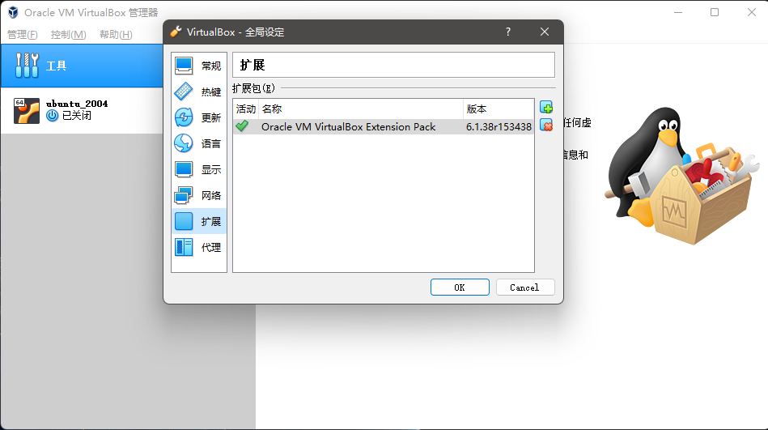

#! https://zhuanlan.zhihu.com/p/563193623
# 使用Vagrant搭建K8s集群

通常情况下，我们在使用VMware、VirtualBox这一类虚拟机软件创建虚拟开发环境时，往往需要经历寻找并下载操作系统的安装镜像文件，然后根据该镜像文件启动的安装向导一步一步地安装与配置操作系统，最后还需要从零开始安装开发与运维工具。整个过程会非常的费时费力，特别是在我们需要虚拟一个K8s集群的情况下，工作量更是会随着需要该集群中需要的服务器数量而成倍增加，这时候如果有一款像Vagrant这样的自动化虚拟机管理工具就非常重要了。接下来，就让我们来介绍一下Vagrant这个工具，以及如何使用它来虚拟一个由三台服务器构成的K8s集群。

## Vagrant的基本使用

正如之前所说，Vagrant是一款专用于实现虚拟机自动化管理的软件工具，主要使用Ruby编写而成，以命令行终端的工具的形式存在于计算机中。在这里，需要特别强调的一件事是：Vagrant是一款“管理”虚拟机的软件而非“创建”虚拟机的软件。也就是说，Vagrant本身并不能用来创建虚拟机，它通常需要搭配VMware、VirtualBox这一类虚拟机软件来使用，以便共同完成虚拟开发环境的快速搭建与配置。当然了，该工具允许人们通过编写一个名为`vagrantfile`配置文件的方式来定义虚拟机的自动化构建与销毁的过程，并配置虚拟机与其宿主机间的文件共享、虚拟机网络环境等相关参数。除此之外，我们还可以通过编写一些让虚拟机在完成创建后，第一次被启动时要执行的自定义脚本，以便用于以批处理的方式实现一些开发与运维工具的自动化安装与配置，这也将大大地提高我们构建虚拟开发环境的效率。最后，由于Vagrant还支持批量复制已创建的虚拟机，这意味着我们只需要执行一次操作，就可以同时拥有多个相同配置、安装了相同软件的虚拟机。

和学习大多数工具的过程一样，在正式介绍Vagrant的具体使用方式之前，我们也同样有必要先了解一下这款命令行工具的整体设计架构。因为只有这样，我们才能理解它的核心使用逻辑。

### 项目的组成架构

从整体设计上来说，一个交由Vagrant来管理的虚拟机项目通常由以下几大模块组合而成。

- **Boxes**：该模块指的是Vagrant用于创建虚拟开发环境时所需要使用的、扩展名为`.box`的镜像文件。需要注意的是，该镜像文件并不是我们之前使用传统方式创建虚拟机时的、用于安装操作系统的镜像文件，而是一个基于某个现有的虚拟机打包而成的快照文件。该镜像文件中除了基础数据的镜像外，还包括一些元数据文件，这些元数据将用于指导Vagrant将系统镜像正确的加载到对应的虚拟机当中。需要注意的是，这些镜像文件是严格依赖于Providers所指定的虚拟机软件的，也就是说，在VMware下使用的镜像文件是无法在VirtualBox上使用的，反之亦然；

- **Providers**：该模块指的是Vagrant用于创建虚拟开发环境时所需要使用的虚拟机软件，例如：VirtualBox、VMware、Hyper-V、KVM等。在Vagrant的架构中，Providers模块将以服务的形式存在，它的作用是帮助Vagrant利用Boxes模块指定的镜像文件来创建虚拟开发环境；

- **Provisioners**：该模块指的是在Vagrant完成虚拟开发环境的创建后，让虚拟机自动执行的自定义脚本。在Vagrant的架构中，我们通常会利用这些自定义的脚本来实现一些开发与运维工具的自动化安装与配置，例如VIM编辑器及其插件、Node.js运行平台、Docker和K8s运维工具等。

- **Vagrant CLI**：该模块指的是Vagrant用于管理虚拟机的一系列命令，包括创建、启动、关闭、重启、挂起等虚拟机操作，也包括打包，注册等虚拟机镜像文件的操作。这些命令可以帮助我们更好地与Providers模块指定的虚拟机软件进行交互。

当然，在使用Vagrant管理虚拟机的过程中，我们需要在`vagrantfile`配置文件中定义与Providers和Provisioners这两个模块相关的参数，以及要使用的镜像文件。下面，我们就来重点介绍一下`vagrantfile`配置文件具体写法。

### 编写项目配置文件

如前所述，Vagrant虚拟机项目的配置文件名为`vagrantfile`，该文件将负责定义虚拟机的创建参数、自动化执行的脚本、虚拟机与宿主机之间的共享目录及其通信网络等关键信息。由于Vagrant主要是用Ruby开发而成的，所以`vagrantfile`文件中使用的配置语言自然也采用了这门编程语言的语法，但这也并不意味着我们必须先学会Ruby的全部语法才能使用Vagrant。因为Vagrant对自己的配置语言做了一定程度的重新定义，其语法规则事实上比我们真正在编程活动中使用的Ruby语言要简单不少，对于任何一个有编程语言使用经验的人来说，通常只需要学习几个小时，就基本能应付日常使用中的大部分需求了。下面，就让我们来实际体验一下快速掌握这套语法规则的过程吧。

通常情况下，`vagrantfile`文件都会被存放在Vagrant虚拟机项目的根目录下，在实际使用中常常会借由`vagrant init`命令来自动生成。例如，如果我们在计算机的任意位置上创建了一个名为`vagrant_demo`的目录，那么我们只需要在Powershell/Bash这样的命令行终端环境，进入到`vagrant_demo`目录中并执行`vagrant init`命令，然后就会在该目录下看到一个自动生成的`vagrantfile`文件，其主要内容如下。

```ruby
# -*- mode: ruby -*-
# vi: set ft=ruby :

# All Vagrant configuration is done below. The "2" in Vagrant.configure
# configures the configuration version (we support older styles for
# backwards compatibility). Please don't change it unless you know what
# you're doing.
Vagrant.configure("2") do |config|
  # The most common configuration options are documented and commented below.
  # For a complete reference, please see the online documentation at
  # https://docs.vagrantup.com.

  # Every Vagrant development environment requires a box. You can search for
  # boxes at https://vagrantcloud.com/search.
  config.vm.box = "base"

  # Disable automatic box update checking. If you disable this, then
  # boxes will only be checked for updates when the user runs
  # `vagrant box outdated`. This is not recommended.
  # config.vm.box_check_update = false

  # Create a forwarded port mapping which allows access to a specific port
  # within the machine from a port on the host machine. In the example below,
  # accessing "localhost:8080" will access port 80 on the guest machine.
  # NOTE: This will enable public access to the opened port
  # config.vm.network "forwarded_port", guest: 80, host: 8080

  # Create a forwarded port mapping which allows access to a specific port
  # within the machine from a port on the host machine and only allow access
  # via 127.0.0.1 to disable public access
  # config.vm.network "forwarded_port", guest: 80, host: 8080, host_ip: "127.0.0.1"

  # Create a private network, which allows host-only access to the machine
  # using a specific IP.
  # config.vm.network "private_network", ip: "192.168.33.10"

  # Create a public network, which generally matched to bridged network.
  # Bridged networks make the machine appear as another physical device on
  # your network.
  # config.vm.network "public_network"

  # Share an additional folder to the guest VM. The first argument is
  # the path on the host to the actual folder. The second argument is
  # the path on the guest to mount the folder. And the optional third
  # argument is a set of non-required options.
  # config.vm.synced_folder "../data", "/vagrant_data"

  # Provider-specific configuration so you can fine-tune various
  # backing providers for Vagrant. These expose provider-specific options.
  # Example for VirtualBox:
  #
  # config.vm.provider "virtualbox" do |vb|
  #   # Display the VirtualBox GUI when booting the machine
  #   vb.gui = true
  #
  #   # Customize the amount of memory on the VM:
  #   vb.memory = "1024"
  # end
  #
  # View the documentation for the provider you are using for more
  # information on available options.

  # Enable provisioning with a shell script. Additional provisioners such as
  # Ansible, Chef, Docker, Puppet and Salt are also available. Please see the
  # documentation for more information about their specific syntax and use.
  # config.vm.provision "shell", inline: <<-SHELL
  #   apt-get update
  #   apt-get install -y apache2
  # SHELL
end
```

如果读者仔细观察一下上述文件的内容，就会发现它实际上就是`vagrantflie`配置文件的一个模板和一份以注释形式编写的简易教程。下面我们就基于这个文件来介绍一下如何具体配置一个Vagrant虚拟机项目。首先，如果我们去掉该文件中的所有注释，就会发现其当前真正发挥作用的配置只有以下三行代码。

```ruby
Vagrant.configure("2") do |config|
  config.vm.box = "base"
end
```

不用怀疑，正是这三行代码构成了一个Vagrant项目的基本配置。其中，第一行定义了一个名为`config`的配置对象，该对象的各项属性就是我们对虚拟机项目的全局配置项，适用于该项目所管辖的所有虚拟机。根据该对象的声明，我们还可以知道它采用的是版本为`2`的配置规则。然后，从第一行开始，直至遇到最后一行中的`end`这个结束符之前，我们编写的所有代码都是在`config`对象的作用域内进行的细项配置。譬如在上面代码的第二行中，`config.vm.box`选项的作用是配置Vagrant创建虚拟机时所需要使用的镜像文件。需要特别注意的是，这里的`base`是一个无效的镜像名，我们需要根据自己的需要将其改为实际有效的镜像文件名，例如，如果我们想安装的是一个基于CentOS系统的虚拟机，就可以将这行代码改为`config.vm.box = "centos-7"`。除此之外，根据我们刚才移除的注释内容，我们接下来还可以为虚拟机配置以下选项。

- **`config.vm.hostname`选项**：该选项用于配置虚拟机的主机名，当我们需要模拟由多台机器组成的开发环境时，主机名的设置通常是必不可少的，例如，如果我们创建了`centos1`、`centos2`两台虚拟机，那么在使用`vagrant up`命令启动虚拟机就需要用主机名指定要启动的是`centos1`还是`centos2`，否则所有的虚拟机将会一起被启动，一瞬间占用掉宿主机的大量资源。另外，该主机名也将会以环境变量的形式设置在虚拟机所安装的操作系统中；

- **`config.vm.network`选项**：该选项用于配置虚拟机的网络。在Vagrant管理的虚拟机之间，网络连接可以有以下三种模式。
  - NAT模式：这是Vagrant在默认情况下会使用的网络连接模式，不需要我们对其进行特别设置。在该模式下，虚拟机可以借由其宿主机端口转发的形式访问访问局域网，乃至整个互联网。
  - host-only模式：该模式需要使用将`config.vm.network`选项设置为`private_network`，并为其手动指定IP地址，或者将网络类型设置为DHCP以便让其自动分配IP地址。在该模式下，虚拟机只能被其宿主机访问，其他机器均无法访问它。
  - bridge模式：该模式需要使用将`config.vm.network`选项设置为`public_network`，并为其手动指定IP地址，或者为其指定要桥接的网络适配器。在该模式下，虚拟机就相当于是其宿主机所在的局域网中的一台独立的机器，可以被其他机器访问。

  下面是一些该选项的具体配置示例。

    ```ruby
    # 将网络配置为host-only模式，并为其手动配置IP地址
    config.vm.network :private_network, ip: "192.168.100.1"
    # 将网络配置为host-only模式，并将其配置为DHCP地址分配模式
    config.vm.network "private_network", type: "dhcp”
    # 将网络配置为bridge模式，并为其手动配置IP地址
    config.vm.network "public_network", ip: "192.168.31.7"
    # 将网络配置为bridge模式，并为其指定桥接适配器
    config.vm.network "public_network", bridge: "en1: Wi-Fi (AirPort)"
    # 配置虚拟机与宿主之间的端口映射
    # 将宿主机上的8080端口映射到虚拟机的80端口
    config.vm.network :forwarded_port, guest: 80, host: 8080
    ```

- **`config.vm.provider`选项**：该选项用于配置虚拟机的具体硬件参数。在Vagrant中，由于硬件参数的具体设置依赖于其具体使用的虚拟机软件服务，所以在配置该选项是需要指定我们所使用的具体Providers类型，并定义出一个该类型的对象，然后再通过该对象来进行相关配置。例如，如果我们需要基于VirtualBox这款虚拟机软件。使用Vagrant创建一台双核CPU，内存为4GB的虚拟机，就可以配置文件编写如下。

    ```ruby
    Vagrant.configure("2") do |config|
        # 其他全局配置 ...
        config.vm.provider :virtualbox do |vb|
            # 设置虚拟机在VirtualBox管理控制台中的名称。
            vb.name = "vagrant_demo"
            # 设置虚拟机的内存大小，单位为MB
            vb.memory = "4096"
            #设置虚拟机的CPU核心数
            vb.cpus = 2
        end
    end
    ```

- **`config.vm.synced_folder`选项**：该选项用于配置虚拟机与宿主机之间的共享目录，默认情况下，该共享目录就是`vagrantfile`文件所在的目录（即当前项目的根目录），如果想特别指定其他目录，就需要手动为该选项设置新的值，例如像下面这样。

    ```ruby
    # 在Windows系统中设置共享目录
    # 将Windows系统的宿主机的"D:/code"目录
    # 映射并挂载到Ubuntu系统的虚拟机中的"/home/www/"目录中
    config.vm.synced_folder "D:/code", "/home/www/" 
    ```

- **`config.ssh.username`选项**：该选项用于配置虚拟机中登录系统所用的用户名。在Vagrant中，默认用户名就是`vagrant`，如果我们使用的Box文件是个官方镜像，就务必要使用这个默认用户名。但如果使用的是自己打包的镜像文件，那就可以根据实际情况通过该选项来配置我们所要使用的用户名。

- **`config.vm.provision`选项**：该选项用于配置可让虚拟机自动执行的自定义脚本，这些脚本通常只能在第一次执行`vagrant up`命令时，额外特别执行`vagrant provision`、`vagrant reload --provision`或`vagrant up --provision`命令时自动执行，主要用于完成必备工具的安装与配置操作。另外，由于Vagrant支持的自定义的脚本类型包括Shell、Ansible、CFEngine、Chef、Docker等，所以我们在使用该选项配置自定义脚本时，通常需要指定脚本的类型和执行方式，下面是一些配置示例。
  
    ```ruby
    Vagrant.configure("2") do |config|
        # 以内联的方式执行 Shell 脚本
        config.vm.provision "shell", inline: "echo 1"
        # 以外部文件的方式执行 Shell 脚本
        config.vm.provision "shell", path: "./scripts/script.sh"
    end
    ```

除了上述使用`config`对象进行的全局配置之外，如果需要一次创建多台虚拟机的话，我们还可以通过`config.vm.define`选项来定义一个局部对象，以便针对某个具体的虚拟机来进行针对性的配置，该局部对象可配置的选项与`config`全局对象基本相同。下面是该选项的一个配置示例。

```ruby
# 定义一个虚拟机列表
vm_list = [
    {
        :name => "centos1",
        :eth1 => "192.168.100.1",
        :mem => "2048",
        :cpu => "4",
        :sshport => 22231
    },
    {
        :name => "centos2",
        :eth1 => "192.168.100.2",
        :mem => "4096",
        :cpu => "2",
        :sshport => 22232
    }
]

Vagrant.configure(2) do |config|
    config.vm.box = "centos-7"
    # 遍历虚拟机列表
    vm_list.each do |item|
        # 创建虚拟机级别的配置对象
        config.vm.define item[:name] do |vm_config|
            vm_config.vm.hostname = item[:name]
            vm_config.vm.network "private_network", ip: item[:eth1]
            # 禁用掉默认的SSH服务转发端口
            vm_config.vm.network "forwarded_port", guest: 22, host: 2222, id: "ssh", disabled: "true"
            vm_config.vm.network "forwarded_port", guest: 22, host: item[:sshport]
            vm_config.vm.provider "virtualbox" do |vb|
                vb.name = item[:name];
                vb.memory = item[:mem];
                vb.cpus = item[:cpu];
            end
        end
    end
end
```

### Vagrant CLI常用命令

在完成了配置文件的编写之后，我们就可以使用Vagrant CLI来进行虚拟机的管理操作了。这里需要提醒读者注意的是：`vagrantfile`文件中的配置代码通常只在第一次执行`vagrant up`命令时被执行。之后，如果我们不明确使用`vagrant reload --provision`命令进行重新加载，这些配置就不会再被执行了。下面，就让我们来分类介绍一下Vagrant CLI的常用命令。

1. 在需要使用SSH的方式进入指定虚拟机内执行某些操作是，我们可以使用`vagrant ssh`命令（如果当前项目下管辖有多台虚拟机，就执行`vagrant ssh <主机名>`命令），如图B-1所示。

    

    **图B-1**：使用SSH方式进入虚拟机

2. 在执行虚拟机的启动、重启与关闭等操作时，我们常会用到以下命令。

    ```bash
    # 启动所有虚拟机
    vagrant up
    # 启动指定的虚拟机
    vagrant up <主机名>
    # 重启所有虚拟机
    vagrant reload
    # 重启指定的虚拟机
    vagrant reload <主机名>
    # 关闭所有虚拟机
    vagrant halt
    # 关闭指定的虚拟机
    vagrant halt <主机名>
    # 挂起所有虚拟机
    vagrant suspend
    # 挂起指定的虚拟机
    vagrant suspend <主机名>
    ```

3. 在需要销毁项目中的虚拟机时，我们需要用到以下命令。

    ```bash
    # 销毁所有虚拟机
    vagrant destroy -f
    # 销毁指定的虚拟机
    vagrant destroy <主机名> -f
    ```

基于篇幅的考虑，我们在这里只是介绍了Vagrant CLI的常用命令。如果我们需要使用到某个指定的命令，可以使用`vagrant --help`和`vagrant <指定命令> --help`这两个命令来查看Vagrant CLI提供的帮助信息（在这里，命令中的`--help`参数可以使用`-h`这样的简写形式）。例如在图B-2中，我们就根据这些帮助信息执行对现有虚拟机的镜像打包操作。


**图B-2**：对现有虚拟机的镜像打包操作

## 项目示例：搭建K8s集群

在掌握了Vagrant的基本使用方法之后，我们接下来就可以通过实际项目来演示一下如何使用Vagrant+VirtualBox搭建一个部署了K8s系统的服务器集群。该集群的主要配置如表B-1所示。

|   主机名    |     IP地址     | 内存 | 处理器数量 |   操作系统   |
| :---------: | :------------: | :--: | :--------: | :----------: |
| k8s-master  | 192.168.100.21 |  4G  |     2      | Ubuntu 20.04 |
| k8s-worker1 | 192.168.100.22 |  2G  |     2      | Ubuntu 20.04 |
| k8s-worker2 | 192.168.100.23 |  2G  |     2      | Ubuntu 20.04 |

### 准备工作

要想模拟出上面这个由三台服务器组成的K8s集群，首先要做的是在宿主机中安装VirtualBox。为此，我们需要利用搜索引擎找到VirtualBox的官方网站，并进入到其下载页面，然后根据宿主机所使用的操作系统来下载对应的安装包。需要注意的是，除了主程序的安装包之外，我们还需要下载并安装相应的扩展包程序，以便在创建虚拟机时能对USB 3.0接口等高级特性进行模拟，如图B-3所示。


**图B-3**：下载VirtualBox安装包及扩展程序

VirtualBox主程序的安装包是以图形化向导的方式来执行的，初学者只需要一路按照其默认选项完成安装即可。在安装完成VirtualBox之后，我们还需要对其进行一些全局配置。为此，我们需要启动VirtualBox，然后依次单击其主菜单中的「管理」 -> 「全局设定」或按下快捷键`Ctrl + g`，并在弹出的如图B-4所示的「常规」对话框中修改「默认虚拟电脑位置」，以免日后虚拟机占用了过多Windows系统分区的空间。最后，在如图B-5所示的「扩展」选项卡中导入我们之前下载好的扩展程序。


**图B-4**：VirtualBox全局配置之「常规」对话框



**图B-5**：VirtualBox全局配置之「扩展」对话框

在完成了虚拟机软件的安装与配置操作之后，接下来的任务就是安装Vagrant本身了。同样的，我们需要利用搜索引擎找到Vagrant的官方网站，并进入到其下载页面，然后根据宿主机所使用的操作系统来下载对应的安装包，如图B-6所示。


**图B-6**：下载Vagrant安装包

具体在Windows系统中，该安装包是也是以图形化向导的方式来执行的，初学者只需要一路按照其默认选项完成安装即可。在安装过程中，Vagrant的安装包会自动把安装路径加入到系统的`PATH`环境变量中，所以，我们可以通过在Powershell/Bash之类的命令行终端环境中执行`vagrant version`命令来验证安装是否成功。

```bash
$ vagrant version
Installed Version: 2.3.0
Latest Version: 2.3.0
```

在确认成功安装了Vagrant之后，为了让该工具能更好地管理使用VirtualBox创建的虚拟机，我们还需要继续在命令行终端环境中执行`vagrant plugin install vagrant-vbguest vagrant-share`命令来安装相关的插件，以便该工具能自动安装并配置虚拟机的驱动增强包，从而实现虚拟机与宿主机之间的目录共享等功能。如果一切顺利，我们可以通过`vagrant plugin list`命令来确认插件的安装。

```bash
$ vagrant plugin list
vagrant-share (2.0.0, global)
vagrant-vbguest (0.30.0, global)
```

### 搭建集群

在完成上述准备工作之后，我们就可以正式开始创建用于模拟K8s集群的Vagrant项目了，其主要步骤如下。

1. 在计算机中的任意位置上创建一个名为`k8s_cluster`的目录，并使用Powershell/Bash之类的命令行终端环境进入到该目录中，并执行`vagrant init`命令，将其初始化为一个Vagrant项目的根目录。
2. 在`k8s_cluster`目录下打开上述命令自动生成的`vagrantfile`文件，并将其内如修改如下。

    ```ruby
    # 创建要创建的虚拟机清单
    vm_list = [
        {
            :name => "k8s-master",
            :eth1 => "192.168.100.21",
            :mem => "4096",
            :cpu => "2",
            :sshport => 22230
        },
        {
            :name => "k8s-worker1",
            :eth1 => "192.168.100.22",
            :mem => "2048",
            :cpu => "2",
            :sshport => 22231
        },
        {
            :name => "k8s-worker2",
            :eth1 => "192.168.100.23",
            :mem => "2048",
            :cpu => "2",
            :sshport => 22232
        }
    ]

    Vagrant.configure(2) do |config|
        # 全局配置，指定要下载并使用的镜像名称，并设置要使用的字符编码
        config.vm.box = "gusztavvargadr/ubuntu-server"
        config.vm.box_check_update = false
        Encoding.default_external = 'UTF-8'
        
        # 遍历虚拟机清单，根据其中定义的参数创建虚拟机
        vm_list.each do |item|
            config.vm.define item[:name] do |vm_config|
                vm_config.vm.hostname = item[:name]
                vm_config.vm.network "public_network", ip: item[:eth1]
                # 禁用掉默认的SSH服务转发端口
                vm_config.vm.network "forwarded_port", guest: 22, host: 2222, id: "ssh", disabled: "true"
                vm_config.vm.network "forwarded_port", guest: 22, host: item[:sshport]
                vm_config.vm.provider "virtualbox" do |vb|
                    vb.memory = item[:mem];
                    vb.cpus = item[:cpu];
                    vb.name = item[:name];
                end
                # 设置K8s集群中所有机器都要执行的自定义脚本
                vm_config.vm.provision "shell", path: "scripts/common.sh"
                if item[:name] == "k8s-master"
                    # 设置K8s集群的主控节点要执行的自定义脚本
                    vm_config.vm.provision "shell", path: "scripts/master.sh"
                else
                    # 设置K8s集群的工作节点都要执行的自定义脚本
                    vm_config.vm.provision "shell", path: "scripts/worker.sh"
                end
            end
        end
    end
    ```

3. 在`k8s_cluster`目录下创建一个名为`scripts`的目录，并在该目录下创建一个名为`common.sh`的、三机通用的配置脚本文件，并在其中输入如下代码。

    ```bash
    #! /bin/bash

    # 指定要安装哪一个版本的K8s
    KUBERNETES_VERSION="1.21.1-00"

    # 关闭swap分区
    sudo swapoff -a
    sudo sed -ri 's/.*swap.*/#&/' /etc/fstab 

    echo "Swap diasbled..."

    # 关闭防火墙功能
    sudo ufw disable

    # 安装一些 Docker+k8s 环境的依赖项
    sudo mv /etc/apt/sources.list /etc/apt/sources.list-backup
    sudo cp -i /vagrant/scripts/apt/sources.list /etc/apt/ 
    sudo apt update -y
    sudo apt install -y apt-transport-https ca-certificates curl wget software-properties-common build-essential

    echo "Dependencies installed..."

    # 安装并配置 Docker CE
    curl -fsSL https://mirrors.aliyun.com/docker-ce/linux/ubuntu/gpg | sudo apt-key add -
    sudo add-apt-repository "deb [arch=amd64] https://mirrors.aliyun.com/docker-ce/linux/ubuntu $(lsb_release -cs) stable"
    sudo apt update -y
    sudo apt install -y docker-ce

    cat <<EOF | sudo tee /etc/docker/daemon.json
    {
    "registry-mirrors": ["https://registry.cn-hangzhou.aliyuncs.com"],
    "exec-opts":["native.cgroupdriver=systemd"]
    }
    EOF

    # 启动 Docker
    sudo systemctl enable docker
    sudo systemctl daemon-reload
    sudo systemctl restart docker

    echo "Docker installed and configured..."

    # 安装 k8s 组件：kubelet, kubectl, kubeadm
    curl https://mirrors.aliyun.com/kubernetes/apt/doc/apt-key.gpg | sudo apt-key add -
    cat <<EOF | sudo tee /etc/apt/sources.list.d/kubenetes.list
    deb https://mirrors.aliyun.com/kubernetes/apt/ kubernetes-xenial main
    EOF
    sudo apt update -y
    sudo apt install -y kubelet=$KUBERNETES_VERSION kubectl=$KUBERNETES_VERSION kubeadm=$KUBERNETES_VERSION

    # 如果想阻止自动更新，可以选择锁住相关软件的版本
    sudo apt-mark hold kubeadm kubectl kubelet

    # 启动 K8s 的服务组件：kubelet
    sudo systemctl start kubelet  
    sudo systemctl enable kubelet   

    echo "K8s installed and configured..."
    ```

4. 继续在`scripts`目录下创建一个名为`master.sh`的、K8s集群主控节点专用的脚本文件，并在其中输入如下代码。

    ```bash
    #! /bin/bash

    # 指定主控节点的IP地址
    MASTER_IP="192.168.100.21"
    # 指定主控节点的主机名
    NODENAME=$(hostname -s)
    # 指定当前 K8s 集群中 Service 所使用的 CIDR
    SERVICE_CIDR="10.96.0.0/12"
    # 指定当前 K8s 集群中 Pod 所使用的 CIDR
    POD_CIDR="10.244.0.0/16"
    # 指定当前使用的 K8s 版本
    KUBE_VERSION=v1.21.1

    # 特别预先加载 coredns 插件
    COREDNS_VERSION=1.8.0
    sudo docker pull registry.cn-hangzhou.aliyuncs.com/google_containers/coredns:$COREDNS_VERSION
    sudo docker tag registry.cn-hangzhou.aliyuncs.com/google_containers/coredns:$COREDNS_VERSION registry.cn-hangzhou.aliyuncs.com/google_containers/coredns/coredns:v$COREDNS_VERSION

    # 使用 kubeadm 工具初始化 K8s 集群
    sudo kubeadm init \
    --kubernetes-version=$KUBE_VERSION \
    --apiserver-advertise-address=$MASTER_IP \
    --image-repository=registry.cn-hangzhou.aliyuncs.com/google_containers \
    --service-cidr=$SERVICE_CIDR \
    --pod-network-cidr=$POD_CIDR \
    --node-name=$NODENAME \
    --ignore-preflight-errors=Swap

    # 生成主控节点的配置文件
    mkdir -p $HOME/.kube
    sudo cp -i /etc/kubernetes/admin.conf $HOME/.kube/config
    sudo chown $(id -u):$(id -g) $HOME/.kube/config

    # 将主控节点的配置文件备份到别处
    config_path="/vagrant/configs"

    if [ -d $config_path ]; then
    sudo rm -f $config_path/*
    else
    sudo mkdir -p $config_path
    fi

    sudo cp -i /etc/kubernetes/admin.conf $config_path/config
    sudo touch $config_path/join.sh
    sudo chmod +x $config_path/join.sh       

    # 将往 K8s 集群中添加工作节点的命令保存为脚本文件
    kubeadm token create --print-join-command > $config_path/join.sh

    # 安装名为 calico 的网路插件
    # 1. 网络安装
    sudo wget https://docs.projectcalico.org/v3.14/manifests/calico.yaml 
    sudo kubectl apply -f calico.yaml

    # 安装名为 flannel 的网路插件
    # 1. 网络安装
    # sudo wget https://raw.githubusercontent.com/coreos/flannel/master/Documentation/kube-flannel.yml
    # sudo kubectl apply -f kube-flannel.yml
    ```

5. 继续在`scripts`目录下创建一个名为`worker.sh`的、K8s集群中工作节点通用的脚本文件，并在其中输入如下代码。

    ```bash
    #! /bin/bash

    # 执行之前保存的，用于往K8s集群中添加工作节点的脚本
    /bin/bash /vagrant/configs/join.sh -v

    # 如果希望在工作节点中也能使用kubectl，可执行以下命令
    sudo -i -u vagrant bash << EOF
    mkdir -p /home/vagrant/.kube
    sudo cp -i /vagrant/configs/config /home/vagrant/.kube/
    sudo chown 1000:1000 /home/vagrant/.kube/config
    EOF
    ```

6. 在`scripts`目录下创建一个名为`apt`的目录，并在该目录下创建一个名为`sources.list`的、使用阿里云国内镜像的APT源配置文件，并在其中输入如下代码。

    ```bash
    # 使用阿里云的源
    deb http://mirrors.aliyun.com/ubuntu/ focal main restricted universe multiverse
    deb-src http://mirrors.aliyun.com/ubuntu/ focal main restricted universe multiverse
    deb http://mirrors.aliyun.com/ubuntu/ focal-security main restricted universe multiverse
    deb-src http://mirrors.aliyun.com/ubuntu/ focal-security main restricted universe multiverse
    deb http://mirrors.aliyun.com/ubuntu/ focal-updates main restricted universe multiverse
    deb-src http://mirrors.aliyun.com/ubuntu/ focal-updates main restricted universe multiverse
    deb http://mirrors.aliyun.com/ubuntu/ focal-proposed main restricted universe multiverse
    deb-src http://mirrors.aliyun.com/ubuntu/ focal-proposed main restricted universe multiverse
    deb http://mirrors.aliyun.com/ubuntu/ focal-backports main restricted universe multiverse
    deb-src http://mirrors.aliyun.com/ubuntu/ focal-backports main restricted universe multiverse
    ```

7. 回到`k8s_cluster`目录下并执行`vagrant up`命令，开始创建虚拟机。在`vagrant up`命令的执行过程中，读者会看到Vagrant会在构建虚拟机之后，第一次启动它们时自动执行`scripts`目录中的脚本，这些脚本将会自动为虚拟机配置、安装Docker与K8s环境，以下是其安装软件的版本信息。

    ```bash
    Docker-CE:  20.10.17
    Kubernetes: 1.21.1
        kube-apiserver: v1.21.1
        kube-proxy: v1.21.1
        kube-controller-manager: v1.21.1
        kube-scheduler: v1.21.1
        pause: 3.4.1
        coredns: v1.8.0
        etcd: 3.4.13-0  
    ```

如果读者想获得上述示例的源码，也可以前往`https://github.com/owlman/vagrant-ubuntu-k8s-cluster`处获得。
