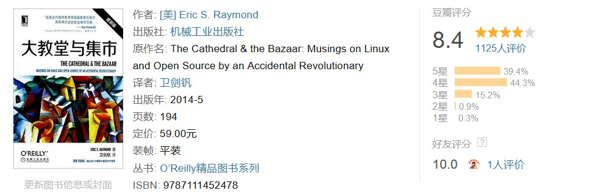

#! https://zhuanlan.zhihu.com/p/600500810
# 关于软件工程及其书籍推荐

提起“软件工程（Software Engineering）”这个词，人们想问的第一个问题通常会是：它在大学的专业设置上到底与“计算机科学（Computer science）”[^1]是什么关系？它们之间有什么区别？总体而言，计算机科学专业更倾向于培养精通计算机基础理论，以及相关技术使用方法的科研人员和教师队伍。而软件工程专业所培养的则更多地属于专职从事软件开发、测试、维护和软件项目管理的专门人才，它们之间的区别具体如下表格所示：

那么具体到软件开发这项工作本身，它到底是科研性质更多，还是工程性质更多呢？这一直以来都是业界争论不休的问题。因为在事实上，这项工作是两种性质都兼而有之的，但这并不意味着它们可以被互相混淆。大体上，我们可以认为软件工程相对于计算机科学和信息科学的关系，就如同传统意义上的工程学之于物理和化学的关系。按照 Wikipedia 提供的统计数据，美国大约有 40% 的软件工程师具有计算机科学专业的学位。估计这个比例在世界其他地方也基本大同小异。基本上，这些工程师们并不一定会需要掌握计算机科学领域的所有知识，但大概率每天都会使用到软件工程方面的知识。因此在这篇文章中，我们将聚焦于软件工程领域的讨论，并以推荐书目的形式来为读者规划在这一课题上的学习路线图，以供参考。

## 软件工程起源

软件工程作为一个学术概念，最早的起因是 1970-1990 这二十年间爆发的“[软件危机](https://zh.wikipedia.org/wiki/软件危机)”。在那段时间里，有一系列的软件项目因开发时间、成本开支等工程管理要素超出了预先的规划，从而导致了财产流失、人员伤亡等具有严重后果的悲惨结局。其中，最广为人知的案例是 Therac-25 事件。

> Therac-25 事件指的是在 1985 年到 1987 年之间发生的至少六起与一型名为 Therac-25 的放射性治疗仪器相关的医疗事故。事故原因就是该仪器在软件设计上存在着一种被称之为“竞争条件”[^2]的致命瑕疵，它会让病患接受到比正常剂量高一百倍的辐射，造成毫无必要的死亡或重伤。而归根究底，这些设计瑕疵就是源自于软件在工程质量管理上的缺失。

为了解决人们在软件开发时所遭遇到的问题，北大西洋公约组织在 1968 年举办了首次以软件的工程化为主题的学术会议。他们在该会议中提出了“软件开发应该是类似工程的活动”的主张，并正式创造了“软件工程”这个概念，以便用来界定实现*软件的工程化生产*所需要的相关知识。

## 学习路线规划

在了解了软件工程的来龙去脉及其要解决的问题之后，我们就可以根据自己的工作需求来学习这门专业所需要的相关知识了。下面，让我们从最传统的软件工程开始介绍。

### 传统软件工程

凭借着学术界和产业界的共同努力，软件工程自 1968 年至今已经累积了大量的理论研究，并基于实际生产环境进行了多年的项目实践，这使它最终发展成为了一门独立的专业/学科。根据 ACM 与 IEEE Computer Society 联合修定的 SWEBOK（即Software Engineering Body of Knowledge 的英文缩写）建议，我们可以将这一领域的核心知识大致划分为以下细项：

- 软件需求（Software requirements）；
- 软件设计（Software design）；
- 软件建构（Software construction）；
- 软件测试（Software test）；
- 软件维护与更新（Software maintenance）；
- 软件构型管理（Software Configuration Management）；
- 软件工程管理（Software Engineering Management）；
- 软件开发过程（Software Development Process）；
- 软件工程工具与方法（Software Engineering Tools and methods）；
- 软件质量（Software Quality）；

如果想将上述细项简化一下，我们也可以笼统地将软件工程的知识点划分为*开发技术*与*项目管理*两个构面。其中，开发技术指的是与软件开发的方法论、工具使用以及工程环境等方面相关的知识；而项目管理则指的是与软件项目的成本估算、进度控制、人员组织、配置管理、质量管理等方面相关的知识。如果想系统性地梳理一下传统软件工程理论及其发展脉络，我会像读者推荐《软件工程：实践者的研究方法》这本书。该书自 1982 年发行第 1 版以来（目前为第 7 版），一直都是世界各大高等院校计算机相关专业软件工程课程的重要教学参考书，在国际软件工程界享有无可质疑的权威地位。

当然了，传统的软件工程理论也面临着一些亟待解决的问题。毕竟，它定义的是一个流水线式的软件开发方式。在这种生产方式中，一个软件从开始立项到最终交付，大致上需要依次经历需求、设计、编码、构建、测试、发布、部署和维护等若干个阶段，不同的阶段由不同的角色来负责，例如项目经理负责了解软件的需求和设计，开发人员负责软件的编码和构建工作，运维人员负责软件的部署和维护，测试人员负责软件的测试和质量检查等，整个过程就像是电影《摩登时代》里的工厂流水线，分工明确。井然有序。这样做的目的是让开发团队中的每一个人都成为某种标准生产流水线上的工人，使他们像螺丝钉一样工作，无需创意，无需个性，只要够熟练就行。直到今天，某些大型企业的软件开发项目也还是按照这个路数走的，但这种软件生产方式背后的管理理念显然是机械化生产时代的产物，它需要客户需求非常明确、开发时间非常充足，以便大家可以按部就班地执行各自的职责，但在实际生产环境中，客户需求往往是模糊不清且随时变化的，项目不是单向运作的，留给开发团队的时间也永远是不足的。如果我们在瞬息万变的互联网时代还继续采用这种方式从事软件生产，无疑会让开发团队的运作显得非常庞杂而僵化，并进一步导致软件的版本迭代周期长得让人难以接受。为了系统性地阐述上述问题，曾经担任 IBM System/360 系统工程师的 Frederick P. Brooks 写下了《人月神话：软件项目管理之道》这本不朽名作，这也是我们在了解传统软件工程理论时的必读经典。

### 敏捷软件开发

很显然，传统的软件工程需要大量的银弹，人员来支撑。这只有大型企业，科研机构才能做到。但大型机构都存在官僚主义的问题，效率低下，随着时间的推移它们往往都会离人们的实际需求越来越远，就像是基督教的大教堂，高高在上，定期发布信息，内容庞杂而臃肿。对于以创意为主导的中小软件开发是毫无帮助。

更重要的是，这种自上而下的、计划性的软件生产方式还存在着在许多方面严重脱离现实的问题。首先，绝大部分软件在开发初期根本不会有那么多人参与，通常都是两三个人要做所有的事情。分那么多阶段，那么多工序是没有意义的。其次，在实际生产环境中，许多软件的开发任务通常都只是基于某个已有的软件框架来开发出新的产品，在这种情况下，软件的开发人员手里其实已经有了现成的开发框架，他们只需要根据特定的需求将该框架填充成具体的专用软件即可。对于原软件框架来说，这更像是给它增加一个特性分支的二次开发。例如大家都知道，JetBrain公司开发的IntelliJ IDEA是一个带有开放性插件体系的通用性IDE，而Android Studio则是一款专用于开发Android应用程序的IDE，后者就是基于IntelliJ IDEA的插件体系开发出来的，换而言之，它可以被视为IntelliJ IDEA的一个特性分支。这种二次开发更像是某种意义上的维护工作，它的可行性、需求都是一目了然的，也不需要概要设计，只需要按照其原有的插件体系把特定功能实现即可。然后，bug修复是这个项目的主要工作。所以，如何让那么多人一块有效地，有序地发现bug，报告bug，解决bug成为了主要问题。

为了解决流水线式开发带来的上述问题，业界在上个世纪九十年代之后陆续提出了敏捷软件开发等一系列核心理念相似的软件生产方式。在这种生产方式中，一个软件的开发工作在其立项之初就会被分割成多个子项目，这些子项目通常由一个可快速部署的核心项子目和多个相互联系的分支子项目组成，它们是分别独立运作的，有各自的开发和测试过程。在整个生产过程中，最为关键的是要让其核心子项目所开发的软件尽快完成部署且交付给客户，并在此后的整个项目生命周期中一直处于可使用状态。

换而言之，敏捷软件开发的主张就是先快速开发一个能满足客户最基本需求的、可供交付使用的软件原型，然后通过快速迭代版本的方式来满足不断变化的客户需求，并同时修复软件中存在着各种bug、逐步提高其自身的性能和稳定性。这样一来，之前流水线式的生产流程就变成了一个周而复始的循环体系，开发人员在这个体系中需要各自独立完成各种不同的小目标，然后将所有的小目标合起来就能完成大目标。这样做可以让开发团队中的每个人职责分明，以便提高软件的整体生产效率，也确实能部分解决因开发周期过长而带来的各种成本问题。当然了，我们在这里所做的只是这种开发方式的一些基本介绍，如果想更全面性地了解敏捷软件开发的各方面细节，笔者个人会强烈建议读者去阅读一下《敏捷软件开发：原则、模式与实践》这本书。

然而，上述软件生产方式影响范围通常也只存在于开发人员之间，开发人员与运维人员之间依然是壁垒分明。例如，开发人员通常希望为了增加软件的功能而升级硬件设备，并做各种大胆的尝试，而运维人员则是往往希望节省开发成本，降低运维风险，轻易不会同意升级硬件设备，或反对做激进的行为。双方经常会为此争执不下，从而严重影响项目进度。

### DevOps 工作理念

为了进一步解决同一软件项目中不同工作角色之间的协作问题，业界在 2009 年前后基于敏捷软件开发的理念进一步发展出了 DevOps 这个新的工作理念。从字面上来看，DevOps 是Development 和 Operations 这两个英文单词的组合词，所以它事实上可以被理解成是一套主张将开发（Dev）与运维（Ops）这两项工作一体化的软件生产理念，这套理念的核心内容是希望通过制定一整套自动化流程，以便让软件生产的整体过程更加快捷和可靠。具体来说，它想达成以下目标。

- 定义简洁明了的自动化工作流程。
- 让开发人员更多地控制生产过程。
- 实现开发与运维一体化的工作方式。
- 以更频繁的版本迭代来换取更低的成本。

同样的，我们在这里只是对 DevOps 工作理念做了一个简单的介绍，如果读者想全面性地了解这一工作理念的各方面细节及其想达成的目标，笔者个人会建议你们去参考一些《持续交付：发布可靠软件的系统方法》这本书中的内容。该书的作者介绍了当前开发并运维一个软件项目所使用的最新技术，包括自动化基础架构管理和数据迁移，以及虚拟化技术的使用。对于每一项技术的使用，书中都会指出其关键问题，并制定相应的最佳方案，以便降低软件项目的潜在风险。无论你在软件项目中承担的角色是开发人员、系统管理人员、测试人员还是项目经理，应该都能从这本书中得到收获。

需要特别强调的是，DevOps 工作理念主张的并不是简单地在软件生产过程中将开发与运维这两项工作角色合二为一，这种简单粗暴地理解可能就是该工作理念一直以来难以被真正落实的主要原因。毕竟，传统的运维人员在工作思路上与开发人员是冲突的，对于他们来说稳定是压倒一切的，变化就意味着出问题，而 DevOps 工作理念的主张正是在快速迭代，频繁交付的工程中进行运维工作。所以，想要将这一工作理念真正落到实处，首先要完成的是思想解放。换而言之，我们要改变的并不仅仅是开发软件生产过程中的工作流程，更重要的是整个开发团队中的各个工作角色，从管理到开发、再到运维和测试都需要在思想观念上进行变革。如果不能做到这一点，即使将所有工作角色集于一人，不同工作之间的思维转换也依然会是个问题。

所以在真正落实 DevOps 工作理念时，我们往往需要重新制定软件项目工作流程中的一系列规范和标准。按照这些规范和标准，软件的运维工作需要在项目开发期间就积极介入到开发过程中，了解其使用的系统架构和技术路线，从而制定出与之相应的运维方案。而我们在开发一款软件的同时也需要认真考虑其在运维过程中会遇到的问题，并提供更有利于软件部署和后期维护的优化建议。总而言之，DevOps 工作理念所主张的软件生产方式考验的不仅是软件开发的技术，更是项目的组织管理水平。相比流水线式的传统开发和以敏捷开发为代表的新方法，我们可以明显看出，DevOps 工作理念的影响范围贯穿了软件的整个生命周期，而不再仅限于开发阶段了。

### 开源软件运动

除了上述工程化方案之外，Linus Torvalds 在独自开发和维护 Linux 内核项目的过程中摸索着走出了一条新的道路：*开放软件的源代码*。具体来说，就是由软件项目的创始人先开发出一个不成熟的初始版本，然后将软件的源代码以某种特定的许可协议开放给互联网上的所有开发者，让其在开发者们自发性的修改和分享中自然生长。最后，项目创始人会根据其生长情况将自己认可的部分合并到项目的主分支中。这种乱中有序的项目组织形式让 Linux 项目获得了巨大的成功，同时也给软件工程的实践提供了另一种选择。

上世纪九十年代末期，网景公司在与微软公司的浏览器大战中败下阵来，面临着公司的生存危机。他们决定试试开源的软件生产方式。Eric Steven Raymond 就是在这一背景下创作了《大教堂与集市》这本开源世界的经典著作（他当时是网景公司践行开源软件运动时所聘请的顾问）。这本书为开源软件运动奠定了理论基础。他系统阐述了互联网条件下的协作模式，同行审评的优势，回答了《人月神话》中提出的银弹问题，人员管理成本问题。如今，微软、苹果这些曾经的大教堂都纷纷进入了开源领域，开源作为软件工程的另一种组织形式已经毋庸置疑。

最后需要提醒的是，开源软件运动和 Richard Matthew Stallman 领导的自由软件运动并不是一回事。开源软件运动更多的是一种软件的开发方式，虽然也强调开放源码、免费分享的黑客精神。但并不排斥世俗、商业。而自由软件运动则更像是一种以意识形态为纲的运动，其主张非常的理想主义，且激烈地反对商业化，这客观上其实给源代码的分享带来了不少的阻力。

<!-- 以下为注释区 -->

[^1]: 注：在中国，这一门专业通常被称之为“计算机科学与技术”。
[^2]: 注：竞争条件又被称之为竞态条件，它指的是一个系统或者进程的输出依赖于不受控制的事件出现顺序或者出现时机。此词源自于两个信号试着彼此竞争，来影响谁先输出。例如，如果计算机中的两个进程同时试图修改一个共享内存的内容，在没有并发控制的情况下，最后的结果依赖于两个进程的执行顺序与时机。而且如果发生了并发访问冲突，则最后的结果是不正确的。
