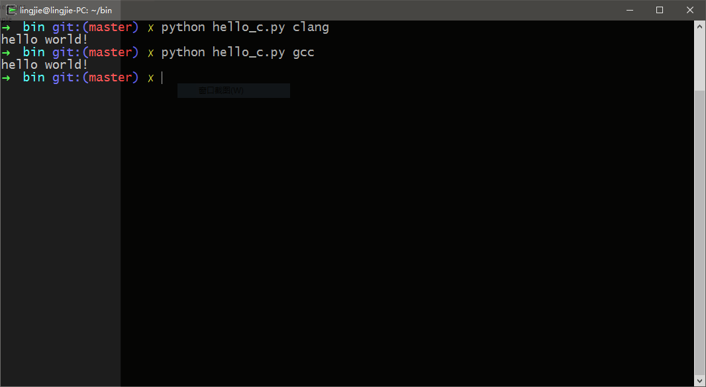

#!https://zhuanlan.zhihu.com/p/360366426
# clang 学习笔记

> 本文部分内容引用：
> - [中文维基百科](https://zh.wikipedia.org/wiki/Clang)。
> - [结构化编译器前端--clang介绍](http://blog.163.com/bjtornado@yeah/blog/static/6951048420126201578983/)。

## 什么是clang编译器？

clang是LLVM编译器工具集的一个用于编译C、C++、Objective-C的前端。LLVM项目的目标是提供一个GNU编译器套装（gcc）的替代品，由苹果公司的赞助开发，其源代码授权采用的是类BSD的伊利诺伊大学厄巴纳-香槟分校开源码许可。

## clang编译器的优势与劣势

相比于gcc，clang具有如下优点：

- 编译速度更快：在某些平台上，clang的编译速度要明显快于gcc。
- 占用内存更小：clang生成的AST所占用的内存通常是gcc的五分之一左右。
- 模块化的设计：clang采用基于库的模块化设计，更易于IDE的集成及其他用途的重用。
- 诊断信息可读性强：在编译过程中，clang会创建并保留大量详细的元数据 (metadata)，这将更有利于调试和错误报告。
- 设计更清晰简单，容易理解，易于扩展加强。与代码基础较为古老的gcc相比，学习曲线会显得更为平缓。

当前 Clang 还处在不断完善过程中，相比于gcc, clang在以下方面还需要加强：

- 需要支持更多语言：gcc除了支持 C/C++/Objective-C, 还支持Fortran/Pascal/Java/Ada/Go等其他语言。clang 目前基本上只支持C/C++/Objective-C/Objective-C++这四种语言。
- 需要加强对C++的支持：clang对C++的支持依然落后于gcc，clang 还需要加强对C++ 提供全方位支持。
- 需要支持更多平台：由于gcc流行的时间比较长，已经被广泛使用，对各种平台的支持也很完备。clang目前支持的平台有 Linux/Windows/Mac OS。

## 安装LLVM + clang

### 二进制安装

- 纯Windows环境：
  可以从[LLVM官网](http://llvm.org/releases/)上下载相应的安装包进行安装。目前最新版本为[3.8](http://llvm.org/releases/3.8.0/LLVM-3.8.0-win32.exe)。
  
  

- cygwin下的apt-cyg：

```bash
apt-cyg install clang
```

- Linux下的yum：

```bash
sudo yum install clang
```

- Linux下的apt-get（有时候需要自己配置一下相关的软件源）：

```bash
sudo apt-get install clang-3.4 clang-3.4-doc libclang-common-3.4-dev libclang-3.4-devlibclang1-3.4 libclang1-3.4-dbg libllvm-3.4-ocaml-dev libllvm3.4 libllvm3.4-dbg lldb-3.4 llvm-3.4 llvm-3.4-dev llvm-3.4-doc llvm-3.4-examples llvm-3.4-runtime clang-modernize-3.4 clang-format-3.4 python-clang-3.4 lldb-3.4-dev
```

### 源码安装

- 第一步，下载llvm代码：

    ```bash
    git clone git@github.com:llvm-mirror/llvm.git 
    ```

- 第二步，进入llvm/tools目录并下载clang代码

    ```bash
    cd llvm/tools
    git clone git@github.com:llvm-mirror/clang.git
    ```

- 第三步，进入llvm/projects目录并下载compiler-rt代码：

    ```bash
    cd ../projects
    git clone git@github.com:llvm-mirror/compiler-rt.git
    ```

- 第四步，在llvm所在目录新建与llvm同一级的目录build，并在其中构建llvm和clang：

    ```bash
    cd ../..
    mkdir build
    cd build
    ../llvm/configure --enable-optimized --enable-assertions
    make
    make install
    ```

## 使用clang编译C程序

clang的用法与gcc基本相同，我们可以写一个脚本来验证一下编译器是否已经安装完成：

```python
import os
import sys
import shutil

if not len(sys.argv) in range(2, 3):
    print("Usage: hello_c.py <compiler>") 
    exit(1)

code = "#include <stdio.h>\n int main(void) { printf(\"hello world!\\n\"); return 0;} "

if(not os.path.exists("example")):
    os.mkdir("example")

file = open(r"example/hello.c",'w')
file.writelines(code)
file.close()

cmd = sys.argv[1] + r" example/hello.c -o example/test.exe"
os.system(cmd)
os.system(r"example/test.exe")

if(os.path.exists("example")):
    shutil.rmtree("example")

```

然后，我们只需要在shell中输入`python hello_c.py clang`即可，如果看到输出一行“hello world”说明编译器已经可以正常工作。


