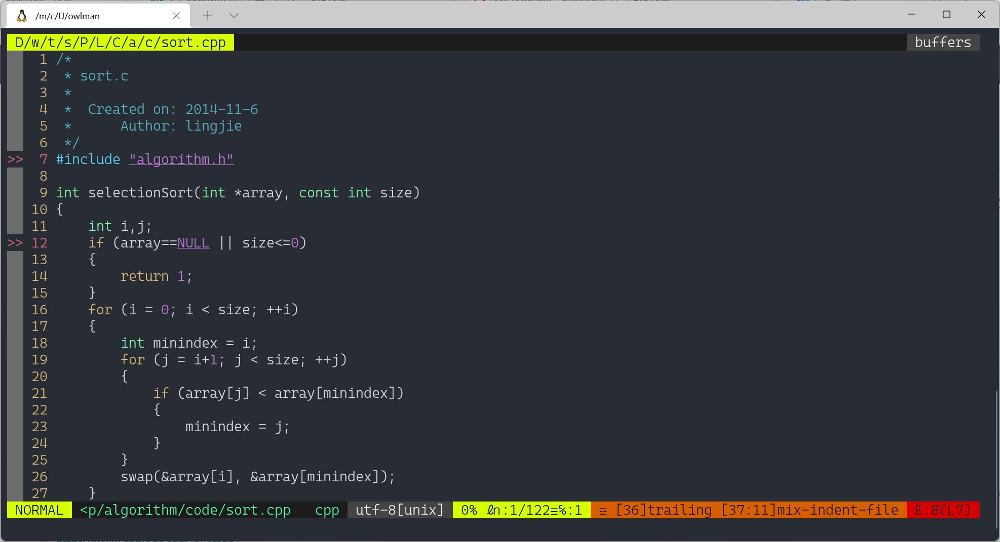

# NeoVim 学习笔记

## 学习资源

- NeoVim 官方网站：[NeoVim.io](https://NeoVim.io/)
- NeoVim 项目仓库：[GitHub - NeoVim/NeoVim](https://github.com/NeoVim/NeoVim)

## 背景知识

### NeoVim 起源

2014 年，巴西程序员 Thiago de Arruda Padilha（aka tarruda）曾经向 Vim 开源编辑器项目递交了两大补丁，其中包含了对 Vim 的架构进行大幅调整的建议，结果遭到了 Vim 作者 Bram Moolenaar 的拒绝。因为后者认为对于 Vim 这样一个成熟的项目进行如此大的改变风险太高。但或许在 tarruda 看来，Vim 这个上个世纪 90 年代初的产物，至今已经 20 多年了，该项目中不仅遗留了大量的历史痕迹，而且该项目的管理层如今在程序的维护、Bug 的修复、以及新特性的添加等问题上的态度都在变得越来越僵化，且难以与时俱进。

总而言之，基于对 Vim 项目的不满，并致力于打造一款面向 21 世纪的代码编辑器，tarruda 先生以众筹资金的方式发起了 Vim 的这个 fork 项目：NeoVim。在这里，Neo 这个单词表达的是其作者对 Vim 编辑器在这个新时代的重生期待。

### NeoVim 现状

从 NeoVim 项目的提交记录可以看出，tarruda 先生是个非常有项目维护经验的人，其有条不紊的管理让 NeoVim 的版本迭代相当快速，基本上几天就会推送一个新的版本。目前来说， NeoVim 已经实现 Vim 大部分功能，并兼容了 Vim 百分之九十以上的配置。根据该项目的自述说明，它最终想实现以下目标 :

- 通过简化项目的维护工作来改进 Bug 修复及特性添加的速度；
- 在实现新的、现代化的用户界面时不必修改编辑器的核心源码；
- 可利用新的、基于协同进程的新插件架构改善编辑器的扩展性；
- 支持使用 Python 等多种第三方编程语言与 NeoVim 进行交互；

随着时间的推移，NeoVim 项目逐渐发展成为一个成熟的项目，并率先提供了多个 8.0 版本之前的 Vim 所没有的新特性：

- 支持在 Vim 中打开命令行终端窗口，使用户不必退出编辑器就能执行 bash 命令；
- 为 vimscript 提供了异步任务的支持，之前的 vimscript 只能以同步的方式执行任务；
- 重构了 Vim 的部分代码，实现了多平台兼容，并可使用更加现代化的代码编译工具链；

但与此同时，NeoVim 项目的成功也反过来唤起了 Vim 项目组的危机意识，重新激发了他们的开发热情，促使 Vim 在 7.0 之后加快了新功能开发进度，很快发布了 Vim 8.0/8.1，把 NeoVim 实现的大部分新特性在 Vim 中也实现了一遍。Vim 现在也支持异步任务，内置终端等特性了。所以目前来看 NeoVim 与 Vim 的差异已经很小，大部分第三方插件都能兼容 NeoVim/vim。

## 安装与配置

本文将以 Ubuntu Linux 发行版为系统环境来研究 NeoVim 的安装与环境配置方法，并学习使用它的具体功能。

### 基础环境配置

因为在为 NeoVim 安装 coc.nvim 等插件时会需要用到 Node.js，所以在正式安装 NeoVim 之前，我们首先要在操作系统中安装一个 12.0.0 以上版本的 Node.js 运行时环境，它可以通过以下 Bash 命令序列来安装：

```bash
curl -fsSL https://deb.nodesource.com/setup_17.x | sudo -E bash -
sudo apt install -y nodejs
```

如果一切顺利，我们通过`node -v`和`npm -v`命令就可以查看到相应的版本，例如像这样：

```bash
$ node -v
v17.4.0
$ npm· -v
8.3.1
```

在这里，为了后续操作的顺利，我们需要将 NPM 所连接的默认仓库换成在国内的镜像：

```bash
$ npm config set registry https://registry.npm.taobao.org
$ npm config get registry
https://registry.npm.taobao.org
```

接着，我们需要安装 Python3 环境，它可以通过以下 Bash 命令序列来安装：

```bash
sudo apt install  -y  python3 python3-pip
pip install pynvim
```

最后，我们需要安装 curl 和 git，它们可以通过以下 Bash 命令序列来安装：

```bash
sudo apt install -y curl git
```

### 安装 NeoVim

在 Ubuntu Linux 中，我们可以直接通过 APT 包管理器来安装 NeoVim，其安装命令如下：

```bash
sudo apt install -y neovim
```

如果我们使用的是其他 Linux 发行版或者 Windows/macOS 等其他操作系统，也可以通过参考官方提供的[帮助文档](https://github.com/neovim/neovim/wiki/Installing-Neovim)来进行相关的安装操作。总而言之，如果一切顺利，我们接下来就可以使用`nvim -v`命令来查看 NeoVim 的版本信息了，像这样：

```bash
$ nvim -v
NVIM v0.4.3
Build type: Release
LuaJIT 2.1.0-beta3
Compilation: /usr/bin/cc -g -O2 -fdebug-prefix-map=/build/neovim-gOb7vg/neovim-0.4.3=. -fstack-protector-strong -Wformat -Werror=format-security -Wdate-time -D_FORTIFY_SOURCE=1 -DDISABLE_LOG -Wdate-time -D_FORTIFY_SOURCE=1 -O2 -DNDEBUG -DMIN_LOG_LEVEL=3 -Wall -Wextra -pedantic -Wno-unused-parameter -Wstrict-prototypes -std=gnu99 -Wshadow -Wconversion -Wmissing-prototypes -Wimplicit-fallthrough -Wvla -fstack-protector-strong -fdiagnostics-color=always -DINCLUDE_GENERATED_DECLARATIONS -D_GNU_SOURCE -DNVIM_MSGPACK_HAS_FLOAT32 -DNVIM_UNIBI_HAS_VAR_FROM -I/build/neovim-gOb7vg/neovim-0.4.3/build/config -I/build/neovim-gOb7vg/neovim-0.4.3/src -I/usr/include -I/usr/include/lua5.1 -I/build/neovim-gOb7vg/neovim-0.4.3/build/src/nvim/auto -I/build/neovim-gOb7vg/neovim-0.4.3/build/include
Compiled by team+vim@tracker.debian.org

Features: +acl +iconv +tui
See ":help feature-compile"

  system vimrc file: "$VIM/sysinit.vim"
  fall-back for $VIM: "/usr/share/nvim"

Run :checkhealth for more info
```

如果看到了类似的版本信息，就说明 NeoVim 编辑器已经成功地安装到了我们的计算机中。接下来，我们要来创建的一个专属于用户个人的配置文件，以方便后面的个性化配置。为此，我们需要执行以下 bash 命令：

```bash
mkdir ~/.config/nvim/
nvim ~/.config/nvim/init.vim
```

并在打开的``文件中输入如下代码：

```vim
" 令编辑器显示行号
set nu
```

然后在 NeoVim 中执行`:wq`命令保存配置并退出，如果当我们再次进入 NeoVim 时能看到其显示了行号，就证明我们的用户配置文件完成了创建并成功生效了。

### 插件安装方法

对于国内用户来说，在正式安装 NeoVim 编辑器的插件之前，最好先设置一下对`raw.githubusercontent.com`这个域名的本地 DNS 解析表，否则有时候会因不可控的网络因素而造成安装失败。具体做法是，先使用 IP 查询工具找到该域名对应的 IP 地址，然后将其写入到`/etc/hosts`文件中，像这样：

```bash
$ cat /etc/hosts
# [network]
# generateHosts = false
127.0.0.1   localhost
127.0.1.1   owlman.localdomain    owlman
199.232.96.133  raw.githubusercontent.com

# The following lines are desirable for IPv6 capable hosts
::1     ip6-localhost ip6-loopback
fe00::0 ip6-localnet
ff00::0 ip6-mcastprefix
ff02::1 ip6-allnodes
ff02::2 ip6-allrouters
```

接下来，我们就可以开始为 NeoVim 编辑器安装插件了。首先需要安装的是 Vim-plug 插件管理器，它可以通过以下 Bash 命令来安装：

```bash
sh -c 'curl -fLo "${XDG_DATA_HOME:-$HOME/.local/share}"/nvim/site/autoload/plug.vim --create-dirs \
       https://raw.githubusercontent.com/junegunn/vim-plug/master/plug.vim'
```

如果一切顺利，我们现在就可以在 NeoVim 编辑器中执行`:PlugInstall`命令来安装插件了。下面，我们就试着来安装一下可以按 tab 键进行补全的功能插件，其操作步骤如下：

1. 重新打开并编辑`init.vim`文件，将其内容修改如下：

   ```vim
   " 令编辑器显示行号
   set nu

   " 要安装的插件列表
   call plug#begin('~/.vim/plugged')
   " tab键补全功能插件
   Plug 'ervandew/supertab'
   call plug#end()
   ```

2. 在 NeoVim 中执行`:wq`命令保存配置并退出，然后重新进入 NeoVim 编辑器并在其命令模式下执行`:PlugInstall`命令，即可自动安装上述配置文件中列出的插件，待安装完成之后，我们再次重启进入 NeoVim 编辑器，并在编辑模式中按下 tab 键就会看到该插件提供的补全提示了。

## 常用插件安装

### Coc 插件

这是一个集成了代码补全、静态检测、函数跳转等功能的插件引擎，它允许用户根据自己使用的编程语言来安装相应的智能补全插件，其安装步骤如下：

1. 由于 Coc.nvim 是基于 Node.js 的，所以我们首先要确定当前系统环境中已经安装了 Node.js 运行环境，并且其版本应该在 12.0.0 以上。

2. 重新打开并编辑`init.vim`文件，将其内容修改如下：

   ```vim
   " 令编辑器显示行号
   set nu

   " 要安装的插件列表
   call plug#begin('~/.vim/plugged')
   " tab键补全功能插件
   Plug 'ervandew/supertab'
   " Coc 智能补全插件引擎
   Plug 'neoclide/coc.nvim', {'branch': 'release'}
   call plug#end()
   ```

3. 在 NeoVim 中执行`:wq`命令保存配置并退出，然后重新进入 NeoVim 编辑器并在其命令模式下执行`:PlugInstall`命令，即可自动安装上述插件列表中新增的插件。待安装完成之后，我们再次重启 NeoVim 编辑器，就可以根据自己使用的编程语言来安装智能补全插件了。

4. 由于 Coc 本身并不提供具体语言的补全功能，所以在安装完成后，我们需要安装具体的语言服务以支持对应的补全功能。例如想要配置 C++环境，我们就需要在 NeoVim 的命令模式下执行以下命令来安装相关的插件：

  ```vim
  :CocInstall coc-clangd # C++环境插件
  :CocInstall coc-cmake  # Cmake 支持
  ```
  
  在上述命令执行完成之后，我们可以试着用 NeoVim 打开一个`.cpp`文件，然后就会在编辑器的底部看到这样一段提示：

  ```bash
  [coc.nvim] clangd was not found on your PATH. :CocCommand clangd.install will install 11.0.0.
  ```

  这时候，我们可以继续在命令模式中输入`:CocCommand clangd.instal`命令来安装 clangd。然后，当我们再次重启 NeoVim 之后，编写 C++ 代码就会看到相关的智能补全提示了。当然了，我们可以执行以下命令来配置其他编程语言和工具的智能补全插件：

  ```vim
  :CocInstall coc-git            # git 支持
  :CocInstall coc-highlight  # 高亮支持
  :CocInstall coc-jedi           # jedi
  :CocInstall coc-json          # json 文件支持
  :CocInstall coc-python     # python 环境支持
  :CocInstall coc-sh             # bash 环境支持
  :CocInstall coc-snippets   # python提供 snippets
  :CocInstall coc-vimlsp      # lsp
  :CocInstall coc-yaml         # yaml
  ```

### vim-airline 插件

我们可以利用 vim-airline 插件及其主题插件来让 NeoVim 编辑器具有更赏心悦目的用户界面，其安装步骤如下：

1. 重新打开并编辑`init.vim`文件，将其内容修改如下：

   ```vim
   " 令编辑器显示行号
   set nu

   " 要安装的插件列表
   call plug#begin('~/.vim/plugged')
   " tab键补全功能插件
   Plug 'ervandew/supertab'
   " Coc 智能补全插件引擎
   Plug 'neoclide/coc.nvim', {'branch': 'release'}
   " vim-airline 标签栏插件
   Plug 'Vim-airline/vim-airline'
   " vim-airline 标签栏插件的主题插件
   Plug 'Vim-airline/vim-airline-themes'  
   call plug#end()

   " 配置 vim-airline 标签栏插件
   let g:airline#extensions#tabline#enabled = 1
   ```

2. 在 NeoVim 中执行`:wq`命令保存配置并退出，然后重新进入 NeoVim 编辑器并在其命令模式下执行`:PlugInstall`命令，即可自动安装上述插件列表中新增的插件。待安装完成之后，只需要再次重启 NeoVim 编辑器，就可以看到如下用户界面了。

   

### ranger 插件

这一款非常好用的文件浏览器插件，其安装步骤如下：

1. 先在 Ubuntu 系统环境中执行以下 bash 命令安装 ranger 组件：

   ```bash
   sudo apt install -y ranger
   ```

2. 重新打开并编辑`init.vim`文件，将其内容修改如下：

   ```vim
   " 令编辑器显示行号
   set nu

   " 要安装的插件列表
   call plug#begin('~/.vim/plugged')
   " tab键补全功能插件
   Plug 'ervandew/supertab'
   " Coc 智能补全插件引擎
   Plug 'neoclide/coc.nvim', {'branch': 'release'}
   " vim-airline 标签栏插件
   Plug 'Vim-airline/vim-airline'
   " vim-airline 标签栏插件的主题插件
   Plug 'Vim-airline/vim-airline-themes'  
   " ranger 文件浏览器
·   Plug 'kevinhwang91/rnvimr'
   call plug#end()

   " 配置 vim-airline 标签栏插件
   let g:airline#extensions#tabline#enabled = 1
   " 配置 ranger 文件浏览器插件
   let g:rnvimr_ex_enable = 1   
   " Alt+o 打开 ranger                                       
   nnoremap <silent> <M-o> :RnvimrToggle<CR>
   "Alt+加号 切换至下一个标签，减号则是切换回上一个
   nnoremap <M-+> :bp<CR> 
   nnoremap <M--> :bn<CR>
   ```

3. 在 NeoVim 中执行`:wq`命令保存配置并退出，然后重新进入 NeoVim 编辑器并在其命令模式下执行`:PlugInstall`命令，即可自动安装上述插件列表中新增的插件。待安装完成之后，只需要再次重启 NeoVim 编辑器并按下快捷键 Alt+o，就可以看到如下用户界面了。

   
