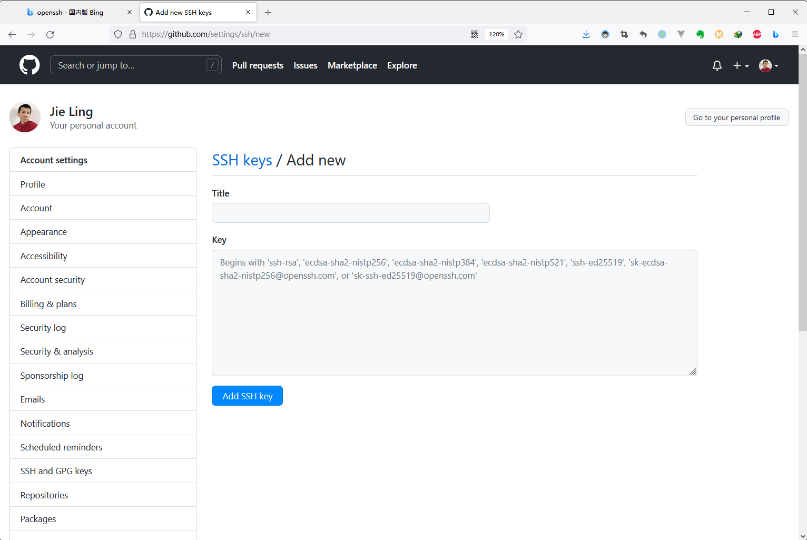

# Git 学习笔记

这篇学习笔记将用于记录本人在学习 Rust 编程语言过程中所编写的学习心得与代码。为此，我会在`https://github.com/owlman/study_note`项目的`SoftwareTool/`目录下创建一个名为的`Git`目录，并在该目录下设置以下两个子目录：

- `note`目录用于存放`markdown`格式的笔记。
- `code`目录则用于存放笔记中所记录的代码示例。

## 学习规划

- 学习基础：
  - 有一两门编程语言的使用经验。
  - 有一定的项目开发及维护经验。
- 使用书籍：
  - [《Git 权威指南》](https://book.douban.com/subject/6526452/)：本人学习所用书籍。
  - [《Git 学习指南》](https://book.douban.com/subject/26967729/)：本人参与翻译的书籍。
- 学习目标：
  - 构建一个私人 Git 服务器。
  - 并用它维护自己的私人项目。

## 前导部分：背景知识准备

在一般情况下，计算机上的程序开发项目都是从时间和空间两个维度上来进行维护的。在空间上，项目中的源代码文件以及管理依赖关系的文件（例如 makefile 文件）通常都是借由计算机操作系统以文件目录的形式来进行维护的。然而，我们应该使用什么工具来记录并管理在不同时间节点上所做的各种修改呢？答案是版本控制系统 （Version Control System，简称 VCS）。这是一种在时间维度上维护计算机程序项目的软件系统，它的功能就是方便开发者们记录并管理自己在某个特定时间节点上编写的代码，以便在必要时实现一些“有后悔药吃”的效果。

### 版本控制术语

在版本控制系统中，一系列专有的概念和操作都有特定的专业术语来描述。下面，就先来罗列一下这些术语及其所代表的含义：

- 版本（version）：指的是项目开发过程中某个被标记并存储下来的时间节点，其中包含了项目中所有文件在该时间节点上的副本。
- 仓库（Repository）：指的是用于记录并存储项目不同版本的地方，通常位于版本控制系统所在的服务器上。
- 分支（Branch）：指的是项目开发过程中的流程，项目中的每个分支都代表着一个独立的开发流程，用于解决一个独立的议题。
- 提交（Commit）：指的是开发者将在本地端所记录的版本上交至版本控制系统的服务端仓库。
- 冲突（Conflict）：指的是项目团队中的不同开发者针对同一份文件提交了时间上并行的版本，在这种情况下版本控制系统就会提出警告。
- 合并（Merge）：指的是查看引发冲突警告的并行版本，将它们所做的修改进行审查、取舍并整合为一个版本并重新提交。
- 检出（Checkout）：指的是开发者从版本控制系统的服务端仓库取出某一指定版本的文件副本到本地端，取出的可以是指定的文件，也可以是整个项目。

### 版本控制方式

从版本管理的方式上来看，版本控制系统主要可分为**集中式版本控制**和**分布式版本控制**两大类：

- 集中式版本控制系统（Centralized Version Control System）通常会在项目团队中设有一台中央版本控制服务器，并通过它来为参与该项目的所有开发者提供版本控制服务。这类版本控制系统在过去的很长一段时间内占据业界的主流，主要以 [CVS](http://www.nongnu.org/cvs) 与 [Subversion](https://subversion.apache.org/) 为代表，它们都有一个共同的缺点，即时常会因为单点造成的故障而让项目蒙受巨大损失。

- 分布式版本控制系统（Distributed Version Control System）的出现在很大程度上克服了集中式版本控制系统的缺点。这类版本控制系统会让项目团队中的每个开发者都持有项目的一个完整镜像，也就是说，现在该团队中每个参与者所使用的计算机都可以视为版本控制服务器。这样一来，即使项目团队中有某个单点因故障而失去了服务能力，其他节点还是可以继续维持版本控制系统的正常运转。这类版本控制系统主要以 [BitKeeper](https://www.bitkeeper.org/)、[Git](https://git-scm.com/) 为典型代表。

## 第 1 部分：Git 入门笔记

由于 Linus Torvalds 一直不喜欢集中式的版本控制系统，所以在 2002年到 2005 年之间，他甚至一度不惜顶着开源社区巨大的争议压力而选择使用 BitKeeper 这个商业版本控制系统来维护 Linux 内核项目，为的是坚持分布式的开发方式。然而在 2005 年 4 月的某一天，因为 Samba 文件服务的开发者 Andrew Tridgell 为了编写一个能链接到 BitKeeper 存储库的简单交互程序，对其进行了逆向工程。由于这已经不是 Linux 项目的开发者们第一次对该商业软件进行逆向工程了，于是在多次警告无效的情况下， BitKeeper 所在的 BitMover 公司忍无可忍地终止了对 Linux 内核项目的授权。所以，Git 最初被开发出来只是因为 Linus Torvalds 急需要一个能替代 BitKeeper 的分布式版本控制工具，以便继续维护 Linux 的内核项目。后来由于这个软件的表现太过优秀，就逐步发展成为了业界最受欢迎的版本控制系统。

下面来重点讨论一下 Git 与其它主流版本控制系统之间的区别：

- 首先，它在版本迭代的过程中记录的并非是基于初始文件的变化数据，而是通过更为小型化的快照（Snapshot）文件体系来记录项目的版本历史。这样一来，如果某一份文件在版本更新后没有发生任何变化，那么它在这一新版本中的存储形式只是一个文件链接，指向的是它自身最近一次发生变化的那个副本。

- 其次，由于 Git 的操作基本上都是在本地端进行的，所以它几乎所有的操作都是瞬间完成的。例如在开发者们想要查看项目历史时，他们不需要特地去服务端抓取项目版本的历史记录，直接在本地浏览即可。这意味着，开发者们可以在本地端直接对比隶属于不同版本的文件之间的差别，可以在本地端查看过去有哪些人对指定文件作出了修改与更新等，这就很好地体现了分布式开发的优势，尤其在当有人由于没有网络条件但是又必须抓紧时间对项目进行修改与开发，同时又需要有版本管理系统来记录每次项目开发过程时，这种优势就尤为明显，Git 就满足了他所有的需求。

- 最后，Git 会使用 SHA-1 算法加密生成的 40 位字符串，而不是文件名来记录项目中的所有数据。这样做有助于加快版本历史的索引速度。

### 安装与配置

Git 是一个开源的、跨平台的版本控制系统，它可以被部署在各种操作系统上。下面，我将分别记录一下在 Windows、macOS 以及 Linux/UNIX 上安装并配置 Git 的具体步骤。要想安装 Git，我们首先需要前往 Git 的官方网站并进到其下载页面，如下图所示：


然后，我们需要根据自己所在的操作系统选择相应的安装向导页面，具体情况如下：

- 在 Windows 下，我们需要下载的是[Git for Windows](https://git-scm.com/download/win) 这个二进制的可执行文件，然后在本地打开其图形化向导来进行安装，初学者只需要一路选择默认选项即可。

- 在 Linux/UNIX 下，我们需要根据自己所在的 Linux/UNIX 发行版来执行相应的包管理器命令来进行安装，常见包管理器命令如下：
  
   ```bash
   # Debian/ubuntu
   apt-get install git
  
   # Fedora
   yum install git (up to Fedora 21)
   dnf install git (Fedora 22 and later)
  
   # Arch Linux
   pacman -S git
  
   # openSUSE
   zypper install git
  
   # FreeBSD
   pkg install git

   # Solaris 9/10/11 (OpenCSW)
   pkgutil -i git

   # Solaris 11 Express
   pkg install developer/versioning/git

   # OpenBSD
   pkg_add git
   ```

- 在 macOS 下，我们既可以选择下载 [git-osx-installer](https://sourceforge.net/projects/git-osx-installer/) 这个二进制的可执行文件，像在 Windows 下一样进行图形化安装，也可以在命令行终端环境中执行`brew install git`命令，像在 Linux 下一样通过包管理器来安装。需要注意的是，如果我们之前在 macOS 中已经安装了 XCode 开发环境，那么该开发环境就已经替我们安装好了 Git 版本控制系统，无需再另行安装了。

在安装完成之后，我们需要对 Git 进行一些基本配置。由于 Git 的配置命令在各种操作系统中的使用方式大同小异，所以为了减少重复劳动，我特别用 Python 写了一个自动化配置脚本，具体如下：

```Python
#! /usr/bin/env python

import os
import sys
import platform

title = "=    Starting " + sys.argv[0] + "......    ="
n = len(title)
print(n*'=')
print(title)
print(n*'=')

cmds = [
    "git config --global user.name 'owlman'" ,
    "git config --global user.email 'jie.owl2008@gmail.com'",
    "git config --global push.default simple",
    "git config --global color.ui true",
    "git config --global core.quotepath false",
    "git config --global i18n.logOutputEncoding utf-8",
    "git config --global i18n.commitEncoding utf-8",
    "git config --global color.diff auto",
    "git config --global color.status auto",
    "git config --global color.branch auto",
    "git config --global color.interactive auto"
]

if platform.system() == "Windows":
    cmds.append("git config --global core.autocrlf true")
else:
    cmds.append("git config --global core.autocrlf input")

for cmd in cmds:
    print(cmd)
    os.system(cmd)

print(n*'=')    
print("=     Done!" + (n-len("=     Done!")-1)*' ' + "=")
print(n*'=')
```

最后，我们可以通过在命令行终端环境中执行`git --version`命令来验证一下安装结果，如果看到其相关的版本信息表示安装成功，接下来，我们可以学习一些基本操作了。

### 本地仓库操作

在学习基本操作之前，我们需要先来研究一下 Git 基本工作流程。首先需要熟悉的一件事是，受 Git 版本控制系统维护的项目文件主要存在着以下三种记录状态：

- 已修改（Modified）：该状态表示文件已经被修改，但尚未被记录为下一次要提交的版本。
- 已暂存（Staged）：该状态表示文件已被记录为下一次要提交的版本，但尚未提交到本地仓库中，
- 已提交（Committed）：该状态表示文件已经被记录为一个版本，并提交到了本地仓库中。

这三种文件记录状态会致使每个由 Git 维护的项目在文件结构上被分成了以下三个组成部分：

- 工作区域：该部分主要用于存放项目中处于已修改状态的文件。
- 暂存区域：这部分主要用于存放项目中处于已暂存状态的文件。
- 本地仓库：该部分主要用于存放项目中处于已提交状态的文件。

总而言之，在一个由 Git 维护的项目中，如果本地仓库中保存着的特定版本文件，就属于已提交状态。 如果作了修改并已放入暂存区域，就属于已暂存状态。 如果自上次检出操作之后，作了修改但还没有放到暂存区域，就是已修改状态。接下来，我将通过模拟实际的项目维护来学习一下如何完成上述工作流程。

#### 项目设置

首先要做的是将要维护的项目纳入到 Git 版本控制系统中，其操作步骤如下：

- 假设计算机上现在已经有了一个需要使用 Git 版本控制系统来维护的项目。在这里，它位于`code/demo_repo`目录中，该项目的初始结构如下：

    ```bash
    demo_repo
      ├── debug
      ├── release
      ├── src
      │   ├── main.c
      │   ├── test.c
      │   └── test.h
      ├── Makefile
      └── README.md
    ```

- 执行以下命令将`demo_repo`目录初始化为一个由 Git 维护的项目：

    ```bash
    cd demo_repo
    git init
    ```

  如果一切顺利，`demo_repo`目录下就会多出一个叫做`.git`的目录，该目录下会有个`config`文件，他的内容如下：

    ```text
    [core]
        repositoryformatversion = 0
        filemode = false
        bare = false
        logallrefupdates = true
        ignorecase = true
    ```

- 在`config`文件中配置自己在团队中的用户信息（注意，该信息必须与之前配置 SSH 密钥时的信息保持一致）：

    ```text
    [user]
        name = <你使用的用户名>
        email = <你的电子邮件地址>
    ```

   在这里，用户信息也完全可以用命令行来配置，只需要在执行`git init`命令之前执行如下命令即可：

    ```bash
    git config –-local user.name “<你使用的用户名>”
    git config –-local user.email “<你的电子邮件地址>”
    ```

    当然了，如果之前使用`git config -global`命令配置过全局的用户信息，这里也可以选择不配置用户信息，Git 在默认情况下会直接使用用户配置的全局信息。

#### 文件操作

首先，我们需要用`git status`命令来查看一下`demo_repo`项目中的各种文件当前在 Git 中的记录状态（在使用 Git 的过程中，该命令将会反复使用）：

```git
On branch master

No commits yet

Untracked files:
  (use "git add <file>..." to include in what will be committed)
    Makefile
    README.md
    src/

nothing added to commit but untracked files present (use "git add" to track)
```

如你所见，`git status`命令输出了当前项目在版本控制系统中的当前状态和接下来可执行的操作建议。这些信息主要由两部分组成：

- 前四行为第一部分，这部分信息告诉我们当前所处的项目分支，默认情况下是`master`分支，也就是项目的主分支。并且该项目在`master`分支下尚未提交任何版本。

- 第五行之后为第二部分。这部分信息列出了当前项目中尚未被纳入版本控制系统的文件，并且告诉我们可以使用`git add`命令将指定的文件纳入到版本控制系统的追踪列表中。

所以，下一个要执行的操作就是使用`git add`命令来添加 Git 要追踪的文件了。在这里，我们可以选择先添加单一文件来观察一下文件状态的变化。在 Git 中，我们可以通过`git add <文件名>`这种命令形式将指定名称的文件添加到 Git 的追踪列表中。例如，我们想先将`README.md`这个项目自述文件纳入版本控制系统，就只需要在`demo_repo`项目的根目录下执行`git add README.md`命令即可。然后，如果我们再执行`git status`命令，就会看到如下输出：

```git
On branch master

No commits yet

Changes to be committed:
  (use "git rm --cached <file>..." to unstage)
    new file:   README.md

Untracked files:
  (use "git add <file>..." to include in what will be committed)
    Makefile
    src/
```

如你所见，现在`git status`命令输出信息的第二部分也变成了两个部分。第五行到第七行为第一部分，这部分信息输出的是已被 Git 追踪的文件，第八行之后依然是尚未被追踪的文件。这意味着，`README. md`文件已被 Git 监控，如果我们现在对该文件做一些修改，并再次在`demo_repo`项目的根目录下执行`git status`命令的话，其输出的第二部分信息中还会增加被修改了的文件列表，具体如下：

```git
On branch master

No commits yet

Changes to be committed:
  (use "git rm --cached <file>..." to unstage)
    new file:   README.md

Changes not staged for commit:
  (use "git add <file>..." to update what will be committed)
  (use "git restore <file>..." to discard changes in working directory)
    modified:   README.md

Untracked files:
  (use "git add <file>..." to include in what will be committed)
    Makefile
    src/
```

需要注意的是，现在的项目中存在着两份`README.md`文件，一份是修改之前已经通过`git add`命令加入到暂存区域中的文件，一份是在执行了`git add`命令之后被修改了的文件。接下来，我们可以根据`git status`命令给出的建议执行以下可能的操作：

- 如果想撤销在执行了`git add`命令之后对`README.md`文件的修改，可以在`demo_repo`项目的根目录下执行`git restore README.md`命令。

- 如果想将这次修改也更新到暂存区域，可以在`demo_repo`项目的根目录下再次执行`git add README.md`命令。

- 如果想撤销上一次执行`git add`命令将文件添加到暂存区域的操作，可以在`demo_repo`项目的根目录下执行`git rm –cached README.md`命令。

另外，如果我们想将某一目录下的所有文件一次性地添加到 Git 的追踪列表中，也可以使用`git add <目录名>`这个命令形式来实现。例如，如果想将`demo_repo`项目中的所有文件加入到 Git 的追踪列表，就可以在该项目的根目录下执行`git add .`命令（这里的`.`代表的是当前目录）。如果这时候，我们再次执行`git status`命令，就会看到如下输出：

```git
On branch master

No commits yet

Changes to be committed:
  (use "git rm --cached <file>..." to unstage)
    new file:   Makefile
    new file:   README.md
    new file:   src/main.c
    new file:   src/test.c
    new file:   src/test.h
```

当然了，对于`demo_repo`项目来说，其`debug`目录中通常只存放一些本地开发过程中使用到的调试信息，理应被 Git 无视。要想解决这个问题，我们可以在项目的根目录下创建一个名为`.gitignore`的特殊文件，然后把要忽略文件或目录的名称填进去。这样一来，Git 就会自动忽略这些文件或目录。

在`.gitingore`文件中，每一行的文本都指定了一条忽略规则，其忽略规则的语法如下：

- 空格不匹配任意文件，可作为分隔符，可用反斜杠转义。
- 开头的文件标识注释，可以使用反斜杠进行转义。
- 以`!`符号开头的模式标识否定，该文件将会再次被包含，如果排除了该文件的父级目录，则使用 ! 也不会再次被包含。可以使用反斜杠进行转义。
- 以`/`符号结束的模式只匹配文件夹以及在该文件夹路径下的内容，但是不匹配该文件。
- 以`/`符号开始的模式匹配项目跟目录。
- 如果一个模式不包含斜杠，则它匹配相对于当前 .gitignore 文件路径的内容，如果该模式不在 .gitignore 文件中，则相对于项目根目录
- `**`符号匹配多级目录，可在开始，中间，结束。
- `?`符号通用匹配单个字符。
- `*`通用匹配零个或多个字符。
- `[]`符号通用匹配单个字符列表。

.gitignore规则不生效

.gitignore只能忽略那些原来没有被track的文件，如果某些文件已经被纳入了版本管理中，则修改.gitignore是无效的。

解决方法就是先把本地缓存删除（改变成未track状态），然后再提交:

git rm -r --cached .
git add .
git commit -m 'update .gitignore'

你想添加一个文件到 Git，但发现添加不了，原因是这个文件被.gitignore忽略了：

$ git add App.class
The following paths are ignored by one of your .gitignore files:
App.class
Use -f if you really want to add them.

如果你确实想添加该文件，可以用-f强制添加到Git：

$ git add -f App.class

或者你发现，可能是.gitignore写得有问题，需要找出来到底哪个规则写错了，可以用git check-ignore命令检查：

$ git check-ignore -v App.class
.gitignore:3:*.class    App.class

Git会告诉我们，.gitignore的第3行规则忽略了该文件，于是我们就可以知道应该修订哪个规则。

需要说明的是，Git 检查忽略规则的时候可以有多个来源，它的优先级如下（由高到低）：

从命令行中读取可用的忽略规则
当前目录定义的规则
父级目录定义的规则，依次递推
$GIT_DIR/info/exclude 文件中定义的规则
core.excludesfile中定义的全局规则

#### 版本操作

现在，我们通过命令git commit将hello.py提交:

```bash
git commit
```

这时，会出现一个带有status信息的文本给你编辑(使用什么编辑器取决于你对git的配置)，在以”#”开头的注释行下输入一些文本，用于注释此次提交，方便于其他代码协作者的维护与理解！
你也可以通过命令参数-m来直接输入注释内容，加快提交速度:

```bash
git commit -m “comment here”
```

至此，你的文件hello.py已经处于tracked状态！。
现在，我们有一个hello.py在镜像中了，接下来，假设发现了一个小错误，额，比如一个循环的条件写错了，于是我们需要针对文件完成修改，之后，当我们再次git status的时候：

```bash
```

git status显示，hello.py被修改过了，如果你想要提交，需要再次git add该文件，或者，可以直接使用git commit -a跳过add的步骤，直接提交(尚未track的文件必须先git add才能进行提交)。
在提示中，还有提到说，如果你想撤销对hello.py的修改，就可以使用git checkout命令来实现，这里的情况会是:

```bash
```

如果你这么做了，你就会发现，你的hello.py又回到了之前没有被修改过的时候的状态。在Unix/Unix-like系统中，几乎都会有一个 小巧的对比文件不同的工具叫做diff，在git中也有这么一个工具，来详细比较你修改后准备提交的文件与修改前的状态的不同之处，恩，也许你猜到了，这 个命令就是git diff。
现在我们尝试着再次修改一下hello.py，然后运行git diff:

```bash
$ git diff
diff –git a/ hello.py b/ hello.py
index befc634..a86316b 100644
— a/hello.py
+++ b/hello.py
@@ -1,3 +1,4 @@
+/* new comment line */
if __name__ == “__main__”:
    print “hello, world!”
```

通过git的diff工具，很容易了解到我们更改了哪些地方。这个时候，如果我们想撤销之前的更改，可以使用git reset命令：

```bash
$ git reset HEAD hello.py
$ git status
# On branch master
# Untracked files:
# (use “git add …” to include in what will be committed)
#
# hello.py

nothing added to commit but untracked files present (use “git add” to track)
```

再次git status，hello.py又回到了untracked状态！

接下来，如果需要修改README.txt（通常是项目的自述文件）的文件名（千万要记得我们的文件在git的镜像中进行版本控制管理，不要鲁莽的直接使用unix命令mv或者rm来对git镜像中的文件进行普通的文件操作），我们该使用git mv命令：

```bash
$ git mv README.txt tutorial.txt
$ git status
# On branch master
# Changes to be committed:
# (use “git reset HEAD …” to unstage)
#
# renamed: README.txt -> tutorial.txt
#
$ git commit -a -m “renamed a file”
[master 55ce30d] renamed a file
1 files changed, 0 insertions(+), 0 deletions(-)
rename README.txt => tutorial.txt (100%)
```

可以看到，在提交变更后，README.txt在文件系统以及git镜像中都被成功地重命名为了tutorial.txt。同样的，你可以unstage来撤销对该文件的重命名，the choice is yours！ 如果我们不再需要tutorial.txt这个文件，我们可以将其从git镜像中删除，git中删除文件的命令是git rm:

```bash
$ git rm tutorial.txt
rm ‘tutorial.txt’
$ git status
# On branch master
# Changes to be committed:
# (use “git reset HEAD …” to unstage)
#
# deleted: tutorial.txt
#
$ git commit -a -m ” deleted a file”
[master 7d81981] deleted a file
1 files changed, 0 insertions(+), 1 deletions(-)
delete mode 100644 tutorial.txt
```

正如之前所提到的，这些操作都是可以恢复的，因为git是版本控制系统，所以自然而然的就会有一套版本历史管理机制。
我们可以用工具git log提供了查看git镜像的commit历史:

```bash
$ git log
commit 7d819818530ce89322019ba5000723c973eb0420
Author: ghosTM55
Date: Sun Mar 14 15:26:22 2010 +0800

deleted a file

commit 55ce30d88fb5c81d20bdf86e2034053613fed632
Author: ghosTM55
Date: Sun Mar 14 15:11:39 2010 +0800
renamed a file
commit 2ed9f1f9bd1a7561cd7e57dcdbd7f2cda54668fb
Author: ghosTM55
Date: Sun Mar 14 14:58:11 2010 +0800
a little change
```

基本上可以清楚地看到，git详细记录了每次commit的信息(checksum值、提交者信息、提交时间)。 

#### 分支操作

下面简单的说一下分支管理的操作，git的分支管理是异常的简单和方便，可以用git branch命令进行非常直观的操作：
首先可以在工作目录下查看当前的项目存在多少分支：

```bash
$ git branch
* master
test
```

可以清楚地看到，目前该项目存在两个分支master和test，带*的是当前分支（我们可以用命令git checkout test切换到test反之）。接下来我们为项目添加一个分支：

```bash
$ git branch new
$ git branch
* master
new
test
```

我们看到新分支new已经添加进git的镜像里了，如果要删除该分支，我们可以如此：

```bash
$ git branch -d new
Deleted branch new (was 63c0da1).
$ git branch
* master
test
```

这时候我们就看到new已不在镜像中。

### 远程仓库操作

要参与任何一个 Git 项目的协作，必须要了解该如何管理远程仓库。远程仓库是指托管在网络上的项目仓库，可能会有好多个，其中有些你只能读，另外有些可以写。同他人协作开发某 个项目时，需要管理这些远程仓库，以便推送或拉取数据，分享各自的工作进展。管理远程仓库的工作，包括添加远程库，移除废弃的远程库，管理各式远程库分支，定义是否跟踪这些分支，等等。本节我们将详细讨论远程库的管理和使用。

#### 配置 SSH 客户端

首先，由于 Git 版本控制系统在绝大多数情况下是推荐使用 SSH 协议来进行网络通信的，所以在学习远程仓库的基本操作之前，我们通常需要先安装一下 SSH 客户端（这里推荐使用 OpenSSH Client)，并在本地生成一个 SSH 密钥。其具体步骤如下：

- 在系统用户目录[^1]下查看是否已经存在一个名为`.ssh`目录（请注意，这是一个隐藏目录），该目录下通常会存有`id_rsa`和`id_rsa.pub`这两个文件。如果没有，就需要生成新的密钥了，其命令序列如下:

    ```bash
    $ ssh-keygen -t rsa -C “<你的电子邮件地址>”
    Enter file in which to save the key (~/.ssh/id_rsa):
    Enter passphrase (empty for no passphrase):<设定一个密码>
    Enter same passphrase again:<重复一遍密码>
    Your identification has been saved in ~/.ssh/id_rsa.
    Your public key has been saved in ~/.ssh/id_rsa.pub.
    The key fingerprint is:
        e8:ae:60:8f:38:c2:98:1d:6d:84:60:8c:9e:dd:47:81 <你的电子邮件地址>
    ```

- 将`id_rsa.pub`文件中的 Public Key 通报给我们所需要提交的 Git 服务端（这里以 GitHub 为例，其他服务器的方式联系相关的管理员）。具体操作步骤是：先打开 GitHub 的设置页面，然后进入到其 SSH and GPG Key 页面中，并点击“new SSH key”按钮，最后将`id_rsa.pub`文件中的内容以纯文本字符串的形式填写到下图的表单中。
  
  

- 接下来，我们可以在命令行终端环境中执行以下命令来测试一下客户端的配置是否成功：

    ```bash
    $ ssh -T git@github.com
    Hi <你的用户名> You’ve successfully authenticated, but GitHub does not provide shell access.
    ```

    如果在命令行终端环境的输出中看到了类似上面这样的欢迎信息，我们面向 GitHub 的 SSH 客户端配置就算大功告成了。

[^1]: 在 Windows 7 之前的 Windows 系统中通常是指`C:\Documents and Settings\<你的用户名>\`目录，在 Windows 7 本身及其之后则是指`C:\Users\<你的用户名>\`目录。而 macOS、Linux 等其他操作系统通常都是指`/home/<你的用户名>`目录。

#### 查看当前的远程库

要查看当前配置有哪些远程仓库，可以用 git remote 命令，它会列出每个远程库的简短名字。在克隆完某个项目后，至少可以看到一个名为 origin 的远程库，Git 默认使用这个名字来标识你所克隆的原始仓库：

```bash
$ git clone git://github.com/schacon/ticgit.git
Initialized empty Git repository in /private/tmp/ticgit/.git/
remote: Counting objects: 595, done.
remote: Compressing objects: 100% (269/269), done.
remote: Total 595 (delta 255), reused 589 (delta 253)
Receiving objects: 100% (595/595), 73.31 KiB | 1 KiB/s, done.
Resolving deltas: 100% (255/255), done.
$ cd ticgit
$ git remote
origin
```

也可以加上 -v 选项（译注：此为 –verbose 的简写，取首字母），显示对应的克隆地址：

```bash
$ git remote –v
origin    git://github.com/schacon/ticgit.git
```

如果有多个远程仓库，此命令将全部列出。比如在我的 Grit 项目中，可以看到：

```bash
$ cd grit
$ git remote –v
bakkdoor git://github.com/bakkdoor/grit.git
cho45 git://github.com/cho45/grit.git
defunkt git://github.com/defunkt/grit.git
koke git://github.com/koke/grit.git
origin git@github.com:mojombo/grit.git
```

这样一来，我就可以非常轻松地从这些用户的仓库中，拉取他们的提交到本地。请注意，上面列出的地址只有 origin 用的是 SSH URL 链接，所以也只有这个仓库我能推送数据上去。

#### 添加远程仓库

要添加一个新的远程仓库，可以指定一个简单的名字，以便将来引用，运行 git remote add <shortname> <url>：

```bash
$ git remote
origin
$ git remote add pb git://github.com/paulboone/ticgit.git
$ git remote –v
origin    git://github.com/schacon/ticgit.git
pb    git://github.com/paulboone/ticgit.git
```

现在可以用字串 pb 指代对应的仓库地址了。比如说，要抓取所有 Paul 有的，但本地仓库没有的信息，可以运行 git fetch pb：

```bash
$ git fetch pb
remote: Counting objects: 58, done.
remote: Compressing objects: 100% (41/41), done.
remote: Total 44 (delta 24), reused 1 (delta 0)
Unpacking objects: 100% (44/44), done.
From git://github.com/paulboone/ticgit
* [new branch] master -> pb/master
* [new branch] ticgit -> pb/ticgit
```

现在，Paul 的主干分支（master）已经完全可以在本地访问了，对应的名字是 pb/master，你可以将它合并到自己的某个分支，或者切换到这个分支，看看有些什么有趣的更新。

#### 从远程仓库抓取数据

正如之前所看到的，可以用下面的命令从远程仓库抓取数据到本地：

```bash
git fetch [remote-name]
```

此命令会到远程仓库中拉取所有你本地仓库中还没有的数据。运行完成后，你就可以在本地访问该远程仓库中的所有分支，将其中某个分支合并到本地，或者只是取出某个分支，一探究竟。（我们会在第三章详细讨论关于分支的概念和操作。）

如果是克隆了一个仓库，此命令会自动将远程仓库归于 origin 名下。所以，git fetch origin 会抓取从你上次克隆以来别人上传到此远程仓库中的所有更新（或是上次fetch 以来别人提交的更新）。有一点很重要，需要记住，fetch 命令只是将远端的数据拉到本地仓库，并不自动合并到当前工作分支，只有当你确实准备好了，才能手工合并。(说明：事先需要创建好远程的仓库，然后执 行：git remote add <仓库名> <仓库url]> ;git fetch <远程仓库名>，即可抓取到远程仓库数据到本地，再用git merge remotes/<仓库名>/master就可以将远程仓库merge到本地当前branch。这种分支方式比较适合独立-整合开发，即各自开发测试好后 再整合在一起。比如，Android的Framework和AP开发。

可以使用–bare 选项运行git init 来设定一个空仓库，这会初始化一个不包含工作目录的仓库。

```bash
cd /opt/git
mkdir project.git
cd project.git
git –bare init
```

这时，Join，Josie 或者Jessica 就可以把它加为远程仓库，推送一个分支，从而把第一个版本的工程上传到仓库里了。)
如果设置了某个分支用于跟踪某个远端仓库的分支（参见下节及第三章的内容），可以使用 git pull 命令自动抓取数据下来，然后将远端分支自动合并到本地仓库中当前分支。在日常工作中我们经常这么用，既快且好。实际上，默认情况下 git clone 命令本质上就是自动创建了本地的 master 分支用于跟踪远程仓库中的 master 分支（假设远程仓库确实有 master 分支）。所以一般我们运行 git pull，目的都是要从原始克隆的远端仓库中抓取数据后，合并到工作目录中当前分支。

#### 推送数据到远程仓库

项目进行到一个阶段，要同别人分享目前的成果，可以将本地仓库中的数据推送到远程仓库。实现这个任务的命令很简单： git push <remote-name> <branch-name>。如果要把本地的 master 分支推送到 origin 服务器上（再次说明下，克隆操作会自动使用默认的 master 和 origin 名字），可以运行下面的命令：

```bash
git push origin master
```

只有在所克隆的服务器上有写权限，或者同一时刻没有其他人在推数据，这条命令才会如期完成任务。如果在你推数据前，已经有其他人推送了若干更新，那 你的推送操作就会被驳回。你必须先把他们的更新抓取到本地，并到自己的项目中，然后才可以再次推送。有关推送数据到远程仓库的详细内容见第三章。

#### 查看远程仓库信息

我们可以通过命令`git remote show <remote-name>`查看某个远程仓库的详细信息，比如要看所克隆的origin 仓库，可以运行：

```bash
$ git remote show origin
* remote origin
URL: git://github.com/schacon/ticgit.git
Remote branch merged with ‘git pull’ while on branch master
master
Tracked remote branches
master
ticgit
```

除了对应的克隆地址外，它还给出了许多额外的信息。它友善地告诉你如果是在 master 分支，就可以用`git pull`命令抓取数据合并到本地。另外还列出了所有处于跟踪状态中的远端分支。在实际使用过程中，`git remote show`给出的信息可能会像这样：

```bash
$ git remote show origin
* remote origin
URL: git@github.com:defunkt/github.git
Remote branch merged with ‘git pull’ while on branch issues
issues
Remote branch merged with ‘git pull’ while on branch master
master
New remote branches (next fetch will store in remotes/origin)
caching
Stale tracking branches (use ‘git remote prune’)
libwalker
walker2
Tracked remote branches
acl
apiv2
dashboard2
issues
master
postgres
Local branch pushed with ‘git push’
master:master
```

它告诉我们，运行 git push 时缺省推送的分支是什么（译注：最后两行）。它还显示了有哪些远端分支还没有同步 到本地（译注：第六行的 caching 分支），哪些已同步到本地的远端分支在远端服务器上已被删除（译注：Stale tracking branches 下面的两个分支），以及运行 git pull 时将自动合并哪些分支（译注：前四行中列出的 issues 和 master 分支）。(此命令也可以查看到本地分支和远程仓库分支的对应关系。)

### 远程仓库的删除和重命名

在新版 Git 中可以用 git remote rename 命令修改某个远程仓库的简短名称，比如想把 pb改成 paul，可以这么运行：

```bash
$ git remote rename pb paul
$ git remote
origin
paul
```

注意，对远程仓库的重命名，也会使对应的分支名称发生变化，原来的 pb/master分支现在成了paul/master。 碰到远端仓库服务器迁移，或者原来的克隆镜像不再使用，又或者某个参与者不再贡献代码，那么需要移除对应的远端仓库，可以运行 git remote rm 命令：

```bash
$ git remote rm paul
$ git remote
Origin
```

## 第 2 部分：gitlab 研究笔记

<!-- 以下为注释 -->
