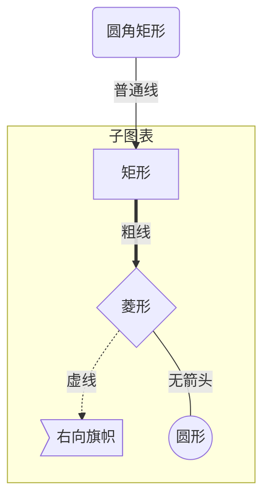

标题

# 一级标题
## 二级标题
### 三级标题
#### 四级标题
##### 五级标题
###### 六级标题

强调文本

*斜体*

**粗体**

***斜体加粗体***

无序列表

* 项目1
  * 子项目1
  * 子项目2
  * 子项目3
* 项目2
* 项目3

有序列表

1. 项目1
   1. 子项目1
   2. 子项目2
   3. 子项目3
2. 项目2
3. 项目3

表格

| Tables | Are | Cool |
|-------------|:-------------:|-----:|
| col 3 is | right-aligned | $1600 |
| col 2 is | centered | $12 |
| zebra stripes | are neat | $1 |

图片


链接

[owlman.org](http://owlman.org)

注释

被注释文本A[^note1]

被注释文本B[^note2]

区块引用

> This is a blockquote with two paragraphs. Lorem ipsum dolor sit amet, consectetuer adipiscing elit. Aliquam hendrerit mi posuere lectus. Vestibulum enim wisi, viverra nec, fringilla in, laoreet vitae, risus.

代码区块

```C
#include <stdio.h>
#include "stack.h"

int main(void)
{
    printf("%s\n", "hello world!");
    return 0;
}
```

数学

上下标符号

$$x^{100}$$
$$x_{100}$$

关系运算符

$$\pm$$
$$\times$$
$$\div$$
$$\mid$$
$$\nmid$$
$$\cdot$$
$$\circ$$
$$\ast$$
$$\bigodot$$
$$\bigotimes$$
$$\bigoplus$$
$$\leq$$
$$\geq$$
$$\neq$$
$$\approx$$
$$\equiv$$
$$\sum$$
$$\prod$$
$$\coprod$$

集合运算符

$$\emptyset$$
$$\in$$
$$\notin$$
$$\subset$$
$$\supset$$
$$\subseteq$$
$$\supseteq$$
$$\bigcap$$
$$\bigcup$$
$$\bigvee$$
$$\bigwedge$$
$$\biguplus$$
$$\bigsqcup$$

对数运算符

$$\log$$
$$\lg$$
$$\ln$$

三角运算符

$$\bot$$
$$\angle$$
$$30^\circ$$
$$\sin$$
$$\cos$$
$$\tan$$
$$\cot$$
$$\sec$$
$$\csc$$

微积分运算符

$$\prime$$
$$\int$$
$$\iint$$
$$\iiint$$
$$\oint$$
$$\lim$$
$$\infty$$
$$\nabla$$

逻辑运算符

$$\because$$
$$\therefore$$
$$\forall$$
$$\exists$$
$$\not=$$
$$\not>$$
$$\not\subset$$

戴帽符号

$$\hat{y}$$
$$\check{y}$$
$$\breve{y}$$

连线符号

$$\overline{1+2+3+4}$$
$$\underline{1+2+3+4}$$
$$\overbrace{a+b+c+d}^{2.0}$$
$$\underbrace{a+b+c+d}_{2.0}$$
$$\overbrace{a+\underbrace{b+c}_{1.0}+d}^{2.0}$$

箭头符号

$$\uparrow$$
$$\Uparrow$$
$$\downarrow$$
$$\Downarrow$$
$$\rightarrow$$
$$\Rightarrow$$
$$\leftarrow$$
$$\Leftarrow$$
$$\longrightarrow$$
$$\Longrightarrow$$
$$\longleftarrow$$
$$\Longleftarrow$$
$$\longleftrightarrow$$
$$\Longleftrightarrow$$

mermaid



分割线

*****

[^note1]: 注释内容A
[^note2]: 注释内容B