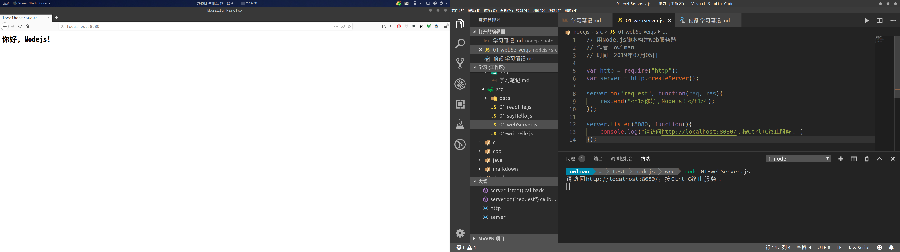
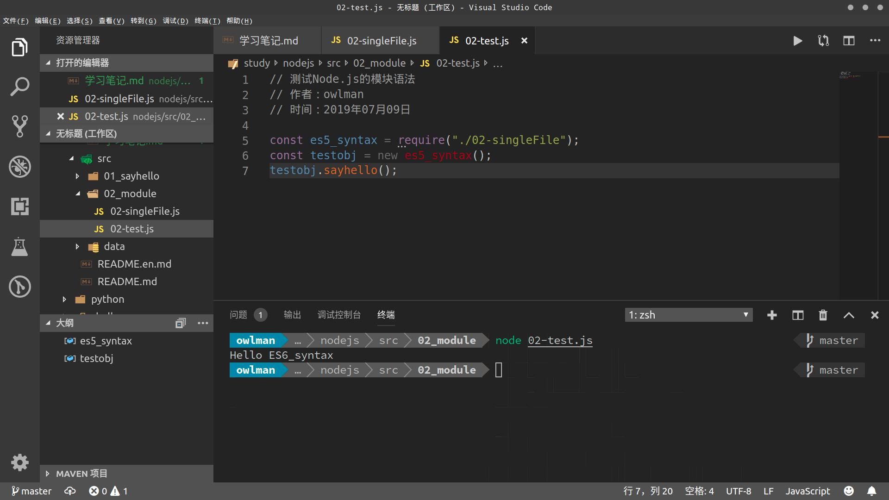
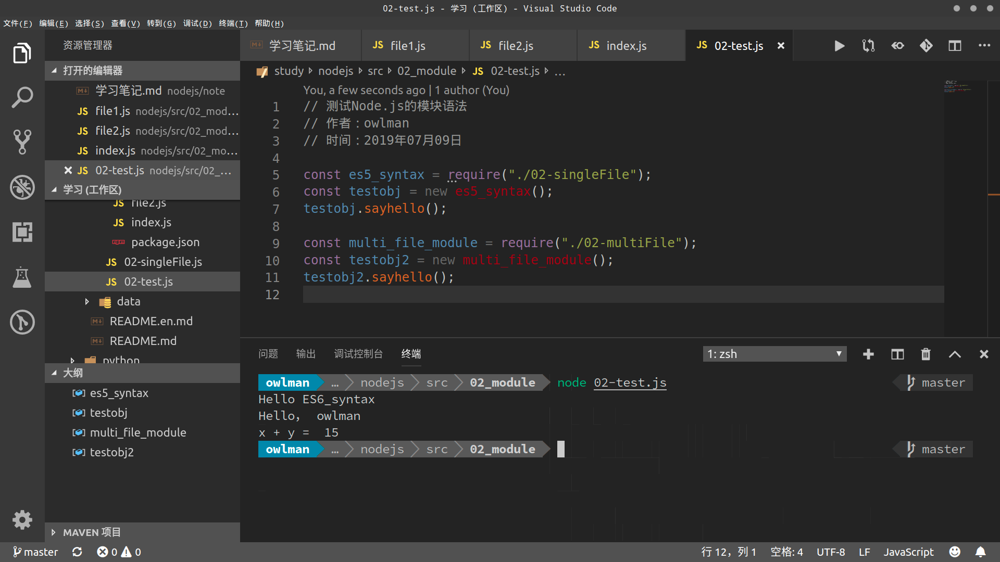
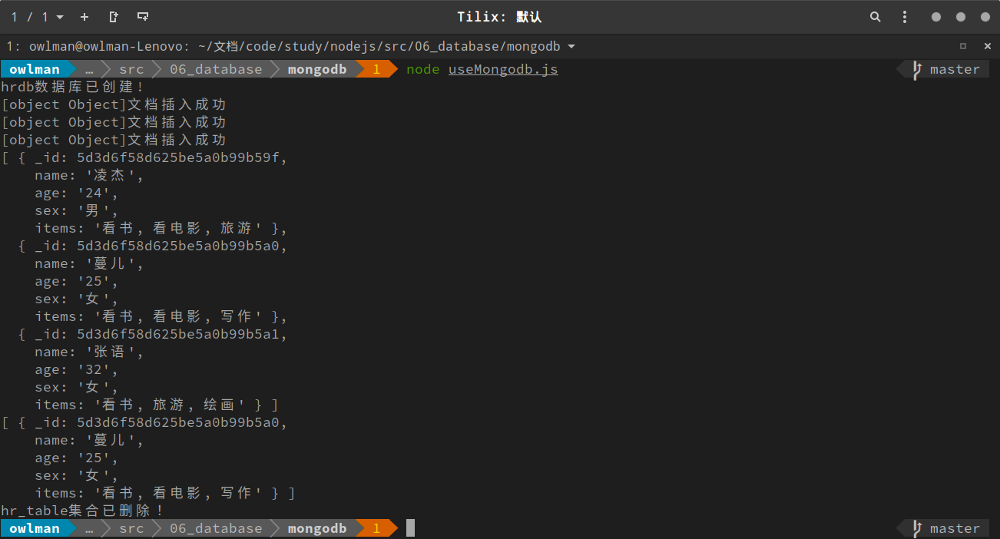

# Node.js学习笔记

## 学习计划

- 学习基础：
  - HTML、CSS、JavaScript
  - 浏览器、服务器、数据库
- 学习资料：
  - 视频教程：
    [黑马程序员-Nodejs 教学课程](https://www.bilibili.com/video/av27670326?p=1)
  - 书籍教材：
    [《node.js 实战》](https://book.douban.com/subject/25870705/)
  - 线上论坛：
    `[cnode论坛](https://cnodejs.org/)
- 学习目标：
  - 学习并体验全栈开发
  - 开发一个“网上书店”程序
  - 撰写《Web 开发入门导引》

## 第1部分 Node.js 概述

### Node.js 是什么

Node.js 是一个`JavaScript`运行时环境，它移植了 Google chrome 浏览器的 v8 引擎。作为在服务器端运行的`JavaScript`环境。

### Node.js 能做什么


### Node.js 的特性

Node.js 保留了`JavaScript`在浏览器端中所使用的大部分API，Node.js 的作者 Ryan Dahl 并没有改变这门语言本身的任何特性，它的编程模型依旧将基于作用域和原型链这些概念，这让 Node.js 在服务器端上的应用具备了以下这些与众不同的特性：

- **单一线程**：
  Node.js 沿用了`JavaScript`单一线程的执行特性。即在 Node.js 中，`JavaScript`的执行线程与其他线程之间同样也是无法共享状态的。单一线程的最大好处是不用像多线程编程那样处理很容易产生 bug 的同步问题，它从根本上杜绝了死锁问题，也避免了线程上下文交换所带来的性能上的开销。当然了，单一线程的执行方式也有它自身的弱点，譬如，它无法充分发挥多核处理器的性能、一个错误就会导致整个程序崩溃，以及执行大量计算时会因长期占用处理器而影响其他异步 I/O 的执行。

- **事件驱动**：
  在Web开发领域，`JavaScript`如今在浏览器端正承担了越来越重要的角色，其事件驱动的编程模型也逐渐深入人心。当然了，这种编程模型虽然具有轻量级、松耦合等优势，但在多个异步任务的场景下，由于程序中的各个事件是彼此独立的，它们之间的协作就成为了一个需要我们费心解决的问题。

- **异步编程**：
  在 Node.js 中，大部分操作都是以异步调用的方式来进行的。Node.js 的开发者们在其底层构建了许多异步 I/O 的 API，包括文件读取、网络请求等。这样一来，我们就可以很自然地在语言层面上并行地执行 I/O 操作，这可以使得程序中的每个调用都无须等待之前的 I/O 调用结束，这带来了极大的效率提升。例如，如果我们想要读取两个相互不依赖的文件，如果采用的是异步 I/O，其耗费的时间只取决于读取较慢的那个文件，而如果采用同步 I/O 的话，其耗时就是两个文件的读取时间之和了，异步操作模型带来的优势是显而易见的。

  除此之外，Node.js 对回调函数的支持也是其一大特色。回调函数是执行异步调用并接收其返回数据的最佳方式，当然了，这种方式也会导致代码的编写顺序与其具体执行顺序的不一致，对于很多习惯同步思路编程的人来说，阅读这样的代码会是一个不小的挑战。另外在流程控制方面，也会由于程序中穿插了各种异步方法和回调函数，它也远没有常规的同步方式那么一目了然，这也会给我们对程序的理解和调试带来一定的麻烦。

### Node.js 的安装

Node.js 的安装主要有两种方式，通常在 Windows 和 MacOS 下，我们会采用下载`.msi`和`.pkg`格式的安装包，使用安装向导来进行安装。而在 Linux 和 FreeBSD 这一类系统中，我们则往往会采用 apt 和 yum 这样的包管理器来安装。这两种方式都不复杂，下面以 Windows 和 Ubuntu 为代表，简单介绍一下这两种安装方法。

#### 使用安装包

在 Windows 下想要安装 Node.js，首先要选择一个合适的版本。打开 Node.js 的官网`https://nodejs.org/`，我们会看到有 LTS 和 Current 两种版本可供下载。LTS版即受到长期支持的版本，其组件通常都经历过了充分的测试，比较稳定，适合于正式的生产开发。而 Current 版本则是最新的版本，通常包含了最新纳入的新特性，比较适合想对 Node.js 本身进行研究的朋友。


下载完`.msi`格式的安装包之后，我们就可以打开安装包启动安装向导了。在安装的开始阶段，安装向导会要求我们设置一些选项，大多数时候只需采用默认选项，直接点击「Next」即可。只是在组件选择的页面中，需要注意一下，如果你对 Node.js 的组件并不熟悉，最好选择安装全部组件。另外，请记得点开下图中那个「add path」选项前面的`+`号，这样安装程序就会主动把 NodeJS 和 NPM 这两个模块的命令路径添加到系统环境变量里，这对初学者来说是非常方便的。


待一切选项设置完成之后，我们就可以点击下面的「Install」即可完成安装。


如果一切顺利，我们在Windows中打开`cmd`终端，在其中输入`node -v`命令并回车之后，应该就会看到相关的版本信息。


#### 使用包管理器

在 Ubuntu 这类 Linux 操作系统中，我们安装软件往往都会选择使用 apt 这一类的包管理器，简单而方便，依次执行以下命令即可：

```bash
 sudo apt update
 sudo apt install nodejs
 # 最新 的Node.js 已经集成了 npm，所以某些情况下是无需单独安装 npm 的，这具体还要取决于你使用的软件源。
 sudo apt install npm
```

除此之外，我们还能安装n管理器来管理 Node.js 的版本，其安装命令如下：

```bash
sudo npm install -g n
```

该工具的具体使用方式如下：

```bash
sudo n lts            # 长期支持
sudo n stable         # 稳定版
sudo n latest         # 最新版
sudo n 12.4.0         # 直接指定版本
sudo n                # 使用上下键切换已有版本
```

同样的，如果一切顺利，我们打开命令行终端，并在其中输入`node -v`命令并回车之后，应该就会看到相关的版本信息。

## 第2部分 基础示例

在这部分内容中，我们将会提供一些 Node.js 的基本用法示例。首先，我们要创建一个用于学习 Node.js 的文件夹，该文件夹下将设置有两个目录，其中`note`目录用于存放这篇笔记的`markdown`源码，而`src`目录则用于存放学习笔记中的示例代码。

### 示例1. 你好，Nodejs

由于Node.js只是`JavaScript`语言的运行时环境，所以它并不会限制`JavaScript`代码的具体运行形式。为了说明这一点，本示例将使用四种形式来说“Hello”。首先，我们要执行`mkdir src/01_sayhello`命令来创建这一示例的目录。

#### 1. 终端输出

创建第一个Node.js脚本，步骤如下：

1. 在`src/01_sayhello`目录下执行`touch 01-sayHello.js`命令。
2. 执行`vim 01-sayHello.js`命令打开该脚本文件。
3. 在`01-sayHello.js`脚本文件中输入如下代码：

    ```JavaScript
    // 第一个Node.js脚本
    // 作者：owlman
    // 时间：2019年07月03日

    var name = 'owlman'
    console.log('你好！', name)
    ```

4. 保存文件后，在`src/01_sayhello`目录下执行`node 01-sayHello.js`命令，结果如下：

    

#### 2. 文件读写

用 Node.js 脚本读文本文件，步骤如下：

1. 在`src/01_sayhello`目录下执行`touch 01-readFile.js`命令。
2. 在`src/data`目录下执行`touch text-data.txt`命令，并在其中输入以下内容：

    ```bash
    Hello，owlman，欢迎学习Nodejs。

    接下来，请读取下面这首诗：

    朝辞白帝彩云间，
    千里江陵一日还。
    两岸猿声啼不住，
    轻舟已过万重山。
    ```

3. 执行`vim 01-readFile.js`命令打开脚本文件，输入如下代码：

    ```JavaScript
    // 用Node.js脚本读取文本文件
    // 作者：owlman
    // 时间：2019年07月03日

    var fs = require('fs')
    fs.readFile('../data/text-data.txt', function(err, data) {
        if(err) {
            return console.error(err)
        }
        console.log(data.toString())
    })
    ```

4. 保存文件后，在`src/01_sayhello`目录下执行`node 01-readFile.js`命令，结果如下：

    

用 Node.js 脚本写文本文件，步骤如下：

1. 在`src/01_sayhello`目录下执行`touch 01-writeFile.js`命令。
2. 执行`vim 01-writeFile.js`命令打开脚本文件，输入如下代码：

    ```JavaScript
    // 用Node.js脚本写文本文件
    // 作者：owlman
    // 时间：2019年07月03日

    var fs = require('fs')
    var str = '你好，Nodejs！'

    fs.writeFile('../data/output.txt', str, function(err){
        if(err) {
            console.error(err)
        } else {
            console.log("文件写入成功!")
        }
    })
    ```

3. 保存文件后，在`src/01_sayhello`目录下执行`node 01-writeFile.js`命令，结果如下：

    

#### 3. Web服务

用 Node.js 脚本创建 Web 服务，步骤如下：

1. 在`src/01_sayhello`目录下执行`touch 01-webServer.js`命令。
2. 执行`vim 01-webServer.js`命令打开脚本文件，输入如下代码：

    ```JavaScript
    // 用Node.js脚本构建Web服务器
    // 作者：owlman
    // 时间：2019年07月05日

    var http = require('http')
    var server = http.createServer()

    server.on('request', function(req, res){
        res.end('<h1>你好，Nodejs！</h1>')
    })

    server.listen(8080, function(){
        console.log('请访问http://localhost:8080/，按Ctrl+C终止服务！')
    })
    ```

3. 保存文件后，在`src/01_sayhello`目录下执行`node 01-webServer.js`命令，并用浏览器访问`http://localhost:8080/`，结果如下：

    

#### 4. TCP服务

1. 在`src/01_sayhello`目录下执行`touch 01-tcpServer.js`命令。
2. 执行`vim 01-tcpServer.js`命令打开脚本文件，输入如下代码：

    ```JavaScript
    // 用Node.js脚本构建TCP服务器
    // 作者：owlman
    // 时间：2019年07月05日

    var net = require('net')
    var server = net.createServer(function (socket) {
        console.log('连接来自' + socket.remoteAddress)
        socket.end('你好，Nodejs！\n')
    })

    server.listen(7000, 'localhost', function(){
        console.log('TCP服务器监听 localhost 的 7000 端口，按 Ctrl+C 终止服务！')
    })
    ```

3. 保存文件后，在`src/01_sayhello`目录下执行`node 01-tcpServer.js`命令，并用`telnet localhost 7000`命令测试该服务器，结果如下：

    

### 示例2. 演示自定义模块及其使用方式

本示例将致力于演示 Node.js 的自定义模块语法以及部分 ES6 新增的语法。首先，我们要在`src`目录下执行`mkdir 02_module`命令来创建这一示例的目录。

#### 1. 单文件模块

1. 在`src/02_module`目录下执行`touch 02-singleFile.js`命令,创建脚本文件，并输入如下代码：

    ```JavaScript
    // 模拟Node.js的单文件模块
    // 作者：owlman
    // 时间：2019年07月09日

    class singleFile_module {
        constructor() {
            this.name = 'singleFile_module'
        }

        sayhello() {
            console.log('Hello', this.name)
        }
    }

    module.exports = singleFile_module
    ```

2. 在`src/02_module`目录下执行`touch 02-test.js`命令,创建脚本文件，并输入如下代码：

    ```JavaScript
    // 测试Node.js的模块语法
    // 作者：owlman
    // 时间：2019年07月09日

    const es5_syntax = require('./02-singleFile')
    const testobj = new singleFile_module()
    testobj.sayhello()
    ```

3. 保存文件后，在`src/02_module`目录下执行`node 02-test.js`命令，结果如下：

    

#### 2. 多文件模块

1. 在`src/02_module`目录下执行`mkdir 02-multiFile`命令，并进入到该目录中执行`npm init -y`命令，创建模块目录。

2. 在`src/02_module/02-multiFile`目录下执行`touch functions.js`命令，创建脚本文件，并输入如下代码：

    ```JavaScript
    function add(x,y){
        return x + y
    }

    exports.add = add
    ```

3. 在`src/02_module/02-multiFile`目录下执行`touch dataObj.js`命令，创建脚本文件，并输入如下代码：

    ```JavaScript
    const name = 'multFile_module'

    exports.name = name
    ```

4. 在`src/02_module/02-multiFile`目录下执行`touch index.js`命令，创建脚本文件，并输入如下代码：

    ```JavaScript
    // 模拟Node.js的多文件模块
    // 作者：owlman
    // 时间：2019年07月09日

    const func = require('./functions')
    const str = require('./dataObj')

    class multiFile_module {
        constructor(){
            this.func = func.add
            this.name = str.name
        }

        sayhello(){
            console.log('Hello', this.name)
            console.log('x + y = ', this.func(10,5))
        }
    }

    module.exports = multiFile_module
    ```

5. 在`src/02_module`目录下将`02-test.js`脚本修改如下：

    ```JavaScript
    // 测试Node.js的模块语法
    // 作者：owlman
    // 时间：2019年07月09日

    const singleFile_module = require(`./02-singleFile`)
    const testobj = new singleFile_module()
    testobj.sayhello()

    const multiFile_module = require(`./02-multiFile`)
    const testobj2 = new multiFile_module()
    testobj2.sayhello()
    ```

6. 保存所有文件后，在`src/02_module`目录下执行`node 02-test.js`命令，结果如下：

    

### 示例3. 模仿 Apache Web 服务器

本示例将致力于用 Node.js 模拟一个类似于 Apache 的 Web 服务器，处理浏览器端的请求，将相关的页面响应给浏览器。首先，我们要在`src`目录下执行`mkdir 03_likeApache`命令来创建这一示例的目录。然后执行以下步骤：

1. 在`src/03_likeApache`目录下执行`mkdir www`命令，创建网站目录，然后在其中创建`index.htm`和`login.htm`两个 HTML 文件以及一个名为`style.css`的 CSS 文件：
   - index.htm:

        ```HTML
        <!DOCTYPE html>
        <html lang="zh-cn">
            <head>
                <meta charset="utf-8" />
                <link rel="stylesheet" type="text/css" href="style.css" />
                <title>首页</title>
            </head>
            <body>
                <h1>你好,nodejs！</h1>
                <p> <a href="login.htm">请登录！</a> </p>
            </body>
        </html>
        ```

   - login.htm:

        ```HTML
        <!DOCTYPE html>
        <html lang="zh-cn">
            <head>
                <meta charset="utf-8" />
                <link rel="stylesheet" type="text/css" href="style.css" />
                <title>登录页面</title>
            </head>
            <body>
                <h1>你已经登录。。。</h1>
                <p> <a href="index.htm">回首页！</a> </p>
            </body>
        </html>
        ```

   - style.css:

        ```css
        body {
            background: gray;
        }
        ```

2. 在`src/03_likeApache`目录下执行`touch 03-webServer.js`命令，创建脚本文件，并输入如下代码：

    ```JavaScript
    // 用Node.js仿真Apache
    // 作者：owlman
    // 时间：2019年07月12日

    var http = require('http')
    var fs = require('fs')
    var server = http.createServer()

    server.on('request', function(req, res){
        var webRoot = './www'
        var url = req.url
        if (url === '/') {
            url = '/index.htm'
        }

        fs.readFile(webRoot+url, function(err, data){
            if (err) {
                console.error(err)
                return res.end('<h1>404 页面没找到！</h1>')
            }
            res.end(data)
        })
    })

    server.listen(8080, function(){
        console.log('请访问http://localhost:8080/，按Ctrl+C终止服务！')
    })
    ```

3. 保存所有文件后，在`src/03_likeApache`目录下执行`node 03-webServer.js`命令，结果如下：

    

### 示例4. 使用模版引擎生成网页

本示例将以生成个人信息页面为例，演示在服务器端基于 Node.js 使用模板引擎来生成网页。首先，我们要在`src`目录下执行`mkdir 04_useTemplating_engine`命令来创建这一示例的目录。然后执行以下步骤：

1. 在`src/04_useTemplating_engine`目录下执行`npm install art-template`命令，安装将`art-template`安装到当前示例项目中。

2. 在`src/04_useTemplating_engine`目录下执行`touch tpl.htm`命令，创建一个模版文件，具体如下：

    ```HTML
    <!DOCTYPE html>
    <html lang="zh-cn">
        <head>
            <meta charset="utf-8" />
            <link rel="stylesheet" type="text/css" href="style.css" />
            <title>{{ name }}的个人信息</title>
        </head>
        <body>
            <h1>{{ name }}的个人信息</h1>
            <table>
                <tr><td>姓名：</td><td>{{ name }}</td></tr>
                <tr><td>年龄：</td><td>{{ age }}</td></tr>
                <tr><td>性别：</td><td>{{ sex }}</td></tr>
                <tr>
                    <td>爱好：</td>
                    <td>{{ each items }} {{ $value }} {{ /each }}</td>
                </tr>
            </table>
        </body>
    </html>
    ```

3. 在`src/04_useTemplating_engine`目录下执行`touch 04-useTemplating_engine.js`命令，创建一个脚本文件，具体如下：

    ```JavaScript
    // 用Node.js生成动态页面
    // 作者：owlman
    // 时间：2019年07月16日

    var http = require('http')
    var fs = require('fs')
    var template = require('art-template')

    class human {
        constructor(name, age, sex, items=[])
        {
            this.name  = name
            this.age   = age
            this.sex   = sex
            this.items = items
        }
    }

    var server = http.createServer()

    server.on('request', function(req, res){
        var url = req.url
        var boy = null
        if (url === '/') {
            boy = new human('凌杰', '37', '男', ['看书', '看电影','旅游'])
        } else if (url === '/wang') {
            boy = new human('蔓儿', '25', '女', ['看书', '看电影','写作'])
        }

        if (boy === null) {
            return res.end('<h1>404 页面没找到！</h1>')
        }

        fs.readFile('./tpl.htm', function(err, data){
            if (err) {
                return res.end('<h1>404 没找到模版文件！</h1>')
            }

            const strHtml = template.render(data.toString(),{
                name : boy.name,
                age  : boy.age,
                sex  : boy.sex,
                items: boy.items
            })

            res.end(strHtml)
        })
    })

    server.listen(8080, function(){
        console.log('请访问http://localhost:8080/，按Ctrl+C终止服务！')
    })
    ```

4. 保存所有文件后，在`src/04_useTemplating_engine`目录下执行`node 04-useTemplating_engine.js`命令，结果如下：

    

### 示例5. Web 表单处理

本示例将致力于演示用 Node.js 处理 Web 表单，我们将会分别示范如何用`get`和`post`两种方法来处理表单的请求。首先，我们要在`src`目录下执行`mkdir 05_webForm`命令来创建这一示例的目录。

#### 1. get 方法

先用一个信息查询程序来演示一下如何处理使用`get`方法来发送请求的表单。首先，在`src/05_webForm`目录下执行`mkdir get_form`命令，并执行以下步骤：

1. 在`src/05_webForm/get_form`目录下执行`npm install art-template`命令，将`art-template`安装到当前示例项目中。

2. 在`src/05_webForm/get_form`目录下执行`touch index.htm`，创建一个模版文件，具体如下：

    ```HTML
    <!DOCTYPE html>
    <html lang="zh-cn">
    <head>
        <meta charset="UTF-8">
        <title>个人信息查询</title>
    </head>
    <body>
        <h1>个人信息查询</h1>
        <form action="/query" method="GET">
            <label for="message">请输入要查询的姓名：</label>
            <input type="text" name="qname" />
            <input type="submit" value="查询" />
        </form>
        <br />
        {{ if name }}
            <table>
                <caption>{{ name }}的个人信息</caption>
                <tr><td>姓名：</td><td>{{ name }}</td></tr>
                <tr><td>年龄：</td><td>{{ age }}</td></tr>
                <tr><td>性别：</td><td>{{ sex }}</td></tr>
                <tr>
                    <td>爱好：</td>
                    <td>{{ each items }} {{ $value }} {{ /each }}</td>
                </tr>
            </table>
        {{ else if query_error }}
            <h2>没有找到相关信息！</h2>
        {{ /if }}
    </body>
    </html>
    ```

3. 在`src/05_webForm/get_form`目录下执行`touch app.js`，创建一个脚本文件，具体如下：

    ```JavaScript
    // 用Node.js处理get表单
    // 作者：owlman
    // 时间：2019年07月15日

    var http = require('http')
    var fs = require('fs')
    var url = require('url')
    var template = require('art-template')

    class human {
        constructor(name, age, sex, items=[])
        {
            this.name  = name
            this.age   = age
            this.sex   = sex
            this.items = items
        }
    }

    var db = [
        new human('凌杰', '37', '男', ['看书', '看电影','旅游']),
        new human('蔓儿', '25', '女', ['看书', '看电影','写作']),
        new human('张语', '32', '女', ['看书', '旅游','绘画'])
    ]

    var server = http.createServer(function(req, res){
        var query = url.parse(req.url, true)
        var obj = null
        var query_error = false
        if (query.pathname === '/') {
            query_error = false
        }
        else if (query.pathname === '/query') {
            for(let i = 0; i < db.length; ++i) {
                if (db[i].name == query.query["qname"]) {
                    obj = db[i]
                }
            }
            if (obj === null ) {
                query_error = true
            }
        } else  {
            return res.end('<h1>404 页面没找到！</h1>')
        }

        fs.readFile('./index.htm', function(err, data){
            if (err) {
                return res.end('<h1>404 没找到模版文件！</h1>')
            }

            var strHtml = null
            if (obj !== null) {
                strHtml = template.render(data.toString(),{
                    name : obj.name,
                    age  : obj.age,
                    sex  : obj.sex,
                    items: obj.items,
                    query_error: query_error
                })
            } else {
                strHtml = template.render(data.toString(),{
                    name : false,
                    query_error: query_error
                })
            }
            res.end(strHtml)
        })
    })

    server.listen(8080, function(){
        console.log('请访问http://localhost:8080/，按Ctrl+C终止服务！')
    })
    ```

4. 保存所有文件后，在`src/05_webForm/get_form`目录下执行`node app.js`命令，结果如下：

    

#### 2. post 方法

先来演示如何处理使用`post`方法来发送请求的表单。首先，在`src/05_webForm`目录下执行`mkdir post_form`命令，并执行以下步骤：

1. 在`src/05_webForm/get_form`目录下执行`npm install art-template`命令，将`art-template`安装到当前示例项目中。

2. 在`src/05_webForm/post_form`目录下执行`touch index.htm`，创建一个模版文件，具体如下：

    ```HTML
    <!DOCTYPE html>
    <html lang="zh-cn">
    <head>
        <meta charset="UTF-8">
        <title>个人信息管理</title>
    </head>
    <body>
        <h1>个人信息管理</h1>
        <table>
            <caption>个人数据表</caption>
            <tr><th>姓名</th><th>年龄</th><th>性别</th><th>爱好</th></tr>
            {{ each db }}
            <tr>
                <td>{{ $value.name }} </td>
                <td>{{ $value.age }} </td>
                <td>{{ $value.sex }} </td>
                <td>{{ each $value.items }} {{ $value }} {{ /each }}</td>
            </tr>
            {{ /each }}
        </table>

        <form action="/add" method="POST">
        <table>
            <caption>录入新人员</caption>
            <tr><td>姓名：</td><td><input type="text" name="uname" /></td></tr>
            <tr><td>年龄：</td><td><input type="text" name="age"></td></tr>
            <tr><td>性别：</td><td><input type="text" name="sex"></td></tr>
            <tr><td>爱好：</td><td><input type="text" name="items"></td></tr>
        </table>
        <input type="submit" value="添加" />
        </form>
    </body>
    </html>
    ```

3. 在`src/05_webForm/post_form`目录下执行`touch app.js`，创建一个脚本文件，具体如下：

    ```JavaScript
    // 用Node.js处理post表单
    // 作者：owlman
    // 时间：2019年07月15日

    var http = require('http')
    var fs = require('fs')
    var url = require('url')
    var querystring = require('querystring')
    var template = require('art-template')

    class human {
        constructor(name, age, sex, items=[])
        {
            this.name  = name
            this.age   = age
            this.sex   = sex
            this.items = items
        }
    }

    var db = [
        new human('凌杰', '37', '男', ['看书', '看电影','旅游']),
        new human('蔓儿', '25', '女', ['看书', '看电影','写作']),
        new human('张语', '32', '女', ['看书', '旅游','绘画'])
    ]

    var server = http.createServer(function(req, res){
        var query = url.parse(req.url, true)
        var obj = null
        if (query.pathname === '/') {
            fs.readFile('./index.htm', function(err, data){
                if (err) {
                    return res.end('<h1>404 没找到模版文件！</h1>')
                }

                var strHtml = template.render(data.toString(),{
                    "db": db
                })

                res.end(strHtml)
            })
        }
        else if (query.pathname === '/add') {
            req.on('data', function(chunk) {
                var obj = querystring.parse(chunk.toString())
                db.push(new human(
                    obj['uname'],
                    obj['age'],
                    obj['sex'],
                    obj['items'].split('，'),
                ))
            })

            res.writeHead(302, {
                'location': `/`
            })

            res.end()
        } else  {
            return res.end('<h1>404 页面没找到！</h1>')
        }
    })

    server.listen(8080, function(){
        console.log('请访问http://localhost:8080/，按Ctrl+C终止服务！')
    })
    ```

4. 保存所有文件后，在`src/05_webForm/post_form`目录下执行`node app.js`命令，结果如下：

    

### 示例6. 数据库读写

本示例将示范`SQLite`、`MongoDB`这两种不同类型的数据库在 Node.js 中的使用方法。首先，我们要在`src`目录下执行`mkdir 06_database`命令来创建这一示例的目录。

#### 1. SQLite

`SQLite`是一个轻量级的关系型数据库，我们在这里用它来示范 Node.js 对关系型数据库的处理。首先，在`src/06_database`目录下执行`mkdir sqlite`命令，并执行以下步骤：

1. 在`src/06_database/sqlite`目录下执行`npm install sqlite3`命令，将`sqlite3`安装到当前示例项目中。

2. 在`src/06_database/sqlite`目录下执行`touch Sqlite.js`，创建一个脚本文件，具体如下：

    ```JavaScript
    // 在Node.js中使用sqlite
    // 作者：owlman
    // 时间：2019年07月20日

    var fs = require('fs')
    var sqlite3 = require('sqlite3').verbose()

    class SqliteDB {
        constructor(file) {
            this.db = new sqlite3.Database(file)
            var db_exist = fs.existsSync(file)

            if ( !db_exist ) {
                console.log('数据库文件创建成功！')
                fs.openSync(file, 'w')
            }
        }

        createTable(sql) {
            this.db.serialize(function() {
                this.run(sql, function(err) {
                    if( err !== null ) {
                        console.log('错误信息：' + err.message)
                        return false
                    }
                    return true
                })
            })
        }

        insertData(sql, objects) {
            this.db.serialize(function() {
                var stmt = this.prepare(sql)
                for ( var i = 0; i < objects.length; ++i ) {
                    stmt.run(objects[i])
                }

                stmt.finalize()
            })
        }

        queryData(sql, callback, message) {
            this.db.all(sql, function(err, rows){
                if( err !== null ) {
                    console.log('错误信息：' + err.message)
                    return false
                }

                if( callback ) {
                    callback(rows, message)
                }
                return true
            })
        }

        executeSql(sql) {
            this.db.run(sql, function(err) {
                if( err !== null ) {
                    console.log('错误信息：' + err.message)
                }
            })
        }

        close() {
            this.db.close()
        }
    }

    module.exports = SqliteDB
    ```

3. 在`src/06_database/sqlite`目录下执行`touch useSqlite.js`，创建一个脚本文件，具体如下：

    ```JavaScript
    // 在Node.js中使用sqlite
    // 作者：owlman
    // 时间：2019年07月20日

    var async = require('async')
    var SqliteDB = require('./Sqlite')
    var file = "HRDB.db"
    var sqliteDB = new SqliteDB(file)

    var arr = [
        ['凌杰', '24', '男', '看书, 看电影, 旅游'],
        ['蔓儿', '25', '女', '看书, 看电影, 写作'],
        ['张语', '32', '女', '看书, 旅游, 绘画']
    ]

    function dataDeal(objects, message) {
        console.log(message)
        for ( var i = 0; i < objects.length; ++i )  {
            console.log(objects[i])
       }
    }

    async.waterfall([ // 控制程序串行执行
        op => {
            // 创建表格
            var createTableSql = `
                create table if not exists HR_TABLE (
                    name  TEXT,
                    age   TEXT,
                    sex   TEXT,
                    items TEXT
                );`
            sqliteDB.createTable(createTableSql)
            op()
        },

        op => {
            // 插入数据
            var insertTileSql = `
                insert into HR_TABLE
                    (name, age, sex, items)
                    values(?, ?, ?, ?)`
            sqliteDB.insertData(insertTileSql, arr)
            op()
        },

        op => {
            // 查询数据
            var querySql = 'select * from HR_TABLE'
            sqliteDB.queryData(querySql, dataDeal, '初始数据')
            op()
        },

        op => {
            // 更新数据
            var updateSql = `update HR_TABLE set age = 37 where name = "凌杰"`
            sqliteDB.executeSql(updateSql)
            op()
        },

        op => {
            // 查询更新后的数据
            querySql = `select * from HR_TABLE`
            sqliteDB.queryData(querySql, dataDeal, '更新后数据')
            op()
        },

        op => {
            sqliteDB.close()
            op()
        }
    ])
    ```

4. 保存所有文件后，在`src/06_database/sqlite`目录下执行`node useSqlite.js`命令，结果如下：

    

#### 2. MongoDB

`MongoDB`是非关系型数据库的一个典型代表，我们在这里用它来示范 Node.js 对关系型数据库的处理。首先，在`src/06_database`目录下执行`mkdir mongodb`命令，并执行以下步骤：

1. 在`src/06_database/mongodb`目录下执行`npm install mongodb`命令，将`mongodb`包安装到当前示例项目中。

2. 在`src/06_database/mongodb`目录下执行`touch Mongodb.js`，创建一个脚本文件，具体如下：

    ```JavaScript
    // 在Node.js中使用mongodb
    // 作者：owlman
    // 时间：2019年07月21日

    var MongoClient = require('mongodb').MongoClient

    class MongoDB {
        constructor(url, dbName) {
            this.dbpath = url+'/'+dbName
            this.dbName = dbName

            MongoClient.connect(this.dbpath,
                                { useNewUrlParser: true },
                                function(err, db) {
                if ( err !== null ) {
                    console.log('错误信息1：' + err.message)
                    return false
                }
                console.log(dbName + "数据库已创建!")
                db.db(dbName)
                db.close()
            })
        }

        createCollection(collect) {
            var dbName = this.dbName

            MongoClient.connect(this.dbpath,
                                { useNewUrlParser: true },
                                function (err, db) {
                if ( err !== null ) {
                    console.log('错误信息2：' + err.message)
                    return false
                }
                var dbo = db.db(dbName)
                dbo.createCollection(collect, function (err, coll) {
                    if ( err !== null ) {
                        console.log('错误信息3：' + err.message)
                        return false
                    }
                    console.log(collect + "集合已创建!")
                    db.close()
                })
            })
        }

        insertData(collect, doc) {
            var dbName = this.dbName

            MongoClient.connect(this.dbpath,
                                { useNewUrlParser: true },
                                function(err, db) {
                if ( err !== null ) {
                    console.log('错误信息4：' + err.message)
                    return false
                }
                var dbo = db.db(dbName)
                dbo.collection(collect).insertOne(doc, function(err, res) {
                    if ( err !== null ) {
                        console.log('错误信息5：' + err.message)
                        return false
                    }
                    console.log(doc + "文档插入成功")
                    db.close()
                })
            })
        }

        queryAllData(collect) {
            var dbName = this.dbName

            MongoClient.connect(this.dbpath,
                            { useNewUrlParser: true },
                            function(err, db) {
                if ( err !== null ) {
                    console.log('错误信息6：' + err.message)
                    return false
                }
                var dbo = db.db(dbName)
                dbo.collection(collect). find({}).toArray(function(err, result) {
                    if ( err !== null ) {
                        console.log('错误信息7：' + err.message)
                        return false
                    }
                    console.log(result)
                    db.close()
                })
            })
        }

        queryDataFor(collect, querystr) {
            var dbName = this.dbName

            MongoClient.connect(this.dbpath,
                            { useNewUrlParser: true },
                            function(err, db) {
                if ( err !== null ) {
                    console.log('错误信息8：' + err.message)
                    return false
                }
                var dbo = db.db(dbName)
                dbo.collection(collect). find(querystr).toArray(function(err, result) {
                    if ( err !== null ) {
                        console.log('错误信息9：' + err.message)
                        return false
                    }
                    console.log(result)
                    db.close()
                })
            })
        }

        dropCollection(collect) {
            var dbName = this.dbName

            MongoClient.connect(this.dbpath,
                                { useNewUrlParser: true },
                                function (err, db) {
                if ( err !== null ) {
                    console.log('错误信息10：' + err.message)
                    return false
                }
                var dbo = db.db(dbName)
                dbo.dropCollection(collect, function(err, delOK) {  // 执行成功 delOK 返回 true，否则返回 false
                    if ( err !== null ) {
                        console.log('错误信息11：' + err.message)
                        return false
                    }
                    if ( delOK !== null ) {
                        console.log(collect + "集合已删除！")  
                    }
                    db.close()
                })
            })
        }

    }

    module.exports = MongoDB
    ```

3. 在`src/06_database/mongodb`目录下执行`touch useMongodb.js`，创建一个脚本文件，具体如下：

    ```JavaScript
    // 在Node.js中使用mongodb
    // 作者：owlman
    // 时间：2019年07月21日

    const async = require('async')
    const MongoDB = require('./Mongodb')
    const url = 'mongodb://localhost:27017'
    var arr = [
        ['凌杰', '24', '男', '看书, 看电影, 旅游'],
        ['蔓儿', '25', '女', '看书, 看电影, 写作'],
        ['张语', '32', '女', '看书, 旅游, 绘画']
    ]
    var dbObj = null

    async.waterfall([ // 控制程序串行执行
        op => {
            dbObj = new MongoDB(url, 'hrdb')
            op()
        },

        op => {
            async.each(arr, function(item, callback) {
                dbObj.insertData('hr_table', {
                    name  : item[0],
                    age   : item[1],
                    sex   : item[2],
                    items : item[3]
                })
                callback()
            })
            op()
        },

        op => {
            dbObj.queryAllData('hr_table')
            op()
        },

        op => {
            dbObj.queryDataFor('hr_table', { 'name' : '蔓儿'})
            op()
        },

        op => {
            dbObj.dropCollection('hr_table')
            op()
        }
    ])
    ```

4. 保存所有文件后，在`src/06_database/mongodb`目录下执行`node useMongodb.js`命令，结果如下：

    
